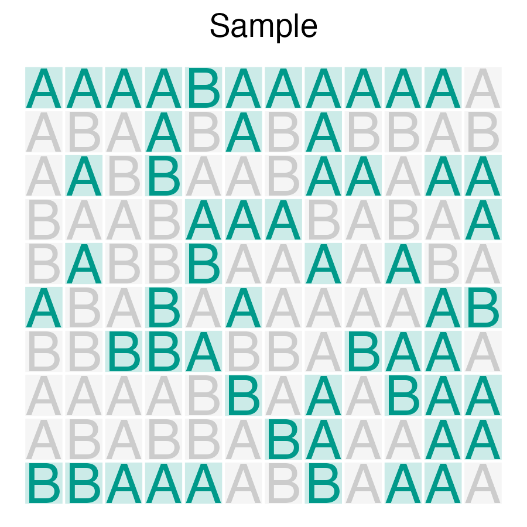
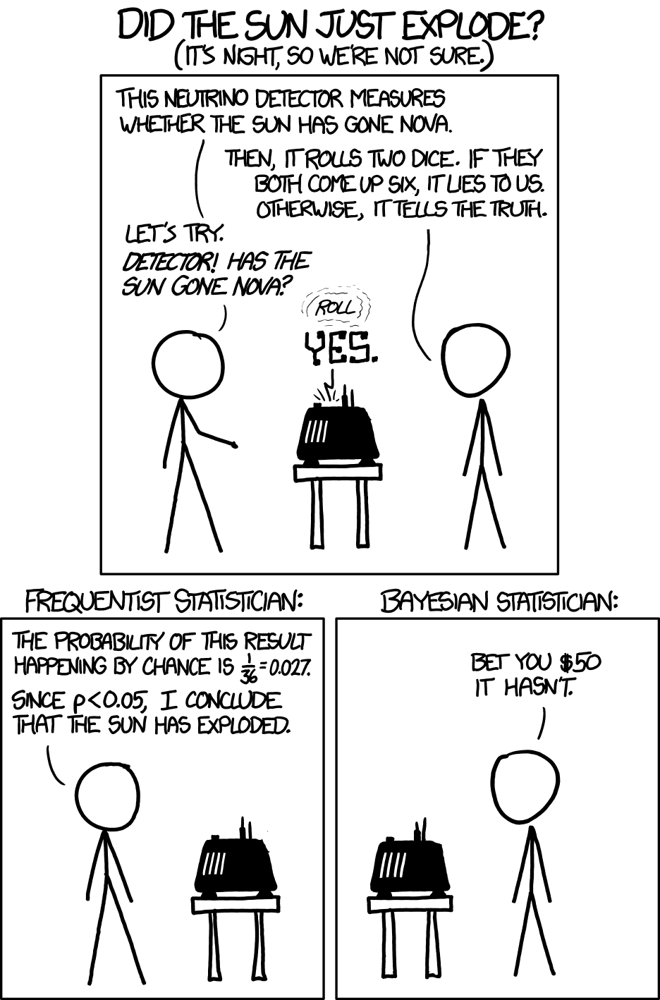
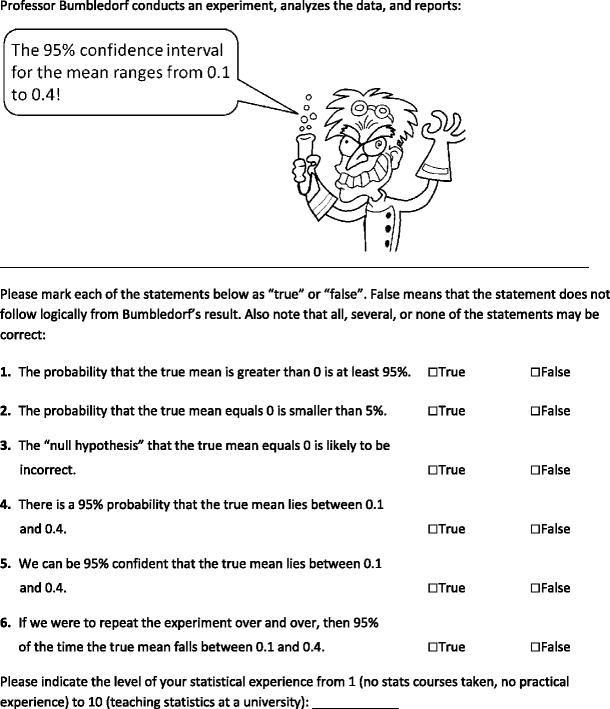
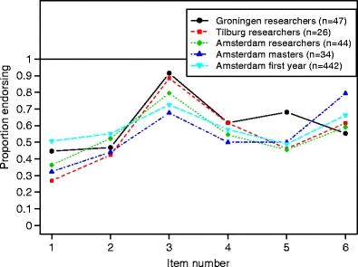

# Wozu Statistik?

```{r r-pckgs}
#| echo: false
#| message: false
library(tidyverse)
library(easystats)
library(nycflights13)
library(ggrepel)
library(gt)
library(dagitty)
library(knitr)

```


```{r r-setup}
#| echo: false
#| message: false
theme_set(theme_minimal())
#scale_color_okabeito()
scale_colour_discrete <- function(...) 
  scale_color_okabeito()
```


{width=10%}


## Lernsteuerung


@fig-modulverlauf gibt einen Überblick zum aktuellen Standort im Modulverlauf.
Nach Absolvieren des jeweiligen Kapitels sollen folgende Lernziele erreicht sein.

Sie können ...


- die drei Zielarten der Statistik nennen und beschreiben können
- die Definition von Inferenzstatistik sowie Beispiele für inferenzstatistische Fragestellungen nennen
- zentrale Begriffe der Inferenzstatistik nennen und in Grundzügen erklären
- den Nutzen von Inferenzstatistik nennen
- erläutern, in welchem Zusammenhang Ungewissheit zur Inferenzstatistik steht
- anhand von Beispielen erklären, was ein statistisches Modell ist
- die Grundkonzepte der Regression angeben
- Unterschiede zwischen frequentistischer ("klassischer") und Bayes-Inferenz benennen
- Vor- und Nachteile der frequentistischen vs. Bayes-Inferenz diskutieren
- Die grundlegende Herangehensweise zur Berechnung des p-Werts informell erklären


Bei @gelman2021, Kap. 1 findet sich eine Darstellung ähnlich zu der in diesem Kapitel.
Die Begleitliteratur ist nicht prüfungsrelevant; sie dient zur Vertiefung und als
Grundlage einer ausführlicheren Erläuterung des Stoffes.


Bereiten Sie sich im Eigenstudium auf dieses Kapitel vor.
Lesen Sie dazu folgende Themen:

- [Statistik 1, Kap. "Rahmen"](https://statistik1.netlify.app/010-rahmen)
- [Statistik 1](https://statistik1.netlify.app/), dort alle Inhalte aller Kapitel zum Thema "Modellieren" bzw. "Regression"
- [Statistik 1, Abschnitt zur Normalverteilung]()


Diese Begleitvideos helfen Ihnen bei der Vor- und Nachbereitung dieses Kapitels:

- [Video zur Inferenz, Teil 1](https://youtu.be/gcwWwBy0kPI)
- [Video zur Inferenz, Teil 2](https://https://youtu.be/QNMVi6IqQ90)


📺 [Wozu ist Statistik eigentlich da?](https://www.youtube.com/watch?v=gcwWwBy0kPI&list=PLRR4REmBgpIGgz2Oe2Z9FcoLYBDnaWatN&index=2)
Diese Frage haben Sie sich auch schon mal gestellt? 
Abb. @fig-goals gibt einen Überblick über die drei Zielarten der statistikbasierten wissenschaftlichen Forschung.^[Ziele existieren nicht "in echt" in der Welt. Wir denken sie uns aus.
Ziele haben also keine ontologische Wirklichkeit,
sie sind epistemologische Dinge (existieren nur in unserem Kopf).
Das heißt, dass man sich nach Belieben Ziele ausdenken kann.
Allerdings hilft es, wenn man andere Menschen vom Nutzen der eigenen Ideen überzeugen kann.]
Nach dieser Einteilung lassen sich drei Arten von Zielen unterscheiden: *Beschreiben*, *Vorhersagen* und *Erklären* [@shmueli2010].


## Die drei Zielarten der Statistik

### Überblick


#### 📄  *Beschreiben* (deskriptiv)

- Wie stark ist der (lineare) Zusammenhang $r$ von Größe und Gewicht (bei Erwachsenen) in meiner Stichprobe?
- Wie stark ist der (lineare) Zusammenhang $b$ von Lernzeit und Note (im Fach Statistik) in meinem Datensatz?
- Haben unsere Kunden bisher Webshop A oder B bevorzugt, laut unseren Daten?


#### 🔮 *Vorhersagen* (prädiktiv, prognostisch)

- Wie schwer ist wohl Herr X? Er ist ein deutscher erwachsener Mann der Größe 1,80m; mehr wissen wir nicht.
- Welche Note kann man erwarten, wenn man nichts für die Klausur lernt?
- Wie viel wird ein Kunde ausgeben, wenn er sich in der Variante *A* des Webshops aufhält?


#### 🔗 Erklären 

**Kausalinferenz:**

- Ist Größe eine Ursache von Gewicht (bei deutschen Männern)?
- Wenn ich 100 Stunden lerne, welche Note schreibe ich dann?

**Populationsinferenz:**

- Wie stark ist der (lineare) Zusammenhang $b$ von Lernzeit und Note (im Fach Statistik) in der Grundgesamtheit (nicht in der Stichprobe)?
- Bevorzugen unsere Kunden allgemein Webshop A oder B laut unseren Daten?


:::callout-note
*Erklärung* (Inferenz) ist zumeist das Erkenntnisziel wissenschaftlicher Studien.
Anhand der verwendeten statistischen Methode (z.B. Regressionsanalyse)
kann man *nicht* feststellen, zu welchem Erkenntnisziel die Studie gehört.
Um das Erkenntnisziel festzustellen, liest man sich die Forschungsfrage oder das Ziel der Studie durch.
:::


:::{#exm-ziele-stat}
### Beispiele für die Zielarten statistischer Analysen
- Beschreiben: “Wie groß ist der Gender-Paygap in der Branche X im Zeitraum Y?”
- Vorhersagen: Wenn eine Person, Mr. X, 100 Stunden auf die Statistikklausur lernen, welche Note kann diese Person dann erwarten?
- Erklären: Wie viel bringt (mir) das Lernen auf die Statistikklausur?$\square$
:::

Für die Wissenschaft ist *Erklären* das wichtigste Ziel. 
Bei wenig beackerten Wissenschaftsfeldern ist das *Beschreiben* ein sinnvoller erster Schritt.
*Vorhersagen* ist mehr für die Praxis als für die Wissenschaft relevant.

```{mermaid}
%%| label: fig-goals
%%| fig-cap: Eine Einteilung zentraler Ziele von statistischen Analysen
flowchart TD 
  A{Ziele} --> B(Beschreiben)
  A --> C(Vorhersagen)
  A --> D(Erklären)
  B --> E(Verteilung)
  B --> F(Zusammenhang)
  C --> H(Punktschätzung)
  C --> I(Bereichsschätzung)
  D --> J(Kausalinferenz)
  D --> K(Populationsinferenz)
```


### Zielart *Beschreiben*

Statistische Analysen mit dem Ziel zu beschreiben fassen die Daten zusammen (zu möglichst aussagekräftigen Kennzahlen).
Beschreibende Statistik nennt man auch *deskriptive Statistik*; Mittelwert, Korrelation und Regressionskoeffizienten sind typische Kennzahlen ("Statistiken");  s. @fig-beschreiben.


::: {#fig-beschreiben layout-ncol=2}

{#fig-desk width=50%}


{#fig-desk2 width=50%}

Beschreibende Statistik fasst eine oder mehr Variablen eines Datensatzes zu einer einzelnen Kennzahl zusammen.
:::

Der beschreibenden Statistik geht es *nicht* darum, 
Erkenntnisse zu ziehen, die über die Daten hinaus gehen.
So ist man in der beschreibenden Statistik nicht daran interessiert,
Aussagen über die zugrundeliegende Population anzustellen.

::: {#exm-desk}
In einem Hörsaal sitzen 100 Studis. Alle schreiben Ihre Körpergröße auf einen Zettel. Die Dozentin sammelt die Zettel ein und rechnet dann den Mittelwert der Körpergröße der anwesenden Studierenden aus. Voilà: Deskriptive Statistik!$\square$
:::


:::{#def-desk}
### Deskriptivstatistik
*Deskriptivstatistik* fasst Merkmale aus einer Stichprobe zu Kennzahlen (Statistiken) zusammen.
:::


### Zielart *Vorhersagen*

Beim Vorhersagen versucht man, auf Basis von Daten, 
gegeben bestimmter Werte der UV den Wert einer AV vorherzusagen, s. @fig-vorhersagen.

:::{#exm-toni-lernt}
### Ali lernt für die Klausur
Oh nein, die Klausur im Fach Statistik steht an. 
Ali lernt ziemlich viel. 
Wie viel Punkte (von 100 möglichen) wird er wohl erzielen?
Ziehen wir ein einfaches statistisches Modell zur Rate,
um eine Vorhersage für den "Klausurerfolg" von Ali zu erhalten.
Wir können vom Modell eine einzelne Zahl (83) als Punkt-Schätzwert bzw. Vorhersagewert erhalten oder einen Schätzbereich (80-86 Punkte). $\square$
:::

Hier ist das Regressionsmodell für Ali (`lm_toni`), s. @lst-toni.

```{r}
#| lst-label: lst-toni
#| lst-cap: Regressionsmodell für Klausurerfolg als Funktion der Lernzeit (`lm_toni`)
noten2 <- read.csv("data/noten2.csv")
lm_toni <- lm(y ~ x, data = noten2)
```


```{r lm1-b0-b1}
#| echo: false

lm1_b0 <- coef(lm_toni)[1]
lm1_b2 <- coef(lm_toni)[2]

toni_punkte <- predict(lm_toni, newdata = data.frame(x=42))
toni_vorhersageintervall <- predict(lm_toni, newdata =  data.frame(x=42), 
                                    interval = "confidence", level = 0.95)
```


```{r fig-noten}
#| label: fig-vorhersagen
#| echo: false
#| fig-cap: "Noten und Lernzeit: Rohdaten (a) und mit Modell (b). Mittelwerte sind mit gestrichelten Linien eingezeichnet. Die Vorhersage für Ali ist farbig markiert. Ali hat 42 Stunden gelernt für die Klausur; das Modell sagt ihm 83 Punkte (von 100) bzw. einen Bereich von 80 bis 86 Punkten voraus."
#| layout-ncol: 2
#| fig-subcap: 
#|   - "Regressionsgerade mit Punkt-Vorhersage für Ali"
#|   - "Regressionsgerade mit Vorhersagebereich (und herangezoomt) für Ali"

#noten2 <- read.csv(noten2, "data/noten2.csv")


p_toni_streudiagramm <-
ggplot(noten2) +
  aes(x, y) +
  geom_point() +
  labs(x = "Lernzeit",
       y = "Klausurpunkte") +
  theme_minimal() +
  theme_large_text()

p_toni_punktschaetzung <- 
  noten2 %>% 
  ggplot(aes(x, y)) +
  geom_point() +
  geom_vline(xintercept = mean(noten2$x), linetype = "dashed", color = "grey") +  
  geom_hline(yintercept = mean(noten2$y), linetype = "dashed", color = "grey") +   
  geom_abline(slope = coef(lm_toni)[2], intercept = coef(lm_toni)[1], color = modelcol, size = 1.5) +
  theme_minimal() +
  annotate("label", x = mean(noten2$x), y = -Inf, 
           label = paste0("MW: ", round(mean(noten2$x))), vjust = "bottom") +
  annotate("label", y = mean(noten2$y), x = -Inf, 
           label = paste0("MW: ", round(mean(noten2$y))), hjust = "left")   +
  annotate("point", x = 42, y = toni_punkte, color = ycol,
           alpha = .7, size = 3) +
  scale_x_continuous(breaks = c(20, 40, 60, 80, 100)) +
  labs(x = "Lernzeit",
       y = "Klausurpunkte") +
  theme_large_text() +
  geom_label_repel(data = data.frame(x = 42, y = toni_punkte), label = "Ali",
       force = 20,
                      box.padding = unit(1, "lines"),
                      point.padding = unit(1, "lines"),
                      segment.color = "grey50",
                      segment.size = 1,
                      arrow = arrow(length = unit(0.01, "npc")),
                      # Styling to create a label-like appearance
                      bg.color = "white",       # Background color of the label
                      color = "black",           # Text color
                      fill = "white",          # Alternative way to set background
                      alpha = 0.8,             # Transparency of the background
                      segment.alpha = 1,     # Transparency of the segment
                     
                      size = 6)  +               # Adjust text size
 theme(plot.margin = margin(1, 1, 1, 1, "cm"))

p_toni_punktschaetzung

p_toni_punktschaetzung +
  annotate("errorbar",
           x = 42, y = toni_punkte,
           xmin = 42, xmax = 42,
           ymin = toni_vorhersageintervall[1, "lwr"],
           ymax = toni_vorhersageintervall[1, "upr"],
           color = ycol) +
  coord_cartesian(xlim = c(32, 52), 
                  ylim = c(75, 87))
```


### Zielart *Erklären* -- Populationsinferenz


<!-- TODO: -->
<!-- Attentio Grabber zum Einstieg -->
<!-- An Vorwissen anknüpfen -->
<!-- -- gilt auch für übrige Kapitel und übrige Bücher -->


<!-- ### Inferenz als Generalisieren -->


📺 [Was ist Inferenz?](https://www.youtube.com/watch?v=QNMVi6IqQ90&list=PLRR4REmBgpIGgz2Oe2Z9FcoLYBDnaWatN)


Populationsinferenz ist das Schließen von der Stichprobe auf die Grundgesamtheit

Statistische Populationsinferenz -- meist kurz als *Inferenz* bezeichnet -- hat zum Ziel, 
vom Teil aufs Ganze zu schließen, bzw. vom Konkreten auf das Abstrakte.
In der Datenanalyse heißt das: Was sagt meine Datensatz, der auf einer Stichprobe beruht,
über die zugrundeliegende Grundgesamtheit aus?

:::{exr-stipro}
Typischerweise untersuchen im Rahmen einer statistischen Analyse eine *Stichprobe*, 
wie z.B. Ihr Freundeskreis, der leichtsinnig genug war, 
auf Ihre WhatsApp-Nachricht "Tolle Studie zu dem Geheimnis des Glücks!!!" zu klicken.
Ihr Freundeskreis ist ein *Teil* der Menschen (z.B. aus Deutschland), also eine Stichprobe.
Schauen wir uns den Unterschied zwischen Stichprobe und Population näher an. $\square$
:::

Stichprobe vs. Population


Nehmen wir an, wir möchten herausfinden, 
wie groß der Anteil der R-Fans in der Grundgesamthit (synonym: Population) aller Studierenden ist. 
Den Anteil der F-Fans bezeichnen wir der Einfachheit halber hier mit `A`^[~~Meistens~~ Manchmal darf man bei der Statistik nicht nach einem tieferen Sinn suchen. Ist Statistik eine Art moderne Kunst?].

Das *Grundproblem der Inferenzstatistik* ist, dass wir an Aussagen zur Grundgesamtheit interessiert sind, aber nur eine Stichprobe, also einen Ausschnitt oder eine Teilmenge der Grundgesamtheit (synonym: Population) vorliegen haben.

Wir müssen also den Anteil der R-Fans *in der Population* auf Basis des Anteils *in der Stichprobe* schließen:
Wir verallgemeinern oder generalisieren von der Stichprobe auf die Grundgesamtheit, s. Abb. @fig-pop-sample.


:::: {#fig-pop-sample layout-ncol=2}





Population vs. Stichprobe. Die Stichprobe entnimmt einen *Teil* der Daten der Population. Autor: Karsten Lübke. Lizenz: OEM.
::::


Häufig ist das praktische Vorgehen recht simpel: 
Ah, in unserer Stichprobe sind 42% R-Fans!^[Manch einer hätte mit mehr gerechnet; andere mit weniger...]. 
Man schreibt: $p = 0.42$ (`p` wie `proportion`, engl. für "Anteil"). 
Die Stichprobe sei repräsentativ für die Grundgesamtheit aller Studierender. 
Messerscharf schließen wir:
In der Grundgesamtheit ist der Anteil der R-Fans auch 42%, $\pi=0.42$.


:::callout-note
Wir verwenden lateinische Buchstaben (p), um Kennzahlen einer Stichprobe zu benennen, und griechische ($\pi$) für Populationen.$\square$
:::


:::{#def-inf}
### (Populations-)Inferenzstatistik
*Populations-Inferenzstatistik* -- meist kurz als *Inferenzstatistik* bezeichnet -- 
ist ein Verfahren zum Schließen von Statistiken (eine Kennzahl einer Stichprobe)
auf *Parameter* (eine Kennzahl einer Grundgesamtheit).
Inferenz bedeutet Schließen bzw. Schlussfolgern: 
auf Basis von vorliegenden Wissen wird neues Wissen generiert.
Inferenzstatistik ist ein Verfahren, das mathematische Modelle (oft aus der Stochastik) 
verwendet, 
um ausgehend von einer bestimmten Datenlage auf allgemeine Aussagen zu schließen.
Wir unterscheiden zwei Hauptarten der Inferenzstatistik: 1. Populationsinferenz, 2. Kausalinferenz $\square$
:::


:::{#exr-inf}
🏋️️ Heute Nacht vor dem Schlafen wiederholen Sie die Definition
. Üben Sie jetzt schon mal.$\square$
:::


Für jede beliebige Statistik (Kennzahl von Stichprobendaten) kann man die Methoden der Populationsinferenz verwenden, 
um den zugehörigen Kennwert (Parameter) der Population zu bestimmen, 
s. Tabelle @tbl-kennwerte. 
Da man die Parameter der Population so gut wie nie sicher kennt 
(schließlich
hat man meist nur Auszüge, Teile der Population, also Stichproben),
muss man sich mit *Schätzwerten* begnügen.


```{r}
#| echo: false
#| label: tbl-kennwerte
#| tbl-cap: Bezeichnungen für Kennwerte
#| message: false
x <- tribble(
    ~Kennwert, ~Stichprobe, ~`Grundgesamtheit (Aussprache)`, ~Schätzwert,
   "Mittelwert", "$\\bar{X}$", "$\\mu$ (mü)" ,      "$\\hat{\\mu}$",
  "Streuung",     "$sd$",      "$\\sigma$ (sigma)", "$\\hat{\\sigma}$",
  "Anteil", "$p$", "$\\pi$ (pi)", "$\\hat{\\pi}$",
  "Korrelation", "$r$", "$\\rho$ (rho)", "$\\hat{\\rho}$" ,
  "Regression", "$b$", "$\\beta$ (beta)", "$\\hat{\\beta}$"

)

knitr::kable(x, escape = FALSE, booktabs = TRUE, format = "simple") 
```


Für Statistiken (Daten einer Stichprobe) verwendet man *lateinische* Buchstaben; 
für Parameter (Population) verwendet man *griechische* Buchstaben.


:::{#exr-greek}
🏋️ Geben Sie die griechischen Buchstaben für typische Statistiken an. Ohne auf die Tabelle zu schauen.😜$\square$!
:::


Meist begnügt man sich  beim Analysieren von Daten nicht mit Aussagen für eine Stichprobe, sondern will auf eine Grundgesamtheit verallgemeinern.

Leider sind die Parameter einer Grundgesamtheit zumeist unbekannt, daher muss man sich mit *Schätzungen* begnügen.
Schätzwerte werden mit einem "Dach" über dem Kennwert gekennzeichnet, s. letzte Spalte in @tbl-kennwerte.


In der angewandten Forschung und im praktischen Leben interessieren häufig Fragen wie:
"Welche Entscheidung ist (wahrscheinlich) besser?".
Da bekanntlich (fast) keine Aussagen sicher sind, spielt *Wahrscheinlichkeit* 
eine wichtige Rolle in den Forschungsfragen bzw. in deren Antworten.

:::callout-note
Wahrscheinlichkeit wird oft mit *Pr* oder *p* abgekürzt, für engl. *probability*.$\square$
:::


:::{#exm-inf}
Sie testen zwei Varianten Ihres Webshops (V1 und V2), die sich im Farbschema unterscheiden und ansonsten identisch sind: Hat das Farbschema einen Einfluss auf den Umsatz?

Dazu vergleichen Sie den mittleren Umsatz pro Tag von V1 vs. V2, $\bar{X}_{V1}$ und $\bar{X}_{V2}$. 
Die Mittelwerte unterscheiden sich etwas, $\bar{X}_{V1} > \bar{X}_{V2}$. 
Sind diese Unterschiede "zufällig" oder "substanziell"? Gilt also $\mu_{V1} > \mu_{V2}$ oder gilt $\mu_{V1} \le \mu_{V2}$? 
Wie groß ist die Wahrscheinlichkeit $Pr(\mu_{V1} > \mu_{V2})$?
:::


:::{#exr-regr-koeff-zielart}
### Peer Instruction: Regressionskoeffizienten

Eine Regressionsgerade wird durch zwei Koeffizienten festgelegt: ihren Achsenabschnitt, $\beta_0$, sowie ihre Steigung, $\beta_1$. Berechnet man also eine Regressionsgerade, so verfolgt man damit welche Zielart der Statistik?

A) Beschreiben
B) Vorhersagen
C) Erklären - Kausal
D) Erklären - Population
E) Alle der oben genannten sind möglich
F) Keine der oben genannten $\square$
:::


## Modellieren

### Modellieren als Grundraster des Erkennens


In
In der Wissenschaft -- wie auch oft in der Technik, Wirtschaft oder im Alltag --
betrachtet man einen Teil der Welt näher, 
meist mit dem Ziel, eine Entscheidung zu treffen, was man tun wird oder mit dem Ziel, etwas zu lernen.
Nun ist die Welt ein weites Feld. 
Jedes Detail zu berücksichtigen ist nicht möglich.
Wir müssen die Sache vereinfachen: 
Alle Informationen ausblenden, die nicht zwingend nötig sind.
Aber gleichzeitig die Strukturelemente der wirklichen Welt, 
die für unsere Fragestellung zentral sind, beibehalten.


Dieses Tun nennt man *Modellieren*: Man erstellt sich ein Modell.

:::{#def-model}
### Modell
Ein Modell ist ein vereinfachtes Abbild der Wirklichkeit.$\square$
:::

Der Nutzen eines Modells ist, einen (übermäßig) komplexen Sachverhalt zu vereinfachen oder überhaupt erst handhabbar zu machen.
Man versucht zu vereinfachen, 
ohne Wesentliches wegzulassen. 
Der Speck muss weg, sozusagen. Das Wesentliche bleibt.
Auf die Statistik bezogen heißt das,
dass man einen Datensatz dabei so zusammenfasst,
damit man das Wesentliche erkennt.

Was ist das "Wesentliche"? 
Oft interessiert man sich für die Ursachen eines Phänomens. 
Etwa: "Wie kommt es bloß, dass ich ohne zu lernen die Klausur so gut bestanden habe?"^[Das ist natürlich nur ein fiktives, 
komplett unrealistisches Beispiel, das auch unklaren Ursachen den Weg auf diese Seite gefunden hat.]
Noch allgemeiner ist man dabei häufig am Zusammenhang von `X ` und `Y` interessiert, 
s. @fig-xy, die ein Sinnbild von statistischen Modellen wiedergibt.


:::{#fig-xy fig-align="center"}


```{mermaid}
flowchart LR
X --> Y


X1 --> Y2
X2 --> Y2
```

oben: Sinnbild eines einfachen statistischen Modells (eine UV, eine AV); unten: Sinnbild eines statistischen Modells, mit zwei UV


:::


Man kann @fig-xy als ein Sinnbild einer (mathematischen) Funktion lesen.

:::{#def-fun}
### Funktion
Eine mathematische Funktion $f$ setzt zwei Größen in Beziehung. $\square$
:::

In Mathe-Sprech: 
$f: X \rightarrow Y$, lies: "$f$ bildet $X$ auf $Y$ ab."

oder:
$y = f(x)$, lies: "Y ist eine Funktion von X". $\square$


Die Größe des Zusammenhangs von $X$ und $Y$ in $f$ bezeichnet man als *Effekt* von $X$ auf $Y$.

:::{#def-effekt}
### Effekt
Der Begriff Effekt im statistisch-wissenschaftlichen Sinn bezeichnet die Größe des statistischen Zusammenhangs
(oder der Differenz) zwischen UV und AV in einem Modell,
die über den zufälligen Erwartungswert hinausgeht.
Effekt ist nicht unbedingt kausal zu verstehen. $\square$
:::


Es hört sich zugespitzt an, aber eigentlich ist fast alles, 
was man tut, Modellieren:
Wenn man den Anteil der R-Fans in einer Gruppe Studierender ausrechnet,
macht man sich ein Modell:
man vereinfacht diesen Ausschnitt der Wirklichkeit anhand einer statistischen Kennzahl,
die das forschungsleitende Interesse zusammenfasst.
Die Statistik kann man verstehen als ein Verfahren, dass wissenschaftliche Modelle in statistische übersetzt 
und letztere dann einer empirischen Analyse unterzieht.
Alle statistischen Ergebnisse beruhen auf Modelle und sind nur insoweit gültig, wie das zugrundeliegende Modell gültig ist.


### Regression zum Modellieren

Einflussreiche Leute schwören auf die Regressionsanalyse (@fig-gandalf).

{width="50%" #fig-gandalf fig-align="center"}


::::: {.content-visible when-format="html"}

@fig-linfun zeigt ein interaktives Beispiel einer linearen Funktion. 
Sie können Punkte per Klick/Touch hinzufügen.


:::{#fig-linfun}

::: {.figure-content}




:::

Interaktives Beispiel für eines lineares Modell. Fügen Sie Punkte per Klick/Touch hinzu.

::::
:::::


Alternativ können Sie [diese App](https://gallery.shinyapps.io/simple_regression/) nutzen,
Regressionskoeffizienten, Steigung (slope) und Achsenabschnitt (Intercept), zu optimieren.
Dabei meint "optimieren", die Abweichungen (Residuen, Residualfehler; die roten Balken in der App) zu minimieren.^[<https://gallery.shinyapps.io/simple_regression/>]


[Hier](https://shinyapps.org/showapp.php?app=https://shiny.psy.lmu.de/felix/lmfit&by=Felix%20Sch%C3%B6nbrodt&title=Find-a-fit!&shorttitle=Find-a-fit!) finden Sie eine App, die Ihnen gestattet, selber Hand an eine Regressionsgerade zu legen.


:::{#exr-setosa-vis}
### VERTIEFUNG Regression mit Animationen erklärt
Lesen Sie [diesen Post](https://setosa.io/ev/ordinary-least-squares-regression/), 
der Ihnen mit Hilfe von Bildern und Animationen (okay, und etwas) Text die Grundlagen der Regressionsanalyse erklärt.$\square$
:::


Die Regression ist eine Art Schweizer Taschenmesser der Statistik: Für vieles gut einsetzbar.
Anstelle von vielen verschiedenen Verfahren des statistischen Modellierens kann man (fast) immer die Regression verwenden.
Das ist nicht nur einfacher, sondern auch mathematisch schöner. 
Wir werden im Folgenden stets die Regression zum Modellieren verwenden.
Dann wenden wir die Methoden der Inferenz auf die Kennzahlen der Regression an.


:::callout-note
Regression + Inferenz = 💖
:::


Alternativ zur Regression könnte man sich in den Wald der statistischen Verfahren begeben, [wie hier von der Uni Münster als Ausschnitt (!) aufgeführt](https://web.archive.org/web/20091029162244/http://www.wiwi.uni-muenster.de/ioeb/en/organisation/pfaff/stat_overview_table.html).
Auf dieser Basis kann man meditieren,
welches statistischen Verfahren man für eine bestimmte Fragestellung verwenden sollte, s. @fig-choose-test.
Muss man aber nicht -- man kann stattdessen die Regression benutzen.


:::callout-note
Es ist meist einfacher und nützlicher, die Regression zu verwenden, anstelle der Vielzahl von anderen Verfahren (die zumeist Spezialfälle der Regression sind). In diesem Kurs werden wir für alle Fragestellungen die Regression verwenden.^[Wie Jonas [Kristoffer Lindeløv](https://lindeloev.github.io/tests-as-linear/) uns erklärt, sind viele statistische Verfahren, wie der sog. t-Test Spezialfälle der Regression.]$\square$
:::


:::{#fig-regr-oder-wald layout-ncol=2}

{#fig-regrtext}

{#fig-choose-test}

Wähle die Regression. Oder den Wahl der Verfahren. Spoiler: Nimm lieber die Regression.
:::


:::{#exm-spezialfaelle-regr}
Typische *Spezialfälle* der Regression sind 

- t-Test: UV: zweistufig nominal, AV: metrisch
- ANOVA: UV: mehrstufig nominal, AV: metrisch 
- Korrelation: Wenn UV und AV z-standardisiert sind (d.h. Mittelwert von 0 und Standardabweichung von 1 haben), dann ist die Korrelation gleich dem Regressionskoeffizienten $\beta_1$ (bei einer einfachen Regression mit einer einzigen UV). $\square$
:::


<!-- {#fig-lindeloev} -->


@fig-regr-rules zeigt die Regressionsgleichung in voller Pracht.
Links sieht man eine einfache Regression mit `hp` als UV (`X`, auch: Prädiktor) und `mpg` als AV (`Y`).
Das rechte Teildiagramm zeigt eine multiple Regression mit den UVs `hp` und `am`.^[Der Datensatz `mtcars` wird gerne als Studienobjekt verwendet, da er einfach ist und für viele Beispiele geeignet. 
Wenn Sie sich einen Sachverhalt an einem einfachen Datensatz vergegenwärtigen wollen, bietet sich auch der Datensatz `mtcars` an. 
Zudem ist er "fest in R eingebaut"; mit `data(mtcars)` können Sie ihn verfügbar machen.]
Im einfachsten Fall sind die vom Modell vorhergesagten (geschätzten) Werte, $\hat{y}$, durch eine einfache Gerade beschrieben, s. @fig-regr-rules, links.
In allgemeiner Form schreibt man die Regressionsgleichung als lineare Gleichung, d.h. in Form einer Gerade, s. @thm-lm.


:::{#thm-lm}

### Lineares Modell (Regressionsgleichung)

$$y = \beta_0 + \beta_1 x_1 + \ldots + \beta_k x_k + \epsilon$$

Man nennt alle $\beta_0, \beta_1, \beta_2, ...$ die  *Regressionsgewichte* (*Koeffizienten* oder *Parameter*) des Modells [@gelman2021].
Dabei ist $\beta_0$ der *Achsenabschnitt* (eng. intercept) und $\beta_1$ die *Steigung* der Regressionsgeraden.
$\square$
:::


Anhand von @thm-lm erkennt man auch, warum man von einem *linearen Modell* spricht: 
Y wird als gewichteter Mittelwert mehrerer Summanden berechnet.

Eine Regressionsgerade ist durch zwei Parameter festgelegt: den Achsenabschnitt, $\beta_0$ und die Steigung, $\beta_1$, s. @fig-regr-rules.


```{r}
#| message: false
#| eval: true
#| echo: false
#| layout-ncol: 2
#| label: fig-regr-rules
#| fig-cap: Die Regressionsgerade in voller Pracht
#| fig-subcap: 
#|   - "Einfache Regression (eine UV: hp)"
#|   - "Multiple Regression (zwei UV: hp und am)"
data(mtcars)

mtcars$am <- factor(mtcars$am)

ggplot(mtcars) +
  aes(x = hp, y = mpg) +
  geom_point() +
  geom_smooth(method = "lm") +
  theme_minimal()

ggplot(mtcars) +
  aes(x = hp, y = mpg, color = am) +
  geom_point() +
  geom_smooth(method = "lm") +
  theme_minimal() +
  scale_color_okabeito() +
  theme(legend.position = c(0.9, .90))
```


## Populationsinferenz 

:::{#def-popinf}
### Populationsinferenz
*Populationsinferenz* (auch Inferenzstatistik oder schließende Statistik genannt) 
ist der Teilbereich der Statistik, der sich damit befasst, 
von den Daten einer begrenzten Stichprobe auf eine zugrundeliegende Grundgesamtheit (Population) zu verallgemeinern (zu schließen). $\square$
:::

Deskriptivstatistik (Beschreiben) und Inferenzstatistik (Erklären) gehen Hand in Hand:
Mit der Deskriptivstatistik berechnet man Statistiken zur Stichprobe.
Dabei resultiert die Stichprobe durch eine zufällige Auswahl von Objekten aus der Grundgesamtheit.
Mit der Inferenzstatistik verallgemeinert man von der Stichprobe auf die Grundgesamtheit,
s. @fig-desk-inf.

```{mermaid}
%%| label: fig-desk-inf
%%| fig-cap: Zusammenhang von Deskriptivstatistik und Inferenzstatistik
graph LR
    %% 1. Definition der Grundgesamtheit (viele Emojis)
    Population["Grundgesamtheit (Population)
    👥👤👨‍👩‍👧‍👦🧑‍🤝‍🧑🌍
    (N = groß)"]
    
    %% 2. Definition der Stichprobe (wenige Emojis)
    Sample["Stichprobe
    👤🧑
    (n = klein)"]

     
   
    Population -->|Zufallsauswahl| Sample

   
    Sample -- Inferenzschluss --> Population
    
   
```


### Inferenz beinhaltet Ungewissheit


Inferenzstatistische Schlüsse sind mit *Ungewissheit* 
(Unsicherheit über die Zuverlässigkeit der Ergebnisse) behaftet: 
Schließlich kennt man nur einen Teil (die Stichprobe) eines Ganzen (die Population), 
möchte aber vom Teil auf das Ganze schließen.
Aus diesem begrenzten Wissen resultiert notwendig Ungewissheit über die gesamte Population.


:::callout-important
Nichts Genaues weiß man nicht: 
Schließt man von einem Teil auf das Ganze, so geschieht das unter Unsicherheit. 
Man spricht von *Ungewissheit*, da man sich auf die *Unsicherheit das Wissen* über die Genauigkeit des Schließens bezieht
:::


Schließt man etwa, dass in einer Grundgesamtheit der Anteil der R-Fans bei 42% liegt, 
so geschieht das unter Unsicherheit; es ist ungewiss.
Man ist sich nicht sicher, 
dass es wirklich 42% in der Population sind -- und nicht etwa etwas mehr oder etwas weniger.
Schließlich hat man *nicht* die ganze Population gesehen bzw. vermessen. 
*Sicher* ist man sich hingegen für die Stichprobe (Messfehler einmal ausgeblendet).
Zur Bemessung der Unsicherheit (Ungewissheit) bedient man sich der Wahrscheinlichkeitsrechnung (wo immer möglich).
Die Wahrscheinlichkeitstheorie bzw. -rechnung wird daher auch als die Mathematik des Zufalls bezeichnet.

::: {#def-zufall}

### Zufälliges Ereignis

Unter einem zufälligen (engl. random) Ereignis verstehen wir ein Ereignis, das nicht (komplett) vorherzusehen ist, 
wie etwa die Augenzahl Ihres nächsten Würfelwurfs. Zufällig bedeutet nicht (zwangsläufig), 
dass das Ereignisse keine Ursachen besitzt. 
So gehorchen die Bewegungen eines Würfels den Gesetzen der Physik, 
nur sind uns diese oder die genauen Randbedingungen nicht (ausreichend) bekannt. $\square$
:::

:::{#exr-muenz}
🏋 Welche physikalischen Randbedingungen wirken wohl auf einen Münzwurf ein? $\square$
:::


:::{#exm-muenz}
### Beispiele zur Quantifizierung von Ungewissheit

Aussagen mit Unsicherheit können unterschiedlich präzise formuliert sein.

-   Morgen regnet's $\Leftrightarrow$ Morgen wird es hier mehr als 0 mm Niederschlag geben ($p=97\%$).

-   Methode $A$ ist besser als Methode $B$ $\Leftrightarrow$ Mit einer Wahrscheinlichkeit von 57% ist der Mittelwert von $Y$ für Methode $A$ höher als für Methode $B$.

-   Die Maschine fällt demnächst aus $\Leftrightarrow$ Mit einer Wahrscheinlichkeit von 97% wird die Maschine in den nächsten 1-3 Tagen ausfallen, laut unserem Modell.

-   Die Investition lohnt sich $\Leftrightarrow$ Die Investition hat einen Erwartungswert von 42 Euro; mit 90% Wahrscheinlichkeit wird der Gewinn zwischen -10000 und 100 Euro.
:::


:::{#exr-ungewiss}
🏋 Geben Sie weitere Beispiele an!
:::


### Zwei Arten von Ungewissheit

Im Modellieren im Allgemeinen und in Regressionsmodellen im Besonderen lassen sich (mindestens) zwei Arten von Ungewissheiten angeben:


1. Wie (un)gewiss ist man sich über die *Regressionsgewichte*?

2. Wie (un)gewiss ist man sich über die *Vorhersagegenauigkeit*?


#### Betas: Ungewissheit zur Regressionsgeraden

Wenn wir von den Daten der Stichproben auf die Grundgesamtheit schließen,
können wir nicht sicher sein, ob die Regressionskoeffizienten (Achsenabschnitt, Steigung
der Regressionsgeraden) exakt richtig sind, s. @fig-betas-ungewiss.

```{r}
#| label: fig-betas-ungewiss
#| fig-cap: "Wir könnten nicht sicher sein, dass der Achsenabschnitt und die Geradensteigung unseres Modells exakt richtig sind. Diese Werte könnten auch etwas größer oder kleiner sein."
#| layout-ncol: 2
#| echo: false
#| fig-subcap:
#|   - "Ungewissheit für den Achsenabschnitt: Die Gerade könnte 'höher' oder 'niedriger' aufgehängt sein."
#|   - "Ungewissheit für die Steigung der Regressionsgeraden: Die Gerade könnte mehr oder weniger steigen."

p_toni_regr_b0 <- 
  noten2 %>% 
  ggplot(aes(x, y)) +
  geom_point() +
 geom_abline(slope = coef(lm_toni)[2], 
             intercept = coef(lm_toni)[1], color = modelcol, size = 1.5) +
  theme_minimal() +
   scale_x_continuous(breaks = c(20, 40, 60, 80, 100)) +
  labs(x = "Lernzeit",
       y = "Klausurpunkte") +
   geom_abline(slope = coef(lm_toni)[2], intercept = coef(lm_toni)[1] + 5, 
               color = "grey60", size = 1, linetype = "dashed") +
   geom_abline(slope = coef(lm_toni)[2], intercept = coef(lm_toni)[1] - 5, 
               color = "grey60", size = 1, linetype = "dashed") 

p_toni_regr_b0


p_toni_regr_b1 <- 
  noten2 %>% 
  ggplot(aes(x, y)) +
  geom_point() +
 geom_abline(slope = coef(lm_toni)[2], intercept = coef(lm_toni)[1], color = modelcol, size = 1.5) +
  theme_minimal() +
   scale_x_continuous(breaks = c(20, 40, 60, 80, 100)) +
  labs(x = "Lernzeit",
       y = "Klausurpunkte") +
   geom_abline(slope = coef(lm_toni)[2] + 0.1, intercept = coef(lm_toni)[1], 
               color = "grey60", size = 1, linetype = "dashed") +
   geom_abline(slope = coef(lm_toni)[2] - 0.1, intercept = coef(lm_toni)[1], 
               color = "grey60", size = 1, linetype = "dashed") 

p_toni_regr_b1

```


Wie man in @fig-regr-div sieht, können sich die Koeffizienten des Modells ($\beta_0$, Achsenabschnitt und $\beta_1$, Steigung) unterscheiden.
Woran liegt das?

:::{#exm-flights}
### Stichproben der New Yorker Flüge
Nehmen wir an, wir ziehen ein paar Zufallstichproben aus der Menge (Population) aller Flüge, 
die in New York im Jahre 2013 gestartet sind.
In jeder Stichprobe berechnen wir eine Regression zwischen Flugzeit und Verspätung des Flugs am Ankunftsort.
Sicherlich werden sich die Stichproben in ihren Kennwerten, z.B. in den Koeffizienten der genannten Regression, unterscheiden.$\square$
:::

```{r}
#| echo: false

set.seed(42)
stipro1 <- sample_n(flights, size = 100)

set.seed(3141)
stipro2 <- sample_n(flights, size = 100)

set.seed(2718)
stipro3 <- sample_n(flights, size = 100)
```


```{r}
#| eval: false
library(nycflights13)
data(flights)

stipro1 <- sample_n(flights, size = 100)
stipro2 <- sample_n(flights, size = 100)
stipro3 <- sample_n(flights, size = 100)
```


```{r}
#| echo: false
#| fig-cap: Regressionsanalysen mit verschiedenen Koeffizienten aufgrund der Zufälligkeit  des Stichprobenziehens 
#| label: fig-regr-div
#| layout-ncol: 3
#| fig-subcap: 
#|   - Stichprobe 1
#|   - Stichprobe 2
#|   - Stichprobe 3

ggplot(stipro1, aes(x = air_time, y = arr_delay)) +
  geom_point() +
  geom_smooth(method = "lm")

ggplot(stipro2, aes(x = air_time, y = arr_delay)) +
  geom_point() +
  geom_smooth(method = "lm")

ggplot(stipro3, aes(x = air_time, y = arr_delay)) +
  geom_point() +
  geom_smooth(method = "lm")
```


Der Grund für die Schwankungen der Modellparameter zwischen den Stichproben ist die *Zufälligkeit* des *Stichprobenziehens.* 
Je nachdem, wie es der Zufall (oder sonst wer) will, landen bestimmte Fälle (Flüge in unserem Beispiel) in unserer Stichprobe.
Zumeist unterscheiden sich die Stichproben; 
theoretisch könnten sie aber auch rein zufällig gleich sein.

:::callout-important
Stichproben-Kennwerte schwanken um den tatsächlichen Wert in der Population herum. $\square$
:::

Um diese Ungewissheit, die sich in den Schwankungen der Stichproben-Regressionskoeffizienten ausdrückt, anzuzeigen, 
ist ein "grauer Schleier" um die Regressionsgeraden in @fig-regr-div gekennzeichnet.
Dieser grauer Schleier gibt also eine Spannbreite anderer, 
plausibler Lagen der Regressionsgeraden an, 
die sich in einer anderen Stichprobe auch manifestieren könnten.


#### Sigma: Ungewissheit zur Genauigkeit der Vorhersage

Angenommen, wir sind uns *sicher* über die Werte der Modellparameter ($\beta_0, \beta_1$).
also über die Lage der Regressionsgeraden, anschaulich gesprochen.
Dann bliebe immer noch Ungewissheit, 
wie *genau* die Vorhersagen sind,
wie groß also die Abstände zwischen vorhergesagten und tatsächlichen Werten.
Wenn nicht die richtigen UVs im Modell sind (relevante fehlen oder auch irrelevante sind enthalten), 
dann liegen Vorhersagen und wirkliche Werte weiter auseinander:
diese Streuung kann man als "Rauschen" bezeichnen, s. @fig-resid-var.
Diese Art der Ungewissheit ist dann interessant, 
wenn man Vorhersagen macht und sich fragt, 
wie *präzise* diese Vorhersage ist.
Die Präzision eines Modells kann man mit einem von zwei Kennwerten ausdrücken, die die gleiche Aussage machen.
Diese zwei Kennwerte sind $R^2$ (R-Quadrat) und $\sigma$ (sigma).


:::{#def-sigma}
### Sigma als mittleren Vorhersagefehler
$\sigma$ gibt (grob gesagt) den mittleren Vorhersagefehler des Modells an.
Einfach gesprochen sagt $\sigma$ wie weit eine Vorhersage im Durchschnitt vom wahren Wert entfernt ist. $\square$
:::


```{r}
#| label: fig-resid-var
#| fig-cap: "Regressionsanalyse mit *gleicher* Regressionsgerade, aber *unterschiedlicher* Vorhersagegüte. Die Vorhersagefehler sind mit mit farbigen vertikalen Balken markiert. Je kürzer die Balken, desto besser (genauer) die Vorhersage."
#| fig-subcap: 
#|   - "Geringer Vorhersagefehler (hohe Vorhersagegüte): Die vertikalen Balken sind kurz."
#|   - "Hoher Vorhersagefehler: Die vertikalen Balken sind lang."
#|   - auch hoher Vorhersagefehler
#| echo: false
#| layout-ncol: 3

set.seed(42)
d1 <- tibble(
  x = rnorm(50),
  y1 = x + rnorm(50, mean = 0, sd = .5),
)

lm1 <-  lm(y1 ~ x, data = d1)

d1 <-
  d1 %>% 
  mutate(pred = predict(lm1)) %>% 
  mutate(above_pred = ifelse(y1 > pred, "above", "below"),
         e = resid(lm1),
         e2 = e * 3,
         e3 = ifelse(e > 0, + 2, -2),
         y2 = pred + e2,
         y3 = pred + e3)

ggplot(d1, aes(x, y1)) + 
  geom_point() +
  geom_smooth(method = "lm", se = TRUE) +
  #scale_y_continuous(limits = c(-4, 4)) +
  geom_segment(aes(x = x, xend = x,
                   y = pred, yend = y1),
               color = errorcol)


ggplot(d1, aes(x, y2)) + 
  geom_point() +
  geom_smooth(method = "lm", se = TRUE) +
 # scale_y_continuous(limits = c(-4, 4)) +
  geom_segment(aes(x = x, xend = x,
                   y = pred, yend = y2),
               color = errorcol)


# lm3 <- lm(y3 ~ x, data = d1)

ggplot(d1, aes(x, y1)) + 
  geom_point(aes(y = y3)) +
  geom_smooth(method = "lm", se = TRUE) +
 # scale_y_continuous(limits = c(-4, 4)) +
  geom_segment(aes(x = x, xend = x,
                   y = pred, yend = y3),
               color = errorcol)


```


### Ich weiß, was ich nicht weiß: Ungewissheit angeben


Streng genommen ist eine Inferenz ohne Angabe der Ungewissheit (Genauigkeit der Schätzung) wertlos.
Angenommen, jemand sagt, dass sie den Anteil der R-Fans (in der Population) auf 42% schätzt, 
lässt aber offen wie *sicher* (präzise) die Schätzung (der Modellparameter) ist.
Wir wissen also nicht, ob z.B. 2% oder 82% noch erwartbar sind. Oder ob man im Gegenteil mit hoher Sicherheit sagen kann, die Schätzung schließt sogar 41% oder 43% aus.

:::callout-important
Schließt man auf eine Population, schätzt also die Modellparameter, 
so sollte stets die (Un-)Genauigkeit der Schätzung, also die Ungewissheit des Modells, angegeben sein.$\square$
:::


Im Rahmen der Regressionsanalyse schlägt sich die Ungewissheit an zwei Stellen (und in drei Parametern) nieder:

1.  zur Präzision der Regressionsgeraden $\beta_0$, $\beta_1$
2.  zur Modellgüte ($R^2$) bzw. zum Vorhersagefehler, $\sigma$^[$\sigma$, das griechische *s* für Streuung (um die Regressionsgerade herum), manchmal wird auch e wie *error* verwendet]


### Konfidenzintervall


Wir haben gesehen, dass wir die Werte der Parameter nur mit Ungewissheit angegeben können (s. @fig-betas-ungewiss und @fig-resid-var).
Um dieser Ungewissheit Rechnung zu tragen, gibt man nicht nur einen einzelnen Wert an,
einen *Punktschätzer*, 
sondern man gibt ein *Schätzbereich* an auf Basis der Daten, s. @tbl-toni-params.

Man spricht anstatt von Schätzbereich auch von einem *Konfidenzintervall*.^[Tatsächlich gibt es mehrere Synonyme oder ähnliche Begriffe für Konfidenzintervall. Wir kommen später darauf detaillierter zu sprechen.]

```{r}
#| label: tbl-toni-params
#| tbl-cap: Punktschätzer und Schätzbereiche für die Modellkoeffizienten von `lm_toni`
model_parameters(lm_toni) |> 
  print_md()
```
Unser Modell gibt den 95%-Schätzbereich für den Achsenabschnitt an ca. von 36 bis 56 Klausurpunkte
Die Steigung wird geschätzt auf ca. 0.7 bis 1.1 Klausurpunkte pro Stunde Lernzeit.

::: {#def-konfintervall}

### Konfidenzintervall

Ein Konfidenzintervall (confidence intervall, CI) ist ein Oberbegriff für Schätzbereiche für Parameter wie Regressionskoeffizienten.
Die Grenzen eines Konfidenzintervall markieren die Grenzen eines Bereichs plausibler Werte für einen Parameter. $\square$

:::


Es gibt verschiedene Arten, Konfidenzintervalle zu berechnen;
wir sprechen in späteren Kapiteln dazu ausführlicher.
Ein Konfidenzintervall wird häufig mit 90% oder 95% Genauigkeit angegeben.
Im Kontext der Bayes-Analyse - auf der dieser Kurs aufbaut - ist ein Konfidenzintervall einfach zu interpretieren.
Sagen wir, wir finden, dass in einem Modell ein 95%-Konfidenzintervall für den Anteil der R-Fans angegeben wird,
dass sich von 40 bis 44 Prozent erstreckt.
Dieser Befund lässt sich so interpretieren: 

> “Laut Modell liegt der gesuchte Anteil der R-Fans mit einer Wahrscheinlichkeit von 95% im Bereich von 40 bis 44 Prozentpunkten.”


:::{#exr-ungewisskorr}
Geben Sie Beispiele für Konfidenzintervalle an.
:::


##  Frequentistische Inferenz vs. Bayes-Inferenz

Es gibt zwei Hauptarten von Inferenzstatistik: Frequentistische Inferenz und Bayes-Inferenz.


::::{.columns}
:::{.column}
**Frequentismus: Klassische Inferenz**

1. Ziel ist es, den Anteil von Fehlentscheidungen auf lange Sicht zu kontrollieren.
2. Keine Berücksichtigung von Vorwissen zum Sachgegenstand
3. Wahrscheinlichkeit wird über relative Häufigkeiten definiert.
4. Es ist *nicht* möglich, die Wahrscheinlichkeit einer Hypothese bzw. eines Werts in der Population (eines Parameters) anzugeben.
5. Stattdessen wird angegeben, wie häufig eine vergleichbare Datenlage zu erwarten ist, wenn der Versuch sehr häufig (unendlich oft) wiederholt ist.
6. Ein Großteil der Forschung (in den Sozialwissenschaften) verwendet (aktuell) diesen Ansatz.
:::


:::{.column}
**Bayesianische Inferenz**

1. Ziel ist es, die Wahrscheinlichkeit einer Hypothese korrekt zu bemessen.
2.   Vorwissen (Priori-Wissen) fließt explizit in die Analyse ein (zusammen mit den Daten).
3.   *Wenn* das Vorwissen gut ist, wird die Vorhersage durch das Vorwissen genauer, ansonsten ungenauer.
4.   Die Wahl des Vorwissens muss explizit (kritisierbar) sein.
4.   In der Bayes-Inferenz sind Wahrscheinlichkeitsaussagen für Hypothesen möglich.
4.   Die Bayes-Inferenz erfordert mitunter viel Rechenzeit und ist daher erst in den letzten Jahren (für gängige Computer) komfortabel geworden.
:::
::::

### Frequentistische Inferenz und der p-Wert


Der zentrale Kennwert der Frequentistische Inferenz (synonym: Frequentismus) ist der *p-Wert*.

Der *p*-Wert ist so definiert, vgl. @wasserstein2016: 

>   Wie hoch ist die Wahrscheinlichkeit eines empirischen Befunds (oder noch extremere Werte), vorausgesetzt die Nullhypothese $H_0$ gilt und man wiederholt den Versuch unendlich oft (mit gleichen Bedingungen, aber zufällig verschieden und auf Basis unseres Modells)?


Einfacher gesagt:

>  Der *p*-Wert ist die Wahrscheinlichkeit, ein Ergebnis zu erhalten, das mindestens so extrem ist wie das beobachtete, unter der Annahme, dass es keinen Effekt gibt.


Noch einfacher:

- Man nimmt an, dass es keinen Effekt gibt (z.B. kein Zusammenhang zwischen den untersuchten Variablen)

- Dann fragt man: Wie überraschend wären meine Daten unter dieser Annahme?

- Der p-Wert gibt genau diese Überraschungs-Wahrscheinlichkeit an.


<!-- Kurz gesagt: $p := Pr(T'  \ge T| H_0)$. -->


:::{#exr-p}
🏋 Recherchieren Sie eine Definition des *p*-Werts und lesen Sie sie einem Freund. 
Beobachten sie die Reaktionen auf Ihre Erklärung.$\square$
:::

Der p-Wert wird oft falsch verstanden [@badenes-ribera2016].
Aber er ist auch nicht leicht zu verstehen, meint Meister Yoda, s. @fig-yoda.
Hier sind einige *FALSCHE* Interpretationen zum p-Wert laut der Autoren:

- 🙅‍♀ Der p-Wert würde die Wahrscheinlichkeit der Nullhypothese oder der Forschungshypothese angeben. 🙊 FALSCH!
- 🙅‍♀ Der p-Wert würde ein inhaltlich bedeutsames, praktisch signifikantes Ergebnis anzeigen. 🙊   FALSCH!


{#fig-yoda width=50%}


:::{.callout-important}
Ein frequentistisches Konfidenzintervall macht keine Aussage zur Wahrscheinlichkeit 
eines Werts in der Population (eines Parameters). 
Stattdessen wird eine Aussage über das Ergebnis einer sehr häufig wiederholten Stichprobenziehung berichtet. Ob ein bestimmtes (unseres, Ihres) den wahren Wert enthält, 
bzw. mit welcher Wahrscheinlichkeit es den wahren Wert enthält, 
darüber macht das frequentistische Konfidenzintervall keine Aussagen. $\square$
:::


### Bayes-Inferenz

Die zentrale Statistik der Bayes-Inferenz bzw. (synonym) Bayes-Statistik ist die *Posteriori-Verteilung*.

Die Posteriori-Verteilung beantwortet uns die Frage: 
"Wie wahrscheinlich ist die Forschungshypothese (oder Varianten von ihr), jetzt, 
nachdem wir die Daten kennen, auf Basis unseres Modells?"


In der Bayes-Statistik sind Aussagen folgender Art erlaubt:

>    Mit einer Wahrscheinlichkeit von 95% ist der neue Webshop besser als der alte.
>    Mit einer Wahrscheinlichkeit von 89% liegt die Wirksamkeit des neuen Medikaments zwischen 0.1 und 0.4.


<!-- 
[In diesem Post](https://data-se.netlify.app/2022/01/27/warum-bayes/) wird für Bayes geworben 
und (einseitig) Stellung pro Bayes bezogen. -->


### Statistische Signifikanz


Im *Frequentismus* spricht man von statistischer Signifikanz, wenn der p-Wert kleiner ist als 5%: $p<.05$ (oder einen anderen Prozentwert als 5%, aber meistens wird 5% hergenommen).
Man nimmt diesen Befund als Beleg, dass man einen Effekt gefunden hat, 
die Hypothese eines Nulleffekts (z.B. kein Zusammenhang von X und Y) also verwerfen kann.
Faktisch entscheidet man sich, die Forschungshypothese weiterhin als "vorläufig gültig" 
oder zumindest als "nicht widerlegt" zu betrachten.


In der *Bayes-Statistik* ist der Begriff der Signifikanz nicht einheitlich definiert. 
Mit Bezug auf @gelman2021 (S. 57) wird in diesem Buch der Begriff wie folgt definiert - 
mit Gültigkeit sowohl für Bayes-Statistik als auch für Frequentistische Statistik.


:::{#def-signifikanz}
### Statistische Signifikanz
Ist der Wert Null nicht im Schätzbereich enthalten, 
so liegt ein statistisch signifikantes Ergebnis vor. $\square$
:::

Oft werden 95%-Konfidenzintervalle verwendet, obwohl das nur eine Konvention ist. 
Die Signifikanzaussage bezieht sich immer auf ein Schätzbereich bestimmter Größe, 
z.B. 95% (und des Modells inklusive Daten).

Liegt ein statistisch signifikantes Ergebnis vor, so *verwirft* man die *Nullhypothese* und akzeptiert die *Alternativhypothese* (synonym: Effekthypothese).

:::{#def-nullhyp}
### Exakte Nullhypothese
Die exakte Nullhypothese (meist kurz nur als Nullhypothese bezeichnet), $H_0$, besagt, dass *kein* (null) Effekt (keine Abweichung vom Referenzwert, kein Unterschied zwischen Gruppen, kein Zusammenhang zwischen UV und AV, Veränderung vor vs. nach der Intervention, ...) vorliegt. $\square$
:::

:::{#def-alternativhyp}
### Alternativhypothese (Effekthypothese)
Eine Hypothese, die besagt, dass es einen (substanziellen) Effekt gibt.
Das kann z.B. ein Unterschied zwischen den untersuchten Gruppen sein oder ein
Zusammenhang zwischen den untersuchten Variablen.
Logisch betrachtet ist die Alternativhypothese meist das Gegenteil der Nullhypothese. $\square$
:::

:::{#exm-effekt}
### Beispiele für Effekthypothesen

- Die Trefferquote der Münze ist $\pi = .7$ (Kopf), weicht also um 0.2 von 0.5, dem Wert laut Nullhypothese, ab.
- Der Unterschied im mittleren Gewicht zwischen den Gruppen beträgt ca. 500-600 g.
- Der Korrelationskoeffizient $\rho$ liegt bei ca. .5 bis .7, ist also nicht Null.
- Der standardisierte Regressionskoeffizient $\beta$ liegt bei ca. .1 bis .2, ist also nicht Null.
- Der Unterschied in Gestimmtheit vor vs. nach der Induktion von Einsamkeit liegt bei $X_d = .3$, ist also nicht Null. $\square$
:::


:::{#exm-nullhyp}
### Beispiele für Nullhypothesen

A) H₀: μ = 100 (Der Populationsmittelwert beträgt 100)
B) H₀: μ₁ = μ₂ (Es gibt keinen Unterschied zwischen den Mittelwerten zweier Gruppen)
C) H₀: ρ = 0 (Es besteht kein linearer Zusammenhang zwischen zwei Variablen)
D) H₀: π = 0.5 (Die Wahrscheinlichkeit für "Erfolg" beträgt 50%; die Münze ist "fair")
E) H₀: μ₁ = μ₂ = μ₃ = μ₄ (Alle Gruppenmittelwerte sind gleich; bei ANOVA)
F) H₀: β₁ = 0 (Der Regressionskoeffizient ist null; kein Effekt des Prädiktors)
G) H₀: σ₁² = σ₂² (Die Varianzen zweier Populationen sind gleich) $\square$
:::

Statistische Signifikanz im Frequentismus (nicht in der Bayes-Statistik) ist auch 
eine Funktion der Stichprobengröße:
Wenn die Stichprobe groß genug ist, wird jeder Test signifikant.
Daher hat ein signifikantes Ergebnis zwei mögliche Ursachen: 
Der Effekt ist groß oder (auch) die Stichprobe ist groß, s. @fig-pwert2.

```{mermaid}
%%| label: fig-pwert2
%%| fig-cap: "Der p-Wert ist nicht nur eine Funktion der Effektgröße, sondern auch der Stichprobengröße. Große Stichproben werden zwangsläufig signifikant, sofern der Effekt nicht exakt Null ist."
flowchart LR
S[Stichprobengröße]
E[Effektgröße]
p[p<0.5]
S-->p
E-->p
```


Übrigens sollte man nicht nur von "Signifikanz", 
sondern von "statistischer Signifikanz" sprechen, um klar zu machen, 
dass man nicht ein Alltagsverständnis von Signifikanz ("groß", "bedeutsam") meint, 
sondern einen wohl definierten statistischen Begriff. Das ist wichtig, 
weil es sonst leicht zu Fehlinterpretationen kommt.


@makowski2019 schlagen vor, welche Kennwerte der Bayes-Statistik analog zum $p$-Wert herangezogen werden können.
Eine Möglichkeit dafür ist der Kennwert *pd* (*probability of direction*).


:::{#exr-smartphone-addiction}
### Abhängigkeit vom Handy

Die Studie von @kabadayi2024 untersucht den Zusammenhang von Smartphone-Abhängigkeit mit gesundheitlichen Problemen wie Depression, Stress, Einsamkeit und Schlafschwierigkeiten bei Heranwachsenden.

[Lesen Sie den Abstract der Studie](https://bmcpsychology.biomedcentral.com/articles/10.1186/s40359-024-02117-6) und Tabelle 2 (sowie alle Teile, die Sie benötigen, um Tabelle 2 zu verstehen).


1. Was ist der stärkste Zusammenhang bzgl. Smartphone-Abhängigkeit? Wie hoch ist er? Wie groß ist die erklärte Varianz des Zusammenhangs?
2. Zwischen welchen Variablen findet sich ein "statistisch signifikanter" Zusammenhang?
3. Erklären Sie, was ein "statistisch signifikanter Zusammenhang" hier bedeutet? $\square$
:::


### Frequentist und Bayesianer


Im Cartoon 1132 [von xkcd](https://xkcd.com/) wird sich über das Nicht-Berücksichtigen von Vorab-Informationen (Prior-Verteilung) lustig gemacht, s. @fig-xkcd-bayes.

{#fig-xkcd-bayes width=50%}

[Quelle](https://xkcd.com/1132/)


<div>

<a href="https://imgflip.com/memegenerator">from Imgflip Meme Generator</a>

</div>


:::{#exr-pwert}
### Peer Instruction: p-Wert
Der p-Wert ist der zentrale Kennwert der frequentistischen Statistik. Aber er wird immer wieder missverstanden. Welche Aussage zum p-Wert ist korrekt?

A) Ein p-Wert von 0,04 bedeutet, dass die Nullhypothese mit 96 % Wahrscheinlichkeit falsch ist.
B) Ein p-Wert größer als 0,05 beweist, dass die Nullhypothese wahr ist.
C) Ein kleiner p-Wert bedeutet, dass ein großer Effekt vorliegt.
D) Ein p-Wert von 0,01 bedeutet, dass sich bei Wiederholung der Studis mit 99% wieder ein signifikantes Ergebnis finden wird.
E) Keine der oben genannten. $\square$
:::


## Vertiefung


### Vertiefung -- Frequentistische Konfidenzintervalle werden oft falsch verstanden (Vertiefung^[nicht prüfungsrelevant])


Frequentistische Konfidenzintervalle werden oft falsch verstanden, 
wie die folgende Studie zeigt. 
Das liegt aber nicht daran, dass die Menschen zu dumm sind, 
sondern dass frequentistische Konfidenzintervalle für viele Menschen kontraintuitiv sind.

@hoekstra2014 berichten von einer Studie, in der $n=442$ Bachelor-Studierende, $n=34$ Master-Studierende und $n=120$ Forschende befragt wurden.

Den Versuchspersonen wurde folgender Fragebogen vorgelegt, s. @fig-bumbledorf.

{#fig-bumbledorf}

Kurz gesagt war die Frage, die die Befragten beantworten sollten:

>    In einem Experiment wird ein 95%-Konfidenzintervall mit dem Bereich von 0.1 bis 0.4 beichtet. Welcher der folgenden sechs Aussagen sind richtig bzw. falsch?

Mit "Konfidenzintervall" meinen die Forschenden ein *frequentistisches* Konfidenzintervall.

Alle diese sechs Aussagen sind *FALSCH*. Die Aussagen lauten:


1. Die Wahrscheinlichkeit, dass der wahre Mittelwert größer als 0 ist, beträgt mindestens 95 %.

2. Die Wahrscheinlichkeit, dass der wahre Mittelwert gleich 0 ist, ist kleiner als 5 %.

3. Die „Nullhypothese“, dass der wahre Mittelwert gleich 0 ist, ist wahrscheinlich falsch.

4. Es gibt eine 95%ige Wahrscheinlichkeit, dass der wahre Mittelwert zwischen 0,1 und 0,4 liegt.

5. Wir können mit 95%iger Sicherheit sagen, dass der wahre Mittelwert zwischen 0,1 und 0,4 liegt.

6. Wenn wir das Experiment immer wieder wiederholen würden, dann liegt der wahre Mittelwert in 95 % der Fälle zwischen 0,1 und 0,4.


Aussagen 1-4 weisen den Hypothesen bzw. den Parametern eine Wahrscheinlichkeit zu, 
was im Frequentismus nicht erlaubt ist. 
Aussagen 5-6 spezifizieren die Grenzen des Schätzintervalls, 
allerdings kann das Konfidenzintervall nur Aussagen zu den zugrundeliegenden Stichproben, 
nicht zum Schätzintervall, machen.


Die Ergebnisse zeigen, dass die Aussagen mehrheitlich *falsch* verstanden wurden, 
also mit "stimmt" angekreuzt wurden, s. @fig-ci-wrong.

{#fig-ci-wrong width=75%}


### Zielart *Erklären* -- Kausalinferenz


Mittels Kausalinferenz können wir schließen, welche Variablen *Ursachen* und welche *Wirkung* sind --
und welche Variablen **Scheinkorrelation** erzeugen.
Das ist wichtig, denn nur wenn man die Ursache kennt, weiß man, was man tun muss, 
um eine Wirkung zu erzielen.


#### Studie A: Östrogen

Medikament einnehmen?
Oder lieber nicht?
Mit Blick auf @tbl-studie-a: Was raten Sie dem Arzt? Medikament einnehmen, ja oder nein?


```{r tbl-studie-a}
#| echo: false
#| label: tbl-studie-a
#| tbl-cap: "Daten zur Studie A"

studie_a <-
  tibble::tribble(
     ~ Gruppe,      ~`Mit Medikament`,         ~`Ohne Medikament`,
"Männer",    "81/87 überlebt (93%)", "234/270 überlebt (87%)",
"Frauen",  "192/263 überlebt (73%)",   "55/80 überlebt (69%)",
"Gesamt",  "273/350 überlebt (78%)", "289/350 überlebt (83%)"
  ) 


studie_a %>% 
  gt()
```


@fig-studie-a zeigt die Daten aus @tbl-studie-a in einem Balkendiagramm.

```{r}
#| label: fig-studie-a
#| fig-cap: "Daten zur Studie A in einem Balkendiagramm"
#| echo: false

source("R-Code/kausalstudie1.R")
plot_kausalstudie_a
```


Die Daten stammen aus einer (fiktiven) klinischen Studie, $n=700$, 
hoher Qualität (Beobachtungsstudie).
Bei Männern scheint das Medikament zu helfen; 
bei Frauen auch.
Aber *insgesamt* (Summe von Frauen und Männern) *nicht*?!
Kann das sein?
Was sollen wir den Arzt raten? Soll er das Medikament verschreiben? 
Vielleicht nur dann, wenn er das Geschlecht kennt [@pearl2016]?!


In Wahrheit sehe die kausale Struktur so aus:
Das Geschlecht (Östrogen) hat einen positiven (+) Einfluss auf Einnahme des Medikaments und negativen Einfluss (-) auf Heilung.
Das Medikament hat einen positiven (+) Einfluss auf Heilung.
Betrachtet man die Gesamt-Daten zur Heilung, so ist der Effekt von Geschlecht (Östrogen) und Medikament *vermengt* (konfundiert, confounded).
Die kausale Struktur, also welche Variable beeinflusst bzw. nicht,
ist in @fig-dag-studie-a dargestellt.


```{r dag-studie-a}
#| echo: false
#| label: fig-dag-studie-a
#| fig-cap: "Zwei direkte Effekte (gender, drug) und ein indirekter Effekt (gender über drug) auf recovery"
#| out-width: "50%"


dag_studie_a <-
  dagitty("dag{
          gender -> drug
          drug -> recovery
          gender -> recovery
          }
      ")

coordinates(dag_studie_a) <-
  list(x = c(gender = 0, drug = 0, recovery  = 1),
       y = c(gender = 0, drug = 1, recovery = 0.5))


plot(dag_studie_a)
```


Betrachtung der Gesamtdaten zeigt in diesem Fall einen *konfundierten* Effekt: Geschlecht konfundiert den Zusammenhang von Medikament und Heilung.


:::callout-important
Aufteilen in Teilgruppen (Männer bzw. Frauen) ist also in diesem Fall der korrekte, richtige Weg.
Achtung: Das Stratifizieren ist nicht immer und nicht automatisch die richtige Lösung.
Stratifizieren bedeutet,
den Gesamtdatensatz in Gruppen oder "Schichten" ("Strata").
Würde man die Gesamtzahl an Patienten mit vs. ohne Medikament vergleichen, käme man zu einem falschen Schluss.
:::


#### Studie B: Blutdruck


Medikament einnehmen?
Oder lieber nicht?

Mit Blick auf @tbl-studie-b: Was raten Sie dem Arzt? Medikament einnehmen, ja oder nein?


```{r dag-studie-b-table}
#| echo: false
#| message: false
#| label: tbl-studie-b
#| tbl-cap: "Daten zur Wirksamkeit eines Medikaments (Studie B)"
studie_b <- 
  tibble::tribble(
~ Gruppe,          ~`Ohne Medikament`,          ~`Mit Medikament`,
"geringer Blutdruck",    "81/87 überlebt (93%)", "234/270 überlebt (87%)",
"hoher Blutdruck",  "192/263 überlebt (73%)",   "55/80 überlebt (69%)",
"Gesamt",  "273/350 überlebt (78%)", "289/350 überlebt (83%)"
  )

studie_b %>% 
  gt()
```


Die Daten stammen aus einer (fiktiven) klinischen Studie, $n=700$, hoher Qualität (Beobachtungsstudie).
Bei geringem Blutdruck scheint das Medikament zu schaden.
Bei hohem Blutdruck scheint das Medikament auch zu schaden.
Aber *insgesamt* (Summe über beide Gruppe) *nicht*, da scheint es zu nutzen?!
Was sollen wir den Arzt raten? Soll er das Medikament verschreiben? Vielleicht nur dann, 
wenn er den Blutdruck nicht kennt [@pearl2016]?


 Kausalmodell zur Studie B


Das Medikament hat einen (absenkenden) Einfluss auf den Blutdruck.
Gleichzeitig hat das Medikament einen (toxischen) Effekt auf die Heilung.
Verringerter Blutdruck hat einen positiven Einfluss auf die Heilung.
Sucht man innerhalb der Leute mit gesenktem Blutdruck nach Effekten, findet man nur den toxischen Effekt: Gegeben diesen Blutdruck ist das Medikament schädlich aufgrund des toxischen Effekts. Der positive Effekt der Blutdruck-Senkung ist auf diese Art nicht zu sehen.

Das Kausalmodell von Studie B ist in @fig-dag-studie-b dargestellt.


```{r dag-studie-b}
#| echo: false
#| label: fig-dag-studie-b
#| fig-cap: "Drug hat keinen direkten, aber zwei indirekte Effekt auf recovery, einer davon ist heilsam, einer schädlich"
#| out-width: "50%"
dag_studie_b <-
  dagitty("dag{
          drug -> pressure
          drug -> toxic
          pressure -> recovery
          toxic -> recovery
          }
      ")


coordinates(dag_studie_b) <-
  list(x = c(drug = 0, pressure = 1, toxic = 1, recovery  = 2),
       y = c(drug = 1, pressure = 0, toxic = 2, recovery = 1))


plot(dag_studie_b)
```

Betrachtung der Teildaten zeigt nur den toxischen Effekt des Medikaments, nicht den nützlichen (Reduktion des Blutdrucks).


:::callout-important
Betrachtung der Gesamtdaten zeigt in diesem Fall den wahren, kausalen Effekt. 
Stratifizieren wäre falsch, da dann nur der toxische Effekt, aber nicht der heilsame Effekt sichtbar wäre.
:::


#### Studie A und B: Gleiche Daten, unterschiedliches Kausalmodell


Vergleichen Sie die DAGs @fig-dag-studie-a und @fig-dag-studie-b,
die die *Kausalmodelle* der Studien A und B darstellen:
Sie sind *unterschiedlich*.
Aber: Die *Daten* sind *identisch*.


Kausale Interpretation - und damit Entscheidungen für Handlungen - 
war nur möglich, da das Kausalmodell bekannt ist. 
Die Daten alleine reichen nicht (bei Beobachtungsstudien).


#### Sorry, Statistik: Du allein schaffst es nicht


Datenanalyse alleine reicht nicht für Kausalschlüsse. 🧟

Kausalinferenz 📚 plus Datenanalyse 📊 erlaubt Kausalschlüsse. 📚➕📊  🟰  🤩


:::callout-important
Für Entscheidungen ("Was soll ich tun?") braucht man kausales Wissen.
Kausales Wissen basiert auf einer Theorie (Kausalmodell) plus Daten.
:::


## Fazit


:::callout-important
[Kontinuierliches Lernen](https://imgflip.com/i/77wn7m) ist der Schlüssel zum Erfolg.
:::

Wenn Sie an einer (nicht prüfungsrelevanten) Vertiefung interessiert sind, lesen Sie die Einführung zum Thema Modellieren bei @poldrack2022 (Kap. 5.1).


## Aufgaben

Schauen Sie sich die Aufgaben mit dem Tag *inference* auf dem [Datenwerk](https://datenwerk.netlify.app/#category=inference) an.


### Paper-Pencil-Aufgaben


1. [Griech-Buchstaben-Inferenz](https://datenwerk.netlify.app/posts/griech-buchstaben-inferenz/griech-buchstaben-inferenz/)
2. [inferenz-fuer-alle](https://datenwerk.netlify.app/posts/inferenz-fuer-alle/inferenz-fuer-alle)
3. [ttest-als-regr](https://datenwerk.netlify.app/posts/ttest-als-regr/ttest-als-regr/)
4. [ttest-skalenniveau](https://datenwerk.netlify.app/posts/ttest-skalenniveau/ttest-skalenniveau/)
5. [pwert2](https://sebastiansauer.github.io/datenwerk/posts/pwert2/)
6. [interpret-ci](https://sebastiansauer.github.io/datenwerk/posts/interpret-ci/)
6. [interpret-ci2](https://sebastiansauer.github.io/datenwerk/posts/interpret-ci2/)
7. [gruppenvergleich-regression](https://sebastiansauer.github.io/datenwerk/posts/gruppenvergleich-regression/)
12. [Warum-Bayes](https://datenwerk.netlify.app/posts/warum-bayes/warum-bayes)
13. [samples-nyc2](https://datenwerk.netlify.app/posts/samples-nyc2/)
15. [parameter-genau](https://sebastiansauer.github.io/datenwerk/posts/parameter-genau/)
11. [punktschaetzer-reicht-nicht](https://datenwerk.netlify.app/posts/punktschaetzer-reicht-nicht/punktschaetzer-reicht-nicht.html)

### Aufgaben, für die man einen Computer braucht


1. [korr-als-regr](https://datenwerk.netlify.app/posts/korr-als-regr/korr-als-regr.html)
2. [ungewiss-arten-regr](https://datenwerk.netlify.app/posts/ungewiss-arten-regr/ungewiss-arten-regr.html)
6. [inferenz-fuer-alle](https://datenwerk.netlify.app/posts/inferenz-fuer-alle/inferenz-fuer-alle.html)
7. [adjustieren1a](https://datenwerk.netlify.app/posts/adjustieren1a/adjustieren1a.html)
5. [adjustieren2a](https://datenwerk.netlify.app/posts/adjustieren2a/adjustieren2a.html)
10. [lm-standardfehler](https://datenwerk.netlify.app/posts/lm-standardfehler/lm-standardfehler.html)
9. [vorhersageintervall1](https://datenwerk.netlify.app/posts/vorhersageintervall1/vorhersageintervall1.html)


### Quiz-Aufgaben (Single-Choice)

Hier finden Sie Single-Choice-Aufgaben zu diesem Kapitel.
Wählen Sie eine Antwort aus und klicken Sie auf das Häkchen, um sie zu überprüfen;
über das Fragezeichen erhalten Sie die ausführliche Lösung.

```{r quiz-inferenz-setup}
#| include: false
library(exams2forms)

quiz_inferenz_files <- list(
  "exr/zielarten-stat-schoice/zielarten-stat-schoice.Rmd",
  "exr/regr-spezialfaelle-schoice/regr-spezialfaelle-schoice.Rmd",
  "exr/ungewissheit-beta-sigma-schoice/ungewissheit-beta-sigma-schoice.Rmd",
  "exr/ki-interpretation-bayes-freq-schoice/ki-interpretation-bayes-freq-schoice.Rmd",
  "exr/pwert-interpretation-schoice/pwert-interpretation-schoice.Rmd",
  "exr/signifikanz-stichprobengroesse-schoice/signifikanz-stichprobengroesse-schoice.Rmd",
  "exr/frequentismus-bayes-unterschied-schoice/frequentismus-bayes-unterschied-schoice.Rmd",
  "exr/nullhyp-korrelation-schoice/nullhyp-korrelation-schoice.Rmd",
  "exr/simpson-paradox-schoice/simpson-paradox-schoice.Rmd",
  "exr/mediator-vs-confounder-schoice/mediator-vs-confounder-schoice.Rmd"
)
```

```{r quiz-inferenz}
#| echo: false
#| message: false
#| results: asis
exams2forms(quiz_inferenz_files, n = 1)
```


## ---


{width=100%}


