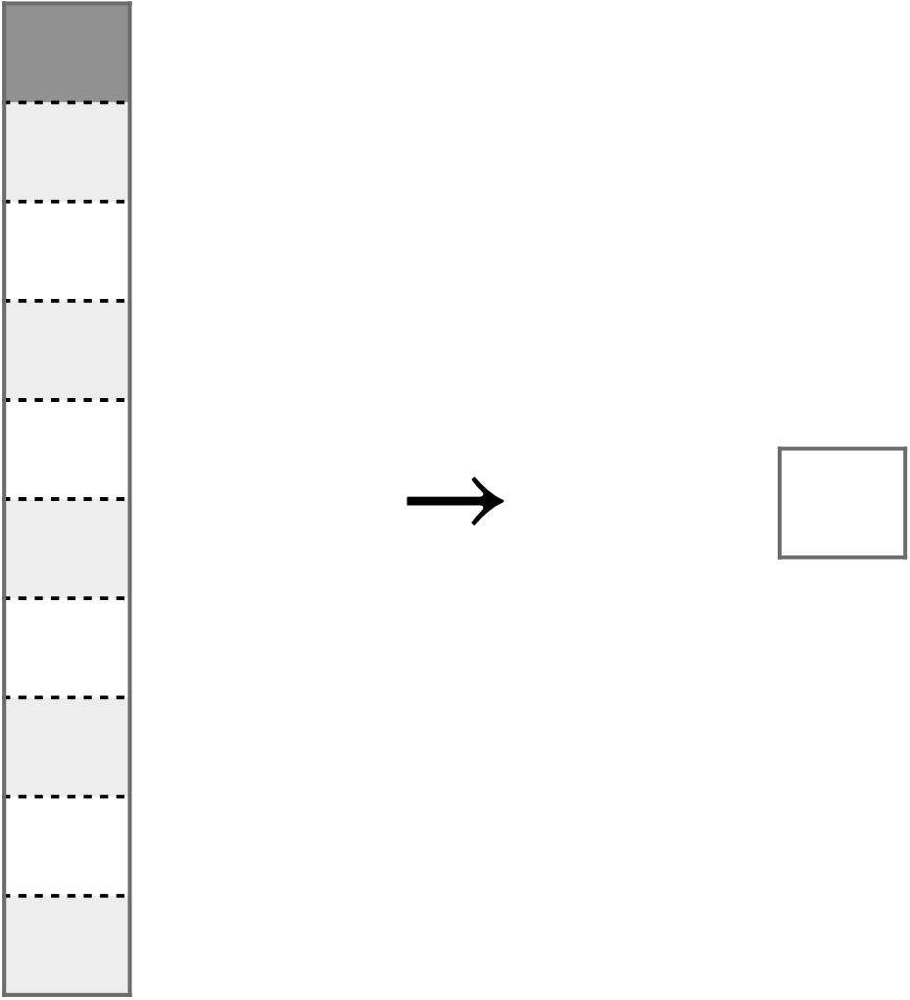
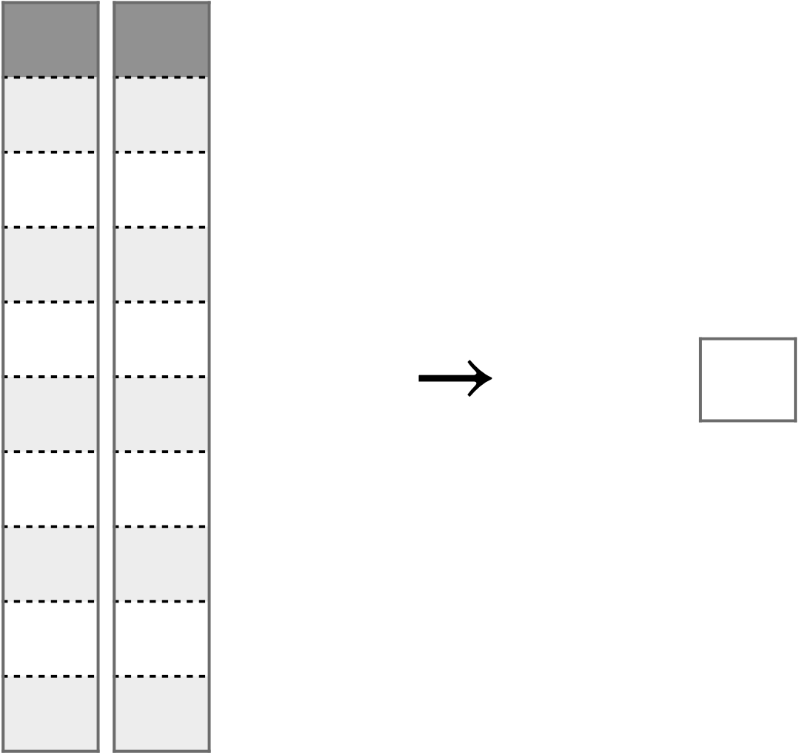
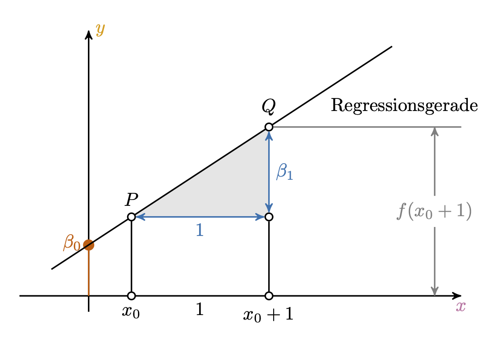
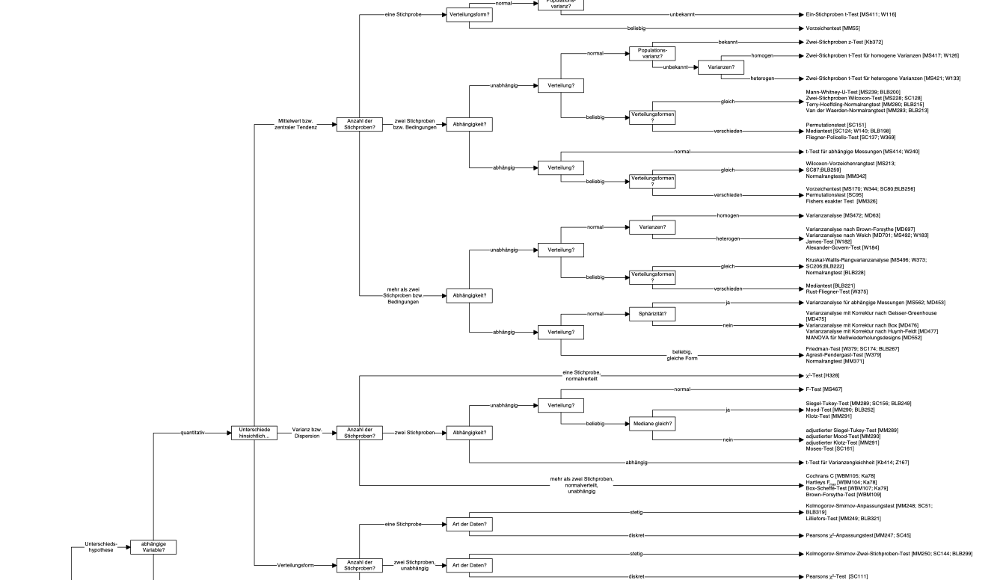

# Die drei Zielarten der Statistik 

```{r r-pckgs}
#| echo: false
#| message: false
library(tidyverse)
library(easystats)
library(nycflights13)
library(ggrepel)
library(gt)
library(dagitty)
library(knitr)

```


```{r r-setup}
#| echo: false
#| message: false
theme_set(theme_minimal())
#scale_color_okabeito()
scale_colour_discrete <- function(...) 
  scale_color_okabeito()
```


{width=10%}


## Lernsteuerung


@fig-modulverlauf gibt einen Überblick zum aktuellen Standort im Modulverlauf.
Nach Absolvieren des jeweiligen Kapitels sollen folgende Lernziele erreicht sein.

Sie können ...


- die drei Zielarten der Statistik nennen und beschreiben können
- die Definition von Inferenzstatistik sowie Beispiele für inferenzstatistische Fragestellungen nennen
- zentrale Begriffe der Inferenzstatistik nennen und in Grundzügen erklären
- den Nutzen von Inferenzstatistik nennen
- erläutern, in welchem Zusammenhang Ungewissheit zur Inferenzstatistik steht
- anhand von Beispielen erklären, was ein statistisches Modell ist
- die Grundkonzepte der Regression angeben
- Unterschiede zwischen frequentistischer ("klassischer") und Bayes-Inferenz benennen
- Vor- und Nachteile der frequentistischen vs. Bayes-Inferenz diskutieren
- Die grundlegende Herangehensweise zur Berechnung des p-Werts informell erklären


Bei @gelman2021, Kap. 1 findet sich eine Darstellung ähnlich zu der in diesem Kapitel.
Die Begleitliteratur ist nicht prüfungsrelevant; sie dient zur Vertiefung und als
Grundlage einer ausführlicheren Erläuterung des Stoffes.


Bereiten Sie sich im Eigenstudium auf dieses Kapitel vor.
Lesen Sie dazu folgende Themen:

- [Statistik 1, Kap. "Rahmen"](https://statistik1.netlify.app/010-rahmen)
- [Statistik 1](https://statistik1.netlify.app/), dort alle Inhalte aller Kapitel zum Thema "Modellieren" bzw. "Regression"
- [Statistik 1, Abschnitt zur Normalverteilung]()


Diese Begleitvideos helfen Ihnen bei der Vor- und Nachbereitung dieses Kapitels:

- [Video zur Inferenz, Teil 1](https://youtu.be/gcwWwBy0kPI)
- [Video zur Inferenz, Teil 2](https://https://youtu.be/QNMVi6IqQ90)


📺 [Wozu ist Statistik eigentlich da?](https://www.youtube.com/watch?v=gcwWwBy0kPI&list=PLRR4REmBgpIGgz2Oe2Z9FcoLYBDnaWatN&index=2)
Diese Frage haben Sie sich auch schon mal gestellt? 
Abb. @fig-goals gibt einen Überblick über die drei Zielarten der statistikbasierten wissenschaftlichen Forschung.^[Ziele existieren nicht "in echt" in der Welt. Wir denken sie uns aus.
Ziele haben also keine ontologische Wirklichkeit,
sie sind epistemologische Dinge (existieren nur in unserem Kopf).
Das heißt, dass man sich nach Belieben Ziele ausdenken kann.
Allerdings hilft es, wenn man andere Menschen vom Nutzen der eigenen Ideen überzeugen kann.]
Nach dieser Einteilung lassen sich drei Arten von Zielen unterscheiden: *Beschreiben*, *Vorhersagen* und *Erklären* [@shmueli2010].


## Die drei Zielarten in der Statistik

Die drei Zielarten in der Statistik sind:
Beschreiben, Vorhersagen, Erklären.

:::{#exm-ziele-stat}
### Beispiele für die Zielarten statistischer Analysen
- Beschreiben: “Wie groß ist der Gender-Paygap in der Branche X im Zeitraum Y?”
- Vorhersagen: Wenn eine Person, Mr. X, 100 Stunden auf die Statistikklausur lernen, welche Note kann diese Person dann erwarten?
- Erklären: Wie viel bringt (mir) das Lernen auf die Statistikklausur?$\square$
:::


Anhand der verwendeten statistischen Methode (z.B. Regressionsanalyse)
kann man *nicht* feststellen, zu welchem Erkenntnisziel die Studie gehört.
Um das Erkenntnisziel festzustellen, liest man sich die Forschungsfrage oder das Ziel der Studie durch.
Bei wenig beackerten Wissenschaftsfeldern ist das *Beschreiben* ein sinnvoller erster Schritt.
*Vorhersagen* ist mehr für die Praxis als für die Wissenschaft relevant.

```{mermaid}
%%| label: fig-goals
%%| fig-cap: Eine Einteilung zentraler Ziele von statistischen Analysen
flowchart TD 
  A{Ziele} --> B(Beschreiben)
  A --> C(Vorhersagen)
  A --> D(Erklären)
  B --> E(Verteilung)
  B --> F(Zusammenhang)
  C --> H(Punktschätzung)
  C --> I(Bereichsschätzung)
  D --> J(Kausalinferenz)
  D --> K(Populationsinferenz)
```


## Zielart *Beschreiben* (deskriptiv)


Statistische Analysen mit dem Ziel zu beschreiben fassen die Daten zusammen (zu möglichst aussagekräftigen Kennzahlen).
Beschreibende Statistik nennt man auch *deskriptive Statistik*; Mittelwert, Korrelation und Regressionskoeffizienten sind typische Kennzahlen ("Statistiken");  s. @fig-beschreiben.


::: {exm-ziel-beschreiben}
- Wie stark ist der (lineare) Zusammenhang $r$ von Größe und Gewicht (bei Erwachsenen) in meiner Stichprobe?
- Wie stark ist der (lineare) Zusammenhang $b$ von Lernzeit und Note (im Fach Statistik) in meinem Datensatz?
- Haben unsere Kunden bisher Webshop A oder B bevorzugt, laut unseren Daten? $\square$
::::


::: {#fig-beschreiben layout-ncol=2}

{#fig-desk width=50%}


{#fig-desk2 width=50%}

Beschreibende Statistik fasst eine oder mehr Variablen eines Datensatzes zu einer einzelnen Kennzahl zusammen.
:::

Der beschreibenden Statistik geht es *nicht* darum, 
Erkenntnisse zu ziehen, die über die Daten hinaus gehen.
So ist man in der beschreibenden Statistik nicht daran interessiert,
Aussagen über die zugrundeliegende Population anzustellen.

::: {#exm-desk}
In einem Hörsaal sitzen 100 Studis. Alle schreiben Ihre Körpergröße auf einen Zettel. Die Dozentin sammelt die Zettel ein und rechnet dann den Mittelwert der Körpergröße der anwesenden Studierenden aus. Voilà: Deskriptive Statistik!$\square$
:::


:::{#def-desk}
### Deskriptivstatistik
*Deskriptivstatistik* fasst Merkmale aus einer Stichprobe zu Kennzahlen (Statistiken) zusammen.
:::


## Zielart *Vorhersagen* (prädiktiv, prognostisch)

Beim Vorhersagen versucht man, auf Basis von Daten, 
gegeben bestimmter Werte der UV den Wert einer AV vorherzusagen, s. @fig-vorhersagen.


:::{exm-ziel-vorhersagen}
- Wie schwer ist wohl Herr X? Er ist ein deutscher erwachsener Mann der Größe 1,80m; mehr wissen wir nicht.
- Welche Note kann man erwarten, wenn man nichts für die Klausur lernt?
- Wie viel wird ein Kunde ausgeben, wenn er sich in der Variante *A* des Webshops aufhält? $\square$
::::


:::{#exm-toni-lernt}
### Ali lernt für die Klausur
Oh nein, die Klausur im Fach Statistik steht an. 
Ali lernt ziemlich viel. 
Wie viel Punkte (von 100 möglichen) wird er wohl erzielen?
Ziehen wir ein einfaches statistisches Modell zur Rate,
um eine Vorhersage für den "Klausurerfolg" von Ali zu erhalten.
Wir können vom Modell eine einzelne Zahl (83) als Punkt-Schätzwert bzw. Vorhersagewert erhalten oder einen Schätzbereich (80-86 Punkte). $\square$
:::

Hier ist das Regressionsmodell für Ali (`lm_toni`), s. @lst-toni.

```{r}
#| lst-label: lst-toni
#| lst-cap: Regressionsmodell für Klausurerfolg als Funktion der Lernzeit (`lm_toni`)
noten2 <- read.csv("data/noten2.csv")
lm_toni <- lm(y ~ x, data = noten2)
```


```{r lm1-b0-b1}
#| echo: false

lm1_b0 <- coef(lm_toni)[1]
lm1_b2 <- coef(lm_toni)[2]

toni_punkte <- predict(lm_toni, newdata = data.frame(x=42))
toni_vorhersageintervall <- predict(lm_toni, newdata =  data.frame(x=42), 
                                    interval = "confidence", level = 0.95)
```


```{r fig-noten}
#| label: fig-vorhersagen
#| echo: false
#| fig-cap: "Noten und Lernzeit: Rohdaten (a) und mit Modell (b). Mittelwerte sind mit gestrichelten Linien eingezeichnet. Die Vorhersage für Ali ist farbig markiert. Ali hat 42 Stunden gelernt für die Klausur; das Modell sagt ihm 83 Punkte (von 100) bzw. einen Bereich von 80 bis 86 Punkten voraus."
#| layout-ncol: 2
#| fig-subcap: 
#|   - "Regressionsgerade mit Punkt-Vorhersage für Ali"
#|   - "Regressionsgerade mit Vorhersagebereich (und herangezoomt) für Ali"

#noten2 <- read.csv(noten2, "data/noten2.csv")


p_toni_streudiagramm <-
ggplot(noten2) +
  aes(x, y) +
  geom_point() +
  labs(x = "Lernzeit",
       y = "Klausurpunkte") +
  theme_minimal() +
  theme_large_text()

p_toni_punktschaetzung <- 
  noten2 %>% 
  ggplot(aes(x, y)) +
  geom_point() +
  geom_vline(xintercept = mean(noten2$x), linetype = "dashed", color = "grey") +  
  geom_hline(yintercept = mean(noten2$y), linetype = "dashed", color = "grey") +   
  geom_abline(slope = coef(lm_toni)[2], intercept = coef(lm_toni)[1], color = modelcol, size = 1.5) +
  theme_minimal() +
  annotate("label", x = mean(noten2$x), y = -Inf, 
           label = paste0("MW: ", round(mean(noten2$x))), vjust = "bottom") +
  annotate("label", y = mean(noten2$y), x = -Inf, 
           label = paste0("MW: ", round(mean(noten2$y))), hjust = "left")   +
  annotate("point", x = 42, y = toni_punkte, color = ycol,
           alpha = .7, size = 3) +
  scale_x_continuous(breaks = c(20, 40, 60, 80, 100)) +
  labs(x = "Lernzeit",
       y = "Klausurpunkte") +
  theme_large_text() +
  geom_label_repel(data = data.frame(x = 42, y = toni_punkte), label = "Ali",
       force = 20,
                      box.padding = unit(1, "lines"),
                      point.padding = unit(1, "lines"),
                      segment.color = "grey50",
                      segment.size = 1,
                      arrow = arrow(length = unit(0.01, "npc")),
                      # Styling to create a label-like appearance
                      bg.color = "white",       # Background color of the label
                      color = "black",           # Text color
                      fill = "white",          # Alternative way to set background
                      alpha = 0.8,             # Transparency of the background
                      segment.alpha = 1,     # Transparency of the segment
                     
                      size = 6)  +               # Adjust text size
 theme(plot.margin = margin(1, 1, 1, 1, "cm"))

p_toni_punktschaetzung

p_toni_punktschaetzung +
  annotate("errorbar",
           x = 42, y = toni_punkte,
           xmin = 42, xmax = 42,
           ymin = toni_vorhersageintervall[1, "lwr"],
           ymax = toni_vorhersageintervall[1, "upr"],
           color = ycol) +
  coord_cartesian(xlim = c(32, 52), 
                  ylim = c(75, 87))
```


## Zielart Erklären (Schließen, Inferieren)


### Die zwei Arten von erklärenden Studien

"Erklären" (Inferenz) hat hier zwei Bedeutungen [vgl. @gelman2021].

1. Populationsinferenz
2. Kausalinferenz 


:::{exm-popinferenz}
- Wie stark ist der (lineare) Zusammenhang $b$ von Lernzeit und Note (im Fach Statistik) in der Grundgesamtheit (nicht in der Stichprobe)?
- Bevorzugen unsere Kunden allgemein Webshop A oder B laut unseren Daten? $\square$
:::


:::{exm-kausal}
- Ist Größe eine Ursache von Gewicht (bei deutschen Männern)?
- Wenn ich 100 Stunden lerne, welche Note schreibe ich dann? $\square$
:::


### Zielart *Erklären* -- Kausalinferenz


Mittels Kausalinferenz können wir schließen, welche Variablen *Ursachen* und welche *Wirkung* sind --
und welche Variablen **Scheinkorrelation** erzeugen.
Das ist wichtig, denn nur wenn man die Ursache kennt, weiß man, was man tun muss, 
um eine Wirkung zu erzielen.


#### Studie A: Östrogen

Medikament einnehmen?
Oder lieber nicht?
Mit Blick auf @tbl-studie-a: Was raten Sie dem Arzt? Medikament einnehmen, ja oder nein?


```{r tbl-studie-a}
#| echo: false
#| label: tbl-studie-a
#| tbl-cap: "Daten zur Studie A"

studie_a <-
  tibble::tribble(
     ~ Gruppe,      ~`Mit Medikament`,         ~`Ohne Medikament`,
"Männer",    "81/87 überlebt (93%)", "234/270 überlebt (87%)",
"Frauen",  "192/263 überlebt (73%)",   "55/80 überlebt (69%)",
"Gesamt",  "273/350 überlebt (78%)", "289/350 überlebt (83%)"
  ) 


studie_a %>% 
  gt()
```


@fig-studie-a zeigt die Daten aus @tbl-studie-a in einem Balkendiagramm.

```{r}
#| label: fig-studie-a
#| fig-cap: "Daten zur Studie A in einem Balkendiagramm"
#| echo: false

source("R-Code/kausalstudie1.R")
plot_kausalstudie_a
```


Die Daten stammen aus einer (fiktiven) klinischen Studie, $n=700$, 
hoher Qualität (Beobachtungsstudie).
Bei Männern scheint das Medikament zu helfen; 
bei Frauen auch.
Aber *insgesamt* (Summe von Frauen und Männern) *nicht*?!
Kann das sein?
Was sollen wir den Arzt raten? Soll er das Medikament verschreiben? 
Vielleicht nur dann, wenn er das Geschlecht kennt [@pearl2016]?!


In Wahrheit sehe die kausale Struktur so aus:
Das Geschlecht (Östrogen) hat einen positiven (+) Einfluss auf Einnahme des Medikaments und negativen Einfluss (-) auf Heilung.
Das Medikament hat einen positiven (+) Einfluss auf Heilung.
Betrachtet man die Gesamt-Daten zur Heilung, so ist der Effekt von Geschlecht (Östrogen) und Medikament *vermengt* (konfundiert, confounded).
Die kausale Struktur, also welche Variable beeinflusst bzw. nicht,
ist in @fig-dag-studie-a dargestellt.


```{r dag-studie-a}
#| echo: false
#| label: fig-dag-studie-a
#| fig-cap: "Zwei direkte Effekte (gender, drug) und ein indirekter Effekt (gender über drug) auf recovery"
#| out-width: "50%"


dag_studie_a <-
  dagitty("dag{
          gender -> drug
          drug -> recovery
          gender -> recovery
          }
      ")

coordinates(dag_studie_a) <-
  list(x = c(gender = 0, drug = 0, recovery  = 1),
       y = c(gender = 0, drug = 1, recovery = 0.5))


plot(dag_studie_a)
```


Betrachtung der Gesamtdaten zeigt in diesem Fall einen *konfundierten* Effekt: Geschlecht konfundiert den Zusammenhang von Medikament und Heilung.


:::callout-important
Aufteilen in Teilgruppen (Männer bzw. Frauen) ist also in diesem Fall der korrekte, richtige Weg.
Achtung: Das Stratifizieren ist nicht immer und nicht automatisch die richtige Lösung.
Stratifizieren bedeutet,
den Gesamtdatensatz in Gruppen oder "Schichten" ("Strata").
Würde man die Gesamtzahl an Patienten mit vs. ohne Medikament vergleichen, käme man zu einem falschen Schluss.
:::


#### Studie B: Blutdruck


Medikament einnehmen?
Oder lieber nicht?

Mit Blick auf @tbl-studie-b: Was raten Sie dem Arzt? Medikament einnehmen, ja oder nein?


```{r dag-studie-b-table}
#| echo: false
#| message: false
#| label: tbl-studie-b
#| tbl-cap: "Daten zur Wirksamkeit eines Medikaments (Studie B)"
studie_b <- 
  tibble::tribble(
~ Gruppe,          ~`Ohne Medikament`,          ~`Mit Medikament`,
"geringer Blutdruck",    "81/87 überlebt (93%)", "234/270 überlebt (87%)",
"hoher Blutdruck",  "192/263 überlebt (73%)",   "55/80 überlebt (69%)",
"Gesamt",  "273/350 überlebt (78%)", "289/350 überlebt (83%)"
  )

studie_b %>% 
  gt()
```


Die Daten stammen aus einer (fiktiven) klinischen Studie, $n=700$, hoher Qualität (Beobachtungsstudie).
Bei geringem Blutdruck scheint das Medikament zu schaden.
Bei hohem Blutdruck scheint das Medikament auch zu schaden.
Aber *insgesamt* (Summe über beide Gruppe) *nicht*, da scheint es zu nutzen?!
Was sollen wir den Arzt raten? Soll er das Medikament verschreiben? Vielleicht nur dann, 
wenn er den Blutdruck nicht kennt [@pearl2016]?


 Kausalmodell zur Studie B


Das Medikament hat einen (absenkenden) Einfluss auf den Blutdruck.
Gleichzeitig hat das Medikament einen (toxischen) Effekt auf die Heilung.
Verringerter Blutdruck hat einen positiven Einfluss auf die Heilung.
Sucht man innerhalb der Leute mit gesenktem Blutdruck nach Effekten, findet man nur den toxischen Effekt: Gegeben diesen Blutdruck ist das Medikament schädlich aufgrund des toxischen Effekts. Der positive Effekt der Blutdruck-Senkung ist auf diese Art nicht zu sehen.

Das Kausalmodell von Studie B ist in @fig-dag-studie-b dargestellt.


```{r dag-studie-b}
#| echo: false
#| label: fig-dag-studie-b
#| fig-cap: "Drug hat keinen direkten, aber zwei indirekte Effekt auf recovery, einer davon ist heilsam, einer schädlich"
#| out-width: "50%"
dag_studie_b <-
  dagitty("dag{
          drug -> pressure
          drug -> toxic
          pressure -> recovery
          toxic -> recovery
          }
      ")


coordinates(dag_studie_b) <-
  list(x = c(drug = 0, pressure = 1, toxic = 1, recovery  = 2),
       y = c(drug = 1, pressure = 0, toxic = 2, recovery = 1))


plot(dag_studie_b)
```

Betrachtung der Teildaten zeigt nur den toxischen Effekt des Medikaments, nicht den nützlichen (Reduktion des Blutdrucks).


:::callout-important
Betrachtung der Gesamtdaten zeigt in diesem Fall den wahren, kausalen Effekt. 
Stratifizieren wäre falsch, da dann nur der toxische Effekt, aber nicht der heilsame Effekt sichtbar wäre.
:::


#### Studie A und B: Gleiche Daten, unterschiedliches Kausalmodell


Vergleichen Sie die DAGs @fig-dag-studie-a und @fig-dag-studie-b,
die die *Kausalmodelle* der Studien A und B darstellen:
Sie sind *unterschiedlich*.
Aber: Die *Daten* sind *identisch*.


Kausale Interpretation - und damit Entscheidungen für Handlungen - 
war nur möglich, da das Kausalmodell bekannt ist. 
Die Daten alleine reichen nicht (bei Beobachtungsstudien).


#### Sorry, Statistik: Du allein schaffst es nicht


Datenanalyse alleine reicht nicht für Kausalschlüsse. 🧟

Kausalinferenz 📚 plus Datenanalyse 📊 erlaubt Kausalschlüsse. 📚➕📊  🟰  🤩


:::callout-important
Für Entscheidungen ("Was soll ich tun?") braucht man kausales Wissen.
Kausales Wissen basiert auf einer Theorie (Kausalmodell) plus Daten.
:::


## Modellieren

### Modellieren als Grundraster des Erkennens


In der Wissenschaft -- wie auch oft in der Technik, Wirtschaft oder im Alltag --
betrachtet man einen Teil der Welt näher, 
meist mit dem Ziel, eine Entscheidung zu treffen, was man tun wird oder mit dem Ziel, etwas zu lernen.
Nun ist die Welt ein weites Feld. 
Jedes Detail zu berücksichtigen ist nicht möglich.
Wir müssen die Sache vereinfachen: 
Alle Informationen ausblenden, die nicht zwingend nötig sind.
Aber gleichzeitig die Strukturelemente der wirklichen Welt, 
die für unsere Fragestellung zentral sind, beibehalten.


Dieses Tun nennt man *Modellieren*: Man erstellt sich ein Modell.

:::{#def-model}
### Modell
Ein Modell ist ein vereinfachtes Abbild der Wirklichkeit.$\square$
:::

Der Nutzen eines Modells ist, einen (übermäßig) komplexen Sachverhalt zu vereinfachen oder überhaupt erst handhabbar zu machen.
Man versucht zu vereinfachen, 
ohne Wesentliches wegzulassen. 
Der Speck muss weg, sozusagen. Das Wesentliche bleibt.
Auf die Statistik bezogen heißt das,
dass man einen Datensatz dabei so zusammenfasst,
damit man das Wesentliche erkennt.

Was ist das "Wesentliche"? 
Oft interessiert man sich für die Ursachen eines Phänomens. 
Etwa: "Wie kommt es bloß, dass ich ohne zu lernen die Klausur so gut bestanden habe?"^[Das ist natürlich nur ein fiktives, 
komplett unrealistisches Beispiel, das auch unklaren Ursachen den Weg auf diese Seite gefunden hat.]
Noch allgemeiner ist man dabei häufig am Zusammenhang von `X ` und `Y` interessiert, 
s. @fig-xy, die ein Sinnbild von statistischen Modellen wiedergibt.


:::{#fig-xy fig-align="center"}


```{mermaid}
flowchart LR
X --> Y


X1 --> Y2
X2 --> Y2
```

oben: Sinnbild eines einfachen statistischen Modells (eine UV, eine AV); unten: Sinnbild eines statistischen Modells, mit zwei UV


:::


Man kann @fig-xy als ein Sinnbild einer (mathematischen) Funktion lesen.

:::{#def-fun}
### Funktion
Eine mathematische Funktion $f$ setzt zwei Größen in Beziehung. $\square$
:::

In Mathe-Sprech: 
$f: X \rightarrow Y$, lies: "$f$ bildet $X$ auf $Y$ ab."

oder:
$y = f(x)$, lies: "Y ist eine Funktion von X". $\square$


Die Größe des Zusammenhangs von $X$ und $Y$ in $f$ bezeichnet man als *Effekt* von $X$ auf $Y$.

:::{#def-effekt}
### Effekt
Der Begriff Effekt im statistisch-wissenschaftlichen Sinn bezeichnet die Größe des statistischen Zusammenhangs
(oder der Differenz) zwischen UV und AV in einem Modell,
die über den zufälligen Erwartungswert hinausgeht.
Effekt ist nicht unbedingt kausal zu verstehen. $\square$
:::


Es hört sich zugespitzt an, aber eigentlich ist fast alles, 
was man tut, Modellieren:
Wenn man den Anteil der R-Fans in einer Gruppe Studierender ausrechnet,
macht man sich ein Modell:
man vereinfacht diesen Ausschnitt der Wirklichkeit anhand einer statistischen Kennzahl,
die das forschungsleitende Interesse zusammenfasst.
Die Statistik kann man verstehen als ein Verfahren, dass wissenschaftliche Modelle in statistische übersetzt 
und letztere dann einer empirischen Analyse unterzieht.
Alle statistischen Ergebnisse beruhen auf Modelle und sind nur insoweit gültig, wie das zugrundeliegende Modell gültig ist.


### Alle drei Zielarten modellieren, aber unterschiedlich


In allen drei Zielarten der Statistik wird modelliert.

- Beschreibende Studien nutzen Kennzahlen wie den Mittelwert um "sich ein Bild zu machen" von einer Verteilung.
- Vorhersagestudien nutzen Modelle als Werkzeug, um genaue Vorhersagen zu machen, ohne Anspruch, die Wirklichkeit zu erklären
- Erklärende Studien nutzen Modelle, um die Wirklichkeit möglichst korrekt darzustellen.


Zur Umsetzung von Modellierung in eine konkrete statistische Analyse bietet sich die Regressionsanalyse an.


### Regression zum Modellieren

Einflussreiche Leute schwören auf die Regressionsanalyse (@fig-gandalf).

{width="50%" #fig-gandalf fig-align="center"}


::::: {.content-visible when-format="html"}

@fig-linfun zeigt ein interaktives Beispiel einer linearen Funktion. 
Sie können Punkte per Klick/Touch hinzufügen.


:::{#fig-linfun}

::: {.figure-content}




:::

Interaktives Beispiel für eines lineares Modell. Fügen Sie Punkte per Klick/Touch hinzu.

::::
:::::


Alternativ können Sie [diese App](https://gallery.shinyapps.io/simple_regression/) nutzen,
Regressionskoeffizienten, Steigung (slope) und Achsenabschnitt (Intercept), zu optimieren.
Dabei meint "optimieren", die Abweichungen (Residuen, Residualfehler; die roten Balken in der App) zu minimieren.^[<https://gallery.shinyapps.io/simple_regression/>]


[Hier](https://shinyapps.org/showapp.php?app=https://shiny.psy.lmu.de/felix/lmfit&by=Felix%20Sch%C3%B6nbrodt&title=Find-a-fit!&shorttitle=Find-a-fit!) finden Sie eine App, die Ihnen gestattet, selber Hand an eine Regressionsgerade zu legen.


:::{#exr-setosa-vis}
### VERTIEFUNG Regression mit Animationen erklärt
Lesen Sie [diesen Post](https://setosa.io/ev/ordinary-least-squares-regression/), 
der Ihnen mit Hilfe von Bildern und Animationen (okay, und etwas) Text die Grundlagen der Regressionsanalyse erklärt.$\square$
:::


Die Regression ist eine Art Schweizer Taschenmesser der Statistik: Für vieles gut einsetzbar.
Anstelle von vielen verschiedenen Verfahren des statistischen Modellierens kann man (fast) immer die Regression verwenden.
Das ist nicht nur einfacher, sondern auch mathematisch schöner. 
Wir werden im Folgenden stets die Regression zum Modellieren verwenden.
Dann wenden wir die Methoden der Inferenz auf die Kennzahlen der Regression an.


:::callout-note
Regression + Inferenz = 💖
:::


Alternativ zur Regression könnte man sich in den Wald der statistischen Verfahren begeben, [wie hier von der Uni Münster als Ausschnitt (!) aufgeführt](https://web.archive.org/web/20091029162244/http://www.wiwi.uni-muenster.de/ioeb/en/organisation/pfaff/stat_overview_table.html).
Auf dieser Basis kann man meditieren,
welches statistischen Verfahren man für eine bestimmte Fragestellung verwenden sollte, s. @fig-choose-test.
Muss man aber nicht -- man kann stattdessen die Regression benutzen.


:::callout-note
Es ist meist einfacher und nützlicher, die Regression zu verwenden, anstelle der Vielzahl von anderen Verfahren (die zumeist Spezialfälle der Regression sind). In diesem Kurs werden wir für alle Fragestellungen die Regression verwenden.^[Wie Jonas [Kristoffer Lindeløv](https://lindeloev.github.io/tests-as-linear/) uns erklärt, sind viele statistische Verfahren, wie der sog. t-Test Spezialfälle der Regression.]$\square$
:::


:::{#fig-regr-oder-wald layout-ncol=2}

{#fig-regrtext}

{#fig-choose-test}

Wähle die Regression. Oder den Wahl der Verfahren. Spoiler: Nimm lieber die Regression.
:::


:::{#exm-spezialfaelle-regr}
Typische *Spezialfälle* der Regression sind 

- t-Test: UV: zweistufig nominal, AV: metrisch
- ANOVA: UV: mehrstufig nominal, AV: metrisch 
- Korrelation: Wenn UV und AV z-standardisiert sind (d.h. Mittelwert von 0 und Standardabweichung von 1 haben), dann ist die Korrelation gleich dem Regressionskoeffizienten $\beta_1$ (bei einer einfachen Regression mit einer einzigen UV). $\square$
:::


<!-- {#fig-lindeloev} -->


@fig-regr-rules zeigt die Regressionsgleichung in voller Pracht.
Links sieht man eine einfache Regression mit `hp` als UV (`X`, auch: Prädiktor) und `mpg` als AV (`Y`).
Das rechte Teildiagramm zeigt eine multiple Regression mit den UVs `hp` und `am`.^[Der Datensatz `mtcars` wird gerne als Studienobjekt verwendet, da er einfach ist und für viele Beispiele geeignet. 
Wenn Sie sich einen Sachverhalt an einem einfachen Datensatz vergegenwärtigen wollen, bietet sich auch der Datensatz `mtcars` an. 
Zudem ist er "fest in R eingebaut"; mit `data(mtcars)` können Sie ihn verfügbar machen.]
Im einfachsten Fall sind die vom Modell vorhergesagten (geschätzten) Werte, $\hat{y}$, durch eine einfache Gerade beschrieben, s. @fig-regr-rules, links.
In allgemeiner Form schreibt man die Regressionsgleichung als lineare Gleichung, d.h. in Form einer Gerade, s. @thm-lm.


:::{#thm-lm}

### Lineares Modell (Regressionsgleichung)

$$y = \beta_0 + \beta_1 x_1 + \ldots + \beta_k x_k + \epsilon$$

Man nennt alle $\beta_0, \beta_1, \beta_2, ...$ die  *Regressionsgewichte* (*Koeffizienten* oder *Parameter*) des Modells [@gelman2021].
Dabei ist $\beta_0$ der *Achsenabschnitt* (eng. intercept) und $\beta_1$ die *Steigung* der Regressionsgeraden.
$\square$
:::


Anhand von @thm-lm erkennt man auch, warum man von einem *linearen Modell* spricht: 
Y wird als gewichteter Mittelwert mehrerer Summanden berechnet.

Eine Regressionsgerade ist durch zwei Parameter festgelegt: den Achsenabschnitt, $\beta_0$ und die Steigung, $\beta_1$, s. @fig-regr-rules.


```{r}
#| message: false
#| eval: true
#| echo: false
#| layout-ncol: 2
#| label: fig-regr-rules
#| fig-cap: Die Regressionsgerade in voller Pracht
#| fig-subcap: 
#|   - "Einfache Regression (eine UV: hp)"
#|   - "Multiple Regression (zwei UV: hp und am)"
data(mtcars)

mtcars$am <- factor(mtcars$am)

ggplot(mtcars) +
  aes(x = hp, y = mpg) +
  geom_point() +
  geom_smooth(method = "lm") +
  theme_minimal()

ggplot(mtcars) +
  aes(x = hp, y = mpg, color = am) +
  geom_point() +
  geom_smooth(method = "lm") +
  theme_minimal() +
  scale_color_okabeito() +
  theme(legend.position = c(0.9, .90))
```

:::{#exr-regr-koeff-zielart}
### Peer Instruction: Regressionskoeffizienten

Eine Regressionsgerade wird durch zwei Koeffizienten festgelegt: ihren Achsenabschnitt, $\beta_0$, sowie ihre Steigung, $\beta_1$. Berechnet man also eine Regressionsgerade, so verfolgt man damit welche Zielart der Statistik?

A) Beschreiben
B) Vorhersagen
C) Erklären - Kausal
D) Erklären - Population
E) Alle der oben genannten sind möglich
F) Keine der oben genannten $\square$
:::


## Fazit


:::callout-important
[Kontinuierliches Lernen](https://imgflip.com/i/77wn7m) ist der Schlüssel zum Erfolg.
:::

Wenn Sie an einer (nicht prüfungsrelevanten) Vertiefung interessiert sind, lesen Sie die Einführung zum Thema Modellieren bei @poldrack2022 (Kap. 5.1).


## Aufgaben

Schauen Sie sich die Aufgaben mit dem Tag *inference* auf dem [Datenwerk](https://datenwerk.netlify.app/#category=inference) an.


### Quiz-Aufgaben

Hier finden Sie Single-Choice-Aufgaben zu diesem Kapitel.
Wählen Sie eine Antwort aus und klicken Sie auf das Häkchen, um sie zu überprüfen;
über das Fragezeichen erhalten Sie die ausführliche Lösung.

```{r quiz-inferenz-setup}
#| include: false
library(exams2forms)

quiz_inferenz_files <- list(
  "exr/zielarten-stat-schoice/zielarten-stat-schoice.Rmd",
  "exr/regr-spezialfaelle-schoice/regr-spezialfaelle-schoice.Rmd",
  "exr/simpson-paradox-schoice/simpson-paradox-schoice.Rmd",
  "exr/mediator-vs-confounder-schoice/mediator-vs-confounder-schoice.Rmd",
  "exr/methode-bestimmt-nicht-zielart-schoice/methode-bestimmt-nicht-zielart-schoice.Rmd",
  "exr/modell-definition-schoice/modell-definition-schoice.Rmd",
  "exr/effekt-definition-nicht-kausal-schoice/effekt-definition-nicht-kausal-schoice.Rmd",
  "exr/erklaeren-population-vs-kausal-schoice/erklaeren-population-vs-kausal-schoice.Rmd",
  "exr/regressionsgleichung-berechnen-schoice/regressionsgleichung-berechnen-schoice.Rmd",
  "exr/regr-koeff-welche-zielart-schoice/regr-koeff-welche-zielart-schoice.Rmd"
)
```

```{r quiz-inferenz}
#| echo: false
#| message: false
#| results: asis
exams2forms(quiz_inferenz_files, n = 1)
```


## ---


{width=100%}


