# Hallo, Wahrscheinlichkeit

## Lernsteuerung


### Position im Modulverlauf

@fig-modulverlauf gibt einen Überblick zum aktuellen Standort im Modulverlauf.


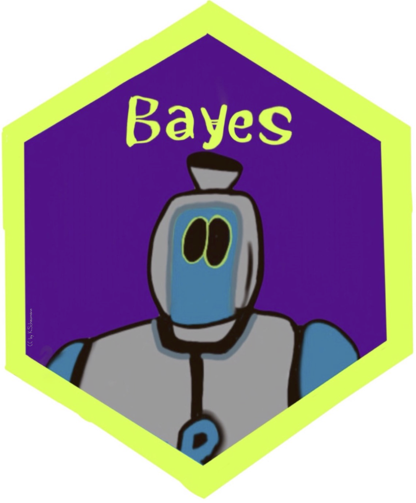{width=10%}


```{r}
#| include: false
library(tidyverse)
library(easystats)
library(gmp)  # function "isprime"
library(titanic)
library(knitr)
library(DT)
library(kableExtra)
library(ggraph)
library(DiagrammeR)
library(gt)


source("funs/uniformplot.R")
source("funs/binomial_plot.R")
```


```{r r-setup}
#| echo: false
#| message: false
theme_set(theme_minimal())
scale_colour_discrete <- function(...) 
  scale_color_okabeito()
```




### Überblick

Dieses Kapitel hat die Wahrscheinlichkeitstheorie (synonym: Wahrscheinlichkeitsrechnung) bzw. das Konzept der Wahrscheinlichkeit zum Thema.^[Die Wahrscheinlichkeitstheorie bildet zusammen mit der Statistik das Fachgebiet der Stochastik.]
Es geht sozusagen um die Mathematik des Zufalls.


### Wozu brauche ich dieses Kapitel?

Im wirklichen Leben sind Aussagen (Behauptungen) so gut wie nie sicher.

- "Weil sie so schlau ist, ist sie erfolgreich."
- "In Elektroautos liegt die Zukunft."
- "Das klappt sicher, meine Meinung."
- "Der nächste Präsident wird XYZ."


### Lernziele

Nach Absolvieren des jeweiligen Kapitels sollen folgende Lernziele erreicht sein.

Sie können ...


- die Grundbegriffe der Wahrscheinlichkeitstheorie erläuternd definieren
- die Definitionen von Wahrscheinlichkeit beschreiben
- typische Relationen (Operationen) von Ereignissen anhand von Beispielen veranschaulichen
- erläutern, was eine Zufallsvariable ist


### Begleitliteratur

Lesen Sie zur Begleitung dieses Kapitels @bourier2011, Kap. 2-4. 


### Prüfungsrelevanter Stoff

Der Stoff dieses Kapitels deckt sich (weitgehend) mit @bourier2011, Kap. 2-4. 
Weitere Übungsaufgaben finden Sie im dazugehörigen Übungsbuch, @bourier2022.

:::callout-note
In Ihrer [Hochschul-Bibliothek kann das Buch als Ebook verfügbar](https://fantp20.bib-bvb.de/TouchPoint/singleHit.do?methodToCall=showHit&curPos=3&identifier=2_SOLR_SERVER_1157422278) sein. 
Prüfen Sie, ob Ihr Dozent Ihnen weitere Hilfen im [geschützten Bereich (Moodle)](https://moodle.hs-ansbach.de/mod/resource/view.php?id=136047) eingestellt hat. $\square$
:::


### Begleitvideos


- [Video zum Thema Wahrscheinlichkeit](https://youtu.be/rR6NspapEyo)


## Grundbegriffe


### Zufallsvorgang


:::{#exm-muenz}
Klassisches Beispiel für einen Zufallsvorgang ist das (einmalige oder mehrmalige) Werfen einer Münze. $\square$

Werfen Sie eine Münze!
Diese hier zum Beispiel:

{width=10% fig-align="center"}

[Bildquelle: By OpenClipartVectors, CC0]( https://pixabay.com/pt/moeda-euro-europa-fran%C3%A7a-dinheiro-155597)


Wiederholen Sie den Versuch 10 Mal.
Das reicht Ihnen nicht? Okay, wiederholen Sie den Versuch 100, nein 1000, nein: $10^6$ Mal.^[$10^6 = 1000000$]
Notieren Sie als Ergebnis, wie oft die Seite mit der Zahl oben liegen kommt ("Treffer"). $\square$
:::


Oder probieren Sie die [App der Brown University](https://seeing-theory.brown.edu/basic-probability/index.html#section1), 
wenn Sie keine Sehnenscheidenentzündung bekommen wollen.


:::{#def-zufallsvorgang}
### Zufallsvorgang
Ein *Zufallsvorgang* oder *Zufallsexperiment* ist eine einigermaßen klar beschriebene Tätigkeit, deren Ergebnis nicht sicher ist. 
Allerdings ist die Menge möglicher Ergebnisse bekannt und die Wahrscheinlichkeit für alle Ergebnisse kann quantifiziert werden. $\square$
:::

:::{#exm-zufallsvorgang}
### Typische Zufallsvorgänge

- *Würfeln*: Das Werfen eines fairen Würfels ist ein klassisches Beispiel. Der Ausgang (die Augenzahl) kann 1, 2, 3, 4, 5 oder 6 sein.
- *Münzwurf*: Beim Werfen einer Münze sind die möglichen Ausgänge "Kopf" oder "Zahl". 
- *Lottoziehung*: Die Ziehung von 6 aus 49 Kugeln ist ein komplexeres Zufallsexperiment. Jeder Ausgang ist eine bestimmte Kombination von 6 Zahlen. 
- *Kartenziehen*: Das Ziehen einer Karte aus einem gut gemischten Kartendeck ist ein weiteres Beispiel.
- *Glücksrad*: Das Drehen eines Glücksrads mit verschiedenen Feldern (z.B. Farben oder Zahlen). Welches Feld am Ende stehenbleibt, ist zufällig. $\square$
:::


:::{#exr-zufall2}
Nennen Sie Beispiele für Zufallsvorgänge! $\square$^[Beispiele für Zufallsexperimente 
das Messen eines Umweltphänomens wie der Temperatur oder die Anzahl der Kunden, 
die einen Laden betreten. 
In jedem dieser Fälle sind die möglichen Ergebnisse nicht im Voraus bekannt und hängen von nicht komplett bekannten Faktoren ab.]
:::


:::callout-caution
Zufall heißt nicht, dass ein Vorgang keine Ursachen hätte. 
So gehorcht der Fall einer Münze komplett den Gesetzen der Gravitation. 
Würden wir diese Gesetze und die Ausgangsbedingungen (Luftdruck, Fallhöhe, Oberflächenbeschaffenheit, Gewichtsverteilungen, ...) exakt kennen, könnten wir theoretisch sehr genaue Vorhersagen machen. 
Der "Zufall" würde aus dem Münzwurf verschwinden. Man sollte "Zufall" also besser verstehen als "unbekannt". $\square$
::::


:::{#exr-würfel-geo}
[Mit dieser App](https://www.geogebra.org/m/cbqee8h7) können Sie Würfelwürfe simulieren und die Ausgänge dieses Zufallsexperiments beobachten.$\square$
:::

### Ergebnisraum

:::{#def-Ergebnisraum}
### Ergebnisraum
Die möglichen Ergebnisse eines Zufallvorgangs fasst man als Menge mit dem Namen *Ergebnisraum* zusammen. 
Man verwendet den griechischen Buchstaben $\Omega$ für diese Menge.
Die Elemente $\omega$ (kleines Omega) von $\Omega$ nennt man *Ergebnisse*.$\square$
:::

:::{#exm-grundraum}
Beobachtet man beim Würfelwurf (s. @fig-wuerfel) die oben liegende Augenzahl, so ist 


$$\Omega = \{ 1,2,3,4,5,6 \} = \{⚀, ⚁, ⚂, ⚃, ⚄, ⚅\}$$

ein natürlicher Grundraum [@henze2019].$\square$
:::


:::{#exm-ergebnisraum2}

- *Münzwurf*: $\Omega = \{ \text{Kopf, Zahl} \}$
- *Lotto*:  Bei der Ziehung von 6 aus 49 Kugeln ist der Grundraum die Menge aller möglichen Kombinationen von sechs Zahlen, das sind ca. 14 Millionen.
- *Kartenziehen*: Wenn eine einzelne Karte aus einem 52er-Kartendeck gezogen wird, ist der Grundraum die Menge aller 52 Karten.
- *Glücksrad*: Wenn das Glücksrad in vier gleich große, farbige Felder unterteilt ist (Rot, Grün, Blau, Gelb), dann ist der Grundraum die Menge der möglichen Farben: $\Omega = \{ \text{Rot, Grün, Blau, Gelb} \}$ $\square$
:::


Die Wahrscheinlichkeitsrechnung baut auf der Mengenlehre auf, daher wird die Notation  der Mengenlehre hier verwendet.


::: {.content-visible when-format="html"}
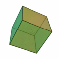{#fig-wuerfel width=10%}
:::

::: {.content-visible unless-format="html"}


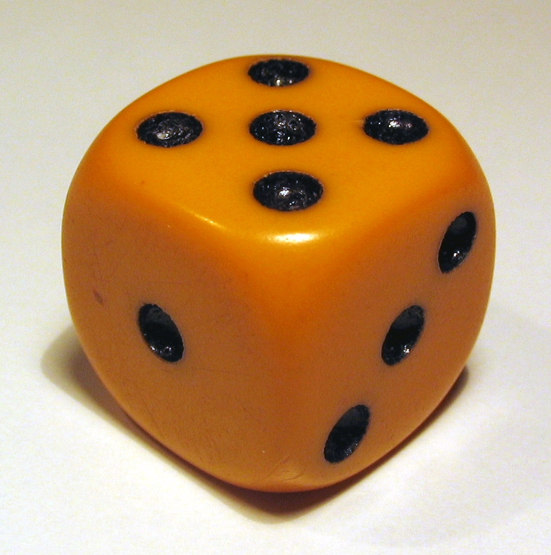{width=33%}

[Bildquelle: CC BY-SA 3.0](https://commons.wikimedia.org/w/index.php?curid=474827)
:::


### Ereignis


:::{#def-ereignis}
### Ereignis
Jede Teilmenge^[$A$ ist eine Teilmenge von $B$, 
wenn alle Elemente von $A$ auch Teil von $B$ sind.] von $\Omega$ heißt *Ereignis*; $A \subseteq \Omega$. $\square$
:::


:::{#exm-ereignis}
Beim Mensch-ärger-dich-nicht Spielen habe ich eine 6 geworfen.^[Schon wieder.]
Das Nennen wir das Ereignis $A$: "Augenzahl 6 liegt oben" und schreiben in Kurzform:

$A= \{6\} \square$
:::


:::{#exm-muenzwurf}
Sie werfen eine Münze (Sie haben keinen Grund, an ihrer Fairness zu zweifeln). "Soll ich jetzt lernen für die Klausur (Kopf) oder lieber zur Party gehen (Zahl)?"

@fig-baummuenz1 zeigt die möglichen Ausgänge (T wie Treffer (Party) und N  (Niete, Lernen)) dieses Zufallexperiments.

```{mermaid}
%%| label: fig-baummuenz1
%%| fig-cap: Sie werfen eine Münze. Party oder Lernen???
flowchart LR
 M[Sie werfen die Münze] --> T["T (Treffer) 🥳"]
  M --> N["N (Niete) 📚"]
```

Das Ereignis *Zahl* ist eingetreten! Treffer! Glück gehabt!^[?]$\square$
:::


### Unmögliches und sicheres Ereignis


:::{#def-unm-sich}
### Unmögliches und sicheres Ereignis
Die leere Menge $\varnothing$ heißt das *umögliche*, der Grundraum $\Omega$ heißt das *sichere Ereignis*. $\square$
:::

:::{#exm-unm}
### Unmögliches Ereignis
Alois behauptet, er habe mit seinem Würfel eine 7 geworfen.
Schorsch ergänzt, sein Würfel liege auf einer Ecke, so dass keine Augenzahl oben liegt.
Draco hat seinen Würfel runtergeschluckt. 
Diese Ereignisse sind *unmögliche Ereignisse*, zumindest nach unserer Vorstellung des Zufallsexperiments.$\square$
:::


:::{#exm-sicher}
### Sicheres Ereignis
Nach dem der Würfel geworfen wurde, liegt eine Augenzahl zwischen 1 und 6 oben.$\square$
:::


### Elementarereignis

:::{#def-defelementarereignis}
### Elementarereignis
Jede einelementige Teilmenge $\{\omega\}$ von $\Omega$ heißt *Elementarereignis* (häufig mit $A$ bezeichnet).
^[Ein *Ergebnis* ist ein Element von $\Omega$. Elementarereignisse sind die einelementigen Teilmengen von $\Omega$. Konzeptionell sind die beiden Begriffe sehr ähnlich, vgl. <https://de.wikipedia.org/wiki/Ergebnis_(Stochastik)>. Wir werden uns hier auf den Begriff *Elementarereignis* konzentrieren und den Begriff *Ergebnis* nicht weiter verwenden.] $\square$
:::


:::{#exm-exmelementarereignis}

- Sie spielen Mensch-ärger-dich-nicht. Und brauchen dringend eine `6`. Sie würfeln. Das Ereignis $A = \{1\}$ tritt ein.^[Na toll.]
- Sie schreiben eine Statistik-Klausur. Irgendwie haben Sie das Gefühl, das Ergebnis sei ein Zufallsexperiment... Jedenfalls können nach Adam Riese zwei Dinge passieren: $\Omega= \{\text{bestehen, nicht bestehen}\}$.
Das erste der beiden Elementarereignisse tritt ein. Yeah!
- Sie führen eine Studie durch zur Wirksamkeit einer Lern-App. Es ist nicht klar, ob die App wirklich was bringt für den Lernerfolg. Vereinfacht gesprochen ist der Grundraum dieses Experiments: $\Omega = \{\text{schadet, bringt nichts, nützt}\}$.
Die Daten sprechen für das Ereignis $A = \{\text{bringt nichts}\}$.
:::

:::{#exr-not-elementarereignisse}
Welche Ereignisse beim Würfelwurf sind keine Elementarereignisse? $\square$
:::


### Vollständiges Ereignissystem


:::{#def-vollereignis}
### Vollständiges Ereignissystem
Wird der Grundraum $\Omega$ vollständig in paarweis disjunkte Ereignisse zerlegt, 
so bilden diese Ereignisse ein vollständiges Ereignissystem, s. @fig-vollereignis.$\square$
:::


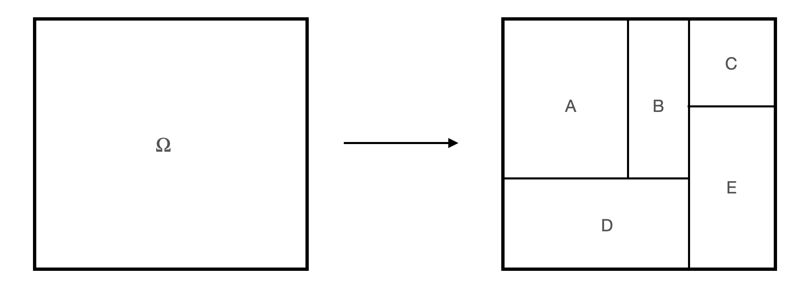{#fig-vollereignis width=50%}


:::{#exm-vollereig1}
Sei $\Omega$ der typische Ergebnisraum des Würfelwurfs. Wir zerlegen den Grundraum in zwei Ereignisse, $A$ "gerade Zahlen", und $B$ "ungerade Zahlen". 
Damit haben wir ein vollständiges Ereignissystem erstellt, s. @fig-complete-event-system1.


:::{#fig-complete-event-system1}

::: {.figure-content}


\begin{align}
A = \{2,4,6\} \qquad \hfill \boxed{\color{gray}{1}\; \boxed{\color{black}{2}}\; \color{gray}{3}\; \boxed{\color{black}{4}}\; \color{gray}{5}\; \boxed{\color{black}{6}}\;} \\
B = \{1,3,5\} \qquad  \hfill \boxed{\boxed{\color{black}{1}}\; \color{gray}{2}\; \boxed{\color{black}{3}}\; \color{gray}{4}\; \boxed{\color{black}{5}}\; \color{gray}{6}\; } \\
\hline \\
\Omega = \{1,2,3,4,5,6\}  \qquad  \hfill \boxed{1\; 2\; 3\; 4\; 5\; 6 } 

\end{align}
:::

:::

Ein Beispiel für ein vollständiges Ereignissystem

:::


:::::{#exm-vollereig2}
Sei $\Omega$ der typische Ergebnisraum des Würfelwurfs. Wir zerlegen den Grundraum in zwei Ereignisse, $A$ "1,2,3", und $B$ "4,5,6". 
Damit haben wir ein vollständiges Ereignissystem erstellt, s. @fig-complete-event-system1.

::::{#fig-fig-complete-event-system2}

::: {.figure-content}


\begin{align}
A = \{1,2,3\} \qquad \qquad \hfill  \boxed{\boxed{ \color{black}{1\; 2\; 3}}\; \color{gray}{4\; 5\; 6}} \\
B = \{4,5, 6\} \qquad \qquad  \hfill \boxed{\color{gray}{1 \; 2 \; 3}\; \boxed{\color{black}{4\; 5 \; 6}}} \\

\newline
\hline \\
\Omega = \{1,2,3,4,5,6\} \qquad \qquad \hfill  \boxed{1\; 2\; 3\; 4\; 5\;6}
\end{align}
:::

Noch ein Beispiel für ein vollständiges Ereignissystem

::::
:::::


### Mächtigkeit

:::{#def-macht}
### Mächtigkeit
Die Anzahl der Elementarereignisse eines Ereignismraums nennt man die Mächtigkeit (des Ergebnisraums).^[Die Menge aller Teilmengen einer Menge $A$ nennt man die *Potenzmenge* $\mathcal{P}(A)$, vgl. [hier](https://de.wikipedia.org/wiki/Datei:Hasse_diagram_of_powerset_of_3.svg).]$\square$
:::


Die Mächtigkeit von $\Omega$ bezeichnet man mit dem Symbol $|\Omega|$.

:::{#exm-macht}
Beim Wurf eines Würfels mit $\Omega=\{1,2,3,4,5,6\}$ gibt es 6 Elementarereignisse. 
Die Mächtigkeit ist also 6: $|\Omega|=6$.$\square$
:::


### Disjunkte Ereignisse


Seien $A= \{1,2,3\}; B= \{4,5,6\}$ beide Teilmengen eines Grundraums $\Omega$: $A \subseteq \Omega, B \subseteq \Omega$.

$A$ und $B$ sind disjunkt^[engl. disjoint]: ihre Schnittmenge ist leer: $A \cap B = \emptyset$,
s. @fig-disjunkt.


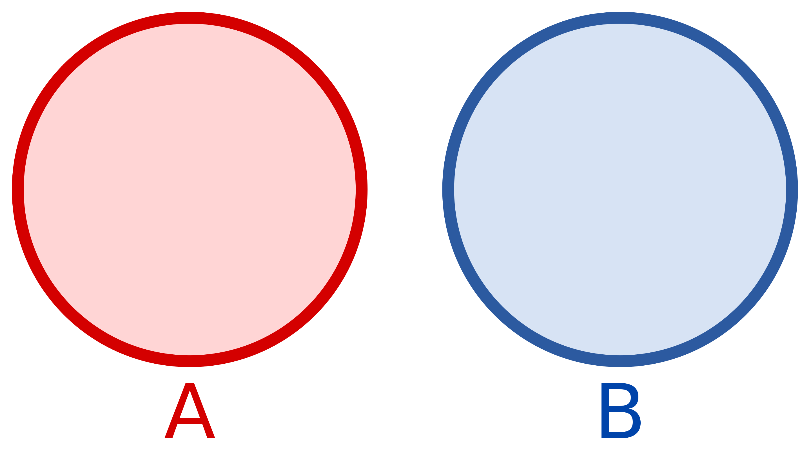{#fig-disjunkt width="25%" fig-align="center"}


[Quelle: rither.de](http://www.rither.de/a/mathematik/stochastik/mengentheorie-und-venn-diagramme/)


::::: {#exm-disjunkt1}
Das Ereignis $A$ "Gerade Augenzahl beim Würfelwurf", $A={2,4,6}$ und das Ereignis $B$ "Ungerade Augenzahl beim Würfelwurf", $B={1,3,5}$ sind disjunkt, s. @fig-disjunkt1.


::::{#fig-disjunkt1}

::: {.figure-content}


\begin{align}
A = \{2,4, 6\} \qquad \hfill \boxed{2\; 4\; 6} \\
B = \{1,3,5\} \qquad  \hfill \boxed{1\; 3\; 5} \\
\hline \\
A \cap B = \qquad  \hfill  \emptyset
\end{align}
:::

Beispiel für disjunkte Ereignisse

::::


:::::


:::{exm-disjunkt2}
Die Ereignisse "normaler Wochentag" und "Sonntag" sind disjunkt. $\square$
:::


:::{#exr-elementarereignis}
### Peer Instruction: Elementarereignis
Welche der folgenden Ereignisse zeigt ein Elementarereignis des Würfelwurfs (wobei die Augenzahl 1, 2, ..., 6 die Ergebnisse sind)?

A) Gerade Zahl gewürfelt
B) Ungereade Zahl gewürfelt
C) Keine *6* gewürfelt
D) *1* gewürfelt
E) Keine der genannten $\square$
:::


## Was ist Wahrscheinlichkeit?


Die "klassische" Logik der Wissenschaft beruht auf Schlüssen (Syllogismen) wie diesem: "Alle Schwäne sind weiß." $\rightarrow$ "Dies ist ein Schwan." $\rightarrow$ "Dieser Schwan ist weiß."

Mit dem Konzept von Wahrscheinlichkeit können wir jetzt auch folgende Logik anwenden:
"Die meisten Schwäne sind weiß." $\rightarrow$ "Dies ist ein Schwan." $\rightarrow$ "Dieser Schwan ist wahrscheinlich weiß."
Das ist ein großer Fortschritt, der die Denkweise der Wissenschaft gut widerspiegelt und dafür eine logisch-mathematische Grundlage bereitstellt,
 s. @fig-prob-logic.
Die Wahrscheinlichkeitsrechnung ist die typische Methode, um Ungewissheit zu präzisieren, d.h. zu quantifizieren.


### Formallogische Definitition

#### Wahrscheinlichkeit als Erweiterung der Logik


Die formallogische Konzeption von Wahrscheinlichkeit sieht Wahrscheinlichkeit als Erweiterung der formalen Logik [@jaynes2003].
^[Manchmal wird diese Art der Wahrscheinlichkeit auch *epistemologische* Wahrscheinlichkeit genannt.] 
In der formalen Logik ist ein Ereignis entweder *falsch* oder *wahr*. 
In der formallogischen Konzeption wird der Platz zwischen "falsch" (0) und "richtig" 
(1)
als die Wahrscheinlichkeit $0<p<1$, gesehen [@briggs2016], s. @fig-prob-logic.
Größere Werte stehen für größere Wahrscheinlichkeit und umgekehrt.


:::{#def-wskt}
### Einfache Definition von Wahrscheinlichkeit
Die Wahrscheinlichkeit ist ein Maß für die Plausibilität einer Aussage $A$, gegeben gewisser Hintergrundinformationen (Daten, $D$): $Pr(A|D)$.
Die Wahrscheinlichkeit eines Ereignisses wird (sofern berechenbar) als Zahl zwischen 0 und 1 angegeben,
wobei 0 bedeutet, dass das Ereignis als unmöglich angesehen wird,
und 1 bedeutet, dass das Ereignis als sicher betrachtet wird.
Je näher die Wahrscheinlichkeit bei 1 (0) liegt, desto sicherer ist jemand,
dass das Ereignis (nicht) der Fall ist.$\square$
:::


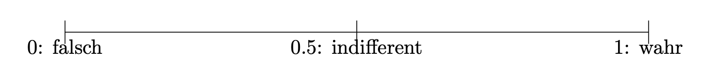{#fig-prob-logic}

Nach dieser "Wahrscheinlichkeitslogik" kann man ein Ereignis, 
von dessen Eintreten man "wenig überzeugt" ist, z.B. mit 0.2 quantifizieren. 
Hingegen einem Ereignis, von man "recht sicher" ist, mit 0.8 quantifizieren, s. @fig-prob-logic2.


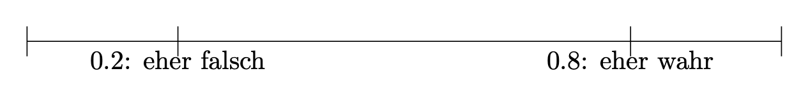{#fig-prob-logic2}


#### Wahrscheinlichkeit als Ungewissheit


Wahrscheinlichkeit existiert nicht in dem Sinne, wie ein Stein oder ein Mensch existiert. Wahrscheinlichkeit ist stattdessen eine Art von Wissen.
Daher ist es (nach @jaynes2003) falsch, zu sagen:
"Die Wahrscheinlichkeit für Zahl bei dieser Münze ist 50%."
Richtig wäre für einen unbedarften Spieler: "Ich habe keinen Grund, nicht an der Fairness der Münze zu glauben, also gehe ich von 50% Wahrscheinlichkeit für Zahl aus."
Der Betrüger, der diese Münze in der Hand hat, geht allerdings von einer Wahrscheinlichkeit von 75% für Zahl aus (er kennt die Münze besser als Sie).

Das Beispiel zeigt: Wahrscheinlichkeit ist kein Ding der Welt, sondern ein Wissenszustand.


Formaler ausgedrückt: Sei $Pr$ die Wahrscheinlichkeit des Ereignis $Z$ (Zahl) angibt, *gegeben* meiner Annahme, dass die Münze fair ist ($F$), also eine Wahrscheinlichkeit von 50% (1/2 = .5) hat für $Z$. Dann kann man kurz schreiben:

$$Pr(Z|F) = 0.5$$
Gegeben des Wissens des Betrügers $B$ wäre die Wahrscheinlichkeit für $Z$ anders:

$$Pr(Z|B) = 0.75$$

In Worten: "Die Wahrscheinlichkeit von Zahl ($Z$) gegeben das Wissen des Betrügers über die Münze ($B$) liegt bei 75%.

#### Wahrscheinlichkeit ist bedingt auf ein Hintergrundwissen

Das Beispiel zeigt auch, dass die Wahrscheinlichkeit eines Ereignissens (wie $Z$) von Hintergrundinformationen (Annahmen, Daten, Evidenz, ...) abhängt.
Ohne zu sagen, auf welche Hintergrundinterformationen wir uns beziehen (die des unbedarften Spielers oder die des Betrügers), ist es sinnvoll, eine Wahrscheinlichkeit anzugeben.
Daher ist $Pr(Z) = 0.5$ unvollständig.
Allerdings wird die Hintergrundinformation oft weggelassen, wenn es klar ist, welche Hintergrundinformation vorliegt.
So wird häufig vorausgesetzt, dass eine Münze fair ist.

:::{#exm-bedingt}
### Morgen regnet's

Es ist daher unvollständig zu sagen: "Morgen wir es mit einer Wahrscheinlichkeit von 70% regnen."

Man müsste Hintergrundinformation (*Evidenz*, $E$) ergänzen, z.B. "gegeben meines Wissens zum Wettermodell X".

Also: Anstelle von $Pr(\text{Regen}) = .7$ besser schreiben: $Pr(\text{Regen|Wettermodell X})$. $\square$
:::


:::{#exm-bedingt2}
### Wahrscheinlichkeit für Krebs

Jemand beobachtet bei sich Symptome, die für eine eine Hautkrebserkrankung $K$ typisch sind. Die Person sagt sich: "Ach, die Wahrscheinlichkeit für Hautkrebs liegt bei einem Promill. Kein Grund für Sorge." Formal: $Pr(K) = 0.001$.
Aber wenn die Person relevante Symptome $S$ hat, gilt: $Pr(\text{K} \mid \text{S}) \gg 0.001$. $\square$
:::


:::callout-note
Sagt jemand: "Die Wahrscheinlichkeit von A ist x%", frag immer: "gegeben welcher Annahmen, welcher Evidenz?"
:::


:::{#def-indifferenzprinzip}
### Indifferenzprinzip

Das Indifferenzprinzip (synonym: Prinzip des unzureichenden Grundes) besagt, 
dass in Abwesenheit jeglicher Informationen, die bestimmte Ereignisse bevorzugen oder benachteiligen würden, 
alle möglichen Ereignisse als gleich wahrscheinlich angesehen werden sollten. $\square$
:::

Vor uns liegt ein Würfel. Schlicht, ruhig, unbesonders.
Wir haben keinen Grund anzunehmen, dass eine seiner $n=6$ Seiten bevorzugt nach oben zu liegen kommt. 
Jedes der sechs Elementarereignisse ist uns gleich plausibel;
der Würfel erscheint uns fair.
In Ermangelung weiteres Wissens zu unserem Würfel gehen wir schlicht davon aus, dass jedes der $n$ Elementarereignisse gleich wahrscheinlich ist.
Es gibt keinerlei Notwendigkeit, den Würfel in die Hand zu nehmen,
um zu einer Wahrscheinlichkeitsaussage auf diesem Weg zu kommen.
Natürlich *könnten* wir unsere Auffassung eines fairen Würfels testen,
aber auch ohne das Testen können wir eine stringente Aussage (basierend auf dem Indifferenzprinzip (s. @def-indifferenzprinzip) der $n$ Elementarereignisse) zur Wahrscheinlichkeit eines bestimmten (Elementar-)Ereignisses $A$ kommen [@briggs2016], s. @thm-briggs.


:::{#thm-briggs}

### Indifferenzprinzip

$$Pr(A) = \frac{1}{n}= \frac{1}{|\Omega|} \quad \square$$
:::

:::{#exm-briggs}
Sei $A$ = "Der Würfel wird beim nächsten Wurf eine 6 zeigen."
Die Wahrscheinlichkeit für $A$ ist $1/6. \square$
:::


:::{#exm-prob}
### Kann Sophia (Einhorn) fliegen?

Sei $A$: "Sophia ist ein Einhorn". Und sei $B$: "Einhörner mit Flügeln können fliegen und die Hälfte aller Einhörner hat Flügel". Dann ist $Pr(A|B) = 1/2$.
$\square$
:::


:::{#exm-prob3}
### Ich werfe Zahl beim nächsten Münzwurf

$B$ "Ich habe keinen Grund an der Fairness der Münze zu zweifeln". 
$A$: "Es wird *Zahl* geworfen beim nächsten Wurf dieser Münze". 
Es gilt: $Pr(A|B) = 1/2$. $\square$
:::


:::{#def-laplace}
### Laplace-Experimt
Ein Zufallsexperiment, bei dem alle Elementarereignisse dieselbe Wahrscheinlichkeit haben, nennt man man ein *Laplace-Experiment*, s. @thm-laplace. $\square$
:::

In Erweiterung von @thm-briggs können wir für ein Laplace-Experiment schreiben, s. @thm-laplace.

:::{#thm-laplace}

### Laplace-Experiment

$$Pr(A)=\frac{\text{Anzahl Treffer}}{\text{Anzahl möglicher Ergebnisse}} \quad \square$$
:::


### Frequentistische Definition

In Ermangelung einer Theorie zum Verhalten eines (uns) unbekannten Zufallsvorgangs und unter der Vermutung, dass die Elementarereignisse nicht gleichwahrscheinlich sind, bleibt uns ein einfacher (aber aufwändiger und manchmal unmöglicher) Weg, um die Wahrscheinlichkeit eines Ereignisses zu bestimmen: Ausprobieren.

Angenommen, ein Statistik-Dozent, bekannt für seine Vorliebe zum Glücksspiel und 
mit scheinbar endlosen Glückssträhnen (er wirft andauernd eine 6), 
hat seinen Lieblingswürfel versehentlich liegen gelassen. 
Das ist *die* Gelegenheit!
Sie greifen sich den Würfel, und ... Ja, was jetzt?
Nach kurzer Überlegung kommen Sie zum Entschluss, den Würfel einem "Praxistest" zu unterziehen: 
Sie werfen ihn 1000 Mal (Puh!) und zählen den Anteil der `6`.
Falls der Würfel fair ist, müsste gelten $Pr(A=6)=1/6\approx .17$. Schauen wir mal!


```{r}
#| echo: false
n <- 1e3

set.seed(42)
wuerfel_oft <- 
  sample(x = 1:6, size = n, replace = TRUE) 


wuerfel_tab <-
  tibble(
    id = 1:n,
    x = wuerfel_oft,
    ist_6 = ifelse(x == 6, 1, 0),
    ist_6_cumsum = cumsum(ist_6) / id
  )

```


Und hier der Anteil von  `6` im Verlauf unserer Würfe, s. @fig-wuerfel.


```{r}
#| label: fig-wuerfel
#| fig-cap: "Das Gesetz der großen Zahl am Beispiel der Stabilisierung des Trefferanteils beim wiederholten Würfelwurf"
#| fig-asp: 0.5
#| echo: false

wuerfel_tab %>% 
  slice_head(n = 1e3) %>% 
  ggplot() +
  aes(x = id, y = ist_6_cumsum) +
  geom_hline(yintercept = 1/6, color = "grey80", size = 3) +
  geom_line() +
  labs(x = "Nummer des Würfelwurfs",
       y = "Kummulierte Häufigkeit einer Sechs") +
  annotate("label", x = 1000, y = 1/6, label = "0.17")
```

Hm, auf den ersten Blick ist kein (starkes) Anzeichen für Schummeln bzw. einen gezinkten Würfel zu finden.


### Kolmogorovs Definition {#sec-kolmogorov}

Kolmogorov richtet eine Reihe von Forderungen an eine Definition von bzw. an das Rechnen mit Wahrscheinlichkeiten, 
die direkt plausibel erscheinen:

1. *Nichtnegativität*: Die Wahrscheinlichkeit eines Ereignisses kann nicht negativ sein.
2. *Normierung*: Das sichere Ereignis hat die Wahrscheinlichkeit 1 bzw. 100%: $Pr(\Omega)=1$; das unmögliche Ereignis hat die Wahrscheinlichkeit 0: $Pr(\emptyset)=0$.
3. *Additivität*. Sind $A$ und $B$ disjunkt, dann ist die Wahrscheinlichkeit, 
dass mindestens eines der beiden Ereignisse eintritt ($A\cup B$) gleich der Summe der beiden Einzelwahrscheinlichkeiten von $A$ und $B$.


:::{#exr-prob2}
### Peer Instruction: Ist der Schmockulator im Zustand alpha?

$B$: "Locuratoren und Schmockulatoren kommen in zwei Zuständen vor, alpha und beta". 
Leider wissen wir nichts Weiteres über Locuratoren und Schmockulatoren.
Vor Ihnen steht ein Schmockulator. 
Welche möglichst präzise Aussage können wir über den Zustand des Schmockulator treffen?

A) Der Schmockulator ist sicher im Zustand alpha.
B) Der Schmockulator ist in einem der beiden Zustände.
C) Der Schmockulator ist vermutlich im Zustand alpha.
D) Der Schmockulator ist möglicherweise im Zustand alpha.
E) Der Schmockulator ist mit einer Wahrscheinlichkeit von 50% im Zustand alpha.
F) Keine der genannten. $\square$
:::


## Relationen von Ereignissen

Für das Rechnen mit Wahrscheinlichkeiten ist es hilfreich, ein paar Werkzeuge zu kennen, die wir uns im Folgenden anschauen.

:::{#def-relation}
### Relation
Eine Relation (zweier Ereignisse) bezeichnet die Beziehung, 
in der die beiden Ereignisse zueinander stehen. $\square$
:::

Typische Relationen sind Gleichheit, Ungleichheit, Vereinigung, Schnitt.


### Überblick


Wir gehen von Grundraum $\Omega$ aus, mit dem Ereignis $A$ als echte Teilmenge von $\Omega$: $A \subset \Omega$.


Da wir Ereignisse als Mengen auffassen, verwenden wir im Folgenden die beiden Begriffe synonym.


Dabei nutzen wir u.a. Venn-Diagramme.
Venn-Diagramme eigenen sich, um typische Operationen (Relationen) auf Mengen zu visualisieren. Die folgenden Venn-Diagramme stammen von [Wikipedia (En)](https://en.wikipedia.org/wiki/Venn_diagram).

:::callout-note
### Wozu sind die Venn-Diagramme gut? Warum soll ich die lernen?
Venn-Diagramme zeigen Kreise und ihre überlappenden Teile;
daraus lassen sich Rückschlüsse auf Rechenregeln für Wahrscheinlichkeiten ableiten.
Viele Menschen tun sich leichter, 
Rechenregeln visuell aufzufassen als mit Formeln und Zahlen alleine. Aber entscheiden Sie selbst!$\square$
:::


[Diese App](https://www.geogebra.org/m/QZvCMSDs) versinnbildlicht das Rechnen mit Relationen von Ereignissen anhand von Venn-Diagrammen.^[<https://www.geogebra.org/m/QZvCMSDs>]


### Vereinigung von Ereignissen

:::{#def-mengen-verein}
### Vereinigung von Ereignissen
Vereinigt man zwei Ereignisse $A$ und $B$, dann besteht das neue Ereignis $C$ genau aus den Elementarereignissen der vereinigten Ereignisse.
Man schreibt $C = A \cup B$, lies: "C ist A vereinigt mit B", oder "Menge A ODER Menge B".$\square$
:::

@fig-cup zeigt ein Venn-Diagramm zur Verdeutlichung der Vereinigung von Ereignissen.

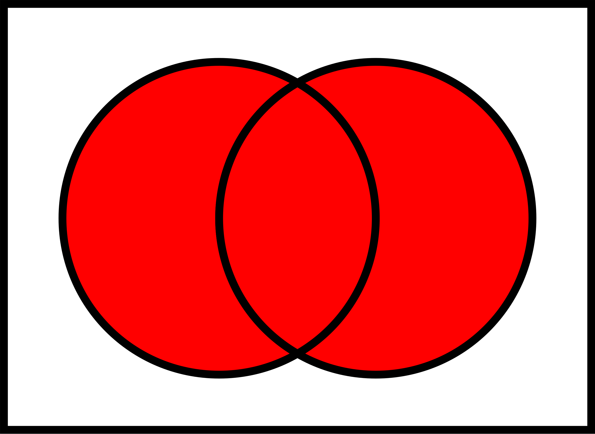{#fig-cup width=25%}

::::::{#exm-mengen-verein}

Um einen (hohen!) Geldpreis zu gewinnen, muss bei ihrem nächsten Wurf mindestens eines der beiden Ereignisse $A= {1,2}$ oder $B={2,3}$ eintreten, s. @fig-venn-mengen-verein.

:::::{#fig-venn-mengen-verein}

:::: {.figure-content}


\begin{aligned}
A = \{1,2\} \qquad \boxed{\boxed{1\; 2}\; \color{gray}{ 3\; 4\; 5\; 6}} \\
B = \{2,3\} \qquad  \boxed{1\; \boxed{2\; 3}\; \color{gray}{ 4\; 5\; 6}} \\
\newline
\hline \\
A \cup B = \{1,2,3\} \qquad \boxed{\boxed{1\; 2\; 3}\; \color{gray}{4\; 5\; \boxed{6}}}
\end{aligned}
::::


Beispiel zur Vereinigung zweier Mengen

:::::


::::::


Zur besseren Verbildlichung betrachten Sie mal diese
[Animation zur Vereinigung von Mengen](https://www.geogebra.org/m/GEZV4xXc#material/cmXR8fHN); [Quelle](Geogebra, J. Merschhemke).


In R heißt die Vereinigung von Mengen `union()`. Einfach mal Ausprobieren.

```{r}
A <- c(1, 2)
B <- c(2, 3)

union(A, B)
```


### (Durch-)Schnitt von Ereignissen


:::{#def-mengen-schnitt}
### Schnittmenge von Ereignissen
Die Schnittmenge zweier Ereignisse $A$ und $B$ umfasst genau die Elementarereignisse, 
die Teil beider Ereignisse sind. Man schreibt: $A \cap B.$^[Synonym und kürzer: $AB$ anstelle von $A \cap B$.] Lies: "A geschnitten B", oder "Menge A UND Menge B". $\square$
:::

@fig-cap zeigt ein Sinnbild zur Schnittmenge zweier Ereignisse.


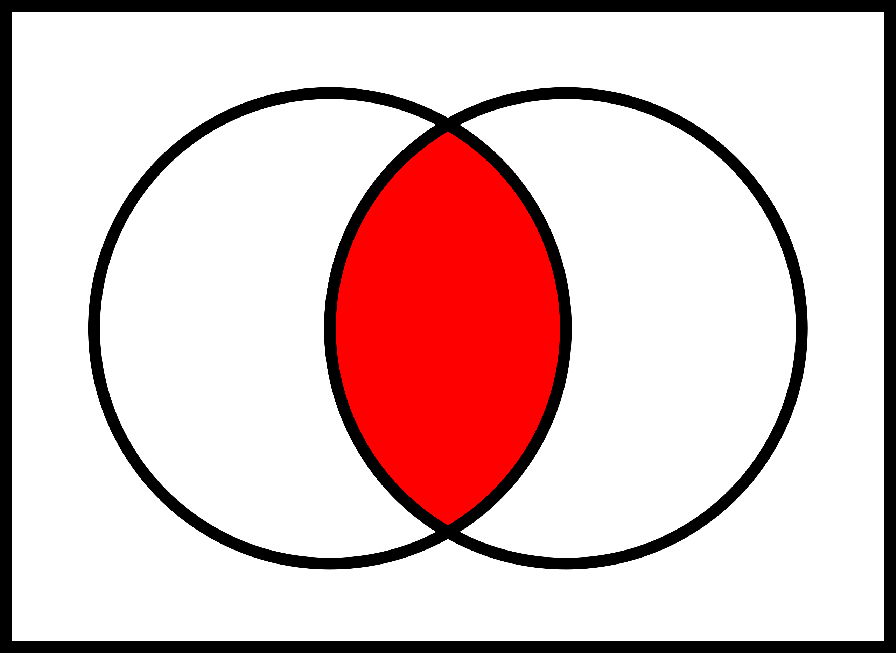{#fig-cap width=25%}


::::::{#exm-mengen-schnitt}

Um einen (hohen!) Geldpreis zu gewinnen, muss bei ihrem nächsten Wurf sowohl das Ereignis $A$ = "gerade Augenzahl" als auch $B$ = "Augenzahl größer 4" eintreten, s. @fig-mengen-schnitt.

:::::{#fig-mengen-schnitt}

:::: {.figure-content}

\begin{align}
& A = \{2,4,6\} \qquad \hfill \boxed{\color{gray}{1}\; \boxed{\color{black}{2}}\; \color{gray}{3}\; \boxed{\color{black}{4}}\; \color{gray}{5}\; \boxed{\color{black}{6}}\;} \\
& B = \{5,6\} \qquad \qquad \hfill  \boxed{ \color{gray}{1\; 2\; 3\; 4\;} \boxed{\color{black}{5\; 6}}} \\
\newline
\hline \\
& A \cap B = \{6\} \qquad \qquad \hfill  \boxed{\color{gray}{1\; 2\; 3\; 4\; 5\;} \color{black}{6}}
\end{align}
::::

Beispiel zum Schnitt zweier Mengen

:::::
::::::


```{r}
A <- c(2, 4, 6)
B <- c(5, 6)
intersect(A, B)
```


:::callout-note
#### Eselsbrücke zur Vereinigungs- und Schnittmenge

Das Zeichen für eine Vereinigung zweier Mengen kann man leicht mit dem Zeichen für einen Schnitt zweier Mengen leicht verwechseln; 
daher kommt eine Eselbrücke gelesen, s. @fig-esel.

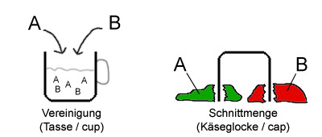{#fig-esel width=55%}
:::


### Komplementärereignis


:::{#def-menge-komplement}
### Komplementärereignis
Ein Ereignis $B$ ist genau dann ein Komplementärereignis zu $A$, 
wenn es genau die Elementarereignisse von $\Omega$ umfasst, 
die nicht Elementarereignis von $A$ sind, s. @fig-neg.$\square$
:::


Man schreibt für das Komplementärereignis^[synonym: Komplement] von $A$ oft $\bar{A}$ oder $\neg A$^[manchmal auch $A^C$; *C* wie *c*omplementary event]; lies "Nicht-A" oder "A-quer".


:::::{#exm-mengen-komplement}

Beim normalen Würfelwurf sei $A$ das Ereignis "gerade Augenzahl"; 
das Komplementärereignis^[das "Komplement", nicht zu verwechseln mit "Kompliment"] 
ist dann $\neg A$ "ungerade Augenzahl", s. @fig-mengen-komplement.


::::{#fig-mengen-komplement}

::: {.figure-content}


\begin{align}
A = \{2,4,6\} \qquad \hfill \boxed{\color{gray}{1}\; \boxed{\color{black}{2}}\; \color{gray}{3}\; \boxed{\color{black}{4}}\; \color{gray}{5}\; \boxed{\color{black}{6}}\;} \\
\hline \\
\neg A = \{1,3,5\} \qquad  \hfill \boxed{\boxed{\color{black}{1}}\; \color{gray}{2}\; \boxed{\color{black}{3}}\; \color{gray}{4}\; \boxed{\color{black}{5}}\; \color{gray}{6}\; } \\
\end{align}

:::
Ein Beispiel für ein Komplement

:::::

::::::


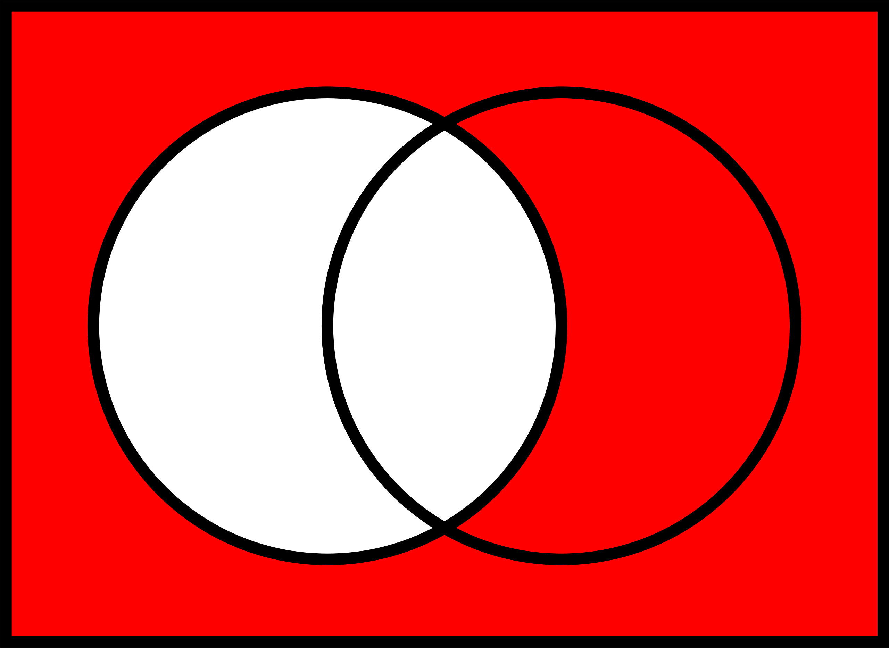{#fig-neg width=25%}


:::{#exm-ind}
### Gezinkter Würfel
Ein gezinkter Würfel hat eine erhöhte Wahrscheinlichkeit für das Ereignis $A=$"6 liegt oben", 
und zwar gelte $Pr(A)=1/3$.
Was ist die Wahrscheinlichkeit, *keine*  `6` zu würfeln? $\square$^[Die Wahrscheinlichkeit, 
keine `6` zu würfeln, liegt bei $2/3$.]
:::


### Logische Differenz

:::{#def-mengen-diff}
### Logische Differenz
Die logische Differenz der Ereignisse $A$ und $B$ ist das Ereignis, 
das genau aus den Elementarereignissen besteht von $A$ besteht, 
die nicht zugleich Elementarereignis von $B$ sind, s. @fig-setminus.$\square$
:::

Die logische Differenz von $A$ zu $B$ schreibt man häufig so: $A \setminus B$; lies "A minus B".


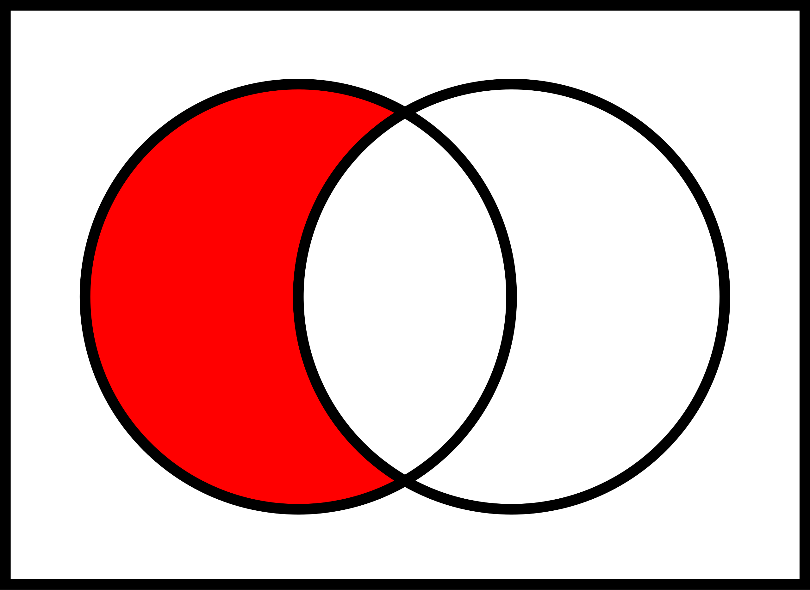{#fig-setminus width=25%}

:::::{#exm-mengen-setminus}

Sei $A$ die Menge "große Zahlen" mit $A = \{4,5,6 \}$.
Sei $B$ die Menge "gerade Zahlen" mit $B = \{2,4,6\}$.
Wir suchen die logische Differenz, $A \setminus B$, s. @fig-mengen-setminus.

::::{#fig-mengen-setminus}

::: {.figure-content}


\begin{align}
A = \{4,5, 6\} \qquad \hfill \boxed{\color{red}{4}\; \color{green}{5}\; \color{red}{6}} \\
B = \{2,4,6\} \qquad  \hfill \boxed{\color{grey}{2}\; \color{red}{4}\; \color{red}{6}} \\
\hline \\
A \setminus B \qquad \hfill \boxed{\color{green}{5}}
\end{align}
:::

Beispiel für die logische Differenz

::::
:::::


In R gibt es die Funktion `setdiff()`, die eine Mengendifferenz ausgibt.

```{r}
A <- c(4, 5, 6)
B <- c(2, 4, 6)

setdiff(A, B)
```

🤯 Von der Menge $A$ die Menge $B$ abzuziehen, ist etwas anderes, als von $B$ die Menge $A$ abzuziehen.


:::callout-caution
$A \setminus B \ne B \setminus A$.
:::

```{r}
setdiff(B, A)
```


:::{#exr-setminus2}
### $B$ minus $A$?
Berechnen Sie $B \setminus A$. $\square$^[2]
:::


:::{#exr-komplement}
### Peer Instruction: Das Komplementärereignis von der Bestnote

Sie haben eine Statistikklausur bestanden. Mit Bestnote.
Genauer gesagt, haben Sie 100 von 100 Punkten erzielt.
Was ist das Komplementärereignis dazu?

A) 99 Punkte
B) 0 Punkte
C) 0-99 Punkte
D) 0-100 Punkte
E) durchgefallen
F) keines der genannten $\square$
:::


Nutzen Sie dieese [Animation zu Mengenoperationen](https://seeing-theory.brown.edu/compound-probability/index.html) als weitere Veranschaulichung.

## Zufallsvariable

### Grundlagen

:::{#exm-thesis}
Schorsch sucht eine Betreuerin für seine Abschlussarbeit.
An die ideale Betreuerin setzt er 4 Kriterien an: 
a) klare, schriftliche fixierte Rahmenbedingungen, 
b) viel Erfahrung, 
c) guten Ruf und 
d) interessante Forschungsinteressen.
Je mehr dieser 4 Kriterien erfüllt sind, desto besser. 
Schorsch geht davon aus, dass die 4 Kriterien voneinander unabhängig sind (ob eines erfüllt ist oder nicht, ändert nichts an der Wahrscheinlichkeit, dass ein anderes Kriterium erfüllt ist).
Schorsch interessiert sich also für die *Anzahl* der erfüllten Kriterien, also eine Zahl von 0 bis 4.
Er schätzt die Wahrscheinlichkeit für einen "Treffer" in jedem seiner 4 Kriterien auf 50%.
Viel Glück, Schorsch!
Sein Zufallsexperiment hat 16 Ausgänge (Knoten 16 bis 31), s. @fig-4muenzen und @tbl-schorsch-zufall. Ganz schön komplex.
Eigentlich würden ihm ja eine Darstellung mit 5 Ergebnissen, also der "Gutachter-Score" von 0 bis 4 ja reichen. 
Wie können wir die Sache übersichtlicher für Schorsch machen? @fig-4muenzen ist ein Versuch. $\square$
:::


{#fig-4muenzen width=100%}


```{r}
#| echo: false
#| tbl-cap: Schorschs Zufallsexperiment, Auszug der Elementarereignisse (EE)
#| label: tbl-schorsch-zufall
d <- tibble::tribble(
   ~i, ~Elementarereignis, ~`Pr(EE)`, ~Trefferzahl,
  "1",             "NNNN",    "1/16",          "0",        
  "2",             "NNNT",    "1/16",          "1",             
  "3",             "NNTN",    "1/16",          "1",            
  "4",             "NTNN",    "1/16",          "1",        
  "5",             "TNNN",    "1/16",          "1",            
  "6",             "NNTT",    "1/16",          "2",            
  "…",                "…",       "…",          "…"         
  )


gt(d)
```


Schorsch braucht also eine übersichtlichere Darstellung;
die Zahl der Treffer und ihre Wahrscheinlichkeit würde ihm ganz reichen.
In vielen Situationen ist man an der *Anzahl der Treffer* interessiert.
Die Wahrscheinlichkeit für eine bestimmte Trefferanzahl bekommt man einfach durch Addieren der Wahrscheinlichkeiten der zugehörigen Elementarereignisse, s. @tbl-schorsch-zufall.
Hier kommt die *Zufallsvariable* ins Spiel.
Wir nutzen sie, um die Anzahl der Treffer in einem Zufallsexperiment zu zählen.


:::{#def-zufallsvariable}
### Zufallsvariable
Die Zuordnung der Elementarereignisse eines Zufallsexperiments zu genau einer Zahl 
$\in \mathbb{R}$ nennt man Zufallsvariable. $\square$
:::

Die den Elementarereignissen zugewiesenen Zahlen nennt man *Realisationen* oder *Ausprägungen* der Zufallsvariablen.

:::{#exm-lotto}
### Lotto
Ein Lottospiel hat ca. 14 Millionen Elementarereignisse. Die Zufallsvariable "Anzahl der Treffer" hat nur 7 Realisationen: 0, 1, ..., 6. $\square$
:::

Es hat sich eingebürgert, Zufallszahlen mit $X$ zu bezeichnen (oder anderen Buchstaben weit hinten aus dem Alphabet).

Man schreibt für eine Zufallsvariable kurz: $X: \Omega \rightarrow \mathbb{R}$.
"X ist eine Zufallsvariable, die jedem Elementarereignis $\omega$ eine reelle Zahl zuordnet."
Um die Vorschrift der Zuordnung genauer zu bestimmen, kann man folgende Kurzschreibweise nutzen:


${\displaystyle X(\omega )={\begin{cases}1,&{\text{wenn }}\omega ={\text{Kopf}},\\[6pt]0,&{\text{wenn }}\omega ={\text{Zahl}}.\end{cases}}}$


@fig-zv stellt diese Abbildung dar.


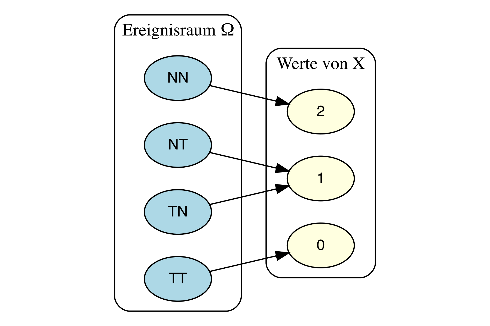{#fig-zv width=33%}


Zufallsverteilungen kann im zwei Arten einteilen:

1. diskrete Zufallsvariablen
2. stetige Zufallsvariablen


### Diskrete Zufallsvariable

#### Grundlagen

Eine diskrete Zufallsvariable ist dadurch gekennzeichnet, dass nur bestimmte Realisationen möglich sind, 
zumeist natürliche Zahlen, wie 0, 1, 2,..., .
@fig-zuv-disk versinnbildlicht die Zufallsvariable des "Gutachter-Scores", s. @exm-thesis.


```{r}
#| echo: false
#| fig-asp: 0.2
#| label: fig-zuv-disk
#| fig-cap: Sinnbild einer diskreten Zufallsvariablen X für Schorschs Suche nach einer Betreuerin seiner Abschlussarbeit. X gibt den Score der Gutachterin wider.
ggplot(data.frame(x=c(0:4), y = 0), aes(x,y)) +
  geom_point(size = 5, alpha = .7) +
  scale_y_continuous(limits = c(-1,1), breaks = NULL) +
  scale_x_continuous(breaks = 0:4, labels = 0:4) +
  theme_minimal() +
  labs(y = "", x = "")

```


:::{#exm-zv-disk}
### Diskrete Zufallsvariablen

- Anzahl der Bewerbungen bis zum ersten Job-Interview
- Anzahl Anläufe bis zum Bestehen der Statistik-Klausur
- Anzahl der Absolventen an der HS Ansbach pro Jahr
- Anzahl Treffer beim Kauf von Losen
- Anzahl Betriebsunfälle
- Anzahl der Produkte in der Produktpalette $\square$
:::


:::{#exm-wert-wuerfel}
### Wahrscheinlichkeitsverteilung eines einfachen Würfelwurfs 
@fig-w-wuerfel zeigt die Wahrscheinlichkeitsverteilung eines einfachen Würfelwurfs. $\square$
:::

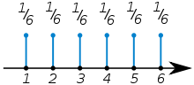{#fig-w-wuerfel width=33%}


:::{#exm-zweiwuerfel}
Der zweifache Würfelwurf ist ein typisches Lehrbuchbeispiel für eine diskrete Zufallsvariable.
^[da einfach und deutlich]
Hier ist $S$^[S wie Summe] die Augen*s*umme des zweifachen Würfelwurfs 
und $S$ ist eine Zahl zwischen 2 und 12.
Für jede Realisation $X=x$ kann man die Wahrscheinlichkeit berechnen, 
@fig-zweiwuerfel-vert versinnbildlicht die Wahrscheinlichkeit für jede Realisation von $X$. $\square$
:::

.svg.png){#fig-zweiwuerfel-vert width=50%}


*Wahrscheinlichkeitsverteilungen* dienen dazu, den Realisationen einer Zufallsvariablen eine Wahrscheinlichkeit zuzuordnen.


:::{#def-wvert-disk}
### Diskrete Wahrscheinlichkeitsverteilung
Eine *diskrete* Wahrscheinlichkeitsverteilung der (diskreten) Zufallsvariablen $X$ ordnet jeder der $k$ Ausprägungen $X=x$ eine Wahrscheinlichkeit $p$ zu. $\square$
:::

:::{#exm-babies}
### Wahrscheinlichkeit des Geschlechts bei der Geburt
So hat die Variable *Geschlecht eines Babies* die beiden Ausprägungen *Mädchen* und *Junge* mit den Wahrscheinlichkeiten $p_M = 51.2\%$ bzw. $p_J = 48.8\%$, laut einer Studie [@gelman2021]. $\square$
:::


Zwischen der deskriptiven Statistik und der Wahrscheinlichkeitstheorie bestehen enge Parallelen, 
@tbl-wkeit-desk stellt einige zentrale Konzepte gegenüber.
Bei einer guten Stichproben kann man die Kennwerte der deskriptiven Statistik
als Schätzwerte für die zugrundeliegende Wahrscheinlichkeit verwenden.

```{r}
#| echo: false
#| label: tbl-wkeit-desk
#| tbl-cap: "Gegenüberstellung von Wahrscheinlichkeitstheorie und deskriptiver Statistik"
d <- tibble::tribble(
         ~Wahrscheinlichkeitstheorie,                      ~`Deskriptive Statistik`,
                   "Zufallsvariable",                                   "Merkmal",
                "Wahrscheinlichkeit",               "relative Häufigkeit, Anteil",
       "Wahrscheinlichkeitsverteilung",   "einfache relative Häufigkeitsverteilung",
               "Verteilungsfunktion", "kumulierte relative Häufigkeitsverteilung",
                    "Erwartungswert",                                "Mittelwert",
                           "Varianz",                                   "Varianz"
       )
gt::gt(d)
```


```{r}
#| echo: false
#| message: false
#| warning: false
dice_outcomes <- expand.grid(Die1 = 1:6, Die2 = 1:6)

# Calculate the sum of the two dice for each outcome
dice_outcomes$Sum <- dice_outcomes$Die1 + dice_outcomes$Die2

# Calculate the probability of each sum using the table function
sum_counts <- table(dice_outcomes$Sum)
total_outcomes <- sum(sum_counts)
probabilities <- sum_counts / total_outcomes

twodice <- tibble(
  Augensumme = 2:12,
  p = probabilities) |> 
  mutate(p_cum = cumsum(p))

p_twodice <- 
  ggplot(twodice, aes(x = Augensumme, y = p)) + 
  geom_col() +
  geom_label(aes(y = p, label = round(p, 2), nudge_y = .1)) +
  scale_x_continuous(breaks = 1:12)
```


```{r}
#| echo: false
#| message: false
#| warning: false
#| 
num_trials <- 1000  # You can change this to the desired number of trials

# Simulate repeated throws of two dice
results <- replicate(num_trials, {
  die1 <- sample(1:6, 1, replace = TRUE)  # Simulate the first die
  die2 <- sample(1:6, 1, replace = TRUE)  # Simulate the second die
  c(Die1 = die1, Die2 = die2)  # Return the results as a vector
}) |> 
  t() |> 
  as_tibble() |> 
  mutate(Augensumme  = Die1 + Die2)

# Display

results_count <-
  results |> 
  count(Augensumme) |> 
  mutate(prop = n/num_trials) |> 
  mutate(n_cum = cumsum(n),
         prop_cum = cumsum(prop))

p_sim2dice <-
  ggplot(results_count) +
  aes(x = Augensumme, y = n) +
  geom_col() +
  geom_label(aes(y = n, label = round(prop, 2))) +
  scale_x_continuous(breaks = 1:12)
```


Eine *Verteilung* zeigt, welche Ausprägungen eine Variable aufweist und wie häufig bzw. wahrscheinlich diese sind. 
Einfach gesprochen veranschaulicht eine Balken- oder Histogramm eine Verteilung. Man unterscheidet Häufigkeitsverteilungen (s. Abb. @fig-2dice-sim) von Wahrscheinlichkeitsverteilungen (Abb. @fig-2dice-prob).


:::: {.columns}

::: {.column width="50%"}
```{r}
#| echo: false
#| fig-cap: Wahrscheinlichkeitsverteilung der Zufallsvariable "Augenzahl im zweifachen Würfelwurf"
#| label: fig-2dice-prob
p_twodice
```

:::

::: {.column width="50%"}
```{r}
#| echo: false
#| fig-cap: (relative und absolute) Häufigkeiten des zweifachen Würfelwurfs, 1000 Mal wiederholt
#| label: fig-2dice-sim
p_sim2dice
```
:::

::::


:::{#exm-w-fun}
Die Wahrscheinlichkeitsverteilung für $X$ "Augensumme im zweifachen Würfelwurf" ist in @fig-2dice-prob visualisiert. $\square$ 
:::


#### Vertiefung: Verteilungsfunktion


:::{#def-vert-fun}
### Verteilungsfunktion
Die Verteilungsfunktion $F$ gibt die Wahrscheinlichkeit an, 
dass die diskrete Zufallsvariable $X$ eine Realisation annimmt, die kleiner oder gleich $x$ ist.$\square$
:::


Die Berechnung von $F(x)$ erfolgt, indem die Wahrscheinlichkeiten aller möglichen Realisationen $x_i$, 
die kleiner oder gleich dem vorgegebenen Realisationswert $x$ sind, addiert werden:

$F(x) = \sum_{x_ \le x} Pr(X=x_i).$


```{r}
#| echo: false
p_F <- 
  ggplot(twodice, aes(x = Augensumme, y = p_cum)) + 
  geom_col() +
  geom_line() +
  geom_label(aes(label = round(p_cum, 2))) + 
  scale_x_continuous(breaks = 1:12) +
  labs(y = "Verteilungsfunktion F")


y_lab <- "empirische Verteilungsfunktion F emp."

p_F_emp <-
  ggplot(results_count) +
  aes(x = Augensumme, y = prop_cum) +
  geom_col() +
  geom_line() +
  geom_label(aes(y = prop_cum, label = round(prop_cum, 2))) +
  labs(y = y_lab) +
  scale_x_continuous(breaks = 2:12)
```


Die Verteilungsfunktion ist das Pendant zur *kumulierten Häufigkeitsverteilung*, vgl. @fig-kum-h-vert und @fig-kum-h-vert-emp:
Was die kumulierte Häufigkeitsverteilung für Häufigkeiten ist, ist die Verteilungsfunktion für Wahrscheinlichkeiten.


:::: {.columns}

::: {.column width="50%"}
```{r}
#| echo: false
#| fig-cap: Verteilungsfunktion $F(X \le x_i)$ für die Zufallsvariable "Augenzahl im zweifachen Würfelwurf"
#| label: fig-kum-h-vert
p_F
```

:::

::: {.column width="50%"}
```{r}
#| echo: false
#| fig-cap: Empirische Verteilungsfunktion (kumulierte Häufigkeitsverteilung) $F(X \le x_i)$ von 1000 zweifachen Münzwürfen
#| label: fig-kum-h-vert-emp
p_F_emp 
```

:::

::::


### Stetige Zufallsvariablen

#### Grundlagen


📺 [Verteilungen metrischer Zufallsvariablen](https://www.youtube.com/watch?v=7GqIE4sKDs4&list=PLRR4REmBgpIGgz2Oe2Z9FcoLYBDnaWatN&index=4)

@fig-zv-stetig-groesse versinnbildlicht die stetige Zufallsvariable "Körpergröße", die (theoretisch, in Annäherung) jeden beliebigen Wert zwischen 0 und (vielleicht) 2 Meter annehmen kann.

```{r echo = FALSE}
#| fig-cap: Sinnbild für eine stetige Zufallsvariable X "Körpergröße"
#| label: fig-zv-stetig-groesse
#| fig-asp: 0.2
 
ggplot(data.frame(x=0, y = 0), aes(x,y)) +
  #geom_point(size = 5, alpha = .7) +
  scale_y_continuous(limits = c(-1,1), breaks = NULL) +
  scale_x_continuous(breaks = c(0, 50, 100, 150, 200)) +
  annotate("segment", x = 0, xend = 200, y = 0, yend = 0, color = "red")  +
  theme_minimal() +
  annotate("label", x = 200, y = 0, label = "...") +
  labs(y = "", x = "")
```


:::{#def-zv-stetig}
### Stetige Zufallsvariable
Eine stetige Zufallsvariable gleicht einer diskreten, nur dass alle Werte im Intervall erlaubt sind. $\square$
:::


:::{#exm-zu-stetig}
- Spritverbrauch
- Körpergewicht von Professoren
- Schnabellängen von Pinguinen
- Geschwindigkeit beim Geblitztwerden $\square$
:::


:::{#exr-bus-42}
### Warten auf den Bus, 42 Sekunden
Sie stehen an der Bushaltestellen und warten auf den Bus.
Langweilig.
Da kommt Ihnen ein Gedanken in den Sinn: 
Wie hoch ist wohl die Wahrscheinlichkeit, dass Sie *exakt* 42 Sekunden auf den Bus warten müssen, s. @fig-p42?
Weiterhin überlegen Sie, dass davon auszugehen ist, dass jede Wartezeit zwischen 0 und 10 Minuten gleich wahrscheinlich ist.
Spätestens nach 10 Minuten kommt der Bus, so ist die Taktung (extrem zuverlässig).
Exakt heißt *exakt*, also nicht 42.1s, nicht 42.01s, nicht 42.001s, etc. bis zur x-ten Dezimale. $\square$
:::


Nicht so einfach (?). Hingegen ist die Frage, wie hoch die Wahrscheinlichkeit ist, zwischen 0 und 5 Minuten auf den Bus zu warten ($0<x<5$), einfach: Sie beträgt 50%, wie man in @fig-bus gut sehen kann.


:::: {.columns}

::: {.column width="50%"}

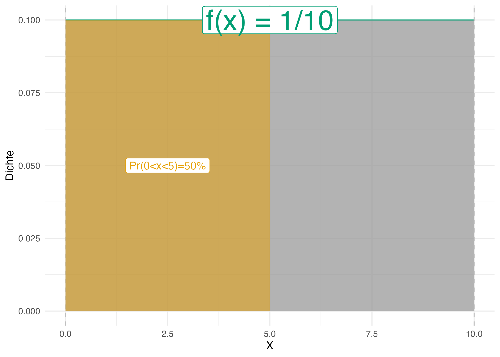{#fig-bus}


:::

::: {.column width="50%"}
```{r}
#| echo: false
#| fig-cap: "Wie groß ist die Wahrscheinlichkeit, genau 42 Sekunden auf den Bus zu warten? Hm."
#| label: fig-p42
#| warning: false
#| out-width: 100%

p_bus1 <- 
  uniform_Plot(0, 10) + 
  geom_vline(xintercept = .42, color = "#56B4E9FF", size = 1) +
  annotate("label", x = .42, y = .05, hjust = 0, label = "Pr(X=0.42)=?", color="#56B4E9FF") +
  annotate("point", x = .42, y = 0, size = 5, color = "#56B4E9FF", alpha = .7) +
  annotate("label", x= 5, y = 0.1, label = "f(x) = 1/10", color = "#009E73FF", size = 10)

p_bus1
```
:::

::::

Vergleicht man @fig-p42 und @fig-bus kommt man (vielleicht) zu dem Schluss, dass die Wahrscheinlichkeit exakt 42s auf den Bus zu warten, praktisch Null ist.
Der Grund ist, dass die Fläche des Intervalls gegen Null geht, wenn das Intervall immer schmäler wird.
Aus diesem Grund kann man bei stetigen Zufallszahlen nicht von einer Wahrscheinlichkeit eines bestimmten Punktes $X=x$ sprechen.
Für einen bestimmten Punkt $X=x$ kann man aber die *Dichte* der Wahrscheinlichkeit angeben.

Was  gleich ist in beiden Situationen ($Pr(X=.42)$ und $Pr(0<x<0.5)$) ist die *Wahrscheinlichkeitsdichte*, $f$.
In @fig-p42 und @fig-bus ist die Wahrscheinlichkeitsdichte gleich, $f=1/10=0.1$.

:::{#def-wdichte}
### Wahrscheinlichkeitsdichte
Die Wahrscheinlichkeitsdichte $f(x)$ gibt an, wie viel Wahrscheinlichkeitsmasse pro Einheit von $X$ an an der Stelle $x$ ist. $\square$
:::


Die Wahrscheinlichkeitsdichte zeigt an, an welchen Stellen $x$ die Wahrscheinlichkeit besonders "geballt" oder "dicht" sind, s. @fig-wdichte-sinnbild.

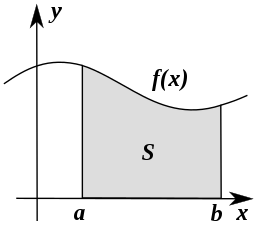{#fig-wdichte-sinnbild width=33%}


Bei *stetigen* Zufallsvariablen $X$ geht man von unendlich vielen Ausprägungen aus; die Wahrscheinlichkeit einer bestimmten Ausprägung ist Null: $Pr(X=x_j)=0, \quad j=1,...,+\infty$ 


:::{#exm-groesse}
### Wahrscheinlichkeitsverteilung für die Körpergröße
So ist die Wahrscheinlichkeit, dass eine Person exakt 166,66666666... cm groß ist, ist (praktisch) Null.
Man gibt stattdessen die *Dichte* der Wahrscheinlichkeit an: Das ist die Wahrscheinlichkeit(smasse) pro  Einheit von $X$. $\square$
:::


Für praktische Fragen berechnet man zumeist die Wahrscheinlichkeit von Intervallen, s. @fig-wdichte-sinnbild.


#### Vertiefung: Verteilungsfunktion

::::: {.columns}

:::: {.column width="50%"}
:::{#def-vert-fun-stetig}
### Verteilungsfunktion
Die Verteilungsfunktion einer stetigen Zufallsvariablen gibt wie im diskreten Fall an,
wie groß die Wahrscheinlichkeit für eine Realisation kleiner oder gleich einem vorgegebenen Realisationswert $x$ ist.$\square$

Die Verteilungsfunktion $F(x)$ ist analog zur kumulierten Häufigkeitsverteilung zu verstehen, vgl. @fig-F-Bus. $\square$
:::


::::

:::: {.column width="50%"}


```{r}
#| echo: false
#| fig-cap: 'Verteilungsfunktion F für X="Wartezeit auf den Bus"'
#| label: fig-F-Bus
#| fig-asp: 0.4
d <- 
  tibble(x=1:10,
         y= 1:10/10) 

ggplot(d, aes(x,y)) +
  geom_point(alpha = .5) +
  geom_line() +
  scale_x_continuous(breaks = 1:10) +
  theme_minimal()
```


::::

:::::


::: {#exr-wartenbus}

### Peer Instruction: Wieder auf den Bus warten

Sie warten wieder auf den Bus, s. @fig-bus.
Welche Aussage dazu ist *falsch*?

A) Die Wahrscheinlichkeit, genau 5 Minuten zu warten, ist am höchsten.
B) Die Wahrscheinlichkeit, genau 10 Minuten zu warten, ist Null.
C) Mit 100% Wahrscheinlichkeit beträgt die Wartezeit zwischen 0 und 10 Minuten.
D) Die Wahrscheinlichkeit, höchstens 1 Minute zu warten, beträgt 10%. $\square$
:::


## Aufgaben


Die Webseite [datenwerk.netlify.app](https://datenwerk.netlify.app) stellt eine Reihe von einschlägigen Übungsaufgaben bereit. Sie können die Suchfunktion der Webseite nutzen, 
um die Aufgaben mit den folgenden Namen zu suchen.


### Paper-Pencil-Aufgaben

- [prob-voll-esystem](https://sebastiansauer.github.io/datenwerk/posts/prob-voll-esystem/)
- [prob-disjunkt](https://sebastiansauer.github.io/datenwerk/posts/prob-disjunkt/)
- [prob-disjunkt2](https://sebastiansauer.github.io/datenwerk/posts/prob-disjunkt2/index.html)
- [prob-elementarereignis](https://datenwerk.netlify.app/posts/prob-elementarereignis/index.html)
- [prob-vereinigung](https://datenwerk.netlify.app/posts/prob-vereinigung/index.html)
- [prob-ereignisraum](https://datenwerk.netlify.app/posts/prob-ereignisraum/index.html)
- [prob-sicher-unmöglich](https://datenwerk.netlify.app/posts/prob-sicher-unmöglich/)
- [indifferenz-p](http://localhost:7954/posts/indifferenz-p/indifferenz-p.html)


### Aufgaben, für die man einen Computer braucht

- [penguins-relationen](https://sebastiansauer.github.io/datenwerk/posts/penguins-relationen/)
- [penguins-relationen2](https://sebastiansauer.github.io/datenwerk/posts/penguins-relationen2/)
- [verteilungsfunktion-penguins](https://sebastiansauer.github.io/datenwerk/posts/verteilungsfunktion-penguins/)


## Literatur

