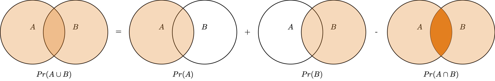

# Rechnen mit Wahrscheinlichkeit

## Lernsteuerung

{width=10%}


```{r}
#| include: false
library(tidyverse)
library(easystats)
library(gmp)  # function "isprime"
library(titanic)
library(knitr)
library(DT)
library(kableExtra)
library(gt)
```


```{r r-setup}
#| echo: false
#| message: false
theme_set(theme_minimal())
scale_colour_discrete <- function(...) 
  scale_color_okabeito()
```


```{r}
#| echo: false

source("children/plots_wskt.R")
```


### Position im Modulverlauf

@fig-modulverlauf gibt einen Überblick zum aktuellen Standort im Modulverlauf.


### Überblick

Dieses Kapitel stellt uns einige grundlegenden Rechengesetze für Wahrscheinlichkeiten vor:
Wann man die Wahrscheinlichkeiten zweier Ereignisse addiert oder multipliziert.
Außerdem lernen wir den Begriff der Unabhängkeit kennen.


### Lernziele

Nach Absolvieren des jeweiligen Kapitels sollen folgende Lernziele erreicht sein.

Sie können ...


- die Grundbegriffe der Wahrscheinlichkeitsrechnung erläuternd definieren
- typische Reoationen (Operationen) von Ereignissen anhand von Beispielen veranschaulichen
- mit Wahrscheinlichkeiten rechnen


### Begleitliteratur

Lesen Sie zur Begleitung dieses Kapitels @bourier2011, Kap. 2-4. 


### Prüfungsrelevanter Stoff

Der Stoff dieses Kapitels deckt sich (weitgehend) mit @bourier2011, Kap. 2-4. 
Weitere Übungsaufgaben finden Sie im dazugehörigen Übungsbuch, @bourier2022.

:::callout-note
In Ihrer [Hochschul-Bibliothek kann das Buch als Ebook verfügbar](https://fantp20.bib-bvb.de/TouchPoint/singleHit.do?methodToCall=showHit&curPos=3&identifier=2_SOLR_SERVER_1157422278) sein. 
Prüfen Sie, ob Ihr Dozent Ihnen weitere Hilfen im [geschützten Bereich (Moodle)](https://moodle.hs-ansbach.de/mod/resource/view.php?id=136047) eingestellt hat.$\square$
:::


## Überblick

Die Rechenregeln der Wahrscheinlichkeit erlauben es,
für bestimmte Situationen eine Wahrscheinlichkeit hzu berechnen.
Das hört sich vielleicht wild an, ist aber oft ganz einfach.


## Additionssatz 

:::{#exm-add-ereignisse}
### Wahrscheinlichkeit für eine gerade Zahl beim Würfelwurf
Ein (normaler) Würfel wird geworfen. Was ist die Wahrscheinlichkeit für eine gerade Zahl, also für das Ereignis $A=\{2, 4, 6\}$? Diese Wahrscheinlichkeit beträgt $Pr(\text{gerade Zahl}) = 1/6 + 1/6 + 1/6 = 3/6 = 1/2$. $\square$
::: 

:::{#exm-ind}
### Gezinkter Würfel
Ein gezinkter Würfel hat eine erhöhte Wahrscheinlichkeit für das Ereignis $A=$"6 liegt oben", 
und zwar gelte $Pr(A)=1/3$.
Was ist die Wahrscheinlichkeit, *keine*  `6` zu würfeln? $\square$^[Die Wahrscheinlichkeit, 
keine `6` zu würfeln, liegt bei $2/3$.]
:::


## Vereinigung von Ereignissen: Additionssatz 

Der Additionssatz wird verwendet, wenn wir an der Wahrscheinlichkeit interessiert sind, 

Der Additionssatz wird verwendet, wenn wir an der 
Wahrscheinlichkeit bei der Vereinigung zweier Ereignisse interessiert sind.
Also an der Wahrscheinlichkeit,
dass *mindestens eines der Ereignisse* A und B eintritt.
"Mindestens eines der Ereignisse A und " schreibt man $A \cup B$ und sagt "A vereinigt B" oder auch "A *oder* B" oder "A oder B".


### Addition disjunkter Ereignisse

Gegeben sei $\Omega = \{1,2,3,4,5,6\}$ beim normalen Würfelwurf. 
Als Sinnbild: $\boxed{1\; 2\; 3\; 4\; 5\; 6}$.
Gesucht sei die Wahrscheinlichkeit des Ereignis $A=\{1,2\}$, das also eine *1* oder  
eine *2* geworfen wird, s. @fig-addition-boxed. 
Man beachte, dass die beiden Ergebnisse disjunkt sind, s. @fig-disjunkt:
Wenn man eine *1* wirft, hat man keine *2* geworfen.


:::{#fig-addition-boxed}

$$\boxed{12} \qquad \boxed{3456}$$

2 Ereignisse sind günstig; 4 sind nicht günstig.
:::


Die Wahrscheinlichkeit für $A$ ist die Summe der Wahrscheinlichkeiten der einzelnen Ereignisse (*1* und *2*):

$Pr(1 \cup 2) = \frac{1}{6} + \frac{1}{6} = \frac{2}{6}$

Visuell ausgedrückt:

$$\frac{\boxed{12}}{\boxed{123456}}$$


:::{#def-add-disjunkt}
### Additionssatz für disjunkte Ereignisse
Die Wahrscheinlichkeit, dass mindestens eines der beiden Ereignisse eintritt, ist die Summe der Einzelwahrscheinlichkeiten, s. @thm-add-disjunkt.
:::

::: {#thm-add-disjunkt}


### Additionssatz für disjunkte Ereignisse


$$Pr(A \cup B) = Pr(A) + Pr(B) \square$$

:::


:::{#exm-sonntag}
Was ist die Wahrscheinlichkeit, an einem Samstag oder Sonntag geboren zu sein?
Unter der (vereinfachten) Annahme, dass alle Jahre zu gleichen Teilen aus allen
Wochentagen bestehen und dass an allen Tagen gleich viele Babies geworden
werden^[vermutlich gibt es noch mehr Annahmen, die wir uns explizit machen sollten.], ist die Antwort $Pr(A)=1/7 + 1/7 = 2/7$.$\square$
:::


### Addition allgemeiner Ereignisse 

Unter *allgemeinen* Ereignissen verstehen wir hier sowohl disjunkte als auch nicht disjunkte.
Bei der Addition der Wahrscheinlichkeiten für $A$ und $B$ wird der Schnitt $A\cap B$ (der Überlappungsbereich) *doppelt* erfasst -- sofern sie nicht disjunkt sind, 
aber wenn sie disjunkt sind, so ist der Schnitt gleich Null und wir machen auch 
dann nichts falsch. Der Überlappungsbereich muss daher noch abgezogen werden, s. @fig-add.


:::{#def-additionssatz}
### Allgemeiner Additionssatz
Die Wahrscheinlichkeit, dass mindestens eines der beiden Ereignisse $A$ und $B$ eintritt, 
ist gleich der Summe ihrer Wahrscheinlichkeiten minus ihrer gemeinsamen Wahrscheinlichkeit, s. @thm-add und @fig-add. $\square$
:::

:::{#thm-add}

### Allgemeiner Additionssatz
$$Pr(A \cup B) = P(A) + P(B) - P(A\cap B) \square$$
:::


{#fig-add}

<!-- ::: {#fig-sets2 layout-ncol=2} -->

<!-- {width=20%}{#fig-sets2-a} -->


<!-- {width=20%}{#fig-sets2-b} -->


<!-- Die Schnittmenge muss beim Vereinigen abgezogen werden, -->
<!-- damit sie nicht doppelt gezählt wird. -->


<!-- ::: -->


:::{#exm-klausur-bed-wskt}
### Lernen und Klausur bestehen

In einem  Psychologie-Studiengang sind die Studis verdonnert, 
zwei Statistik-Module ($S1, S2$) zu belegen.
Die meisten bestehen ($B$), einige leider nicht ($N$), s. @tbl-klausur2.

Ereignis $S_1B$ sei "Klausur Statistik 1 bestanden"
Ereignis $S_2B$ ist analog für "Klausur Statistik 2".

Wir suchen die Wahrscheinlichkeit des Ereignisses *A*, d.h. mindestens eine der beiden Klausuren zu bestehen: 
$Pr(A) = Pr(S_1B \cup S_2B)$.


```{r}
#| echo: false
#| label: tbl-klausur2
#| tbl-cap: "Daten von 100 Studis; L: Lerner, B: Bestanden, N: Negation/Nicht"
d <- tribble(
  ~ ., ~ S1_B, ~ S1_NB, ~ Summe,
  "S2_B", 85, 9, 94,
  "S2_NB", 5, 1, 6,
  "Summe", 90, 10, 100
)

gt(d)
```


\begin{aligned}
Pr(A) &= Pr(S_1B \cup S_2B) \\
&= Pr(S_1B) + Pr(S_2B) - Pr(S_1B \cap S_2B)  \\
&= (90 + 94 - 85) / 100 = 99 / 100\\
\end{aligned}

Die Wahrscheinlichkeit, mindestens eine der beiden Klausuren zu bestehen liegt bei 99%.


:::{#exr-keine-klausur-bestanden}
### Peer Instruction: Keine Klausur bestanden
Wie hoch ist die Wahrscheinlichkeit,  keine der beiden Klausuren zu bestehen?

A) 1%
B) 5%
B) 6%
C) 9%
C) 10%
D) 16% $\square$
:::

:::


## Bedingte Wahrscheinlichkeit


### Illustration zur bedingten Wahrscheinlichkeit

:::{#def-pr-cond}
### Bedingte Wahrscheinlichkeit
Die bedingte Wahrscheinlichkeit ist die Wahrscheinlichkeit, dass $A$ eintritt, 
*gegeben dass* $B$ schon eingetreten ist. $\square$
:::

Man schreibt: $Pr(A|B).$ Lies: "A gegeben B" oder "A wenn B".


:::{#exr-victorpowell}
Schauen Sie sich mal diese [Animation von Victor Powell an](https://setosa.io/conditional/) zu bedingten Wahrscheinlichkeiten an. 
Sehenswert. $\square$
:::


::::: {.content-visible when-format="html"}

@fig-schema-p illustriert *unbedingte Wahrscheinlichkeit*, $Pr(A), Pr(B)$, *gemeinsame Wahrscheinlichkeit* $Pr(A \cap B)$, und *bedingte Wahrscheinlichkeit*, $Pr(A|B)$.


::::{#fig-schema-p}

:::{.panel-tabset}


#### $Pr(A)$


```{r}
#| echo: false
#| label: fig-pr-a
#| fig-cap: "Unbedingte Wahrscheinlichkeit für Ereignis A: 50%=1/2"
#| out-width: 50%
plot_pr_a
```


#### $Pr(B)$


```{r}
#| echo: false
#| out-width: 50%
#| label: fig-pr-b
#| fig-cap: "Unbedingte Wahrscheinlichkeit für Ereignis B: 50%=1/2"
plot_pr_b
```


#### $Pr(B|A)$


```{r}
#| echo: false
#| label: fig-b-geg-a
#| out-width: 50%
#| fig-cap: "Wahrscheinlichkeit für Ereignis B gegeben A, $Pr(B|A)=1/2$"
plot_pr_b_geg_a
```


#### $Pr(A \cap B)$


$Pr(A \cap B)$ wird auch häufig (synonym) geschrieben als $Pr(AB)$.

```{r}
#| echo: false
#| out-width: 50%
#| label: fig-ab
#| fig-cap: "Wahrscheinlichkeit für das gemeinsame Eintreten von A und B: $Pr(AB)=1/4$"

plot_pr_ab
```


:::


Illustration von unbedingter, gemeinsamer und bedingter Wahrscheinlichkeit
::::

:::::


::: {.content-visible unless-format="html"}


@fig-schema-p-pdf illustriert *gemeinsame Wahrscheinlichkeit*, $Pr(A \cap B)$, und *bedingte Wahrscheinlichkeit*, $Pr(A|B)$.


```{r bed-w-schema-pdf}
#| echo: false
#| fig-cap: Illustration von gemeinsamer und bedingter Wahrscheinlichkeit
#| label: fig-schema-p
#| layout-ncol: 3
#| fig-subcap: 
#|   - "unbedingte Wahrscheinlichkeit für Ereignis B: 50%"
#|   - "unbedingteWahrscheinlichkeit für Ereignis A: 50%"
#|   - "Wahrscheinlichkeit für Ereignis B gegeben A, $Pr(B|A)$: 50%"
plot_pr_b
plot_pr_a
plot_pr_b_geg_a
```


:::

:::{#exm-bed-p}
### Bedingte Wahrscheinlichkeit
Sei $A$ "Schönes Wetter" und $B$ "Klausur steht an".
Dann meint $Pr(A|B)$ die Wahrscheinlichkeit, dass das Wetter schön ist, wenn gerade eine Klausur ansteht.$\square$
:::


:::{#exm-papst}
### Von Päpsten und Männern

Man(n) beachte, dass die Wahrscheinlichkeit, Papst $P$ zu sein, wenn man Mann $M$ ist *etwas anderes* ist, als die Wahrscheinlichkeit, Mann zu sein, wenn man Papst ist:
$Pr(P|M) \ne Pr(M|P)$. Das hört sich erst verwirrend an, aber wenn man darüber nachdenkt, wird es plausibel.$\square$
:::


:::{#exm-hirn-grütze}
Gustav Groß-Gütz verkauft eine Tinktur^[genauer besehen sieht sie eher aus wie eine Grütze oder ein Brei], die schlau machen soll, 
"Gützis Gehirn Grütze".^[Sie schmeckt scheußlich.]
Gustav trinkt die Grütze und sagt schlaue Dinge.
Was schließen wir daraus?
Sei $H$ (wie *H*ypothese) "Gützis Grütze macht schlau"; sei $D$ (wie *D*aten) die Beobachtung, 
dass Gustav schlaue Dinge gesagt hat.
Ohne exakte Zahlen zu suchen, wie hoch ist wohl $Pr(D|H)$? In Worten: "Wie wahrscheinlich ist es, 
schlaue Dinge gesagt zu haben, wenn die Grütze wirklich schlau macht?".
Vermutlich ist diese Wahrscheinlichkeit sehr hoch.
Aber wie hoch ist wohl $Pr(H|D)$? In Worten: "Wie wahrscheinlich ist es,
dass die Grütze wirklich schlau macht, gegeben, dass wir gesehen hat, 
dass jemand etwas schlaues gesagt hat, 
nachdem er besagte Grütze getrunken hat?"
Skeptische Geister werden der Meinung sein, $Pr(H|D)$ ist gering.
Das Beispiel zeigt u.a. $Pr(H|D) \ne Pr(D|H).\square$
:::


### Bedingte Wahrscheinlichkeit als Filtern einer Tabelle


```{r}
#| echo: false
d <- 
  tibble::tribble(
      ~id, ~kalt, ~Regen,
      "1", 0L, 0L,
      "2", 0L, 1L,
      "3", 1L, 0L,
      "4", 1L, 1L,
  "SUMME", 2L, 2L
  )

d_kalt_regen <-
   tibble::tribble(
      ~id, ~kalt, ~Regen,
      "1", "nein", "nein",
      "2", "nein", "ja",
      "3", "ja", "nein",
      "4", "ja", "ja")
```


:::{exm-kalt-regen-filter}

Betrachten wir @tbl-kalt-regen-filter. Dort sind sind vier Tage aufgelistet, mit jeweils Regen (oder kein Regen) bzw. an denen es kalt ist (oder nicht). Filtern wir z.B. die Tabelle so, dass nur kalte Tage übrig bleiben, dann gibt der Anteil der Zeilen, die "Regen" anzeigen, die bedingte Wahrscheinlichkeit  $Pr(\text{Regen}|\text{kalt})$ an.

```{r}
#| echo: false
#| label: tbl-kalt-regen-filter
#| tbl-cap: "Die Tabelle zeigt vier Tage, an denen es jeweils kalt ist (oder nicht) bzw. regnet (oder nicht). Die bedingte Wahrscheinlichkeit $Pr(\\text{Regen}|\\text{kalt})$ entspricht dem Anteil der Zeilen mit Regen, wenn für 'kalt' ein Filter in der Tabelle gesetzt ist."
d_kalt_regen |>  
  datatable(filter = "top", options = list(pageLength = 4))
```

:::

Also: Das Berechnen einer bedingten Wahrscheinlichkeit, $Pr(A|B)$, 
ist vergleichbar zum Filtern einer Tabelle, s. @tbl-bed-wskt.


```{r}
#| label: tbl-bed-wskt
#| echo: false
#| tbl-cap: Eine bedingte Wahrscheinlichkeit kann man als gefilterte Tabelle verstehen
knitr::kable(d)
```

Es ergeben sich folgende Wahrscheinlichkeiten:

$Pr(A) = 2/4; Pr(B) = 2/4; Pr(A \cap B) = 1/4; Pr(A|B) = 1/2$


@eq-bed-wskt-box versinnbildlicht die Berechnung von $Pr(A|B)= 1/2$ als Bruch:
Das Verhältnis der Flächen von Zähler und Nenner ist 1 zu 2.

$$\frac{\boxed{\rule{1em}{1em}}}{\boxed{\rule{2em}{1em}}}$${#eq-bed-wskt-box}


Die Wahrscheinlichkeit für $A$, wenn $B$ schon eingetreten ist, 
berechnet sich so, s. @thm-pr-cond und @fig-b-geg-a.

::: {#thm-pr-cond}

### Bedingte Wahrscheinlichkeit

$$Pr(A|B) = \frac{Pr(A \cap B)}{Pr(B)}$$

Außerdem gilt analog

$$Pr(B|A) = \frac{Pr(B \cap A)}{Pr(A)} \quad \square$$
:::


:::{#exm-klausur-bed-wskt}
### Lernen und Klausur bestehen


Sie bereiten sich gerade auf die Klausur bei Prof. Süß vor.
Das heißt: Sie überlegen, ob Sie sich auf die Klausur vorbereiten sollten.
Vielleicht lohnt es sich ja gar nicht? Vielleicht ist die Wahrscheinlichkeit zu bestehen, 
wenn man nicht gelernt hat, sehr groß?
Aber da Sie nun mal auf Fakten stehen, haben Sie sich nach einiger Recherche folgende Zahlen besorgen können, s. @tbl-klausur-lernen.
In der Tabelle sind die Daten von 100 Studis ausgewiesen.
Ein Teil hat sich vorbereitet, ordentlich gelernt, nenen wir sie die "*L*erner".
Ein anderer Teil hat nicht gelernt, $NL$ bzw. $\neg L$. Ein Teil hat bestanden, $B$, 
ein Teil nicht $NB$ oder $\neg B$.

Wir suchen die Wahrscheinlichkeit, zu bestehen, wenn man nicht gelernt hat: $Pr(B |\neg L)$.


```{r}
#| echo: false
#| label: tbl-klausur-lernen
#| tbl-cap: "Daten von 100 Studis; L: Lerner, B: Bestanden, N: Negation/Nicht"
d <- tribble(
  ~ ., ~ L, ~ NL, ~ Summe,
  "B", 80, 1, 81,
  "NB", 5, 14, 19,
  "Summe", 85, 15, 100
)

kable(d) %>%
  kable_styling() %>%
  column_spec(1, bold = TRUE)  # Makes the first column bold

```


\begin{aligned}
Pr(B |\neg L) &= \frac{Pr(B \cap \neg L)}{Pr(\neg L)} \\
&=\frac{1/100}{15/100} = 1/15 \\
\end{aligned}

Die Wahrscheinlichkeit, zu bestehen, wenn man nicht gelernt hat, liegt bei 1 von 15,
also ca. 7%.^[$Pr(L).85; Pr(\neg L) = .15; Pr(B) =.81; Pr(\neg B) = .19$] $\square$
:::


:::{#exm-kalt-regen}
### Kalt wenn Regen
Die Wahrscheinlichkeit, dass es kalt ist, wenn es regnet (gegeben, dass es regnet), 
ist gleich der Wahrscheinlichkeit, dass es gleichzeitig kalt ist und regnet,
geteilt durch die Wahrscheinlichkeit, dass es regnet.$\square$
:::


## Stochastische (Un-)Abhängigkeit


### Warum ist das wichtig?

In der Forschung und im Alltag sind wir oft daran interessiert,
ob zwei Ereignisse voneinander abhängig sind oder nicht:
Lernen und Klausur bestehen, Rauchen und Lungenkrebs, Impfung und Infektion, Werbung und Verkaufserfolg, usw.


### Unabhängigkeit

:::{#exm-indep-intro}
### Unabhängigkeit

- Regentanz und Regen sind unabhängig.
- "Es regnet in Berlin" und "In Tokio fällt eine Münze auf Kopf"
- "Ich habe 10 Mal hintereinander Kopf geworfen" und "Beim nächsten Mal werfe ich Kopf" (bei einer fairen Münze)
- Augenfarbe und Blutgruppe
- Es regnet und ich gewinne im Lotto $\square$
:::

Stochastische Unabhängigkeit ist ein Spezialfall von Abhängigkeit: 
Es gibt sehr viele Ausprägungen für Abhängigkeit, aber nur eine für Unabhängigkeit.
Können wir Unabhängigkeit nachweisen, haben wir also eine *starke* Aussage getätigt.


:::{#def-indep}
### Stochastische Unabhängigkeit
Zwei Ereignisse sind (stochastisch) unabhängig voneinander, 
wenn die Wahrscheinlichkeit von $A$ nicht davon abhängt, ob $B$ der Fall ist, s. @thm-indep.
Anders gesagt:^[Exakte Gleichheit ist in dieser Welt empirisch schwer zu finden. 
Daher kann man vereinbaren, dass Unabhängigkeit erfüllt ist, wenn die Gleichheit "einigermaßen" oder "ziemlich" gilt, die Gleichheit gewissermaßen "praktisch bedeutsam" ist.]
:::

 \newcommand{\indep}{\perp \!\!\! \perp}

:::{#thm-indep}

### Stochastische Unabhängigkeit

$Pr(A) = Pr(A|B) =Pr(A|\neg B) \quad \square$$

In Worten: Wenn die Wahrscheinlichkeit von *A* sich nicht ändert,
wenn *B* eingetreten ist, so ist *A* von *B* (stochastisch) unabhängig.

Die Unabhängigkeit von $A$ und $B$ wird manchmal so in Kurzschreibweise ausgedrückt: $\indep(A, B) \square$.
:::


:::{#thm-indep2}
### Stochastische Unabhängigkeit 2

Setzt man @thm-pr-cond in @thm-indep (linke Seite) ein, so folgt^[Vgl. @thm-multtheorem]

$$Pr(A \cap B) = Pr(A) \cdot Pr(B).\quad \square$$
:::

In Worten: Die Wahrscheinlichkeit, dass *A* und *B* beide der Fall sind,
ist gleich dem Produkt ihrer jeweiligen Wahrscheinlichkeiten.

:::{#exm-indep1}
### Augenfarbe und Statistikliebe
Ich vermute, dass die Ereignisse $A$, "Augenfarbe ist blau", und $B$, 
"Ich liebe Statistik", voneinander unabhängig sind.$\square$^[Wer Daten dazu hat oder eine Theorie, 
der melde sich bitte bei mir.]
:::


```{r}
#| echo: false
source("R-Code/titanic_plots.R")
```


:::{#exm-titanic}
### Überleben auf der Titanic
S. @fig-abh, links: Überleben (Ü) auf der Titanic ist offenbar *abhängig* von der Passagierklasse ($K_1, K_2, K_3$). 
In @fig-abh, links gilt also $Pr(Ü|K_1) \ne Pr(Ü|K_2) \ne Pr(Ü|K_3) \ne Pr(Ü)$.

Auf der anderen Seite: Das Ereignis *Überleben* (Ü) auf der Titanic ist *un*abhängig 
vom Ereignis *Alter ist eine Primzahl* (P), s. @fig-abh, rechts.
Also: $Pr(Ü|P) = Pr(Ü|\neg P) = Pr(Ü)$, vgl. @tbl-titanic-prime. 

```{r}
#| tbl-cap: "Kontingenztablle (Häufigkeiten) für 'Überleben auf der Titanic' und 'Alter ist Primzahl'. Wie man sieht, gibt es keine stochastische Abhängigkeit."
#| label: tbl-titanic-prime
#| echo: false
titanic2 |> 
  count(Survived, Age_prime) |> 
  group_by(Survived) |> 
  mutate(prop = n/sum(n)) |> 
  gt::gt() |> 
  gt::fmt_number(columns = prop, decimals = 2)
```

:::


```{r QM2-Thema1-WasistInferenz-31, out.width="100%"}
#| fig-cap: "Abhängigkeit und Unabhängigkeit zweier Ereignisse"
#| label: fig-abh
#| echo: false
#| layout-ncol: 2
#| fig-subcap: 
#|   - "Überleben und Passagierklasse sind abhängig"
#|   - "Überleben und 'Geburstag ist eine Primzahl' sind nicht abhängig"
plottitanic1
plottitanic3
```


### Stochastische Abhängigkeit

Liegt keine Unabhängigkeit vor, so spricht man von (stochastistischer) *Abhängigkeit*, s. @thm-abh. 
In diesem Fall verändert sich unser Wissen über die Wahrscheinlichkeit von $A$, 
wenn wir wissen, 
dass $B$ eingetroffen ist, s. @thm-abh.

::: {#thm-abh}

### Stochastische Abhängigkeit

$$Pr(A|B) \ne Pr(A) \ne Pr(A|\neg B) \quad \square$$

In Worten: 
Ändert sich die Wahrscheinlichkeit von *A*, wenn *B* der Fall ist,
so sind *A* und *B* voneinander (stochastich) abhängig.

@thm-abh gilt natürlich in dieser Form für alle anderen Variablen ebenso, s. z.B. @thm-abh2. $\square$
:::

::: {#thm-abh2}

### Stochastische Abhängigkeit 2

$$Pr(B|A) \ne Pr(B) \ne Pr(B|\neg A) \quad \square$$
:::


:::{#exm-abh-lernen}
Die Ereignisse "*L*ernen" und "*K*lausur bestehen" seien voneinander abhängig. 
Unsere Einschätzung zur Wahrscheinlichkeit von *K* ändert sich, 
wenn wir wissen, dass *L* vorliegt. 
Genauso wird sich unsere Einschätzung zur Wahrscheinlichkeit von *K* ändern, 
wenn wir wissen, dass *L* nicht vorliegt. $\square$
:::


:::{#exm-covid}

### Zusammenhang von Covidsterblichkeit und Impfquote


Sind die Ereignisse *Tod durch Covid (T)*  bzw. *Impfquote* ($I$) 
und *Land*^[hier mit den zwei Ausprägungen *DEU* und *USA*] ($B$) voneinander abhängig (s. @fig-covid1)?

```{r covid1}
#| message: false
#| echo: false
#| cache: true
#| fig-cap: Impfquote und Sterblichkeit sind voneinander abhängig (bezogen auf Covid, auf Basis vorliegender Daten)
#| label: fig-covid1
#| layout-ncol: 2
#| fig-subcap: 
#|   - Impfquote und Land sind voneinander abhängig
#|   - Anteil Corona-Tote und Land sind voneinander abhängig


```

Ja, die beiden Ereignisse sind abhängig, da in beiden Diagrammen gilt: $Pr(A|B) \ne Pr(A) \ne Pr(A|\neg B)$.$\square$^[
Daten von Our World in Data, <https://ourworldindata.org/covid-deaths>.]


:::


### Unabhängigkeit ist symmetrisch

Stochastische Unabhängigkeit ist symmetrisch: 
Wenn $A$ unabhängig zu $B$ ist auch $B$ unabhängig zu $A$, s. @thm-indep-symm.

::: {#thm-indep-symm}

### Symmetrie der Unabhängigkeit

$$Pr(A|B) = Pr(A) \leftrightarrow Pr(B|A) = Pr(B)$$

Man beachte, dass stochastische Unabhängigkeit und kausale Unabhängigkeit unterschiedliche Dinge sind [@henze2019]: 
Stochastische Unabhängigkeit impliziert nicht kausale Unabhängigkeit. $\square$
:::


::: {#exr-indep}
### Peer Instruction: Welche Aussagen über stochastische Unabhängigkeit ist korrekt?

1. Wenn X und Y unabhängig sind, dann hat X keinen Einfluss auf Y im Alltag.  
2. Zwei Ereignisse A und B sind unabhängig, wenn sie sich nicht überschneiden.  
3. Wenn X und Y unkorreliert sind, dann sind sie unabhängig.
4. Wenn X und Y abhängig sind, dann können sie nicht gleichzeitig positive Korrelation haben.  
6. Wenn X und Y unabhängig sind, sind sie auch unkorreliert.
:::


## Wahrscheinlichkeit gemeinsamer Ereignisse: Multiplikationssatz

Gegeben seien die Ereignisse $A$ und $B$. 
Der Multiplikationssatz wird verwendet, 
wenn wir an der Wahrscheinlichkeit interessiert sind, 
dass *beide Ereignisse* $A$ und $B$ der Fall sind; 
man spricht auch von der *gemeinsamen Wahrscheinlichkeit*.
@fig-ab verdeutlicht dies für zwei unabhängige Ereignisse.
Man schreibt "A und B" als $A \cap B$ (lies "A geschnitten B" oder "A *und* B") oder kurz $AB$, um anzuzeigen, dass sowohl $A$ als auch $B$ eingetreten sind.

```{r, ref.label = "fig-ab"}
#| out-width: 50%
#| echo: false
#| fig-cap: "Beide Ereignisse A und B sind eingetreten"
```


:::{#exm-kalt-regen-mult}
### Wieder kalt und Regen
Es ist eine Sache, zu fragen, wie wahrscheinlich ist ist, dass es *k*alt ist (bei *K*älte), 
wenn es *r*egnet (bei *R*egen): $Pr(K|R)$. 
Anders gesagt: "Wie groß ist die Wahrscheinlichkeit für Kälte, gegeben dass es regnet?"
Eine andere Sache ist es,
nach der Wahrscheinlichkeit zu fragen, 
dass es gleichzeitig kalt ist und regnet, 
dass also beide Ereignisse (kalt und Regen) eintreten: $Pr(K \cap R), Pr(KR)$. $\square$

:::


### Gemeinsame Wahrscheinlichkeit unabhängiger Ereignisse


:::{#exm-indep2}
Wir führen das Zufallsexperiment "Wurf einer fairen Münze" zwei Mal aus (@fig-zweimuenzen).
Wie groß ist die Wahrscheinlichkeit, 2 Mal *K*opf zu werfen?
Dabei vereinbaren wir, dass "Kopf" als "Treffer" zählt (und "Zahl" als "Niete").$\square$
:::


```{mermaid}
%%| label: fig-zweimuenzen
%%| out-width: 50%
%%| fig-cap: "Wir werfen zwei faire Münzen: Zweifach wiederholtes Zufallsexperiment"
flowchart TD
    A[Start] --1/2--> B1[T]
    A --1/2-->  B2[N]

    %% Zweiter Wurf
    B1 --1/2-->  C1[TT - 1/4]
    B1 --1/2-->  C2[TN - 1/4]
    B2 --1/2-->  C3[NT - 1/4]
    B2 --1/2-->  C4[NN - 1/4]

```


 @fig-zweimuenzen zeigt ein *Baumdiagramm*. 
Jeder *Kasten* (Knoten) zeigt ein *Ergebnis* des Zufallexperiments. 
Die Pfeile (Kanten) symbolisieren die Abfolge des Experiments: Vom "Start" (schwarzer Kreis) 
führen zwei mögliche Ergebniss ab, jeweils mit Wahrscheinlichkeit 1/2.
Die untersten Knoten nennt man auch *Blätter* (Endknoten), 
sie zeigen das Endresultat des (in diesem Fall) zweifachen Münzwurfs.
Der Weg vom Start zu einem bestimmten Blatt nennt man *Pfad*. 
Die Anzahl der Pfade entspricht der Anzahl der Blätter.
In diesen Diagramm gibt es vier Pfade (und Blätter).

Den Wurf der ersten Münze nennen wir in gewohnter Manier $A$; 
den Wurf der zweiten Münze $B$.


Die Wahrscheinlichkeiten der resultierenden Ereignisse finden sich in @tbl-muenz2.


```{r}
#| echo: false
#| label: tbl-muenz2
#| tbl-cap: Wahrscheinlichkeiten der Ereignisse im zweimaligen Münzwurf
tibble::tribble(
  ~Ereignis,               ~Pr, ~`Anzahl günstiger Pfade`, 
       "0T", "1/2 * 1/2 = 1/4","1",
       "1T", "1/4 + 1/4 = 1/2","2",
       "2T", "1/2 * 1/2 = 1/4","1"
  ) %>% gt()
```


Sei $K_1$ das Ereignis, mit der 1. Münze Kopf zu werfen; sei $K_2$ das Ereignis, 
mit der 2. Münze Kopf zu werfen.

Wir suchen $Pr(K_1 \cap K_2)$. Aufgrund der stochastischen Unabhängigkeit der beiden Ereignisse gilt: $Pr(K_1 \cap K_2) = Pr(K_1) \cdot Pr(K_2)$.

```{r}
Pr_K1K2 <- 1/2 * 1/2
Pr_K1K2
```


:::{#def-multsatz}
### Multiplikationssatz der Wahrscheinlichkeit für unabhängige Ereignisse
Die Wahrscheinlichkeit, dass zwei (oder mehr) unabhängige Ereignisse $A$ und $B$ *gemeinsam* eintreten, 
ist gleich dem Produkt ihrer jeweiligen Wahrscheinlichkeiten, s. @thm-multtheorem. $\square$
:::


::: {#thm-multtheorem}
### Multiplikationssatz für unabhängige Ereignisse

$$Pr(A \cap B) = Pr(A) \cdot Pr(B)$$ 

Man beachte, dass es egal ist, ob $A$ gemeinsam mit $B$ oder $B$ gemeinsam mit $A$ eintreten: $Pr(A \cap B) = Pr(B \cap A)$. Man spricht in diesem Zusammenhang von der *Symmetrie* der Multiplikation. $\square$
:::


Mit [dieser App](https://www.geogebra.org/m/gzxz57ak) können Sie das Baumdiagramm für den zweifachen Münzwurf näher erkunden.


Wir führen das Zufallsexperiment "Wurf einer fairen Münze" drei Mal aus (@fig-dreimuenzen).
Dabei vereinbaren wir wieder, dass "Kopf" (K) als "Treffer" gilt und "Zahl" (Z) als "Niete".


```{mermaid}
%%| label: fig-dreimuenzen
%%| fig-cap: "Wir werfen drei faire Münzen: Das dreifach wiederholte binäre Zufallexperiment"
graph TD
    A[Start] --1/2-->  B1[T]
    A --1/2-->  B2[N]

    %% Zweiter Wurf
    B1 --1/2-->  C1[TT]
    B1 --1/2-->  C2[TN]
    B2 --1/2-->  C3[NT]
    B2 --1/2-->  C4[NN]

    %% Dritter Wurf
    C1 --1/2-->  D1[TTT]
    C1 --1/2-->  D2[TTN]
    C2 --1/2-->  D3[TNT]
    C2 --1/2-->  D4[TNN]
    C3 --1/2-->  D5[NTT]
    C3 --1/2-->  D6[NTN]
    C4 --1/2-->  D7[NNT]
    C4 --1/2-->  D8[NNN]
```


Beim Wurf von "fairen" Münzen gehen wir davon aus, 
dass Kenntnis des Ergebnis des 1. Wurfes unsere Einschätzung des Ergebnis 
des 2. Wurfes nicht verändert etc.
Anders gesagt: Wir gehen von (stochastischer) Unabhängigkeit aus.


Für z.B. das Ereignis $A=\{ZZZ\}$ gilt: $Pr(A) = 1/2 \cdot 1/2 \cdot 1/2 = (1/2)^3$.
Da jeder Endknoten (jedes Blatt) gleichwahrscheinlich ist, 
ist die Wahrscheinlichkeit jedes Endknotens gleich.

Allgemeiner gilt: Für ein Zufallsexperiment, das aus $k$ Wiederholungen besteht 
und in jeder Wiederholung die Wahrscheinlichkeit $Pr(X)=p$ ist,
so ist die Wahrscheinlichkeit für einen Endkonten $Pr(X^k)=p^k$.


```{r QM2-Thema1-WasistInferenz-27}
#| echo: false
#| tbl-cap: "Ausgewählte Wahrscheinlichkeiten von Ereignissen im dreifachen Münzwurf"
#| label: tbl-baum3
tibble::tribble(
  ~Ereignis,                     ~Pr, ~`Anzahl günstiger Pfade`, 
       "0T", "1/2 * 1/2 * 1/2 = 1/8", 1,
       "1T", "1/8 + 1/8 + 1/8 = 3/8",3,
       "2T",          "3 * 1/8 = 3/8",3,
       "3T", "1/2 * 1/2 * 1/2 = 1/8",1 
  ) |> 
  gt()
```


Da die Endknoten disjunkte Elementarereignisse sind, kann man ihre Wahrscheinlichkeit addieren, 
um zu anderen (zusammengesetzten) Ereignissen zu kommen, vgl. @tbl-baum3.


@fig-schema-p versinnbildlicht nicht nur die Bedingtheit zweier Ereignisse, 
sondern auch die (Un-)Abhängigkeit zweier Ereignisse, $A$ und $B$.
In diesem Fall ist die Wahrscheinlichkeit von $A$ gleich $B$: 
$Pr(A)=Pr(B)=.5$.
Man sieht, dass die Wahrscheinlichkeit von $A$ bzw. von $B$ jeweils die Hälfte 
der Fläche (der Gesamtfläche, d.h von $Pr(\Omega)=1$) ausmacht. 
Die Schnittmenge der Fläche von $A$ und $B$ entspricht einem Viertel der Fläche: 
$Pr(AB) = Pr(A) \cdot Pr(B) = 50\% \cdot 50\% = 25\%.$
In diesem Fall sind $A$ und $B$ unabhängig.
@fig-schema-p zeigt weiterhin, dass gilt: $Pr(A\cap B) = P(A) \cdot P(B) = P(B) \cdot P(A)$.
Man beachte, dass diese Formel nur bei *Unabhängigkeit* (von A und B) gilt.


### Gemeinsame Wahrscheinlichkeit allgemeiner Ereignisse


Ein Baumdiagramm bietet sich zur Visualisierung allgemeiner abhängiger Ereignisse an, s.  @fig-baum-abh. 

:::{#exm-urne1}
In einer Urne befinden sich fünf Kugeln, von denen vier rot sind und eine blau ist.


Hier ist unsere Urne:

$$\boxed{\color{red}{R, R, R, R}, \color{blue}\mathcal{B}}$$

Wie groß ist die Wahrscheinlichkeit, dass bei zwei Ziehungen ohne Zurücklegen (*ZOZ*) *zwei rote Kugeln* gezogen werden [@bourier2011], S. 47. 
Ereignis A: "Kugel im 1. Zug hat die Farbe Rot". 
Ereignis B: "Kugel im 2. Zug hat die Farbe Rot".

Und jetzt ziehen wir. Hier ist das Baumdiagramm, s.  @fig-baum-abh.


```{mermaid}
%%| fig-cap: "Baumdiagramm für ein zweistufiges Zufallsereignis, wobei der 2. Zug (Stufe) abhängig ist vom 1. Zug."
%%| label: fig-baum-abh
flowchart LR
  A[Start] -->|4/5|B[Zug 1 - A]
  A -->|1/5|C[Zug 1 - nA]
  B -->|3/4|D[Zug 2 - B]
  B -->|1/4|E[Zug 2 -  nB]
  D --- H[Fazit: AB - 4/5*3/4 = 12/20]
  E --- I[Fazit: AnB - 4/5*1/4 = 4/20]
  C -->|4/4|F[Zug 2 - B]
  C -->|0/4|G[Zug 2 - nB]
  F --- J[Fazit: nAB - 1/5*4/4 = 4/20]
  G --- K[Fazit: nAnB - 1/5*0/4 = 0/20]
  
  
```


Wie man in @fig-baum-abh nachrechnen kann gilt also: $Pr(A\cap B) = P(A) \cdot P(B|A) = 4/5 \cdot 3/4 = 12/20 = 3/5 \quad \square$
:::


:::{#def-gem-wskt-abh}
### Gemeinsame Wahrscheinlichkeit

Die Wahrscheinlichkeit, dass zwei abhängige Ereignisse $A$ und $B$ *gemeinsam* eintreten, 
ist gleich dem Produkt der Wahrscheinlichkeit von $A$ und der bedingten Wahrscheinlichkeit von $B$ gegeben $A$, 
s. @thm-gem-wskt-abh. $\square$
:::

:::{#thm-gem-wskt-abh}

### Gemeinsame Wahrscheinlichkeit

$$Pr(A \cap B) = Pr(A) \cdot Pr(B|A) \quad \square$$
:::

Allgemein ist die Wahrscheinlichkeit, dass zwei Ereignisse $A$ und $B$ gemeinsam eintreten,
gleich dem Produkt der Wahrscheinlichkeit von $B$ und der bedingten Wahrscheinlichkeit von $A$ gegeben $B$, s. @thm-gem-wskt-abh.
Im Fall von Unabhängigkeit vereinfacht sich die Formel zu der in @thm-multtheorem.


:::{#exm-kaltregen}
### Nochmal kalt und Regen

Von @mcelreath2020 stammt diese Verdeutlichung der gemeinsamen Wahrscheinlichkeit.
Was ist die Wahrscheinlichkeit für das gemeinsame Auftreten von *kalt ❄ und Regen ⛈️*? 
Die Wahrscheinlichkeit für kalt und Regen ist die Wahrscheinlichkeit von *Regen* ⛈, 
wenn's *kalt* ❄ ist mal die Wahrscheinlichkeit von *Kälte* ❄.

Ebenfalls gilt:
Die Wahrscheinlichkeit für kalt und Regen ist die Wahrscheinlichkeit von *Kälte* ❄, 
wenn's *regnet* ⛈️ mal die Wahrscheinlichkeit von *Regen* ⛈️.

Das Gesagte als Emoji-Gleichung ist in @eq-kalt-regen-emoji dargestellt.

$$Pr(❄️ \text{ und } ⛈️) = P(❄️) \cdot P(⛈️ |❄️ )  =  P(❄️) \cdot P(❄️ |⛈️ )$${#eq-kalt-regen-emoji}


Man kann  die "Gleichung drehen"^[Der Multiplikationssatz ist symmetrisch], s. @eq-kalt-regen-emoji2. 

$$Pr(❄️ \text{ und } ⛈️) = P(⛈️ \text{ und } ❄️)$${#eq-kalt-regen-emoji2} $\square$
:::


:::{#exm-bertie-botts}
### Bertie Botts Bohnen jeder Geschmacksrichtung

>   Sei bloß vorsichtig mit denen. Wenn sie sagen jede Geschmacksrichtung, dann meinen sie es auch - Du kriegst zwar alle gewöhnlichen wie Schokolade und Pfefferminz und Erdbeere, aber auch Spinat und Leber und Kutteln. George meint, er habe mal eine mit Popelgeschmack gehabt.“

— Ron Weasley zu Harry Potter^[Quelle: <https://harrypotter.fandom.com/de/wiki/Bertie_Botts_Bohnen_jeder_Geschmacksrichtung>]

In einem Beutel liegen $n=20$ *Bertie Botts Bohnen jeder Geschmacksrichtung*.
Uns wurde verraten, dass fast alle gut schmecken, also z.B. nach Schokolade, 
Pfefferminz oder Marmelade. Leider gibt es aber auch $x=2$ furchtbar 
scheußliche Bohnen (Ohrenschmalz-Geschmacksrichtung oder Schlimmeres).
Sie haben sich nun bereit erklärt, $k=2$ Bohnen zu ziehen. 
Und zu essen, und zwar direkt und sofort!
Also, jetzt heißt es tapfer sein. Ziehen und runter damit!

Wie groß ist die Wahrscheinlichkeit, *genau eine* scheußliche Bohne zu erwischen?

Es gibt 2 Pfade für 1 Treffer bei 2 Wiederholungen (Züge aus dem Beutel), 
s. @fig-bertie1:
Man kann im ersten Zug eine scheußliche Bohne erwischen, aber nicht im zweiten Zug.
Oder man man im zweiten Zug Pech haben (aber nicht im ersten).
Die Summe der Wahrscheinlichkeiten beider Pfade ist die Wahrscheinlichkeit für
genau *eine* scheußliche Bohne,
das sind 19%.

```{mermaid}
%%| fig-cap: "Baumdiagramm für ein ein zweistufiges Zufallsereignis: Bertie Botts Bohnen."
%%| label: fig-bertie1
graph LR
    A[Start: 20 Bohnen] -- 18/20 --> B1[Bohne 1 gut]
    A -- 2/20 --> B2[Bohne 1 schlecht]
    
    B1 -- 17/19 --> C1[Bohne 2 gut]
    B1 -- 2/19 --> C2[Bohne 2 schlecht]
    
    B2 -- 18/19 --> C3[Bohne 2 gut]
    B2 -- 1/19 --> C4[Bohne 2 schlecht]
    
    C1 --> D1[Ergebnis: gut, gut]
    C2 --> D2[Ergebnis: gut, schlecht]
    C3 --> D3[Ergebnis: schlecht, gut]
    C4 --> D4[Ergebnis: schlecht, schlecht]

```


```{r}
Pfad1 <- 2/20 * 18/19  # scheußliche Bohne im 1. Zug
Pfad2 <- 18/20 * 2/19  # scheußliche Bohne im 2. Zug


Gesamt_Pr <- Pfad1 + Pfad2 
Gesamt_Pr
```


Nutzen Sie [diese App](https://www.geogebra.org/m/j545R3Fu), um das auszuprobieren.
Sie müssen in der App noch die Zahl der Bohnen ($n$) 
und die Zahl der scheußlichen Bohnen ($x$) einstellen.$\square$
:::


### Kettenregel


:::{#def-kettenregel}
### Kettenregel
Allgemein gesagt, spricht man von der *Kettenregel* der Wahrscheinlichkeitsrechnung, 
wenn man die gemeinsame Wahrscheinlichkeit auf die bedingte zurückführt, s. @thm-kette. $\square$
:::


::: {#thm-kette}

### Kettenregel

$$Pr(A\cap B) = P(A) \cdot P(B|A) = P(B) \cdot P(A|B) \square$$

In Worten: Die Wahrscheinlichkeit von $A$ gegeben $B$ ist gleich der Wahrscheinlichkeit von $A$ mal der Wahrscheinlichkeit von $B$ gegeben $A$.
:::


:::{#exr-baum3}
### Baumdiagramm sucht Problem

Überlegen Sie sich eine Problemstellung (Aufgabenstellung), die mit [dieser Baumdiagramm-App](
https://www.geogebra.org/m/WVKur4yM) gelöst werden kann.$\square$
:::


:::{#exr-multsatz}
### Peer Instruction: Dreifacher Münzwurf

Fünf Studierende unterhalten sich, wie man einen dreifachen Münzwurf mit dem Ergebnis von drei Treffern verstehen kann. 
Welcher Studierende liegt *falsch*?
Gehen Sie von einer faire Münze aus und Unabhängigkeit der Würfe.

A) Wirft man die Münze drei Mal, so gibt es 4 verschiedene Ergebnisse (0 bis 3 Treffer), die alle gleich wahrscheinlich sind. Aber nur ein Ergebnis ist gesucht, nämlich 3 von 3 Treffern. Also ist die Wahrscheinlichkeit 1/6, ca. 17%.
B) Man kann einfach einen Computer fragen, z.B. R mit ` dbinom(x = 3, size = 3, prob = 1/2)`, da kommt ungefähr 12% raus.
C) Wirft man die Münze drei Mal, so gibt es 8 Ergebnisse, die alle gleich wahrscheinlich sind. Aber nur ein Ergebnis ist gesucht, nämlich 3 von 3 Treffern. Also ist die Wahrscheinlichkeit 1/8, ca. 12,5%.
D) Wer rechnen kann, ist klar im Vorteil $\left( \frac{1}{2} \right)^3 = \left( \frac{1}{2^3} \right) = \left( \frac{1}{8} \right)$
:::


## Totale Wahrscheinlichkeit


:::{#exm-bourier-s56}
### Gesamter Ausschussanteil
Die folgende Aufgabe bezieht sich auf @bourier2011, S. 56. 
Drei Maschinen ($M_1, M_2, M_3$) 
produzieren einen Artikel. 
Die Maschinen haben einen Anteil an der Produktion von 60, 10 bzw. 30% und eine Ausschussquote von 5,2 bzw. 4%. 
Sei $M$ das Ereignis, dass ein Artikel von Maschine $M$ stammt, und $S$ (Schrott) das Ereignis, dass ein Artikel Ausschuss (Schrott) ist.
Gesucht ist ist der Ausschussanteil insgesamt (über alle drei Maschinen). 
Anders gesagt: Wie hoch ist die Wahrscheinlichkeit $Pr(S')$, dass ein zufällig gezogener Artikel Ausschuss ist? 
@fig-tot-wskt zeigt das Baumdiagramm für die Aufgabe. $\square$
:::

```{mermaid}
%%| fig-cap: Totale Wahrscheinlichkeit
%%| label: fig-tot-wskt
flowchart LR
  A[Start] -->|0.6|B[M1]
  A -->|0.1|C[M2]
  A -->|0.3|D[M3]
  B -->|0.05|E[S]
  B -.->|0.95|F[Nicht-S]
  C -->|0.02|G[S]
  C -.->|0.98|H[Nicht-S]
  D -->|0.04|I[S]
  D -.->|0.96|J[Nicht-S]
```


Die Anteile an der Produktion und vom Ausschluss sind in @fig-ausschuss verdeutlicht.

```{r}
#| label: fig-ausschuss
#| fig-cap: "Anteile von Produktion und Ausschuss"

source("R-Code/plot_maschine_schrott.R")
plot_maschine_schrott
```


Dazu addieren wir die Wahrscheinlichkeiten der relevanten Äste.
Jeder Ast stellt wiederum das gemeinsame Auftreten der Ereignisse $M_i$ und $S$ dar.

```{r}
W_Ast1 <- 0.6 * 0.05  # Wahrscheinlichkeit für Ast 1
W_Ast2 <- 0.1 * 0.02  # ... Ast 2
W_Ast3 <- 0.3 * 0.04  # ... Ast 3
W_total <- W_Ast1 + W_Ast2 + W_Ast3  # totale W.
W_total
```

Die *totale Wahrscheinlichkeit* (für Ausschuss) beträgt in diesem Beispiel also $Pr(B') = 0.044 = 4.4\%$.^[Einfacher als das Rechnen mit Wahrscheinlichkeiten ist es in solchen Fällen, wenn man anstelle von Wahrscheinlichkeiten absolute Häufigkeiten zum Rechnen verwendet.]

:::{#def-totwskt}
### Totale Wahrscheinlichkeit
Bilden die Ereignisse $M_1, M_2, ..., M_n$ ein vollständiges Ereignissystem und ist $S$ ein beliebiges Ereignis dann gilt @thm-totale-wskt. $\square$
:::

::: {#thm-totale-wskt}
### Totale Wahrscheinlichkeit
$$Pr(S') = \sum_{i=1}^n Pr(M_i) \cdot Pr(S|M_i).\square$$
:::

In Worten: Die totale Wahrscheinlichkeit ist die Summe der gewichteten Teil-Wahrscheinlichkeiten.

::: {exm-totwskt1}
In @fig-tot-wskt (@exm-bourier-s56) gilt $Pr(S') = 0.6 \cdot 0.05 + 0.1 \cdot 0.02 + 0.3 \cdot  0.04 = 0.03 + 0.002 + 0.012 = 0.04.\square$
:::


:::{#exr-bertie-botts2}
### Bertie Botts Bohnen jeder Geschmacksrichtung, Teil 2

```{r}
#| echo: false
Pr_keine_Bohne <- 17/20 * 16/19 * 15/18
Pr_nicht_keine_Bohne <- round(1 - Pr_keine_Bohne, 2)
```


Es ist die gleich Aufgabe wie @exm-bertie-botts, aber jetzt lautet die Frage: 
Wie groß ist die Wahrscheinlichkeit, *mindestens eine* scheußliche Bohne bei 3 Zügen zu erwischen?^[Die Wahrscheinlichkeit *keine* scheußliche Bohne zu ziehen ist $17/20 \cdot 16/19 \cdot 15/18) \approx `r Pr_keine_Bohne`$. 
Daher ist die gesuchte Wahrscheinlichkeit (mindestens eine scheußliche Bohne) 
das Komplement davon:  $`r Pr_nicht_keine_Bohne`$.] $\square$
:::


### Baumsammlung

Baumdiagramme sind ein hilfreiches Werkzeug für wiederholte Zufallsexperimente.
Daher ist hier eine "Baumsammlung"^[Wald?] zusammengestellt.

- Sie werfen 1 Münze, @fig-baummuenz1.
- Sie werfen 2 Münzen, @fig-zweimuenzen.
- Sie werfen 3 Münzen, @fig-dreimuenzen.
- Sie werfen 4 Münzen, @fig-4muenzen.
- Sie werfen 9 Münzen, 🤯 @fig-binom2.


## Vertiefung


Bei @henze2019 findet sich eine anspruchsvollere Einführung in das Rechnen mit Wahrscheinlichkeit; dieses Kapitel behandelt ein Teil des Stoffes  der Kapitel 2 und 3 von @henze2019.

Mit [dieser App, die ein zweistufiges Baumdiagramm zeigt](https://www.geogebra.org/m/n4xrk4x5), können Sie das Verhalten von verschiedenen Arten von Wahrscheinlichkeiten weiter untersuchen.

[Diese App lässt dich herausfinden, ob man wirklich krank ist, wenn der Arzt es bheauptet.](https://www.geogebra.org/m/tkdfxa8f)

Das [Video zu Bayes von 3b1b](https://youtu.be/HZGCoVF3YvM) verdeutlicht das Vorgehen der Bayes-Methode auf einfache und anschauliche Weise.

@mittag2020 stellen in Kap. 11 die Grundlagen der Wahrscheinlichkeitstheorie vor.
Ähnliche Darstellungen finden sich in einer großen Zahl an Lehrbüchern.


## Aufgaben

Bearbeiten Sie die Aufgabe in der angegeben Literatur.

Die Webseite [datenwerk.netlify.app](https://datenwerk.netlify.app) stellt eine Reihe von einschlägigen Übungsaufgaben bereit. Sie können die Suchfunktion der Webseite nutzen, 
um die Aufgaben mit den folgenden Namen zu suchen:


### Paper-Pencil-Aufgaben


1. [Additionssatz1](https://datenwerk.netlify.app/posts/additionssatz1/additionssatz1.html)
2. [Nerd-gelockert](https://datenwerk.netlify.app/posts/nerd-gelockert/nerd-gelockert.html) 
3. [Urne1](https://datenwerk.netlify.app/posts/urne1/urne1.html) 
3. [Urne2](https://datenwerk.netlify.app/posts/urne2/urne2.html)
3. [k-coins-k-hits](https://datenwerk.netlify.app/posts/k-coins-k-hits/k-coins-k-hits.html)
5. [sicherheit](https://datenwerk.netlify.app/posts/sicherheit/sicherheit.html)
4. [sicherheit2](https://datenwerk.netlify.app/posts/sicherheit2/sicherheit2.html)
6. [Klausuren-bestehen](https://datenwerk.netlify.app/posts/klausuren-bestehen/klausuren-bestehen.html)
3. [Gem-Wskt1](https://datenwerk.netlify.app/posts/gem-wskt1/gem-wskt1.html)
3. [Gem-Wskt2](https://datenwerk.netlify.app/posts/gem-wskt2/gem-wskt2.html)
3. [Gem-Wskt3](https://datenwerk.netlify.app/posts/gem-wskt3/gem-wskt3.html)
3. [Gem-Wskt4](https://datenwerk.netlify.app/posts/gem-wskt4)
3. [wuerfel05](https://datenwerk.netlify.app/posts/wuerfel05/wuerfel05)
3. [wuerfel06](https://datenwerk.netlify.app/posts/wuerfel06/wuerfel06)
3. [Bed-Wskt1](https://datenwerk.netlify.app/posts/bed-wskt1/bed-wskt1.html)
3. [Bed-Wskt2](https://datenwerk.netlify.app/posts/bed-wskt2/bed-wskt2.html)
3. [Bed-Wskt3](https://datenwerk.netlify.app/posts/bed-wskt3/bed-wskt3.htmlv)
3. [voll-normal](https://datenwerk.netlify.app/posts/voll-normal)
3. [corona-blutgruppe](https://datenwerk.netlify.app/posts/corona-blutgruppe/corona-blutgruppe.html)
3. [totale-Wskt1](https://datenwerk.netlify.app/posts/totale-wskt1/totale-wskt1.html)
5. [wskt-quiz14](https://datenwerk.netlify.app/posts/wskt-quiz14/wskt-quiz14.html)
5. [wskt-quiz09](https://datenwerk.netlify.app/posts/wskt-quiz09/wskt-quiz09.html)
12. [prob-vereinigung](https://sebastiansauer.github.io/datenwerk/posts/prob-vereinigung/)
13. [bestehen_ohne_lernen](https://datenwerk.netlify.app/posts/bestehen_ohne_lernen/)


### Aufgaben, für die man einen Computer braucht

1. [mtcars-abhaengig](https://datenwerk.netlify.app/posts/mtcars-abhaengig/mtcars-abhaengig.html)
3. [mtcars-abhaengig-var2](https://datenwerk.netlify.app/posts/mtcars-abhaengig_var2/mtcars-abhaengig_var2)
3. [mtcars-abhaengig_var3a](https://datenwerk.netlify.app/posts/mtcars-abhaengig_var3a/mtcars-abhaengig_var3a)
4. [wskt-df-r](https://datenwerk.netlify.app/posts/wskt-df-r/wskt-df-r) 


## ---


{width=100%}


