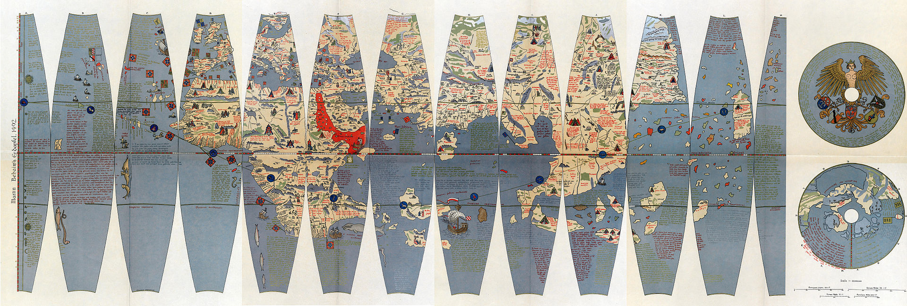
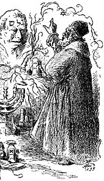
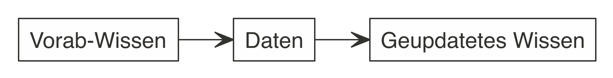
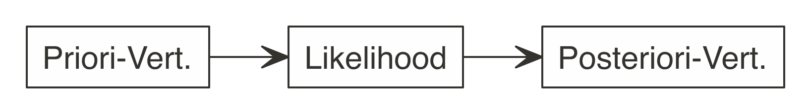
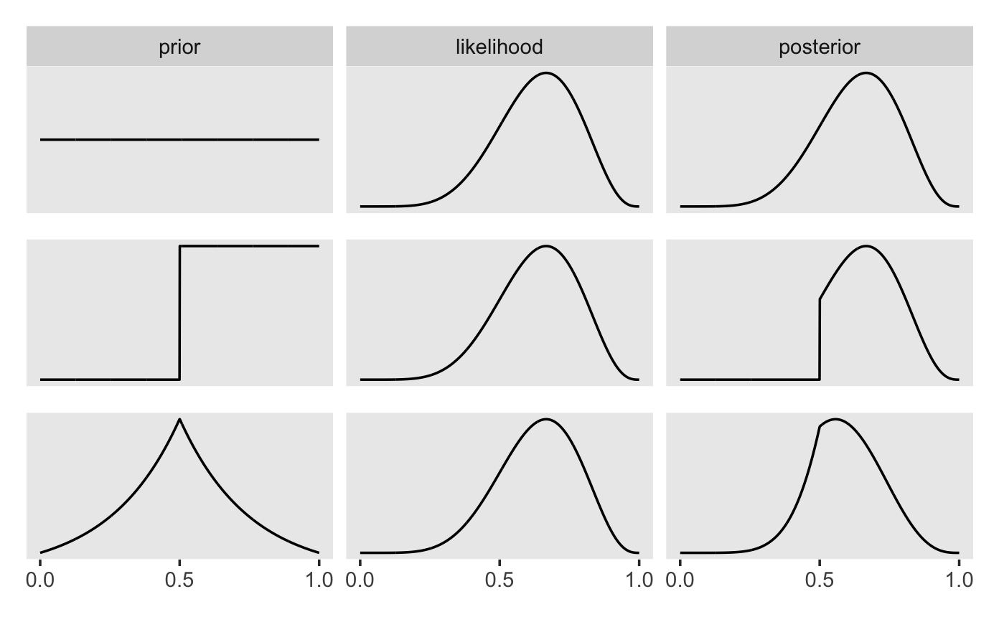
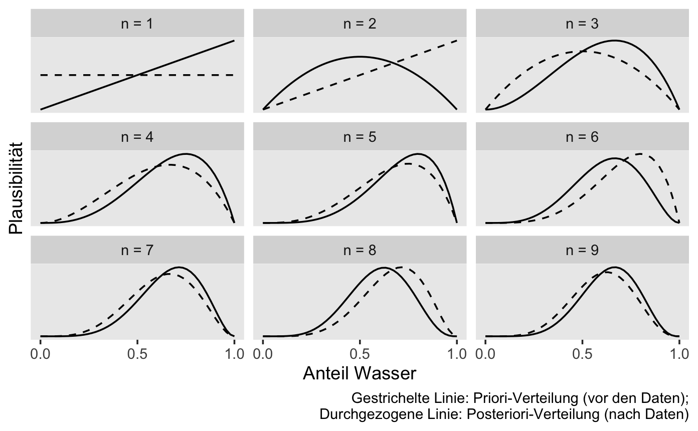

# Der Globus-Versuch


{width=10%}


## Lernsteuerung

### Position im Modulverlauf

@fig-modulverlauf gibt einen Überblick zum aktuellen Standort im Modulverlauf.


### Überblick

In diesem Kapitel übersetzen wir eine Problemstellung (Forschungsfrage) in ein (mathematisches) Modell,
das uns dann mithilfe der Bayes-Formel Antworten auf die Problemstellung gibt.


### Lernziele

Nach Absolvieren dieses Kapitels sollen folgende Lernziele erreicht sein.

Sie können ...


- Unterschiede zwischen Modellen und der Realität erläutern
- die Binomialverteilung heranziehen, um geeignete (einfache) Modelle zu erstellen (für binomial verteilte Zufallsvariablen)
- die weite Einsetzbarkeit anhand mehrerer Beispiele exemplifizieren
- das Bayes-Modell anhand bekannter Formeln herleiten
- Post-Wahrscheinlichkeiten anhand der Bayesbox berechnen


### Begleitliteratur


Der Stoff dieses Kapitels deckt einen Teil aus @mcelreath2020, Kap. 2, ab. @mcelreath2020 stellt das Globusmodell mit mehr Erläuterung und etwas mehr theoretischem Hintergrund vor, als es in diesem Kapitel der Fall ist.


### Vorbereitung im Eigenstudium

- [Statistik 1, Kap. "Daten Einlesen"](https://statistik1.netlify.app/020-r)


### Begleitvideos

- 📺 [Globusversuch](https://www.youtube.com/watch?v=fGlt9Ld4xzk&list=PLRR4REmBgpIGgz2Oe2Z9FcoLYBDnaWatN&index=6)


### Benötigte R-Pakete


```{r}
library(tidyverse)
library(ggpubr)  # komfortable Visualisierung
```


```{r}
#| include: false
library(patchwork)
library(easystats)
library(ggraph)
library(tidygraph)

source("funs/binomial_plot.R")
source("funs/plot_binom_likelihood.R")
```


```{r}
#| include: false
theme_set(theme_modern())
```

```{r}
#| include: false
source("_common.R") 
```


## Von Welten und Golems

### Kleine Welt, große Welt

Bekanntlich segelte Kolumbus 1492 los, 
und entdeckte Amerika^[wenn auch nicht als Erster].
Das war aber ein glücklicher Zufall, 
denn auf seinem Globus existierte Amerika gar nicht. 
Vielleicht sah sein Globus so aus wie der von Behaim, s. Abb @fig-behaim.

{#fig-behaim}

[Quelle: Ernst Ravenstein, Wikimedia, Public Domain](https://commons.wikimedia.org/wiki/File:RavensteinBehaim.jpg)

Die *kleine Welt des Modells* entsprach hier nicht *der großen Welt, 
der echten Erdkugel*.

Das ist ein Beispiel, das zeigt, wie Modellieren schiefgehen kann. 
Es ist aber auch ein Beispiel für, sagen wir, 
die Komplexität wissenschaftlicher (und sonstiger) Erkenntnis. 
Einfach gesagt: Glück gehört halt auch dazu.


::: callout-note
Behaims Globus ist nicht gleich der Erde. Die kleine Welt von Behaims Globus ist nicht die große Welt, ist nicht die Erde.
:::

Was in der kleinen Welt funktioniert, 
muss nicht in der großen Welt funktionieren. 
Modelle zeigen immer nur die kleine Welt: 
Vorsicht vor schnellen Schlüssen und vermeintlicher Gewissheit.


:::{exr-modellno}
🏋 Nennen Sie ein Beispiel, in dem ein Modell nicht (exakt) der Wirklichkeit entspricht! $\square$
:::


### Der Golem von Prag

{#fig-golem-prag width="33%"}

[Bildquelle: Mikoláš Aleš, Wikimedia, Gemeinfrei](https://de.wikipedia.org/wiki/Golem)

[Der Golem von Prag](http://www.prague.net/golem), die Legende einer vom Menschen geschaffene Kreatur mit gewaltiger Kraft, die Befehle wörtlich ausführt, s. @fig-golem-prag.
Die Geschichte besagt, dass ein Rabbi mit Zauberkräften den Golem aus Lehm erschuf, um die jüdische Bevölkerung der Stadt zu schätzen.
Bei kluger Führung kann ein Golem Nützliches vollbringen.
Bei unüberlegter Verwendung wird er jedoch großen Schaden anrichten.

### Wissenschaftliche Modelle sind wie Golems


{width=25%}

:::: {.columns}

::: {.column width="50%"}
**Golem**

Eigenschaften des *Golems*:

- Besteht aus Lehm
- Belebt durch "Wahrheit"
- Mächtig
- dumm
- Führt Befehle wörtlich aus
- Missbrauch leicht möglich
- Märchen
:::

::: {.column width="50%"}
**Modell**

Eigenschaften eines *Modells*:


- Besteht aus ~~Lehm~~Silikon
- Belebt durch Wahrheit (?)
- Manchmal mächtig
- simpler als die Realität
- Führt Befehle wörtlich aus
- Missbrauch leicht möglich
- Nicht einmal falsch
:::

::::


::: callout-note
Wir bauen Golems.
:::

@fig-xy stellt ein Sinnbild von Modellen dar.


Vergleichen wir die kleine Welt unserer Modellen (@tbl-klein-gross), 
wie z.B. Behaims Globus, mit der Großen Welt, die Kolumbus und wir befahren.


| Kleine Welt                                                | Große Welt                                 |
|-----------------------------------------|-------------------------------|
| Die Welt, wie sie der Golem sieht                          | Die Welt, wie sie in Wirklichkeit ist      |
| ist das Modell, aber nicht (zwangsläufig) die Wirklichkeit | entspricht nicht (zwangsläufig) dem Modell |
| Verwenden wir beim Modellieren                             | Ist das, was wir modellieren               |

: Kleine Welt vs. große Welt {#tbl-klein-gross}


<!-- {#fig-bayes1} -->


:::{#exm-bayes-lernen}
### Die Bayes-Formel und Lernen
🏋 Bayes-Inferenz ähnelt dem Lernen von Menschen. 
Geben Sie ein Beispiel von Lernen bei Menschen, 
das oben dargestelltem Prozess ähnelt! $\square$
:::


:::{#exm-regr-grosse-welt}
### Ein Regressionsmodell stammt aus der kleinen Welt

Ein wissenschaftliches Modell, etwa auf Basis eines Regressionsmodells ist Teil der *kleinen* Welt.
Man muss sich bei der Interpretation eines Regressionsmodells vor Augen halten: 
"Die Ergebnisse des Modells sind nur richtig unter der Annahme, dass sich der Zusammenhang X und Y durch eine Gerade beschreiben lassen und unter der Annahme, dass meine Daten repräsentativ sind." $\square$
:::


## Ein erster Versuch: Wir werfen den Globus


### Das Bayes-Update 


:::{#exm-fofra1}
### Wasseranteil auf der Erdoberfläche
Unsere Forschungsfrage lautet, mit welchem Anteil die Erde wohl mit Wasser bedeckt ist (@fig-erde)? Um möglichst wenig schreiben zu müssen, schreiben wir für "angenommener Wasseranteil auf der Erdoberfläche" kurz $p$ oder $\pi$ (p wie proportion, Anteil). $\square$
:::

, Lizenz: CC 4.0 BY-NC](img/earth.png){#fig-erde width="10%" fig-align="center"}


Analog können wir uns vorstellen, 11 Wissenschaftler haben jeweils eine andere Hypothese zum Wasseranteil, 
$\pi$, der Erde. 
Die erste Person hat die Hypothese $\pi_1 = 0$, 
die zweite Person geht von $\pi_2 = 0.1$ aus ... die 11. Person von $\pi_{11} = 1$.
 
Um die Forschungsfrage zu beantworten, werfen Sie einen Globus-Ball in die Luft und fangen in wieder auf. 
Sie notieren dann, ob die Stelle unter Ihrem Zeigefinger Wasser zeigt (W) oder Land (L). 
Den Versuch wiederholen Sie, bis Sie den Globusball insgesamt 9 Mal geworfen 
haben.^[Warum gerade 9 Mal? Tja, dann hat das Handy geklingelt... Auch in wissenschaftlichen Versuchen ist (leider?) nicht immer alles genau geregelt.]

So sah *mein*^[*Ihr* Ergebnis kann anders aussehen, schließlich ist es ja Zufall.] Ergebnis aus:

$$W \quad L \quad W \quad W \quad W \quad L \quad W \quad L \quad W$$


Also $W=6$ (Wasser, d.h. "Treffer") und $L=3$ (Land, "Niete") ($n=9$ Versuche).

:::{#exr-globe1}
### Der Globusversuch
🏋️️ Besorgen Sie sich einen Globus (zur Not eine Münze) und stellen Sie den Versuch nach! $\square$
:::


:::{#exm-sonde-im-all}
### Wir schießen Sonden ins Weltall
Eine alternative Geschichte für den Globusversuch:
Es ist das Jahr 2345536.
Sie arbeiten für eine eine Weltraumbehörde.
Gestern haben Sie einen Planeten entdeckt, weit draußen im All.
Jetzt geht es um die Frage, wie viel Wasser es auf der Oberfläche dieses Planeten gibt.
Dazu schießen Sie (bzw. Ihre Behörde) eine Reihe von Sonden auf den Planeten.
Wir gehen davon aus, dass die Landeplätze dieser Sonden voneinander unabhängig sind.
Sagen wir, es werden $n=9$ Sonden hochgeschossen, und davon landen $W=6$ im Wasser. $\square$
:::


### Bayes-Updates


Der Bayes-Golem denkt eigentlich ganz vernünftig:
Zuerst ("Apriori") hat er ein Vorwissen zum Wasseranteil, die dazugehörige Wahrscheinlichkeitsverteilung nennt man *Apriori-Verteilung* (s. @def-priori).
In unserem Beispiel ist das Vorwissen recht bescheiden: Jeder Wasseranteil ist ihm gleich plausibel.
Als nächstes beschaut sich der Golem die Daten und überlegt,
wie wahrscheinlich die Daten sind, wenn man von einer bestimmten Hypothese ausgeht, z.B. dass der Wasseranteil 50% beträgt.
Die zugehörige Wahrscheinlichkeit der Daten unter Annahme einer Hypothese nennt man die^[oder den?] *Likelihood*^[zu Deutsch etwa: "Mutmaßlichkeit"], s. @def-L.
Als Letztes bildet sich der Golem eine abschließende Meinung zur Wahrscheinlichkeit jeder Hypothese. Diese Wahrscheinlichkeitsverteilung nennt man *Aposteriori-Verteilung*, s. @def-post1.
Sie berechnet sich als Gewichtung des Vorwissens mit den neuen Daten, die durch die Likelihood repräsentiert werden.
Anders gesagt: Das Vorwissen wird anhand der Erkenntnisse (der Daten) aktualisiert: 
das Bayes-Update, s. @fig-bayes-update.


<!-- {#fig-bayes-update} -->


```{mermaid}
%%| fig-cap: Updating mit Bayes
%%| label: fig-bayes-update
graph LR
A[Apriori-Vert.]-->B[Likelihood]-->C[Post-Vert.]-->A
```


:::{#def-priori}
### Apriori-Verteilung
Für jede Hypothese haben wir ein Vorab-Wissen, das die jeweilige Plausibilität der Hypothese angibt: *Apriori-Verteilung* (synonym: Apriori-Verteilung).$\square$
:::

:::{#def-L}
### Likelihood
Für jede Hypothese (d.h. jeden *Parameterwert* $\pi$) möchten wir wissen, 
wie wahrscheinlich die Daten sind (unter der Annahme, 
dass die Hypothese richtig ist).
Anders gesagt: Die *Likelihood* sagt uns, 
wie gut die Daten zu einer bestimmten Hypothese passen.$\square$
:::

:::{#def-post1}
### Aposteriori-Verteilung
Dann gewichten wir den Likelihood mit dem Vorabwissen, so dass wir die *Aposteriori-Verteilung*^[ Anstatt von *Apriori* liest man auch *Prior* oder *Priori*; anstatt *Aposteriori* auch *Posterior*] bekommen. $\square$
:::


:::{#exr-l1}
### Wie gut passen die Daten zur Hypothese, dass die Erde komplett trocken ist?

Wir haben in unseren Versuch $W=6$ und $L=3$ erzielt. 
Diese Daten passen *überhaupt nicht* zur Hypothese, dass die Erdoberfläche komplett trocken ist.
Die *Likelihood*, $L$ für $\pi=0$ ist also Null.
Analog ist die Likelihood für $\pi=1$ auch Null. $\square$
:::


### Berechnung der Likelihood im Globusversuch


Wie wahrscheinlich ist es, ein bestimmtes Ergebnis, 
z.B. $W=6$ Treffer (bei 9 Würfen), zu erhalten, 
wenn man eine bestimmte Hypothese (einen bestimmten Wasseranteil, z.B. 90%) annimmt?
Diese Wahrscheinlichkeit nennt man die *Likelihood*, $L = Pr(W = 6, n = 9| \pi=.9)$.


Wenn wir eine Binomialverteilung für die Globuswürfe annehmen, 
dann gehen wir davon aus,  dass die Daten unabhängig voneinander entstehen 
und sich der Parameterwert nicht zwischenzeitlich ändert.
^[Die sog. "iid-Annahme", *i*ndependently and *i*dentically distributed: Jeder Wurf der Globusballes ist eine Realisation der gleichen Zufallsvariablen. 
Jeder Wurf ist unabhängig von allen anderen: 
Das Ergebnis eines Wurfes hat keinen (stochastischen) Einfluss auf ein Ergebnis anderer Würfe.
Die Wahrscheinlichkeitsverteilung ist bei jedem Wurf identisch.]
Der Wasseranteil der Erde bleibt während des Versuchs gleich (durchaus plausibel).


Berechnen wir also die Likelihood für verschiedene Hypothesen (Wasseranteile, $\pi$), 
für $\pi = 0, 0.1, 0.2, \ldots, 1$,
s. @lst-lik1.
Wir halten also die Daten fest (6 Treffer bei 9 Würfen) und 
berechnen die Wahrscheinlichkeit dieser Daten für verschiedene Hypothesen (Wasseranteile, $\pi$).


```{r lik1}
#| lst-cap: "Likelihood-Funktion für x=6 Treffer, bei n=9 Würfen, für eine binomialverteilte Zufallsvariable: Wir halten die Daten fest und variieren den Parameterwert."
#| lst-label: lst-lik1
#| results: hold 
dbinom(x = 6, size = 9, prob = .1)
dbinom(x = 6, size = 9, prob = .2)
dbinom(x = 6, size = 9, prob = .3)
dbinom(x = 6, size = 9, prob = .4)
dbinom(x = 6, size = 9, prob = .5)
dbinom(x = 6, size = 9, prob = .6)
dbinom(x = 6, size = 9, prob = .7)
dbinom(x = 6, size = 9, prob = .8)
dbinom(x = 6, size = 9, prob = .9)
```


@fig-lik1 visualisiert die 
Likelihood-Funktion für unser Beispiel (6 Wasser bei 9 Würfen) für verschiedene Hypothesen (Wasseranteile, $\pi$).
Man sieht, dass die Likelihood um $\pi = 0.7$ herum am höchsten ist.


```{r}
#| fig-cap: "Die Likelihood-Funktion für x=6 Treffer, bei n=9 Würfen, für eine binomialverteilte Zufallsvariable (mit 11 Parameterwerten: 0, 0.1, 0.2, ..., 1): Die Parameterwerte um 0.7 herum sind am plausibelsten."
#| label: fig-lik1
#| echo: false
plot_binom_likelihood(x = 6, n = 9) 
```


Oder von Hand gerechnet für $\pi = 1/2$, s. @eq-dbinom1:

$$\begin{aligned}
Pr(\pi = 1/2| x = 6, n = 9) &=\\ 
\tbinom{9}{6} \cdot (1/2)^6 \cdot (1/2)^3 &=\\
\frac{9!}{6!3!} \cdot (1/2)^9 &= \\
84 \cdot 1/512 = 21/128 &= 0.16
\end{aligned}
$${#eq-dbinom1}


Mithilfe von R als Taschenrechner gerechnet:

```{r}
anz_pfade <- choose(9, 6)
wskt_pro_pfad <- (1/2)^6 * (1/2)^3
gesamt_wskt <- anz_pfade * wskt_pro_pfad
gesamt_wskt
```


Für so viele Würfe ($n=9$) würde ein Baumdiagramm unübersichtlich werden, s. @fig-binom2.
Visualisierungen wie Baumdiagramme sind eine praktische Hilfe zum Verständnis,
kommen aber bei größeren Daten schnell an ihre Grenze.


```{r}
#| echo: false
#| label: fig-binom2
#| fig-cap: Wir werfen den Globus (oder eine Münze) 9 Mal, es resultieren 512 Endknoten. Nicht gerade übersichtlich.

my_tree <- tidygraph::create_tree(1023, 2, mode = "out")

my_tree %>%
  mutate(lab = 1:1023) %>% 
  ggraph(circular = TRUE) +
  geom_edge_link() +
  geom_node_label(mapping = aes(label = lab), size = 1) +
  coord_flip() +
  scale_y_reverse() +
  theme_void()
```


Jetzt folgen einige Beispiele.


:::{#exm-globus697-dbinom}
### Likelihood für $W = 6, n = 9, \pi=.7$
Was ist die Likelihood von $W=6$ bei $n=9$ gegeben $\pi=.7$ bei unserem Globusversuch?

```{r QM2-Thema2-kleineModelle-21, echo = TRUE}
dbinom(x = 6, size = 9, prob = .7)
```

Oder, synonym, wenn man einen Taschenrechner (oder R als Taschenrechner) benutzt:

```{r}
choose(9, 6) * (.7)^6 * (.3)^3
```


Noch "händischer" gerechnet:

```{r}
factorial(9)/(factorial(6)*factorial(3)) * (.7)^6 * (.3)^3
```

Die Daten passen gut zur Hypothese $\pi=.7$. $\square$
:::


Zur Erinnerung: Die Funktion `dbinom` gibt uns die Wahrscheinlichkeit von `x` Treffern, 
bei `size` Versuchen zurück, 
wobei eine Binomialverteilung angenommen wird mit der Trefferwahrscheinlichkeit `prob`.

::: {#exm-globus2}


### Likelihood für $W = 6, n = 9, \pi=1/3$
Was ist die Likelihood von $W=6$ bei $n=9$ gegeben $\pi=1/3$ bei unserem Globusversuch?

```{r QM2-Thema2-kleineModelle-22a, echo = TRUE}
dbinom(x = 6, size = 9, prob = 1/3)
```

Offenbar ist $\pi=1/3$ eine schlechte Hypothese, um die Daten zu erklären:
Die Daten passen nicht gut zu ihr. $\square$

:::


:::{#exm-globus697}

### Likelihood für $\pi=0$

Was ist die Likelihood von $W=6$ bei $n=9$ gegeben $\pi=0$ bei unserem Globusversuch?


```{r QM2-Thema2-kleineModelle-22, echo = TRUE}
dbinom(x = 6, size = 9, prob = 0)
```


$\pi=0$ ist offenbar eine sehr schlechte Hypothese, um die Daten zu erklären:
Die Daten sind unmöglich unter dieser Hypothese. $\square$

(Fast) von Hand gerechnet:

```{r}
factorial(9)/(factorial(6)*factorial(3)) * (.7)^6 * (.3)^3
```

Als Formel, s. @eq-dbinom-967:


$$\begin{aligned}
Pr(W=6 | \pi=.7, n=9) &=\\ 
\tbinom{9}{6} \cdot (.7)^6 \cdot (.3)^3 &=\\
\frac{9!}{6!3!} \cdot (.7)^6 \cdot (.3)^3 &=\\
84 \cdot  .003 = .27.
\end{aligned}$${#eq-dbinom-967}

$\square$
:::


Es gibt Taschenrechner(-Apps), die die Binomialverteilung oder den Binomialkoeffizienten berechnen können.^[<https://www.geogebra.org/scientific?lang=de>]


:::{#exr-globus}
### Peer Instruction: Welcher Parameterwert ist am plausibelsten?

Wir führen wieder den Globusversuch durch (oder werfen eine Münze) und erhalten folgendes Ergebnis: 7 Mal Wasser und 2 Mal Land (also $W=7$ und $L=2$).

Welcher Wasseranteil, $\pi$ ist am plausibelsten?

A) 0 Wasser (0%)
B) 1/9 Wasser (ca. 11%)
C) 3/9 Wasser (ca. 33%)
D) 7/9 Wasser (ca. 78%)
E) 9 Wasser (100%) $\square$
:::


### Unser Modell ist geboren

Ein Modell (in der Bayes-Statistik) besteht aus mind. drei Komponenten:

1. Die *Likelihood* (die Wahrscheinlichkeit der Daten unter Annahme der Hypothese), s. @eq-globus1
2. Die *Apriori-Verteilung(en)* (die Wahrscheinlichkeit der Hypothese vor den Daten), a. @eq-prior-unif-globus
3. Die *Aposteriori-Verteilung* (die Wahrscheinlichkeit der Hypothese nach den Daten), s. @fig-post1


### Apriori-Verteilung

Unser Vorab- bzw. *Apriori*-Wissen zu $\pi$ sei, dass uns alle Werte gleich ("uniform") plausibel erscheinen, s. @eq-prior-unif-globus.

$$\pi \sim \text{Unif}(0,1).
$${#eq-prior-unif-globus}

Lies: "$\pi$ ist gleich (uniform) verteilt mit der Untergrenze 0 und der Obergrenze 1".

Man könnte auch sagen: Wir haben praktisch kein Vorwissen, wir sind erstmal (apriori) indifferent;
jeder Parameterwert erscheint uns erstmal gleich wahrscheinlich, 
s. @fig-unif01.


```{r QM2-Thema2-kleineModelle-26}
#| echo: false
#| fig-cap: "Gleichverteilung mit Parametern min=0 und max=1"
#| label: fig-unif01
#| eval: true
#| out-width: 50%

source("funs/uniform_plot.R")

uniform_plot(0, 1)
```


### Aposteriori-Verteilung

:::{#def-post-ver}
### Aposteriori-Verteilung
die Aposteriori-Verteilung (kurz: "Post-Verteilung") quantifiziert unser Wissen zu den Parameterwerten *nach* Kenntnis der Daten und aufbauend auf unserem Vorwissen (Apriori-Wissen).
Die Aposteriori-Verteilung ist das Ergebnis des Bayes-Updates; man bezeichnet sie kurz mit $Pr(H|D)$. 
Lies: "Die Wahrscheinlichkeit der Hypothese H gegeben der Daten D." $\square$
:::

Dabei nimmt man stillschweigend an, dass die Daten anhand eines gewissen Modells generiert wurden,
z.B. der Binomialverteilung, sodass die Likelihood $Pr(D|H)$ berechnet werden kann.
@fig-post1 zeigt die Post-Verteilung für unser Globusbeispiel (6 Wasser bei 9 Würfen).


## Bayes' Theorem

### Wozu wird Bayes in der Praxis genutzt?


In der Praxis nutzt man Bayes häufig,
wenn man Daten $D$ gesammelt hat,
und wissen möchte,
wie wahrscheinlich eine Hypothese $H$ ist,
m Lichte dieser gesammelten Daten, s. @thm-bayes1.
Anders gesagt: 
Die Likelihood ist relativ einfach zu bestimmen, 
$Pr(D|H)$, aber nicht so interessant.
Die Aposteriori-Wahrscheinlichkeit, $Pr(H|D)$,
ist schwerer zu bestimmen, aber interessanter.
Man könnte also sinnbildlich sagen,
das Bayes-Theorem ist eine "Maschine", die die Apriori-Wahrscheinlichkeit zusammen mit 
der Likelihood zur Aposteriori-Wahrscheinlichkeit "umbaut".


<!-- $$D \quad \underrightarrow{Bayes} \quad H$$ -->


$$Pr(H|D) = \frac{ Pr(H) \cdot Pr(D|H) }{Pr(D)}$${#eq-bayes3}

### Bayes' Theorem
$$
Pr(H|D) = \frac{ Pr(H) \cdot Pr(D|H) }{Pr(D)} = \frac{\text{Apriori} \cdot \text{Likelihood}} {\text{Evidenz}}\quad \square
$$


Bayes' Theorem (@thm-bayes3) fragt nach $Pr(H|D)$:

>    Was ist die Wahrscheinlichkeit der Hypothese H, jetzt wo wir die Daten kennen?

Und antwortet so (@eq-bayes3):

>    Diese Wahrscheinlichkeit entspricht der Apriori-Wahrscheinlichkeit der Hypothese mal der Plausibilität (Likelihood) der Daten unter Annahme (gegeben) der Hypothese. Aus Standardisierungsgründen dividiert man noch die totale Wahrscheinlichkeit der Daten über alle Hypothesen (durch die sog. *Evidenz*).


Für unser Globusbeispiel:


>    Wie wahrscheinlich ist denn jetzt ein bestimmter Wasseranteil auf der Erde, $\pi$, (gegeben den Daten, $W=6$ und $L=3$) und wenn wir jede Hypothese apriori für gleich wahrscheinlich halten?  Also, wie wahrscheinlich ist z.B. ein Wasseranteil von 70% oder von 50%?


### Die Evidenz zur Standardisierung 

Die Aufgabe der Evidenz ist nur dafür zu sorgen, dass der Wert von $Pr(H|D)$ 
insgesamt nur Werte zwischen 0 und 1 annehmen kann, 
also eine brave, normale Wahrscheinlichkeit ist. 
Würde man in  @thm-bayes1 nicht durch die Evidenz teilen, 
so wäre die Aposteriori-Wahrscheinlichkeit nicht normiert, 
d.h. sie könnte Werte >1 annehmen, was ja nicht sein darf.


:::{#def-evidenz}
### Evidenz
$Pr(D)$ nennt man die *Evidenz*. 

Die Evidenz berechnet sich als Summe der Likelihoods für alle Parameterwerte $H_i$, 
d.h. als die totale Wahrscheinlichkeit von $D$, s. @thm-evidenz, vgl. @def-totwskt. $\square$
:::

::: {#thm-evidenz} 
### Evidenz
$$\begin{aligned}
Pr(D) = \sum_{i=1}^n Pr(D|H_i) \cdot Pr(H_i)
\end{aligned}\quad \square$$
:::

Die verschiedenen Parameterwerte kann man auch als die verschiedenen Hypothesen $H_i$ auffassen.
Falls es nur zwei Hypothesen bzw. Parameterwerte gibt, vereinfacht sich @thm-evidenz zu @thm-evidenz2.


:::{#thm-evidenz2} 
### Evidenz bei zwei Hypothesen
$$\begin{aligned}
Pr(D) = Pr(D|H_1) \cdot Pr(H_1) + Pr(D|H_2) \cdot Pr(H_2)
\end{aligned}\quad \square$$
:::


:::{#exm-evidenz1}
In @exm-bayes1 betrug der Wert der Evidenz $0.03 + 0.002 + 0.012 = 0.044$,
also ca. 4%. $\square$
:::


Schauen wir uns die Bestandteile von Bayes' Theorem (@thm-bayes1) noch etwas näher an:


- (standardisierte) Aposteriori-Wahrscheinlichkeit: $Pr_{Post} := Pr(H|D)$
- Likelihood: $L := Pr(D|H)$
- Apriori-Wahrscheinlichkeit: $Pr_{Apriori} := Pr(H)$
- Evidenz: $E := Pr(D)$
- unstandardisierte Aposteriori-Wahrscheinlichkeit: $Pr_{\text{unPost}} = Pr_{\text{Apriori}} \cdot L$


Bayes' Theorem gibt die $Pr_{Post}$ an, wenn man die Gleichung
mit der $Pr_{Apriori}$ und dem $L$ füttert.
Bayes' Theorem wird verwendet, um die $Pr_{Post}$ zu quantifizieren.
Die $Pr_{Post}$ ist proportional zu $Pr_{unPost} = L \times Pr_{Apriori}$.


### Posteriori als Produkt von Priori und Likelihood

Die *unstandardisierte* Post-Wahrscheinlichkeit $Pr_{\text{unPost}}$ ist einfach das Produkt von 
Likelihood und Priori, s. @eq-unpost.

$$Pr_{\text{unPost}} = L \times \text{Priori}$${#eq-unpost}


Abb. @fig-post3 visualisiert, dass die Post-Verteilung eine Gewichtung von Apriori 
und Likelihood ist (das gilt sowohl für die unstandardisierte als auch für die standardisierte Post-Verteilung).
Mathematisch gesprochen beruht diese Gewichtung auf einer einfachen Multiplikationen der beiden genannten Terme.


{#fig-post3}


Standardisiert man die unstandardisierte Post-Verteilung,
so erhält man die standardisierte Post-Verteilung.
Das Standardisieren dient nur dazu, einen Wert zwischen 0 und 1 zu erhalten. 
Dies erreichen wir, indem wir durch die Summe aller Post-Wahrscheinlichkeiten dividieren.
Die Summe der Post-Wahrscheinlichkeiten bezeichnet man (auch) als Evidenz, vgl. Gleichung @eq-post.


$$\text{Posteriori} = \frac{\text{Likelihood} \times \text{Priori}}{\text{Evidenz}}$${#eq-post}


### Wissen updaten: Wir füttern Daten in das Modell

Golems können lernen?! @fig-lernen-golem zeigt die Post-Verteilung, nach $n=1, 2, ...,n=9$ 
Datenpunkten, d.h. Würfen mit dem Globusball.
Man sieht: Am Anfang, apriori, also bevor die Daten kennen, 
vor dem ersten Wurf also, ist jeder Parameterwert gleich wahrscheinlich für den Golem (das Modell).
Je nach Ergebnis des Wurfes verändert sich die Wahrscheinlichkeit der Parameterwerte,
kurz gesagt, die Post-Verteilung verändert sich in Abhängigkeit von den Daten.


{#fig-lernen-golem}


Insofern kann man sagen: Unser Golem (das Modell) lernt. 
Ob das Modell nützlich ist (präzise Vorhersagen liefert), 
steht auf einem anderen Blatt.


## Die Post berechnen mit mit der Bayesbox

Wir erstellen uns eine kleine Tabelle, die man "Bayesbox" nennen könnte.^[Auch Gitter-Methode oder Grid-Methode genannt.]
Unser Ziel ist es, die Posteriori-Wahrscheinlichkeit für verschiedene Parameterwerte zu berechnen,
also die Wahrscheinlichkeit, dass ein bestimmter Wasseranteil $\pi$ vorliegt,
gegeben die Daten (6 Wasser bei 9 Würfen).
Dazu gehen wir so vor:

### Die Idee der Bayesbox

1. Teile den Wertebereich des Parameters in ein "Gitter" auf, z.B. $0.1, 0.2, ..., 0.9, 1$.
2. Wähle die Apriori-Wahrscheinlichkeit für jeden Parameterwert, z.B. 1/11 bei einer diskreten Gleichverteilung von 0 bis 1.
3. Berechne die Likelihood für jeden Parameterwert.
4. Berechne den unstandardisierten Aposteriori-Wert für jeden Parameterwert (Produkt von Apriori und Likelihood).
5. Standardisiere den Aposteriori-Wert durch Teilen anhand der Summe aller unstandardisierten Aposteriori-Wahrscheinlichkeiten.


Für jeden Parameterwert berechnen wir eine (Post-)Wahrscheinlichkeit.^[Ein Parameterwert ist eine mögliche Ausprägung des Parameters.]
Häufig entspricht eine Hypothese einem Parameterwert, 
etwa wenn man sagt: "Ich glaube, die Münze ist fair", was auf einen Parameterwert von 50% herausläuft.
Dazu geben wir an, für wie wahrscheinlich wir apriori^[synonym: priori] 
-- also bevor wir irgendwelche Daten erheben -- jeden einzelnen Parameterwert halten.
Wir machen es uns hier einfach und halten jeden Parameterwert für gleich wahrscheinlich. 

Tatsächlich ist der konkrete Wert hier egal, 
solange wir allen Parameterwerten denselben Wert geben,
wird sich die standardisierte Aposteriori-Wahrscheinlichkeit nicht ändern.

Entscheidend ist das Verhältnis der Apriori-Werte zueinander: 
Geben wir einem Parameterwerten den Wert 2, aber einem anderen den Wert 1, 
so halten wir Ersteren für (apriori) doppelt so plausibel wie Letztere.
Die Post-Wahrscheinlichkeit für den Ersteren wird dann auch doppelt so groß sein wie die für Letztere (alles andere konstant gehalten).

Die "End-Wahrscheinlichkeit", die unstandardisierte Post-Wahrscheinlichkeit, 
die "hinten rauskommt" ist das Produkt von Apriori-Wert und Likelihood.
Anschaulich gesprochen: Die Apriori-Werte werden mit den Likelihoodwerten gewichtet^[synonym: Die Likelihoodwerte werden mit den Apriori-Werten gewichtet.].
Da wir letztlich eine Wahrscheinlichkeitverteilung bekommen möchten, 
teilen wir jeden Aposteriori-Wert durch die Summe aller Aposteriori-Werte. 
Dadurch ist gerantiert, dass sich die Aposteriori-Werte zu eins aufaddieren. 
Damit haben wir dann die Ansprüche an eine Wahrscheinlichkeitsverteilung erfüllt (vgl. @sec-kolmogorov).


### Bayesbox in R berechnen

Legen wir uns ein Gitter mit Parameterwerten ($\pi$) an, um deren Aposteriori-Wahrscheinlichkeit zu berechnen.
Konkret gesprochen: Wir listen jeden für uns interessanten Wasseranteil ($\pi$) auf,
also $\pi=0, 0.1, 0.2, ..., 1$.
Diese Parameterwerte sind die Hypothesen, die wir testen wollen,
s. @lst-wasseranteile.


```{r p-gitter}
#| lst-label: lst-wasseranteile
#| lst-cap: "Parameterwerte (Gitter) für Wasseranteile: 0, 0.1, 0.2, ..., 1"
wasseranteile <- seq(from = 0, to = 1, by = 0.1)  # Parameterwerte
wasseranteile
```


Dann berechnen wir schon mal die Wahrscheinlichkeit der Daten (6 W bei 9 Würfen) gegeben jeweils eines Wasseranteils.

```{r lik-69}
Likelihood <- dbinom(6, size = 9, prob = wasseranteile)
Likelihood
```

Schließlich packen wir das alles in eine Tabelle, die "Bayesbox", s. @tbl-globus und @lst-gitter1.

```{r gitter1, echo = TRUE}
#| lst-cap: "Wir basteln uns eine Bayesbox"
#| lst-label: lst-gitter1
bayesbox_globusversuch <-
  tibble(
    # definiere die Hypothesen (die Parameterwerte, p): 
    p = wasseranteile,
    # Lege den Apriori-Wert für alle Parameterwerte auf 1/11 fest:
    Apriori  = 1/11) |> 
    mutate(
      # berechne Likelihood für jeden Wasseranteil (Parameterwert):
      Likelihood = Likelihood,
      # berechne unstand. Aposteriori-Werte:
      unstd_Post = Likelihood * Apriori,
      # berechne Evidenz, d.i. die Summe aller unstand. Post-Werte:
      Evidenz = sum(unstd_Post),
      # berechne stand. Aposteriori-Werte (summiert zu 1):
      Post = unstd_Post / Evidenz)  
```

Die Bayesbox (@tbl-globus) zeigt, wie sich die Post-Verteilung berechnet.

```{r QM2-Thema2-kleineModelle-29}
#| label: tbl-globus
#| tbl-cap: "Die Bayesbox für den Globusversuch, k=6 Treffer, n=9 Versuche, Apriori-Wahrscheinlichkeit Pr(H)=9%, und Wasseranteile p von 0 bis 1"
#| echo: false
bayesbox_globusversuch %>% 
  mutate(id = 1:11) %>% 
  relocate(id, .before = 1) %>% 
  knitr::kable(digits = 3)
```


Für jede Hypothese (Spalte `id`) berechnen wir die *unstandardisierte*
Aposteriori-Wahrscheinlichkeit als Produkt von Apriori und Likelihood.

Um zur *standardisierten* Aposteriori-Wahrscheinlichkeit zu gelangten,
teilen wir in jeder Zeile der Bayesbox (also für jede Hypothese) 
die unstandardisierte Post-Wahrscheinlichkeit durch die Summe 

der unstandardisierten Post-Wahrscheinlichkeiten, s. @eq-poststand-allgemein.

$$\text{Post} = \frac{\text{Post}_{\text{unstand}}}{\text{Evidenz}} = \frac{Pr(H) \cdot Pr(H|D)}{Pr(D)}$${#eq-poststand-allgemein}

Dabei haben wir die Apriori-Wahrscheinlichkeit für alle Parameterwerte als gleich angenommen, 
da wir keinerlei Vorwissen hatten, $Pr(H_i) = 1/11$.
Die Evidenz berechnet sich als Summe der unstandardisierten Post-Wahrscheinlichkeiten, 
$Pr(D) = \sum Pr_{unstandPost}=0.09$.

Wenn die Apriori-Wahrscheinlichkeit für alle Hypothesen gleich ist,
dann ist die standardisierte Aposteriori-Wahrscheinlichkeit identisch mit der Likelihood.
Denn die Post-Wahrscheinlichkeit ist die um die Priori-Wahrscheinlichkeit gewichtete Likelihood.
Sind die Apriori-Wahrscheinlichkeiten alle gleich,
so ist die Gewichtung der Likelihood für alle Hypothesen gleich.


:::{#exm-globus697-post}
### Post-Wahrscheinlichkeit im Globusversuch für p=.7
In @exm-globus697-dbinom haben wir die Wahrscheinlichkeit für 6 Treffer bei 9 Würfen gegeben einer Trefferwahrscheinlichkeit von $\pi = .7$ berechnet.
Damit haben wir die Likelihood $L = Pr(D|H) =.27$ berechnet.


Auf dieser Basis können wir die Aposteriori-Wahrscheinlichkeit $Pr_{Post}$ berechnen, zunächst die unstandardisierte.
Dazu haben wir die Apriori-Wahrscheinlichkeit mit der Likelihood multipliziert, s. @eq-postunstand697:

$$
\text{Post}_{\text{unstand}} = Pr(H) \cdot Pr(D|H) = 1/11 \cdot 0.2668 = 0.024
$${#eq-postunstand697}

Jetzt standardisieren wir die unstandardisierte Post-Wahrscheinlichkeit,
indem wir durch die Evidenz dividieren, s. @eq-poststand697.

$$\
text{Post} = \frac{\text{Post}_{\text{unstand}}}{\text{Evidenz}} = \frac{0.024}{0.09} = 0.267
$${#eq-poststand697}


Fazit: Nach dem Versuch, d.h. nachdem wir die Daten in Betracht gezogen haben,
hat sich unsere Meinung über den Wasseranteil von $\pi=.7$ aktualisiert von 0.09 auf 0.27 -- 
das ist eine Verdreifachung. 
Wir sind uns drei Mal so sicher wie vor dem Versuch, dass der Wasseranteil bei 70% liegt. $\square$
:::


:::{#exr-priori-change}
🏋️ Was wohl mit *Post* passiert, wenn wir *Apriori* ändern?$\square$
:::

@fig-post1 zeigt eine Visualisierung der Post-Verteilung mit Hilfe der Funktion `ggline(x, y)` aus dem Paket `ggpubr`.
Wie man sieht, ist die Post-Wahrscheinlichkeit am höchsten bei $\pi=0.7$.
Wobei der Bereich von 0.6 bis 0.8 auch recht wahrscheinlich ist.


```{r}
#| echo: false
#| label: fig-post1
#| out-width: 70%
#| fig-cap: "Die Post-Verteilung visualisiert. Die Post-Wahrscheinlichkeit ist am höchsten bei p=0.7"
library(ggpubr)

ggline(bayesbox_globusversuch,
       x = "p",
       y = "Post")
```


### Was sagt die Post?

Die Aposteriori-Verteilung (Kurz: "Post-Verteilung", oder "Post"), $Pr_{Post}$, sagt, 
wie plausibel wir jeden Wert von $p$ halten, 
jetzt, nachdem wir die Daten des Versuchs kennen.
Die Post-Wahrscheinlichkeit updatet unser Apriori-Wissen mit dem Wissen, 
das wir durch die Daten erhalten haben.


@fig-gitter zeigt die Post-Wahrscheinlichkeit für 5, 10 und 20 Parameterwerte. 
Das mittlere Teilbild mit 10 Parameterwerten entspricht unserer Tabelle oben.
Man sieht: Je mehr Parameterwerte, desto "glatter" wird die Verteilung.


```{r}
#| echo: false
#| label: fig-gitter
#| out-width: 100%
#| fig-cap: "Die Post-Verteilung zunehmend mehr Parameterwerte in der Bayesbox. Je mehr Parameterwerte, desto 'glatter' wird die Verteilung."
source("R-Code/img242.R")

print(plot242)
```


Die Post-Verteilung ist sowas wie das Ziel all Ihrer Träume (falls Sie es noch nicht gewusst haben):
Aus der Post-Verteilung können Sie ablesen,
wie wahrscheinlich Ihre Hypothese (Ihr Lieblings-Parameterwert) ist. 
Und noch einiges mehr, aber das ist Thema des nächsten Kapitels. $\square$


:::{#exr-bayesidee}
### Peer Instruction: Schlüsse ziehen mit dem Bayes-Modell

Auf einer Party: Unterhalten sich fünf Studis über das Bayesmodell. Einer hat Unrecht, die anderen Recht. Aber wer?

A) Wenn eine Hypothese $A$ apriori doppelt so wahrscheinlich ist wie die anderen und die Likelihoods für alle Hypothesen gleich ist, dann ist $A$ aposteriori auch doppelt so wahrscheinlich wie die anderen Hypothesen.

B) Sind alle Hypothesen apriori gleich wahrscheinlich, dann hat die Hypothese mit dem höchsten Likelihood aposteriori auch die höchste Post-Wahrscheinlichkeit.

C) Hat eine Hypothese apriori die Wahrscheinlichkeit Null, so hat sie automatisch aposteriori auch die Wahrscheinlichkeit Null, unabhängig von ihrer Likelihood.

D) Die unstandardisierte Aposteriori-Wahrscheinlichkeit ist gleich der standardisierten mal einen Faktor $k$.

E) Hat eine Hypothese die höchste Likelihood, so hat sie automatisch auch die höchste Wahrscheinlichkeit aposteriori. $\square$
:::


## Abschluss

### Zusammenfassung


📺 [Übung zum Globusversuch](https://www.youtube.com/watch?v=YJEZiQvCBgs&list=PLRR4REmBgpIGgz2Oe2Z9FcoLYBDnaWatN&index=7)

- In unserem Modell haben wir Annahmen zu $Pr_{Apriori}$ und $L$ getroffen.
- Auf dieser Basis hat der Golem sein Wissen geupdated zu $Pr_{Post}$.
- Mit der Bayesbox haben wir viele Hypothesen (Parameterwerte) untersucht und jeweils die $Pr_{Post}$ berechnet.
- Unser Modell bildet die kleine Welt ab; ob es in der großen Welt nützlich ist, steht auf einem anderen Blatt.

::: callout-tip 
🏋️ Wenn Sie auf einen Prozentwert für $W$ tippen müssten, welchen würden Sie nehmen, 
laut dem Modell (und gegeben der Daten)? $\square$
:::


### Der Globusversuch als Modell für zweiwertige Zufallsversuche

Der Globusversuch ist kein prototypisches Beispiel für Statistik in der Praxis, zumindest nicht auf dem ersten Blick. 
Er hat aber aber den Vorteil, dass es ein einfaches, gut greifbares Beispiel ist, und damit zum Lernen gut geeignet ist.
Bei näherer Betrachtung ist der Globusversuch prototypisch für ganz viele Fragestellungen:

- Von einem neuen Produkt von von $n$ Exemplaren $k$ verkauft. Auf welchen Wert $p$ kann die Akzeptanzrate dieses Produkts geschätzt werden?
- Ein Chat-Bot hat von $n$ Fragen $k$ richtig beantwortet. Wie hoch kann die Verständnisrate $p$ dieses Programms geschätzt werden?
- Eine neue Krebstherapie hat von $n$ "austherapierten" Patientis $k$ geheilt. Auf wie hoch kann die Erfolgsrate dieser Therapie geschätzt werden?


Kurz: Der Globusversuch ist ein Muster für zweiwertige Zufallsversuche. Und solche sind häufig im Leben, im Business und in der Wissenschaft.


## Vertiefung


### Bayes-Video von 3b1b

Das ["Bayes-Paradox-Video" von 3b1b](https://youtu.be/lG4VkPoG3ko) präsentiert eine gut verständliche Darstellung des Bayes-Theorem aus einer zwar nicht gleichen, 
aber ähnlichen Darstellung wie in diesem Kapitel.


### Bayes als Baum

Bayes' Theorem kann man sich als als Baumdiagramm vor Augen führen,
@fig-tot-wskt2.

Gesucht sei $Pr(M_1|A)$,
also: die Wahrscheinlichkeit,
dass das Teil von Maschine 1 produziert wurde, gegeben, dass es Ausschuss ist.
Gegeben sind die Wahrscheinlichkeiten, dass Machine $i$ das Teil produziert hat, $Pr(M_i)$. Außerdem sind die Wahrscheinlichkeiten, dass das Teil Ausschuss ist, $Pr(A|M_i)$, bekannt.

Das Diagramm löst die Aufgabe für uns;
es zeigt damit die Anwendung von Bayes' Theorem auf.

Um $Pr(M_1|A)$ zu erhalten,
setzt man die Wahrscheinlichkeit
des  *günstigen* Asts ins Verhältnis zur Wahrscheinlichkeit 
*aller relevanten* Äste, $Pr(A)$.

:::{#exm-bayes1}
### Maschine produziert Ausschuss

Die drei Maschinen $M_1, M_2, M_3$ produzieren den gleichen Artikel. Ihr jeweiliger Anteil, an der Produktion liegt bei 60%, 10% bzw. 30%. 
Die jeweilige Ausschussquote liegt bei 5, 2, bzw. 4%, s. @fig-tot-wskt2.

*Aufgabe*: Wie groß ist die Wahrscheinlichkeit, dass ein defektes Teil von Maschine 1 produziert wurde? Berechnen Sie diese Wahrscheinlichkeit.$\square$
:::


Der günstige (gesuchte) Ast, $Pr(M1 \cap A)$, ist hier fett gedruckt, s. @fig-tot-wskt2. 
In @fig-tot-wskt2 zeigen die runden Kästchen am Ende der Pfade die Wahrscheinlichkeiten des jeweiligen Pfades an.


```{mermaid}
%%| fig-cap: Günstige Pfade
%%| label: fig-tot-wskt2
flowchart LR
  A[Start] ==>|0.60|B[M1]
  A --->|0.10|C[M2]
  A --->|0.30|D[M3]
  B ==>|0.05|E[A]
  B -->|0.95|F[Nicht-A]
  C --->|0.02|G[A]
  C --->|0.98|H[Nicht-A]
  D --->|0.04|I[A]
  D --->|0.96|J[Nicht-A]
  E --- K((0.030))
  F --- L((0.570))
  G --- M((0.002))
  H --- N((0.098))
  I --- O((0.012))
  J --- P((0.288))
```


$$Pr(M1|A) = \frac{Pr(M1 \cap A)}{Pr(A)} = \frac{0.6 \cdot 0.05}{0.03 + 0.002 + 0.012} = \frac{0.03}{0.044} \approx 0.68$$


$Pr(M1|A)$ beträgt also ca. 68%.

Zur Erinnerung: $Pr(A)$ ist die totale Wahrscheinlichkeit
(dass ein produziertes Teil Ausschuss ist).


### Bayes als bedingte Wahrscheinlichkeit

Bayes' Theorem wird verwendet,
um die *Wahrscheinlichkeit* einer *Hypothese*,
*gegeben einer bestimmten Datenlage* und basierend auf einer *Apriori-Wahrscheinlichkeit dieser Hypothese* zu berechnen.
Man berechnet also $Pr(H|D)$.
Bayes' Theorem ist nichts anderes als eine normale bedingte Wahrscheinlichkeit.


$Pr(H| D)$ kann man  umformen (vgl. @thm-pr-cond und @def-gem-wskt-abh),
dann erhält man Bayes' Theorem, s. @thm-bayes3.

:::{#thm-bayes3}

### Bayes' Theorem als bedinte Wahrscheinlichkeit

$$\begin{aligned}
Pr(H|D) &=\frac{\overbrace{ Pr(H\cap D)}^\text{umformen}}{Pr(D)} \\  &= \frac{\overbrace{Pr(H)}^\text{Apriori-Wahrscheinlichkeit} \cdot \overbrace{Pr(D|H)}^\text{Likelihood}}{\underbrace{Pr(D)}_\text{Evidenz}}
\end{aligned}\quad \square$$
:::


### Weitere Herleitung der Bayes-Formel

Man kann sich Bayes' Theorem  auch wie folgt herleiten:


$Pr(D\cap H) = Pr(D \cap H) = Pr(D) \cdot Pr(H|D) = Pr(H) \cdot Pr(D|H)$

Dann lösen wir nach P$(H|D)$ auf, s. @eq-bayes2.


$$Pr(H|D) = \frac{\overbrace{Pr(H)}^\text{Apriori-Wahrscheinlichkeit} \cdot \overbrace{Pr(D|H)}^\text{Likelihood}}{\underbrace{Pr(D)}_\text{Evidenz}}$${#eq-bayes2}


### Zusammengesetzte Hypothesen

Das ist vielleicht ein bisschen fancy,
aber man kann Bayes' Theorem auch nutzen, um die Wahrscheinlichkeit einer *zusammengesetzten Hypothese* zu berechnen: $H = H_1 \cap H_2$. 
Ein Beispiel wäre: "Was ist die Wahrscheinlichkeit, dass es Regen ($R$) *und* Blitzeis ($B$) gibt, wenn es kalt ($K$) ist?".

Das sieht dann so aus, @eq-bayes4:

$$
\begin{aligned}
Pr(R \cap B |K) &= \frac{ Pr(R \cap B) \cdot Pr(K|R \cap B) }{Pr(D)} \\
&= \frac{ Pr(R ) \cdot Pr(B) \cdot Pr(K|R \cap B) }{Pr(D)}
\end{aligned}
$${#eq-bayes4}


Hier haben wir $Pr(R \cap B)$  aufgelöst in $Pr(R) \cdot Pr(B)$,
das ist nur zulässig, wenn $R$ und $B$ unabhängig sind.


## Aufgaben

:::{.callout-tip}
Einige der folgenden Aufgaben sind in englischer Sprache.
Wenn Ihnen eine andere Sprache (z.B. Deutsch) lieber ist, nutzen
Sie einfach die Übersetzungsfunktion Ihres Browsers. Das sind meist nur zwei Klicks. $\square$
:::

### Papier-und-Bleistift-Aufgaben

1. [Verteilungen-Quiz-01](https://datenwerk.netlify.app/posts/verteilungen-quiz-01/verteilungen-quiz-01)
2. [globus1](https://datenwerk.netlify.app/posts/globus1/index.html)
2. [globus2](https://datenwerk.netlify.app/posts/globus2/index.html)
3. [globus3](https://datenwerk.netlify.app/posts/globus3/index.html)
4. [globus-bin](https://datenwerk.netlify.app/posts/globus-bin/index.html)
4. [globus-bin2](https://datenwerk.netlify.app/posts/globus-bin2/index.html)
3. [Krebs1](https://datenwerk.netlify.app/posts/krebs1/krebs1)
2. [kekse01](https://datenwerk.netlify.app/posts/kekse01/kekse01)
2. [kekse03](https://datenwerk.netlify.app/posts/kekse03/kekse03)
2. [bayes2](https://datenwerk.netlify.app/posts/bayes2/bayes2)
3. [Bayes-Theorem1](https://datenwerk.netlify.app/posts/bayes-theorem1/bayes-theorem1) 
5. [bayes-ziel1](https://datenwerk.netlify.app/posts/bayes-ziel1/bayes-ziel1)
6. [totale-wskt1](https://datenwerk.netlify.app/posts/totale-wskt1/totale-wskt1.html)
7. [wskt-quiz13](https://datenwerk.netlify.app/posts/wskt-quiz13/wskt-quiz13)
8. [wskt-quiz12](https://datenwerk.netlify.app/posts/wskt-quiz12/wskt-quiz12)
8. [wskt-quiz15](https://datenwerk.netlify.app/posts/wskt-quiz15/wskt-quiz15)
9. [qm2-quiz-globos](https://sebastiansauer.github.io/datenwerk/posts/qm2-quiz-globus/)


### Aufgaben, für die man einen Computer braucht

<!-- 2. [Rethink2E4](https://datenwerk.netlify.app/posts/Rethink2e4/Rethink2e4) -->
2. [Rethink2m1](https://datenwerk.netlify.app/posts/Rethink2m1/Rethink2m1.html)
2. [Rethink2m2](https://datenwerk.netlify.app/posts/Rethink2m2/Rethink2m2)
2. [Rethink2m3](https://datenwerk.netlify.app/posts/Rethink2m3/Rethink2m3)
<!-- 2. [Rethink2m4](https://datenwerk.netlify.app/posts/Rethink2m4/Rethink2m4) -->
<!-- 2. [Rethink2m5](https://datenwerk.netlify.app/posts/Rethink2m5/Rethink2m5) -->
<!-- 2. [Rethink2m6](https://datenwerk.netlify.app/posts/Rethink2m6/Rethink2m6) -->
<!-- 2. [Rethink2m7](https://datenwerk.netlify.app/posts/Rethink2m7/Rethink2m7) -->
2. [kekse02](https://datenwerk.netlify.app/posts/kekse02/kekse02.html)
2. [euro-bayes](https://datenwerk.netlify.app/posts/euro-bayes/euro-bayes.html)
3. [bath42](https://datenwerk.netlify.app/posts/bath42/bath42)
4. [Kaefer2](https://datenwerk.netlify.app/posts/kaefer2/kaefer2)
5. [rethink3m1](https://datenwerk.netlify.app/posts/ReThink3m1/ReThink3m1.html)
1. [Lose-Nieten-Binomial-Grid](https://datenwerk.netlify.app/posts/lose-nieten-binomial-grid/lose-nieten-binomial-grid)


## ---


{width=100%}


