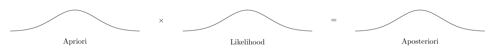
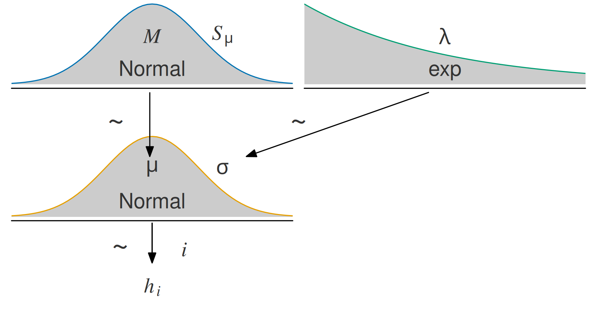
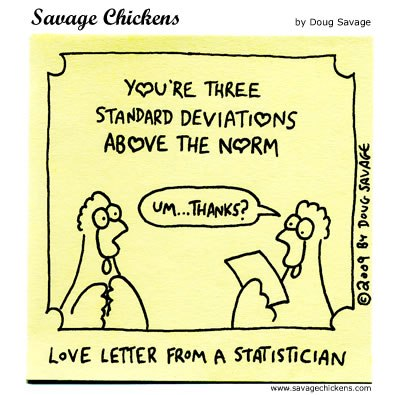
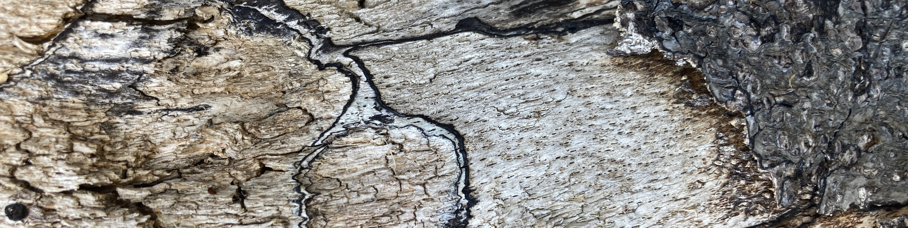

# Gauss-Modelle

{width="10%"}

## Lernsteuerung

### Position im Modulverlauf

@fig-modulverlauf gibt einen Überblick zum aktuellen Standort im Modulverlauf.

### Lernziele

Nach Absolvieren des jeweiligen Kapitels sollen folgende Lernziele erreicht sein.

Sie können …

- ein Gaußmodell spezifizieren und in R berechnen
- an Beispielen verdeutlichen, wie sich eine vage bzw. eine informationsreiche Priori-Verteilung auf die Posteriori-Verteilung auswirkt

### Begleitendes Lehrmaterial

Der Stoff dieses Kapitels orientiert sich an @mcelreath2020, Kap. 4.1 bis 4.3.
Im YouTube-Kanal des Autors finden sich passende Videos wie 📺 [Teil 1](https://youtu.be/cYHArln1DkM) und 📺 [Teil 2](https://youtu.be/qIuu-4qRT_0).


### Vorbereitung im Eigenstudium

-   [Statistik1, Kap. "Modellgüte"](https://statistik1.netlify.app/060-modellguete)
-   [Statistik1, Kap. "Punktmodelle 2"](https://statistik1.netlify.app/070-zusammenhaenge)
-   [Statistik1, Abschnitt "Normalverteilung"](https://statistik1.netlify.app/040-verbildlichen#normalverteilung)

### Benötigte R-Pakete

Für `rstanarm` wird ggf. [weitere Software](https://github.com/stan-dev/rstan/wiki/RStan-Getting-Started) benötigt.

::: callout-note
Software, und das sind R-Pakete, müssen Sie nur einmalig installieren. 
Aber bei jedem Start von R bzw. RStudio müssen Sie die (benötigten!) Pakete starten.

:::

```{r load-libs-hidden}
#| include: false
library(gt)
library(patchwork)
library(figpatch)
library(ggExtra)
library(tidyverse)
library(easystats)
#library(plotly)

theme_set(theme_modern())
```

```{r load-libs-non-hidden}
#| message: false
library(tidyverse)  # Datenjudo
library(rstanarm)  # Bayes-Modelle berechnen
library(easystats)  # Statistik-Komfort
library(DataExplorer)  # Daten verbildlichen
library(ggpubr)  # Daten verbildlichen
library(hexbin)  # stat_bin_hex ggplot2
```

::: callout-important
Ab diesem Kapitel benötigen Sie das R-Paket `rstanarm`. $\square$
:::

### Benötigte Daten

Wir benötigen den Datensatz *!Kung* aus der Datei `Howell1a.csv`. Quelle der Daten ist @mcelreath2020 mit Bezug auf Howell.

```{r Post-Regression-3}
Kung_path <-  
  "https://raw.githubusercontent.com/sebastiansauer/Lehre/main/data/Howell1a.csv"  

kung <- read.csv(Kung_path) 

head(kung, n = 5)
```

[Datenquelle](https://raw.githubusercontent.com/sebastiansauer/2021-wise/main/Data/Howell1a.csv)




### Einstieg

::: {#exm-gauss}
### Was war noch mal eine Normalverteilung?

In diesem Kapitel benötigen Sie ein gutes Verständnis der Normalverteilung (die auch als Gauss-Verteilung bezeichnet wird). 
Fassen Sie daher die wesentlichen Aspekte der Normalverteilung (soweit im Unterricht behandelt) zusammen! $\square$
:::

::: {#exm-post-gauss}
### Was war noch mal eine Posteriori-Verteilung?

In diesem Kapitel befragen wir die Post-Verteilung für ein normalverteilte Zufallsvariable, nämlich die Körpergröße der !Kung San.
Was war noch mal eine Post-Verteilung und wozu ist sie gut? $\square$
:::


### Stan stellt sich vor


{width="30%"}


## Wie groß sind die !Kung San?

Dieser Abschnitt basiert auf @mcelreath2020, Kap. 4.3.

### !Kung San

In diesem Abschnitt untersuchen wir eine Forschungsfrage in Zusammenhang mit dem Volk der !Kung.

> The ǃKung are one of the San peoples who live mostly on the western edge of the Kalahari desert, Ovamboland (northern Namibia and southern Angola), and Botswana.The names ǃKung (ǃXun) and Ju are variant words for 'people', preferred by different ǃKung groups. This band level society used traditional methods of hunting and gathering for subsistence up until the 1970s. Today, the great majority of ǃKung people live in the villages of Bantu pastoralists and European ranchers.

[Quelle](https://en.wikipedia.org/wiki/%C7%83Kung_people)

Wir interessieren uns für die Größe der erwachsenen !Kung, 
also filtern wir die Daten entsprechend und speichern die neue Tabelle als `kung_erwachsen`.

```{r Kung-5}
kung_erwachsen <- kung %>% 
  filter(age >= 18)

nrow(kung_erwachsen)
```

$N=`r nrow(kung_erwachsen)`$.

Lassen wir uns einige typische deskriptive Statistiken zum Datensatz ausgeben. `{easystats`} macht das tatsächlich recht easy, s. @tbl-kung.

```{r Kung-7, echo = TRUE, eval = FALSE}
#| eval: false
describe_distribution(kung_erwachsen)
```

```{r Kung-7a, eval = TRUE}
#| echo: false
#| label: tbl-kung
#| tbl-cap: Statistiken der metrischen Variablen im Kung-Datensatz

describe_distribution(kung_erwachsen) %>% 
  gt() %>% 
  fmt_number(columns = c(3:last_col()-1)) %>% 
  fmt_integer(columns = last_col())
```

Die Verteilungen lassen sich mit `plot_density` (aus `{DataExplorer}`), s. @fig-kung-dens.

```{r}
#| label: fig-kung-dens
#| fig-cap: Verteilungen der Variablen im Kung-Datensatz. Größe und Gewicht sind recht symmetrisch bzw. normalverteilt; Alter ist rechtsschief.

plot_density(kung_erwachsen)
```

### Wir gehen apriori von normalverteilter Größe Der !Kung aus

*Forschungsfrage:* Wie groß sind die erwachsenen !Kung im *Durchschnitt*?

Wir interessieren uns also für den Mittelwert der Körpergröße einer erwachsenen !Kung-Person, $\mu$.
Der Einfachheit halber gehen wir davon aus, dass Frauen und Männer im Schnitt gleich groß sind.

[^0800-gauss-2]](img/human.png){width="5%"}

[^0800-gauss-2]: Bildquelle: Own alterations andFile:SVG_Human_With_All_Organs.svg by Madhero88, CC BY-SA, 3.0


```{r p1-p2}
#| echo: false
p_nv_kung_prior <-
  tibble(x = seq(from = 100, to = 250, by = .1)) %>% 
  ggplot(aes(x = x, y = dnorm(x, mean = 178, sd = 20))) +
  geom_line(color = blue) +
  scale_x_continuous(breaks = seq(from = 100, to = 250, by = 75)) +
  labs(title = "mu ~ dnorm(178, 20)",
       y = "",
       x = "Mittelwert der Körpergröße, mu") +
  scale_y_continuous(breaks = NULL)

p_exp_kung_prior <-
  tibble(x = seq(0, 50, by = .01)) %>%
  ggplot(aes(x = x, y = dexp(x, rate = .1))) +
  geom_line(color = green) +
  scale_x_continuous() +
  scale_y_continuous(NULL, breaks = NULL) +
  labs(title = "sigma ~ dexp(0.1)",
       x = "Streuung der Körpergrößen, sigma")
```

## Unser Gauss-Modell der !Kung

### Normalverteilung als Grundlage des Modells

Hier gehen wir von einer Normalverteilung (synonym: "Gauss-Verteilung") des Populationsmittelwert, $\mu$,
sowie der tatsächlichen Körpergrößen der einzelnen Personen, $h_i$ (*h* wie *height*) aus.

Zur Erinnerung: Die (unstandardisierte) Post-Verteilung ist das Produkt von Apriori und Likelihood, 
s. @fig-priori-x-lik-is-post.
Im Folgenden gehen wir diese Bestimmungsstücke der Reihe nach durch, in gewohnter Manier.

{#fig-priori-x-lik-is-post}


Nur dass wir dieses Mal die Bayesbox nicht von Hand berechnen, 
sondern Stan die Arbeit überlassen.
Stan liefert uns brav eine Stichproben-Post-Verteilung zurück.

🤖 Ich berechne dir die Stichproben-Postverteilung, ganz ohne Bayesbox!

🧑‍🏫 Toll, dann hab ich ja nix zu tun!


### Apriori-Verteilungen

Wir haben zwei Apriori-Größen (Parameter):

1. Den *Mittelwert* der Körpergrößen in der Population, $\mu$. Dieser Parameter beantwortet die Frage: "Wie groß sind die erwachsenen !Kung im Durchschnitt?"
2. Die *Streuung* der tatsächlichen Körpergrößen um den Mittelwert der Population herum, $\sigma$. Dieser Parameter beantwortet die Frage: "Wie unterschiedlich groß sind die erwachsenen !Kung?"


Apriori-Verteilung für $\mu$: Der Mittelwert der Körpergröße, $\mu$, sei *normalverteilt* mit $\mu=178$ und $\sigma=20$:

$$\color{blue}{\mu \sim \mathcal{N}(178, 20)} \qquad{\text{Prior}}$$


Apriori-Verteilung für $\sigma$: die Streuung für den  $\sigma$ der Größen sei *exponentialverteil*  (da notwendig positiv) mit $\lambda = 1/8$.

$$\color{green}{\sigma \sim \mathcal{E}(1/8)} \qquad{\text{Prior}}$$
Warum gerade $\lambda=1/8$?
Das ist einfach ein grobes Abschätzen mit Blick auf @fig-exps:
Bei $\lambda=1/8$ liegt der Median bei ca. 5 cm.
Eine Streuung von ca. 5 cm um den Mittelwert herum erscheint nicht ganz falsch.
Dann kann man folgern: $95\%KI( \mu): 178 \pm 40$.
In Worten: 95% der erwachsenen !Kung sind zwischen 138 cm und 218 cm groß - laut unserem Modell (unserer Apriori-Verteilung).
Das ist ein ausreichend großer Bereich,
um Überraschungen zuzulassen, aber eng genug, um biologisch unmögliche Werte auszuschließen.

In @fig-kung-model sind unsere Priori-Verteilungen visualisiert.

```{r Kung-10}
#| echo: false
#| label: fig-kung-model
#| fig-cap: Prioris unseres (ersten) Kung-Modells (`m_kung`)
#| fig-asp: 0.4
#| fig-subcap: 
#|   - Priori der mittleren Körpergröße
#|   - Priori der Schätzungenauigkeit

p_nv_kung_prior
p_exp_kung_prior
```

::: callout-note
Dieses Modell hat zwei Parameter, $\mu$ und $\sigma$. $\square$
:::


Warum 178 cm? Kein besonderer Grund. Hier wollen wir den Effekt verschiedener Priori-Werte untersuchen.[^0800-gauss-5] 
In einer echten Untersuchung sollte man einen inhaltlichen Grund für einen Priori-Wert haben. 
*Oder* man wählt "schwach informative" Prioris, wie das `{rstanarm}` im Standard tut: 
Damit lässt man kaum Vorab-Information in das Modell einfließen, 
aber man verhindert extreme Prioris, die meistens unsinnig sind (so wie eine SD von 100 Metern bei der Körpergröße).

[^0800-gauss-5]: Der Autor des zugrundeliegenden Lehrbuchs, Richard McElreath, gibt 178cm als seine Körpergröße an.

::: callout-note
Wir haben zwar vorab nicht viel Wissen, aber auch nicht gar keines: 
Eine Gleichverteilung der Körpergrößen kommt nicht in Frage und ein vages Wissen zum Mittelwert haben wir auch. 
Darüber hinaus ist eine Normalverteilung für Körpergröße biologisch nicht unplausibel und spiegelt sich in den Daten wider, s. @fig-kung-dens.
:::


### Likelihood

Für viele Ausprägungen von $\mu$ und $\sigma$ müssen wir (bzw. Stan) die jeweilige Likelihood berechnen.
Z.B. ist zu fragen, wie groß die Wahrscheinlichkeit ist, 
dass wir einen !Kung finden mit Körpergröße 190 bis 191 cm ($h_i = [190,191]$),
gegeben der Hypothesen (Parameterwerte), 
dass der Populationsmittelwert $\mu=170$ cm und der Streuung der Körpergrößen $\sigma = 10$ cm beträgt.
Nehmen wir an, dass die Körpergrößen, $h_i$ normalverteilt sind,
dann können wir die Likelihood anhand der Quantile der Normalverteilung berechnen.
Etwa so:

$$L = Pr(h_i = [190;191]\quad |\mu=180, \sigma=10)$$

Aber da wir das Rechnen an Stan geben,
begnügen wir uns mit einer Kurz-Schreibweise

$$\textcolor{orange}{h_i} \sim \mathcal{\textcolor{orange}{N}}(\textcolor{blue}{\mu}, \textcolor{green}{\sigma})
\qquad
\textcolor{black}{\textcolor{orange}{Likelihood}}$$

Lies: "Die Körpergröße ist normalverteilt mit Mittelwert $\mu$ und Streuung $\sigma$."
Stan weiß dann, was er zu tun hat.
Für die Post-Verteilung muss Stan für alle plausiblen Kombinationen von $\mu$ und $\sigma$ die Likelihoods berechnen, s. @fig-mod-kung1.


```{r}
#| eval: false
#| echo: false
source("R-Code/Kruschke-plot3.R")
```


{#fig-mod-kung1 width=75%}


Jetzt haben wir unser Modell (`m_kung`) definiert!

Weil es so schön ist, schreiben/zeichnen wir es hier noch einmal auf, @eq-mod-kung1.

$$
\begin{aligned}
\mu &\sim \mathcal{N}(M=178, S=20) & \text{Prior} \\
\sigma &\sim \mathcal{E}(1/8) & \text{Prior} \\
h_i &\sim \mathcal{N}(\mu, \sigma) & \text{Likelihood}  \\
\end{aligned}
$$ {#eq-mod-kung1}


### Post-Verteilung berechnen mit Stan

Zur Berechnung von `m_kung` nutzen wir jetzt dieses Mal aber *nicht* die Bayesbox, 
sondern lassen Stan (in R) die Arbeit verrichten.


Okay, Stan, du Golem unseres Vertrauens! An die Arbeit! Berechne uns das Kung-Modell! 


```{r}
#| results: hide
# library(rstanarm)  # nicht vergessen, das Paket zu starten
m_kung <- 
  stan_glm(height ~ 1, # <1>
  prior_intercept = normal(178, 20), # <2>
  prior_aux = exponential(1/8),  # <3>
  refresh = 0,  # <4>
  data = kung_erwachsen)  

m_kung_post <- as_tibble(m_kung)    # <5>
names(m_kung_post) <- c("mu", "sigma")  # <6>  
```
1.  Stan berechnet die Post-Verteilung für die Körpergrößen, $h_i$, hier `height` genannt
2.  Apriori für $\mu$
3.  Apriori für $\sigma$
4.  Stan soll nicht so geschätzig sein und alle seine Stichproben am Bildschirm zeigen, sondern nur das Wichtigste zurückmelden.
5.  Modellergebnis in Tabelle umwandeln
6.  Schönere Namen für die Spalten geben

Mit `stan_glm` rufen wir Stan zur Arbeit.
`stan_glm`[^0800-gauss-8] ist eine Funktion,
mit der man Regressionsmodelle berechnen kann. 
Nun haben wir in diesem Fall kein "richtiges" Regressionsmodell. Man könnte sagen, wir haben eine AV (Körpergröße), aber keine UV (keine Prädiktoren). 
Glücklicherweise können wir auch solche "armen" Regressionsmodelle formulieren: 
`av ~ 1` bzw. in unserem Beispiel `height ~ 1` bedeutet, 
dass man nur die Verteilung der AV berechnen möchte, 
aber keine Prädiktoren hat (das soll die `1` symbolisieren). 

[^0800-gauss-8]: aus dem R-Paket `rstanarm`, das zuvor installiert und gestartet sein muss, bevor Sie den Befehl nutzen können.


Betrachten wir die Post-Verteilungen von $\mu$ und von $\sigma$, fig-kung3.

```{r Kung-22}
#| echo: false
#| label: fig-kung3
#| fig-cap: Die beiden Randverteilungen der Post-Verteilungen, d.h. die Verteilungen für mu und für sigma
#| fig-asp: 0.5

m_kung_post %>% 
  pivot_longer(mu:sigma) %>% 
  ggplot(aes(x = value)) + 
  geom_density(fill = "grey33") +
  scale_y_continuous(NULL, breaks = NULL) +
  xlab(NULL) +
  theme(
    panel.grid = element_blank(),
    strip.text = element_text(size = 16)  # increase facet header font size
  ) +
  facet_wrap(~ name, scales = "free", 
             labeller = label_parsed,
             ncol = 2)
```


Plotten wir mal die *gemeinsame* Post-Verteilung von `m_kung`, s. @fig-m_kung_neue_prioris-post-joint,
also die Kombinationen, die "Pärchen" der Werte von Mittelwert und Streuung.

::: panel-tabset

### Fliesendiagramm

Gemeinsame Post-Verteilung von Mittelwert, $\mu$ und Streuung, $\sigma$

```{r post-m_kung-plot}
#| echo: true
#| label: fig-m_kung_neue_prioris-post-joint
#| fig-cap: "Die gemeinsame Post-Verteilung von Mittelwert und Streuung von m_kung_neue_prioris"

m_kung_post %>% 
  ggplot() +
  aes(x = mu, y = sigma) %>% 
  geom_hex() +
  scale_fill_viridis_c() 
```

### Streudiagramm


```{r Kung-5-bis}
#| echo: false
#| fig-cap: "Die Postverteilung in unterschiedlicher Darstellung"
#| label: fig-m_kung_neue_prioris-post-anders1


p_m_kung_post <- 
  m_kung_post %>% 
  ggplot() +
  aes(x = mu, y = sigma) +
  geom_point(alpha = .1) 

p10 <- ggExtra::ggMarginal(p_m_kung_post, type = "density")

p20 <- 
  m_kung_post %>% 
  ggplot(aes(x = mu)) + 
  geom_histogram()

p10
```

### Histogramm

Und hier kommt die Post-Verteilung nur des Mittelwerts.

Natürlich können wir auch nur von einem einzelnen Parameter (z.B. Mittelwert) die Verteilung untersuchen, s. @fig-m_kung_neue_prioris-post-anders2.

```{r}
#| echo: false
#| fig-cap: Die Post-Verteilung von mu in m_kung_neue_prioris; ein Balkendiagramm bietet sich an.
#| label: fig-m_kung_neue_prioris-post-anders2
p20
```

:::

Da das Modell *zwei* Parameter hat, können wir auch beide gleichzeitig plotten. Wie man sieht, sind die beiden Parameter unkorreliert. In anderen Modellen können die Parameter korreliert sein.
@fig-m_kung_neue_prioris-post-joint erlaubt uns, für *jede Kombination von Mittelwert und Streuung* zu fragen, wie wahrscheinlich diese bestimmte Kombination ist.


Fassen wir die Ergebnisse dieses Modells zusammen:

-   Wir bekommen eine Wahrscheinlichkeitsverteilung für $\mu$ und eine für $\sigma$ (bzw. eine zweidimensionale Verteilung, für die $\mu,\sigma$-Paare).

-   Trotz des eher vagen Priors ist die Streuung Posteriori-Werte für $\mu$ und $\sigma$ klein: Die große Stichprobe hat die Priori-Werte überstimmt.

-   Ziehen wir Stichproben aus der Posteriori-Verteilung, so können wir interessante Fragen stellen.

## Hallo, Posteriori-Verteilung

... wir hätten da mal ein paar Fragen an Sie. 🕵

1.  Mit welcher Wahrscheinlichkeit ist die *mittlere* !Kung-Person größer als 1,55m?
2.  Welche mittlere Körpergröße wird mit 95% Wahrscheinlichkeit nicht überschritten, laut dem Modell?
3.  In welchem 90%-PI liegt $\mu$ vermutlich?
4.  Mit welcher Unsicherheit ist die Schätzung der mittleren Körpergröße behaftet?
5.  Was ist der mediane Schätzwert der mittleren Körpergröße, sozusagen der "Best Guess"?

Antworten folgen etwas weiter unten.


### Posteriori-Stichproben von `stan_glm()` berechnen lassen

Mit `stan_glm()` können wir komfortabel die Posteriori-Verteilung berechnen. 
Die Gittermethode wird nicht verwendet, aber die Ergebnisse sind - für unsere Fälle - ähnlich. 
Es werden aber auch viele Stichproben simuliert (sog. MCMC-Methode). 

Grob gesagt berechnen wir die Post-Verteilung mit `stan_glm` so: `stan_glm(AV ~ UV, data = meine_daten)`.


Wir können, wie wir es oben getan haben, uns die Stichproben der Post-Verteilung ausgeben lassen, 
und diese z.B. plotten.

Wir können es aber auch komfortabler haben ... 
Mit dem Befehl `parameters` kann man sich die geschätzten Parameterwerte einfach ausgeben lassen (s. @fig-m_kung_neue_prioris-post-joint).

```{r Kung-24, echo = TRUE, results="hide"}
parameters(m_kung)  # aus Paket `easystats`
```

```{r Kung-6}
#| echo: false
parameters(m_kung) %>% display()

ci_low <- parameters(m_kung)$CI_low |> round(2)
ci_high <- parameters(m_kung)$CI_high |> round(2)
y_pointestimate <- round(as.numeric(parameters(m_kung)$Median), 0)
```

Das Wesentliche: Unser Golem schätzt den Größenmittelwert der Kung auf ca. `r y_pointestimate`cm bzw. 
auf einen Bereich von etwa `r ci_low` bis `r ci_high` schätzt (95%-ETI in der Voreinstellung^[https://easystats.github.io/parameters/reference/model_parameters.brmsfit.html]). 
Informativ ist vielleicht noch, dass wir den `Prior` erfahren, der im Modell verwendet wurde. Dazu später mehr.

::: callout-note
In dieser Ausgabe sind ein paar Angaben, die wir nicht verstehen, wie `pd`, `Rhat` und `ESS`. 
Kein Problem: Einfach ignorieren 🤓 Wer Näheres wissen will, 
findet [hier](https://easystats.github.io/easystats/) einen Anfang. 
Außerdem sei an @mcelreath2020 und @gelman2021 verwiesen. $\square$
:::

## Wie tickt `stan_glm()`?


::::: columns
::: {.column width="20%"}
{width="50%"} 

[Quelle](https://mc-stan.org/)

{width="50%"}
:::

::: {.column width="80%"}
Hier ein paar Kerninfos zu `stan_glm`:

-   *Stan* ist eine Software zur Berechnung von Bayesmodellen; das Paket `rstanarm` stellt Stan für uns bereit.
-   `stan_glm()` ist für die Berechnung von Regressionsmodellen ausgelegt.
-   Will man nur die Verteilung einer einzelnen Variablen (wie `heights`) schätzen, so hat man man ... eine Regression ohne Prädiktor.
-   Eine Regression ohne Prädiktor schreibt man auf Errisch so: `y ~ 1`. Die `1` steht also für die nicht vorhandene UV; `y` meint die AV (`height`).
-   `(Intercept)` (Achsenabschnitt) gibt den Mittelwert an.
:::
:::::

Mehr findet sich in der [Dokumentation von RstanArm](https://mc-stan.org/rstanarm/).

### Schätzwerte zu den Modellparameter

Die Parameter eines Modells sind die Größen, für die wir eine Priori-Verteilung annehmen. 
Außerdem wählen wir die Normalverteilung als Likelihood-Verteilung, 
so dass wir die Likelihood berechnen können. 
Auf dieser Basis schätzen wir dann die Post-Verteilung. 
Ich sage *schätzen*, um hervorzuheben, dass wir die wahren Werte nicht kennen, 
sondern nur eine Vermutung haben, unsere Ungewissheit vorab also (wie immer) in der Priori-Verteilung festnageln 
und unsere Ungewissheit nach Kenntnis der Daten in der Posteriori-Verteilung quantifizieren. 
Wie gerade gesehen, lassen sich die Modellparameter (bzw. genauer gesagt deren Schätzungen) 
einfach mit `parameters(modellname)` auslesen.

### Stichproben aus der Posteriori-Verteilung ziehen

Wie wir es vom Globusversuch gewohnt sind, können wir aber auch Stichproben aus der Post-Verteilung ziehen.

Hier die ersten paar Zeilen von `m_kung_post`:

```{r Kung-26}
head(m_kung_post)
```

In einer Regression ohne Prädiktoren entspricht der Achsenabschnitt dem Mittelwert der AV, daher gibt uns die Spalte `(Intercept)` Aufschluss über unsere Schätzwerte zu $\mu$ (der Körpergröße).

:::: {#exr-kung1}
## Mit welcher Wahrscheinlichkeit ist $\mu>155$?

::: {.callout-tip appearance="minimal" collapse="true"}
### Lösung

```{r Kung-28a, echo = TRUE}

names(m_kung_post) <- 
  c("mu", "sigma")  # den Namen "(Intercept)" durch "mu" ersetzen, ist prägnanter

m_kung_post %>% 
  count(mu > 155) %>% 
  mutate(prop = n/sum(n))
```

Die Wahrscheinlichkeit ist nicht hoch, aber nicht auszuschließen, dass die Kung im Schnitt größer als 155 cm sind. Wahrscheinlicher ist jedoch, dass sie kleiner als 155 cm sind. $\square$
:::
::::

:::: {#exr-kung2}
## Mit welcher Wahrscheinlichkeit ist $\mu>165$?

::: {.callout-tip appearance="minimal" collapse="true"}
### Lösung

```{r Kung-28, echo = TRUE}
names(m_kung_post) <- 
  c("mu", "sigma")  # den Namen "(Intercept)" durch "mu" ersetzen, ist prägnanter

m_kung_post %>% 
  count(mu > 165) %>% 
  mutate(prop = n/sum(n))
```

Oh, diese Hypothese können wir mit an Sicherheit grenzender Wahrscheinlichkeit ausschließen. Aber Achtung: Das war eine Kleine-Welt-Aussage! Die Wahrscheinlichkeit, die Hypothese $\mu > 165$ auszuschließen ist *nur* dann hoch, wenn das Modell gilt! Wenn also der Golem keinen Mist gebaut hat. Und sind wir mal ehrlich, der Golem tut, was sein:e Herr:in und Meister:in ihm befiehlt. Letztlich liegt es an uns, den Golem auf Spur zu kriegen.
:::
::::

:::: {#exm-kung3}
## Welche mittlere Körpergröße wird mit 95% Wahrscheinlichkeit nicht überschritten, laut dem Modell `m_kung`?

::: {.callout-tip appearance="minimal" collapse="true"}
### Lösung

```{r Kung-29, echo = TRUE}
m_kung_post %>% 
  summarise(q95 = quantile(mu, .95))
```
:::
::::

:::: {#exr-kung4}
## In welchem 90%-PI liegt $\mu$ vermutlich?

::: {.callout-tip appearance="minimal" collapse="true"}
### Lösung

```{r Kung-30, echo = TRUE}
m_kung_post %>% 
  eti()
```

Ein ETI ist synonym zu PI.
:::
::::

:::: {#exr-kung5}
## Mit welcher Unsicherheit ist die Schätzung der mittleren Körpergröße behaftet?

::: {.callout-tip appearance="minimal" collapse="true"}
### Lösung

```{r eval = FALSE}
m_kung %>% 
  parameters()
```

```{r}
#| echo: false
m_kung %>% 
  parameters() |> 
  display()
```

Seeing is believing, s. @fig-m_kung-params-intercept.

```{r}
#| fig-cap: "Parameter von m_kung, nur einer: der Intercept"
#| label: fig-m_kung-params-intercept
m_kung %>% 
  parameters() %>% 
  plot(show_intercept = TRUE)
```

Das Modell ist sich recht sicher: die Ungewissheit der mittleren Körpergröße liegt bei nicht viel mehr als einem Zentimeter (95%-CI).
:::
::::

:::: {#exr-kung6}
## Was ist der mediane Schätzwert der mittleren Körpergröße, sozusagen der "Best Guess"?

::: {.callout-tip appearance="minimal" collapse="true"}
### Lösung

`parameters(m_kung)` hat uns die Antwort schon gegeben: Ca. 155 cm.
:::
::::

🏋️ Ähnliche Fragen bleiben als Übung für die Lesis. 🤓

### Standard-Prioriwerte bei `stan_glm()`

Man kann `stan_glm()` auch ohne Priori-Werte aufrufen.
In dem Fall bestimmt Stan die Priori-Werte selber.
Welche das sind, kann man sich so anzeigen lassen:

```{r Kung-8-bis, echo = TRUE}
prior_summary(m_kung)
```
Aber welche Priori-Werte verwendet Stan?
Ganz einfach: Stan zieht die Stichproben-Daten als Prioris heran.
Strenggenommen ist das nicht "pures Bayes", weil die Priori-Werte ja *vorab*, 
also vor Kenntnis der Daten bestimmt werden sollen. 


Man sollte diese Standardwerte als (komfortablen) Minimalvorschlag sehen. 
Kennt man sich im Sachgebiet aus, kann man meist bessere Prioris finden. 
Die Voreinstellung ist nicht zwingend; andere Werte wären auch denkbar.

::: callout-note
### Standardwerte von `stan_glm`

-   `Intercept`: $\mu$, der Mittelwert der Verteilung $Y$
    -   $\mu \sim \mathcal{N}(\bar{Y}, sd(Y)\cdot 2.5)$
    -   als Streuung von $\mu$ wird die 2.5-fache Streuung der Stichprobe (für $Y$) angenommen.
-   `Auxiliary (sigma)`: $\sigma$, die Streuung der Verteilung $Y$
    -   $\sigma \sim \mathcal{E}(\lambda=1/sd(Y))$
    -   als "Streuung", d.h. $\lambda$ von $h_i$ wird $\frac{1}{sd(Y)}$ angenommen. $\square$
:::

Eine sinnvolle Strategie ist, einen Prior so zu wählen, dass man nicht übergewiss ist, 
also nicht zu sicher Dinge behauptet, die dann vielleicht doch passieren 
(also die Ungewissheit zu gering spezifiziert), andererseits sollte man extreme, 
unplausible Werte ausschließen.

::: callout-important
Bei der Wahl der Prioris gibt es nicht die eine, richtige Wahl. 
Die beste Entscheidung ist auf transparente Art den Stand der Forschung einfließen zu lassen und eigene Entscheidungen zu begründen. 
Häufig sind mehrere Entscheidungen möglich. Möchte man lieber vorsichtig sein,
weil man wenig über den Gegenstand weiß, dann könnte man z.B. auf die Voreinstellung von `rstanarm` vertrauen,
die "schwachinformativ" ist, also nur wenig Priori-Information in das Modell einfließen lässt.
:::

### Wenn es schnell gehen muss

`stan_glm()` ist deutlich langsamer als z.B. der befreundete Golem `lm()`.
Der Grund für Stans Langsamkeit ist, dass er viele Stichproben zieht, also viel zu zählen hat.
Außerdem wiederholt er das Stichprobenziehen (im Standard) 4 Mal, damit sein Meister prüfen kann, ob er (Stan) die Arbeit auch immer richtig gemacht hat.
Die Idee dabei ist, wenn alle vier Durchführungen (auch "Ketten" engl., chains) genannt,
zum etwa gleichen Ergebnis kommen, dann wird schon alles mit rechten Dingen zugegangen sein.
Weichen die Ergebnisse der 4 Ketten voneinander ab, so ist Stan ein Fehler unterlaufen, oder, irgendetwas ist "dumm gelaufen".
An dieser Stelle schauen wir uns die Ketten nicht näher an, aber es sei notiert, dass man die Anzahl der Ketten mit dem Argument `chains` steuern kann.
Möchte man, dass Stan sich beeilt, so kann man `chains = 1` setzen, das spart Zeit, s. `m_kung_1kette`. 

```{r m41a, echo = TRUE, results="hide"}
m_kung_1kette <- stan_glm(height ~ 1, 
                 data = kung_erwachsen, 
                 chains = 1,  # nur 1 Kette, anstelle von 4 im Default, spart Zeit
                 refresh = 0) 

parameters(m_kung_1kette)  
```

## Modell `m_kung_neue_prioris`: Standard-Priori-Werte


Im Modell `m_kung` haben wir unsere eigenen Priori-Werte einfließen lassen.
Jetzt vertrauen wir die Wahl der Prioris Stand an.
Betrachten Sie dazu unser zweites Kung-Modell, `m_kung_neue_prioris`.


```{r}
#| eval: false
m_kung_neue_prioris <- 
  stan_glm(height ~ 1,
           refresh = FALSE,  # bitte nicht so viel Ausgabe drucken
           data = kung_erwachsen)
parameters(m_kung_neue_prioris)
```

```{r}
#| echo: false
#| eval: true
#| label: tbl-m_kung_neue_prioris-params
#| tbl-cap: "Parameter von m_kung_neue_prioris mit Standard-rioriwerten"
m_kung_neue_prioris <- 
  stan_glm(height ~ 1, 
           refresh = FALSE,  # bitte nicht so viel Ausgabe drucken
           seed = 42,  # Zufallszahlen fixieren
           data = kung_erwachsen)
parameters(m_kung_neue_prioris) |> display()
```

Wir haben noch nicht alle Informationen kennengelernt, die in @tbl-m_kung_neue_prioris-params ausgegeben werden. 
Im Zweifel: Einfach ignorieren. Wichtige Fähigkeit im Studium. 🤓

::: callout-important
Vergleichen Sie die Parameterwerte von `m_kung` und `m_kung_neue_prioris`! 
Was fällt Ihnen auf? Nichts? Gut! 
Tatsächlich liefern beide Modelle sehr ähnliche Parameterwerte. Die Prioriwerte waren nicht so wichtig, 
weil wir genug Daten haben. Hat man einigermaßen viele Daten, 
so fallen Prioriwerte nicht mehr ins Gewicht, zumindest wenn sie moderat gewählt waren.
:::

```{r Kung-16-bis, eval = FALSE}
#| echo: false
#write_rds(m_kung_neue_prioris, "objects/m_kung_neue_prioris.rds")
```

### Posteriori-Verteilung und Parameter plotten

Leider liefert der Stan-Golem leider keinen braven Tibble (Tabelle) zurück.

> 👨‍🏫 Mensch, Stan, streng dich mal ein bisschen an!

> 🤖 Mach's halt selber, wenn du es besser kannst!

Daher müssen wir die Ausgabe des Stan-Golemns erst in eine schöne Tabelle umwandeln:

```{r}
m_kung_neue_prioris_tibble <-
  as_tibble(m_kung_neue_prioris)

head(m_kung_neue_prioris_tibble)
```

Außerdem ist der Name der ersten Spalte eigentlich unzulässig, 
da Spaltennamen in R nicht mit Sonderzeichen anfangen dürfen (sondern mit Buchstaben). 
Daher müssen wir den Namen mit "Samthandschuhen" anpacken. 
Auf Errisch sind das die Backticks, die wir um den Namen rumwickeln müssen, s. die folgende Syntax.

::: panel-tabset
### Mit `{ggpubr}`

```{r}
m_kung_neue_prioris_tibble |> 
  gghistogram(x = "`(Intercept)`")  # Aus dem Paket "ggpubr"
```

### Mit `{ggplot}`

```{r}
m_kung_neue_prioris_tibble |> 
  ggplot(aes(x = `(Intercept)`)) +  # Aus dem Paket `ggplot2`
  geom_histogram()
```
:::

Als Ausblick: Ein Vergleich mehrerer Priori-Werte wäre auch nützlich, 
um ein skeptisches Publikum von der Wahl (bzw. der Indifferenz) der gewählten Priori-Werte zu überzeugen.

### Welche Körpergrößen erwartet unser Modell

Bisher haben wir untersucht, wie die Verteilung der *mittleren* Körpergrößen, $\mu$, 
laut unserem Modell aussehen könnte; wir haben uns also mit der Post-Verteilung von $\mu$ beschäftigt. 
Wir könnten aber auch an der Frage der Verteilung der *tatsächlichen* Körpergrößen, $h_i$, laut Modell, interessiert sein: 
Wie groß sind sie denn, die !Kung, laut unserem Modell?


Wie wir wissen, liefert unser Stan-Golem eine *Stichproben-Postverteilung*.
Wenn wir das Ergebnisobjekt unserer Analyse, `m_kung` in eine Tabelle (Tibble) umwandeln und (die ersten paar Zeilen) betrachen,
sehen wir diese Stichproben:

```{r}
m_kung |> as_tibble() |> head()
```

Laut unserem Modell sind die Körpergrößen, $h_i$, normalverteilt mit $\mu$ und $\sigma$.
$\mu$ wird von Stan, der in Begriffen der Regressionsanalyse denkt, schnöde als `(Intercept)` bezeichnet.
Wir könnten jetzt also für jede Zeile eine Normalverteilung berechnen.
Und daraus zufällig eine Zahl ziehen. Damit hätten wir dann unsere Verteilung von Körpergrößen laut Modell.
Diese Verteilung nennt man auch *Posterior-Prädiktiv-Verteilung*.
Prädiktiv daher, weil sie die Werte der Körpergrößen "vorhersagt".

Wir können uns diese Verteilung auch komfortabel von R ausgeben lassen, s. @fig-ppcheck.

```{r}
#| layout-ncol: 2
#| label: fig-ppcheck
#| fig-cap: "Die Posterior-Prädiktiv-Verteilung: Die Verteilung der tatsächlichen Körpergrößen auf Basis der Post-Verteilung. Unser Modell stellt die tatsächliche Verteilung ganz gut nach."
#| fig-subcap:
#|   - "Die dunkle, dicke Dichtekurve zeigt die tatsächliche Verteilung der Körpergrößen im Datensatz. Die hellen, leichten Dichtekurven zeigen die Verteilungen laut der Post-Verteilung unseres Modells."
#|   - "Der wahre Wert einer Test-Statistik (T), hier der Mittelwert der Körpergrößen, wird mit der Verteilung der Körpergrößen in Bezug gesetzt."
pp_check(m_kung)
pp_check(m_kung, "stat")
```

## Fazit

<!-- TODO: Die neuen Infosder Gauss-Modelle auf die formel von Bayes Theorem zurückühren. -->

### Zusammenfassung

Wir haben die Posteriori-Verteilung für ein Gauss-Modell berechnet. Dabei hatten wir ein einfaches Modell mit metrischer Zielvariablen, ohne Prädiktoren, betrachtet. Die Zielvariable, Körpergröße (`height`), haben wir als normalverteilt mit den Parametern $\mu$ und $\sigma$ angenommen. Für $\mu$ und $\sigma$ haben wir jeweils keinen einzelnen (fixen) Wert angenommen, sondern eine Wahrscheinlichkeitsverteilung, der mit der Priori-Verteilung für $\mu$ bzw. $\sigma$ festgelegt ist.

### Botschaft von einem Statistiker



::: callout-important
Kontinuierliches Lernen ist der Schlüssel zum Erfolg.
:::

## Vertiefung: Wahl der Priori-Werte

🏎️ Dieser Abschnitt ist eine VERTIEFUNG und nicht prüfungsrelevant. 🏎

### Welche Beobachtungen sind auf Basis unseres Modells zu erwarten?

```{r prior-pred, echo = TRUE}
n <- 1e4

sim <- tibble(sample_mu  = 
      rnorm(n, 
            mean = 178, 
            sd   = 20),
    sample_sigma = 
      rexp(n, 
            rate = 0.1)) %>% 
  mutate(height  = 
      rnorm(n, 
            mean = sample_mu, 
            sd   = sample_sigma))

height_sim_sd <- 
  sd(sim$height) %>% round()
height_sim_mean <- 
  mean(sim$height) %>% round()

```

💭 Was denkt der Golem (`m_kung`) *apriori* von der Größe der !Kung?

🦾 Ziehen wir mal ein paar Stichproben auf Basis des Modells. Voilà:

```{r Kung-12}
p3 <- 
  sim %>% 
  ggplot(aes(x = height)) +
  geom_density(fill = "grey33") +
  scale_x_continuous(breaks = c(0, 178-3*height_sim_sd, 178, 178+3*height_sim_sd)) +
  scale_y_continuous(NULL, breaks = NULL) +
  labs(title = "height ~ dnorm(mu, sigma)",
       caption = "X-Achse zeigt MW±3SD",
       x = "Größe") +
  theme(panel.grid = element_blank()) 

p3
```

[Quellcode](https://bookdown.org/content/4857/geocentric-models.html#a-gaussian-model-of-height)

### Priori-Werte prüfen mit der Priori-Prädiktiv-Verteilung

-   Die Priori-Prädiktiv-Verteilung (`sim`) simuliert Beobachtungen (nur) auf Basis der Priori-Annahmen: $h_i \sim \mathcal{N}(\mu, \sigma),$ $\mu \sim \mathcal{N}(178, 20),$ $\sigma \sim \mathcal{E}(0.1)$
-   So können wir prüfen, ob die Priori-Werte vernünftig sind.

Die Priori-Prädiktiv-Verteilung zeigt, dass unsere Priori-Werte ziemlich vage sind, also einen zu breiten Bereich an Größenwerten zulassen:

```{r Kung-13}
p3
```

Anteil $h_i > 200$:

```{r Kung-14, echo = TRUE}
anteil_großer_kung <- 
sim %>% 
  count( height > 200) %>% 
  mutate(prop = n/sum(n))
anteil_großer_kung
```

🤔 Sehr große Buschleute? `r round(anteil_großer_kung$prop[2], 2)*100` Prozent sind größer als 2 Meter. Das ist diskutabel, muss aber nicht zwangsläufig ein schlechter Prior sein.

### Vorhersagen der Priori-Werte

```{r Kung-15}
#| echo: false
sw_path <- paste0(here::here(),"/img/south_west_black_24dp2.png")
se_path <- paste0(here::here(),"/img/south_east_black_24dp2.png")


sw <- fig(sw_path)
se <- fig(se_path)


(p_nv_kung_prior + p_exp_kung_prior) / (se + sw) / (plot_spacer() + p3 + plot_spacer()) 

```

### Extrem vage Priori-Verteilung für die Streuung?

$$\sigma \sim \mathcal{E}(\lambda=0.01)$$

```{r Kung-16}
#| echo: false
set.seed(4)


# simulate
sim2 <-
  tibble(sample_mu    = rnorm(n, mean = 178, sd = 100),
         sample_sigma = rexp(n, rate = .01)) %>% 
  mutate(height = rnorm(n, mean = sample_mu, sd = sample_sigma))

# compute the values we'll use to break on our x axis
breaks <-
  c(mean(sim2$height) - 3 * sd(sim2$height), 0, mean(sim2$height), mean(sim2$height) + 3 * sd(sim2$height)) %>% 
    round(digits = 0)

# this is just for aesthetics
text <-
  tibble(height = 272 - 25,
         y      = .0013,
         label  = "größter Mann",
         angle  = 90)

# plot
p4 <-
  sim2 %>% 
  ggplot(aes(x = height)) +
  geom_density(fill = "grey20") +
  geom_vline(xintercept = 0, color = "white") +
  geom_vline(xintercept = 272, color = "white", linetype = 3) +
  geom_text(data = text,
            aes(y = y, label = label, angle = angle),
            color = "grey92") +
  scale_x_continuous(breaks = breaks, 
                     limits = c(-400, 700)) +
  scale_y_continuous(NULL, breaks = NULL) +
  labs(title = "height ~ dnorm(mu, sigma)\nmu ~ dnorm(178, 100)\nsigma ~ E(0.01)",
       x = "Größe",
       caption = "X-Achse zeigt MW±3SD") +
  theme(panel.grid = element_blank()) 

p4
```

Die Streuung der Größen ist weit:

```{r Kung-3}
d <- 
  tibble(x = seq(0,75, by =.01),
         y = dexp(x, rate = .01))

d %>% 
  ggplot(aes(x,y)) +
  geom_line()
```

```{r Kung-17, echo = FALSE, eval = FALSE}
sim2 %>% 
  count(height < 0) %>% 
  mutate(prop = n()/n)
```

🤔 Das Modell geht apriori von ein paar Prozent Menschen mit *negativer* Größe aus. 
Ein Haufen Riesen 👹 werden bei den !Kung auch erwartet.

🤯 Vage (flache, informationslose, "neutrale", "objektive") Priori-Werte machen oft keinen Sinn, 
weil sie extreme, unplausible Werte zulassen.

## Aufgaben

### Papier-und-Bleistift-Aufgaben

<!-- 3. [ReThink4e3](https://datenwerk.netlify.app/posts/ReThink4e3/ReThink4e3.html) -->

1.  [exp-tab](https://datenwerk.netlify.app/posts/exp-tab/)
2.  [exp-tab2](https://datenwerk.netlify.app/posts/exp-tab2/)
3.  [norms-sd](https://datenwerk.netlify.app/posts/norms-sd/)
4.  [small-wide-normal](https://datenwerk.netlify.app/posts/small-wide-normal/)
5.  [exp1](https://datenwerk.netlify.app/posts/exp1/)
6.  [distros](https://datenwerk.netlify.app/posts/distros/)
7.  [mtcars-post_paper](https://datenwerk.netlify.app/posts/mtcars-post_paper/)
8.  [groesse03](https://datenwerk.netlify.app/posts/groesse03/)
9.  [pupil-size2](https://datenwerk.netlify.app/posts/pupil-size2/)
10. [groesse04](https://datenwerk.netlify.app/posts/groesse04/)
11. [ReThink4e2](https://datenwerk.netlify.app/posts/ReThink4e2/ReThink4e2.html)
12. [Priorwahl1](https://datenwerk.netlify.app/posts/Priorwahl1/Priorwahl1.html)

### Aufgaben, für die man einen Computer benötigt

1.  [stan_glm01](https://datenwerk.netlify.app/posts/stan_glm01/stan_glm01.html)
2.  [ReThink4e1](https://datenwerk.netlify.app/posts/rethink4e1/rethink4e1)
3.  [ReThink4e3](https://datenwerk.netlify.app/posts/rethink4e3/rethink4e3)
4.  [Kung-height](https://datenwerk.netlify.app/posts/kung-height/kung-height)
5.  [Pupil-size](https://datenwerk.netlify.app/posts/pupil-size/pupil-size)
6.  [IQ-Studentis](https://datenwerk.netlify.app/posts/iq-studentis/iq-studentis)
7.  [Priori-Streuung](https://datenwerk.netlify.app/posts/priori-streuung/priori-streuung)

### Quiz-Aufgaben (Single-Choice)

Hier finden Sie Single-Choice-Aufgaben zu diesem Kapitel.
Wählen Sie eine Antwort aus und klicken Sie auf das Häkchen, um sie zu überprüfen;
über das Fragezeichen erhalten Sie die ausführliche Lösung.

```{r quiz-gauss-setup}
#| include: false
library(exams2forms)

quiz_gauss_files <- list(
  "exr/gauss-modell-struktur-schoice/gauss-modell-struktur-schoice.Rmd",
  "exr/warum-exponential-fuer-sigma-schoice/warum-exponential-fuer-sigma-schoice.Rmd",
  "exr/stan-glm-intercept-schoice/stan-glm-intercept-schoice.Rmd",
  "exr/priori-washed-out-schoice/priori-washed-out-schoice.Rmd",
  "exr/rstanarm-standard-prior-rechnung-schoice/rstanarm-standard-prior-rechnung-schoice.Rmd",
  "exr/priori-vs-posterior-praediktiv-schoice/priori-vs-posterior-praediktiv-schoice.Rmd",
  "exr/vage-priori-gefahr-schoice/vage-priori-gefahr-schoice.Rmd",
  "exr/exp-prior-95quantil-schoice/exp-prior-95quantil-schoice.Rmd",
  "exr/stan-glm-chains-schoice/stan-glm-chains-schoice.Rmd",
  "exr/gemeinsame-post-verteilung-schoice/gemeinsame-post-verteilung-schoice.Rmd"
)
```

```{r quiz-gauss}
#| echo: false
#| message: false
#| results: asis
exams2forms(quiz_gauss_files, n = 1)
```

## ---

{width="100%"}
