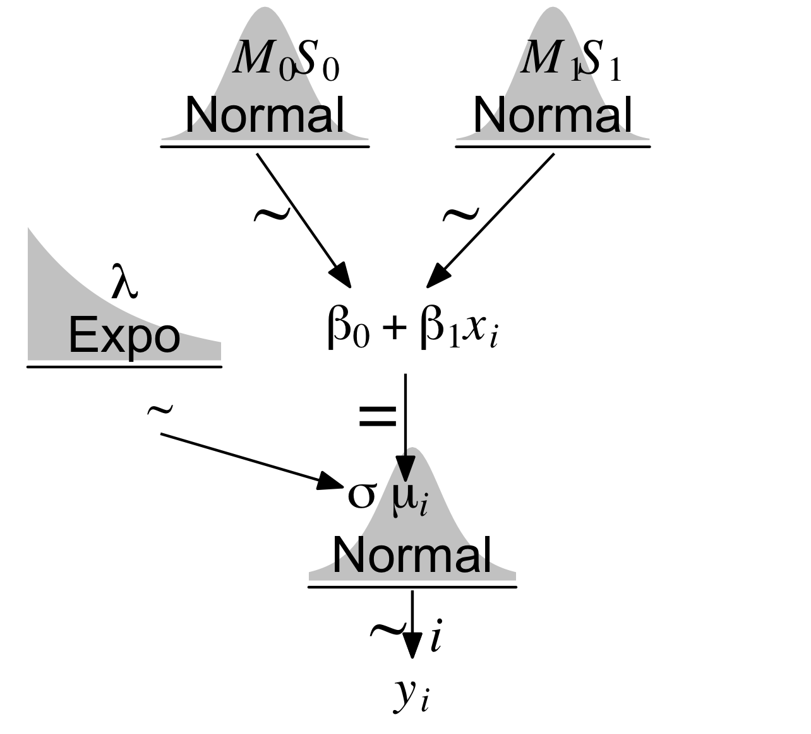
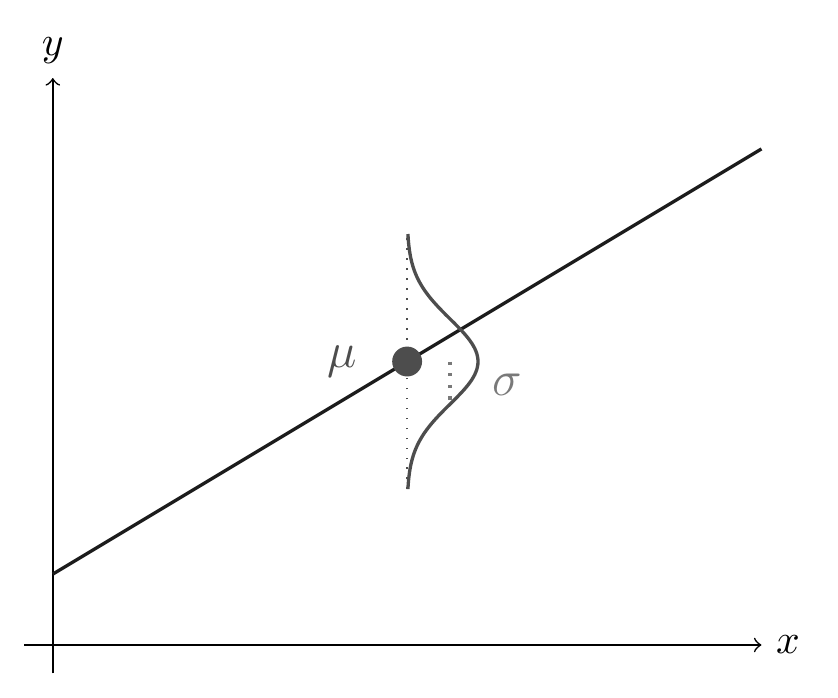

# Einfache lineare Modelle


## Lernsteuerung


### Position im Modulverlauf

@fig-modulverlauf gibt einen Überblick zum aktuellen Standort im Modulverlauf.


### Lernziele

Nach Absolvieren des jeweiligen Kapitels sollen folgende Lernziele erreicht sein.

Sie können ...


- Das Zusammenspiel von Apriori-Verteilungen und linearem Modell zur Berechnung der Likelihood erläutern
- die Post-Verteilung für einfache lineare Modelle in R berechnen
- zentrale Informationen zu Modellparametern des Regressionsmodells -- wie Lage- oder Streuungsmaße und auch Schätzintervalle - aus der Post-Verteilung herauslesen


### Begleitliteratur

Der Stoff dieses Kapitels orientiert sich an @mcelreath2020, Kap. 4.4.


### Vorbereitung im Eigenstudium

- [Statistik1, Kap. "Geradenmodelle 1"](https://statistik1.netlify.app/080-regression1)
- [Statistik1, Abschnitt "*z*-Transformation"](https://statistik1.netlify.app/060-modellguete.html#die-z-transformation)


### Benötigte R-Pakete

In diesem Kapitel benötigen Sie folgende R-Pakete.


```{r}
#| message: false
library(tidyverse)
library(easystats)
library(rstanarm)  # Bayes-Golem
library(ggpubr)  # Datenvisualisierung
```


```{r libs-hidden}
#| include: false
library("latex2exp")
library("patchwork")
library("gt")

theme_set(theme_modern())
```


Da wir in diesem Kapitel immer mal wieder eine Funktion aus dem R-Paket `{easystats}` verwenden: [Hier](https://easystats.github.io/easystats/articles/list_of_functions.html) finden Sie eine Übersicht aller Funktionen des Pakets.^[Da es viele Funktionen sind, bietet es sich an mit *Strg-F* auf der Webseite nach Ihrem Lieblingsbefehl zu suchen.]


### Benötigte Daten {#sec-data-lm}

In diesem Kapitel benötigen wir den Datensatz zu den !Kung-Leuten, aus der Datei `Howell1a.csv`, @mcelreath2020.






```{r Post-Regression-2}
#| fig-asp: 0.5
#| message: false
Kung_path <- "https://raw.githubusercontent.com/sebastiansauer/Lehre/main/data/Howell1a.csv"  # <1>

kung <- read.csv(Kung_path)   # <2>

kung_erwachsen <- kung %>% filter(age > 18)  # <3>
```
1. Pfad zum Datensatz; Sie müssen online sein, um die Daten herunterzuladen.
2. Daten einlesen
3. Auf Erwachsene Personen begrenzen (d.h. Alter > 18)


### Einstieg


:::{#exr-wdh-lm}
### Grundkonzepte der linearen Regression
Fassen Sie die Grundkonzepte der linearen Regression kurz zusammen! $\square$
:::

:::{#exr-wdh-post}
### Was ist eine Post-Verteilung und wozu ist sie gut?
Erklären Sie kurz, was eine Post-Verteilung ist -- insbesondere im Zusammenhang mit den Koeffizienten einer einfachen Regression -- und wozu sie gut ist. $\square$
:::


### Überblick

Dieses Kapitel stellt ein einfaches Regressionsmodell vor,
bei dem die Körpergröße auf das Gewicht zurückgeführt wird; also ein sehr eingängiges Modell.
Neu (im Vergleich zu einer Frequentistischen Regression mit `lm`) ist dabei lediglich, dass die drei Parameter des Modells -- $\beta_0$, $\beta_1$, $\sigma$ -- jetzt über eine Post-Verteilung verfügen. 
Die Post-Verteilung ist der Zusatznutzen der Bayes-Statistik.
Die "normale" Regression hat uns nur einzelne Werte für die Modellparameter geliefert ("Punktschätzer"). 
Mit Bayes haben wir eine ganze Verteilung pro Parameter;
das ist informationsreicher als mit der Frequentistischen Regressionsanalyse.


## Den Datensatz verstehen


### Statistiken zum !Kung-Datensatz

```{r}
#| echo: false
rm(kung)
rm(kung_erwachsen)
```


@tbl-kung1 zeigt die zentralen deskriptiven Statistiken zum !Kung-Datensatz.

```{r Post-Regression-3}
#| echo: true
#| eval: true
#| results: hide
Kung_path <- "data/Howell1a.csv"  
kung <- read_csv(Kung_path)  

kung_erwachsen <- kung %>% filter(age > 18)

describe_distribution(kung_erwachsen)
```


```{r Post-Regression-4, echo = FALSE, eval = TRUE}
#| echo: false
#| label: tbl-kung1
#| tbl-cap: "Verteiung der (metrischen) Variablen im !Kung-Datensatz"
describe_distribution(kung_erwachsen) |> display()
```


Wie aus @tbl-kung1 abzulesen ist, liegt das mittlere Körpergewicht (`weight`) bei ca. 45 kg (SD ca. 7 kg).


Wir brauchen explorative Datenanalyse (EDA) nicht wirklich, um einfache Bayes-Regressionen zu verstehen.
Aber EDA hilft, die Daten zu verstehen,
was essenziell ist, wenn man Erkenntnisse aus den Daten gewinnen will.
Das Paket `DataExplorer` hat ein paar nette Hilfen zur explorativen Datenanalyse.


```{r}
#| message: false
library(DataExplorer)
```

Was man im Rahmen einer EDA stets prüfen sollte, sind fehlende Werte. 
Gibt es in diesem Datensatz fehlende Werte?
Nein, s. Abb. @fig-na.

```{r}
#| fig-cap: Fehlende Werte - fehlen.
#| label: fig-na
kung_erwachsen %>% plot_missing()
```


Betrachten wir als Nächstes die Verteilung der *numerischen* Variablen des Datensatzes, s. @fig-kung_erwachsen-hists.


```{r}
#| eval: false
kung_erwachsen %>% plot_histogram()
```


```{r}
#| label: fig-kung_erwachsen-hists
#| echo: false
#| fig-cap: "Verteilung (als Histogramme dargestellt) der numerischen Variablen des Datensatzes"
kung_erwachsen |> 
  select(age, height, weight) |>  # Fixed duplicate 'age' column
  pivot_longer(cols = everything(), names_to = "variable", values_to = "value") |>  # Pivot to long format
  ggplot(aes(x = value)) +
  geom_histogram(aes(y = after_stat(density)), fill = "grey60") +  # Histogram with density scaling
  geom_density(color = "blue", size = 1) +  # Density plot in blue
  theme_minimal() +  # Optional: Clean theme
  facet_wrap(~ variable, scales = "free") + # Faceting by variable, free scales for each facet
  scale_y_continuous(breaks = NULL)
```

Wie man in @fig-kung_erwachsen-hists sieht, ist Alter (`age`) rechtsschief verteilt,
wohingegen Größe (`height`) und Gewicht (`weight`) deutlich symmetrischer oder sogar normalverteilt sind.
`height` ist bimodal (zweigipflig), 
vermutlich auf Grund der Vermischung der Verteilung der beiden Geschlechter.

Betrachten wir nun die Verteilung der *kategorialen* Variablen des Datensatzes, s. @fig-kung_erwachsen-bars.
Es gibt etwas mehr Männer als Frauen im Datensatz.

```{r}
kung_erwachsen |> 
  count(male) |> 
  mutate(Anteil_maenner = n / sum(n))
```


```{r}
#| label: fig-kung_erwachsen-bars
#| fig-cap: "Verteilung (als Balkendiagramme dargestellt) der kategorialen Variablen des Datensatzes"
kung_erwachsen %>% plot_bar()
```


Korrelationen sind, ähnlich wie Regressionen, eine Methode, um Zusammenhänge zwischen Variablen darzustellen.
Allerdings sind Korrelationen nur zwischen zwei Variablen definiert;
Regressionsanalysen können komfortabel mehrere Variablen berücksichtigen.
Die Korrelationen der (numerischen) Variablen sind in @fig-num-korrs dargestellt.

```{r}
#| label: fig-num-korrs
#| fig-cap: "Korrelationsmatrix"
kung_erwachsen %>% plot_correlation()
```


Starke Zusammenhänge finden sich (wenig überraschend) zwischen Größe und Gewicht sowie zwischen Geschlecht und Größe/Gewicht.


:::{#exr-Bonus}
### Vertiefung: EDA-Bericht

Probieren Sie mal die folgende Funktion aus, die Ihnen einen Bericht zur EDA erstellt: `create_report(kung_erwachsen)`. $\square$
:::


### Der Zusammenhang von Gewicht und Größe


Die (einfache) Regression prüft, 
inwieweit zwei Variablen, $Y$ und $X$ linear zusammenhängen.
Je mehr sie zusammenhängen, desto besser kann man $X$ nutzen, um $Y$ vorherzusagen (und umgekehrt).
Hängen $X$ und $Y$ zusammen, heißt das nicht (unbedingt), 
dass es einen *kausalen* Zusammenhang zwischen $X$ und $Y$ gibt.
*Linear* ist ein Zusammenhang, wenn der Zuwachs in $Y$ relativ zu $X$ konstant ist: wenn $X$ um eine Einheit steigt, steigt $Y$ immer um $b$ Einheiten (nicht kausal, sondern deskriptiv gemeint).^[
[Datenquelle](https://raw.githubusercontent.com/sebastiansauer/Lehre/main/data/Howell1a.csv), @mcelreath2020.]

Laden wir die !Kung-Daten und visualisieren wir uns den Zusammenhang zwischen *Gewicht* (X, UV) und *Größe* (Y, AV), @fig-kung-zshg.


:::::{#fig-kung-zshg}


:::: {.figure-content}

:::{.panel-tabset}

### Mit `ggplot2`

```{r}
kung_erwachsen %>% 
  ggplot(
       aes(x = weight, y = height)) +
  geom_point(alpha = .7) +
  geom_smooth(method = "lm")
```


### Mit `ggpubr`

```{r}
#| eval: false
ggscatter(kung_erwachsen,
          x = "weight", y = "height",
          add = "reg.line") 
```

```{r}
#| echo: false
ggscatter(kung_erwachsen,
          x = "weight", y = "height",
          add = "reg.line", 
          color = "black",
          alpha = .7, 
          add.params = list(color = "blue", se = TRUE))  # color for the regression line

```


:::
::::


Der Zusammenhang zwischen Gewicht (X) und Größe (Y)

:::::

Wie man sieht in @fig-kung-zshg, gibt es einen deutlichen linearen Zusammenhang zwischen Gewicht und Größe:
Je schwerer (je höher das Gewicht einer Person), desto größer (desto höher ihr Wert in der Körpergröße).


### Prädiktor zentrieren 


:::{.callout-note}
Wenn Sie mit der *z*-Transformation nicht vertraut sind,
macht es Sinn, das Thema (jetzt) zu lernen, s. [hier](https://statistik1.netlify.app/060-modellguete.html#die-z-transformation). $\square$
:::


Zieht man von jedem Gewichtswert den Mittelwert ab, so bekommt man die Abweichung des Gewichts vom Mittelwert; der Prädiktor ist dann *zentriert* (engl. to *c*enter).
Wenn man den Prädiktor *Gewicht* (`weight`) zentriert hat, ist der Achsenabschnitt, $\beta_0$, einfacher zu verstehen:
In einem Modell mit zentriertem Prädiktor (`weight`) gibt der Achsenabschnitt 
die Größe einer Person mit durchschnittlichem Gewicht an. 
Würde man `weight` nicht zentrieren, gibt der Achsenabschnitt die Größe einer Person 
mit `weight=0` an, was nicht wirklich sinnvoll zu interpretieren ist;
vgl. @gelman2021, Kap. 10.4, 12.2.
Man zentriert eine Variable $X$, indem man von $x_i$ den Mittelwert $\bar{x}$ abzieht: $x_i - \bar{x}$. 
Im Folgenden zentrieren wir *Gewicht* (`weight`);
die resultierende Variable nennen wir `weight_c` (*c* wie "centered").


```{r Post-Regression-7, echo = TRUE}
#| eval: false
kung_zentriert <-
  kung_erwachsen %>% 
  mutate(weight_c = weight - mean(weight))
```


Mit Hilfe der Funktion `center()` aus `{easystats}` kann man sich das Zentrieren erleichtern.


```{r}
kung_zentriert <- 
  kung_erwachsen %>% 
  mutate(weight_c = as.numeric(center(weight)))
```


```{r Post-Regression-8}
#| echo: false
#| label: tbl-kung-zentriert
#| tbl-cap: "Gewicht (`weight`) und zentriertes Gewicht (`weight_c`): Zentrierte Gewichtswerte zeigen, wie viele Kilogramm eine Person vom Mittelwert entfernt ist. So ist die Person mit der ID 1 drei Kilogramm schwerer als der Mittelwert von 45 kg."
kung_zentriert %>% 
  mutate(id = 1:n()) |> 
  select(id, weight, weight_c, everything()) |> 
  slice_head(n=3) %>% 
  gt() %>% 
  fmt_number(columns = everything(), decimals = 0)
```


Wie man sieht, wird die Verteilung von `weight` durch die Zentrierung "zur Seite geschoben": 
Der Mittelwert von `weight_c` (das zentrierte Gewicht) liegt jetzt bei 0, s. @fig-kung_zentriert-center.


```{r Post-Regression-9, fig.asp=0.4}
#| echo: false
#| label: fig-kung_zentriert-center
#| fig-cap: 'Das Zentrieren ändert die Verteilungsform nicht, sondern "schiebt" die Verteilung nur zur Seite. Der resultierende Mittelwert ist dann Null. Die zentrierten Werte zeigen, wie weit ein Messwert vom Mittelwert entfernt ist (hier in der Einheit kg).'

kung_zentriert %>% 
  select(weight, weight_c) %>% 
  ggplot() +
  geom_histogram(aes(x = weight), fill = "grey40") +
  geom_histogram(aes(x = weight_c), fill = "black") +
  theme_minimal() +
  geom_segment(x = mean(kung_zentriert$weight), 
               xend = 0, 
               y = 20, yend = 20, 
               arrow = arrow(length = unit(0.2, "cm"), type = "closed"),
               color = okabeito_colors()[1], size = 2) +
  geom_vline(xintercept = mean(kung_zentriert$weight), color = okabeito_colors()[1], 
             linetype = "dashed") +
  geom_vline(xintercept = 0, color = okabeito_colors()[1],
             linetype = "dashed") +
  annotate("label", x = 0, y = 5, label = "Gewicht zentriert") +
  annotate("label", x = mean(kung_zentriert$weight), y = 5, label = "Gewicht")  +
  labs(caption = "Die vertikalen gepunkteten Linien zeigen die Mittelwerte der Verteilungen.")
```


Das Schwierigste ist dabei nur, nicht zu vergessen, dass `kung_zentriert` die Tabelle mit zentriertem Prädiktor ist, nicht `kung_erwachsen`.


## Modell m_kung_gewicht_c: zentrierter Prädiktor

📺 [Prädiktoren zentrieren](https://youtu.be/3Z1dXPO_MSE)

Erstellen wir nun ein Regressionsmodell mit dem zentrierten Prädiktor, Gewicht.
Die Forschungsfrage lautet: "Wie stark ist der lineare Zusammenhang von Größe und Gewicht?".
Anders formuliert: "Um wie viele Zentimeter Körpergröße unterscheiden sich zwei erwachsene Kung,
wobei die eine Person um 1 kg leichter ist als die andere?".


Einige Regressionskoeffizienten, wie der Achsenabschnitt (engl. intercept) sind schwer zu interpretieren:
Bei einem (erwachsenen) Menschen mit *Gewicht 0*, was wäre wohl die Körpergröße?
Hm, Philosophie steht heute nicht auf der Tagesordnung.
Da wäre es schön, wenn wir die Daten so umformen könnten, 
dass der Achsenabschnitt eine sinnvolle Aussage macht.
Zum Glück geht das leicht: Wir zentrieren den Prädiktor (Gewicht)!


:::callout-important
Durch Zentrieren kann man die Ergebnisse einer Regression einfacher interpretieren.
:::


Zuerst stellen wir die Modelldefinition von `m_kung_gewicht_c` auf.

Für jede Ausprägung des Prädiktors *Gewicht zentriert* (`weight_centered`), $wc_i$, wird eine Post-Verteilung für die abhängige Variable *Größe* (`height`, $h_i$) berechnet.
Der Mittelwert $\mu$ für jede Post-Verteilung ergibt 
sich aus dem linearen Modell (unserer Regressionsformel).
 Die Post-Verteilung berechnet sich auf Basis der Priori-Werte und des Likelihoods (Bayes-Formel).
 Wir brauchen Priori-Werte für die Steigung $\beta_1$ 
 und den Achsenabschnitt $\beta_0$ der Regressionsgeraden.
 Außerdem brauchen wir einen Priori-Wert, 
 der die Streuung $\sigma$ der Größe (`height`) angibt; dieser Wert wird als exponentialverteilt angenommen.
 Der Likelihood gibt an, wie wahrscheinlich ein bestimmter Wert `height` ist, 
 gegeben $\mu$ und $\sigma$. 
@thm-modm42 stellt die Modelldefinition dar.
@fig-kruschke_regr_one_predictor zeigt, wie die drei Parameter zusammen die Likelihood definieren.

{#fig-kruschke_regr_one_predictor width=75%}


@thm-modm42 stellt @fig-kruschke_regr_one_predictor als Modellgleichung dar.
@fig-regression-normal-dist-gray zeigt anhand der Regressionsgerade,
wie die vorhergesagten Körpergrößen zustande kommen:
$\mu$ (vorhergesagte Körpergröße) beruht auf dem jeweiligen $X$-Wert (d.h. Gewicht, UV);
zusammen mit der Streuung der Körpergrößen um den Mittelwert ($\sigma$)
ergibt sich dann die Normalverteilung der Körpergrößen, $y_i$ (AV).

{#fig-regression-normal-dist-gray width=75%}


::: {#thm-modm42}

### Modelldefinition m_kung_gewicht_c

$$\begin{align*}
\color{red}{\text{height}_i} & \color{red}\sim \color{red}{\operatorname{Normal}(\mu_i, \sigma)} && \color{red}{\text{Likelihood}} \\
\color{green}{\mu_i} & \color{green}= \color{green}{\beta_0 + \beta_1\cdot \text{weightcentered}_i}  && \color{green}{\text{Lineares Modell, Regressionsformel} } \\
\color{blue}{\beta_0} & \color{blue}\sim \color{blue}{\operatorname{Normal}(178, 20)} && \color{blue}{\text{Priori}} \\
\color{blue}{\beta_1}  & \color{blue}\sim \color{blue}{\operatorname{Normal}(0, 10)}  && \color{blue}{\text{Priori}}\\
\color{blue}\sigma & \color{blue}\sim \color{blue}{\operatorname{Exp}(0.1)}  && \color{blue}{\text{Priori}}
\end{align*}\quad \square$$
:::


<!-- :::callout-note -->
<!-- Der Achsenabschnitt (engl. *intercept*) eines Regressionsmodell wird in der Literatur oft mit $\beta_0$ bezeichnet, -->
<!-- aber manchmal auch mit $\alpha$. -->
<!-- Und manchmal mit noch anderen Buchstaben, das Alphabet ist weit. 🤷 -->
<!-- ::: -->


$$
\begin{aligned}
\color{red}{\text{height}_i} & \color{red}\sim \color{red}{\operatorname{Normal}(\mu_i, \sigma)} && \color{red}{\text{Likelihood}}
\end{aligned}
$$


 Der Likelihood von `m_kung_gewicht_c` ist ähnlich zu den vorherigen Modellen (`m_kung`).
 Nur gibt es jetzt ein kleines "Index-i" am $\mu$ und am $h$ (h wie `heights`).
 Es gibt jetzt nicht mehr nur einen Mittelwert $\mu$,
 wie in `m_kung`,
 sondern für jede Beobachtung (Zeile) einen Mittelwert $\mu_i$.
 Lies  etwa so:

>    "Die Wahrscheinlichkeit, eine bestimmte Größe $h$ bei Person $i$ zu beobachten, gegeben $\mu$ und $\sigma$ ist normalverteilt (mit Mittelwert $\mu$ und Streuung $\sigma$)".


Betrachten wir als nächstes die Regressionsformel, `m_kung_gewicht_c`:


$$
\begin{aligned}
\color{green}{\mu_i} & \color{green}= \color{green}{\beta_0 + \beta_1\cdot \text{weightcentered}_i}  && \color{green}{\text{Lineares Modell} } \\
\end{aligned}
$$


 $\mu$ ist jetzt *nicht* mehr ein Parameter, der (stochastisch) geschätzt werden muss (wie in `m_kung`). 
 $\mu$ wird jetzt (deterministisch) *berechnet*. 
 Gegeben $\beta_0$ und $\beta_1$ ist $\mu$ also ohne Ungewissheit bekannt.
 $\text{weight}_i$ ist der Gewichtswert (`weight`) der $i$ten Beobachtung, also einer !Kung-Person (Zeile $i$ im Datensatz).
Lies  etwa so:

>    "Der vorhergesagte mittlere Wert der Körpergröße, $\mu_i$, der $i$ten Person berechnet sich als Summe von $\beta_0$ und $\beta_1$ mal  $\text{weight}_i$".


 $\mu_i$ ist eine lineare Funktion von `weight`.
 $\beta_1$ gibt den Unterschied in `height` zweier Beobachtung an, die sich um eine Einheit in `weight` unterscheiden (Steigung der Regressionsgeraden).
 $\beta_0$ gibt an, wie groß $\mu$ ist, wenn `weight` Null ist (Achsenabschnitt, engl. intercept).


Was sind unsere Priori-Verteilung des Modells `m_kung_gewicht_c`?
Sie gleichen denen von `m_kung`, allerdings haben wir jetzt zusätzlich $\beta_1$.
Dieser Parameter gibt die Steigung der Regressionsgeraden an (auch als "Regressiongsgewicht" bezeichnet).
Damit wird die Stärke des (linearen) Zusammenhangs zwischen UV (X) und AV (Y) festgelegt.
Hier definieren wir den Zusammenhang als normalverteilt mit Mittelwert 0 und Streuung 10 cm.
Damit liegt der Bereich plausibler Werte für den Zusammenhang von Gewicht und Größe zwischen -20 cm bis +20 cm Unterschied in der Körpergröße pro Kilogramm Unterschied im Körpergewicht.
Das ist ein recht informationsarmer Wert: Viele Werte sind möglich, auch unerwartete.
Man kann argumentieren, dass diese Apriori-Verteilung biologisch nicht realistisch ist.
Dazu später mehr.


\begin{align*}
\color{blue}\beta_0 & \color{blue}\sim \color{blue}{\operatorname{Normal}(178, 20)} && \color{blue}{\text{Priori Achsenabschnitt}} \\
\color{blue}\beta_1  & \color{blue}\sim \color{blue}{\operatorname{Normal}(0, 10)}  && \color{blue}{\text{Priori Regressionsgewicht}}\\
\color{blue}\sigma & \color{blue}\sim \color{blue}{\operatorname{Exp}(0.1)}  && \color{blue}{\text{Priori Sigma}}
\end{align*}

Parameter sind hypothetische Kreaturen: Man kann sie nicht beobachten, sie existieren nicht wirklich. Ihre Verteilungen nennt man Priori-Verteilungen.
$\beta_0$ wurde in `m_kung` als $\mu$ bezeichnet, da wir dort eine "Regression ohne Prädiktoren" berechnet haben.
$\sigma$ ist uns schon als Parameter bekannt und behält seine Bedeutung aus dem letzten Kapitel.
Da `height` nicht zentriert ist, liegt der Mittelwert von $\beta_0$ bei 178 und nicht bei 0.
$\beta_1$ fasst unser Vorwissen, ob und wie sehr der Zusammenhang zwischen Gewicht und Größe positiv (gleichsinnig) ist.
$\beta_1$ ist hier schwach informativ: Im Schnitt behauptet diese Apriori-Verteilung,
sei der Zusammenhang gleich Null.
Aber die Apriori-Verteilung akzeptiert auch recht starke positive und negative (!) Werte. 
Diese Wahl an Apriori-Werten ist nicht unbedingt ideal.
Wir sollten uns künftig noch andere (bessere) Parameter für die Apriori-Verteilung von $\beta_1$ überlegen.
Die Anzahl der Prioris entspricht übrigens der Anzahl der Parameter des Modells.


Jetzt sind wir bereit, das Model bzw. die Post-Verteilung zu berechnen.
Erinnern wir uns: "Prioris plus Daten gleich Post".
Los, Stan, an die Arbeit!
Berechne uns die Post-Verteilung.
Nennen wir das Modell `m_kung_gewicht_c`.


```{r}
#| results: hide
m_kung_gewicht_c <-
  stan_glm(
    height ~ weight_c,  # Regressionsformel
    prior = normal(0, 10),  # Regressionsgewicht (beta 1)
    prior_intercept = normal(178, 20),  # beta 0
    prior_aux = exponential(0.1),  # sigma
    refresh = 0,  # zeig mir keine Details
    data = kung_zentriert)

parameters(m_kung_gewicht_c)
```

```{r}
#| label: tbl-m_kung_gewicht_c_params
#| tbl-cap: "Parameter von m_kung_gewicht_c"
parameters(m_kung_gewicht_c) |> display()
```


Wie man in @tbl-m_kung_gewicht_c_params sieht, wird
der Zusammenhang von Gewicht und Größe, d.h. $\beta_1$, die Steigung der Regressionsgeraden,
auf einen Wert zwischen ca. 0.8 bis 1.0 kg Unterschied in der Körpergröße geschätzt (wenn sich die Personen um 1 kg Körpergewicht unterscheiden).
Es gibt also einen Zusammenhang zwischen Gewicht und Größe (laut unserem Modell).
Danke, Stan!


:::{#exr-wie-ensteht-mu}
### Peer-Instruction: Wie leitet sich der Wert der Körpergrößen $h_i$ her?

Welche Aussage zur Herleitung der *Körpergrößen*, $h_i$, ist korrekt?

- Die Körpergrößen sind gleich mit dem um das Regressionsgewicht gewichteten Wert des jeweiligen Körpergewichts (d.h. $h_i = \beta_1 \cdot wc_i$).
- Die Körpergrößen sind apriori normalverteilt mit dem Mittelwert 178 cm (in diesem Modell).
- Die Körpergrößen sind apriori normalverteilt mit dem Mittelwert, der sich aus dem Regressionsmodell ergibt für jede Beobachtung $i$.
- Die Körpergrößen sind das Resultat zweier Parameter: Der mittleren Körpergröße, $\mu$, sowie der Streuung in der Population, $\sigma$. $\square$
:::


## Die Post-Verteilung befragen


📺 [Post-Verteilung auslesen 1](https://youtu.be/9ZUyN4GUNBY)

📺 [Post-Verteilung auslesen 2](https://youtu.be/8NrUQ1_d7vI)

### `m_kung_starkes_beta1`

Mit der Apriori-Verteilung von $\beta_1$ in `m_kung_gewicht_c` sind wir nicht zufrieden.
Sagen wir stattdessen, auf Basis gut geprüfter Evidenz haben wir folgendes Modell festgelegt: 
`height ~ weight_c`, s. @eq-m_kung_starkes_beta1. 
Dabei haben wir folgende Apriori-Verteilungen gewählt:


$$\beta_1 \sim N(5,3); \\
\beta_0 \sim N(178, 20); \\
\sigma \sim E(0.1)$${#eq-m_kung_starkes_beta1}

Dieses Mal haben wir für $\beta_1$ durchaus "meinungsstarke" Werte ausgewählt.
Im Schnitt gehen wir von einem Zusammenhang aus,
so dass es einen Unterschied von 5 cm in der AV (Größe) gibt, 
wenn sich die UV (Gewicht) um 1 Einheit (1 kg) unterscheidet zwischen zwei Personen.
Wir nennen das Modell `m_kung_starkes_beta1`^[Wer ist hier für die Namensgebung zuständig? Besoffen oder was?], s. @lst-m_kung_starkes_beta1.


::: {#lst-m_kung_starkes_beta1} 

```{r m_kung_starkes_beta1}
m_kung_starkes_beta1 <-
  stan_glm(
    height ~ weight_c,  # Regressionsformel
    prior = normal(5, 3),  # Regressionsgewicht (beta 1)
    prior_intercept = normal(178, 20),  # beta 0
    prior_aux = exponential(0.1),  # sigma
    refresh = 0,  # zeig mir keine Details
    data = kung_zentriert)
```

Modelldefinition von `m_kung_starkes_beta1` in R
:::

```{r m43b-ACHTUNG-MUSS-NOCH-ANGEPASST-WERDEN, echo = FALSE}
# Posteriori-Vert. berechnen:
m_kung_starkes_beta1 <-
  stan_glm(
    height ~ weight_c,  # Regressionsformel
    prior = normal(5, 3),  # Regressionsgewicht (beta 1)
    prior_intercept = normal(178, 20),  # mu
    prior_aux = exponential(0.1),  # sigma
    refresh = 0,  # zeig mir keine Details
    seed = 42,  # lege die Zufallszahlen fest für Reproduzierbarkeit
    data = kung_zentriert)
```


:::callout-note
Mit `seed` kann man die Zufallszahlen fixieren,
so dass jedes Mal die gleichen Werte resultieren.
So ist die Nachprüfbarkeit der Ergebnisse ("Reproduzierbarkeit") sichergestellt^[oder zumindest *besser* sichergestellt].
Welche Wert für `seed` man verwendet, ist egal,
solange alle den gleichen verwenden.
Der Autor verwendet z.B. oft den Wert 42.
Zur Erinnerung: Der Golem zieht Zufallszahlen,
damit erstellt er Stichproben, die die Postverteilung schätzen.
Das Argument `seed` ist nur relevant, wenn man die Ergebnisse von Stan zwischen zwei Durchläufen vergleichen möchte. Ansonsten hat es keine Bedeutung.
:::


### Mittelwerte von $\beta_0$ und $\beta_1$ aus der Post-Verteilung


Betrachten wir die ersten paar Zeilen aus der Post-Verteilung, 
s. @tbl-m_kung_starkes_beta1_post.
Dazu wandeln wir das Ergebnis-Objekt von `stan_glm`, d.h. `m_kung_starkes_beta1`
in eine Tabelle (einen "Tibble") um.


```{r}
#| eval: false
#| lst-label: lst-m_kung_starkes_beta1_post
#| lst-cap: "Die Post-Verteilung bekommen wir, indem wir das Ergebnisobjekt von `stan_glm` in einen Tibble (Dataframe) umwandeln."
m_kung_starkes_beta1_post <- 
m_kung_starkes_beta1 %>% 
  as_tibble() %>% 
  head()
```

```{r Post-Regression-befragen-3}
#| echo: false
#| label: tbl-m_kung_starkes_beta1_post
#| tbl-cap: "Die ersten paar Zeilen der Post-Verteilung von `m_kung_starkes_beta1`"
m_kung_starkes_beta1_post <- 
m_kung_starkes_beta1 |> 
  as_tibble()

m_kung_starkes_beta1 %>%  
  as_tibble() %>% 
  mutate(id = 1:nrow(.), .before = 1) %>% 
  head(n=3) %>% 
  gt() %>% 
  fmt_number(columns = 2:4, decimals = 1)
```

 @tbl-m_kung_starkes_beta1-params zeigt die Zusammenfassung der Stichproben aus der Post-Verteilung;
 komfortabel zu erhalten mit dem Befehl `parameters(m_kung_starkes_beta1)`.


```{r Post-Regression-befragen-5}
#| echo: false
#| tbl-cap: Parameter von m_kung_starkes_beta1
#| label: tbl-m_kung_starkes_beta1-params
parameters(m_kung_starkes_beta1) %>% 
  display()
```


::: {#def-pd}

### Effektwahrscheinlichkeit

Die Kennzahl  `pd` (propability of direction) gibt die *Effektwahrscheinlichkeit* an: Die Wahrscheinlichkeit,
dass der Effekt positiv (also größer als Null) oder negativ ist (je nachdem ob der Median des Effekts positiv oder negativ ist).
`pd` gibt aber nicht an, wie stark der Effekt ist, nur ob er klar auf einer Seite der Null liegt.
Damit ist er so etwas (grob!) Ähnliches wie der p-Wert in der Frequentistischen Statistik [@makowski2019]. $\square$

:::


Am besten das Diagramm zur Effektwahrscheinlichkeit (`pd`) anschauen, s. @fig-pd1.
`Rhat` und `ESS` sind Kennzahlen, die untersuchen, ob mit der Stichprobenziehung im Bayes-Modell alles gut funktioniert hat. Bei einfachen Modellen (die wir hier berechnen) sollte da in der Regel alles in Ordnung sein.
`Rhat` sollte nicht (viel) größer als 1 oder 1,01 sein. `ESS` (effective sample size) gibt die Anzahl der effektiv nutzbaren Stichproben an (im Standard werden 4000 berechnet). Die Zahl sollte nicht deutlich geringer sein.
Wir werden uns aber mit diesen beiden Kennwerten nicht weiter beschäftigen in diesem Kurs.

```{r}
#| fig-cap: Diagramm zur Probability of Direction, Modell m_kung_starkes_beta1
#| label: fig-pd1
plot(p_direction(m_kung_starkes_beta1))
```


### Visualisieren der "mittleren" Regressiongeraden


Zur Erinnerung: Die Bayes-Analyse liefert uns viele Stichproben zu den gesuchten Parametern,
hier $\beta_0$, $\beta_1$ und $\sigma$.
Überzeugen wir uns mit einem Blick in die Post-Verteilung von `m_kung_starkes_beta1`, s. @tbl-m_kung_starkes_beta1_post.
Wir können z.B. ein Lagemaß wie den Median hernehmen, um die "mittlere" Regressionsgerade zu betrachten, s. @fig-kung-zentiert-regr-line.


```{r Post-Regression-befragen-6, echo = TRUE, eval = FALSE}
#| echo: true
#| label: fig-kung-zentiert-regr-line
#| fig-cap: "Die mittlere Regressionsgerade, unser 'Best-Guess' zum Zusammenhang von Gewicht und Größe"
#| eval: true
kung_zentriert %>% 
  ggplot() +
  aes(x = weight_c, y = height) +
  geom_point() +
  geom_abline(
    slope = 0.9,  # Median beta 1
    intercept = 154,  # Median beta 0
    color = "blue")
```


### Zentrale Statistiken zu den Parametern

In diesem Modell gibt es drei Parameter: $\beta_0, \beta_1, \sigma$.^[In manchen Lehrbüchern wird $\beta_0$ auch als $\alpha$ bezeichnet.]
Hier folgen einige Beispiele an Fragen, die wir an unser Modell bzw. die Post-Verteilung stellen können.


#### Lagemaße zu den Parametern

- Was ist die mittlere Größe der erwachsenen Kung? (Das war die Forschungsfrage des letzten Kapitels; $\beta_0$)
- Was ist der Schätzwert für den Zusammenhang von Gewicht und Größe? ($\beta_1$)
- Was ist der Schätzwert für Ungewissheit in der Schätzung der Größe? ($\sigma$)
- Was ist der wahrscheinlichste und der mediane Wert für $\beta_1$?


Eine nützliche Zusammenfassung der Post-Verteilung bekommt man mit `parameters(modell)`, s. @tbl-m_kung_starkes_beta1-params.
Wandelt man das Ausgabe-Objekt der Bayes-Regression, 
d.h. `m_kung_starkes_beta1`, mit `as_tibble()` in eine Tabelle um,
so bekommt man eine Tabelle mit den Stichproben der Post-Verteilung, s. @tbl-m_kung_starkes_beta1_post.


```{r Post-Regression-befragen-7a}
#| echo: false
#| eval: false
m_kung_starkes_beta1 %>% 
  parameters()
```


Wie wir gesehen haben, nutzen wir diese Tabelle der Post-Verteilung immer wieder.
Daher haben wir sie uns als ein Objekt abgespeichert, `m_kung_starkes_beta1_post`,
s. @lst-m_kung_starkes_beta1_post.
Jetzt haben wir wieder eine schöne Tabelle mit Stichproben aus der Post-Verteilung,
die wir wie gewohnt befragen können.
Oder man erstellt selber ein Diagramm mit `ggplot` oder `ggpubr`, 
s. @fig-m_kung_starkes_beta1-post,
um einen Überblick über Lage- und Streuungsmaße der Post-Verteilung zu bekommen.


```{r}
#| label: fig-m_kung_starkes_beta1-post
#| fig-cap: "Die Postverteilung für den Parameter Gewicht (zentriert); die plausiblen Werte liegen zwischen 0.8 und 1.0 cm pro Kilogramm Gewicht"
m_kung_starkes_beta1_post %>% 
  ggplot(aes(x = weight_c)) +
  geom_density(fill = "orange")
```


@fig-m_kung_starkes_beta1-post zeigt, dass Mittelwert, Median und Modus eng zusammenliegen.
Zur Erinnerung: Der Modus gibt den häufigsten, d.h. hier also den wahrscheinlichsten, Wert an.
Der Modus wird hier auch *Maximum a Posteriori* (MAP) genannt, daher:


```{r map-estimate-m_kung_starkes_beta1}
#| eval: false
m_kung_starkes_beta1_post %>% 
  summarise(map_b1 = map_estimate(weight_c))
```


Hier ist die Verteilung von $\sigma$ visualisiert, s. @fig-m_kung_starkes_beta1-post2.
Interessanterweise ist die *Post-*Verteilung von $\sigma$ *normalverteilt* 
und *nicht* mehr *exponentialverteilt*, wie in der *Apriori*-Verteilung:
Die Daten haben die Apriori-Verteilung "überstimmt".

```{r}
#| label: fig-m_kung_starkes_beta1-post2
#| fig-cap: "Die Post-Verteilung für den Parameter sigma, m_kung_starkes_beta1; die plausiblen Werte liegen zwischen 4.7 cm und 5.5 cm."

m_kung_starkes_beta1_post %>% 
  ggplot(aes(x = sigma)) +
  geom_density(fill = "orange")
```


Alternativ kann man sich die Verteilung eines Parameters auch so ausgeben lassen,
gleich mit Intervallgrenzen, z.B. 95%, s. @fig-m_kung_starkes_beta1-plot.

```{r}
#| label: fig-m_kung_starkes_beta1-plot
#| fig-cap: "Die Parameter Gewicht (zentriert) Modells m_kung_starkes_beta1"
m_kung_starkes_beta1_hdi <- 
  m_kung_starkes_beta1_post |> 
  select(weight_c) |>  # analog für `select(sigma)`
  hdi()   # analog mit eti()

plot(m_kung_starkes_beta1_hdi, data = m_kung_starkes_beta1_post)
```

Ergänzt man bei `plot()` noch `show_intercept = TRUE` wird auch der Achsenabschnitt angezeigt.
Den Parameter der Vorhersage-Genauigkeit, $\sigma$ bekommt man mit `get_sigma`:

```{r}
get_sigma(m_kung_starkes_beta1)
```


### Streuungsmaße zu den Parametern


- Wie unsicher sind wir uns in den Schätzungen der Parameter?


Diese Frage wird durch die Ungewissheitsintervalle in der Ausgabe beantwortet.


:::callout-note
An einigen Stellen wird empfohlen, anstelle eines (gebräuchlichen) 95%-Intervalls 
auf ein 90%- oder 89%-Intervall auszuweichen, aufgrund der besseren numerischen Stabilität.
:::


### Ungewissheit von $\beta_0$ und $\beta_1$ aus der Post-Verteilung visualisiert

@fig-ungewissheit-kung stellt die Ungewissheit der Post-Verteilung dar, in dem einige Stichproben aus der Post-Verteilung visualisiert werden.

:::::{#fig-ungewissheit-kung}

:::: {.figure-content}

:::{.panel-tabset}

### 10

Die ersten 10 Stichproben:

```{r Post-Regression-befragen-10, echo = TRUE}
kung_zentriert %>% 
  ggplot(aes(x = weight_c, 
             y = height)) +
  geom_point() +
  geom_abline(
    data = m_kung_starkes_beta1_post %>% 
      slice_head(n = 10),
    aes(slope = weight_c,
        intercept = `(Intercept)`),
    alpha = .3)
```

### 100

Die ersten 100 Stichproben:

```{r Post-Regression-befragen-11-ersten-1000, echo = TRUE}
kung_zentriert %>% 
  ggplot(aes(x = weight_c, 
             y = height)) +
  geom_point() +
  geom_abline(
    data = m_kung_starkes_beta1_post %>% 
      slice_head(n = 100),
     aes(slope = weight_c,
        intercept = `(Intercept)`),
    alpha = .1)
```


### 1000

Die ersten `1e3` Stichproben:

```{r Post-Regression-befragen-11-die-ersten-1000, echo = TRUE}
kung_zentriert %>% 
  ggplot(aes(x = weight_c, 
             y = height)) +
  geom_point() +
  geom_abline(
    data = m_kung_starkes_beta1_post %>% 
      slice_head(n = 1e3),
     aes(slope = weight_c,
        intercept = `(Intercept)`),
    alpha = .01)
```


### 1000000

Die ersten 1000000^[1e6] ... okay, lassen wir es gut sein^[Im Standard beschert uns `stan_glm()` 4000 Stichproben.].

:::

::::
:::::


Einfacher ist die Visualisierung mit `estimate_expectation`, s. @fig-m_kung_starkes_beta1-estimate-expectation.

```{r}
#| fig-cap: Schätzbereich für die bedingten mittleren Körpergröße, also die Regressionsgerade mit Unsicherheitsintervall
#| label: fig-m_kung_starkes_beta1-estimate-expectation
estimate_expectation(m_kung_starkes_beta1, by = "weight_c") %>%  # Regressionsgerade
  plot() +
  geom_point(data = kung_zentriert, aes(x = weight_c, y = height)) # Punkte
```


### Fragen zu Quantilen des Achsenabschnitts 

:::callout-note
Zur Erinnerung: Bei einem zentrierten Prädiktor misst der Achsenabschnitt die mittlere Größe^[$\mu$].
:::

- Welche mittlere Größe wird mit einer Wahrscheinlichkeit von 50%, 90% bzw. 95% Wahrscheinlichkeit nicht überschritten?
- Welche mittlere Größe wird mit einer Wahrscheinlichkeit von 95% nicht unterschritten?
- Von wo bis wo reicht der innere 50%-Schätzbereich (ETI) der mittleren Körpergröße?


Quantile:


```{r quantile-post}
m_kung_starkes_beta1_post %>% 
  summarise(
    q_50 = quantile(`(Intercept)`, prob = .5),
    q_90 = quantile(`(Intercept)`, prob = .9),
    q_05 = quantile(`(Intercept)`, prob = .95))
```

50%-ETI:

```{r}
m_kung_starkes_beta1 %>% 
  eti(ci = .5)
```


### Fragen zu Wahrscheinlichkeitsmassen des Achsenabschnitts 


Wie wahrscheinlich ist es, dass die mittlere Größe bei mind. 155 cm liegt?


```{r echo = TRUE}
m_kung_starkes_beta1_post %>% 
  count(gross = `(Intercept)` >= 155) %>% 
  mutate(prop = n / sum(n))
```

```{r}
#| echo: false
wskt_gross <- 
  m_kung_starkes_beta1_post %>% 
  count(gross = `(Intercept)` >= 155) %>% 
  mutate(prop = n / sum(n)) %>% 
  pull(prop) %>% 
  `[`(2) %>% 
  round(2)
```

Die Wahrscheinlichkeit beträgt `r wskt_gross`.


Wie wahrscheinlich ist es, dass die mittlere Größe höchstens 154.5 cm beträgt?


```{r echo = TRUE}
m_kung_starkes_beta1_post %>% 
  count(klein = (`(Intercept)` <= 154.5)) %>% 
  mutate(prop = n / sum(n))
```

```{r wsktklein}
#| echo: false
wskt_klein <- 
  m_kung_starkes_beta1_post %>% 
  count(klein = `(Intercept)` <= 154.5) %>% 
  mutate(prop = n / sum(n)) %>% 
  pull(prop) %>% 
  `[`(2) %>% 
  round(2)
```


Die Wahrscheinlichkeit beträgt `r wskt_klein`.


:::{#exm-typ-bayes-nutzer}
### Typischer Bayes-Nutzer in Aktion

{width="50%" fig-align="center"}

[Quelle](https://easystats.github.io/bayestestR/articles/bayestestR.html) $\square$
:::


## Post-Verteilung bedingt auf einen Prädiktorwert


### Bei jedem Prädiktorwert eine Post-Verteilung für $\mu$


Komfort pur: Unser Modell erlaubt uns für jeden beliebigen Wert des Prädiktors eine Post-Verteilung (von $\mu$) zu berechnen.
Hier am Beispiel von `m_kung_post`, s. @fig-post42.

```{r m42-read-from-disk, echo = FALSE}
#| echo: false
#| output: "hide"
m_kung <- read_rds(paste0(here::here(),"/objects/m42.rds"))

m_kung_post <- as_tibble(m_kung)
names(m_kung_post) <- c("mu", "sigma")
```


```{r Post-Regression-10}
#| echo: false

plot_m_kung_post <- 
  m_kung_post %>% 
  ggplot() +
  aes(x = mu) +
  geom_density(fill = "grey60") +
  labs(x = expression(mu),
       title = TeX("Posteriori-Verteilung für $\\mu$, m42")) +
  scale_y_continuous(breaks = NULL)
```


```{r Plot-condition}
#| echo: false
lm1 <- lm(height ~ weight, data = kung_erwachsen)

d_pred <-
  tibble(weight = c(40, 45, 50, 55),
         height = predict(lm1, newdata = data.frame(weight)))


plot_condition <- 
  kung_erwachsen %>% 
  #select(weight, height) %>% 
  #drop_na() %>% 
  ggplot(
       aes(x = weight, y = height)) +
  geom_point(alpha = .7) +
  geom_smooth(method = "lm") +
  geom_point(aes(color = as.factor(weight)), data = d_pred, size = 5, alpha = .5) +
  labs(color = "Gewicht",
       x = "Gewicht (weight)",
       y = "Größe (height)") +
  scale_color_okabeito()


k <- 3
n <- 50
sigma <- sigma(lm1)
ab <- coef(lm1); a <- ab[1]; b <- ab[2]

x <- seq(-k*sigma, k*sigma, length.out = n)
y <- dnorm(x, 0, sigma)/dnorm(0, 0, sigma) * 1

x0 <- 40
y0 <- a+b*x0
path1 <- data.frame(x = y + x0, y = x + y0)
segment1 <- data.frame(x = x0, y = y0 - k*sigma, xend = x0, yend = y0 + k*sigma)

x0 <- 45
y0 <- a+b*x0
path2 <- data.frame(x = y + x0, y = x + y0)
segment2 <- data.frame(x = x0, y = y0 - k*sigma, xend = x0, yend = y0 + k*sigma)

x0 <- 50
y0 <- a+b*x0
path3 <- data.frame(x = y + x0, y = x + y0)
segment3 <- data.frame(x = x0, y = y0 - k*sigma, xend = x0, yend = y0 + k*sigma)


x0 <- 55
y0 <- a+b*x0
path4 <- data.frame(x = y + x0, y = x + y0)
segment4 <- data.frame(x = x0, y = y0 - k*sigma, xend = x0, yend = y0 + k*sigma)

plot_condition_with_cond_post <- 
plot_condition +
  geom_path(aes(x,y), data = path1, 
            color = okabeito_colors()[1]) +
  geom_segment(aes(x=x,y=y,xend=xend,yend=yend), 
               data = segment1,
               color = okabeito_colors()[1]) +
  
  geom_path(aes(x,y), data = path2, 
            color = okabeito_colors()[2]) +
  geom_segment(aes(x=x,y=y,xend=xend,yend=yend), 
               data = segment2,
               color = okabeito_colors()[2]) +
  
   geom_path(aes(x,y), data = path3, 
            color = okabeito_colors()[3]) +
  geom_segment(aes(x=x,y=y,xend=xend,yend=yend), 
               data = segment3,
               color = okabeito_colors()[3]) +
  
   geom_path(aes(x,y), data = path4, 
            color = okabeito_colors()[4]) +
  geom_segment(aes(x=x,y=y,xend=xend,yend=yend), 
               data = segment4,
               color = okabeito_colors()[4]) 

```

```{r m3}
#| echo: false
#| results: "hide"
#| cache: true

kung_erwachsen <-
  kung_erwachsen %>% 
  mutate(weight_c = weight - mean(weight))

m_kung_gewicht_c <- 
  stan_glm(height ~ weight_c, 
           prior = normal(0, 10),
           prior_intercept = normal(178, 20),  # mu
           prior_aux = exponential(0.1),  # sigma
           refresh = FALSE,  # bitte nicht so viel Ausgabe drucken
           data = kung_erwachsen)

m_kung_gewicht_c_prior_pred <-
    stan_glm(height ~ weight_c, 
           prior_intercept = normal(178, 20),  # mu
           prior_aux = exponential(0.1),  # sigma
           refresh = FALSE, 
           prior_PD = TRUE,   # THIS LINE MAKES A PRIOR PRED
           data = kung_erwachsen)

stan_glm(height ~ weight_c, 
           prior = normal(0, 10),
           prior_intercept = normal(0, 20),  # mu
           prior_aux = exponential(0.1),  # sigma
           refresh = FALSE,  # bitte nicht so viel Ausgabe drucken
           data = kung_erwachsen)

m_kung_gewicht_ca_prior_pred <-
    stan_glm(height ~ weight_c, 
           prior_intercept = normal(0, 20),  # mu
           prior_aux = exponential(0.1),  # sigma
           refresh = FALSE, 
           prior_PD = TRUE,   # THIS LINE MAKES A PRIOR PRED
           data = kung_erwachsen)
```


```{r objects-m_kung_gewicht_c-to-disk, eval = FALSE}
#| eval: false
#| echo: false
# print(m_kung_gewicht_c)
# summary(m_kung_gewicht_c_prior_pred)
# write_rds(m_kung_gewicht_c, "objects/m_kung_gewicht_c.rds")
# write_rds(m_kung_gewicht_ca, "objects/m_kung_gewicht_ca.rds")
```


```{r m_kung_gewicht_c-plot}
#| echo: false
nd <- tibble(
  weight_c = c(-5, 0, +5, 10)
)

m_kung_gewicht_c_post <- 
  m_kung_gewicht_c %>% 
  as_tibble()

m_kung_gewicht_c_post <- 
m_kung_gewicht_c_post |> 
  mutate(mu_at_45 = `(Intercept)`,
         mu_at_40 = mu_at_45 - 5 * weight_c,
         mu_at_50 = mu_at_45 + 5 * weight_c,
         mu_at_55 = mu_at_45 + 10 * weight_c)


m_kung_gewicht_c_post_long <-
  m_kung_gewicht_c_post |> 
  select(starts_with("mu_at_")) |> 
  pivot_longer(everything(),
               names_to = "Gewicht",
               values_to = "h")

m_kung_gewicht_c_post_long_summary <-
  m_kung_gewicht_c_post_long |> 
  group_by(Gewicht) |> 
  summarise(
    m = mean(h),
    s = sd(h)) |> 
  mutate(
    ci_low = m - 2*s,
    ci_high = m + 2*s)
```


```{r}
#| echo: false
p_post_at <-
  m_kung_gewicht_c_post_long %>% 
  ggplot() +
  aes(x = h) +
  geom_density(aes(fill = Gewicht)) +
  facet_wrap(~ Gewicht, nrow = 1, scales = "free") +
  scale_y_continuous(breaks = NULL) +
  labs(
       caption = "Horizontale Balken zeigen MW±2sd",
       x = "Größe",
       y = "Post-Wskt") +
  geom_point(data = m_kung_gewicht_c_post_long_summary,
             aes(x = m,
                 y = 0),
             size = 2, color = "blue", alpha = .5) +
  geom_segment(data = m_kung_gewicht_c_post_long_summary,
               aes(x = m-2*s,
                   xend = m+2*s),
               y = 0,
               yend = 0,
               color = "blue",
               alpha = .5,
               linewidth = 2) +
  scale_x_continuous(breaks = NULL) +
  scale_fill_okabeito()
```


```{r Post-Regression-12, out.width="100%", fig.width=9}
#| echo: false
#| fig-asp: 1
#| label: fig-post42
#| fig-cap: "Für jeden beliebigen Prädiktorwert kann man eine Post-Verteilung bekommen. A: Regressionsmodell mit einigen ausgewählten Gewichtswerten. Es ist jeweils die Wahrscheinlichkeitsverteilung für den vorhergesagten Y-Wert dargestellt (hier sind die Verteilungen zu groß dargestellt zur besseren Sichtbarkeit). B: Für jeden beliebigen Gewichtswert (Y) bekommt man eine (auf den jeweiligen X-Wert bedingten) Post-Verteilung."


plots(plot_condition_with_cond_post, p_post_at, 
      n_rows = 2, tags = "A")
```


### Visualisierung


Was ist wohl die Wahrscheinlichkeit der Körpergröße bei einem bestimmten Gewicht?
Angenommen wir wissen, dass das Gewicht bei, sagen wir 45 kg liegt.
Welche Körpergröße ist (im Schnitt) zu erwarten? Wie unsicher sind wir uns über diesen Mittelwert?
Etwas formaler ausgedrückt: 
$\mu|\text{weight}=45$


45 kg entspricht genau dem Mittelwert von `weight`. Geht man von zentrierten Prädiktorwerten aus, gilt in dem Fall `weight_c = 0`.
Erstellen wir uns dazu eine Tabelle und plotten diese, s. @fig-mu-at-45.


```{r mu-at-45-def, echo = TRUE}
#| results: hide
mu_at_45 <-
  m_kung_gewicht_c_post %>% 
  mutate(mu_at_45 = `(Intercept)`)

mu_at_45 %>% 
  ggplot(aes(x = mu_at_45)) +
  geom_density()
```


```{r Post-Regression-befragen-17}
#| echo: false
#| label: fig-mu-at-45
#| fig-cap: "Post-Verteilung der Größe (laut unserem Modell) bei einem Gewicht von 45kg"
mu_at_45 %>% 
  ggplot(aes(x = mu_at_45)) +
  geom_density() +
  scale_y_continuous(NULL, breaks = NULL) +
  xlab(expression(mu["height | weight = 45"])) +
  scale_x_continuous(limits = c(150, 160))
```


Analog können wir fragen,
wie groß wohl eine Person mit 50 kg im Mittelwert sein wird und wie (un)gewiss wir uns über diesen Mittelwert sind.
50 kg, das sind 5 über dem Mittelwert, in zentrierten Einheiten ausgedrückt also `weight_c = 5`. Auch dazu erstellen wir uns eine Tabelle, s. @tbl-mu-at-50.
Die Verteilung der mittleren Größe bei einem Gewicht von 50kg ist weiter "rechts" (Richtung höhere Größe) lokalisiert, s. @fig-mu-at-50.
Dazu addieren wir zum Wert des Achsenabschnitts (`intercept`) das Fünffache des Regressionsgewichts, $\beta_1$ (`weight_c`): `mu_at_50 = (Intercept) + 5 * weight_c`.
Das Diagramm erhält man mit `ggplot(mu_at_50, aes(x = mu_at_50)) + geom_density()`.


```{r mu-at-50, echo = TRUE}
#| label: tbl-mu-at-50
#| tbl-cap: Die Verteilung von mu bedingt auf ein Gewicht von 50kg.
mu_at_50 <-
  mu_at_45 %>% 
  mutate(mu_at_50 = `(Intercept)` + 5 * weight_c)

head(mu_at_50)
```


```{r Post-Regression-befragen-18}
#| echo: false
#| label: fig-mu-at-50
#| fig-cap: Post-Verteilung der mittleren Größe (laut unserem Modell) bedingt auf ein Gewicht von 50 kg
mu_at_50 %>% 
  ggplot(aes(x = mu_at_50)) +
  geom_density() +
  scale_y_continuous(NULL, breaks = NULL) +
  xlab(expression(mu["height | weight = 50"])) +
  scale_x_continuous(limits = c(150, 160))
```


### Lagemaße und Streuungen

Befragen wir die *bedingte* Post-Verteilung. 
Eine erste Frage zielt nach den typischen deskriptiven Statistiken, 
also nach Lage und Streuung der Verteilung der Körpergröße.


Was ist das 90% ETI für $\mu|w=50$?
Man erhält es mit dem Befehl `mu_at_50 %>% eti(ci = .9)`

```{r Post-Regression-befragen-19}
#|echo: false
mu_at_50 %>% 
  eti(ci = .9)
```

Die mittlere Größe -- gegeben $w=50$ -- liegt mit 90% Wahrscheinlichkeit zwischen den beiden Werten (ca.) 159 cm und 160 cm.


Welche mittlere Größe wird mit 95% Wahrscheinlichkeit nicht überschritten, 
wenn die Person 45kg wiegt?
Dazu berechnen wir das gefragte Quantil (also bei 95%).

```{r Post-Regression-befragen-20, echo = TRUE}
mu_at_45 %>% 
  summarise(q_95 = quantile(mu_at_45, prob = .95))
```


<!-- include prior-predictive-distro.qmd -->


<!-- include ppv-befragen.qmd -->


## Fazit


### Ausstieg

:::{#exm-ausstieg-post}
### Fassen Sie das Wesentliche zusammen!
Schreiben Sie 5-10 Sätze zum Wesentlichen Stoff dieses Kapitels und reichen Sie bei der von Lehrkraft vorgegebenen Stelle ein! $\square$
:::


### Vertiefung

@mcelreath2020 bietet eine tiefere Darstellung von linearen Modellen auf Basis der Bayes-Statistik, 
insbesondere Kapitel 4 daraus vertieft die Themen dieses Kapitels. 
@kurz2021 greift die R-Inhalte von @mcelreath2020 auf und setzt sie mit Tidyverse-Methoden um; 
ein interessanter Blickwinkel, wenn man tiefer in die R-Umsetzung einsteigen möchte.
@gelman2021 bieten ebenfalls viele erhellende Einblicke in das Thema Regressionsanalyse, 
sowohl aus einer frequentistischen als auch aus einer Bayes-Perspektive.

## Aufgaben


### Papier-und-Bleistift-Aufgaben


1. [Bayes-Ziel1](https://datenwerk.netlify.app/posts/bayes-ziel1/bayes-ziel1)
2. [Bayesmod-bestimmen01](https://datenwerk.netlify.app/posts/bayesmod-bestimmen01/bayesmod-bestimmen01)
14. [mtcars-post2a](https://datenwerk.netlify.app/posts/mtcars-post2a/)
8. [Bed-Post-Wskt1](https://datenwerk.netlify.app/posts/bed-post-wskt1/bed-post-wskt1)
9. [mtcars-post3a](https://datenwerk.netlify.app/posts/mtcars-post3a/)
<!-- 5. [Postvert-Regr-01](https://datenwerk.netlify.app/posts/postvert-regr-01/postvert-regr-01) -->
6. [regression1a](https://datenwerk.netlify.app/posts/regression1a/regression1a.html)
7. [regression1b](https://datenwerk.netlify.app/posts/regression1b/regression1b)
7. [Regression2](https://datenwerk.netlify.app/posts/regression2/regression2)
9. [Priorwahl1](https://datenwerk.netlify.app/posts/priorwahl1/priorwahl1)
10. [Bayesmod-bestimmen02](https://datenwerk.netlify.app/posts/bayesmod-bestimmen02/bayesmod-bestimmen02)
11. [Aussagen-einfache-Regr](https://datenwerk.netlify.app/posts/aussagen-einfache-regr/aussagen-einfache-regr)
12. [Likelihood-identifizieren](https://datenwerk.netlify.app/posts/likelihood-identifizieren/likelihood-identifizieren)
13. [Priorwahl2](https://datenwerk.netlify.app/posts/priorwahl2/priorwahl2)
3. [Likelihood2](https://datenwerk.netlify.app/posts/likelihood2/likelihood2)
14. [interpret-koeff](https://datenwerk.netlify.app/posts/interpret-koeff/interpret-koeff)
15. [bed-post-wskt1](https://datenwerk.netlify.app/posts/bed-post-wskt1/bed-post-wskt1)

### Computer-Aufgaben

1. [Post-befragen1](https://datenwerk.netlify.app/posts/post-befragen1/post-befragen1)
2. [penguins-stan-01](https://datenwerk.netlify.app/posts/penguins-stan-01/penguins-stan-01.html)


### Quiz-Aufgaben

Hier finden Sie Single-Choice-Aufgaben zu diesem Kapitel.
Wählen Sie eine Antwort aus und klicken Sie auf das Häkchen, um sie zu überprüfen;
über das Fragezeichen erhalten Sie die ausführliche Lösung.

```{r quiz-lineare-modelle-setup}
#| include: false
library(exams2forms)

quiz_lineare_modelle_files <- list(
  "exr/praediktor-zentrieren-schoice/praediktor-zentrieren-schoice.Rmd",
  "exr/regressionsmodell-struktur-schoice/regressionsmodell-struktur-schoice.Rmd",
  "exr/beta1-interpretation-schoice/beta1-interpretation-schoice.Rmd",
  "exr/mu-bedingt-berechnen-schoice/mu-bedingt-berechnen-schoice.Rmd",
  "exr/probability-of-direction-schoice/probability-of-direction-schoice.Rmd",
  "exr/linearer-zshg-nicht-kausal-schoice/linearer-zshg-nicht-kausal-schoice.Rmd",
  "exr/post-wskt-achsenabschnitt-schoice/post-wskt-achsenabschnitt-schoice.Rmd",
  "exr/prior-wahl-beta1-vergleich-schoice/prior-wahl-beta1-vergleich-schoice.Rmd",
  "exr/regressionsgeraden-ungewissheit-schoice/regressionsgeraden-ungewissheit-schoice.Rmd",
  "exr/estimate-expectation-schoice/estimate-expectation-schoice.Rmd"
)
```

```{r quiz-lineare-modelle}
#| echo: false
#| message: false
#| results: asis
exams2forms(quiz_lineare_modelle_files, n = 1)
```


## ---


{width=100%}


