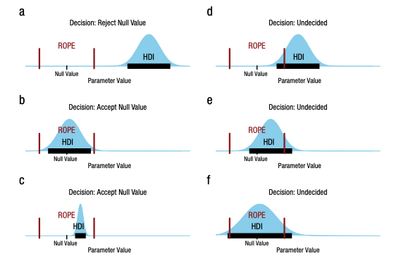

# Schätzen vs. Testen


## Lernsteuerung


### Position im Modulverlauf

@fig-modulverlauf gibt einen Überblick zum aktuellen Standort im Modulverlauf.


### Lernziele

<!-- TODO hier keine überschriftne der Ebene 3 -->

Nach Absolvieren des jeweiligen Kapitels sollen folgende Lernziele erreicht sein.

Sie können... 

- den Unterschied zwischen dem *Schätzen* von Modellparametern und dem *Testen* von Hypothesen erläutern
- Vor- und Nachteile des Schätzens und Testens diskutieren
- Das ROPE-Konzept erläutern und anwenden
- Die Güte von Regressionsmodellen einschätzen und berechnen


### Begleitliteratur

Der Stoff dieses Kapitels orientiert sich an [@kruschke2018].


### Vorbereitung im Eigenstudium

- [Statistik1, Kap. "Geradenmodelle 2"](https://statistik1.netlify.app/090-regression2)


### R-Pakete

In diesem Kapitel werden folgende R-Pakete benötigt:

```{r}
#| message: false
#| results: "hide"
#| warning: false
library(rstanarm)   # Bayes-Modelle
library(tidyverse)
library(easystats)
library(palmerpenguins)  # Datensatz "penguins"
```


```{r libs-hidden}
#| include: false
library(icons)
library(gt)
library(ggridges)
library(plotly)
library(patchwork)
library(plotly)
library(dagitty)

theme_set(theme_modern())
```


### Benötigte Daten: Pinguine


![Possierlich: Die Pinguine [@horst_statistics_2024]](img/penguins.png){#fig-penguins width="50%"}

:::{#exr-peng-start}
### Machen Sie sich mit den Pinguinen vertraut

Machen Sie sich zunächst mit dem Pinguin-Datensatz vertraut. 
Sie finden den Datensatz `penguins` im R-Paket `palmerpenguins`, 
das Sie auf gewohnte Art installieren können.
im Internet findet man den Datensatz auch als CSV-Datei; s. unten.
Importieren Sie den Datensatz und verschaffen Sie sich einen Überblick über 
die Verteilungen jeder Variablen des Datensatzes.
:::


Sie können den Datensatz `penguins` entweder via dem Pfad importieren:


```{r import-penguins}
#| results: "hide"
#| message: false
#| eval: false
penguins_url <- "https://vincentarelbundock.github.io/Rdatasets/csv/palmerpenguins/penguins.csv"

penguins <- read.csv(penguins_url)
```




Oder via dem zugehörigen R-Paket:

```{r}
data("penguins", package = "palmerpenguins")
```

Beide Möglichkeit des Datenimports sind okay. $\square$


### Einstieg

Betrachten Sie die zwei folgenden Aussagen, die jeweils ein Forschungsziel angeben:


1. "Lernen für die Klausur bringt etwas!"
2. "Wie viel bringt Lernen für die Klausur?"


:::{#exm-schaetzen-testen}
Diskutieren Sie die epistemologische Ausrichtung sowie mögliches Für und Wider der beiden Ausrichtungen! Einmal Behauptung, einmal Frage -- was macht das für einen Unterschied? $\square$
:::


## Was ist Testen? Was ist Schätzen?


Forschungsfragen kann man, allgemein gesprochen, auf zwei Arten beantworten:

1. *Hypothesen testen*: "Die Daten widerlegen die Hypothese (nicht)"
2. *Parameter schätzen*: "Der Effekt von X auf Y liegt zwischen A und B".

### Hypothesen testen

Hypothesen testende Analysen kommen zu einer Ja-Nein-Entscheidung bzgl. einer Hypothese. 
Genauer muss man sagen: Im besten Fall kommen sie zu einer Ja-Nein-Aussage.
Es kann natürlich sein, dass die Datenlage so nebelig oder das Problem so knifflig ist, 
dass man ehrlicherweise zugeben muss, 
dass man sich nicht sicher ist oder sogar komplett im Dunkeln tappt.

:::{#exm-lernen-hyp}
### "Lernen erhöht den Prüfungserfolg!"
Die Hypothese *Lernen erhöht den Prüfungserfolg* kann durch eine Studie und eine entsprechende Analyse grundsätzlich folgende drei Ergebnisse finden.
1) Die Daten widersprechen der Hypothese: 
Lernen bringt offenbar doch nichts für den Klausurerfolg. 
2) Die Daten unterstützen die Hypothese: Lernen erhöht den Prüfungserfolg.
3) Die Daten sind uneindeutig, es ist keine Aussage zum Einfluss von Lernen auf den Prüfungserfolg möglich. $\square$
:::

Das Testen einer Hypothese kann zu drei Arten von Ergebnissen führen. 
Die ersten beiden sind informationsreich, die dritte ist informationsarm.

1. 🟥 Die Daten *widersprechen* der Hypothese: Auf Basis der Daten (und des Modells) muss man die Hypothese ablehnen (verwerfen, sagt man), 
also als falsch (falsifziert) betrachten oder zumindest hat die Glaubwürdigkeit der Hypothese gelitten.

2. 🟢 Die Daten *unterstützen* die Hypothese: 
Auf Basis der Daten (und des Modells) muss man die Hypothese annehmen (oder kann die Gegenthese zumindest nicht verwerfen). 
Oder zumindest hat die Hypothese an Glaubwürdigkeit gewonnen.

3. ❓ Die Datenlage ist *unklar*; zum Teil unterstützen die Daten die Hypothese zum Teil widersprechen sie ihr. 
Man kann keine oder kaum Schlüsse aus den Daten ziehen. 
In diesem Fall gibt es keinen (nennenswerten) Erkenntnisgewinn.


Hypothesen prüfen ist *binär* in dem Sinne, dass sie zu "Schwarz-Weiß-Ergebnissen" führen (sofern die Datenlage stark genug ist).

:::{.callout-important}
Eine gängige Variante des Hypothesen testen^[vor allem in der Frequentistischen Statistik] 
ist das Testen der Hypothese "Es liegt kein (null) Effekt vor" (Null Effekt).
Man geht also davon aus, dass es keinen Zusammenhang zwischen UV und AV gibt und
spricht vom *Nullhypothesen testen*, $H_0$. $\square$
:::

:::{.exm-null}
### Beispiele für Nullhypothesen

- "Lernen bringt nichts"
- "Frauen und Männer parken gleich schnell ein"
- "Es gibt keinen Zusammenhang von Babies und Störchen"
- "Früher war es auch nicht besser (sondern gleich gut)"
- "Bei Frauen ist der Anteil, derer, die Statistik mögen gleich hoch wie bei Männern" (Null Unterschied zwischen den Geschlechtern) $\square$
:::


*Vorteil* des Hypothesen testen ist das klare, einfache Ergebnis --
die Hypothese ist abgelehnt, angenommen, oder die Datenlage ist unklar.
Das unterstützt die Entscheidungsfindung, da es die Komplexität reduziert.


:::callout-note
### Man kann Hypothesen nicht bestätigen
Karl Poppers These, dass man Hypothesen nicht bestätigen (verifizieren) kann,
hatte großen Einfluss auf die Wissenschaftstheorie (und Epistemologie allgemein) ausgeübt [@popper2013].
Schlagend ist das Beispiel zur Hypothese $H$ "Alle Schwäne sind weiß". 
Auch eine große Stichprobe an weißen Schwänen kann die Wahrheit der Hypothese nicht beweisen. 
Schließlich ist es möglich, 
dass wir den schwarzen Schwan einfach noch nicht gefunden haben.
^[Tatsächlich gibt es schwarze Schwäne, aber nicht in Europa: https://en.wikipedia.org/wiki/Black_swan]
Umgekehrt reicht die (zuverlässige) Beobachtung eines einzelnen schwarzen Schwans, 
um die Hypothese $H$ zu widerlegen (falsifizieren). $\square$
:::


:::{.callout-note}
### Wirklich nicht?
In der Wissenschaftspraxis werden die meisten Hypothesen probabilistisch untersucht. 
Komplett sichere Belege, wie in Poppers Beispiel mit dem schwarzen Schwan, gibt es nicht.
Das bedeutet, dass Evidenz im bestätigenden wie im widerlegenden Sinne 
tendenziell (d.h.probabilistisch) zu betrachten ist.
Auf dieser Basis und der Basis zuverlässiger, 
repräsentativer Daten erscheint plausibel, dass Hypothesen sowohl bestätigt als 
auch widerlegt werden können [@kruschke2018; @morey2011]. $\square$
:::

### Parameter schätzen

Beim Schätzen von Parametern untersucht man, *wie groß* ein Effekt ist, 
etwa der Zusammenhang zwischen X und Y.
Es geht also um eine Skalierung, um ein *wieviel* und nicht um ein "ja/nein", 
was beim Hypothesen testen der Fall ist.

Beim Parameter schätzen gibt es zwei Varianten:

a) ⚫️ *Punktschätzung*: Das Schätzen eines einzelnen Parameterwerts, sozusagen ein "Best Guess"

b) 📏 *Bereichsschätzung*: Das Schätzen eines Bereichs plausibler oder wahrscheinlicher Parameterwerte

Allerdings kann man das Parameter schätzen auch wie einen Hypothesentest nutzen:
Ist ein bestimmter Wert, etwa die Null, nicht im Schätzbereich enthalten, 
so kann man die Hypothese verwerfen, dass der Parameter gleich diesem Wert (etwa Null) ist.
Das Hypothesen testen ist daher (implizit) im Parameter schätzen enthalten.


:::{#exm-pinguins}

Wie groß ist der Schätzbereich für den Effekt des Parameter "Geschlecht" auf das mittlere Gewicht von Pinguinen? 
Hat die UV *Geschlecht* einen großen Einfluss auf das mittlere Gewicht dieser Tiere?
Anders gefragt: Um welchen Wert sind männliche Tiere im Schnitt schwerer als weibliche Tiere?
@tbl-m-penguins-sex-params gibt uns die Antwort

```{r}
#| results: hide
data(penguins, package = "palmerpenguins")
penguins_nona <-
  penguins |> drop_na(sex, body_mass_g)  # keine fehlenden Werte

m_penguins_sex <- 
  stan_glm(body_mass_g ~ sex, data = penguins_nona)
```

```{r}
#| echo: false
#| label: tbl-m-penguins-sex-params
#| tbl-cap: "Parameterschätzung des Modells m_penguins; der Gewichtssnterschied zwischen den Mittelwerten der Geschlechter beträgt etwa 700 g."
parameters(m_penguins_sex) |> print_md()
```

Grob gesagt sind männliche Tiere ca. 500 g bis 800 g schwerer 
als weibliche Tiere im Schnitt (95%-ETI), 
laut unserem Modell; der Punktschätzer liegt bei einem Gewichtsunterschied von ca. `r round(as.numeric(coef(m_penguins_sex)[2]))` g. $\square$
:::

:::{#exm-param-hyptest}
### Parameterschätzen als Nullhypothesentest

>   Forschungsfrage: Sind männliche Pinguine im Schnitt schwerer als weibliche Tiere?

@eq-muf-mum formalisiert diese Forschungsfrage als statistische Hypothese $H$.

$$H: \mu_M \ge \mu_F \rightarrow d = \mu_M - \mu_F \ge 0$${#eq-muf-mum}


:::{#thm-muf-mum}
### Nullhypothesentest

$$H: \mu_M \ge \mu_F \leftrightarrow d = \mu_M - \mu_F \ge 0\quad \square$$
:::

Der Unterschied zwischen den Mittelwerten, $d$, 
ist genau dann Null, wenn $\beta_1 = 0$ in unserem Regressionsmodell `m1`.
Entsprechend gilt $d \ne 0$ wenn $\beta_1 \ne 0$.


Um die Forschungsfrage zu beantworten zählen wir wie gewohnt den Anteil der Stichproben 
in der Post-Verteilung für die UV `sexmale`, die einen Wert größer Null aufweisen:

```{r}
m_penguins_sex_post <-
  m_penguins_sex |> 
  as_tibble()

m_penguins_sex_post |> 
  count(sexmale > 0)
```
100% (4000 von 4000) Stichproben finden einen Wert größer Null für `sexmale`, 
dass also weibliche Tiere leichter bzw. männliche Tiere schwerer sind (im Durchschnitt).
Entsprechend finden 0% der Stichproben einen Wert, der für das Gegenteil spricht 
(das weibliche Tiere schwerer wären).
Damit resümieren wir, dass unser Modell 100% Wahrscheinlichkeit für die Hypothese einräumt: $p_H = 1$.
Achtung: Die 100%-ige Sicherheit für die Hypothese stammt aus der kleinen Welt,
nicht unbedingt aus der großen welt. 

Einfach noch zeigt uns `parameters(m_penguins_sex)`, wie groß die Wahrscheinlichkeit für $\beta_1 > 0$ ist,
nämlich anhand des Koeffizienten `pd`, s. tbl-m-penguins-sex-params.

Aber das Auslesen der Post-Verteilung erlaubt uns auch, andere Hypothesen zu prüfen,
etwa die Wahrscheinlichkeit der Hypothese, dass der Gewichtsunterschied zwischen 
den Geschlechtern mehr als 500 g beträgt.


$\square$
:::


*Vorteil* der Parameterschätzung (gegenüber dem Testen von Hypothesen) ist die Nuanciertheit des Ergebnisses, 
die der Komplexität echter Systeme besser Rechnung trägt.


:::{#exr-peer-Interpretation-Hyp-testen}
### Interpretation beim Hypothesen testen

Ein Forschungsteam untersucht die Hypothese,
dass hohe Bildschirmzeit mit verringerter Intelligenz bei Kindern einhergeht.
Dazu vergleichen Sie Kinder, die sehr viel Zeit am Tag am Bildschirm verbringen,
mit Kindern, die sehr wenig Zeit am Tag am Bildschirm verbringen (und die im übrigen vergleichbar sind).
Sie finden in ihrer Studie einen Effekt von $95\% KI[-4;-2]$ IQ-Punkten,
zuungunsten der Kinder mit hoher Bildschirmzeit.

Welche Aussage dazu ist korrekt bzw. passt am besten?

A) Die $H_0$ ist als sicher falsch zu verwerfen.
B) Die $H_0$ ist als sicher richtig anzunehmen.
C) Die $H_0$ ist mit 95% Wahrscheinlichkeit richtig.
D) Die $H_0$ ist mit 95% Wahrscheinlichkeit falsch.
E) Die Datenlage ist unklar, es ist keine Entscheidung möglich. $\square$
:::


## ROPE: Bereich von "praktisch Null"  {#sec-rope}


📺 [Teil 2](https://youtu.be/k-CB0VGRENY)


Nullhypothesen sind fast immer falsch, s. @fig-nullmeme.


```{r meme-null}
#| echo: false
#| label: fig-nullmeme
#| fig-cap: "Du testest EXAKTE Nullhypothesen?"

```

[Quelle: Imgflip Meme Generator](https://imgflip.com/i/5v5531)


>   We do not generally use null hypothesis significance testing in our own work. In the fields in which we work, we do not generally think null hyptheses can be true: in social science and public health, just about every treatment one might consider will have *some* effect, and no comparison or regression coefficient of interest will be exactly zero. We do not find it particularly helpful to formulate and test null hypothess that we knowe ahead of time cannot be true. [@gelman2021]


### Alternativen zu Nullhypothesen


Nullhypothesen, $H_0$, sind z.B.: $\rho=0$, $\rho_1 = \rho_2$, $\mu_1 = \mu_2$, $\mu=0$, $\beta_1=0$.
Nullhypothesen zu testen, ist sehr verbreitet.
Ein Grund ist, dass in der Frequentistischen Statistik keine andere Art von Hypothesentest (einfach) möglich ist.^[Mittlerweile gibt es neue Frequentistische Ansätze für ein Verfahren ähnlich dem ROPE-Ansatz, der weiter unten vorgestellt wird.]
Ein anderer Grund ist vermutlich, ... wir haben es schon immer so gemacht. 🤷‍♀️
Alternativen zum Testen von Nullhypothesen sind: 
  
- Posteriori-Intervalle (ETI oder HDI) berichten
- *Rope*-Konzept [@kruschke2018]
- Wahrscheinlichkeit von inhaltlich bedeutsamen Hypothesen quantifizieren (z.B. dass $\beta_1 > 0.42$)
- Wahrscheinlichkeit quantifizieren, dass der Effekt ein positives bzw. ein negatives Vorzeichen hat (*probability of direction, pd*)


### "Praktisch kein Unterschied": Das Rope-Konzept


📺 [ROPE-Video](https://www.youtube.com/watch?v=VweMjEBeQFg)


:::{#exm-rope}
### Beispiele für ROPE

- Sagen wir, wenn sich zwei Preismittelwerte um höchstens $d=100$€ unterscheiden, gilt dieser Unterschied für einen Marketingmanager als "praktisch gleich", "praktisch kein Unterschied",
"nicht substanziell", "unbedeutend" bzw. "vernachlässigbar gering"

- Bei Pinguinarten definiert eine Biologin nach umfangreichem Studium der Literatur, dass ein Unterschied von max. 100 g Körpergewicht "vernachlässigbar wenig" ist.

- Eine findige Geschäftsfrau entscheidet für ihre Firma, dass ein Umsatzunterschied von 100k Euro "praktisch irrelevant" sei. $\square$
:::


:::{#def-rope}
### ROPE

ROPE (Region of Practical Equivalence) ist ein Bereich um den Nullwert, 
der als praktisch äquivalent zu Null angesehen wird. $\square$.
:::


Wie legt man den Grenzwert $d$ fest,
bis zu dem ein Unterschied (*D*ifferenz) gerade noch bzw. gerade nicht mehr
unbedeutend ist?
Die Wahl von $d$ ist *subjektiv* in dem Sinne als sie von inhaltlichen Überlegungen geleitet sein sollte.
Diesen Bereich bezeichnen wir den *Indifferenzbereich* (Äquivalenzzone, Bereich eines vernachlässigbaren Unterschieds oder *Region of practical equivalence*, Rope). 


Jetzt prüfen wir, ob ein "Großteil" der Posteriori-Stichproben im Rope liegt.
Unter "Großteil" wird häufig das *95%-HDI* verstanden (das ist auch der Standard der R-Funktion `rope()`, die wir hier nutzen).


*Entscheidungsregel* nach @kruschke2018:
  
- Großteil der Post-Verteilung liegt *innerhalb* von Rope $\rightarrow$ *Annahme* der ROPE-Nullhypothese "praktisch kein Effekt", $H_0$
- Großteil der Post-Verteilung liegt *außerhalb* von Rope $\rightarrow$ *Ablehnung* der ROPE-Nullhypothese "praktisch kein Effekt", $H_0$
- Ansonsten $\rightarrow$ keine Entscheidung -- die Datenlage ist uneindeutig


  


Mit "Großteil" meinen wir (per Default) das 95%-KI (der Posteriori-Verteilung).

### Vernachlässigbarer Regressionseffekt

@kruschke2018 schlägt vor, einen Regressionskoeffizienten unter folgenden Umständen als "praktisch Null" zu bezeichnen:


Wenn eine Veränderung über "praktisch den ganzen Wertebereich" von $X$ (UV) 
nur einen vernachlässigbaren Effekt auf $Y$ (AV) hat.
Ein vernachlässigbarer Effekt ist dabei $\hat{y}= \pm 0.1 sd_y$.
<!-- Der "praktisch ganze Wertebereich" von $x$ sei $\bar{x} \pm 2 sd_x$. -->
<!-- Resultiert der Vergleich UV von $\bar{x} -2 sd$ mit $\bar{x}+2sd$ nur in einer Veränderung von $\hat{y}$ (der AV) von $\bar{y} - 0.1sd_y$ auf $\bar{y} + 0.1 sd_y$, so ist der Regressionskoeffizient praktisch Null, der Effekt also vernachlässigbar. -->
Das impliziert Rope-Grenzen von $\beta_x = \pm 0.1$ für z-standardisierte UV und AV.
Einfach gesprochen: Eine vernünftige Voreinstellung für die Rope-Grenzen 
bei Regressionskoeffizienten sind $\pm 10 \%$ der SD der AV. 

:::{.callout-note}
### ROPE-Defaults
Im der Voreinstellung umfasst die Größe des ROPE ±10% der SD der AV. $\square$
:::


### HDI-Rope-Entscheidungsregel visualisiert

```{r out.width="100%"}
#| echo: false
#| fig-align: "center"
#| fig-cap: "Die Entscheidungsregeln zum ROPE illustiert [@kruschke2018]; A: Verwerfen der ROPE-Hypothese; B und C: Akzeptieren; D-F: Unklare Datenlage, keine Entscheidung zur ROPE-Hypothese"
#| label: fig-kruschke-rope

```

@fig-kruschke-rope illustriert die Entscheidungsregel zum ROPE 
für die drei Situationen *Verwerfen* der ROPE-Hypothese, *Beibehalten* und 
*unklare Datenlage* [@kruschke2018, Abbildung 1, S. 272],


### Rope berechnen

Hier ist das Modell, das Gewicht als Funktion der Pinguinart erklärt (`m_penguins_species`).

```{r}
m_penguins_species <- stan_glm(body_mass_g ~ species, 
                  data = penguins, 
                  refresh = 0,  # unterdrückt Ausgabe der Posteriori-Stichproben
                  seed = 42  # zur Reproduzierbarkeit
                  )
```

Den Rope berechnet man mit `rope(model)`, s. @tbl-peng-species-rope.

```{r}
#| echo: false
#| label: tbl-peng-species-rope
#| tbl-cap: "Der Rope-Bereich für die Stufen der UV (Arten von Pinguinen)"
rope(m_penguins_species)
```

Die Faktorstufe `Chinstrap` der UV `species` hat 
doch einen beträchtlichen Teil ihrer Wahrscheinlichkeitsmasse der Posteriori-Verteilung im ROPE. 
Wir können daher für diese Gruppe  das ROPE *nicht* verwerfen. 
Die Datenlage ist *unklar*. 
Es ist keine abschließende Entscheidung über die Hypothese möglich.

Aber: `Gentoo` liegt zu 0% im Rope. 
Für die Gruppe *Gentoo* können wir die ROPE-Hypothese *verwerfen*.
Der Effekt von *Gentoo* ist größer als vernachlässigbar.
Anders gesagt: Tiere der Art *Gentoo* sind im Schnitt substanziell schwerer 
als Tiere der Referenzgruppe (*Adelie*).
Der ROPE-Grenzwert wurde hier per Voreinstellung auf 80 g Unterschied festgelegt (10% der SD der AV).


:::callout-note
Die angegebenen Prozentwerte beziehen sich nicht auf die 100% der Post-Verteilung,
sondern (in der Voreinstellung) auf das 95%-ETI. Dabei werden 10% der Streuung 
der AV als Intervallgrenzen des ROPE angenommen,
s. `help(rope)`.
:::
  

Das hört sich abstrakt an? Dann lassen Sie uns das lieber visualisieren. 🎨


### Visualisierung unserer Rope-Werte, m_penguins_species
  
Ein Großteil der Posteriori-Masse von `m_penguins_species` liegt  *nicht* innerhalb des Rope. 
Aber können wir umgekehrt sagen, dass ein Großteil außerhalb liegt? Das erkennt man optisch ganz gut, s. @fig-rope-penguins.


```{r}
#| label: fig-rope-penguins
#| layout-ncol: 2
#| echo: false
#| fig-cap: "Rope und HDI überlappen bei Chinstrap, aber nicht bei Gentoo. Im ersten Fall nehmen wir die Rope-Null-Hypothese an, im zweiten Fall verwerfen wir sie."
#| fig-subcap: 
#|   - "Diagramm mit `rope(m_penguins_species) %>% plot()`"
#|   - "Diagramm mit `parameters(m_penguins_species) %>% plot()`"
plot(rope(m_penguins_species)) + scale_fill_okabeito()

parameters(m_penguins_species) %>% 
  plot() +
  geom_rect(aes(xmin = 0-80, xmax = 0+80, ymin = -Inf, ymax = Inf), 
              fill = "blue", alpha = 0.2, color = NA)
```


Das ROPE druchkreuzt die "Berge" der Posteriori-Verteilung für *Chinstrap* deutlich.
Aber: Das 95%-HDI liegt nicht komplett innerhalb des Rope.
Wir können das Nullhypothese für Chinstrap *nicht verwerfen*, aber auch *nicht bestätigen* --
eine unklare Datenlage.

*Gentoo* hingegen wird vom vom Rope nicht durchkreuzt, 
es ist weit entfernt vom "blauen vertikalen Band" des Rope: 
Gentoo liegt außerhalb des Rope. 
Es gibt einen "substanziellen" Unterschied
zwischen dem Mittelwert der AV in Gruppe Gentoo und in der Referenzgruppe Adelie.

Wir verwerfen die ROPE-Hypothese, die "Praktisch-Null-Hypothese", in diesem Fall.


### Finetuning des Rope

Wir können festlegen, was wir unter "praktischer Äquivalenz" verstehen,
also die Grenzen des Ropes verändern.
Sagen wir, 200 Gramm sind unsere Grenze für einen vernachlässigbaren Effekt, s. @fig-rope-range.


```{r echo = TRUE, results="hide"}
#| label: fig-rope-range
#| fig-cap: "ROPE mit selber eingestellter Grenze von ±200 (Gramm)"
plot(rope(m_penguins_species, range = c(-200, 200))) + 
  scale_fill_okabeito()  # schönes Farbschmea
```


In der Voreinstellung werden 95%-ETI berichtet, das kann man wie folgt ändern,
wenn man möchte. Die ROPE-Grenzen sind in @ tbl-rope-species-rope-fine zu sehen.
  
```{r echo=TRUE}
#| label: tbl-rope-species-rope-fine
#| tbl-cap: "ROPE-Grenzen für das Modell `m_penguins_specie`s mit ROPE-Grenzen von 500 g."
rope(m_penguins_species, range = c(-500,500), ci = .89, ci_method = "HDI")
```


Jetzt wird berichtet, welcher Teil eines 89%-CI^[89 ist die nächst kleinste Primzahl unter 95; 
und 95 wird gemeinhin als Grenzwert für Schätzbereiche verwendet. 
Damit ist 95 hier eine "magic number", ein Defacto-Standard ohne hinreichende Begründung. 
Um darauf hinzuweisen, benutzen einige Forscherinnen und Forscher mit
ähem subtilen Humor lieber die 89 als die 95. 🤷‍♂️ ] sich im Rope befindet.


:::{#exr-peer-rope}
### Peer-Instruction: Interpretation des ROPE-Anteils
In einer Hochschule wird der Effekt eines "Robo-Professors" auf die Lernleistung der Studierenden untersucht,
im Fach Statistik.
Der "Robo-Professor" ist ein Computerprogramm auf Basis künstlicher Intelligenz, 
das den Studierenden den Stoff vermittelt.
Dazu wird eine Gruppe von Studierenden von einem menschlichen Dozenten unterrichtet,
die andere Gruppe von einem "Robo-Professor".
Nach dem Kurs wird die Lernleistung der Studierenden in einer Prüfung gemessen.
Das Regressionsmodell `m_robo` liefert einen Rope-Anteil von 10% für den Koeffizienten `robo_professor`.
Welche Aussage dazu ist korrekt?

A) Der Robo-Professor hat einen Einfluss von 10% auf die Lernleistung der Studierenden.
B) Der Einfluss des Robo-Professors auf die Lernleistung der Studierenden ist substanziell.
C) Es gib keinen Einfluss des Robo-Professors auf die Lernleistung der Studierenden.
D) Es ist nicht auszuschließen, dass der Robo-Professor keinen substanziellen Einfluss auf die Lernleistung der Studierenden hat.
E)  Der Einfluss des Robo-Professors auf die Lernleistung der Studierenden ist vernachlässigbar. $\square$
:::


### Beantwortung der Forschungsfrage


Für die Spezeis *Gentoo* wurde ein substanzieller Gewichtsunterschied zur Referenzgruppe, *Adelie*, 
vom Modell entdeckt. Für *Chinstrap* hingegen  ist keine klare inferenzstatistische 
Aussage hinsichtlich eines Indifferenzbereichs möglich: Es ist plausibel, 
laut dem Modell, dass es einen praktisch bedeutsamen Unterschied gibt, 
aber es ist auch plausibel, dass es keinen praktisch bedeutsamen Unterschied gibt.


## Modellgüte 


### Wozu Modellgüte?

Hat man ein Modell aufgestellt und geprüft und Ergebnisse erhalten, 
möchte man wissen, wie belastbar diese Ergebnisse sind.
Eine Abschätzung zur Belastbarkeit des Modellergebnisse liefern Kennwerte der Modellgüte. 
Diese Kennwerte zielen z.B. darauf ab, wie *präzise* die Aussagen des Modells sind. 
Je präziser die Aussagen eines Modells, desto nützlicher ist es natürlich.
Bei einer Parameterschätzung erhält man  auch Informationen zur Präzision der Schätzung:
Ist der Schätzbereich schmal, so ist die Schätzung präzise (und vice versa).
Allerdings könnte ein Modell aus mehreren Parameterschätzungen bestehen, die unterschiedlich präzise sind. 
Da kann es helfen, eine zusammenfassen Beurteilung zur Präzision, oder allgemeiner zur Güte des Modells, zu erhalten.
Im Folgenden ist eine Kennzahl von mehreren gebräuchlichen und sinnvollen vorgestellt, $R^2$.


### Modellgüte mit $R^2$ bestimmen


$R^2$ gibt den Anteil der Gesamtvarianz (der AV) an, den das Modell erklärt.
- Höhere Wert von $R^2$ bedeuten, dass das Modell die Daten besser erklärt.
$R^2$ wird normalerweise auf Basis eines Punktschätzers definiert.
Solch eine Definition lässt aber viel Information - über die Ungewissheit der Schätzung - außen vor.
Daher ist es wünschenswert, diese Information in $R^2$ einfließen zu lassen: *Bayes-R-Quadrat*.


Die Post-Verteilung von $R^2$ kann man sich wie folgt ausgeben lassen, s. @fig-m106-r2.

```{r}
#| fig.cap: "Die Verteilung von R-Quadrat im Modell m_penguins_species"
#| label: fig-m106-r2
m_penguins_species_r2 <-
  m_penguins_species %>% 
  r2_posterior() %>% 
  as_tibble()

hdi(m_penguins_species_r2) %>%  # Intervallgrenzen der Post-Verteilung von R2
  plot()  # visualisieren
```

`


$R^2$ und $\sigma$ sind negativ assoziiert: 
In einem Datensatz mit mit hohem $R^2$ ist $\sigma$ gering und umgekehrt.
Beide Koeffizienten berechnen sich auf Basis von $\sigma$ und haben den gleichen Zweck:
die Abschätzung der Güte eines Modells.
Im Unterschied zum Frequentistischen R-Quadrat erhält man in der Bayes-Statistik
nicht nur einen Punktschätzer für $R^ 2$, sondern wie auch sonst eine Post-Verteilung,
so dass man z.B. einen Schätzbereich angeben kann.

Schneller bekommt man den Punkt- und den Intervallschätzer für $R^2$ mit `r2(m_penguins_species)`.

```{r}
#| echo: false
r2(m_penguins_species)
```


## Fazit

Obwohl das Testen von Hypothesen im Moment verbreiteter ist, spricht einiges zugunsten der Vorzüge der Parameterschätzung. 
Möchte man aber, um sich bestimmter bestehender Forschung anzunähern, 
einen Hypothesentest, speziell den Test einer Nullhypothese verwenden, so bietet sich das ROPE-Verfahren an.


:::{#exr-fragjetzt-schaetzen}
### Zeit für einen Rückblick: Welche Fragen haben Sie im Moment?
Mittlerweile haben wir einen Großteil des Stoffs absolviert.
Welche Punkte sind Ihnen offen geblieben? Wo haben Sie noch Fragen?

Die Lehrkraft stellt Ihnen eine (anonyme) Plattform für Ihre Fragen bereit,
so dass Sie in Ruhe Ihre offenen Fragen und diejenigen Ihrer Kommilitonninen und Kommilitonen 
überdenken können. $\square$
:::


## Aufgaben


1. [Wskt-Schluckspecht](https://datenwerk.netlify.app/posts/wskt-schluckspecht/wskt-schluckspecht)
2. [wskt-mtcars-1l](https://datenwerk.netlify.app/posts/wskt-mtcars-1l/wskt-mtcars-1l.html)
2. [rope-regr](https://datenwerk.netlify.app/posts/rope-regr/rope-regr.html)
3. [rope1](https://datenwerk.netlify.app/posts/rope1/rope1.html)
3. [rope2](https://datenwerk.netlify.app/posts/rope2/rope2.html)
3. [rope3](https://datenwerk.netlify.app/posts/rope3/rope3.html)


### Quiz-Aufgaben

Hier finden Sie Single-Choice-Aufgaben zu diesem Kapitel.
Wählen Sie eine Antwort aus und klicken Sie auf das Häkchen, um sie zu überprüfen;
über das Fragezeichen erhalten Sie die ausführliche Lösung.

```{r quiz-schaetzen-testen-setup}
#| include: false
library(exams2forms)

quiz_schaetzen_testen_files <- list(
  "exr/pruefen-vs-schaetzen-unterschied-schoice/pruefen-vs-schaetzen-unterschied-schoice.Rmd",
  "exr/popper-falsifikation-schoice/popper-falsifikation-schoice.Rmd",
  "exr/rope-entscheidungsregel-schoice/rope-entscheidungsregel-schoice.Rmd",
  "exr/rope-default-grenze-rechnung-schoice/rope-default-grenze-rechnung-schoice.Rmd",
  "exr/rope-chinstrap-gentoo-interpretation-schoice/rope-chinstrap-gentoo-interpretation-schoice.Rmd",
  "exr/robo-professor-rope-schoice/robo-professor-rope-schoice.Rmd",
  "exr/bayes-r2-vs-frequentistisch-schoice/bayes-r2-vs-frequentistisch-schoice.Rmd",
  "exr/vorteil-parameterschaetzung-schoice/vorteil-parameterschaetzung-schoice.Rmd",
  "exr/pd-anteil-post-stichproben-schoice/pd-anteil-post-stichproben-schoice.Rmd",
  "exr/nullhypothesen-kritik-schoice/nullhypothesen-kritik-schoice.Rmd"
)
```

```{r quiz-schaetzen-testen}
#| echo: false
#| message: false
#| results: asis
exams2forms(quiz_schaetzen_testen_files, n = 1)
```


