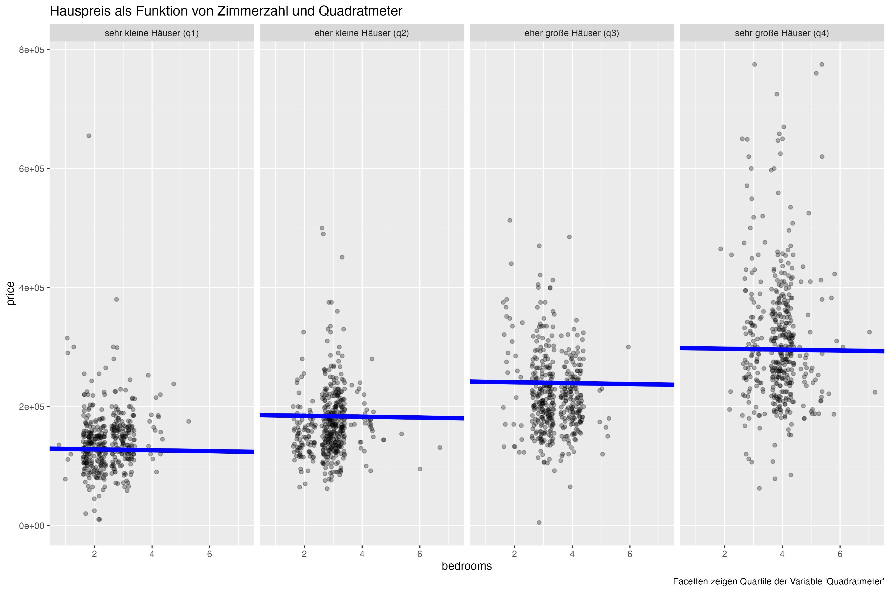
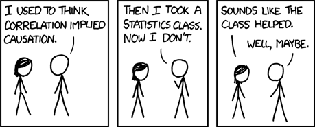
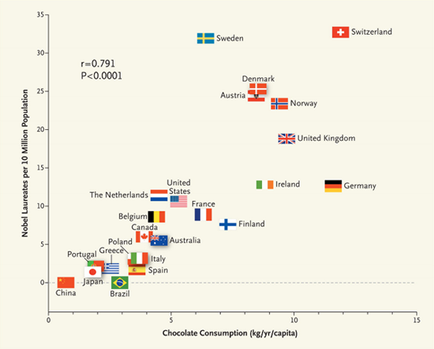

# Konfundierung {#sec-kausal}


## Lernsteuerung

### Position im Modulverlauf

@fig-modulverlauf gibt einen Überblick zum aktuellen Standort im Modulverlauf.


### R-Pakete

\newcommand{\indep}{\perp \!\!\! \perp}


Für dieses Kapitel benötigen Sie folgende R-Pakete:

```{r libs}
#| warning: false
library(dagitty)  # DAGs zeichnen
library(tidyverse)
library(rstanarm)
library(easystats)
```


```{r libs-hidden}
#| echo: false
library(gt)
#library(DT)
library(ggdag)

theme_set(theme_modern())
```

### Daten  {#sec-kausal-daten}


Wir nutzen den Datensatz [Saratoga County](https://vincentarelbundock.github.io/Rdatasets/csv/mosaicData/SaratogaHouses.csv); s. @tbl-saratoga.
Hier gibt es eine 
[Beschreibung des Datensatzes](https://vincentarelbundock.github.io/Rdatasets/doc/mosaicData/SaratogaHouses.html).



Sie können ihn entweder über die Webseite herunterladen:

```{r data-saratoga, echo = TRUE}
#| eval: false
SaratogaHouses_path <- "https://vincentarelbundock.github.io/Rdatasets/csv/mosaicData/SaratogaHouses.csv"

d <- read.csv(SaratogaHouses_path)
```

Oder aber über das Paket `mosaic` importieren:

```{r}
data("SaratogaHouses", package = "mosaicData")
d <- SaratogaHouses  # kürzerer Name, das ist leichter zu tippen
```


### Lernziele


Nach Absolvieren des jeweiligen Kapitels sollen folgende Lernziele erreicht sein.

Sie können ... 

- erklären, was eine Konfundierung ist
- DAGs lesen und zeichen
- Konfundierung in einem DAG erkennen

### Begleitliteratur

Dieses Kapitel vermittelt die Grundlagen der Kausalinferenz mittels graphischer Modelle. Ähnliche Darstellungen wie in diesem Kapitel finden sich bei @rohrer2018.


### Überblick

In diesem Kapitel steigen wir ein in das Themengebiet *Kausalanalyse* (oder synonym Kausalinferenz).
Wir beschäftigen uns also mit der für die Wissenschaft (und den Rest des Universums) zentralen Frage, was die Ursache eines Phänomens ist.
In diesem ersten Kapitel zu dem Thema geht es um einen häufigen Fall von "Scheinkorrelation", also eines Zusammenhangs zwischen UV und AV, der aber gar kein echter kausaler ist, sondern nur Schein. 
Bei diesem Scheinzusammenhang handelt es sich um die Konfundierung.
Im nächsten Kapitel schauen wir uns die verbleibenden Grundbausteine der Kausalinferenz an.


### Einstieg

:::{.exm-storks}
### Von Störchen und Babies
Kennen Sie die Geschichte von Störchen und Babies? Ich meine nicht die aus dem Biologieunterricht in der fünften Klasse, sondern in einem statistischen Zusammenhang.
Was war da noch mal die Moral von der Geschichte?^[Nur weil die Variablen `Anzahl_Stoerche` und `Anzahl_Babies` korreliert sind, heißt das nicht, dass das eine die Ursache des anderen sein muss.] $\square$
:::

:::{.exm-regr-nicht-kausal}
### Erlaubt eine Regressionsanalyse Kausalschlüsse?
Findet man in einer Regressionsanalyse einen "Effekt", also ein Regressionsgewicht ungleich Null, heißt das dann, dass die UV die Ursache der AV ist?^[Nein]
Erklären Sie diesen Sachverhalt genauer. $\square$
:::


## Statistik, was soll ich tun?


### Studie A: Östrogen

#### Medikament einnehmen?

Mit Blick auf @tbl-studie-a: Was raten Sie dem Arzt? Medikament einnehmen, ja oder nein?

</br>

```{r tbl-studie-a}
#| echo: false
#| label: tbl-studie-a
#| tbl-cap: "Daten zur Studie A"

studie_a <-
  tibble::tribble(
     ~ Gruppe,      ~`Mit Medikament`,         ~`Ohne Medikament`,
"Männer",    "81/87 überlebt (93%)", "234/270 überlebt (87%)",
"Frauen",  "192/263 überlebt (73%)",   "55/80 überlebt (69%)",
"Gesamt",  "273/350 überlebt (78%)", "289/350 überlebt (83%)"
  ) 

studie_a %>% 
  gt()
```

</br>


Die Daten stammen aus einer (fiktiven) klinischen Studie, $n=700$, hoher Qualität (Beobachtungsstudie).
Bei Männern scheint das Medikament zu helfen; 
bei Frauen auch.
Aber *insgesamt* (Summe von Frauen und Männern) *nicht*?!
Was sollen wir den Arzt raten? Soll er das Medikament verschreiben? 
Vielleicht nur dann, wenn er das Geschlecht kennt [@pearl2016]?


#### Kausalmodell zur Studie A


In Wahrheit sieht die kausale Struktur so aus:
Das Geschlecht (Östrogen) hat einen Einfluss (+) auf Einnahme des Medikaments und auf Heilung (-).
Das Medikament hat einen Einfluss (+) auf Heilung.
Betrachtet man die Gesamt-Daten zur Heilung, so ist der Effekt von Geschlecht (Östrogen) und Medikament *vermengt* (konfundiert, confounded).
Die kausale Struktur, also welche Variable beeinflusst bzw. nicht,
ist in @fig-dag-studie-a dargestellt.


```{r dag-studie-a}
#| echo: false
#| label: fig-dag-studie-a
#| fig-cap: "Zwei direkte Effekte (gender, drug) und ein indirekter Effekt (gender über drug) auf recovery"
#| out-width: "50%"


dag_studie_a <-
  dagitty("dag{
          gender -> drug
          drug -> recovery
          gender -> recovery
          }
      ")

coordinates(dag_studie_a) <-
  list(x = c(gender = 0, drug = 0, recovery  = 1),
       y = c(gender = 0, drug = 1, recovery = 0.5))


plot(dag_studie_a)
```


Betrachtung der Gesamtdaten zeigt in diesem Fall einen *konfundierten* Effekt: Geschlecht konfundiert den Zusammenhang von Medikament und Heilung.


:::callout-important
Betrachtung der Teildaten (d.h. stratifiziert pro Gruppe) zeigt in diesem Fall den wahren, kausalen Effekt. 
Stratifizieren ist also in diesem Fall der korrekte, richtige Weg.
Achtung: Das Stratifizieren ist nicht immer und nicht automatisch die richtige Lösung.
Stratifizieren bedeutet,
den Gesamtdatensatz in Gruppen oder "Schichten" ("Strata").
:::


### Studie B: Blutdruck


#### Medikament einnehmen?

Mit Blick auf @tbl-studie-b: Was raten Sie dem Arzt? Medikament einnehmen, ja oder nein?


```{r dag-studie-b-table}
#| echo: false
#| message: false
#| label: tbl-studie-b
#| tbl-cap: "Daten zur Wirksamkeit eines Medikaments (Studie B)"
studie_b <- 
  tibble::tribble(
~ Gruppe,          ~`Ohne Medikament`,          ~`Mit Medikament`,
"geringer Blutdruck",    "81/87 überlebt (93%)", "234/270 überlebt (87%)",
"hoher Blutdruck",  "192/263 überlebt (73%)",   "55/80 überlebt (69%)",
"Gesamt",  "273/350 überlebt (78%)", "289/350 überlebt (83%)"
  )

studie_b %>% 
  gt()
```


Die Daten stammen aus einer (fiktiven) klinischen Studie, $n=700$, hoher Qualität (Beobachtungsstudie).
Bei geringem Blutdruck scheint das Medikament zu schaden.
Bei hohem Blutdruck scheint das Medikament auch zu schaden.
Aber *insgesamt* (Summe über beide Gruppen) *nicht*, da scheint es zu nutzen?!
Was sollen wir den Arzt raten? Soll er das Medikament verschreiben? Vielleicht nur dann, 
wenn er den Blutdruck nicht kennt [@pearl2016]?


#### Kausalmodell zur Studie B


Das Medikament hat einen (absenkenden) Einfluss auf den Blutdruck.
Gleichzeitig hat das Medikament einen (toxischen) Effekt auf die Heilung.
Verringerter Blutdruck hat einen positiven Einfluss auf die Heilung.
Sucht man innerhalb der Leute mit gesenktem Blutdruck nach Effekten, findet man nur den toxischen Effekt: Gegeben diesen Blutdruck ist das Medikament schädlich aufgrund des toxischen Effekts. Der positive Effekt der Blutdruck-Senkung ist auf diese Art nicht zu sehen.

Das Kausalmodell von Studie B ist in @fig-dag-studie-b dargestellt.


```{r dag-studie-b}
#| echo: false
#| label: fig-dag-studie-b
#| fig-cap: "Drug hat keinen direkten, aber zwei indirekte Effekt auf recovery, einer davon ist heilsam, einer schädlich"
#| out-width: "50%"
dag_studie_b <-
  dagitty("dag{
          drug -> pressure
          drug -> toxic
          pressure -> recovery
          toxic -> recovery
          }
      ")


coordinates(dag_studie_b) <-
  list(x = c(drug = 0, pressure = 1, toxic = 1, recovery  = 2),
       y = c(drug = 1, pressure = 0, toxic = 2, recovery = 1))


plot(dag_studie_b)
```

Betrachtung der Teildaten zeigt nur den toxischen Effekt des Medikaments, nicht den nützlichen (Reduktion des Blutdrucks).


:::callout-important
Betrachtung der Gesamtdaten zeigt in diesem Fall den wahren, kausalen Effekt. 
Stratifizieren wäre falsch, da dann nur der toxische Effekt, aber nicht der heilsame Effekt sichtbar wäre.
:::


### Studie A und B: Gleiche Daten, unterschiedliches Kausalmodell


Vergleichen Sie die DAGs @fig-dag-studie-a und @fig-dag-studie-b,
die die *Kausalmodelle* der Studien A und B darstellen:
Sie sind *unterschiedlich*.
Aber: Die *Daten* sind *identisch*.


Kausale Interpretation - und damit Entscheidungen für Handlungen - ist nur möglich, da das Kausalmodell bekannt ist.
Die Daten alleine reichen nicht.
Gut merken.


### Sorry, Statistik: Du allein schaffst es nicht


Datenanalyse alleine reicht nicht für Kausalschlüsse. 🧟

Datenanalyse plus Kausalinferenz erlaubt Kausalschlüsse. 📚➕📊  🟰  🤩


:::callout-important
Für Entscheidungen ("Was soll ich tun?") braucht man kausales Wissen.
Kausales Wissen basiert auf einer Theorie (Kausalmodell) plus Daten.
:::


### Vertiefung^[Dieser Abschnitt ist prüfungsrelevant, birgt aber nichts Neues.]


#### Studie C: Nierensteine


Nehmen wir an, es gibt zwei Behandlungsvarianten bei Nierensteinen, Behandlung A und B. Ärzte tendieren zu Behandlung A bei großen Steinen (die einen schwereren Verlauf haben); bei kleineren Steinen tendieren die Ärzte zu Behandlung B. 


Sollte ein Patient, der nicht weiß, ob sein Nierenstein groß oder klein ist, die Wirksamkeit in der Gesamtpopulation (Gesamtdaten) oder in den stratifizierten Daten (Teildaten nach Steingröße) betrachten, um zu entscheiden, welche Behandlungsvariante er (oder sie) wählt?


Die Größe der Nierensteine hat einen Einfluss auf die Behandlungsmethode.
Die Behandlung hat einen Einfluss auf die Heilung.
Damit gibt es eine Mediation ("Kette") von Größe $\rightarrow$ Behandlung $\rightarrow$ Heilung.
Darüber hinaus gibt es noch einen Einfluss von Größe der Nierensteine auf die Heilung.

Das Kausalmodell ist in @fig-dag-studie-c dargestellt; @fig-dag-studie-c2 visualisiert alternativ. Beide Varianten zeigen das Gleiche. Sie können sich einen aussuchen. Hier sind beide Varianten gezeigt, damit Sie wissen, dass verschiedene Darstellungsformen möglich sind.

Sollte man hier `size` kontrollieren,
wenn man den Kausaleffekt von `treatment` schätzen möchte? 
Oder lieber nicht kontrollieren?

:::{.panel-tabset}

### DAG links-rechts

```{r dag-studie-c}
#| echo: false
#| fig-cap: "DAG zur Nierenstein-Studie"
#| out-width: "50%"
#| label: fig-dag-studie-c
dag_studie_c <-
  dagitty("dag{
         size -> recovery
         size -> treatment
         treatment -> recovery
          }
      ")

coordinates(dag_studie_c) <-
  list(x = c(size = 0, treatment = 0, recovery  = 1),
       y = c(size = 0, treatment = 1, recovery = 0.5))
plot(dag_studie_c)


```

### DAG oben-unten

```{r dag-c2}
#| echo: false
#| fig-cap: "DAG zur Nierenstein-Studie in zweiter Darstellungsform"
#| out-width: "50%"
#| label: fig-dag-studie-c2
coordinates(dag_studie_c) <-
  list(x = c(size = 0.5, treatment = 0, recovery  = 1),
       y = c(size = 0, treatment = 1, recovery = 1))
plot(dag_studie_c)
```

:::

Ja: In diesem Fall sollte man `size` kontrollieren,
denn man ist am Effekt des `treatments` interessiert.
Würde man nicht `size` kontrollieren,
bekäme man den "vermengten" Effekt von `size` und `treatment`,
also keine (belastbare) Aussage über den Effekt der Behandlung.


#### Mehr Beispiele


:::{#exm-heiraten}
Studien zeigen, dass Einkommen und Heiraten (bzw. verheiratet sein) hoch korrelieren. Daher wird sich dein Einkommen erhöhen, wenn du heiratest. $\square$
:::


:::{#exm-besprechung}
Studien zeigen, dass Leute, die sich beeilen, zu spät zu ihrer Besprechung kommen. Daher lieber nicht beeilen, oder du kommst zu spät zu deiner Besprechung. $\square$
:::


### Zwischenfazit

Bei *Beobachtungsstudien* ist aus den Daten alleine nicht herauszulesen,
ob eine Intervention wirksam ist,
ob es also einen kausalen Effekt von der Intervention (angenommen Ursache) auf eine AV (Wirkung) gibt.
Damit ist auch nicht zu erkennen, welche Entscheidung zu treffen ist.
Nur Kenntnis des Kausalmodells zusätzlich zu den Daten erlaubt,
eine Entscheidung sinnvoll zu treffen.

Bei *experimentellen Daten* ist die Kenntnis des Kausalmodells nicht nötig (wenn das Experiment handwerklich gut gestaltet ist):
Das Randomisieren der Versuchspersonen zu Gruppen und das Kontrollieren der Versuchsbedingungen sorgen dafür,
dass es keine Konfundierung gibt.


## Konfundierung

### Die Geschichte von Angie und Don


:::: {.columns}

::: {.column width="30%"}
:::{.xlarge}
🧑
:::
Don, Immobilienmogul, Auftraggeber
:::

::: {.column width="30%"}
:::{.xlarge}
👩
:::
Angie, Data Scientistin.
:::

::: {.column width="30%"}
:::{.xlarge}
🧞
:::
Wolfie, Post-Nerd, kommt in dieser Geschichte aber nicht vor
:::

::::

📺 [Don und Angie](https://www.youtube.com/watch?v=LslpcT8aosI)


### Datensatz 'Hauspreise im Saratoga County'

Importieren Sie den Datensatz `SaratogaHouses`, s. @sec-kausal-daten.


```{r}
#| echo: false
#| label: tbl-saratoga
#| tbl-cap: "Saratoga-County-Datensatz"
d %>% 
  select(price, livingArea, bedrooms,waterfront) %>% 
  slice_head(n = 5)
```


### Immobilienpreise in einer schicken Wohngegend vorhersagen


>   "Finden Sie den Wert meiner Immobilie heraus! Die Immobilie muss viel wert sein!"

🧑 Das ist Don, Immobilienmogul, Auftraggeber.


>   Das finde ich heraus. Ich mach das wissenschaftlich.

👩 🔬 Das ist Angie, Data Scientistin.


### Modell 1: Preis als Funktion der Anzahl der Zimmer


>   "Hey Don! Mehr Zimmer, mehr Kohle!"
👩 🔬


Modell 1 (`m1`) modelliert den Hauspreis als Funktion der Zimmerzahl, s. @fig-m1.


```{r d-plot-don1}
#| echo: false
#| message: false
#| label: fig-m1
#| fig-cap: "Modell m1"
d %>% 
  ggplot() +
  aes(x = bedrooms, y = price) +
  geom_jitter(alpha = .3) +
  geom_smooth(method = "lm") + 
  theme_minimal()
```


>   "Jedes Zimmer mehr ist knapp 50 Tausend wert. Dein Haus hat einen Wert von etwa 150 Tausend Dollar, Don."

👩

>   Zu wenig! 🤬

🧑


Berechnen wir das Modell `m1`; der Punktschätzer des Parameters `bedroom` steht in @tbl-m1-hdi.


```{r m1, echo = TRUE}
#| results: hide
m1 <- stan_glm(price ~ bedrooms,
               refresh = 0,
               seed = 42,
               data = d)

point_estimate(m1)
```


```{r}
#| label: tbl-m1-hdi
#| tbl-cap: "Parameter für m1"
#| echo: false
point_estimate(m1)
```


`point_estimates(modell)` gibt die Punktschätzer der Parameter eines Modells zurück,
aber nicht die Schätzbereiche. Möchten Sie beides, können Sie die Funktion `parameters(modell)` nutzen.^[In aller Regel macht es mehr Sinn, die Schätzbereiche der Punktschätzer auch zu betrachten. Nur die Punktschätzer zu betrachten vernachlässigt wesentliche Information.]

Mit `estimate_predictions` können wir Vorhersagen berechnen (bzw. schätzen; die Vorhersagen sind ja mit Ungewissheit verbunden, daher ist "schätzen" vielleicht das treffendere Wort).
@tbl-m1-pred zeigt den laut `m1` vorhergesagten Hauspreis für ein Haus mit 2 Zimmern.


```{r echo = TRUE}
#| results: hide
dons_house <- tibble(bedrooms = 2)
estimate_prediction(m1, data = dons_house)
```


```{r}
#| tbl-cap: "Vorhersage des Hauspreises für ein Haus mit 2 Zimmern"
#| label: tbl-m1-pred
#| echo: false
estimate_prediction(m1, data = dons_house) |> display() 
```


### Don hat eine Idee 


>   "Ich bau eine Mauer! Genial! An die Arbeit, Angie!" 
🧑

Don hofft, durch Verdopplung der Zimmerzahl den doppelten Verkaufspreis zu erzielen. Ob das klappt?

>   "Das ist keine gute Idee, Don."

👩

Berechnen wir die Vorhersagen für Dons neues Haus (mit den durch Mauern halbierten Zimmern), s. @tbl-m1-pred2a.^[Anstelle von `estimate_relation()` kann man auch (einfacher vielleicht) `predict()` verwenden: `predict(m1, newdata = dons_new_house)`. Allerdings gibt `predict()` nur den vorhergesagten Wert aus. `estimate_prediction()` gibt noch zusätzlich das *Vorhersageintervall* aus, berücksichtigt also die (doppelte) Ungewissheit der Vorhersage. Mit anderen Worten: `estimate_prediction` gibt die PPV aus.]


```{r}
#| results: hide
dons_new_house <- tibble(bedrooms = 4)
estimate_prediction(m1, dons_new_house)
predict(m1, newdata = dons_new_house)
```


```{r}
#| tbl-cap: "Vorhergesagter Hauspreis laut m1 für ein Haus mit 4 Zimmern"
#| label: tbl-m1-pred2a
#| echo: false
estimate_prediction(m1, dons_new_house) |> display()
```


Mit 4 statt 2 Schlafzimmer steigt der Wert auf 250k, laut `m1`, s. @fig-m1.


>   "Volltreffer! Jetzt verdien ich 100 Tausend mehr! 🤑 Ich bin der Größte!"
🧑


:::callout-note
Zur Erinnerung: "4e+05" ist die Kurzform der wissenschaftlichen Schreibweise und bedeutet: $4 \cdot 100000 = 4\cdot10^5 = 400000$
:::


### R-Funktionen, um Beobachtungen vorhersagen 


`predict(m1, dons_new_house)` oder `point_estimate(m1, dons_new_house)` sagt einen *einzelnen Wert* vorher (den sog. Punktschätzer der Vorhersage).^[Bei `predict` ist dieser Wert der Median der Post-Verteilung; bei `point_estimate` kann man sich aussuchen, ob der Median, der Mittelwert oder der wahrscheinlichste Wert der Post-Verteilung als Schätzwert verwendet wird.]  Ein Intervall wird *nicht* ausgegeben.

`estimate_prediction(m1, dons_new_house)` erstellt *Vorhersageintervalle*, berücksichtigt also *zwei Quellen* von Ungewissheit:

- Ungewissheiten in den Parametern (Modellkoeffizienten, $\beta_0, \beta_1, ...$)
- Ungewissheit im "Strukturmodell": Wenn also z.B. in unserem Modell ein wichtiger Prädiktor fehlt, so können die Vorhersagen nicht präzise sein. Fehler im Strukturmodell schlagen sich in breiten Schätzintervallen (bedingt durch ein großes $\sigma$) nieder.


`estimate_expectation(m1, dons_new_house)` erstellt *Konfidenzintervalle* und berücksichtigt also nur *eine Quelle* von Ungewissheit:

- Ungewissheiten in den Parametern (Modellkoeffizienten)


Die Schätzbereiche sind in dem Fall deutlich kleiner, s. @tbl-m1-dons-new.


```{r plot-m1-dons-new-house}
#| eval: false
estimate_expectation(m1, dons_new_house)
```


```{r plot-m1-dons-new-house-show}
#| echo: false
#| label: tbl-m1-dons-new
#| tbl-cap: "Ungewissheit für die Parameter, also die Regressionsgerade, nicht die Beobachtungen"
estimate_expectation(m1, dons_new_house) |> display()
```


### Modell 2


Berechnen wir das Modell  `m2: price ~ bedrooms + livingArea`.
@tbl-m2 gibt den Punktschätzer für die Koeffizienten wider.

```{r, echo = TRUE}
#| results: hide
m2 <- stan_glm(price ~ bedrooms + livingArea, 
               data = d, 
               seed = 42,
               refresh = 0)

point_estimate(m2, centrality = "median")
```

```{r}
#| tbl-cap: "Parameter (Punktschätzer, keine Schätzung der Ungewissheit) von m2"
#| label: tbl-m2
#| echo: false
point_estimate(m2, centrality = "median") |> display()
```


Was sind die Vorhersagen des Modells?
@tbl-m2-pred gibt Aufschluss für den laut `m2` vorhersagten Kaufpreis eines Hauses
mit 4 Zimmern und 1200 Quadratfuß Wohnfläche; @tbl-m2-pred2 gibt die Schätzung (laut `m2`) für den Preis eines Hauses mit 2 Zimmern (und der gleichen Wohnfläche).
Die Vorhersage erhält man mit dem Befehl `predict()`:

```{r}
predict(m2, newdata = data.frame(bedrooms = 4, livingArea = 1200))
```


```{r m2-pred, echo = TRUE}
#| echo: false
#| tbl-cap: "Vorhersage von m2 für ein Haus mit *4* Zimmern und 1200 Einheiten Wohnfläche"
#| label: tbl-m2-pred
estimate_prediction(m2, data = tibble(bedrooms = 4, livingArea = 1200))
```


```{r m2-pred2, echo = FALSE}
#| tbl-cap: "Vorhersage von m2 für ein Haus mit *2* Zimmern und 1200 Einheiten Wohnfläche"
#| label: tbl-m2-pred2
#| echo: false
estimate_prediction(m2, data = tibble(bedrooms = 2, livingArea = 1200))
```


Andere, aber ähnliche Frage: Wie viel kostet ein Haus mit sagen wir 4 Zimmern *gemittelt* über die verschiedenen Größen von `livingArea`?
Stellen Sie sich alle Häuser mit 4 Zimmern vor (also mit verschiedenen Wohnflächen). 
Wir möchten nur wissen, was so ein Haus "im Mittel" kostet.
Wir möchten also die Mittelwerte pro `bedroom` schätzen, 
gemittelt für jeden Wert von `bedroom` über `livingArea`.
Die Ergebnisse stehen in @tbl-m2-estimate-pred2 und sind in @fig-m2-preds visualisiert.

```{r m2-pred-means}
#| label: tbl-m2-estimate-pred2
#| tbl-cap: "Vorhersagen des Preises von Häusern mit verschiedener Zimmerzahl gemittelt über die verschiedenen Werte der Wohnfläche; basierend auf m2."
estimate_means(m2, by = "bedrooms", length = 7)
```


```{r}
#| echo: false
#| label: fig-m2-preds
#| fig-asp: 0.3
#| fig-cap: "Hauspreis als Funktion der Zimmerzahl, laut m2"
estimate_means(m2, by = "bedrooms", length = 7) %>% 
  ggplot() +
  aes(x = bedrooms, y = Median) +
  geom_line() +
  geom_point(alpha = .7) 
```


>   "Die Zimmer zu halbieren,
hat den Wert des Hauses *verringert*,
Don!"

👩


>   "Verringert!? Weniger Geld?! Oh nein!"

🧑


### Die Zimmerzahl ist negativ mit dem Preis korreliert 

... wenn man die Wohnfläche (Quadratmeter) kontrolliert, s. @fig-m2-negativ.


>   **"Ne-Ga-Tiv!"**

👩


{#fig-m2-negativ fig-asp=.5}

[Quellcode](https://github.com/sebastiansauer/QM2-Folien/blob/main/Themen/children/Hauspreis-stratifizieren.Rmd)


::: callout-note
Aussagen, gleich ob sie statistischer, wissenschaftlicher oder sonstiger Couleur sind, können immer nur dann richtig sein, wenn ihre Annahmen richtig sind.
Behauptet etwa ein Modell, dass der Wert einer Immobilie steigt, wenn man mehr Zimmer hat, so ist das kein Naturgesetz, sondern eine Aussage, die nur richtig sein kann, wenn das zugrundeliegende Modell richtig ist. $\square$
:::


### Kontrollieren von Variablen


💡 Durch das Aufnehmen von Prädiktoren in die multiple Regression werden die Prädiktoren *kontrolliert* (adjustiert, konditioniert):

Die Koeffizienten einer multiplen Regression zeigen den Zusammenhang $\beta$ des einen Prädiktors mit $y$, 
wenn man den (oder die) anderen Prädiktoren statistisch *konstant hält*. 

Man nennt die Koeffizienten einer multiplen Regression daher auch *parzielle Regressionskoeffizienten*. 
Manchmal spricht man, eher umgangssprachlich, auch vom "Netto-Effekt" eines Prädiktors, 
oder davon, dass ein Prädiktor "bereinigt" wurde vom (linearen) Einfluss der anderen Prädiktoren auf $y$.

Damit kann man die Regressionskoeffizienten so interpretieren, 
dass Sie den Effekt des Prädiktors $x_1$ auf $y$ anzeigen *unabhängig* vom Effekt der anderen Prädiktoren, $x_2,x_3,...$ auf $y$.

Man kann sich dieses Konstanthalten vorstellen als eine Aufteilung in Gruppen: Der Effekt eines Prädiktors $x_1$ wird für jede Ausprägung (Gruppe) des Prädiktors $x_2$ berechnet.


::: callout-important
Das Hinzufügen von Prädiktoren kann die Gewichte der übrigen Prädiktoren ändern. $\square$
:::


>   Aber welche und wie viele Prädiktoren soll ich denn jetzt in mein Modell aufnehmen?! Und welches Modell ist jetzt richtig?!

🧑

>   Leider kann die Statistik keine Antwort darauf geben.

👩


>   Wozu ist sie dann gut?!

🧑


:::callout-important
In Beobachtungsstudien hilft nur ein (korrektes) Kausalmodell. 
Ohne Kausalmodell ist es *nutzlos*, die Regressionskoeffizienten (oder eine andere Statistik) zur Erklärung der Ursachen heranzuziehen:
Die Regressionskoeffizienten können sich wild ändern, wenn man Prädiktoren hinzufügt oder weglässt. 
Es können sich sogar die *Vorzeichen der Regressionsgewichte ändern*;
in dem Fall spricht man von einem Simpson-Paradox.
:::


### Welches Modell richtig ist, kann die Statistik nicht sagen

>   Often people want statistical modeling to do things that statistical modeling cannot do.
For example, we'd like to know whether an effect is "real" or rather spurious.
Unfortunately, modeling merely quantifies uncertainty in the precise way that the model understands the problem.
Usually answers to large world questions about truth and causation depend upon information not included in the model.
For example, any observed correlation between an outcome and predictor could be eliminated or reversed once another predictor is added to the model.
But if we cannot think of the right variable,
we might never notice.
Therefore all statistical models are vulnerable to and demand critique,
regardless of the precision of their estimates
and apparent accuracy of their predictions.
Rounds of model criticism and revision embody the real tests of scientific hypotheses.
A true hypothesis will pass and fail many statistical "tests" on its way to acceptance.


-- @mcelreath2020, S. 139


### Kausalmodell für Konfundierung, `km1`

Das Kausalmodell `km1` ist in @fig-km1 dargestellt; vgl. @fig-m2-negativ.


```{r km1, fig.asp = .33, fig.width=9}
#| echo: false
#| warning: false
#| label: fig-km1
#| fig-cap: "Kausalmodell km1 - Eine Erklärung (von mehreren) für m1 bzw. die Daten, die m1 zugrunde liegen"
km1 <- confounder_triangle(x = "bedrooms",
                          y = "price",
                          z = "living area") %>% 
  ggdag_dconnected(text = FALSE, use_labels = "label") +
  theme_dag()

print(km1) 
```

Wenn dieses Kausalmodell stimmt, findet man eine *Scheinkorrelation* zwischen `price` und `bedrooms`.
Eine Scheinkorrelation ist ein Zusammenhang, der *nicht* auf einem kausalen Einfluss beruht.
`d_connected` heißt, dass die betreffenden Variablen "verbunden" sind durch einen gerichteten (`d` wie directed) Pfad, durch den die Assoziation (Korrelation) wie durch einen Fluss fließt 🌊. `d_separated` heißt, dass sie *nicht* `d_connected` sind.


### `m2` kontrolliert die Konfundierungsvariable `livingArea`


:::{#exm-confound1}
In @fig-km1 ist `living area` eine Konfundierungsvariable für den Zusammenhang von `bedrooms` und `price`. $\square$
:::

:::{#def-confound}
### Konfundierungsvariable
Eine Konfundierungsvariable (Konfundierer) ist eine Variable, 
die den Zusammenhang zwischen UV und AV verzerrt, 
wenn sie nicht kontrolliert wird [@vanderweele2013]. $\square$
:::

Wenn das Kausalmodell stimmt, dann zeigt `m2` den kausalen Effekt von `livingArea`.

>   Was tun wir jetzt bloß?! Oh jeh!

🧑


>   Wir müssen die Konfundierungsvariable kontrollieren.

👩


@fig-km1-controlled zeigt, dass `bedrooms` und `price` *unkorreliert* werden (`d_separated`), wenn man `living area` kontrolliert.

```{r confounder-triangle, fig.asp = 0.45, fig.width=9, dpi=300}
#| echo: false
#| warning: false
#| label: fig-km1-controlled
#| fig-cap: "Durch Kontrolle von living area wird die Assoziation von price und bedrooms aufgehoben."
confounder_triangle(x = "bedrooms",
                          y = "price",
                          z = "living area") %>% 
 ggdag_dconnected(text = FALSE, use_labels = "label", 
                  controlling_for = "z") +
  theme_dag()
```


Durch das Kontrollieren ("adjustieren"), sind `bedrooms` und `price` nicht mehr korreliert, 
nicht mehr `d_connected`, sondern jetzt `d_separated`.


:::{#def-blocking}
### Blockieren
Das Kontrollieren eines Konfundierers (wie `living_area`) "blockt" den betreffenden Pfad, 
führt also dazu, 
dass über diesen Pfad keine Assoziation (z.B. Korrelation) zwischwen UV (`bedrooms`) und AV (`price`) mehr vorhanden ist. 
UV und AV sind dann `d_separated` ("getrennt"). $\square$
:::


### Konfundierer kontrollieren

Gehen wir in diesem Abschnitt davon aus, dass `km1` richtig ist.


```{r}
#| echo: false
source("R-Code/controlling-confounder.R")
```


*Ohne* Kontrollieren der Konfundierungsvariablen:
Regressionsmodell `y ~ x`, @fig-p-konf1, links:
Es wird (fälschlich) eine Korrelation zwischen `x` und `y`  angezeigt: Scheinkorrelation.
*Mit* Kontrollieren der Konfundierungsvariablen: Regressionsmodell `y ~ x + group`, @fig-p-konf1, rechts.

```{r}
#| echo: false
#| fig-cap: "Konfundierung von y und x!"
#| layout-ncol: 2
#| fig-subcap: 
#|   - "Ohne Kontrolle der Konfundierungsvariablen: Konfundierung tritt auf."
#|   - "Mit Kontrolle der Konfundierungsvariablen: Konfundierung tritt nicht auf."
#| label: fig-p-konf1
p_konf1
p_konf2
```


@fig-p-konf1, rechts, zeigt korrekt, dass es keine Korrelation zwischen `x` und `y` gibt, wenn `group` kontrolliert wird.
Außerdem sieht man im rechten Teildiagramm, 
dass es ein Kontrollieren der Variable `group` durch Aufnahme als Prädiktor in die Regressionsgleichung einem Stratifizieren entspricht (getrennte Berechnung der Regressionsgerade pro Gruppe).


::: callout-important
Kontrollieren Sie Konfundierer. $\square$
:::


### `m1` und `m2` passen nicht zu den Daten, wenn `km1` stimmt


Laut `km1` dürfte es keine Assoziation (Korrelation) zwischen `bedrooms` und `price` geben, wenn man `livingArea` kontrolliert, wie in @fig-km1 dargestellt.
Es gibt aber noch eine Assoziation zwischen `bedrooms` und `price`, wenn man `livingArea` kontrolliert.
Daher sind sowohl `m1` als auch `m2` nicht mit dem Kausalmodell `km1` vereinbar.


### Kausalmodell 2, `km2` 

Unser Modell `m2` sagt uns, 
dass beide Prädiktoren jeweils einen eigenen Beitrag zur Erklärung der AV haben.


Daher könnte das folgende Kausalmodell, `km2`, besser passen.

In diesem Modell gibt es eine *Wirkkette*: $a \rightarrow b \rightarrow p$.

Insgesamt gibt es zwei Kausaleinflüsse von `a` auf `p`:
    - $a \rightarrow p$
    - $a \rightarrow b \rightarrow p$

Man nennt die mittlere Variable einer Wirkkette auch einen *Mediator* und den Pfad von der UV (`a`) über den Mediator (`b`) zur AV (`p`) auch *Mediation*, s. @fig-m1-mediation.


```{r km2}
#| echo: false
#| fig-cap: "Der Effekt von livingArea wird über den Mediator bedrooms auf price vermittelt."
#| label: fig-m1-mediation
km_med <-
  dagitty("dag{
          bedrooms -> price
          area -> price
          area -> bedrooms
          }
      ")

coordinates(km_med) <-
  list(x = c(area = 0, bedrooms = 1, price  = 2),
       y = c(area = 0, bedrooms = -1, price = 0))


plot(km_med)
```


### Dons Kausalmodell, `km3`

So sieht Dons Kausalmodell aus, s. @fig-km3.


```{r km3, fig.width=9}
#| echo: false
#| out-width: "50%"
#| label: fig-km3
#| fig-cap: "Dons Kausalmodell"
km3 <- collider_triangle(x = "bedrooms",
                          y = "livingArea",
                          m = "price") %>% 
  ggdag_dconnected(text = FALSE, use_labels = "label") +
  theme_dag()

print(km3)
```


>   "Ich glaube aber an mein Kausalmodell. Mein Kausalmodell ist das größte! Alle anderen Kausalmodelle sind ein Disaster!"

🧑

</br>

>   "Don, nach deinem Kausalmodell müssten `bedrooms` und `livingArea` unkorreliert sein. Sind sie aber nicht."

🧑


Rechne doch selber die Korrelation aus, Don:


>   "Äh, wie ging das nochmal?"

🧑


So könntest du das rechnen, Don: `correlation(d, select = c("bedrooms", "livingArea"))`. 
Oder z.B. so:

```{r}
dons_r <- d %>% 
  summarise(cor(bedrooms, livingArea))
```

Die Korrelation liegt also bei `r  round(cor(d$bedrooms, d$livingArea), 2)`


>   "Bitte, gerne hab ich dir geholfen, Don."

👩


### Unabhängigkeiten laut der Kausalmodelle


`km1`: `b`: bedrooms, `p`: price, `a` area (living area), s. @fig-km1.


Das Kausalmodell `km1` behauptet: $b \indep p \, |\, a$: `bedrooms` sind unabhängig von `price`, wenn man `livingArea` kontrolliert.

*Kontrollieren* einer Variable $Z$ erreicht man auf einfache Art,
indem man sie zusätzlich zur vermuteten Ursache $X$ in die Regressionsgleichung mit aufnimmt, also `y ~ x + z`.


Aber diese behauptete Unabhängigkeit findet sich *nicht* in den Daten wieder, s. @tbl-m2. Also: ⛈️ Passt nicht zu den Daten!


`km2` `b`: bedrooms, `p`: price, `a` area (living area), s. @fig-m1-mediation.


Das Kausalmodell `km2` postuliert *keine* Unabhängigkeiten:
Laut `km2` sind alle Variablen des Modells miteinander assoziiert (korreliert).

:::callout-note
Ein Modell, in dem alle Variablen miteinander korreliert sind,
nennt man auch *saturiert* oder saturiertes Modell.
So ein Modell ist empirisch *schwach*.
Denn: Behauptet ein Modell, 
dass die Korrelation zwischen zwei Variablen irgendeinen Wert zwischen -1 und +1 beträgt (nur nicht exakt Null), 
so ist das eine sehr schwache Aussage (und kaum zu falsifizieren). 
So ein Modell ist wissenschaftlich wenig wert. 
Das ist so ähnlich wie ein Modell, 
das voraussagt,
dass es morgen irgendeine Temperatur hat zwischen -30 und +30 Grad (nur nicht exakt Null). 
Trifft diese Temperaturvorhersage ein,
so werden wir nicht gerade beeindruckt sein. 🥱
:::

Fazit: `km2` passt zu den Daten, aber wir sind nicht gerade beeindruckt vom Modell.


`km3`: `b`: bedrooms, `p`: price, `a` area (living area), s. @fig-km3.


$b \indep a$: `bedrooms` sind unabhängig von `livingArea` (`a`)


⛈️ `km3` passt nicht zu den Daten/zum Modell!


## DAGs: Directed Acyclic Graphs


Was sind DAGs? Wir haben in diesem Kapitel schon viele Beispiele gesehen, z.B.  @fig-km3.


:::{#def-dag}
### DAG

DAGs sind eine bestimmte Art von Graphen zur Analyse von Kausalstrukturen.
Ein *Graph* besteht aus Knoten (Variablen) und Kanten (Linien), die die Knoten verbinden.
DAGs sind *gerichtet*; die Pfeile zeigen immer in eine Richtung (und zwar von Ursache zu Wirkung).
DAGs sind *azyklisch*; die Wirkung eines Knoten darf nicht wieder auf ihn zurückführen. $\square$
:::


:::{#def-pfad}
### Pfad

Ein *Pfad* ist ein Weg durch den DAG, von Knoten zu Knoten über die Kanten, unabhängig von der Pfeilrichtung. $\square$
:::


Der DAG von `km1` ist in @fig-km1 zu sehen.


### Leider passen potenziell viele DAGs zu einer Datenlage


Auf Basis der in Dons Modell dargestellten (Un-)Abhängigkeiten der Variablen sind noch weitere Kausalmodelle möglich.

In @fig-kms sind diese weiteren, möglichen Kausalmodelle für Dons Modell dargestellt. Dabei sind folgende Abkürzungen verwendet: `b`: bedrooms, `p`: price, `a` area (living area).

Ja, der Job der Wissenschaft ist kein Zuckerschlecken.
Aber wenn es einfach wäre, die Kausalstruktur der Phänomene zu entdecken,
wären sie längst erkannt, und alle Probleme der Menschheit gelöst.


```{r dag-km1, fig.width=9}
#| echo: false
#| label: fig-kms
#| fig-cap: "Kausalmodelle, die potenziell geeignet sind für Dons Fragestellung"

# dag_coords <-
#   tibble(name = c("A", "D", "M", "S", "W"),
#          x    = c(1, 3, 2, 1, 3),
#          y    = c(1, 1, 2, 3, 3))
# 
# dagify(A ~ S,
#        D ~ A + M + W,
#        M ~ A + S,
#        W ~ S,
#        coords = dag_coords) %>%
#   gg_simple_dag()

dag_km1 <-
  dagitty("dag{
         a -> b
         a -> p
         }
         ")


coordinates(dag_km1) <- list(
  x = list(a = 0, b = 1, p = 1),
  y = list(a = 0.5, b= 1, p = 0 )
)

ggdag_equivalent_dags(dag_km1) +
  theme_dag()
```


Alle diese DAGs in @fig-kms haben die *gleichen* Implikationen hinsichtlich der (Un-)Abhängigkeiten zwischen den Variablen.
Wir können also leider empirisch nicht bestimmen,
welcher der DAGs der richtige ist.
Um den richtigen DAG zu identifizieren, bräuchten wir z.B. einen reichhaltigeren DAG,
also mit mehr Variablen.


### Was ist eigentlich eine Ursache?

Etwas verursachen kann man auch (hochtrabend) als "Kausation" bezeichnen.

:::callout-note
Weiß man, was die Wirkung $W$ einer Handlung $H$ (Intervention) ist,  so hat man $H$ als Ursache von $W$ erkannt [@mcelreath2020]. $\square$
:::
  

:::{#def-abh}
### Kausale Abhängigkeit
Ist $X$ die Ursache von $Y$, so hängt $Y$ von $X$ ab: $Y$ ist (kausal) *abhängig* von $X$. $\square$
:::


Viele Menschen denken - fälschlich - dass Korrelation Kausation bedeuten muss, s. @fig-xkcd-causation.


```{r}
#| echo: false
#| fig-align: "center"
#| out-width: "50%"
#| label: fig-xkcd-causation
#| fig-cap: "xkcd zum Thema Kausation"

```


[Quelle](https://xkcd.com/552/) und [Erklärung](https://www.explainxkcd.com/wiki/index.php/552:_Correlation)


:::{#exm-schokidag}
### Der Schoki-Dag
Der "Schoki-DAG" in @fig-schoki-dag zeigt den DAG für das Schokoloaden-Nobelpreis-Modell. $\square$
:::

```{r schok-dag, fig.width=7}
#| echo: false
#| label: fig-schoki-dag
#| fig-cap: "Macht Schokolade Nobelpreise?"
confounder_triangle(x = "Schoki",
                          y = "Nobelpreise",
                          z = "Entwicklungsstand") %>% 
  ggdag_dconnected(text = FALSE, use_labels = "label") +
  theme_dag()
```


## Fazit


### Zusammenfassung

Sind zwei Variablen korreliert (abhängig, assoziiert), so kann es dafür zwei Gründe geben:

1. Kausaler ("echter") Zusammenhang
2. Nichtkausaler Zusammenhang ("Scheinkorrelation")

Man ist daran interessiert, echten (also kausalen) Zusammenhang aufzudecken^[zu "identifizieren"] und Scheinkorrelation auszuschließen.

Eine von zwei möglichen Ursachen einer Scheinkorrelation ist Konfundierung.^[Die andere Ursache ist die Kollisionsverzerrung, s. @sec-kausal.]

Konfundierung kann man aufdecken, indem man die angenommene Konfundierungsvariable kontrolliert (adjustiert), z.B. indem man sie als Prädiktor in eine Regression aufnimmt.

Ist die Annahme einer Konfundierung korrekt, so löst sich der Scheinzusammenhang nach dem Adjustieren auf.

Löst sich der Scheinzusammenhang nicht auf, sondern drehen sich die Vorzeichen der Zusammenhänge nach Adjustieren um, so spricht man von einem *Simpson-Paradox*.

Die *Daten alleine* können *nie* sagen, welches Kausalmodell der Fall ist in einer Beobachtungsstudie. 
Fachwissen (inhaltliches wissenschaftliches Wissen) ist nötig, um DAGs auszuschließen.


### Ausstieg


:::{#exm-schoki}
### Schoki macht Nobelpreis!?


Eine Studie fand eine starke Korrelation, $r=0.79$ 
zwischen der Höhe des Schokoladenkonsums eines Landes und der Anzahl der Nobelpreise eines Landes 
[@messerli2012], s. @fig-schoki.


```{r schoki-plot, out.width="50%"}
#| echo: false
#| warning: false
#| fig-align: "center"
#| label: fig-schoki
#| fig-cap: "Je mehr Schoki, desto mehr Nobelpreise"

```


:::callout-important
Korrelation ungleich Kausation! Korrelation *kann* bedeuten, dass eine Kausation vorliegt, aber es muss auch nicht sein, dass Kausation vorliegt.
Liegt Korrelation ohne Kausation vor, so spricht man von einer *Scheinkorrelation*.
Um Scheinkorrelation von echter Assoziation (auf Basis von Kausation) abzugrenzen,
muss man die Kausalmodelle überprüfen,
so wie wir das hier tun.
:::


:::


### Vertiefung

Es gibt viel Literatur zu dem Thema Kausalinferenz. Ein Artikel, 
der einen vertieften Einblick in das Thema Konfundierung liefert 
z.B. @tennant2020 oder @suttorp2015.
Allerdings sollte man neben Konfundierung noch die drei anderen "Atome" der Kausalinferenz - Kollision, 
Mediation (und Nachfahre) - kennen, um gängige Fragen der Kausalinferenz bearbeiten zu können.


## Aufgaben


- [Sammlung "kausal"](https://datenwerk.netlify.app/#category=causal)


### Quiz-Aufgaben

Hier finden Sie Single-Choice-Aufgaben zu diesem Kapitel.
Wählen Sie eine Antwort aus und klicken Sie auf das Häkchen, um sie zu überprüfen;
über das Fragezeichen erhalten Sie die ausführliche Lösung.

```{r quiz-konfundierung-setup}
#| include: false
library(exams2forms)

quiz_konfundierung_files <- list(
  "exr/konfundierer-definition-schoice/konfundierer-definition-schoice.Rmd",
  "exr/studie-a-oestrogen-stratifizieren-schoice/studie-a-oestrogen-stratifizieren-schoice.Rmd",
  "exr/studie-b-blutdruck-nicht-stratifizieren-schoice/studie-b-blutdruck-nicht-stratifizieren-schoice.Rmd",
  "exr/nierenstein-konfundierer-kontrollieren-schoice/nierenstein-konfundierer-kontrollieren-schoice.Rmd",
  "exr/blockieren-konzept-schoice/blockieren-konzept-schoice.Rmd",
  "exr/saturiertes-modell-schwaeche-schoice/saturiertes-modell-schwaeche-schoice.Rmd",
  "exr/simpson-paradox-vorzeichenwechsel-schoice/simpson-paradox-vorzeichenwechsel-schoice.Rmd",
  "exr/dag-aequivalenzklasse-schoice/dag-aequivalenzklasse-schoice.Rmd",
  "exr/experiment-vs-beobachtung-konfundierung-schoice/experiment-vs-beobachtung-konfundierung-schoice.Rmd",
  "exr/m1-koeffizienten-berechnen-schoice/m1-koeffizienten-berechnen-schoice.Rmd"
)
```

```{r quiz-konfundierung}
#| echo: false
#| message: false
#| results: asis
exams2forms(quiz_konfundierung_files, n = 1)
```


## ---


{width=100%}


