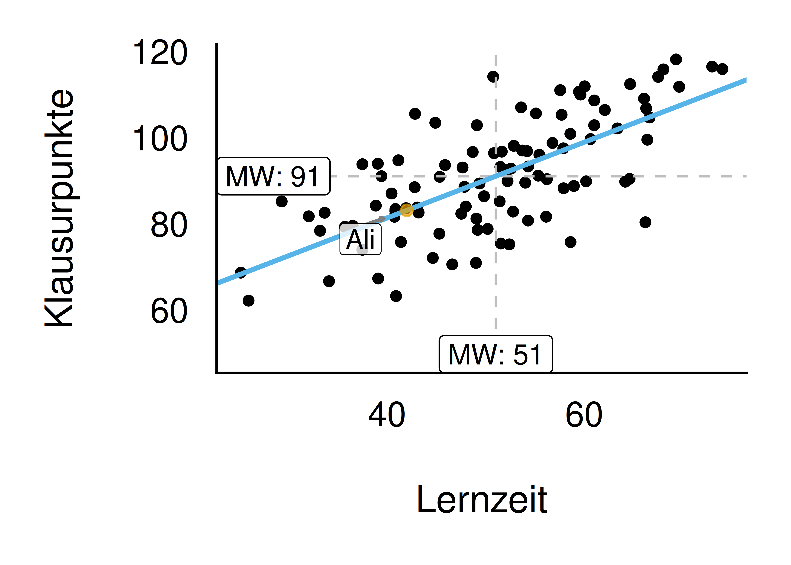
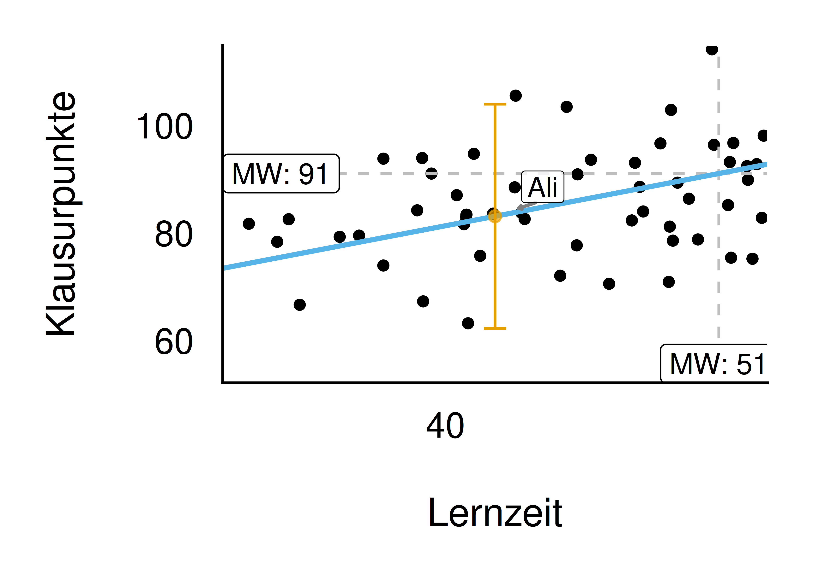
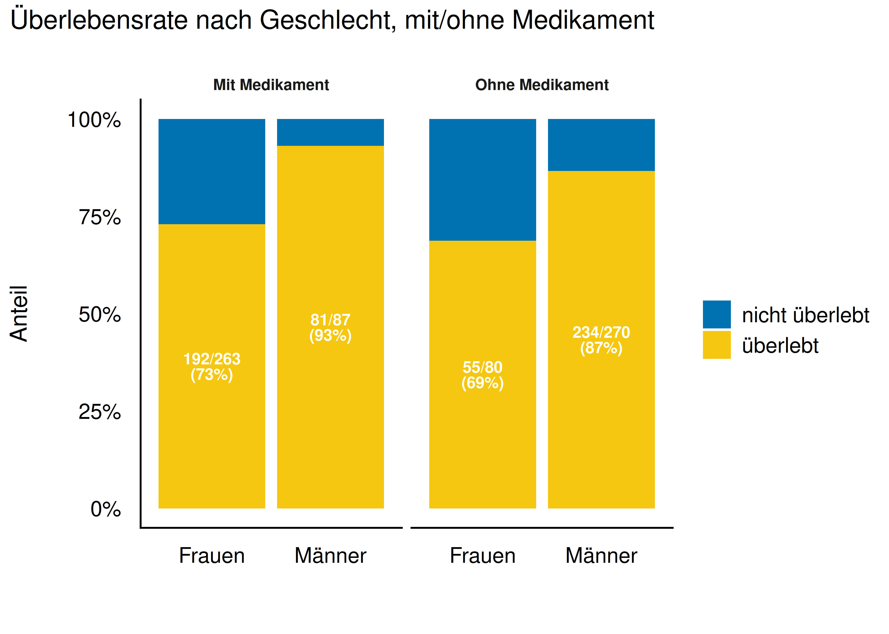
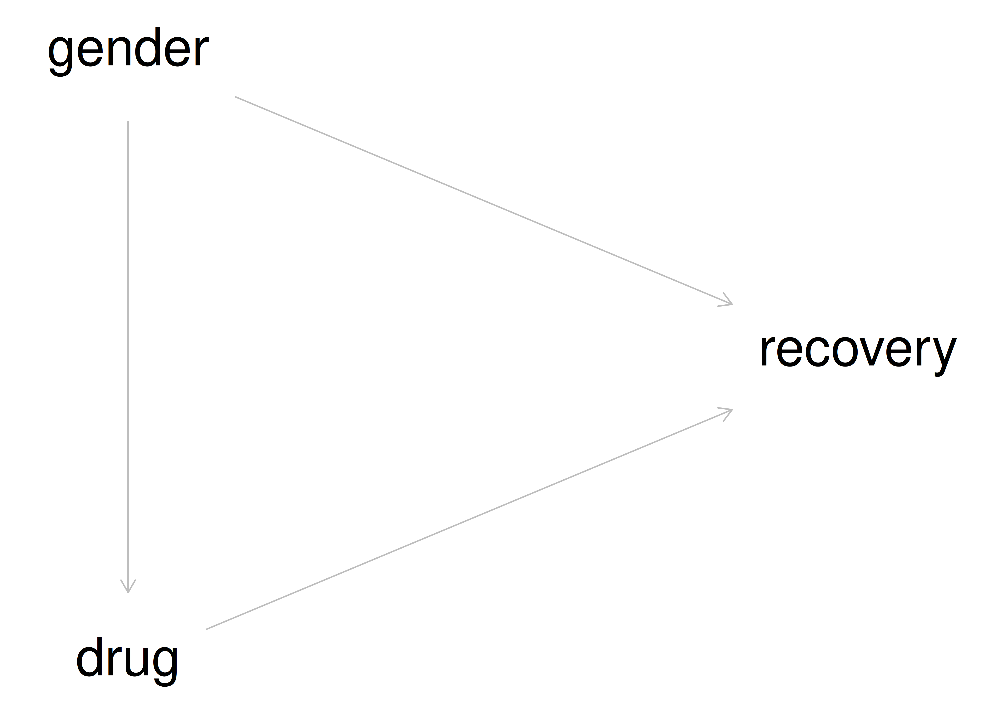
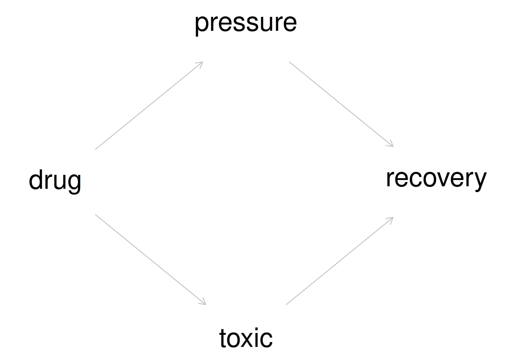
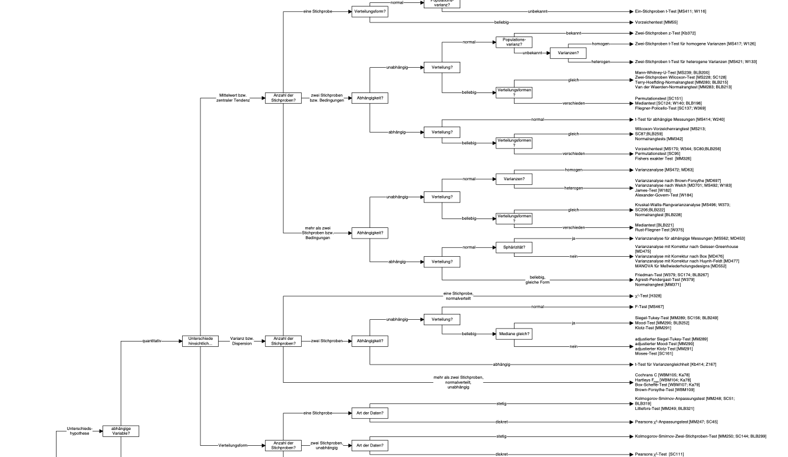
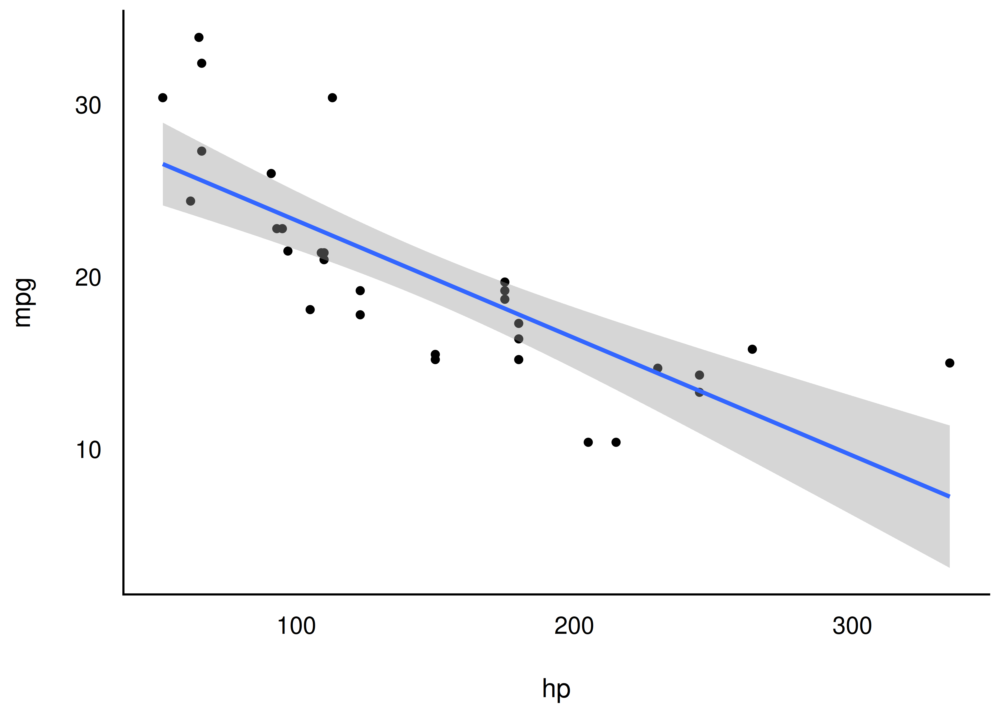
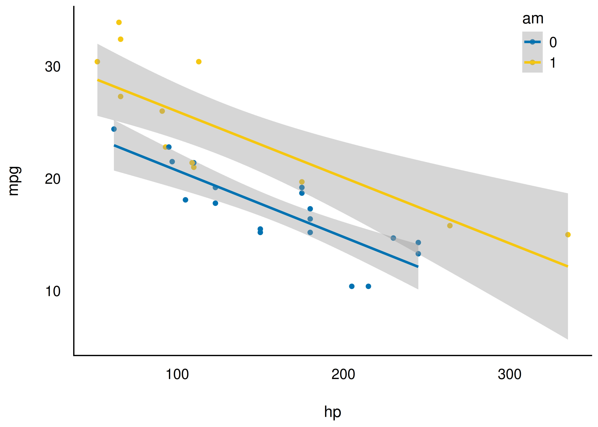

## Wozu ist Statistik eigentlich da?

Nach @shmueli2010 lassen sich drei Zielarten statistischer Analysen unterscheiden:

- **Beschreiben**
- **Vorhersagen**
- **Erklären**

::: {.fragment}
Anhand der verwendeten Methode (z. B. Regression) allein erkennt man **nicht**, welches Ziel eine Studie verfolgt — das steht in der Forschungsfrage.
:::

## Übersicht der drei Zielarten

```{mermaid}
flowchart TD
  A{Ziele} --> B(Beschreiben)
  A --> C(Vorhersagen)
  A --> D(Erklären)
  B --> E(Verteilung)
  B --> F(Zusammenhang)
  C --> H(Punktschätzung)
  C --> I(Bereichsschätzung)
  D --> J(Kausalinferenz)
  D --> K(Populationsinferenz)
```

## Beispiele für die drei Zielarten

- **Beschreiben:** Wie groß ist der Gender-Paygap in Branche X im Zeitraum Y?
- **Vorhersagen:** Wenn Mr. X 100 Stunden auf die Statistikklausur lernt, welche Note ist zu erwarten?
- **Erklären:** Wie viel *bringt* (mir) das Lernen auf die Klausur?

## Zielart *Beschreiben* {.smaller}

- Ziel: Daten zu aussagekräftigen Kennzahlen zusammenfassen
- Synonym: **deskriptive Statistik**
- Typische Kennzahlen: Mittelwert, Korrelation, Regressionskoeffizienten
- **Kein** Anspruch, über die Daten hinauszugehen (keine Aussage über die Population)

::: {.callout-note title="Definition: Deskriptivstatistik"}
Deskriptivstatistik fasst Merkmale aus einer Stichprobe zu Kennzahlen (Statistiken) zusammen.
:::

## Beschreiben — Beispiel

- 100 Studis im Hörsaal schreiben ihre Körpergröße auf
- Dozentin berechnet den Mittelwert
- Fertig: **deskriptive Statistik!**

{width="30%"}

## Zielart *Vorhersagen*

- Ziel: gegeben Werten der UV den Wert der AV vorhersagen
- Synonym: **prädiktive / prognostische Analyse**
- Ergebnis: Punktschätzung oder Bereichsschätzung

::: {.fragment}
**Beispiel — Ali lernt für die Klausur:** Ali lernt 42 Stunden. Vorhersage: 83 Punkte (Punktschätzung) bzw. 80–86 Punkte (Bereichsschätzung).
:::

## Vorhersagen — Regressionsmodell für Ali

{width="48%"}

## Vorhersagen — mit Unsicherheitsbereich

{width="48%"}

## Zielart *Erklären*

Synonym: **schließende Statistik / Inferenzstatistik**

Zwei Bedeutungen [vgl. @gelman2021]:

1. **Populationsinferenz** — gilt der Stichproben-Befund auch in der Grundgesamtheit?
2. **Kausalinferenz** — welche Variable ist Ursache, welche Wirkung?

## Erklären — Beispiele

**Populationsinferenz:**

- Wie groß ist $b$ (Lernzeit → Note) in der Grundgesamtheit?
- Bevorzugen Kunden *allgemein* Webshop A oder B?

**Kausalinferenz:**

- Ist Größe eine Ursache von Gewicht?
- Wenn ich 100h lerne, welche Note schreibe ich dann *deswegen*?

## Kausalinferenz — Studie A: Östrogen

Fiktive klinische Studie, $n = 700$: Medikament vs. kein Medikament, getrennt nach Geschlecht.

- Bei Männern: Medikament hilft
- Bei Frauen: Medikament hilft
- **Gesamt: Medikament hilft NICHT?!**

::: {.fragment}
Wie kann das sein? Was raten wir dem Arzt?
:::

## Studie A — Daten im Bild

{width="65%"}

## Studie A — die kausale Struktur

{width="40%"}

::: {.callout-important}
Geschlecht **konfundiert** den Zusammenhang von Medikament und Heilung. Hier ist **Stratifizieren** (nach Geschlecht trennen) der richtige Weg.
:::

## Kausalinferenz — Studie B: Blutdruck

Gleiche Datenstruktur wie Studie A, aber:

- Bei geringem Blutdruck: Medikament schädlich
- Bei hohem Blutdruck: Medikament schädlich
- **Gesamt: Medikament scheint zu nützen?!**

## Studie B — die kausale Struktur

{width="42%"}

::: {.callout-important}
Hier zeigt die **Gesamtbetrachtung** den wahren kausalen Effekt. Stratifizieren wäre hier **falsch** — man sähe nur den toxischen Effekt.
:::

## Studie A vs. B — die Pointe

- **Gleiche Daten-Struktur**, aber **unterschiedliches Kausalmodell**
- In A: Stratifizieren richtig
- In B: Stratifizieren falsch
- Ohne Kausalmodell ist aus den Daten allein **keine** Handlungsempfehlung ableitbar

::: {.callout-important}
Für Entscheidungen ("Was soll ich tun?") braucht man kausales Wissen — basierend auf Theorie (Kausalmodell) **plus** Daten.
:::

## Populationsinferenz {.smaller}

- Schließt von der **Stichprobe** auf die **Grundgesamtheit**
- Nicht die Frage "was ist Ursache", sondern: gilt der Befund auch allgemein — oder ist er nur Stichprobenrauschen?
- Werkzeuge: Konfidenzintervalle, Signifikanztests, **Bayes-Statistik** (Fokus dieses Buchs)

::: {.callout-important}
Populationsinferenz sagt **nichts** über Ursache und Wirkung aus — ein statistisch gesicherter Zusammenhang kann trotzdem konfundiert sein.
:::

## Populationsinferenz — Beispiele {.smaller}

- Zusammenhang Lernzeit–Note in der Stichprobe: $b = 0{,}8$. Wie groß ist $b$ vermutlich in der Grundgesamtheit?
- Kunden bevorzugen in der Stichprobe Webshop A vor B. Gilt das für *alle* (zukünftigen) Kunden — oder ist das Zufall?

::: {.fragment}
Populationsinferenz ist Thema des nächsten Kapitels.
:::

## Modellieren — Grundraster des Erkennens

- Die Welt ist zu komplex, um jedes Detail zu erfassen
- Wir vereinfachen — aber behalten das Wesentliche

::: {.callout-note title="Definition: Modell"}
Ein Modell ist ein vereinfachtes Abbild der Wirklichkeit.
:::

## X und Y — das Sinnbild des statistischen Modells

:::: {.columns}

::: {.column width="40%"}
```{mermaid}
flowchart LR
X --> Y
X1 --> Y2
X2 --> Y2
```
:::

::: {.column width="60%"}
::: {.callout-note title="Definition: Funktion"}
Eine mathematische Funktion $f$ setzt zwei Größen in Beziehung: $f: X \rightarrow Y$ bzw. $y = f(x)$.
:::

::: {.callout-note title="Definition: Effekt"}
Effekt bezeichnet die Größe des statistischen Zusammenhangs (oder der Differenz) zwischen UV und AV, die über den zufälligen Erwartungswert hinausgeht. Effekt ist nicht unbedingt kausal zu verstehen.
:::
:::

::::

## Alle drei Zielarten modellieren — aber unterschiedlich

- **Beschreiben:** Kennzahlen wie der Mittelwert, um sich "ein Bild zu machen"
- **Vorhersagen:** Modelle als Werkzeug für genaue Vorhersagen (ohne Erklärungsanspruch)
- **Erklären:** Modelle, um die Wirklichkeit möglichst korrekt darzustellen

## Regression zum Modellieren {.smaller}

{width="22%"}

::: {.callout-note}
Regression + Inferenz = 💖
:::

Die Regression ist das "Schweizer Taschenmesser" der Statistik — (fast) immer einsetzbar, statt vieler verschiedener Spezialverfahren.

## Regression statt Verfahrens-Wald

{width="55%"}

::: {.callout-note}
Viele klassische Verfahren (t-Test, ANOVA, Korrelation) sind **Spezialfälle** der Regression.
:::

## Spezialfälle der Regression

- **t-Test:** UV zweistufig nominal, AV metrisch
- **ANOVA:** UV mehrstufig nominal, AV metrisch
- **Korrelation:** = Regressionskoeffizient $\beta_1$, wenn UV und AV z-standardisiert sind

## Die Regressionsgleichung {.smaller}

{width="45%"} {width="45%"}

::: {.callout-note title="Satz: Lineares Modell (Regressionsgleichung)"}
$$y = \beta_0 + \beta_1 x_1 + \ldots + \beta_k x_k + \epsilon$$

$\beta_0$: Achsenabschnitt (Intercept); $\beta_1, \ldots, \beta_k$: Steigungen (Regressionsgewichte, Koeffizienten, Parameter) [@gelman2021].
:::

## Fazit

- Drei Zielarten: **Beschreiben**, **Vorhersagen**, **Erklären** (Populations- & Kausalinferenz)
- Alle drei modellieren — mit unterschiedlichem Anspruch
- Die **Regression** ist unser universelles Werkzeug für alle Zielarten
- Als Nächstes: Populationsinferenz vertiefen

::: {.callout-important}
Kontinuierliches Lernen ist der Schlüssel zum Erfolg.
:::

## Vielen Dank! {.center}

Fragen?
