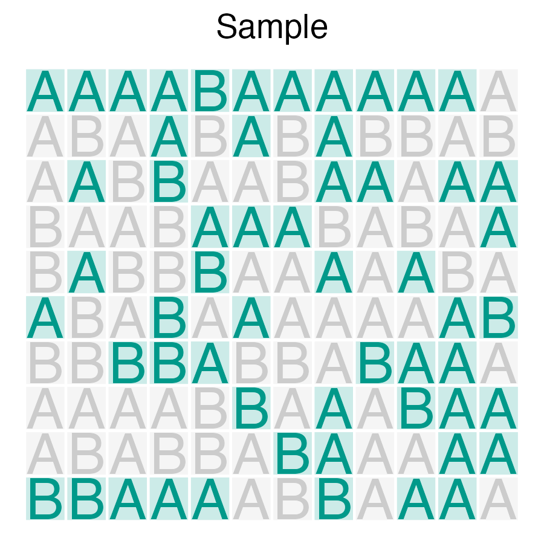
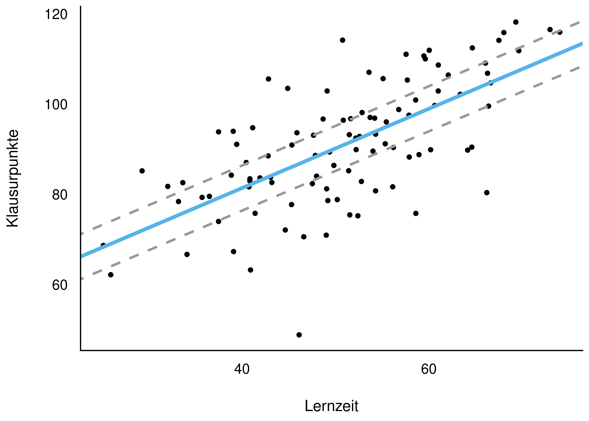
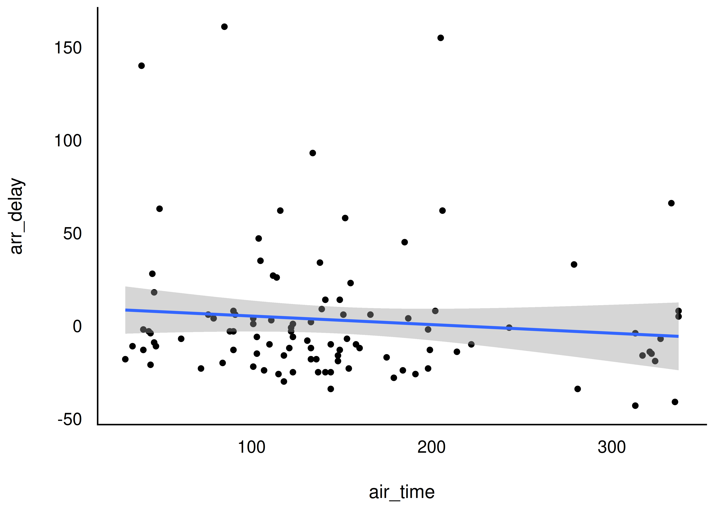
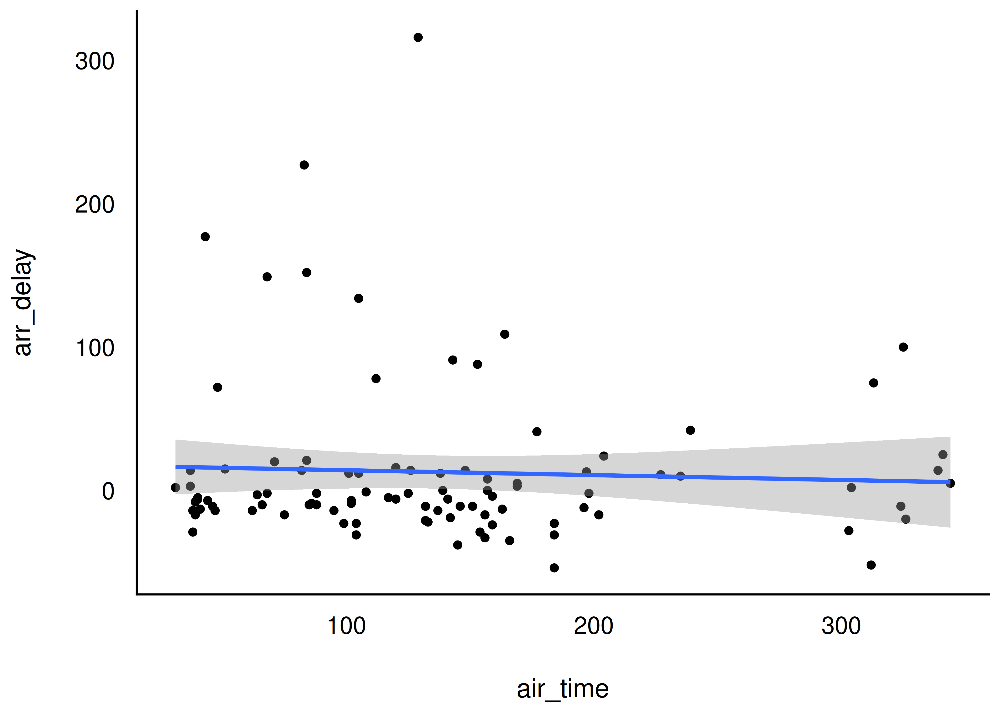
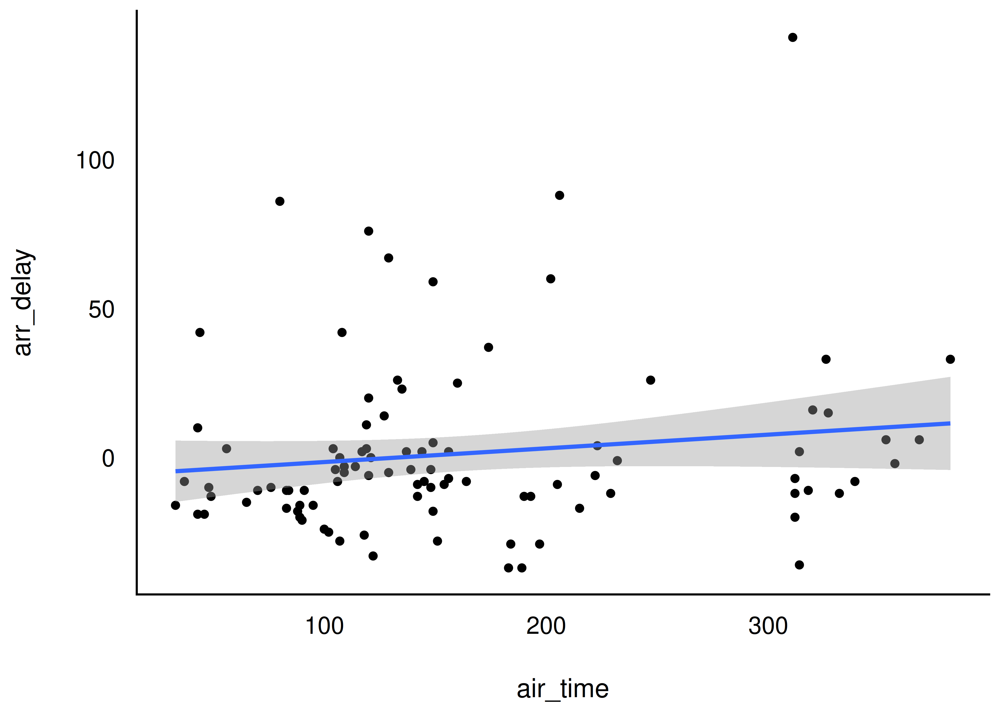
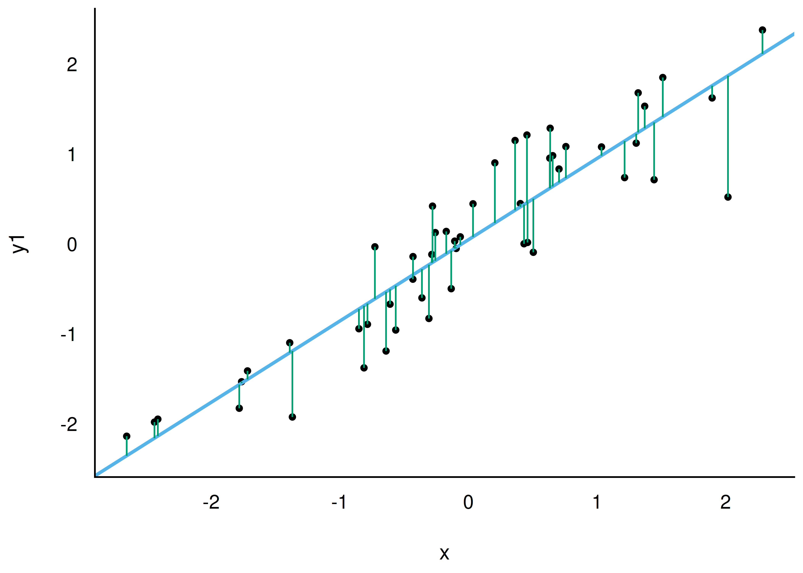
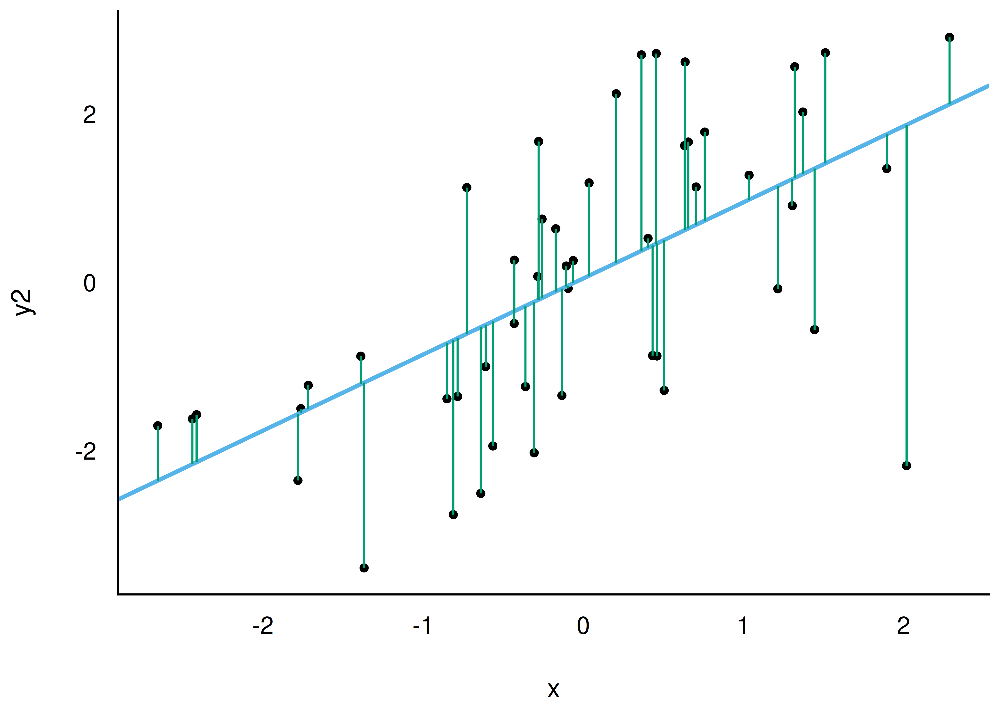
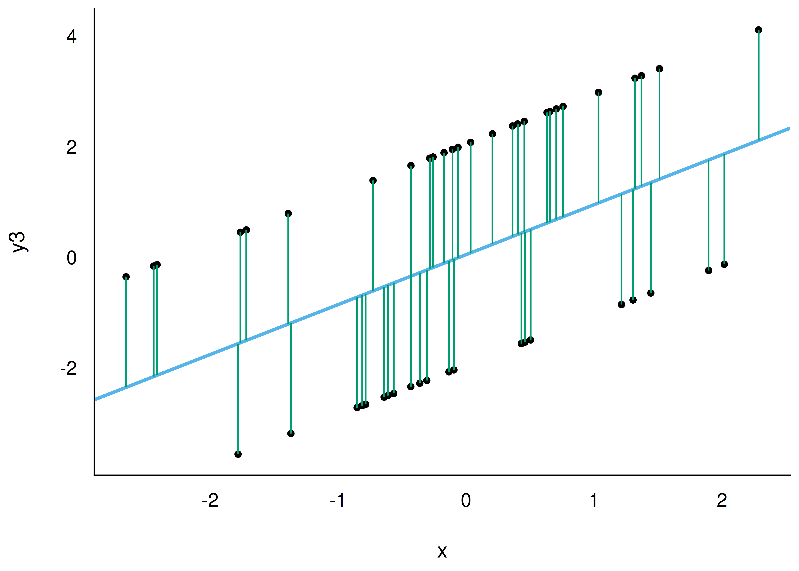

## Lernziele {.smaller}

Nach diesem Kapitel können Sie ...

- Populationsinferenz definieren und von der Deskriptivstatistik abgrenzen
- erläutern, warum inferenzstatistische Schlüsse notwendig Ungewissheit enthalten
- Ungewissheit zu Regressionskoeffizienten von Ungewissheit zur Vorhersagegenauigkeit ($\sigma$) unterscheiden
- den Begriff des Konfidenzintervalls erläutern und interpretieren
- frequentistische und Bayes-Inferenz gegenüberstellen
- den p-Wert informell definieren und typische Fehlinterpretationen benennen
- statistische Signifikanz sowie Null- und Alternativhypothese erläutern

# Schließen von der Stichprobe auf die Grundgesamtheit {.center footer=false}

## Vom Teil aufs Ganze

- **Populationsinferenz**: Schließen von der Stichprobe auf die Grundgesamtheit
- Frage: Was sagt mein Datensatz (Stichprobe) über die zugrundeliegende Grundgesamtheit (Population) aus?
- Beispiel: Anteil `A` der R-Fans unter *allen* Studierenden schätzen — auf Basis einer Stichprobe

::: {.fragment}
Grundproblem: Wir wollen Aussagen über die Population, haben aber nur einen Ausschnitt (Stichprobe) davon.
:::

::: footer
Schließen von der Stichprobe auf die Grundgesamtheit
:::

## Population vs. Stichprobe {.smaller}

{width="26%"} {width="26%"}

- Stichprobe: 42 % R-Fans, $p = 0{,}42$
- Schluss auf Population: $\pi = 0{,}42$ (Punktschätzer)

:::{.callout-note}
Lateinische Buchstaben (z. B. $p$) für Stichproben-Kennwerte, griechische ($\pi$) für Populations-Kennwerte.
:::

::: footer
Schließen von der Stichprobe auf die Grundgesamtheit
:::

## Definition: (Populations-)Inferenzstatistik

:::{.callout-note title="Definition: (Populations-)Inferenzstatistik"}
Verfahren zum Schließen von *Statistiken* (Kennzahl einer Stichprobe) auf *Parameter* (Kennzahl einer Grundgesamtheit).
Inferenz = Schließen: aus vorliegendem Wissen wird neues Wissen generiert.

Zwei Hauptarten: (1) Populationsinferenz, (2) Kausalinferenz.
:::

::: footer
Schließen von der Stichprobe auf die Grundgesamtheit
:::

## Kennwerte: Stichprobe vs. Population

| Kennwert | Stichprobe | Population | Schätzwert |
|---|---|---|---|
| Mittelwert | $\bar{X}$ | $\mu$ | $\hat{\mu}$ |
| Streuung | $sd$ | $\sigma$ | $\hat{\sigma}$ |
| Anteil | $p$ | $\pi$ | $\hat{\pi}$ |
| Korrelation | $r$ | $\rho$ | $\hat{\rho}$ |
| Regression | $b$ | $\beta$ | $\hat{\beta}$ |

Da Populationsparameter fast nie sicher bekannt sind, begnügt man sich mit **Schätzwerten** ("Dach").

::: footer
Schließen von der Stichprobe auf die Grundgesamtheit
:::

# Was ist Populationsinferenz? {.center footer=false}

## Definition: Populationsinferenz

:::{.callout-note title="Definition: Populationsinferenz"}
Teilbereich der Statistik, der von den Daten einer begrenzten Stichprobe auf eine zugrundeliegende Grundgesamtheit verallgemeinert (schließt).
:::

- Deskriptivstatistik (Beschreiben) und Inferenzstatistik (Erklären/Verallgemeinern) gehen Hand in Hand

```{mermaid}
graph LR
    Population["Grundgesamtheit (Population)
    N = groß"]
    Sample["Stichprobe
    n = klein"]
    Population -->|Zufallsauswahl| Sample
    Sample -- Inferenzschluss --> Population
```

::: footer
Was ist Populationsinferenz?
:::

## Inferenz beinhaltet Ungewissheit

- Man kennt nur einen Teil (Stichprobe) des Ganzen (Population)
- Aus diesem begrenzten Wissen resultiert notwendig **Ungewissheit** über die Population

:::{.callout-important}
Nichts Genaues weiß man nicht: Schließt man vom Teil aufs Ganze, geschieht das unter Unsicherheit — man spricht von *Ungewissheit*.
:::

::: footer
Was ist Populationsinferenz?
:::

## Definition: Zufälliges Ereignis

:::{.callout-note title="Definition: Zufälliges Ereignis"}
Ein Ereignis, das nicht (komplett) vorherzusehen ist (z. B. Augenzahl beim Würfeln).
Zufällig bedeutet nicht zwangsläufig ursachenlos — nur sind die genauen Randbedingungen meist nicht ausreichend bekannt.
:::

::: footer
Was ist Populationsinferenz?
:::

## Ungewissheit unterschiedlich präzise formulieren {.smaller}

- "Morgen regnet's" $\Leftrightarrow$ mit $p = 97\%$ gibt es morgen mehr als 0 mm Niederschlag
- "Methode A ist besser als B" $\Leftrightarrow$ mit 57 % Wahrscheinlichkeit ist der Mittelwert von $Y$ für A höher als für B
- "Die Maschine fällt bald aus" $\Leftrightarrow$ mit 97 % Wahrscheinlichkeit Ausfall in 1–3 Tagen
- "Die Investition lohnt sich" $\Leftrightarrow$ Erwartungswert 42 €; mit 90 % zwischen −10.000 € und 100.000 €

::: footer
Was ist Populationsinferenz?
:::

## Zwei Arten von Ungewissheit

Im Regressionsmodell gibt es (mindestens) zwei Arten von Ungewissheit:

1. Wie (un)gewiss ist man sich über die **Regressionsgewichte** ($\beta_0, \beta_1$)?
2. Wie (un)gewiss ist man sich über die **Vorhersagegenauigkeit** ($\sigma$)?

::: footer
Was ist Populationsinferenz?
:::

## Ungewissheit der Regressionsgeraden

{width="45%"} {width="45%"}

Die Regressionsgerade könnte "höher/niedriger aufgehängt" sein oder mehr/weniger steigen — wir wissen es nicht exakt.

::: footer
Was ist Populationsinferenz?
:::

## Warum schwanken Koeffizienten? {.smaller}

- Verschiedene Zufallsstichproben aus derselben Population liefern **unterschiedliche** Regressionskoeffizienten

{width="30%"} {width="30%"} {width="30%"}

:::{.callout-important}
Stichproben-Kennwerte schwanken um den tatsächlichen Wert in der Population herum.
:::

::: footer
Was ist Populationsinferenz?
:::

## Sigma: Ungewissheit der Vorhersagegenauigkeit {.smaller}

- Selbst bei sicherer Lage der Regressionsgeraden bleibt Ungewissheit: Wie *genau* sind Vorhersagen?
- Ausgedrückt durch $R^2$ oder $\sigma$

{width="24%"} {width="24%"} {width="24%"}

:::{.callout-note title="Definition: Sigma"}
$\sigma$ gibt (grob) den mittleren Vorhersagefehler des Modells an — wie weit eine Vorhersage im Schnitt vom wahren Wert entfernt ist.
:::

::: footer
Was ist Populationsinferenz?
:::

## Ungewissheit muss angegeben werden

:::{.callout-important}
Schließt man auf eine Population (schätzt Modellparameter), sollte stets die (Un-)Genauigkeit der Schätzung mit angegeben werden.
:::

Im Regressionsmodell betrifft das zwei Stellen:

1. Präzision der Regressionsgeraden ($\beta_0$, $\beta_1$)
2. Modellgüte / Vorhersagefehler ($R^2$ bzw. $\sigma$)

::: footer
Was ist Populationsinferenz?
:::

## Konfidenzintervall

- Statt eines einzelnen **Punktschätzers** gibt man einen **Schätzbereich** an
- Synonym: **Konfidenzintervall**
- Beispiel: 95 %-Schätzbereich für Achsenabschnitt ca. 36–56 Punkte; Steigung ca. 0,7–1,1 Punkte/Stunde

:::{.callout-note title="Definition: Konfidenzintervall"}
Oberbegriff für Schätzbereiche von Parametern. Die Grenzen markieren einen Bereich plausibler Werte für den Parameter.
:::

::: footer
Was ist Populationsinferenz?
:::

## Interpretation im Bayes-Kontext

> "Laut Modell liegt der gesuchte Anteil der R-Fans mit einer Wahrscheinlichkeit von 95 % im Bereich von 40 bis 44 Prozentpunkten."

Im Bayes-Kontext ist ein Konfidenzintervall unmittelbar als Wahrscheinlichkeitsaussage interpretierbar.

::: footer
Was ist Populationsinferenz?
:::

# Frequentistische Inferenz vs. Bayes-Inferenz {.center footer=false}

## Frequentistische vs. Bayes-Inferenz {.smaller}

::::{.columns}
:::{.column}
**Frequentismus**

- Fehlentscheidungen auf lange Sicht kontrollieren
- kein Vorwissen einbezogen
- Wahrscheinlichkeit = relative Häufigkeit
- keine Wahrscheinlichkeitsaussage zu Parametern möglich
:::

:::{.column}
**Bayes**

- Wahrscheinlichkeit einer Hypothese korrekt bemessen
- Vorwissen (Prior) fließt explizit ein
- Wahrscheinlichkeitsaussagen für Hypothesen möglich
- rechenintensiver, erst neuerdings praktikabel
:::
::::

::: footer
Frequentistische Inferenz vs. Bayes-Inferenz
:::

## Der p-Wert

> Wahrscheinlichkeit, ein Ergebnis zu erhalten, das mindestens so extrem ist wie das beobachtete — unter der Annahme, dass es keinen Effekt gibt.

- Man nimmt an: kein Effekt (Nullhypothese)
- Frage: Wie überraschend wären die Daten unter dieser Annahme?
- p-Wert = diese "Überraschungs-Wahrscheinlichkeit"

::: footer
Frequentistische Inferenz vs. Bayes-Inferenz
:::

## p-Wert: häufige Fehlinterpretationen {.smaller}

Der p-Wert wird oft falsch verstanden.

- ❌ Der p-Wert gibt die Wahrscheinlichkeit der Nullhypothese (oder Forschungshypothese) an
- ❌ Der p-Wert zeigt ein inhaltlich bedeutsames Ergebnis an

{width="20%"}

:::{.callout-important}
Ein frequentistisches Konfidenzintervall macht keine Wahrscheinlichkeitsaussage über einen Populationswert — sondern eine Aussage über wiederholtes Stichprobenziehen.
:::

::: footer
Frequentistische Inferenz vs. Bayes-Inferenz
:::

## Bayes-Inferenz: Posteriori-Verteilung

Zentrale Statistik: die **Posteriori-Verteilung** — beantwortet: "Wie wahrscheinlich ist die Hypothese, nachdem wir die Daten kennen?"

In der Bayes-Statistik sind Aussagen erlaubt wie:

> Mit einer Wahrscheinlichkeit von 95 % ist der neue Webshop besser als der alte.

> Mit einer Wahrscheinlichkeit von 89 % liegt die Wirksamkeit zwischen 0,1 und 0,4.

::: footer
Frequentistische Inferenz vs. Bayes-Inferenz
:::

## Statistische Signifikanz {.smaller}

- Frequentismus: signifikant, wenn $p < .05$
- Hier verwendete (übergreifende) Definition:

:::{.callout-note title="Definition: Statistische Signifikanz"}
Ist der Wert Null nicht im Schätzbereich enthalten, liegt ein statistisch signifikantes Ergebnis vor.
:::

Signifikanz ist auch eine Funktion der **Stichprobengröße** — große Stichproben werden fast immer signifikant.

```{mermaid}
flowchart LR
S[Stichprobengröße]
E[Effektgröße]
p[p<0.05]
S-->p
E-->p
```

::: footer
Frequentistische Inferenz vs. Bayes-Inferenz
:::

## Null- und Alternativhypothese

:::{.callout-note title="Definition: Exakte Nullhypothese"}
$H_0$ besagt, dass kein Effekt vorliegt (kein Unterschied, kein Zusammenhang, keine Veränderung).
:::

:::{.callout-note title="Definition: Alternativhypothese"}
Besagt, dass ein (substanzieller) Effekt vorliegt — logisch meist das Gegenteil von $H_0$.
:::

Beispiele: $H_0: \mu = 100$; $H_0: \rho = 0$; $H_0: \pi = 0{,}5$; $H_0: \beta_1 = 0$

::: footer
Frequentistische Inferenz vs. Bayes-Inferenz
:::

## Frequentist vs. Bayesianer

{width="28%"}

Pointe: Vorab-Information (Prior) wird im Frequentismus nicht berücksichtigt.

::: footer
Frequentistische Inferenz vs. Bayes-Inferenz
:::

## Zusammenfassung {.smaller}

- Populationsinferenz: von der Stichprobe auf die Population schließen
- Inferenz ist immer mit Ungewissheit behaftet — zwei Quellen: $\beta$ und $\sigma$
- Konfidenzintervall = Schätzbereich statt Punktschätzer
- Frequentismus (p-Wert) vs. Bayes (Posteriori-Verteilung)
- Statistische Signifikanz: Null nicht im Schätzbereich enthalten

::: footer
Frequentistische Inferenz vs. Bayes-Inferenz
:::

