## Hallo, Wahrscheinlichkeit {.center}

Wahrscheinlichkeitstheorie: die Mathematik des Zufalls

## Wozu brauche ich dieses Kapitel?

Im wirklichen Leben sind Aussagen so gut wie nie sicher:

- "Weil sie so schlau ist, ist sie erfolgreich."
- "In Elektroautos liegt die Zukunft."
- "Das klappt sicher, meine Meinung."
- "Der nächste Präsident wird XYZ."

::: {.fragment}
Wahrscheinlichkeit hilft, solche Aussagen zu **präzisieren**.
:::

## Lernziele

Sie können ...

- die Grundbegriffe der Wahrscheinlichkeitstheorie erläuternd definieren
- die Definitionen von Wahrscheinlichkeit beschreiben
- typische Relationen (Operationen) von Ereignissen anhand von Beispielen veranschaulichen
- erläutern, was eine Zufallsvariable ist

# Grundbegriffe {.center footer=false}

## Zufallsvorgang

{width="12%" fig-align="center"}

::: {.callout-note title="Definition: Zufallsvorgang"}
Ein *Zufallsvorgang* (Zufallsexperiment) ist eine klar beschriebene Tätigkeit, deren Ergebnis nicht sicher ist. Die Menge möglicher Ergebnisse ist aber bekannt, und die Wahrscheinlichkeit jedes Ergebnisses lässt sich quantifizieren.
:::

::: footer
Grundbegriffe
:::

## Typische Zufallsvorgänge

- **Würfeln**: Augenzahl 1–6
- **Münzwurf**: Kopf oder Zahl
- **Lottoziehung**: 6 aus 49
- **Kartenziehen**: eine Karte aus 52
- **Glücksrad**: welches Feld bleibt stehen?

::: footer
Grundbegriffe
:::

## Zufall heißt: unbekannt, nicht ursachenlos

::: {.callout-caution}
Zufall heißt nicht, dass ein Vorgang keine Ursachen hätte. Der Fall einer Münze gehorcht den Gesetzen der Gravitation — kennten wir alle Ausgangsbedingungen exakt, wäre er vorhersagbar. "Zufall" versteht man daher besser als **"unbekannt"**.
:::

::: footer
Grundbegriffe
:::

## Ergebnisraum

::: {.callout-note title="Definition: Ergebnisraum"}
Die möglichen Ergebnisse eines Zufallsvorgangs bilden eine Menge, den *Ergebnisraum* $\Omega$. Die Elemente $\omega$ von $\Omega$ heißen *Ergebnisse*.
:::

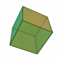{width="10%" fig-align="center"}

$$\Omega = \{1,2,3,4,5,6\}$$

::: footer
Grundbegriffe
:::

## Ergebnisraum — Beispiele

- **Münzwurf**: $\Omega = \{\text{Kopf, Zahl}\}$
- **Lotto**: alle Kombinationen von 6 aus 49 Zahlen (ca. 14 Mio.)
- **Kartenziehen**: alle 52 Karten
- **Glücksrad** (4 Farbfelder): $\Omega = \{\text{Rot, Grün, Blau, Gelb}\}$

Die Wahrscheinlichkeitsrechnung baut auf der Mengenlehre auf.

::: footer
Grundbegriffe
:::

## Ereignis

::: {.callout-note title="Definition: Ereignis"}
Jede Teilmenge von $\Omega$ heißt *Ereignis*: $A \subseteq \Omega$.
:::

```{mermaid}
flowchart LR
 M[Sie werfen die Münze] --> T["T (Treffer) 🥳"]
  M --> N["N (Niete) 📚"]
```

Beispiel: "Augenzahl 6 liegt oben" $\rightarrow A = \{6\}$

::: footer
Grundbegriffe
:::

## Unmögliches und sicheres Ereignis

::: {.callout-note title="Definition: Unmögliches und sicheres Ereignis"}
Die leere Menge $\varnothing$ heißt das *unmögliche* Ereignis, der Grundraum $\Omega$ heißt das *sichere Ereignis*.
:::

- Unmöglich: "Der Würfel zeigt eine 7."
- Sicher: "Nach dem Wurf liegt eine Zahl zwischen 1 und 6 oben."

::: footer
Grundbegriffe
:::

## Elementarereignis

::: {.callout-note title="Definition: Elementarereignis"}
Jede einelementige Teilmenge $\{\omega\}$ von $\Omega$ heißt *Elementarereignis*.
:::

- Würfeln: $A = \{1\}$
- Klausur: $\Omega = \{\text{bestehen, nicht bestehen}\}$, ein Elementarereignis tritt ein

::: footer
Grundbegriffe
:::

## Vollständiges Ereignissystem

::: {.callout-note title="Definition: Vollständiges Ereignissystem"}
Wird der Grundraum $\Omega$ vollständig in paarweise disjunkte Ereignisse zerlegt, so bilden diese Ereignisse ein *vollständiges Ereignissystem*.
:::

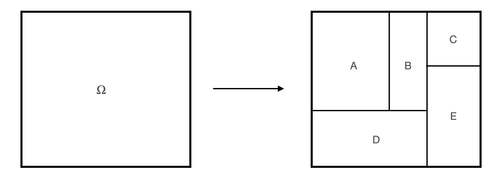{width="45%"}

Beispiel Würfel: $A$ = gerade Zahlen, $B$ = ungerade Zahlen

::: footer
Grundbegriffe
:::

## Mächtigkeit

::: {.callout-note title="Definition: Mächtigkeit"}
Die Anzahl der Elementarereignisse eines Ergebnisraums nennt man die *Mächtigkeit*, Symbol $|\Omega|$.
:::

Beispiel: Würfel mit $\Omega = \{1,...,6\}$ hat $|\Omega| = 6$.

::: footer
Grundbegriffe
:::

## Disjunkte Ereignisse

Zwei Ereignisse $A$, $B \subseteq \Omega$ sind *disjunkt*, wenn ihre Schnittmenge leer ist: $A \cap B = \emptyset$

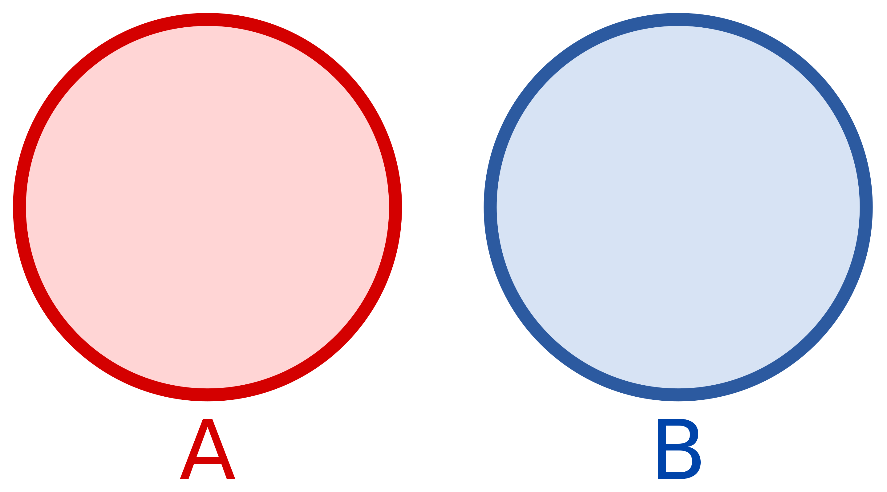{width="22%" fig-align="center"}

Beispiel: "gerade Augenzahl" ($\{2,4,6\}$) und "ungerade Augenzahl" ($\{1,3,5\}$)

::: footer
Grundbegriffe
:::

# Was ist Wahrscheinlichkeit? {.center footer=false}

## Von der Logik zur Wahrscheinlichkeit

Klassische Logik: "Alle Schwäne sind weiß." → "Dies ist ein Schwan." → "Dieser Schwan ist weiß."

::: {.fragment}
Mit Wahrscheinlichkeit: "Die meisten Schwäne sind weiß." → "Dies ist ein Schwan." → "Dieser Schwan ist **wahrscheinlich** weiß."
:::

::: {.fragment}
Wahrscheinlichkeit = Erweiterung der Logik [@jaynes2003]
:::

::: footer
Was ist Wahrscheinlichkeit?
:::

## Wahrscheinlichkeit als Erweiterung der Logik

In formaler Logik: ein Ereignis ist *falsch* (0) oder *wahr* (1). Der Raum dazwischen ist die Wahrscheinlichkeit $0 < p < 1$.

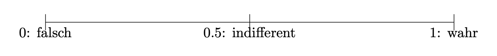{width="55%"}

::: footer
Was ist Wahrscheinlichkeit?
:::

## Definition von Wahrscheinlichkeit

::: {.callout-note title="Definition: Wahrscheinlichkeit"}
Die Wahrscheinlichkeit ist ein Maß für die Plausibilität einer Aussage $A$, gegeben Hintergrundinformationen $D$: $Pr(A|D)$. Sie liegt zwischen 0 (unmöglich) und 1 (sicher).
:::

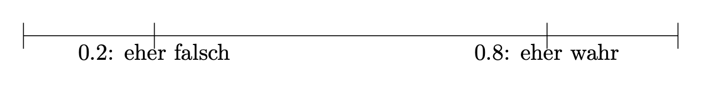{width="50%"}

::: footer
Was ist Wahrscheinlichkeit?
:::

## Wahrscheinlichkeit als Wissenszustand

Wahrscheinlichkeit existiert nicht wie ein Stein — sie ist eine Art von Wissen [@jaynes2003].

- Unbedarfter Spieler: "Ich habe keinen Grund, an der Fairness zu zweifeln" → $Pr(Z|F) = 0.5$
- Betrüger, der die Münze kennt → $Pr(Z|B) = 0.75$

::: {.fragment}
**Dieselbe Münze, unterschiedliches Wissen, unterschiedliche Wahrscheinlichkeit.**
:::

::: footer
Was ist Wahrscheinlichkeit?
:::

## Wahrscheinlichkeit ist immer bedingt

Unvollständig: "Morgen regnet es mit 70 % Wahrscheinlichkeit."

Besser: $Pr(\text{Regen} \mid \text{Wettermodell X})$

::: {.fragment}
Symptome $S$ eines Hautkrebses: $Pr(K) = 0{,}001$, aber $Pr(K \mid S) \gg 0{,}001$
:::

::: {.callout-note}
Sagt jemand "Die Wahrscheinlichkeit von A ist x %", frag immer: gegeben welcher Annahmen, welcher Evidenz?
:::

::: footer
Was ist Wahrscheinlichkeit?
:::

## Indifferenzprinzip

::: {.callout-note title="Definition: Indifferenzprinzip"}
In Abwesenheit von Informationen, die bestimmte Ereignisse bevorzugen, sollten alle möglichen Ereignisse als gleich wahrscheinlich angesehen werden.
:::

$$Pr(A) = \frac{1}{n} = \frac{1}{|\Omega|}$$

Beispiel: $Pr(\text{6 beim Würfeln}) = 1/6$

::: footer
Was ist Wahrscheinlichkeit?
:::

## Laplace-Experiment

::: {.callout-note title="Definition: Laplace-Experiment"}
Ein Zufallsexperiment, bei dem alle Elementarereignisse dieselbe Wahrscheinlichkeit haben, nennt man *Laplace-Experiment*.
:::

$$Pr(A)=\frac{\text{Anzahl Treffer}}{\text{Anzahl möglicher Ergebnisse}}$$

::: footer
Was ist Wahrscheinlichkeit?
:::

## Frequentistische Definition

Wenn Elementarereignisse **nicht** gleichwahrscheinlich sind: einfach ausprobieren.

Ein (angeblich fairer) Würfel wird 1000-mal geworfen — Anteil der `6` beobachten:

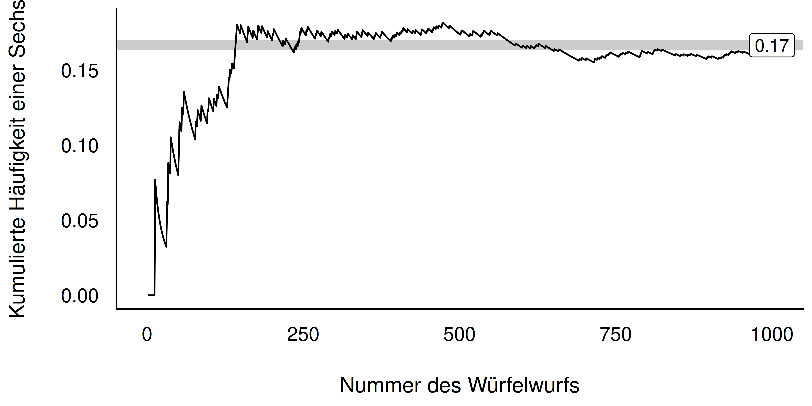{width="55%"}

::: footer
Was ist Wahrscheinlichkeit?
:::

## Kolmogorovs Axiome {#sec-kolmogorov-slide}

1. **Nichtnegativität**: Wahrscheinlichkeiten sind nie negativ
2. **Normierung**: $Pr(\Omega) = 1$, $Pr(\emptyset) = 0$
3. **Additivität**: Sind $A$, $B$ disjunkt, gilt $Pr(A \cup B) = Pr(A) + Pr(B)$

::: footer
Was ist Wahrscheinlichkeit?
:::

# Relationen von Ereignissen {.center footer=false}

## Relationen im Überblick

::: {.callout-note title="Definition: Relation"}
Eine Relation zweier Ereignisse bezeichnet die Beziehung, in der die beiden Ereignisse zueinander stehen.
:::

Typische Relationen: Gleichheit, Ungleichheit, Vereinigung, Schnitt

Werkzeug zur Veranschaulichung: **Venn-Diagramme**

::: footer
Relationen von Ereignissen
:::

## Vereinigung von Ereignissen

::: {.callout-note title="Definition: Vereinigung von Ereignissen"}
$C = A \cup B$ besteht aus allen Elementarereignissen von $A$ **oder** $B$.
:::

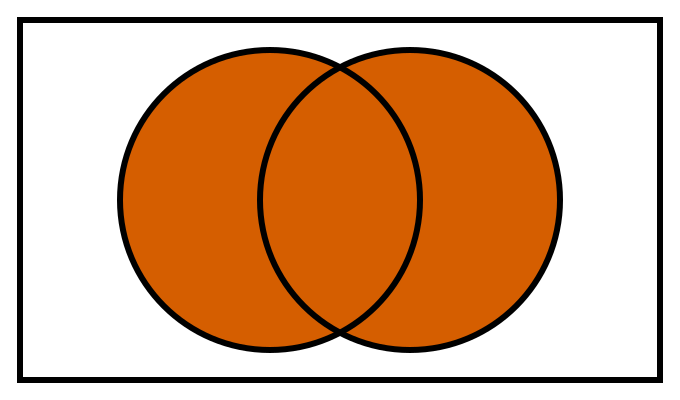{width="22%"}

R: `union(A, B)`

::: footer
Relationen von Ereignissen
:::

## (Durch-)Schnitt von Ereignissen

::: {.callout-note title="Definition: Schnittmenge von Ereignissen"}
$A \cap B$ umfasst genau die Elementarereignisse, die Teil **beider** Ereignisse sind ("A und B").
:::

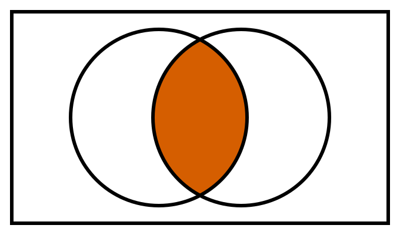{width="22%"}

R: `intersect(A, B)`

::: footer
Relationen von Ereignissen
:::

## Eselsbrücke: Vereinigung vs. Schnitt

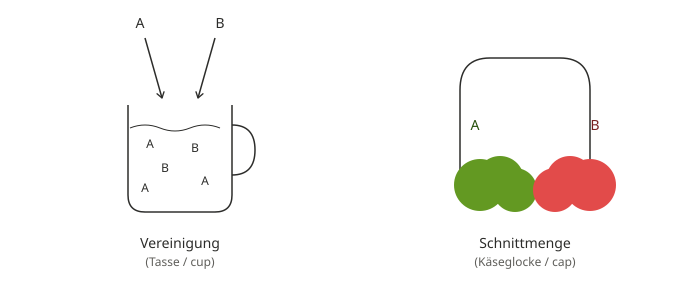{width="45%"}

::: footer
Relationen von Ereignissen
:::

## Komplementärereignis

::: {.callout-note title="Definition: Komplementärereignis"}
$B$ ist Komplementärereignis zu $A$, wenn es genau die Elementarereignisse von $\Omega$ umfasst, die **nicht** zu $A$ gehören: $\bar{A}$ oder $\neg A$.
:::

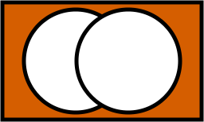{width="22%"}

Beispiel: $A$ = "gerade Augenzahl" → $\neg A$ = "ungerade Augenzahl"

::: footer
Relationen von Ereignissen
:::

## Logische Differenz

::: {.callout-note title="Definition: Logische Differenz"}
$A \setminus B$ besteht aus den Elementarereignissen von $A$, die **nicht** zugleich in $B$ sind ("A minus B").
:::

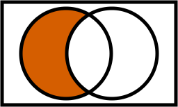{width="22%"}

::: {.callout-caution}
$A \setminus B \ne B \setminus A$ — Achtung, Asymmetrie! R: `setdiff(A, B)`
:::

::: footer
Relationen von Ereignissen
:::

# Zufallsvariable {.center footer=false}

## Von Ereignissen zu Zahlen

::: {.callout-note title="Definition: Zufallsvariable"}
Die Zuordnung der Elementarereignisse eines Zufallsexperiments zu genau einer Zahl $\in \mathbb{R}$ nennt man *Zufallsvariable*.
:::

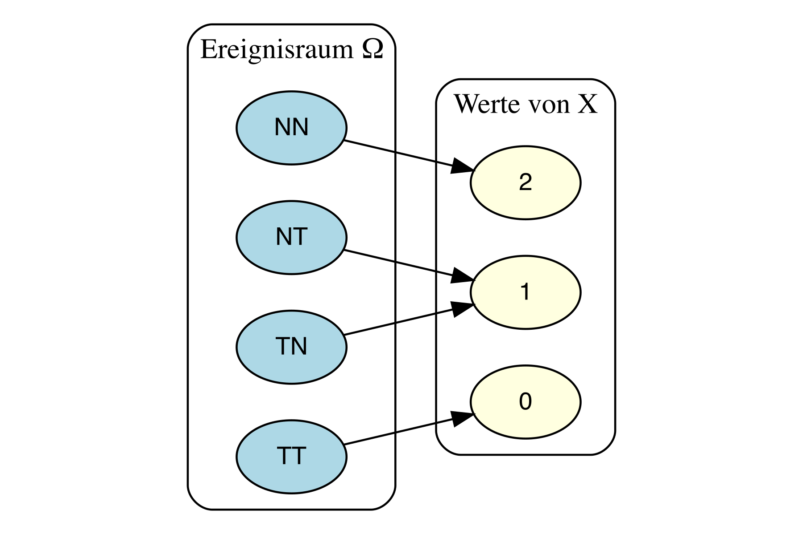{width="28%"}

Schreibweise: $X: \Omega \rightarrow \mathbb{R}$

::: footer
Zufallsvariable
:::

## Diskrete Zufallsvariable

::: {.callout-note title="Definition"}
Bei einer diskreten Zufallsvariablen sind nur bestimmte Realisationen möglich (meist natürliche Zahlen: 0, 1, 2, ...).
:::

- Anzahl Bewerbungen bis zum ersten Interview
- Anzahl Anläufe bis zum Bestehen der Klausur
- Anzahl Treffer beim Losekauf

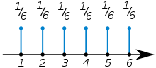{width="28%"}

::: footer
Zufallsvariable
:::

## Wahrscheinlichkeitsverteilung & Verteilungsfunktion {.smaller}

Eine *Wahrscheinlichkeitsverteilung* ordnet jeder Realisation einer Zufallsvariablen eine Wahrscheinlichkeit zu.

$$F(x) = \sum_{x_i \le x} Pr(X=x_i)$$

::: {.callout-note title="Definition: Verteilungsfunktion"}
$F$ gibt die Wahrscheinlichkeit an, dass $X$ eine Realisation $\le x$ annimmt.
:::

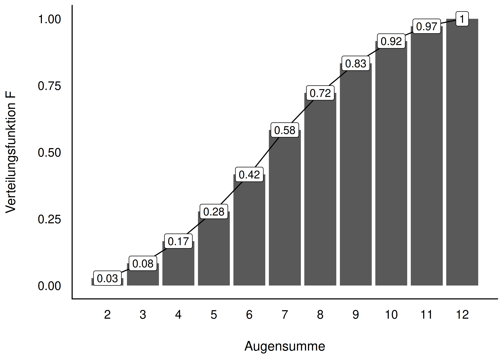{width="20%"}

::: footer
Zufallsvariable
:::

## Stetige Zufallsvariable

::: {.callout-note title="Definition: Stetige Zufallsvariable"}
Eine stetige Zufallsvariable gleicht einer diskreten, nur dass alle Werte in einem Intervall erlaubt sind.
:::

Beispiele: Spritverbrauch, Körpergewicht, Schnabellängen, Blitzer-Geschwindigkeit

::: footer
Zufallsvariable
:::

## Beispiel: Warten auf den Bus

Wartezeit gleichverteilt zwischen 0 und 10 Minuten.

- $Pr(X = 42\text{s exakt}) \approx 0$ — die Fläche eines Punktes ist Null
- $Pr(0 < X < 5\text{ Min}) = 50\,\%$

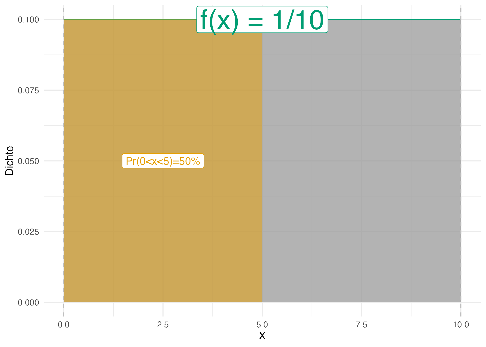{width="40%"}

::: footer
Zufallsvariable
:::

## Wahrscheinlichkeitsdichte {.smaller}

::: {.callout-note title="Definition: Wahrscheinlichkeitsdichte"}
Die Dichte $f(x)$ gibt an, wie viel Wahrscheinlichkeitsmasse pro Einheit von $X$ an der Stelle $x$ liegt.
:::

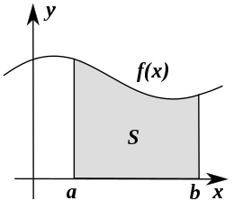{width="18%"}

Für stetige $X$: $Pr(X = x_j) = 0$ für jedes einzelne $x_j$ — praktisch relevant sind **Intervalle**.

::: footer
Zufallsvariable
:::

## Zusammenfassung

- Zufallsvorgang, Ergebnisraum $\Omega$, Ereignis $A \subseteq \Omega$
- Wahrscheinlichkeit: Maß für Plausibilität, immer **bedingt** auf Hintergrundwissen
- Indifferenzprinzip, Laplace, frequentistischer Zugang, Kolmogorov-Axiome
- Relationen: Vereinigung, Schnitt, Komplement, Differenz
- Zufallsvariable: diskret vs. stetig, Verteilung, Dichte

::: footer
Zufallsvariable
:::

## Vielen Dank! {.center}

Fragen?

::: footer
Zufallsvariable
:::

