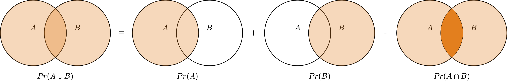
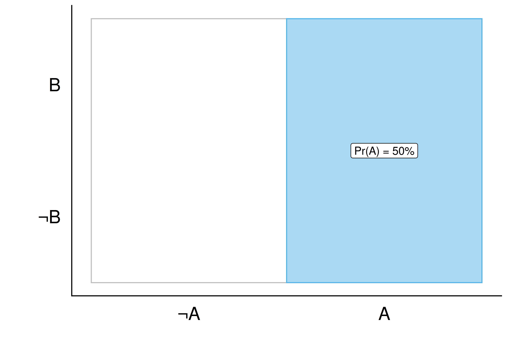
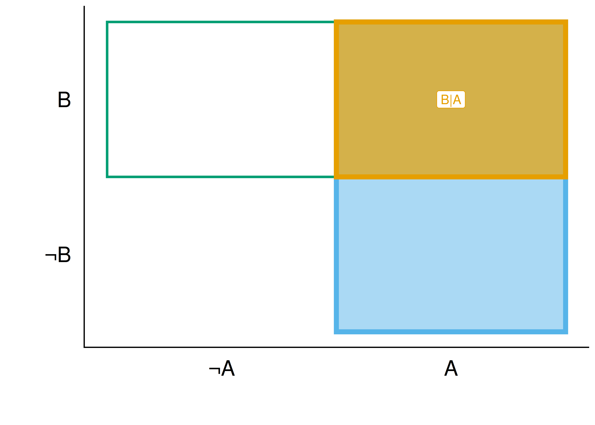
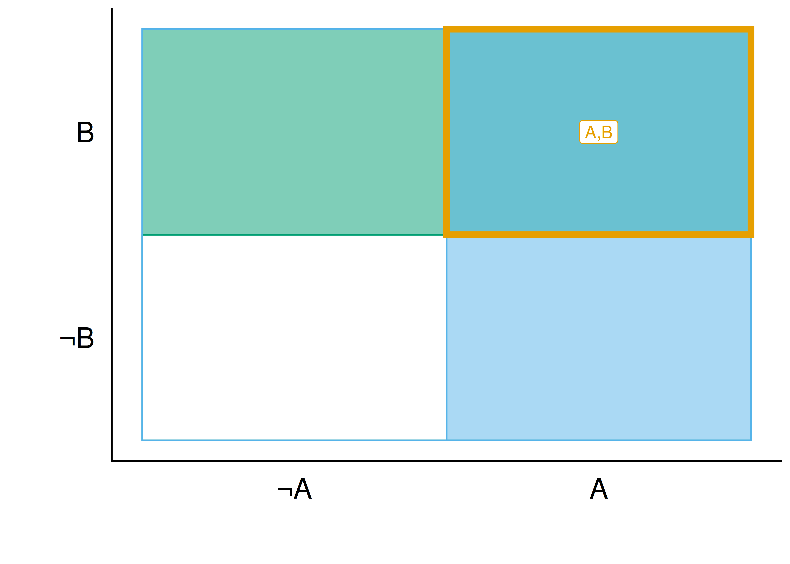
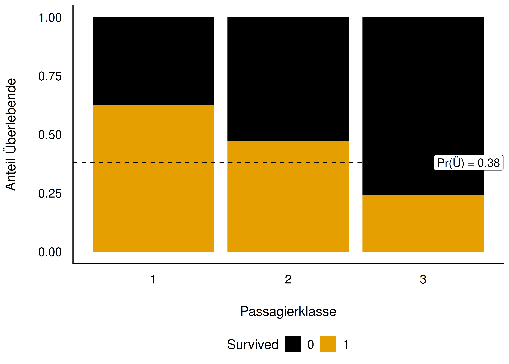
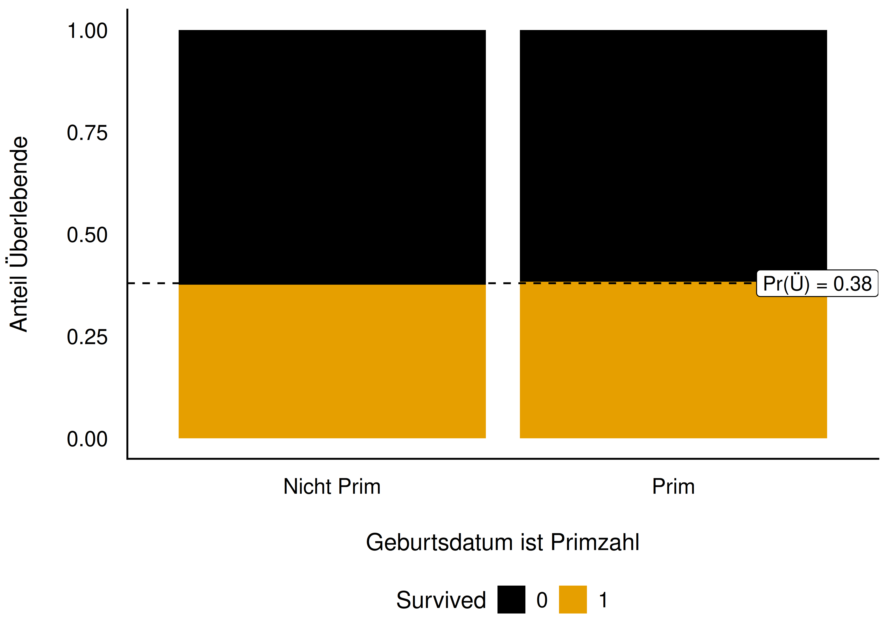
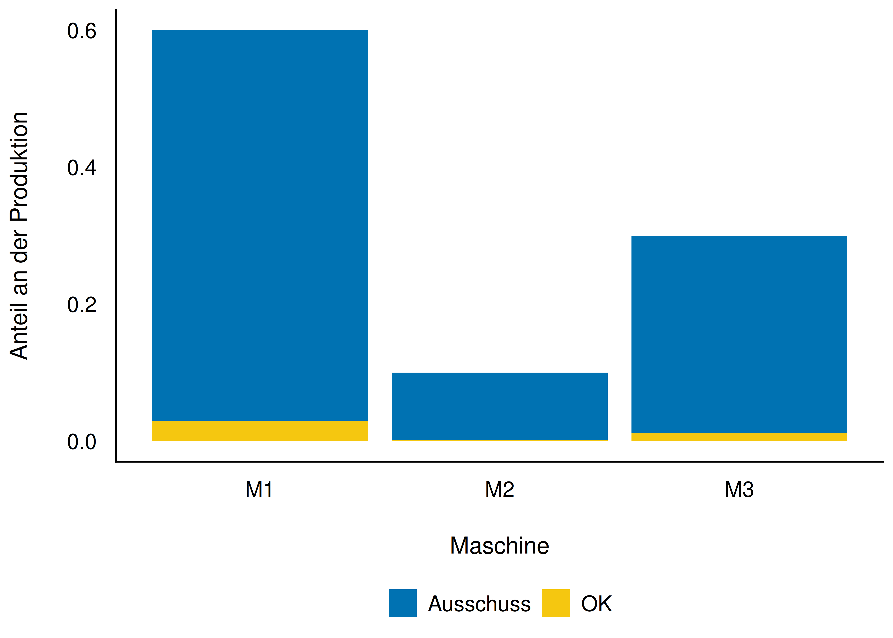

## Rechnen mit Wahrscheinlichkeit

Lernziele: Sie können ...

- die Grundbegriffe der Wahrscheinlichkeitsrechnung erläuternd definieren
- typische Relationen (Operationen) von Ereignissen anhand von Beispielen veranschaulichen
- mit Wahrscheinlichkeiten rechnen

## Überblick

- Wann addiert man Wahrscheinlichkeiten zweier Ereignisse?
- Wann multipliziert man sie?
- Was bedeutet (Un-)Abhängigkeit zweier Ereignisse?

::: {.fragment}
Klingt wild — ist aber oft ganz einfach.
:::

# Additionssatz {.center footer=false}

## Additionssatz — Beispiel {.smaller}

- Würfelwurf: Wahrscheinlichkeit für eine gerade Zahl, $A=\{2,4,6\}$?
- $Pr(\text{gerade Zahl}) = 1/6 + 1/6 + 1/6 = 3/6 = 1/2$

::: {.fragment}
Gezinkter Würfel mit $Pr(\text{6}) = 1/3$: Wie hoch ist die Wahrscheinlichkeit, *keine* 6 zu würfeln? — $2/3$
:::

::: footer
Additionssatz
:::

# Vereinigung von Ereignissen: Additionssatz {.center footer=false}

## Addition disjunkter Ereignisse

- $\Omega = \{1,2,3,4,5,6\}$ beim Würfelwurf
- Gesucht: $Pr(A)$ für $A=\{1,2\}$
- 1 und 2 sind **disjunkt**: wirft man eine 1, hat man keine 2 geworfen

$$Pr(1 \cup 2) = \frac{1}{6} + \frac{1}{6} = \frac{2}{6}$$

::: footer
Vereinigung von Ereignissen: Additionssatz
:::

## Definition: Additionssatz für disjunkte Ereignisse

:::{.callout-note title="Definition: Additionssatz für disjunkte Ereignisse"}
Die Wahrscheinlichkeit, dass mindestens eines der beiden Ereignisse eintritt, ist die Summe der Einzelwahrscheinlichkeiten.

$$Pr(A \cup B) = Pr(A) + Pr(B)$$
:::

Beispiel: An einem Samstag *oder* Sonntag geboren zu sein: $Pr(A) = 1/7 + 1/7 = 2/7$

::: footer
Vereinigung von Ereignissen: Additionssatz
:::

## Addition allgemeiner (nicht-disjunkter) Ereignisse

- Bei nicht disjunkten Ereignissen wird der Schnitt $A \cap B$ bei einfacher Addition **doppelt** gezählt
- Der Überlappungsbereich muss daher abgezogen werden

{width="55%"}

::: footer
Vereinigung von Ereignissen: Additionssatz
:::

## Definition: Allgemeiner Additionssatz

:::{.callout-note title="Definition: Allgemeiner Additionssatz"}
Die Wahrscheinlichkeit, dass mindestens eines der beiden Ereignisse $A$ und $B$ eintritt, ist gleich der Summe ihrer Wahrscheinlichkeiten minus ihrer gemeinsamen Wahrscheinlichkeit.

$$Pr(A \cup B) = P(A) + P(B) - P(A\cap B)$$
:::

::: footer
Vereinigung von Ereignissen: Additionssatz
:::

## Beispiel: Lernen und Klausur bestehen {.smaller}

Daten von 100 Studis (Statistik 1 und 2 bestanden, B, oder nicht, N):

| | S1_B | S1_NB | Summe |
|---|---|---|---|
| S2_B | 85 | 9 | 94 |
| S2_NB | 5 | 1 | 6 |
| Summe | 90 | 10 | 100 |

Mindestens eine der beiden Klausuren bestehen:

::: {style="font-size: 0.7em;"}
$$Pr(A) = Pr(S_1B) + Pr(S_2B) - Pr(S_1B \cap S_2B) = \frac{90+94-85}{100} = \frac{99}{100}$$
:::

::: footer
Vereinigung von Ereignissen: Additionssatz
:::

# Bedingte Wahrscheinlichkeit {.center footer=false}

## Bedingte Wahrscheinlichkeit: Definition

:::{.callout-note title="Definition: Bedingte Wahrscheinlichkeit"}
Die bedingte Wahrscheinlichkeit ist die Wahrscheinlichkeit, dass $A$ eintritt, *gegeben dass* $B$ schon eingetreten ist.
:::

- Schreibweise: $Pr(A|B)$
- Lies: "A gegeben B" oder "A wenn B"

::: footer
Bedingte Wahrscheinlichkeit
:::

## Illustration: unbedingte, gemeinsame, bedingte Wahrscheinlichkeit {.smaller}

::: {layout-ncol=2}
{width="65%"}

{width="65%"}
:::

$Pr(A \cap B)$ (auch $Pr(AB)$) wird analog dargestellt.

::: footer
Bedingte Wahrscheinlichkeit
:::

## Gemeinsame Wahrscheinlichkeit $Pr(A \cap B)$

{width="45%"}

::: footer
Bedingte Wahrscheinlichkeit
:::

## Bedingte Wahrscheinlichkeit — Beispiele

- $A$ = "Schönes Wetter", $B$ = "Klausur steht an": $Pr(A|B)$ ist die Wahrscheinlichkeit für schönes Wetter, wenn eine Klausur ansteht
- Päpste und Männer: $Pr(\text{Papst}|\text{Mann}) \ne Pr(\text{Mann}|\text{Papst})$

::: {.fragment}
**Merke:** Reihenfolge in der bedingten Wahrscheinlichkeit ist wichtig — $Pr(A|B) \ne Pr(B|A)$ im Allgemeinen.
:::

::: footer
Bedingte Wahrscheinlichkeit
:::

## Bedingte Wahrscheinlichkeit als Filtern einer Tabelle

- 4 Tage, jeweils kalt (oder nicht) und Regen (oder nicht)
- Filtert man auf "kalt", gibt der Anteil der Zeilen mit "Regen" die bedingte Wahrscheinlichkeit $Pr(\text{Regen}|\text{kalt})$ an

::: {style="font-size: 0.65em;"}
$$Pr(A) = 2/4;\; Pr(B) = 2/4;\; Pr(A \cap B) = 1/4;\; Pr(A|B) = 1/2$$
:::

::: footer
Bedingte Wahrscheinlichkeit
:::

## Formel: Bedingte Wahrscheinlichkeit

:::{.callout-note title="Satz: Bedingte Wahrscheinlichkeit"}
$$Pr(A|B) = \frac{Pr(A \cap B)}{Pr(B)}$$

Analog gilt: $Pr(B|A) = \dfrac{Pr(B \cap A)}{Pr(A)}$
:::

::: footer
Bedingte Wahrscheinlichkeit
:::

## Beispiel: Bestehen ohne Lernen

Daten von 100 Studis (L = gelernt, NL = nicht gelernt):

| | L | NL | Summe |
|---|---|---|---|
| B | 80 | 1 | 81 |
| NB | 5 | 14 | 19 |
| Summe | 85 | 15 | 100 |

::: {style="font-size: 0.65em;"}
$$Pr(B|\neg L) = \frac{Pr(B \cap \neg L)}{Pr(\neg L)} = \frac{1/100}{15/100} = \frac{1}{15} \approx 7\,\%$$
:::

::: footer
Bedingte Wahrscheinlichkeit
:::

# Stochastische (Un-)Abhängigkeit {.center footer=false}

## Warum ist (Un-)Abhängigkeit wichtig?

In Forschung und Alltag oft von Interesse:

- Lernen und Klausur bestehen
- Rauchen und Lungenkrebs
- Impfung und Infektion
- Werbung und Verkaufserfolg

::: footer
Stochastische (Un-)Abhängigkeit
:::

## Unabhängigkeit — Beispiele

- Regentanz und Regen sind unabhängig
- "Es regnet in Berlin" und "In Tokio fällt eine Münze auf Kopf"
- 10× Kopf hintereinander und der nächste Münzwurf (bei fairer Münze)
- Augenfarbe und Blutgruppe

::: {.fragment}
Unabhängigkeit ist ein *Spezialfall* von Abhängigkeit: viele Arten von Abhängigkeit, aber nur eine Art von Unabhängigkeit — eine *starke* Aussage.
:::

::: footer
Stochastische (Un-)Abhängigkeit
:::

## Definition: Stochastische Unabhängigkeit

:::{.callout-note title="Definition: Stochastische Unabhängigkeit"}
Zwei Ereignisse sind (stochastisch) unabhängig voneinander, wenn die Wahrscheinlichkeit von $A$ nicht davon abhängt, ob $B$ der Fall ist.

$$Pr(A) = Pr(A|B) = Pr(A|\neg B)$$
:::

Setzt man die bedingte Wahrscheinlichkeit ein, folgt:

$$Pr(A \cap B) = Pr(A) \cdot Pr(B)$$

::: footer
Stochastische (Un-)Abhängigkeit
:::

## Titanic-Beispiel {.smaller}

::: {layout-ncol=2}
{width="60%"}

{width="60%"}
:::

- Links: $Pr(Ü|K_1) \ne Pr(Ü|K_2) \ne Pr(Ü|K_3) \ne Pr(Ü)$ — abhängig
- Rechts: $Pr(Ü|P) = Pr(Ü|\neg P) = Pr(Ü)$ — unabhängig

::: footer
Stochastische (Un-)Abhängigkeit
:::

## Definition: Stochastische Abhängigkeit

:::{.callout-note title="Definition: Stochastische Abhängigkeit"}
Liegt keine Unabhängigkeit vor, spricht man von (stochastischer) *Abhängigkeit*.

$$Pr(A|B) \ne Pr(A) \ne Pr(A|\neg B)$$
:::

Beispiel: "Lernen" und "Klausur bestehen" sind abhängig — unsere Einschätzung zu $Pr(K)$ ändert sich, je nachdem ob $L$ vorliegt oder nicht.

::: footer
Stochastische (Un-)Abhängigkeit
:::

## Unabhängigkeit ist symmetrisch

$$Pr(A|B) = Pr(A) \;\leftrightarrow\; Pr(B|A) = Pr(B)$$

::: {.fragment}
**Achtung:** Stochastische Unabhängigkeit und *kausale* Unabhängigkeit sind unterschiedliche Dinge [@henze2019] — stochastische Unabhängigkeit impliziert *nicht* kausale Unabhängigkeit.
:::

::: footer
Stochastische (Un-)Abhängigkeit
:::

# Wahrscheinlichkeit gemeinsamer Ereignisse: Multiplikationssatz {.center footer=false}

## Multiplikationssatz — gemeinsame Wahrscheinlichkeit {.smaller}

- Interessiert an der Wahrscheinlichkeit, dass **beide** Ereignisse $A$ und $B$ eintreten
- Schreibweise: $A \cap B$ ("A und B") bzw. $AB$

Beispiel Regen/Kälte:

- $Pr(K|R)$: Wahrscheinlichkeit für Kälte, *gegeben* dass es regnet
- $Pr(K \cap R)$: Wahrscheinlichkeit, dass es *gleichzeitig* kalt ist und regnet

::: footer
Wahrscheinlichkeit gemeinsamer Ereignisse: Multiplikationssatz
:::

## Zweifacher Münzwurf: Baumdiagramm

```{mermaid}
flowchart TD
    A[Start] --1/2--> B1[T]
    A --1/2--> B2[N]
    B1 --1/2--> C1[TT - 1/4]
    B1 --1/2--> C2[TN - 1/4]
    B2 --1/2--> C3[NT - 1/4]
    B2 --1/2--> C4[NN - 1/4]
```

Knoten = Ergebnisse, Kanten = Wahrscheinlichkeiten, Blätter = Endresultate, Pfad = Weg vom Start zu einem Blatt.

::: footer
Wahrscheinlichkeit gemeinsamer Ereignisse: Multiplikationssatz
:::

## Formel: Multiplikationssatz (unabhängige Ereignisse)

:::{.callout-note title="Satz: Multiplikationssatz für unabhängige Ereignisse"}
$$Pr(A \cap B) = Pr(A) \cdot Pr(B)$$

Symmetrie: $Pr(A \cap B) = Pr(B \cap A)$
:::

Beispiel: $Pr(K_1 \cap K_2) = 1/2 \cdot 1/2 = 1/4$ (2× Kopf bei fairer Münze)

::: footer
Wahrscheinlichkeit gemeinsamer Ereignisse: Multiplikationssatz
:::

## Gemeinsame Wahrscheinlichkeit abhängiger Ereignisse {.smaller}

Urne mit 5 Kugeln (4 rot, 1 blau), Ziehen *ohne Zurücklegen*:

::: {style="zoom: 0.7;"}
```{mermaid}
flowchart LR
  A[Start] -->|4/5|B[Zug 1: A]
  A -->|1/5|C[Zug 1: nA]
  B -->|3/4|D[Zug 2: B]
  B -->|1/4|E[Zug 2: nB]
  D --- H["AB: 4/5·3/4=12/20"]
  E --- I["AnB: 4/5·1/4=4/20"]
  C -->|4/4|F[Zug 2: B]
  C -->|0/4|G[Zug 2: nB]
  F --- J["nAB: 1/5·4/4=4/20"]
  G --- K["nAnB: 0/20"]
```
:::

$$Pr(A\cap B) = P(A) \cdot P(B|A) = 4/5 \cdot 3/4 = 3/5$$

::: footer
Wahrscheinlichkeit gemeinsamer Ereignisse: Multiplikationssatz
:::

## Formel: Gemeinsame Wahrscheinlichkeit (allgemein)

:::{.callout-note title="Satz: Gemeinsame Wahrscheinlichkeit"}
Die Wahrscheinlichkeit, dass zwei abhängige Ereignisse $A$ und $B$ *gemeinsam* eintreten, ist das Produkt der Wahrscheinlichkeit von $A$ und der bedingten Wahrscheinlichkeit von $B$ gegeben $A$.

$$Pr(A \cap B) = Pr(A) \cdot Pr(B|A)$$
:::

Bei Unabhängigkeit vereinfacht sich das zu $Pr(A) \cdot Pr(B)$.

::: footer
Wahrscheinlichkeit gemeinsamer Ereignisse: Multiplikationssatz
:::

## Kettenregel

:::{.callout-note title="Definition: Kettenregel"}
Man spricht von der *Kettenregel*, wenn man die gemeinsame Wahrscheinlichkeit auf die bedingte zurückführt.

$$Pr(A\cap B) = P(A) \cdot P(B|A) = P(B) \cdot P(A|B)$$
:::

::: footer
Wahrscheinlichkeit gemeinsamer Ereignisse: Multiplikationssatz
:::

## Beispiel: Bertie Botts Bohnen

- 20 Bohnen, davon 2 "scheußlich"; 2 Bohnen ziehen (ohne Zurücklegen)
- Gesucht: *genau eine* scheußliche Bohne

```{mermaid}
graph LR
    A[Start: 20 Bohnen] -- 18/20 --> B1[Bohne 1 gut]
    A -- 2/20 --> B2[Bohne 1 schlecht]
    B1 -- 2/19 --> C2[Bohne 2 schlecht]
    B2 -- 18/19 --> C3[Bohne 2 gut]
```

- Pfad 1 (schlecht, dann gut) + Pfad 2 (gut, dann schlecht) = Wahrscheinlichkeit für genau eine schlechte Bohne ≈ 19 %

::: footer
Wahrscheinlichkeit gemeinsamer Ereignisse: Multiplikationssatz
:::

# Totale Wahrscheinlichkeit {.center footer=false}

## Totale Wahrscheinlichkeit — Beispiel {.smaller}

3 Maschinen produzieren einen Artikel (Anteil 60/10/30 %), mit Ausschussquote 5/2/4 %.

::: {style="zoom: 0.7;"}
```{mermaid}
flowchart LR
  A[Start] -->|0.6|B[M1]
  A -->|0.1|C[M2]
  A -->|0.3|D[M3]
  B -->|0.05|E[S]
  B -.->|0.95|F[Nicht-S]
  C -->|0.02|G[S]
  C -.->|0.98|H[Nicht-S]
  D -->|0.04|I[S]
  D -.->|0.96|J[Nicht-S]
```
:::

::: footer
Totale Wahrscheinlichkeit
:::

## Totale Wahrscheinlichkeit — Rechnung {.smaller}

{width="42%"}

::: {style="font-size: 0.75em;"}
$$Pr(S') = 0.6 \cdot 0.05 + 0.1 \cdot 0.02 + 0.3 \cdot 0.04 = 0.044 = 4{,}4\,\%$$
:::

::: footer
Totale Wahrscheinlichkeit
:::

## Formel: Totale Wahrscheinlichkeit

:::{.callout-note title="Satz: Totale Wahrscheinlichkeit"}
Bilden die Ereignisse $M_1, M_2, \dots, M_n$ ein vollständiges Ereignissystem und ist $S$ ein beliebiges Ereignis, dann gilt:

$$Pr(S') = \sum_{i=1}^n Pr(M_i) \cdot Pr(S|M_i)$$
:::

In Worten: Die totale Wahrscheinlichkeit ist die Summe der gewichteten Teil-Wahrscheinlichkeiten.

::: footer
Totale Wahrscheinlichkeit
:::

## Zusammenfassung {.smaller}

- **Additionssatz**: $Pr(A \cup B) = Pr(A) + Pr(B) - Pr(A\cap B)$ ("mindestens eines von A, B")
- **Bedingte Wahrscheinlichkeit**: $Pr(A|B) = \dfrac{Pr(A \cap B)}{Pr(B)}$
- **(Un-)Abhängigkeit**: $Pr(A) = Pr(A|B)$ bei Unabhängigkeit
- **Multiplikationssatz / Kettenregel**: $Pr(A \cap B) = Pr(A) \cdot Pr(B|A)$ ("beide von A, B")
- **Totale Wahrscheinlichkeit**: gewichtete Summe über ein vollständiges Ereignissystem

::: footer
Totale Wahrscheinlichkeit
:::

## Vielen Dank! {.center}

Fragen?

::: footer
Totale Wahrscheinlichkeit
:::

