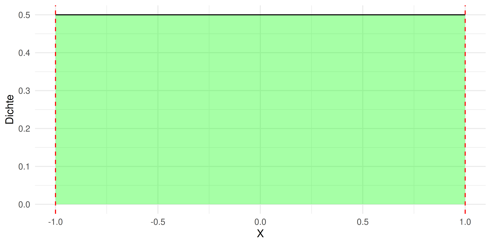
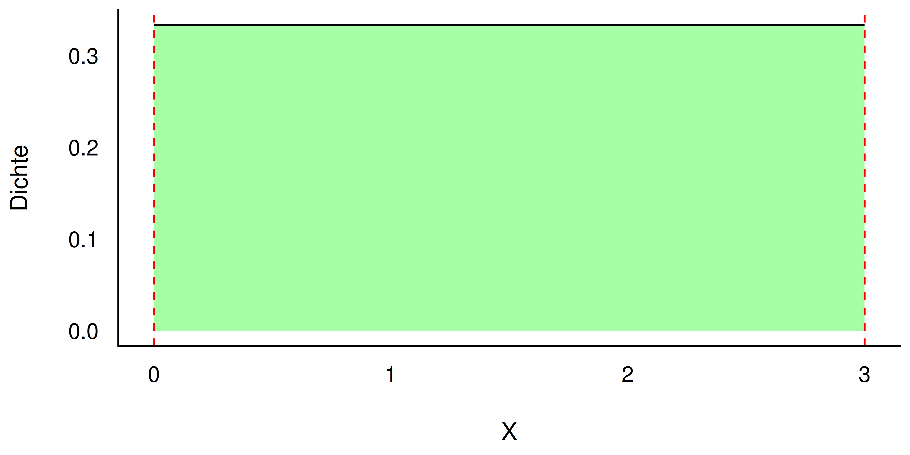
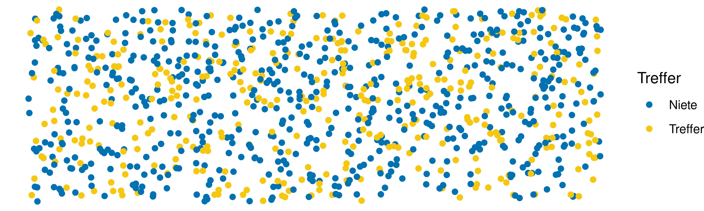
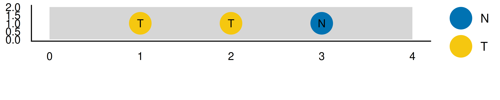
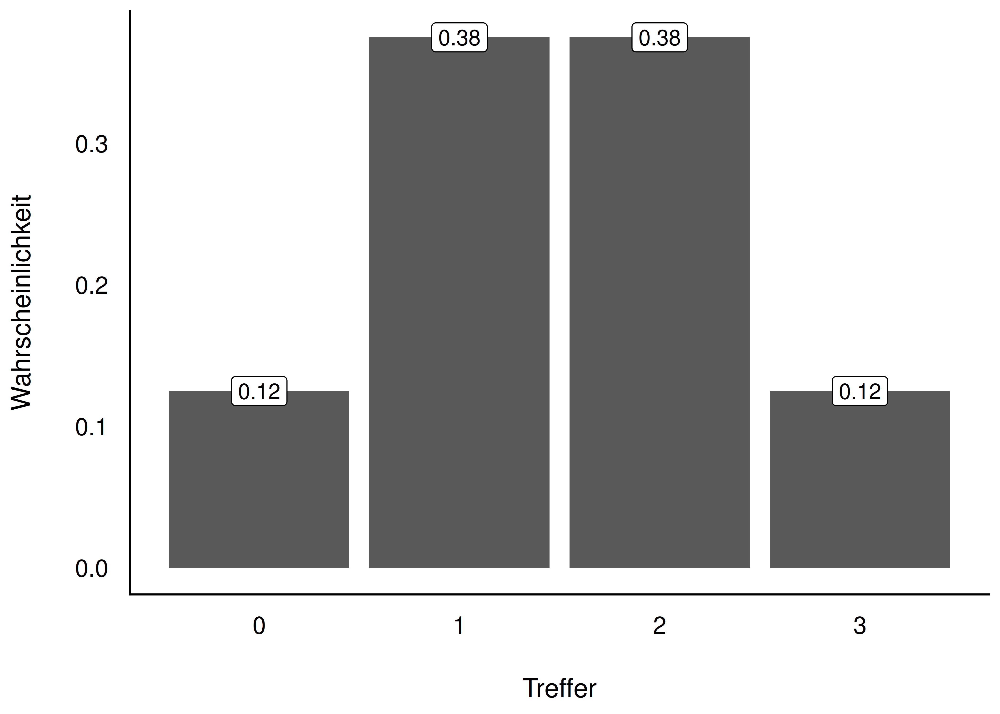
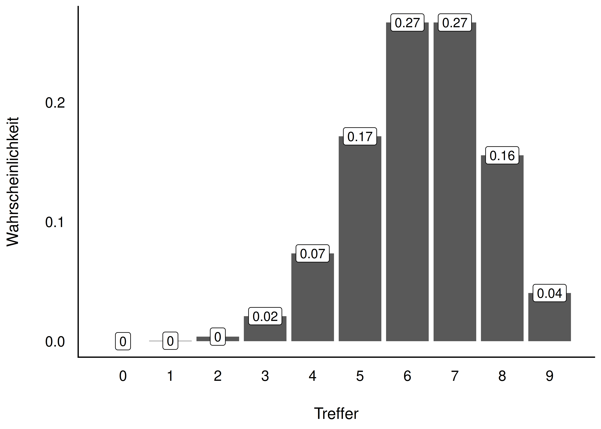
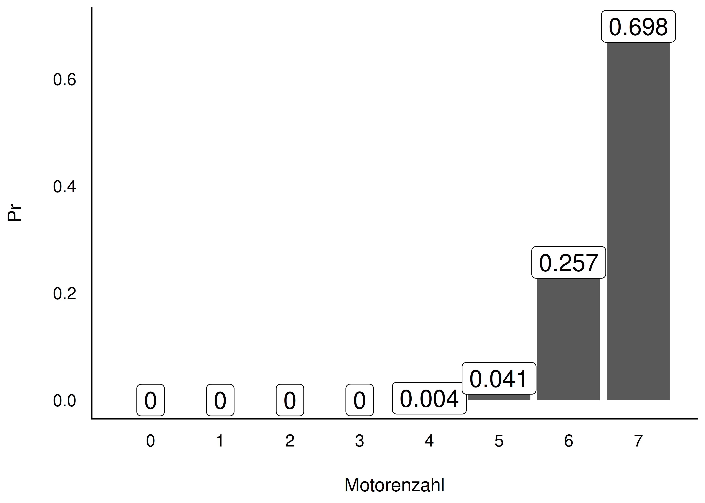
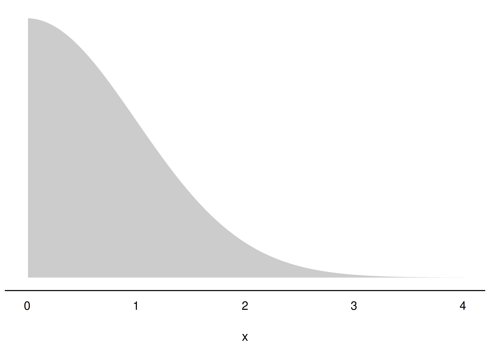
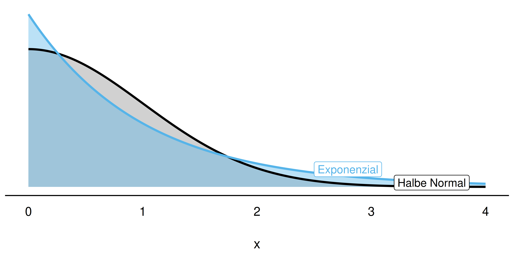
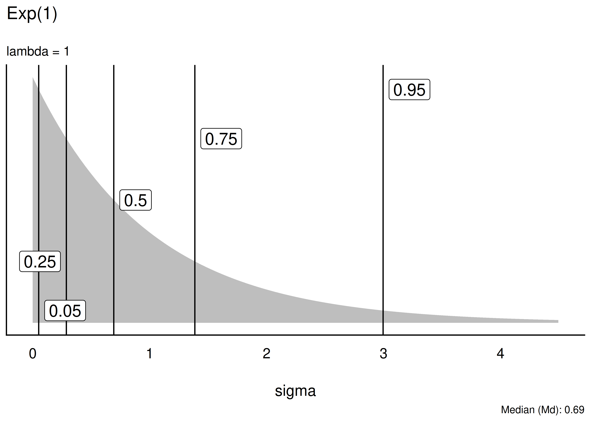

## Lernziele

Nach diesem Kapitel können Sie ...

- den Begriff der Zufallsvariablen erläutern
- Wahrscheinlichkeitsdichte und Verteilungsfunktion erläutern
- die Gleichverteilung erläutern
- die Binomialverteilung erläutern
- die halbe Normalverteilung erläutern
- die Exponentialverteilung erläutern
- zentrale Konzepte in R umsetzen

## Zentrale Begriffe

**Zufallsvariable (random variable)**

- diskret vs. stetig
- **Wahrscheinlichkeitsdichte**: $f$, (probability) density
- **Wahrscheinlichkeitsfunktion**: kumulierte Wahrscheinlichkeit, Wahrscheinlichkeitsmasse

::: {.fragment}
Wichtige Verteilungen: Gleichverteilung, Normalverteilung, Standardnormalverteilung
:::

## Wichtige Verteilungen — Überblick

In diesem Kapitel lernen wir vier zentrale Verteilungen kennen:

1. **Gleichverteilung** — Indifferenz, alles gleich wahrscheinlich
2. **Binomialverteilung** — Anzahl Treffer bei $n$ Wiederholungen
3. **Halbe Normalverteilung** — nur positive Werte
4. **Exponentialverteilung** — Alternative zur halben NV

# Gleichverteilung

## Gleichverteilung — Indifferenz als Grundlage

- Jede Ausprägung der Zufallsvariablen ist **gleichwahrscheinlich**
- Passend, wenn kein Grund besteht, eine Ausprägung für plausibler zu halten als eine andere
- Gibt es diskret **und** stetig

::: {.fragment}
**Definierendes Kennzeichen:** die *konstante Dichte*
:::

## Gleichverteilung — Beispiel

{width="45%"} {width="45%"}

- links: min = -1, max = 1, Dichte $=1/2$ — bei $X=0$ hat eine Einheit (-1 bis 0) 50 % Wahrscheinlichkeitsmasse
- rechts: min = 0, max = 3, Dichte $=1/3$ — jede Einheit hat ca. 33 % Wahrscheinlichkeitsmasse

# Binomialverteilung

## Definition: Binomialverteilung

::: {.callout-note title="Definition: Binomialverteilung"}
Stellt die Wahrscheinlichkeit der Ergebnisse eines $n$-fach wiederholten binomialen Zufallsexperiments dar (zwei Elementarereignisse).

- interessiert: nur die *Anzahl* der $k$ Treffer, nicht die Reihenfolge
- Trefferwahrscheinlichkeit $p$ bleibt über alle Wiederholungen gleich (Ziehen mit Zurücklegen)
- Ergebnisse sind unabhängig voneinander (iid)
:::

## Notation

$$\overbrace{X}^{\text{Zufallsvariable}} \underbrace{\sim}_{\text{ist verteilt nach}} \underbrace{\overbrace{\text{Bin}(n, p)}^{\text{Binomialverteilung}}}_{\text{mit Parametern } n, p}$$

::: {.fragment}
$$X \sim \text{Bin}(n, k)$$
:::

::: {.fragment}
**Anwendungsbeispiele:** defekte Schrauben, Wirkung eines Medikaments, Zustimmung in einer Umfrage, Würfelwürfe, faire/unfaire Münze
:::

## Beispiel: Das Loskästchen

{width="55%"}

- Kästchen mit sehr vielen Losen: 2/5 Treffer (T), 3/5 Nieten (N)
- Ziehen mit Zurücklegen — Trefferwahrscheinlichkeit ändert sich praktisch nicht
- Frage: Wie wahrscheinlich sind bei 3 Zügen genau 2 Treffer?

## Möglichkeiten zählen: 3 Lose, 2 Treffer

{width="60%"}

| Pfad | Treffer | Wahrscheinlichkeit |
|---|---|---|
| TTT | 3 | $p^3 \approx 0.064$ |
| TTN, TNT, NTT | 2 | $p^2 q \approx 0.096$ (je) |
| TNN, NTN, NNT | 1 | $p q^2 \approx 0.144$ (je) |
| NNN | 0 | $q^3 \approx 0.216$ |

## Anzahl Pfade mal Pfad-Wahrscheinlichkeit

- Wahrscheinlichkeit *eines* günstigen Pfades: $Pr(A) = p^2 \cdot q^1 = \left(\tfrac{2}{5}\right)^2 \cdot \left(\tfrac{3}{5}\right)^1 \approx 0.096$
- 3 günstige Pfade ohne Beachtung der Reihenfolge: TTN, TNT, NTT

::: {.fragment}
$$Pr(A') = k \cdot Pr(A) = 3 \cdot 0.096 = 0.29$$
:::

::: {.fragment}
Die Wahrscheinlichkeit, bei 3 Zügen 2 Treffer zu erzielen, beträgt ca. **29 %**.
:::

## Formel der Binomialverteilung

::: {.callout-note title="Theorem: Binomialverteilung"}
$$Pr(X=k|p,n) = \frac{n!}{k!(n-k)!}p^k(1-p)^{n-k}$$

$$Pr(X=k|p,n) = \underbrace{\binom{n}{k}}_{\text{Anzahl Pfade}} \cdot \underbrace{p^k(1-p)^{n-k}}_{\text{Pfad-Wahrscheinlichkeit}}$$
:::

Übersetzung: Wahrscheinlichkeit = Anzahl der günstigen Pfade **mal** Wahrscheinlichkeit eines günstigen Pfades.

## Definition: Binomialkoeffizient

::: {.callout-note title="Definition: Binomialkoeffizient"}
Gibt an, auf wie vielen verschiedenen Arten man aus $n$ Objekten $k$ Objekte ziehen kann (ohne Zurücklegen, ohne Beachtung der Reihenfolge).
:::

$$\binom{n}{k}= \frac{n!}{k!\cdot (n-k)!}$$

Lies: "Wähle aus $n$ möglichen Ereignissen $k$ günstige Ereignisse" — "k aus n" bzw. "n über k"

## Fakultät

Man multipliziert alle natürlichen Zahlen von der gegebenen Zahl bis 1 herunter.

- $1! = 1$
- $3! = 3 \cdot 2 \cdot 1 = 6$
- $4! = 4 \cdot 3 \cdot 2 \cdot 1 = 24$
- $0! = 1$ (per Definition)

In R: `factorial()` für die Fakultät, `choose()` für den Binomialkoeffizienten

## Beispiel: 2 von 4 Freunden auswählen

- 2 freie Plätze im Auto, 4 Freunde wollen mitfahren
- Alle 4 wählen: $4! = 24$ Möglichkeiten
- Nur 2 von 4 (Reihenfolge zählt): $\frac{4!}{2!} = 12$
- Reihenfolge egal ("AB" = "BA"): durch $2!$ teilen

::: {.fragment}
$$\binom{4}{2} = \frac{4!}{2! \cdot 2!} = 6$$

6 mögliche Mitfahrer-Kombinationen: AB, AC, AD, BC, BD, CD
:::

## Weitere Beispiele: Binomialkoeffizient

**Lotto (6 aus 49):**

$$\binom{49}{6}= 13\,983\,816 \text{ Zahlenkombinationen}$$

**Beförderung (11 aus 25 Personen):**

$$\binom{25}{11} = \frac{25!}{11!\cdot(25-11)!} = 4\,457\,400 \text{ Kombinationen}$$

## Rechnen mit der Binomialverteilung in R

- `dbinom(x, size, prob)` — Wahrscheinlichkeits*d*ichte/-funktion: $Pr(X = x)$
- `pbinom(q, size, prob)` — Verteilungsfunktion (kumuliert): $Pr(X \le q)$
- `choose(n, k)` — Binomialkoeffizient
- `factorial(n)` — Fakultät

::: {.fragment}
Beispiel: `dbinom(x = 2, size = 3, prob = 2/5)` — Wahrscheinlichkeit für 2 Treffer bei 3 Zügen, $p = 2/5$
:::

## Beispiel: Klausur mit 20 Richtig-Falsch-Fragen

Wie wahrscheinlich ist es, durch bloßes Raten *genau* 15 von 20 Fragen richtig zu haben?

```r
dbinom(x = 15, size = 20, prob = .5)
# ≈ 0.01 (ca. 1 %)
```

Wie wahrscheinlich sind *höchstens* 15 Treffer?

```r
pbinom(q = 15, size = 20, prob = .5)
# ≈ 0.99 (ca. 99 %)
```

## Beispiel: Münzwürfe mit der Binomialverteilung {.smaller}

{width="38%"} {width="38%"}

- 3 Münzwürfe, genau 3× Kopf: $Pr(X=3) = (1/2)^3 = 0.125$
- Ist die Binomialverteilung symmetrisch? Ändert sich die Wahrscheinlichkeit linear?

## Beispiel: Pumpstation {.smaller}

- 7 Motoren, je 5 % Ausfallwahrscheinlichkeit pro Tag
- Betrieb läuft weiter, solange **mindestens 5** Motoren arbeiten
- Frage: Wie hoch ist die Wahrscheinlichkeit eines Ausfalls?

{width="45%"}

## Pumpstation — Rechnung

::: {style="font-size: 0.75em;"}
$$Pr(X\ge 5) = Pr(X=5) + Pr(X=6) + Pr(X=7) \approx 0.996$$
:::

Komplementäres Ereignis (Ausfall, höchstens 4 Motoren):

::: {style="font-size: 0.75em;"}
$$Pr(\bar{X}) = 1 - Pr(X) \approx 0.004$$
:::

::: {.fragment}
Die Wahrscheinlichkeit eines Ausfalls liegt bei ca. **0,4 %**. Alternativ direkt: `pbinom(q = 4, size = 7, prob = .95)`
:::

# Halbe Normalverteilung

## Die halbe Normalverteilung {.smaller}

{width="30%"}

::: {.callout-note title="Definition: Halbe Normalverteilung"}
Ignoriert man die (negativen) Vorzeichen der Normalverteilungswerte, erhält man die halbe Normalverteilung. Man "spiegelt" die negative Seite auf die positive.
:::

- verwendbar, wenn normalverteilte Werte $> 0$ sein müssen
- zwei Parameter: Mittelwert und SD, analog zur Normalverteilung

## Beispiele: Halbe Normalverteilung

- Entfernung eines Dart-Pfeils zur Mitte der Zielscheibe
- Entfernung des vom Baum gefallenen Apfels zum Stamm
- Abweichung des Gewichts eines Produkts vom Soll-Gewicht
- Reaktionszeiten einer Versuchsperson

# Exponentialverteilung

## Die Exponentialverteilung

- Alternative zur halben Normalverteilung
- Ähnlicher Verlauf, aber: Extremwerte sind **wahrscheinlicher**
- Vorteilhaft, wenn die Skalierung eines Phänomens unklar ist

$$X \sim \operatorname{Exp}(1)$$

## Exponentialverteilung vs. halbe Normalverteilung

{width="60%"}

Die Normalverteilung setzt der Streuung engere Grenzen als die Exponentialverteilung.

## Eigenschaften der Exponentialverteilung

1. nur für positive Werte $x > 0$ definiert
2. steigt $X$ um eine Einheit, ändert sich $Y$ um einen **konstanten Faktor**
3. ein Parameter: **Rate** $\lambda$ ("lambda")
4. $\frac{1}{\lambda}$ gibt gleichzeitig Mittelwert und Streuung an
5. größeres $\lambda$ → schnellerer "Verfall", kleinere Streuung/Mittelwert (und umgekehrt)

## Verschiedene Exponentialverteilungen {.smaller}

{width="35%"}

- Unterschiede zwischen Exponentialverteilungen kommen nur durch $\lambda$ zustande
- in R: `qexp(p, rate)` für Quantile, `pexp()` für die Verteilungsfunktion

::: {.fragment}
z. B. `qexp(p = .5, rate = 1/8)` ≈ 5,5 — der Median dieser Verteilung
:::

## Verteilung wählen: ein Merksatz

::: {.callout-note}
Eine "gut passende" oder gar "richtige" Verteilung zu finden, ist nicht immer einfach. Im Zweifel lieber eine **liberalere** Verteilung wählen, die einen breiteren Raum an möglichen Werten zulässt — aber Extremwerte, die unrealistisch sind, sollte man trotzdem ausschließen.
:::

## Zusammenfassung {.smaller}

- **Gleichverteilung**: alle Ausprägungen gleich wahrscheinlich, konstante Dichte
- **Binomialverteilung**: $Pr(X=k|p,n) = \binom{n}{k}p^k(1-p)^{n-k}$ — Anzahl Treffer bei $n$ Wiederholungen
- **Halbe Normalverteilung**: nur positive Werte, gespiegelte Normalverteilung
- **Exponentialverteilung**: Alternative zur halben NV, ein Parameter $\lambda$, extremere Werte möglich

## Vielen Dank! {.center}

Fragen?
