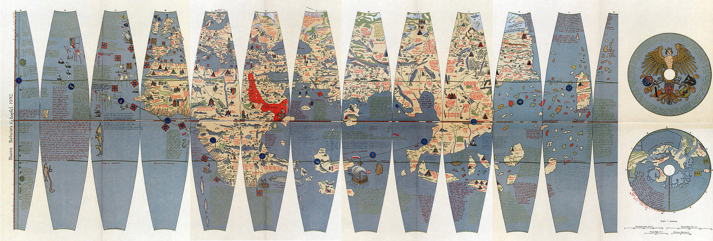
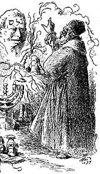
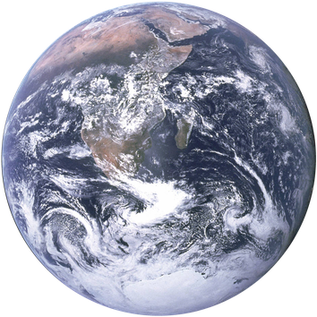
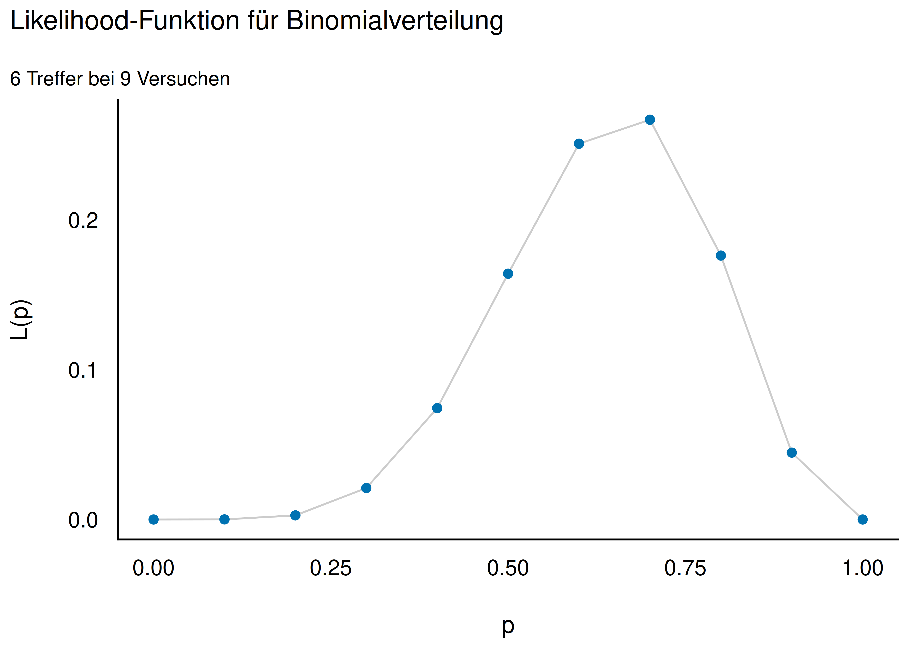
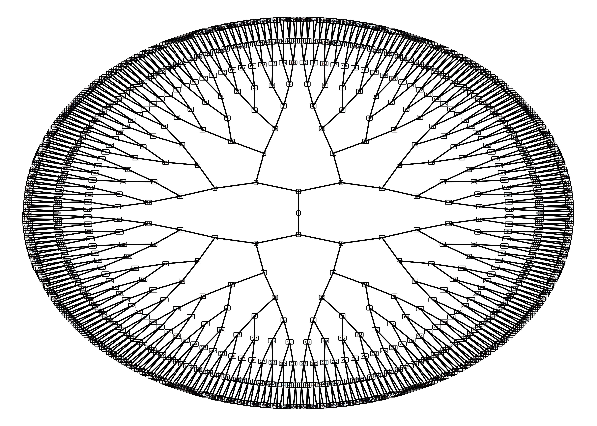
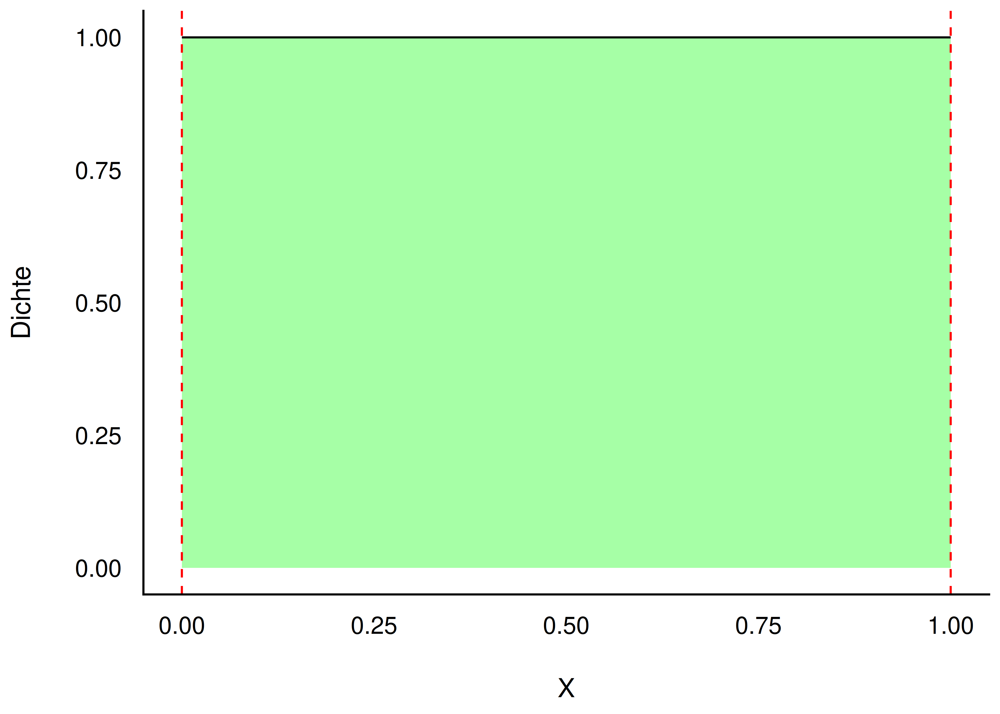
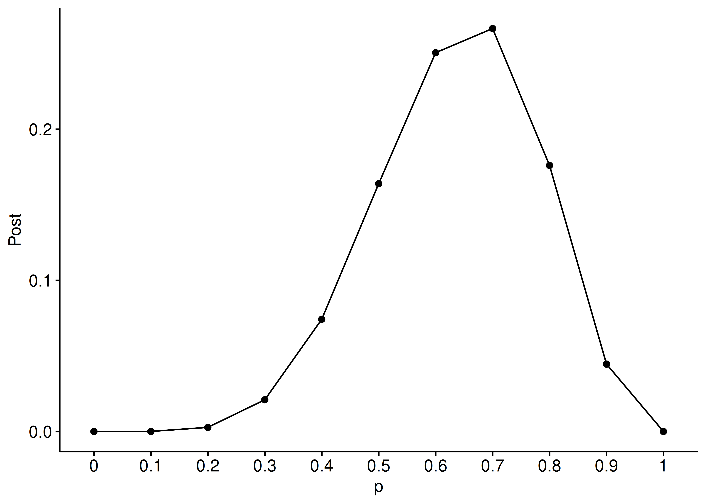
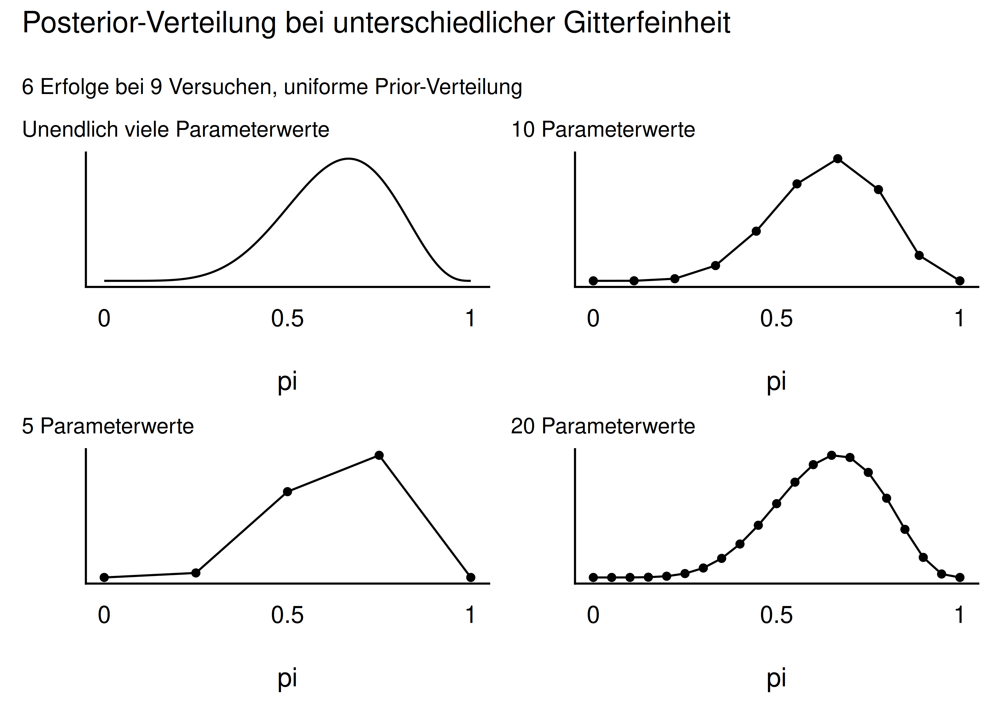

## Der Globus-Versuch

Wie übersetzen wir eine Forschungsfrage in ein (mathematisches) Modell,
das uns mit der Bayes-Formel Antworten liefert?

## Lernziele {.smaller}

Nach diesem Kapitel können Sie ...

- Unterschiede zwischen Modell und Realität erläutern
- die Binomialverteilung heranziehen, um einfache Modelle zu erstellen
- die weite Einsetzbarkeit anhand mehrerer Beispiele zeigen
- das Bayes-Modell anhand bekannter Formeln herleiten
- Post-Wahrscheinlichkeiten mit der Bayesbox berechnen

# Von Welten und Golems {.center footer=false}

## Kleine Welt, große Welt

{width="45%"}

- Kolumbus segelte 1492 los — auf seinem Globus existierte Amerika gar nicht
- Die *kleine Welt des Modells* entsprach nicht *der großen Welt*

::: {.callout-note title="Merksatz"}
Was in der kleinen Welt (dem Modell) funktioniert, muss nicht in der großen Welt (der Wirklichkeit) funktionieren.
:::

::: footer
Von Welten und Golems
:::

## Der Golem als Sinnbild für Modelle {.smaller}

{width="14%"}

- Golem: mächtige, aber dumme Kreatur — führt Befehle wörtlich aus
- Wissenschaftliche Modelle sind ähnlich: mächtig, aber simpler als die Realität, Missbrauch leicht möglich

::: {.callout-note title="Merksatz"}
Wir bauen Golems: Modelle, die Befehle (Annahmen) wörtlich umsetzen — nicht mehr, nicht weniger.
:::

::: footer
Von Welten und Golems
:::

## Kleine Welt vs. große Welt

| Kleine Welt | Große Welt |
|---|---|
| Die Welt, wie sie der Golem (das Modell) sieht | Die Welt, wie sie wirklich ist |
| ist das Modell, nicht zwangsläufig die Wirklichkeit | entspricht nicht zwangsläufig dem Modell |
| Verwenden wir beim Modellieren | Ist das, was wir modellieren |

::: footer
Von Welten und Golems
:::

# Ein erster Versuch: Wir werfen den Globus {.center footer=false}

## Forschungsfrage: Wasseranteil der Erde {.smaller}

{width="18%"}

- Wie hoch ist der Wasseranteil $\pi$ auf der Erdoberfläche?
- Versuch: Globusball werfen, auffangen, notieren: Wasser (W) oder Land (L)
- 9 Würfe, Ergebnis:

$$W \quad L \quad W \quad W \quad W \quad L \quad W \quad L \quad W$$

Also $W = 6$ Treffer, $L = 3$ Nieten, $n = 9$ Versuche.

::: footer
Ein erster Versuch: Wir werfen den Globus
:::

## Das Prinzip: Bayes-Update

Der Bayes-Golem denkt vernünftig:

1. **Apriori**: Vorwissen zum Wasseranteil (hier: alle Werte gleich plausibel)
2. **Likelihood**: Wie wahrscheinlich sind die Daten unter einer Hypothese?
3. **Aposteriori**: abschließende, aktualisierte Meinung

```{mermaid}
graph LR
A[Apriori-Vert.]-->B[Likelihood]-->C[Post-Vert.]-->A
```

::: footer
Ein erster Versuch: Wir werfen den Globus
:::

## Definition: Apriori-Verteilung

::: {.callout-note title="Definition: Apriori-Verteilung"}
Für jede Hypothese haben wir ein Vorab-Wissen, das die jeweilige Plausibilität der Hypothese angibt: die *Apriori-Verteilung* (auch: Priori-Verteilung, Prior).
:::

::: footer
Ein erster Versuch: Wir werfen den Globus
:::

## Definition: Likelihood

::: {.callout-note title="Definition: Likelihood"}
Für jede Hypothese (jeden Parameterwert $\pi$) gibt die *Likelihood* an, wie wahrscheinlich die Daten sind, unter der Annahme, dass die Hypothese richtig ist. Kurz: wie gut die Daten zur Hypothese passen.
:::

::: footer
Ein erster Versuch: Wir werfen den Globus
:::

## Definition: Aposteriori-Verteilung

::: {.callout-note title="Definition: Aposteriori-Verteilung"}
Gewichtet man die Likelihood mit dem Vorabwissen, erhält man die *Aposteriori-Verteilung* (kurz "Post-Verteilung"), $Pr(H|D)$: "Wahrscheinlichkeit der Hypothese H gegeben der Daten D."
:::

::: footer
Ein erster Versuch: Wir werfen den Globus
:::

## Likelihood berechnen {.smaller}

- Wie wahrscheinlich ist $W=6$ Treffer bei $n=9$ Würfen, gegeben einer Hypothese $\pi$?
- Annahme: Binomialverteilung (iid: unabhängige, identisch verteilte Würfe)

$$
\begin{aligned}
Pr(\pi = 1/2\mid x = 6, n = 9) &= \tbinom{9}{6} \cdot (1/2)^6 \cdot (1/2)^3 \\
&= 84 \cdot 1/512 = 0.16
\end{aligned}
$$

{width="35%"}

::: footer
Ein erster Versuch: Wir werfen den Globus
:::

## Likelihood für verschiedene Hypothesen

- $\pi = .7$: $\binom{9}{6}\cdot(.7)^6\cdot(.3)^3 = 0.267$ — Daten passen gut
- $\pi = 1/3$: deutlich kleiner — schlechte Hypothese
- $\pi = 0$: Likelihood $= 0$ — Daten sind unmöglich unter dieser Hypothese

::: {.callout-note title="Merksatz"}
Je höher die Likelihood, desto besser passt die Hypothese zu den beobachteten Daten.
:::

::: footer
Ein erster Versuch: Wir werfen den Globus
:::

## Warum nicht per Baumdiagramm?

{width="45%"}

Für $n=9$ Würfe wird ein Baumdiagramm (512 Endknoten) schnell unübersichtlich — die Binomialverteilung übernimmt diese Arbeit kompakt.

::: footer
Ein erster Versuch: Wir werfen den Globus
:::

## Unser Modell ist geboren

Ein Bayes-Modell besteht aus mindestens drei Komponenten:

1. **Likelihood**: Wahrscheinlichkeit der Daten unter der Hypothese
2. **Apriori-Verteilung(en)**: Wahrscheinlichkeit der Hypothese vor den Daten
3. **Aposteriori-Verteilung**: Wahrscheinlichkeit der Hypothese nach den Daten

::: footer
Ein erster Versuch: Wir werfen den Globus
:::

## Apriori-Verteilung im Beispiel

$$\pi \sim \text{Unif}(0,1)$$

- Alle Werte von $\pi$ erscheinen uns gleich plausibel ("uniform")
- Kein Vorwissen: apriori indifferent

{width="40%"}

::: footer
Ein erster Versuch: Wir werfen den Globus
:::

# Bayes' Theorem {.center footer=false}

## Die Formel von Bayes' Theorem

::: {.callout-note title="Theorem: Bayes' Theorem"}
$$
Pr(H|D) = \frac{ Pr(H) \cdot Pr(D|H) }{Pr(D)} = \frac{\text{Apriori} \cdot \text{Likelihood}} {\text{Evidenz}}
$$
:::

**Frage**: Was ist die Wahrscheinlichkeit der Hypothese H, jetzt wo wir die Daten kennen?

**Antwort**: Apriori-Wahrscheinlichkeit mal Likelihood, standardisiert durch die Evidenz.

::: footer
Bayes' Theorem
:::

## Definition: Evidenz

::: {.callout-note title="Definition: Evidenz"}
$Pr(D)$ heißt *Evidenz*: die Summe der Likelihoods über alle Parameterwerte (Hypothesen) $H_i$, gewichtet mit ihrer Apriori-Wahrscheinlichkeit.

$$Pr(D) = \sum_{i=1}^n Pr(D|H_i) \cdot Pr(H_i)$$
:::

Die Evidenz sorgt nur dafür, dass $Pr(H|D)$ zwischen 0 und 1 liegt.

::: footer
Bayes' Theorem
:::

## Post = Priori × Likelihood

$$Pr_{\text{unPost}} = L \times \text{Priori}$$

$$\text{Posteriori} = \frac{\text{Likelihood} \times \text{Priori}}{\text{Evidenz}}$$

::: {.callout-note title="Merksatz"}
Sind alle Apriori-Wahrscheinlichkeiten gleich, ist die standardisierte Post-Verteilung identisch mit der (normierten) Likelihood.
:::

::: footer
Bayes' Theorem
:::

## Golems können lernen

Nach jedem Wurf verändert sich die Post-Verteilung:

- Apriori (vor dem 1. Wurf): jeder Parameterwert gleich wahrscheinlich
- Mit jedem Datenpunkt (Wurf) wird die Verteilung schärfer/informativer
- Das Modell "lernt" — ob es *nützlich* ist, ist eine andere Frage

::: footer
Bayes' Theorem
:::

# Die Post berechnen mit der Bayesbox {.center footer=false}

## Die Bayesbox: Idee

Eine kleine Tabelle ("Bayesbox", "Gitter-Methode"), um Post-Wahrscheinlichkeiten zu berechnen:

1. Wertebereich des Parameters in ein Gitter aufteilen (z. B. $0, 0.1, \ldots, 1$)
2. Apriori-Wahrscheinlichkeit je Parameterwert festlegen
3. Likelihood je Parameterwert berechnen
4. Unstandardisierte Post = Apriori × Likelihood
5. Standardisieren: durch die Summe aller unstandardisierten Werte teilen (Evidenz)

::: footer
Die Post berechnen mit der Bayesbox
:::

## Die Bayesbox für den Globusversuch {.smaller}

$k=6$ Treffer, $n=9$ Versuche, $Pr(H) = 1/11$

| id | p | Apriori | Likelihood | unstd. Post | Post |
|---|---|---|---|---|---|
| 1 | 0.0 | .091 | .000 | .000 | .000 |
| 4 | 0.3 | .091 | .021 | .002 | .021 |
| 6 | 0.5 | .091 | .164 | .015 | .164 |
| **8** | **0.7** | **.091** | **.267** | **.024** | **.267** |
| 9 | 0.8 | .091 | .176 | .016 | .176 |
| 11 | 1.0 | .091 | .000 | .000 | .000 |

Evidenz $= \sum \text{unstd. Post} = 0.09$

::: footer
Die Post berechnen mit der Bayesbox
:::

## Beispiel: Post für p = .7

::: {style="font-size: 0.75em;"}
$$\text{Post}_{\text{unstand}} = Pr(H) \cdot Pr(D|H) = 1/11 \cdot 0.267 = 0.024$$
:::

$$\text{Post} = \frac{0.024}{0.09} = 0.267$$

::: {.callout-note title="Fazit"}
Nach dem Versuch hat sich unsere Meinung über $\pi=.7$ von 0.09 (Apriori) auf 0.27 (Post) aktualisiert — eine Verdreifachung.
:::

::: footer
Die Post berechnen mit der Bayesbox
:::

## Post-Verteilung visualisiert

{width="55%"}

Der Bereich 0.6–0.8 ist ebenfalls recht wahrscheinlich.

::: footer
Die Post berechnen mit der Bayesbox
:::

## Wie viele Gitterpunkte? {.smaller}

{width="55%"}

Je mehr Parameterwerte im Gitter, desto "glatter" wird die Verteilung.

::: footer
Die Post berechnen mit der Bayesbox
:::

# Abschluss {.center footer=false}

## Der Globusversuch als allgemeines Modell

Prototypisch für viele zweiwertige Zufallsversuche:

- Produkt: von $n$ Exemplaren wurden $k$ verkauft — wie hoch ist die Akzeptanzrate $p$?
- Chat-Bot: von $n$ Fragen $k$ richtig beantwortet — wie hoch ist die Verständnisrate $p$?
- Krebstherapie: von $n$ Patient:innen wurden $k$ geheilt — wie hoch ist die Erfolgsrate $p$?

::: footer
Abschluss
:::

# Vertiefung {.center footer=false}

## Bayes als Baumdiagramm {.smaller}

Beispiel: Drei Maschinen $M_1, M_2, M_3$ produzieren Anteile 60 %, 10 %, 30 % — Ausschussquote 5 %, 2 %, 4 %.

::: {style="zoom: 0.65;"}
```{mermaid}
flowchart LR
  A[Start] ==>|0.60|B[M1]
  A --->|0.10|C[M2]
  A --->|0.30|D[M3]
  B ==>|0.05|E[A]
  B -->|0.95|F[Nicht-A]
  C --->|0.02|G[A]
  C --->|0.98|H[Nicht-A]
  D --->|0.04|I[A]
  D --->|0.96|J[Nicht-A]
  E --- K((0.030))
  F --- L((0.570))
  G --- M((0.002))
  H --- N((0.098))
  I --- O((0.012))
  J --- P((0.288))
```
:::

Frage: Wie wahrscheinlich ist $Pr(M_1|A)$ — Teil von M1, gegeben Ausschuss?

::: footer
Vertiefung
:::

## Baumdiagramm-Lösung

::: {style="font-size: 0.6em;"}
$$Pr(M1|A) = \frac{Pr(M1 \cap A)}{Pr(A)} = \frac{0.6 \cdot 0.05}{0.03 + 0.002 + 0.012} = \frac{0.03}{0.044} \approx 0.68$$
:::

- Zähler: der günstige (gesuchte) Pfad
- Nenner: die Summe aller relevanten Pfade — die Evidenz $Pr(A)$

::: footer
Vertiefung
:::

## Bayes als bedingte Wahrscheinlichkeit {.smaller}

Bayes' Theorem ist nichts anderes als eine umgeformte bedingte Wahrscheinlichkeit:

$$
Pr(H|D) = \frac{\overbrace{Pr(H\cap D)}^\text{umformen}}{Pr(D)} = \frac{\overbrace{Pr(H)}^\text{Apriori} \cdot \overbrace{Pr(D|H)}^\text{Likelihood}}{\underbrace{Pr(D)}_\text{Evidenz}}
$$

Herleitung: $Pr(D\cap H) = Pr(H) \cdot Pr(D|H) = Pr(D) \cdot Pr(H|D)$ — nach $Pr(H|D)$ auflösen.

::: footer
Vertiefung
:::

## Zusammengesetzte Hypothesen

Bayes' Theorem funktioniert auch für zusammengesetzte Hypothesen $H = H_1 \cap H_2$:

$$
Pr(R \cap B \mid K) = \frac{Pr(R) \cdot Pr(B) \cdot Pr(K\mid R \cap B)}{Pr(D)}
$$

Beispiel: Wahrscheinlichkeit von Regen ($R$) *und* Blitzeis ($B$), wenn es kalt ($K$) ist — gültig, wenn $R$ und $B$ unabhängig sind.

::: footer
Vertiefung
:::

## Zusammenfassung {.smaller}

- Modell besteht aus Apriori, Likelihood und Post-Verteilung
- Der Golem updated sein Wissen: Apriori × Likelihood → Post (standardisiert durch die Evidenz)
- Die Bayesbox macht diese Rechnung für viele Hypothesen (Parameterwerte) explizit
- Unser Modell bildet die *kleine Welt* ab — ob es in der *großen Welt* nützlich ist, steht auf einem anderen Blatt

::: {.callout-tip}
Der Globusversuch ist ein Muster für alle zweiwertigen Zufallsversuche — in Wissenschaft, Business und Alltag.
:::

::: footer
Vertiefung
:::

## Vielen Dank! {.center}

Fragen?

::: footer
Vertiefung
:::

