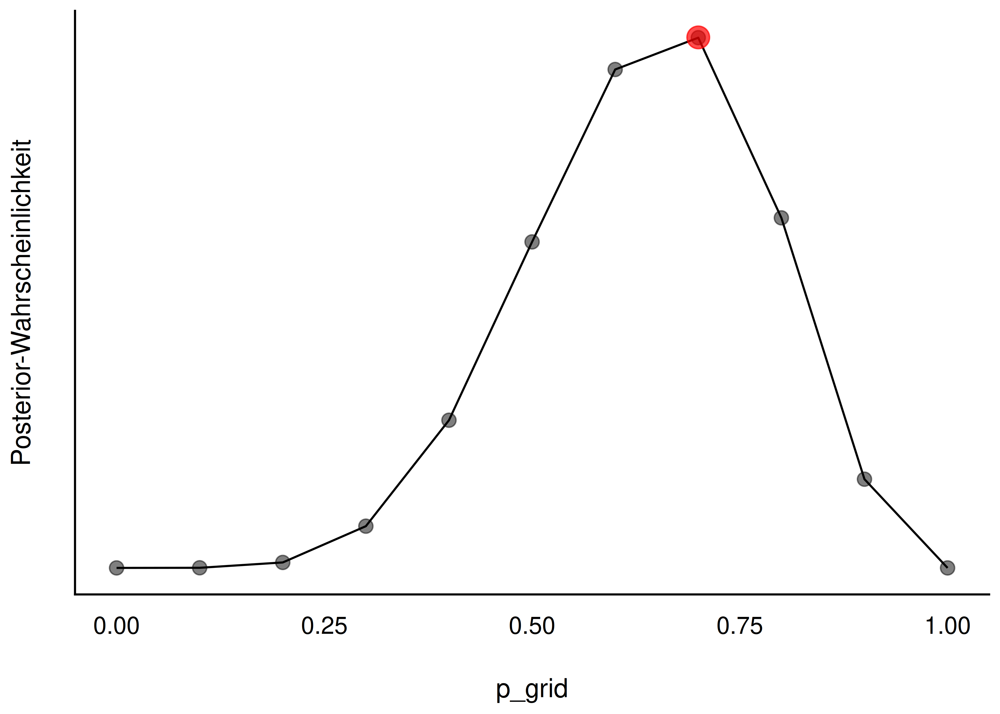
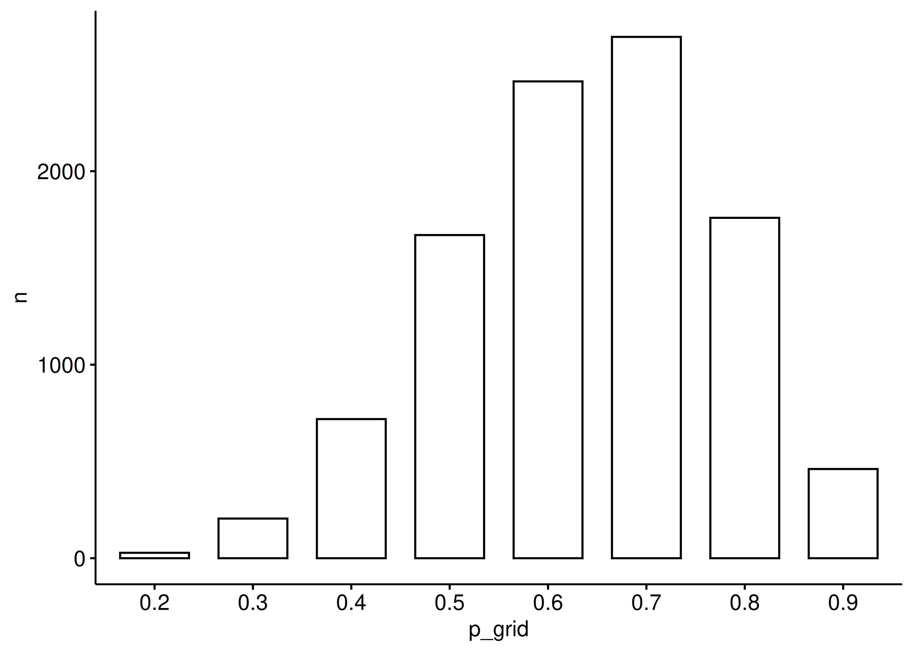
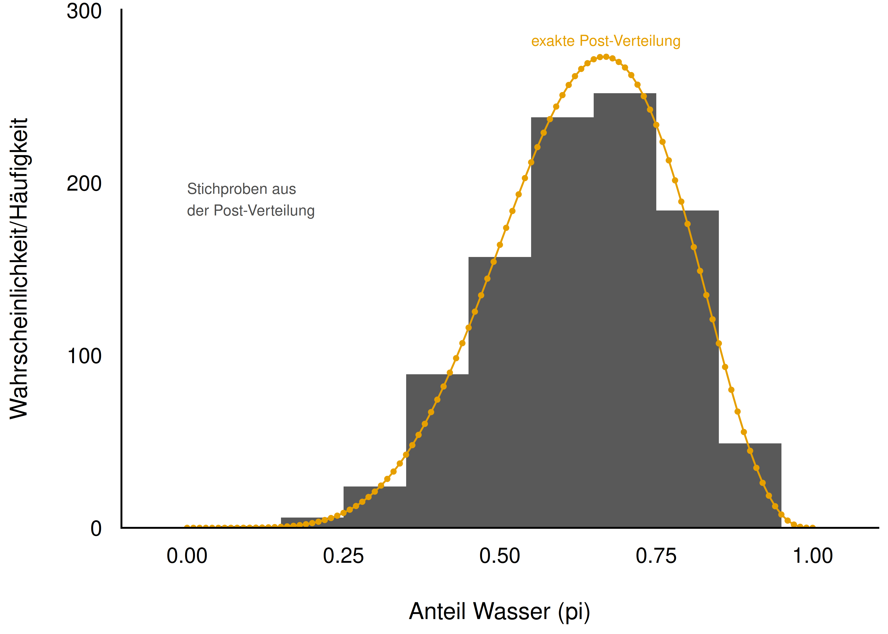
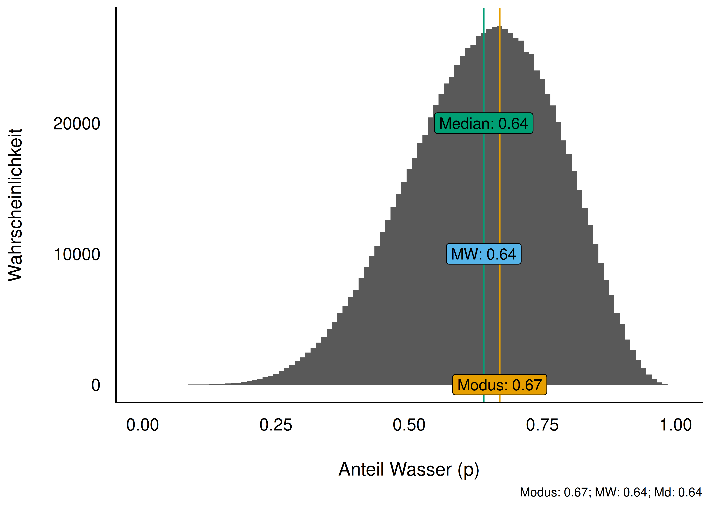
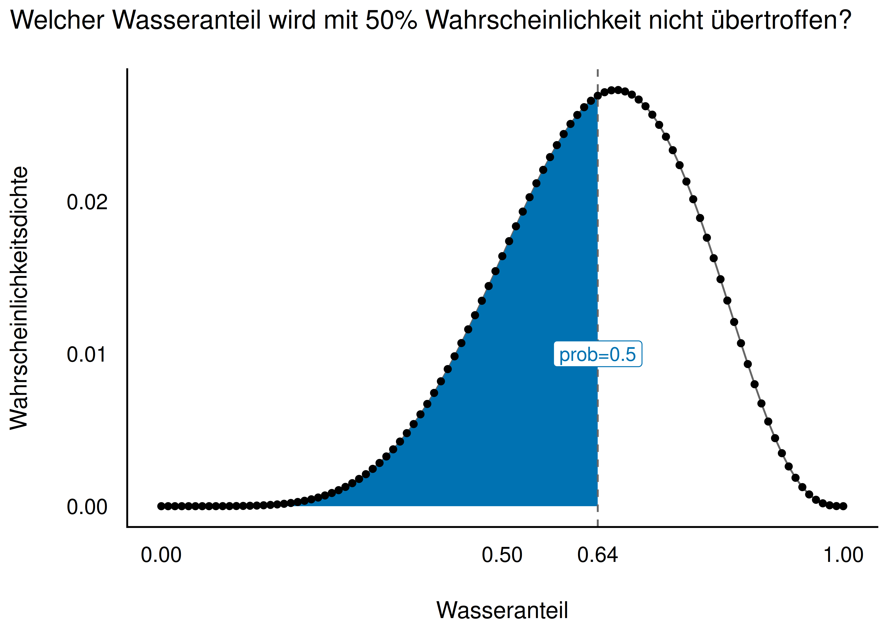
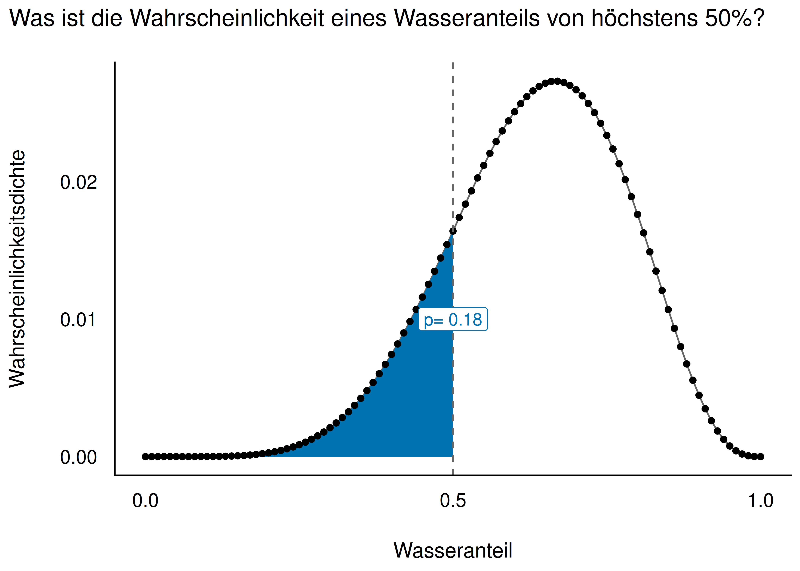
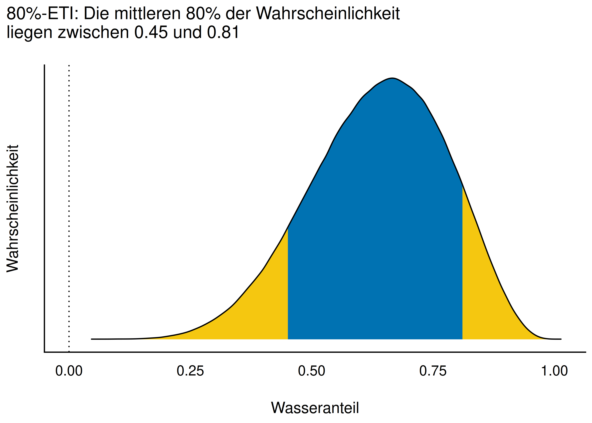
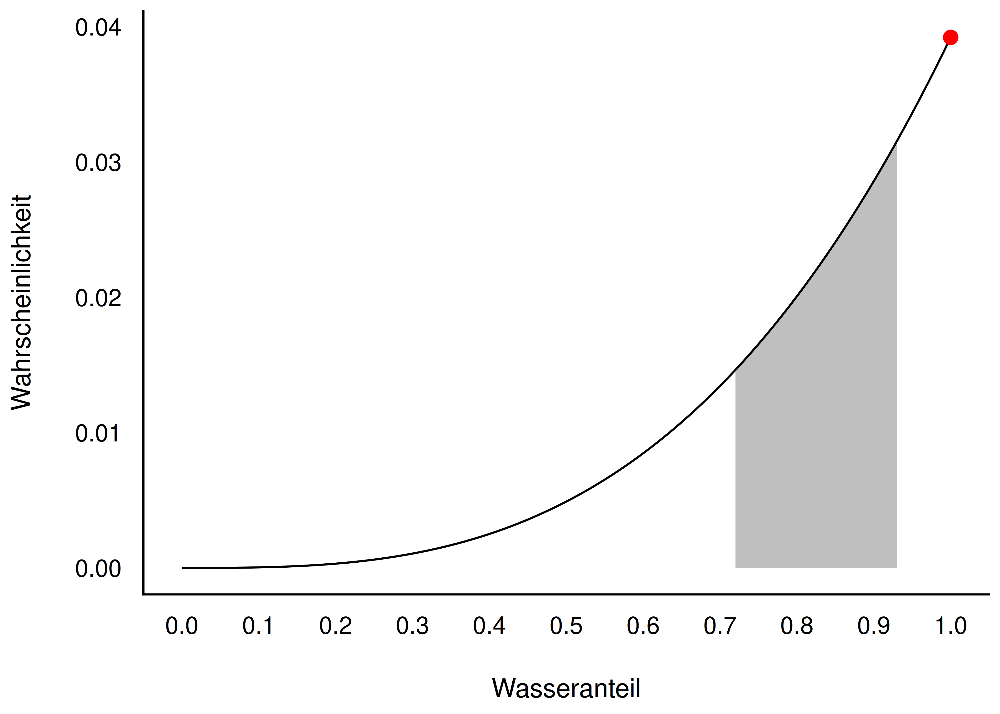
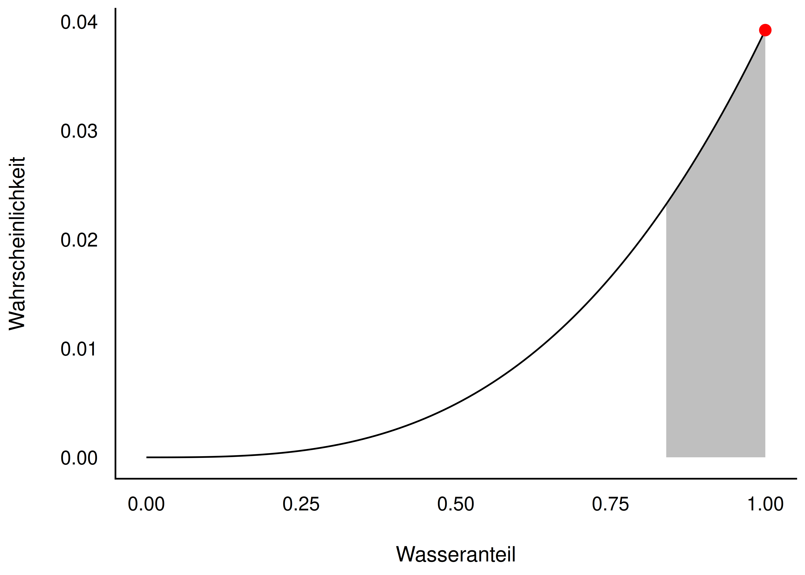
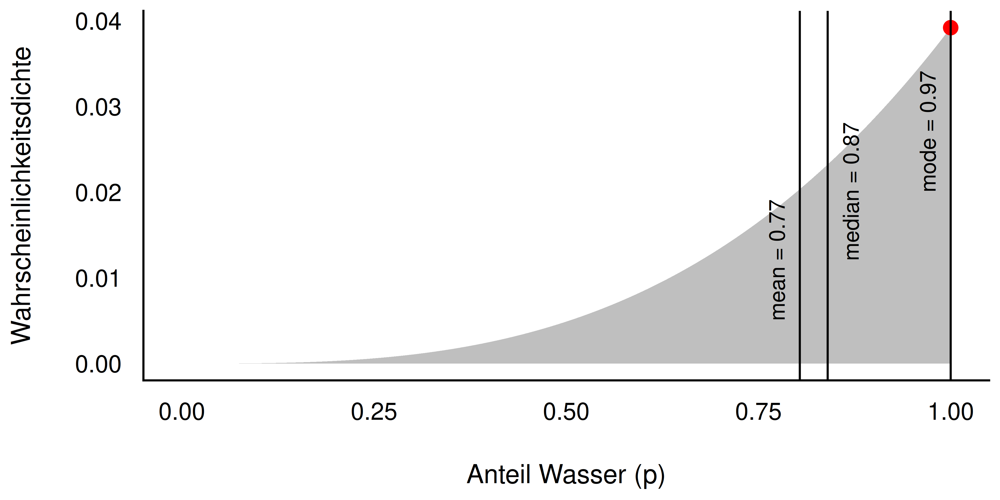

## Die Post befragen

Kapitelthema: Wie wir die **Posteriori-Verteilung** auslesen und zusammenfassen.

## Lernziele {.smaller}

Nach diesem Kapitel können Sie ...

- die Post-Verteilung anhand einer Stichprobenverteilung auslesen
- Fragen nach Wahrscheinlichkeitsanteilen der Post-Verteilung beantworten
- Fragen nach Quantilen der Post-Verteilung beantworten
- die Post-Verteilung mit R visualisieren
- Schätzbereiche (Konfidenzintervalle) bestimmen: Perzentilintervalle und Highest Density Intervals (HDI)

Begleitliteratur: @mcelreath2020, Kap. 3.1 und 3.2

# Zur Erinnerung: Bayesbox in R berechnen {.center footer=false}

## Zur Erinnerung: Die Bayesbox

- Die **Bayesbox** ("Gittermethode") berechnet die Posteriori-Verteilung
- Die Post-Verteilung ist das **zentrale Ergebnis** einer Bayes-Analyse
- Beispiel: Globusversuch mit $W=6$ Wasser bei $N=9$ Würfen, $g=11$ Gitterwerte (0 bis 1, Schritte von 0.1)

::: {.fragment}
Bei Apriori-Indifferenz entsprechen die Posteriori-Wahrscheinlichkeiten den Likelihoods — das Maximum liegt bei $6/9 = 2/3$.
:::

::: footer
Zur Erinnerung: Bayesbox in R berechnen
:::

## Die Bayesbox als Grafik

{width="70%"}

::: footer
Zur Erinnerung: Bayesbox in R berechnen
:::

## Bayesbox automatisiert

- Die Berechnung lässt sich als Funktion `bayesbox()` bündeln
- Verfügbar im R-Paket `prada` (`pak::pak("sebastiansauer/prada")`)
- Aufruf: `bayesbox(hyps = p_grid, priors = 1, liks = L)`
- Argumente: `hyps` (Parameterwerte), `priors` (Priori-Werte), `liks` (Likelihoods)

::: footer
Zur Erinnerung: Bayesbox in R berechnen
:::

## Grenzen der Bayesbox

- Für einfache Modelle funktioniert die Bayesbox gut
- Bei einer Regression mit Parametern $\beta_0, \beta_1, \sigma$: je 10 Ausprägungen $\rightarrow$ $10 \cdot 10 \cdot 10 = 10^3$ Zeilen
- Bei 100 Ausprägungen: $100^3 = 10^6$ Zeilen
- Bei 10 Parametern mit je 100 Ausprägungen: $10^{100}$ Zeilen — unmöglich zu berechnen

::: {.fragment}
**Wir brauchen eine andere Lösung.**
:::

::: footer
Zur Erinnerung: Bayesbox in R berechnen
:::

# Mit Stichproben die Post-Verteilung zusammenfassen {.center footer=false}

## Der Trick: Häufigkeiten statt Wahrscheinlichkeiten

- Komplexere Bayes-Modelle lassen sich nicht mehr exakt ausrechnen
- Lösung: Wir arbeiten mit **Stichproben (Häufigkeiten)** statt mit exakten Wahrscheinlichkeiten
- In der Praxis übernehmen das Monte-Carlo-Markov-Ketten-Verfahren (MCMC), z. B. der R-Golem **Stan** (Paket `rstanarm`)
- Wie MCMC im Detail funktioniert, ist nicht Gegenstand dieses Kurses — wir wenden es einfach an

::: footer
Mit Stichproben die Post-Verteilung zusammenfassen
:::

## Stichproben aus der Post-Verteilung ziehen {.smaller}

- Aus der Bayesbox `bayesbox_6w_9v` ziehen wir $n=10\,000$ Stichproben
- Gewichtet nach der Posteriori-Wahrscheinlichkeit (`weight_by = post`)
- Mit Zurücklegen (`replace = TRUE`), damit die Wahrscheinlichkeiten konstant bleiben

```r
samples_6w_9v <- bayesbox_6w_9v %>%
  slice_sample(n = 1e4, weight_by = post, replace = TRUE) %>%
  select(p_grid)
```

Ab jetzt arbeiten wir überwiegend mit Post-Verteilungen **auf Stichprobenbasis**, weil das für komplexere Modelle nötig wird.

::: footer
Mit Stichproben die Post-Verteilung zusammenfassen
:::

## Stichproben-Bayesbox als Balkendiagramm {.smaller}

{width="45%"}

- Wasseranteile zwischen ca. 50 % und 70 % sind am wahrscheinlichsten
- Kleine Anteile (z. B. 25 %) sind nicht ausgeschlossen
- Die Stichprobenverteilung nähert sich gut an die exakte Bayesbox-Verteilung an

::: footer
Mit Stichproben die Post-Verteilung zusammenfassen
:::

## Feineres Gitter: g = 100 {.smaller}

{width="35%"}

- Exakte Post-Verteilung (Linie) und Stichproben-Post-Verteilung (Histogramm) stimmen gut überein
- Zentrale Tendenz: ca. 70 % Wasseranteil ist der "typische" Wert
- Das Modell zeigt deutliche Streuung — es ist sich nicht sehr sicher

::: {.callout-note}
Mehr Stichproben und mehr Gitterwerte glätten die Stichproben-Post-Verteilung.
:::

::: footer
Mit Stichproben die Post-Verteilung zusammenfassen
:::

## Eine Million Stichproben {.smaller}

{width="40%"}

- Bei symmetrischer Verteilung liegen Modus, Mittelwert (MW) und Median (Md) eng beieinander
- Je mehr Stichproben, desto glatter die resultierende Verteilung

::: footer
Mit Stichproben die Post-Verteilung zusammenfassen
:::

# Die Post-Verteilung befragen {.center footer=false}

## Zwei Arten von Fragen an die Post

::: {.callout-important}
Die Post-Verteilung ist das zentrale Ergebnis einer Bayes-Analyse. Wir können viele nützliche Fragen an sie stellen.
:::

Zwei Arten von Fragen:

A. Fragen nach **Wahrscheinlichkeiten** (p)
B. Fragen nach **Parameterwerten** (Quantilen, q)

::: footer
Die Post-Verteilung befragen
:::

## Beispiele für Fragen an die Post-Verteilung {.smaller}

**A. Nach Wahrscheinlichkeiten (p):**

- Mit welcher Wahrscheinlichkeit liegt der Parameter unter/über einem bestimmten Wert?
- Mit welcher Wahrscheinlichkeit liegt der Parameter zwischen zwei Werten?

**B. Nach Parameterwerten (Quantilen, q):**

- Welcher Wert wird mit 95 % Wahrscheinlichkeit nicht überschritten?
- Welcher Parameterwert hat die höchste Wahrscheinlichkeit?
- Wie ungewiss ist das Modell über die Parameterwerte?

::: footer
Die Post-Verteilung befragen
:::

## p vs. q — der Unterschied {.smaller}

{width="40%"} {width="40%"}

- **q-Frage:** Welcher Wasseranteil wird mit gegebener Wahrscheinlichkeit *p* nicht überschritten? (gesucht: Parameterwert)
- **p-Frage:** Wie wahrscheinlich ist ein Wasseranteil von höchstens q? (gesucht: Wahrscheinlichkeit)

::: footer
Die Post-Verteilung befragen
:::

## Fragen nach Wahrscheinlichkeiten (p)

Forschungsfrage: *Wie groß ist die Wahrscheinlichkeit, dass der Wasseranteil unter 50 % liegt?*

- Wir zählen, wie viele Stichproben die Bedingung erfüllen
- Und teilen durch die Gesamtzahl der Stichproben

```r
samples_6w_9v %>% count(p_grid < .5)
```

Ergebnis: ca. **10 %** Wahrscheinlichkeit für einen Wasseranteil unter 50 %.

::: footer
Die Post-Verteilung befragen
:::

## Weitere p-Fragen

*Wie wahrscheinlich liegt der Wasseranteil zwischen 0.5 und 0.75?*

```r
samples_6w_9v %>%
  count(p_grid > .5 & p_grid < .75) %>%
  mutate(Anteil = n / 1e4, Prozent = 100 * n / 1e4)
```

*Wie wahrscheinlich liegt der Wasseranteil zwischen 0.9 und 1?*

- Ergebnis: sehr unwahrscheinlich, dass der Wasseranteil mindestens 90 % beträgt

::: footer
Die Post-Verteilung befragen
:::

## Modus, Mittelwert, Median der Post

- Modus (häufigster/wahrscheinlichster Wert): `map_estimate()` — **MAP** = Maximum Aposteriori
- Mittelwert: `mean(p_grid)`
- Median: `median(p_grid)`

Alle drei sind **Punktschätzer** der Post-Verteilung und liegen bei symmetrischen Verteilungen eng beieinander.

::: footer
Die Post-Verteilung befragen
:::

## Fragen nach Parameterwerten (Quantile)

::: {.callout-important}
Schätzbereiche von Parameterwerten nennt man auch *Konfidenz-* oder *Vertrauensintervalle* (auch: Kompatibilitätsintervall, Ungewissheitsintervall).
:::

Frage: *Welcher Parameterwert wird mit 90 % Wahrscheinlichkeit nicht überschritten?*

```r
samples_6w_9v %>% summarise(quantil90 = quantile(p_grid, p = .9))
```

Antwort: Wir können zu 90 % sicher sein, dass der Wasseranteil kleiner als ca. 78 % ist.

::: footer
Die Post-Verteilung befragen
:::

## Das mittlere 90 %-Intervall

Frage: *Welches Intervall enthält mit 90 % Wahrscheinlichkeit den Parameterwert?*

- Links und rechts je 5 % der extremsten Stichproben abschneiden

```r
samples_6w_9v %>%
  summarise(quant_05 = quantile(p_grid, 0.05),
            quant_95 = quantile(p_grid, 0.95))
```

Solche Fragen lassen sich mit **Quantilen** beantworten.

::: footer
Die Post-Verteilung befragen
:::

# Visualisierung der Verteilungen {.center footer=false}

## Definition: Perzentilintervall (PI) {.smaller}

::: {.callout-note title="Definition: Perzentilintervall (PI)"}
Intervalle, die die "abzuschneidende" Wahrscheinlichkeitsmasse hälftig auf beide Ränder aufteilen, nennt man **Perzentilintervalle** (PI) oder (synonym) **Equal-Tails-Intervalle** (ETI).
:::

{width="35%"}

::: footer
Visualisierung der Verteilungen
:::

## Schiefe Post-Verteilungen

Beispiel: Globusversuch mit 3 Würfen, 3 Treffern (Wasser)

- Extremfall: alle Würfe zeigen Wasser
- Die resultierende Post-Verteilung ist stark **schief** (rechtslastig, Maximum am Rand bei $p=1$)
- Gut geeignet, um PI und HDI zu vergleichen

::: footer
Visualisierung der Verteilungen
:::

## PI vs. HDI bei schiefer Verteilung {.smaller}

{width="40%"} {width="40%"}

- Ein **Perzentilintervall** kann bei schiefen Verteilungen den wahrscheinlichsten Parameterwert ausschließen — das ergibt wenig Sinn
- Ein **Highest-Density-Intervall (HDI)** ist schmäler und enthält immer den wahrscheinlichsten Wert

::: footer
Visualisierung der Verteilungen
:::

## Definition: Intervalle höchster Dichte (HDI)

::: {.callout-note title="Definition: Intervalle höchster Dichte (HDI)"}
Intervalle höchster Dichte (Highest Density Intervals, HDI oder HDPI) sind definiert als das **schmälste** Intervall, das den gesuchten Parameter enthält (bezogen auf ein gegebenes Modell).
:::

- Beim HDI sind die abgeschnittenen Ränder nicht zwangsläufig gleich groß
- Beim PI ist die Wahrscheinlichkeitsmasse in beiden Rändern gleich groß

::: footer
Visualisierung der Verteilungen
:::

## Punktschätzer bei schiefer Verteilung

{width="65%"}

Je unsymmetrischer die Verteilung, desto weiter liegen die Punktschätzer auseinander.

::: footer
Visualisierung der Verteilungen
:::

## HDI berechnen

```r
samples_6w_9v %>%
  select(p_grid) %>%
  hdi(ci = .5)  # aus dem Paket easystats
```

Ergebnis: Das Modell ist sich zu 50 % sicher, dass der Wasseranteil im Bereich von ca. 0.67 bis 0.78 liegt (HDI-basiert).

::: footer
Visualisierung der Verteilungen
:::

# Fazit {.center footer=false}

## Fazit: PI vs. HDI

- Bei **symmetrischer** Posteriori-Verteilung sind PI und HDI ähnlich oder identisch
- Perzentilintervalle sind in der Praxis verbreiteter
- **Intervalle höchster Dichte (HDI)** sind bei **schiefen** Post-Verteilungen zu bevorzugen
- HDI sind die **schmalsten** Intervalle für eine gegebene Wahrscheinlichkeitsmasse

::: footer
Fazit
:::

## Zusammenfassung am Beispiel

Globusversuch: 6 Treffer bei 9 Würfen (`samples_6w_9v`)

**Lageparameter** — welcher mittlere Wasseranteil ist zu erwarten?

```r
samples_6w_9v %>% summarise(mean = mean(p_grid), median = median(p_grid))
```

**Streuungsparameter** — wie unsicher ist die Schätzung?

```r
samples_6w_9v %>% summarise(p_sd = sd(p_grid), p_iqr = IQR(p_grid), p_mad = mad(p_grid))
```

Üblicher als reine Streuungsmaße: ein HDI oder PI für den Parameter angeben.

::: footer
Fazit
:::

## Merksatz zum Abschluss

::: {.callout-important}
Der Wasseranteil ist ein Beispiel für einen **Parameter** — eine unbekannte Größe eines Modells. Die Post-Verteilung sagt uns, wie plausibel welche Parameterwerte sind, und erlaubt uns, diese Unsicherheit präzise zu beziffern.
:::

::: footer
Fazit
:::

## Kernpunkte dieses Kapitels

- Die Bayesbox liefert die exakte Post-Verteilung, stößt aber bei komplexen Modellen an Grenzen
- **Stichproben** aus der Post-Verteilung sind der praktikable Ersatz (Basis für MCMC/Stan)
- Man kann die Post-Verteilung nach **Wahrscheinlichkeiten (p)** und nach **Parameterwerten (q)** befragen
- **PI** (Perzentilintervall) und **HDI** (Intervall höchster Dichte) fassen die Unsicherheit als Bereich zusammen
- Bei schiefen Verteilungen ist das HDI vorzuziehen

::: footer
Fazit
:::

## Vielen Dank! {.center}

Fragen?

::: footer
Fazit
:::

