## Gauss-Modelle

Ein Bayes-Modell für eine metrische Zielvariable ohne Prädiktoren.

## Lernziele

Nach diesem Kapitel können Sie ...

- ein Gauss-Modell spezifizieren und mit `stan_glm()` in R berechnen
- an Beispielen zeigen, wie sich eine vage bzw. informationsreiche Priori-Verteilung auf die Posteriori-Verteilung auswirkt

::: {.fragment}
Orientiert an @mcelreath2020, Kap. 4.1–4.3.
:::

## Die Forschungsfrage

- Volk der !Kung San (Kalahari-Wüste, südliches Afrika)
- Frage: Wie groß sind die erwachsenen !Kung **im Durchschnitt**?
- Datensatz `Howell1a.csv`, gefiltert auf Erwachsene (Alter ≥ 18)

::: {.fragment}
Gesucht: der Populationsmittelwert der Körpergröße, $\mu$.
:::

## Die Daten {.smaller}

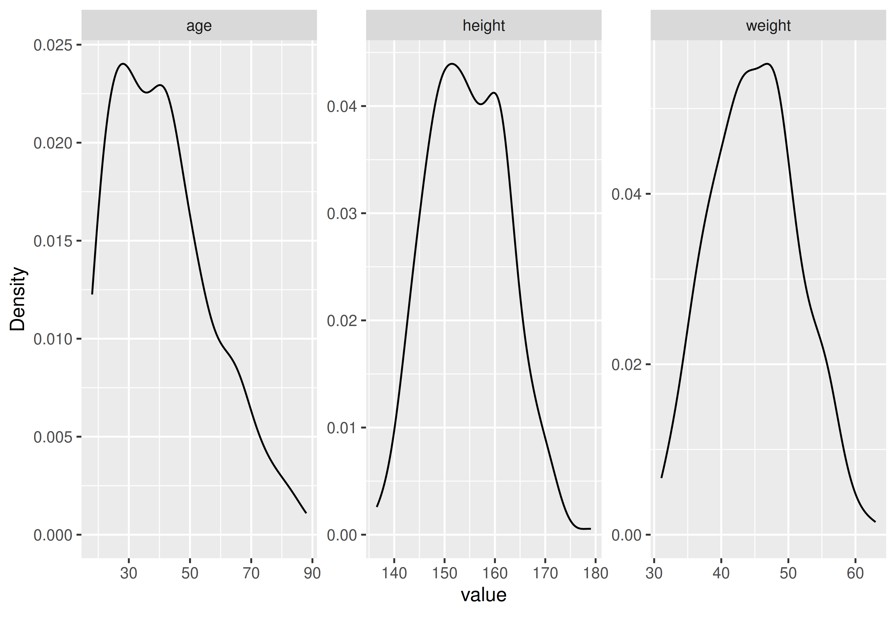{width="70%"}

Größe und Gewicht: recht symmetrisch/normalverteilt. Alter: rechtsschief.

## Zwei Modellparameter

1. **Mittelwert** der Körpergröße in der Population, $\mu$
   → "Wie groß sind die erwachsenen !Kung im Durchschnitt?"
2. **Streuung** der Körpergrößen um den Mittelwert, $\sigma$
   → "Wie unterschiedlich groß sind die erwachsenen !Kung?"

::: {.callout-note title="Definition"}
Ein Gauss-Modell nimmt an, dass die Zielvariable normalverteilt ist mit Mittelwert $\mu$ und Streuung $\sigma$ — beide selbst mit Priori-Verteilungen versehen.
:::

## Apriori mal Likelihood ist Post

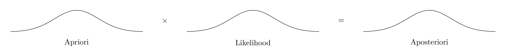{width="70%"}

Diesmal berechnet **Stan** die Bayesbox für uns — nicht mehr von Hand.

## Priori für den Mittelwert, $\mu$

$$\color{blue}{\mu \sim \mathcal{N}(178, 20)} \qquad{\text{Prior}}$$

- Mittelwert 178 cm, Streuung 20 cm
- Warum 178? Kein besonderer Grund — dient dazu, den Effekt verschiedener Priori-Werte zu untersuchen
- In echten Studien: Priori-Wert inhaltlich begründen (oder schwach-informative Standardwerte nutzen)

## Priori für die Streuung, $\sigma$

$$\color{green}{\sigma \sim \mathcal{E}(1/8)} \qquad{\text{Prior}}$$

- Exponentialverteilt, da $\sigma$ notwendig positiv ist
- Median bei $\lambda = 1/8$: ca. 5 cm
- Daraus folgt: $95\%\,KI(\mu): 178 \pm 40$, also 138–218 cm

::: {.fragment}
Groß genug für Überraschungen, eng genug gegen unmögliche Werte.
:::

## Die Priori-Verteilungen im Bild

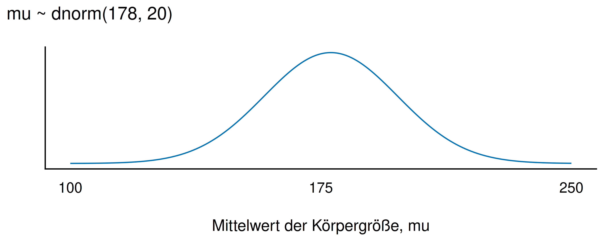{width="45%"} 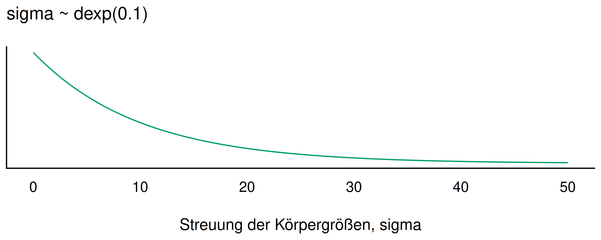{width="45%"}

::: {.callout-note title="Hinweis"}
Dieses Modell hat zwei Parameter, $\mu$ und $\sigma$.
:::

## Die Likelihood

$$\textcolor{orange}{h_i} \sim \mathcal{\textcolor{orange}{N}}(\textcolor{blue}{\mu}, \textcolor{green}{\sigma})
\qquad
\textcolor{black}{\textcolor{orange}{Likelihood}}$$

- Lies: "Die Körpergröße ist normalverteilt mit Mittelwert $\mu$ und Streuung $\sigma$"
- Für jede plausible Kombination von $\mu$ und $\sigma$ berechnet Stan die Likelihood

## Das vollständige Modell

$$
\begin{aligned}
\mu &\sim \mathcal{N}(M=178, S=20) & \text{Prior} \\
\sigma &\sim \mathcal{E}(1/8) & \text{Prior} \\
h_i &\sim \mathcal{N}(\mu, \sigma) & \text{Likelihood}  \\
\end{aligned}
$$

Das ist unser Modell `m_kung`.

## Post-Verteilung mit Stan berechnen

```r
m_kung <-
  stan_glm(height ~ 1,
    prior_intercept = normal(178, 20),
    prior_aux = exponential(1/8),
    refresh = 0,
    data = kung_erwachsen)
```

- `height ~ 1`: Regression **ohne** Prädiktor — nur die Verteilung der AV wird geschätzt
- `(Intercept)` entspricht dem Mittelwert $\mu$

## Die Randverteilungen von $\mu$ und $\sigma$

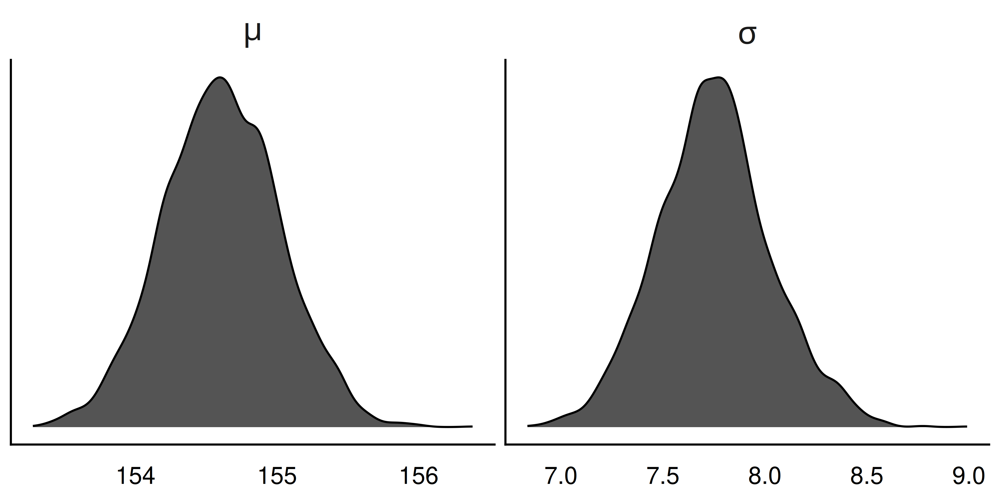{width="75%"}

## Die gemeinsame Post-Verteilung {.smaller}

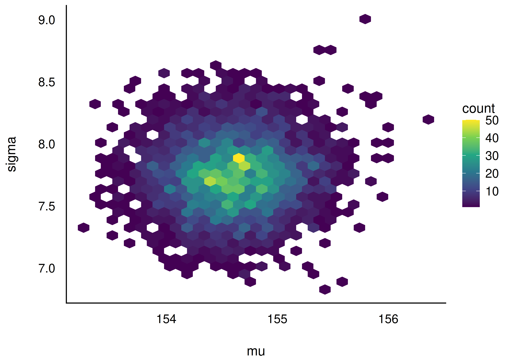{width="55%"}

Für jede Kombination von $\mu$ und $\sigma$: Wie wahrscheinlich ist sie? Hier: $\mu$ und $\sigma$ sind unkorreliert.

## Zusammenfassung: Modell `m_kung`

- Wir erhalten eine Wahrscheinlichkeitsverteilung für $\mu$ und für $\sigma$ (bzw. eine gemeinsame Verteilung)
- Trotz vagem Prior: kleine Streuung der Post-Werte — große Stichprobe überstimmt den Prior
- Aus der Post-Verteilung können wir Stichproben ziehen und Fragen beantworten

## Fragen an die Posteriori-Verteilung

1. Mit welcher Wahrscheinlichkeit ist die *mittlere* !Kung-Person größer als 1,55 m?
2. Welche mittlere Körpergröße wird mit 95 % Wahrscheinlichkeit nicht überschritten?
3. In welchem 90 %-PI liegt $\mu$ vermutlich?
4. Wie unsicher ist die Schätzung der mittleren Körpergröße?
5. Was ist der mediane Schätzwert, der "Best Guess"?

## Antworten: einfache Anteile berechnen

```r
m_kung_post %>%
  count(mu > 155) %>%
  mutate(prop = n/sum(n))
```

- $P(\mu > 155)$: eher gering, aber nicht ausgeschlossen
- $P(\mu > 165)$: praktisch ausgeschlossen — aber **nur unter dem Modell**!

::: {.callout-important title="Kleine-Welt-Aussage"}
Diese Wahrscheinlichkeiten gelten nur, wenn das Modell (die Annahmen) zutrifft.
:::

## Parameterschätzung komfortabel

```r
parameters(m_kung)
```

- Golem schätzt den Größenmittelwert auf ca. 155 cm
- 95 %-ETI (Equal-Tailed Interval, synonym zu PI) gibt den Unsicherheitsbereich an
- Zusatzangaben wie `pd`, `Rhat`, `ESS`: vorerst ignorieren

## Wie tickt `stan_glm()`?

- Stan: Software zur Berechnung von Bayes-Modellen; `rstanarm` stellt sie in R bereit
- `stan_glm()` ist für Regressionsmodelle ausgelegt
- Verteilung einer einzelnen Variable schätzen = Regression **ohne** Prädiktor: `y ~ 1`
- `(Intercept)` = Mittelwert

## Ketten und Geschwindigkeit

- Stan zieht standardmäßig **4 Ketten** (chains) — zur gegenseitigen Kontrolle
- Stimmen alle Ketten überein → vertrauenswürdiges Ergebnis
- Weichen sie ab → Fehler oder Problem im Modell
- `chains = 1` spart Zeit, aber ohne Kontrolle

## Standard-Prioriwerte von `stan_glm()`

Ohne eigene Angabe wählt Stan die Prioris selbst — basierend auf den Stichprobendaten.

::: {.callout-note title="Standardwerte von stan_glm"}
- `Intercept`: $\mu \sim \mathcal{N}(\bar{Y},\ sd(Y)\cdot 2.5)$
- `Auxiliary (sigma)`: $\sigma \sim \mathcal{E}(\lambda = 1/sd(Y))$
:::

Das ist strenggenommen nicht "pures Bayes" — die Prioris basieren teils auf den Daten selbst.

## Modell mit Standard-Prioris

- `m_kung` (eigene Prioris) vs. `m_kung_neue_prioris` (Standard-Prioris)
- Ergebnis: **sehr ähnliche** Parameterwerte

::: {.callout-important title="Merksatz"}
Bei ausreichend großer Stichprobe fallen moderate Priori-Unterschiede kaum ins Gewicht.
:::

## Post-Verteilung des Intercepts

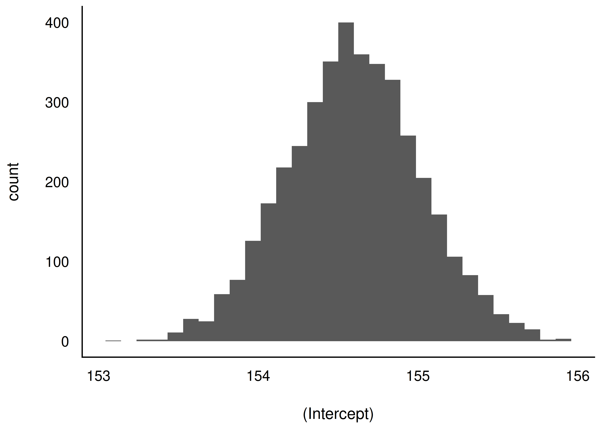{width="60%"}

## Posterior-Prädiktiv-Verteilung

- Bisher: Verteilung von $\mu$ (mittlere Körpergröße)
- Jetzt: Verteilung der **tatsächlichen** Körpergrößen $h_i$ laut Modell
- Für jede Stichprobe $(\mu, \sigma)$ eine Normalverteilung ziehen → Posterior-Prädiktiv-Verteilung

## Modellcheck: passt das Modell zu den Daten?

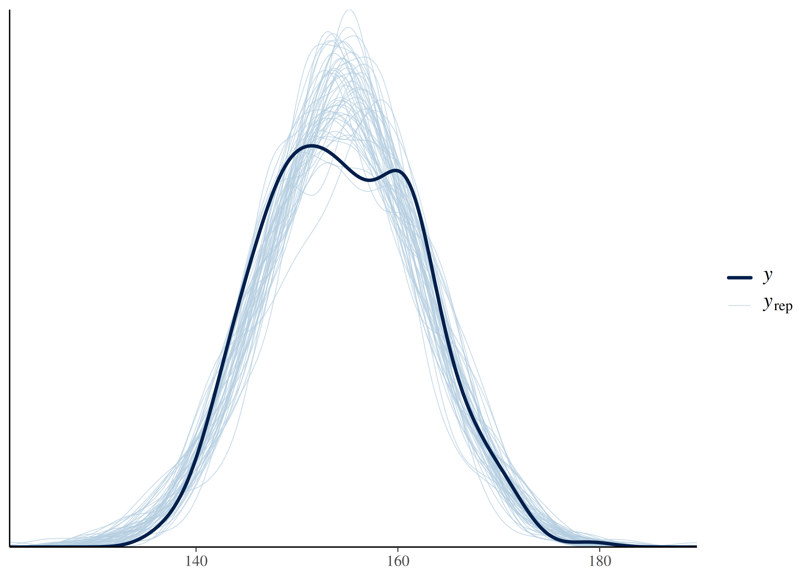{width="45%"} 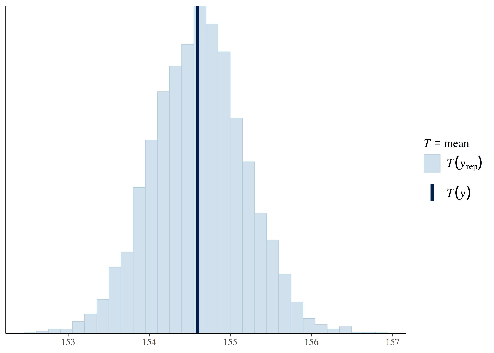{width="45%"}

Dunkle Kurve: tatsächliche Daten. Helle Kurven: Simulationen aus der Post-Verteilung. Das Modell bildet die Realität gut ab.

## Fazit

- Posteriori-Verteilung für ein Gauss-Modell berechnet: metrische AV ohne Prädiktoren
- Zielvariable `height` ~ normalverteilt mit $\mu$ und $\sigma$
- Für $\mu$ und $\sigma$: keine fixen Werte, sondern Wahrscheinlichkeitsverteilungen (Prioris)

::: {.callout-important title="Merksatz"}
Kontinuierliches Lernen ist der Schlüssel zum Erfolg.
:::

## Vertiefung: Priori-Prädiktiv-Verteilung {.smaller}

- Simuliert Beobachtungen **nur** auf Basis der Prioris (vor Kenntnis der Daten)
- $h_i \sim \mathcal{N}(\mu,\sigma),\ \mu \sim \mathcal{N}(178,20),\ \sigma \sim \mathcal{E}(0{.}1)$
- Prüft, ob die Priori-Annahmen plausibel sind

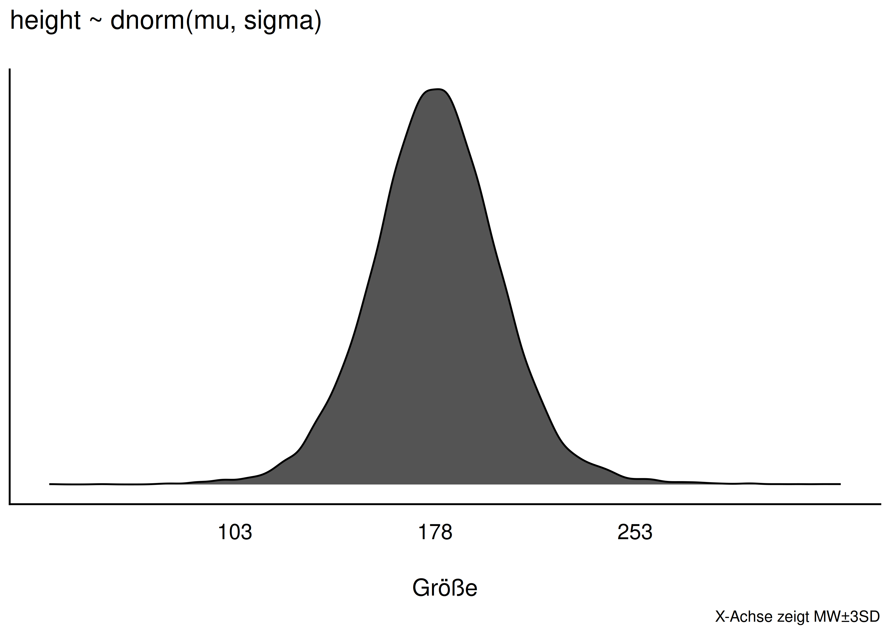{width="55%"}

## Vage Prioris können in die Irre führen {.smaller}

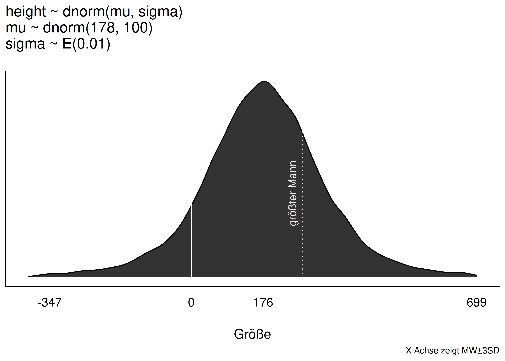{width="38%"}

- Mit $\sigma \sim \mathcal{E}(0{.}01)$ (extrem vage): Modell erwartet z. T. **negative** Körpergrößen und Riesen
- Vage ("objektive", flache) Prioris sind oft **keine gute Wahl** — sie lassen unplausible Werte zu

::: {.callout-important title="Merksatz"}
Ein Prior sollte weder übergewiss noch beliebig vage sein — Plausibilität zählt.
:::

## Zusammenfassung: Priori-Wahl

- Prioris transparent und begründet wählen
- Alternative: schwach-informative Standardwerte (z. B. `rstanarm`-Default)
- Prüfen lässt sich die Priori-Wahl mit der **Priori-Prädiktiv-Verteilung**
- Bei großer Stichprobe: Einfluss des Priors sinkt ohnehin

## Vielen Dank! {.center}

Fragen?
