# Einstieg {.center footer=false}

## Lernziele

Nach diesem Kapitel können Sie ...

- das Zusammenspiel von Apriori-Verteilungen und linearem Modell zur Berechnung der Likelihood erläutern
- die Post-Verteilung für einfache lineare Modelle in R berechnen
- zentrale Informationen (Lage-, Streuungsmaße, Schätzintervalle) aus der Post-Verteilung eines Regressionsmodells herauslesen

::: {.fragment}
Orientiert an @mcelreath2020, Kap. 4.4.
:::

::: footer
Einstieg
:::

## Überblick

- Modell: Körpergröße vorhergesagt durch Gewicht (!Kung-Datensatz)
- Neu ggü. Frequentistischer Regression (`lm`): Die drei Parameter $\beta_0$, $\beta_1$, $\sigma$ haben jetzt eine **Post-Verteilung**
- Frequentistisch: nur Punktschätzer pro Parameter
- Bayes: eine ganze Verteilung pro Parameter — informationsreicher

::: footer
Einstieg
:::

# Den Datensatz verstehen {.center footer=false}

## Der Datensatz: !Kung-Leute {.smaller}

- Datei `Howell1a.csv` [@mcelreath2020]
- Nur Erwachsene (Alter > 18)
- Variablen u. a.: `height` (Größe), `weight` (Gewicht), `age`, `male`

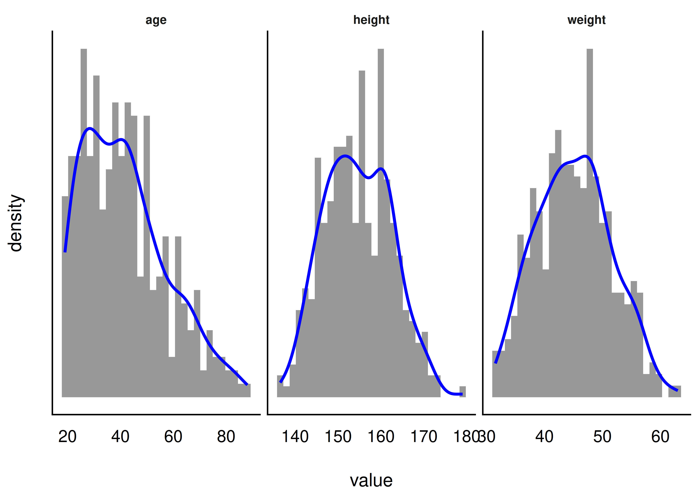{width="50%"}

::: footer
Den Datensatz verstehen
:::

## Explorative Datenanalyse (EDA)

- Nicht zwingend nötig für die Bayes-Regression, aber hilfreich zum Datenverständnis
- Keine fehlenden Werte im Datensatz
- `age` rechtsschief; `height` und `weight` eher symmetrisch/normalverteilt
- `height` bimodal — vermutlich Mischung der Geschlechter
- Etwas mehr Männer als Frauen im Datensatz

::: footer
Den Datensatz verstehen
:::

## Zusammenhänge in den Daten {.smaller}

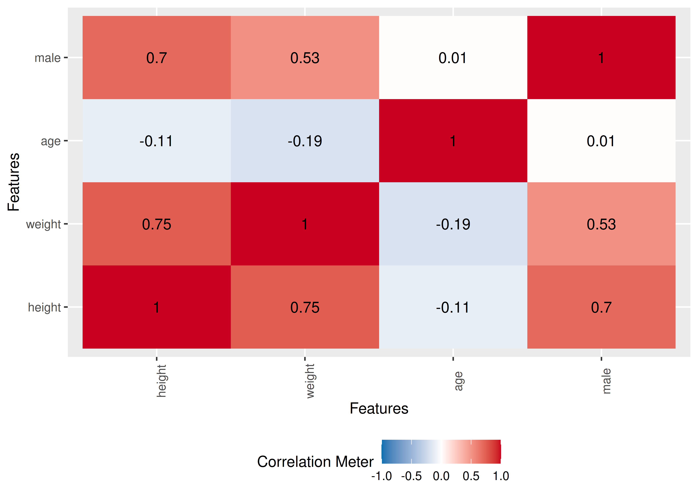{width="55%"}

Starke Zusammenhänge zwischen Größe und Gewicht sowie zwischen Geschlecht und Größe/Gewicht.

::: footer
Den Datensatz verstehen
:::

## Gewicht und Größe: linearer Zusammenhang

- Regression prüft, inwieweit zwei Variablen $Y$ und $X$ **linear** zusammenhängen
- Je stärker der Zusammenhang, desto besser lässt sich $X$ zur Vorhersage von $Y$ nutzen
- Zusammenhang $\neq$ Kausalität
- *Linear*: Zuwachs in $Y$ relativ zu $X$ ist konstant — steigt $X$ um 1 Einheit, steigt $Y$ um $b$ Einheiten

::: footer
Den Datensatz verstehen
:::

## Gewicht (X) und Größe (Y)

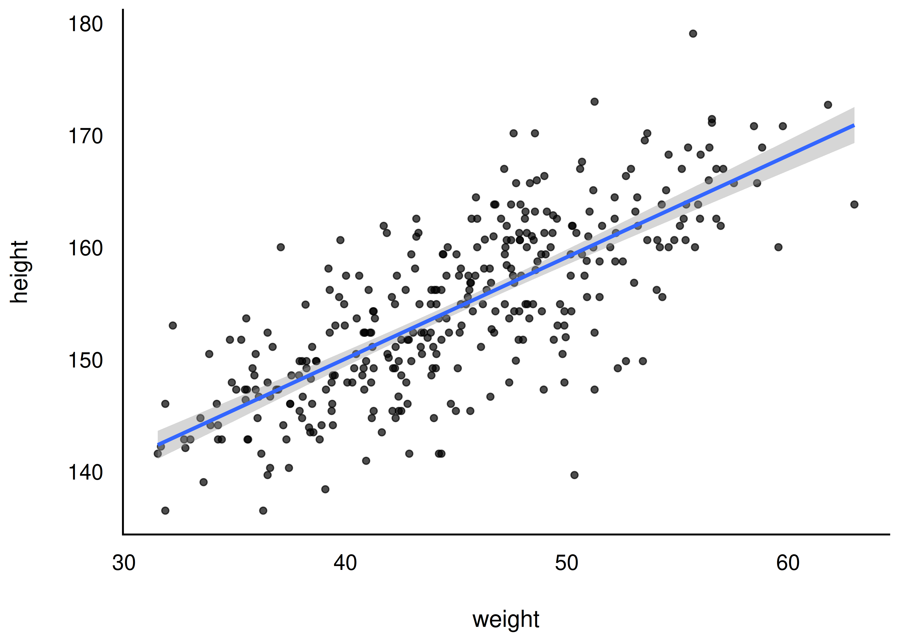{width="65%"}

Deutlicher linearer Zusammenhang: je schwerer, desto größer.

::: footer
Den Datensatz verstehen
:::

## Prädiktor zentrieren

- Zentrieren: von jedem Wert den Mittelwert abziehen — $x_i - \bar{x}$
- Ergebnis: `weight_c` (*c* wie *centered*)

::: {.callout-note title="Warum zentrieren?"}
Mit zentriertem Prädiktor gibt der Achsenabschnitt $\beta_0$ die Größe einer Person mit **durchschnittlichem** Gewicht an — sonst wäre es die (unsinnige) Größe bei Gewicht = 0. Vgl. @gelman2021, Kap. 10.4, 12.2.
:::

::: footer
Den Datensatz verstehen
:::

## Zentrieren — visualisiert

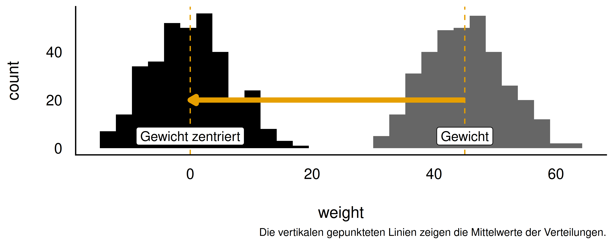{width="70%"}

Der Mittelwert von `weight_c` liegt danach bei 0.

::: footer
Den Datensatz verstehen
:::

# Modell m_kung_gewicht_c: zentrierter Prädiktor {.center footer=false}

## Modellidee: drei Parameter zusammen {.smaller}

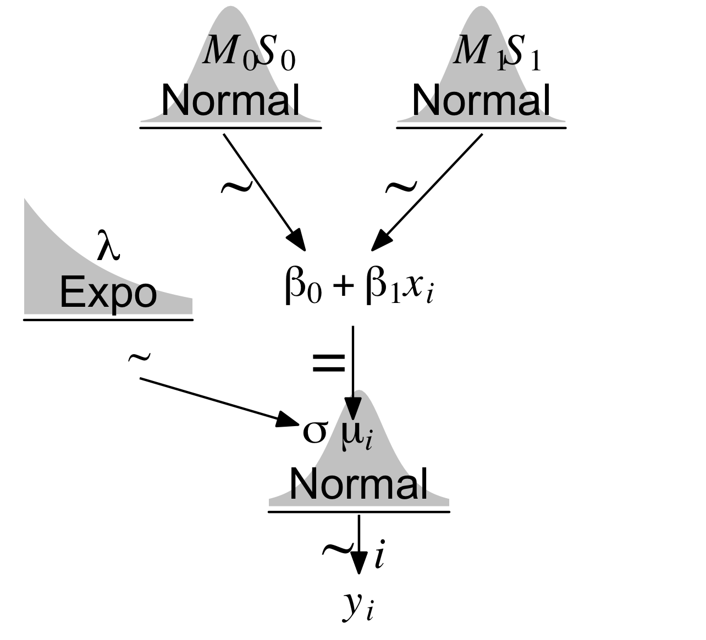{width="45%"}

::: footer
Modell m_kung_gewicht_c: zentrierter Prädiktor
:::

## Vorhergesagte Größen als Normalverteilungen {.smaller}

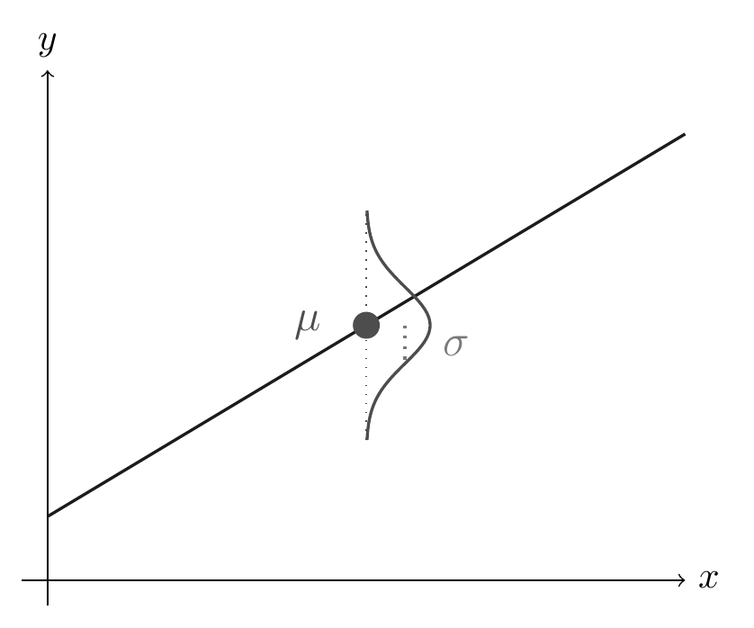{width="48%"}

::: footer
Modell m_kung_gewicht_c: zentrierter Prädiktor
:::

## Modelldefinition `m_kung_gewicht_c`

::: {.callout-note title="Definition: Modelldefinition m_kung_gewicht_c"}
$$\begin{align*}
\color{red}{\text{height}_i} & \color{red}\sim \color{red}{\operatorname{Normal}(\mu_i, \sigma)} && \color{red}{\text{Likelihood}} \\
\color[RGB]{0,158,115}{\mu_i} & \color[RGB]{0,158,115}= \color[RGB]{0,158,115}{\beta_0 + \beta_1\cdot \text{weightcentered}_i}  && \color[RGB]{0,158,115}{\text{Lineares Modell}} \\
\color{blue}{\beta_0} & \color{blue}\sim \color{blue}{\operatorname{Normal}(178, 20)} && \color{blue}{\text{Priori}} \\
\color{blue}{\beta_1}  & \color{blue}\sim \color{blue}{\operatorname{Normal}(0, 10)}  && \color{blue}{\text{Priori}}\\
\color{blue}\sigma & \color{blue}\sim \color{blue}{\operatorname{Exp}(0.1)}  && \color{blue}{\text{Priori}}
\end{align*}\quad \square$$
:::

::: footer
Modell m_kung_gewicht_c: zentrierter Prädiktor
:::

## Likelihood lesen

$$
\color{red}{\text{height}_i} \sim \operatorname{Normal}(\mu_i, \sigma)
$$

- Jetzt ein Index $i$ an $\mu$ und $h$: nicht mehr **ein** Mittelwert, sondern **pro Beobachtung** ein $\mu_i$

> "Die Wahrscheinlichkeit, eine bestimmte Größe $h$ bei Person $i$ zu beobachten, gegeben $\mu$ und $\sigma$, ist normalverteilt."

::: footer
Modell m_kung_gewicht_c: zentrierter Prädiktor
:::

## Das lineare Modell lesen

$$
\color[RGB]{0,158,115}{\mu_i} = \beta_0 + \beta_1\cdot \text{weightcentered}_i
$$

- $\mu$ wird jetzt **deterministisch berechnet**, nicht geschätzt
- $\beta_1$: Unterschied in `height` bei einer Einheit Unterschied in `weight` (Steigung)
- $\beta_0$: Wert von $\mu$, wenn `weight_c` = 0 (Achsenabschnitt)

> "Der vorhergesagte mittlere Wert der Körpergröße, $\mu_i$, berechnet sich als Summe von $\beta_0$ und $\beta_1 \cdot \text{weight}_i$."

::: footer
Modell m_kung_gewicht_c: zentrierter Prädiktor
:::

## Priori-Verteilungen des Modells

$$
\begin{aligned}
\beta_0 &\sim \operatorname{Normal}(178, 20) && \text{Priori Achsenabschnitt} \\
\beta_1 &\sim \operatorname{Normal}(0, 10) && \text{Priori Regressionsgewicht}\\
\sigma &\sim \operatorname{Exp}(0.1) && \text{Priori Sigma}
\end{aligned}
$$

- $\beta_1$: schwach informativ — im Schnitt kein Zusammenhang, aber auch starke positive/negative Werte plausibel
- Zahl der Prioris = Zahl der Modellparameter

::: footer
Modell m_kung_gewicht_c: zentrierter Prädiktor
:::

# Die Post-Verteilung befragen {.center footer=false}

## Ein "meinungsstärkeres" Modell

- Modell `m_kung_starkes_beta1`: andere Priori für $\beta_1$

$$\beta_1 \sim N(5,3); \quad \beta_0 \sim N(178, 20); \quad \sigma \sim E(0.1)$$

- Im Schnitt: 5 cm Unterschied in Größe pro 1 kg Unterschied im Gewicht — deutlich "meinungsstärker" als zuvor

::: {.callout-note}
`seed` fixiert die Zufallszahlen für reproduzierbare Ergebnisse (Konvention hier: 42).
:::

::: footer
Die Post-Verteilung befragen
:::

## Definition: Effektwahrscheinlichkeit (`pd`)

::: {.callout-note title="Definition: Effektwahrscheinlichkeit"}
Die Kennzahl `pd` (*probability of direction*) gibt an, mit welcher Wahrscheinlichkeit ein Effekt positiv bzw. negativ ist (je nachdem, ob der Median des Effekts positiv oder negativ ist). Sie sagt nichts über die Effektstärke aus — nur ob der Effekt klar auf einer Seite der Null liegt. Grob vergleichbar mit dem p-Wert der Frequentistischen Statistik [@makowski2019].
:::

::: footer
Die Post-Verteilung befragen
:::

## Effektwahrscheinlichkeit visualisiert {.smaller}

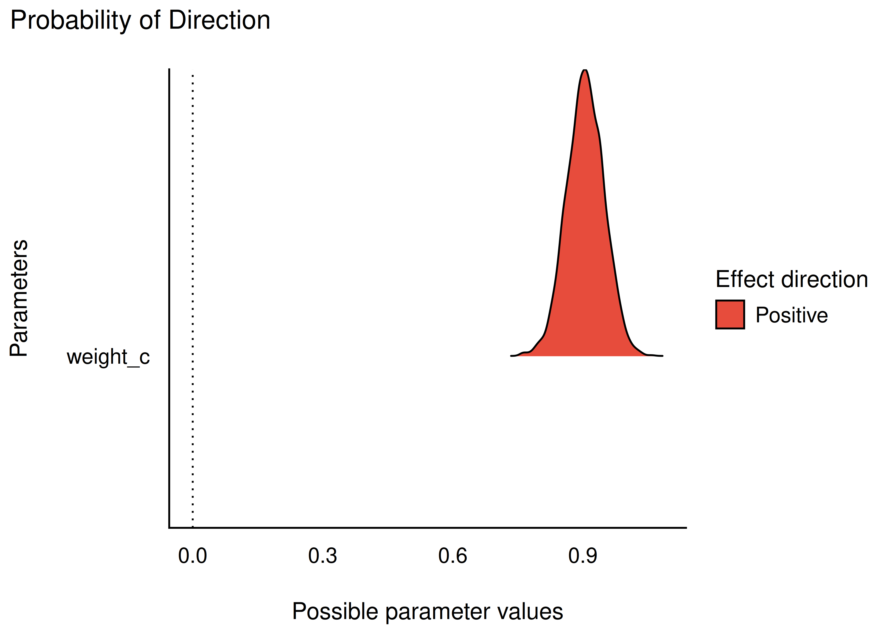{width="50%"}

- `Rhat`, `ESS`: Diagnosekennzahlen der Stichprobenziehung — bei einfachen Modellen i. d. R. unproblematisch

::: footer
Die Post-Verteilung befragen
:::

## Post-Verteilung befragen: die Bausteine

- Post-Verteilung = viele Stichproben zu $\beta_0$, $\beta_1$, $\sigma$
- `parameters(modell)`: Zusammenfassung der Post-Verteilung
- `as_tibble(modell)`: Rohe Stichproben als Tabelle
- Ergebnis für `m_kung_starkes_beta1`: $\beta_1$ (Steigung) liegt etwa zwischen 0.8 und 1.0 cm Größe pro kg Gewicht

::: footer
Die Post-Verteilung befragen
:::

## Die "mittlere" Regressionsgerade

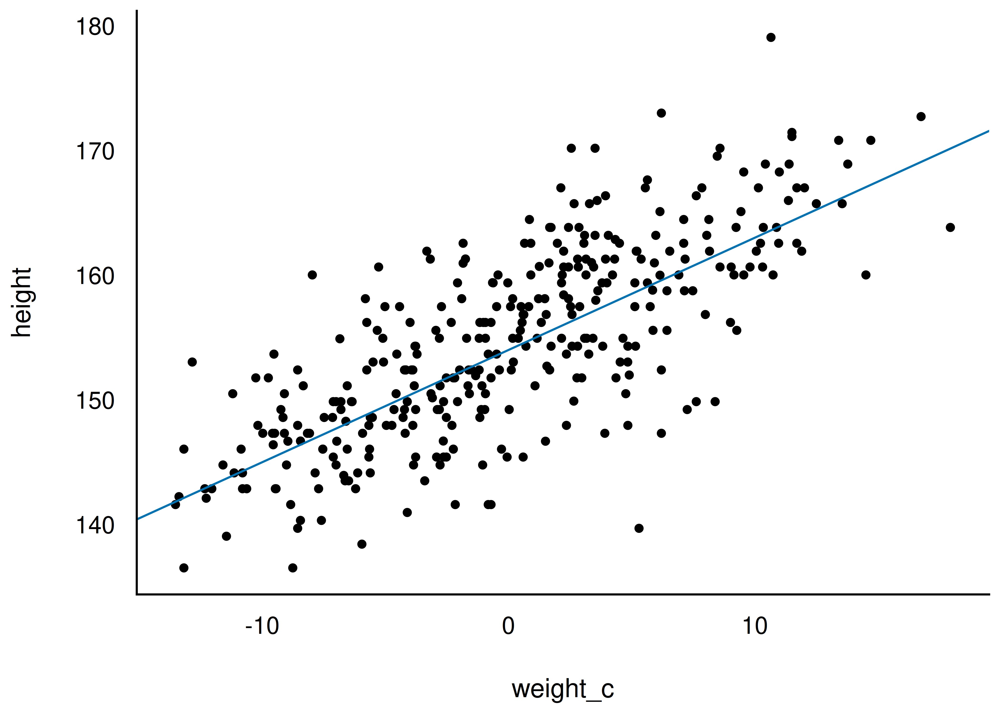{width="65%"}

::: footer
Die Post-Verteilung befragen
:::

## Post-Verteilung des Regressionsgewichts {.smaller}

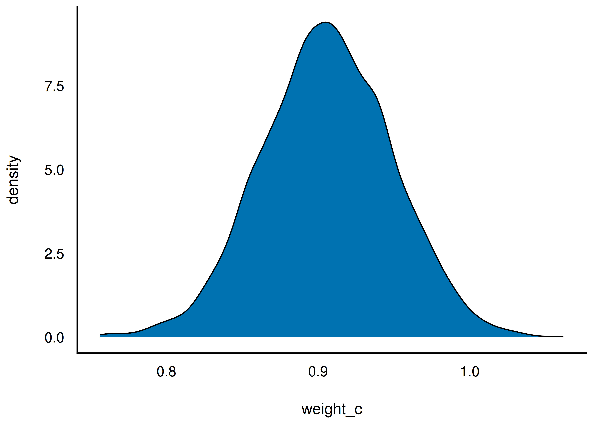{width="45%"}

- Mittelwert, Median und Modus (MAP) liegen eng beieinander

::: footer
Die Post-Verteilung befragen
:::

## Post-Verteilung von Sigma {.smaller}

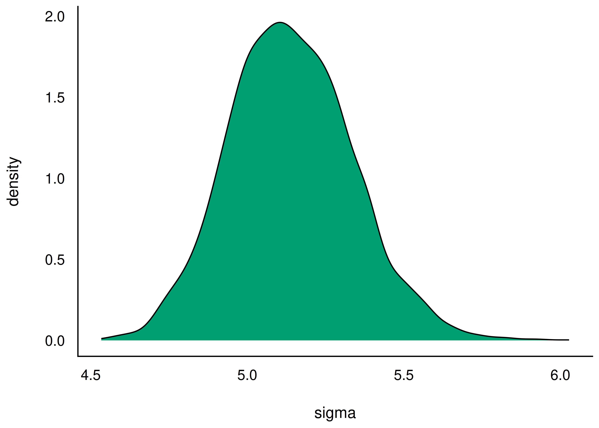{width="45%"}

- Interessant: Die *Post*-Verteilung von $\sigma$ ist normalverteilt, obwohl die *Apriori*-Verteilung exponentialverteilt war — die Daten haben den Prior "überstimmt"

::: footer
Die Post-Verteilung befragen
:::

## Ungewissheit sichtbar machen {.smaller}

- Regressionsgeraden aus einzelnen Stichproben der Post-Verteilung übereinandergelegt
- 10 Stichproben → breites Band; 1000 Stichproben → dichtes, informatives Band um die wahrscheinlichste Gerade

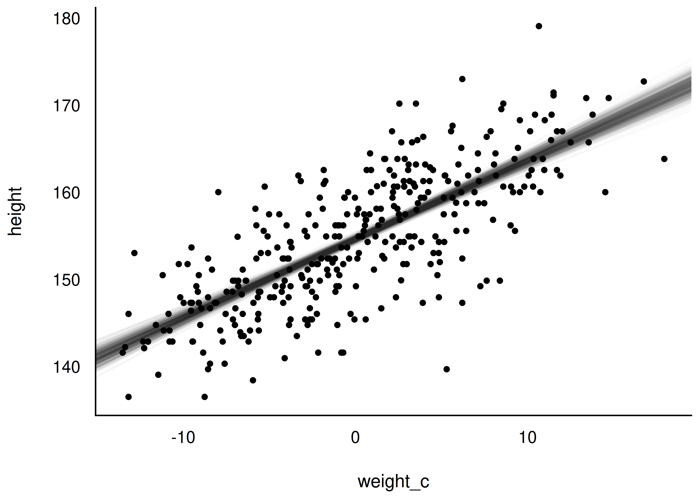{width="40%"}

::: footer
Die Post-Verteilung befragen
:::

## Erwartungswert mit Unsicherheitsband

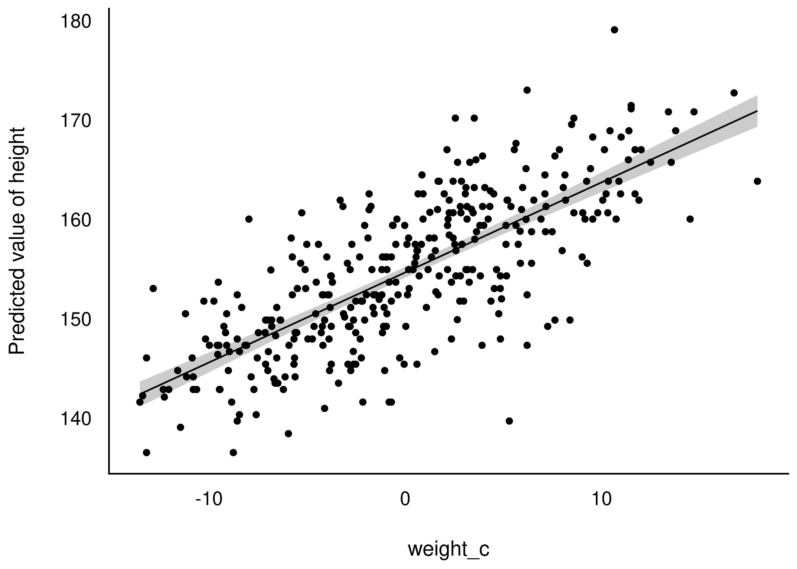{width="65%"}

::: footer
Die Post-Verteilung befragen
:::

## Fragen an die Post-Verteilung: Quantile {.smaller}

Typische Fragen an den (zentrierten) Achsenabschnitt:

- Welche mittlere Größe wird mit 50 %, 90 %, 95 % Wahrscheinlichkeit nicht überschritten?
- Welche mittlere Größe wird mit 95 % Wahrscheinlichkeit nicht unterschritten?
- Von wo bis wo reicht der innere 50 %-Schätzbereich (ETI)?

::: {.callout-note}
Statt eines 95 %-Intervalls wird teils ein 90 %- oder 89 %-Intervall empfohlen (bessere numerische Stabilität).
:::

::: footer
Die Post-Verteilung befragen
:::

## Fragen an die Post-Verteilung: Wahrscheinlichkeitsmassen

- Wie wahrscheinlich ist es, dass die mittlere Größe mindestens 155 cm beträgt?
- Wie wahrscheinlich ist es, dass die mittlere Größe höchstens 154.5 cm beträgt?

::: {.fragment}
Beantwortbar durch einfaches Auszählen der Stichproben aus der Post-Verteilung (Anteil erfüllt Bedingung).
:::

::: footer
Die Post-Verteilung befragen
:::

# Post-Verteilung bedingt auf einen Prädiktorwert {.center footer=false}

## Post-Verteilung für jeden Gewichtswert {.smaller}

- Für **jeden** beliebigen Wert des Prädiktors lässt sich eine eigene Post-Verteilung von $\mu$ berechnen
- Beispiel: Wie groß ist eine Person (im Mittel) bei Gewicht 45 kg? Bei 50 kg?

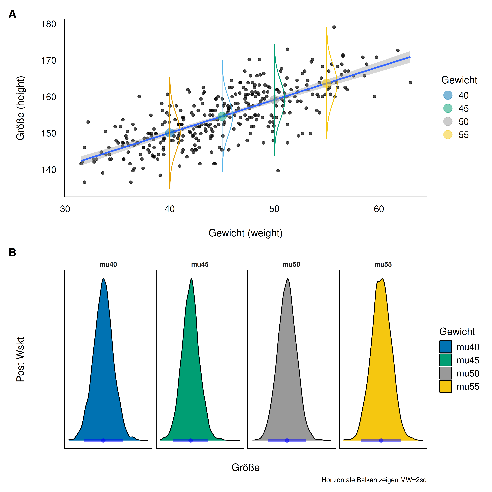{width="28%"}

::: footer
Post-Verteilung bedingt auf einen Prädiktorwert
:::

## Beispiel: $\mu$ bei Gewicht = 45 kg

- 45 kg entspricht dem Mittelwert von `weight` → `weight_c = 0`

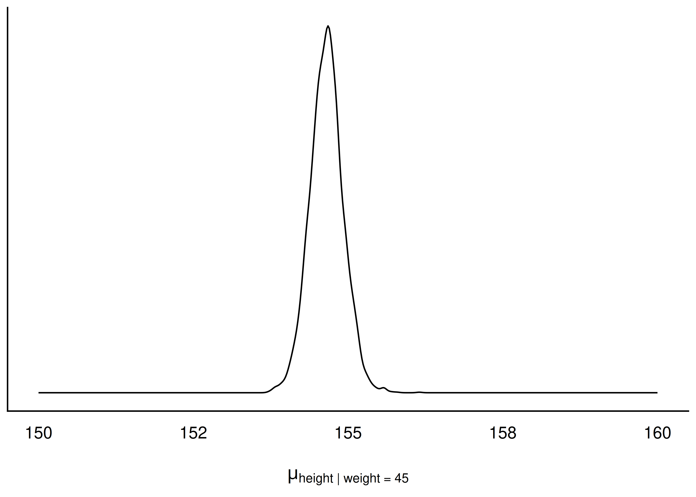{width="55%"}

::: footer
Post-Verteilung bedingt auf einen Prädiktorwert
:::

## Beispiel: $\mu$ bei Gewicht = 50 kg

- 50 kg = 5 über dem Mittelwert → `weight_c = 5`
- `mu_at_50 = (Intercept) + 5 * weight_c`

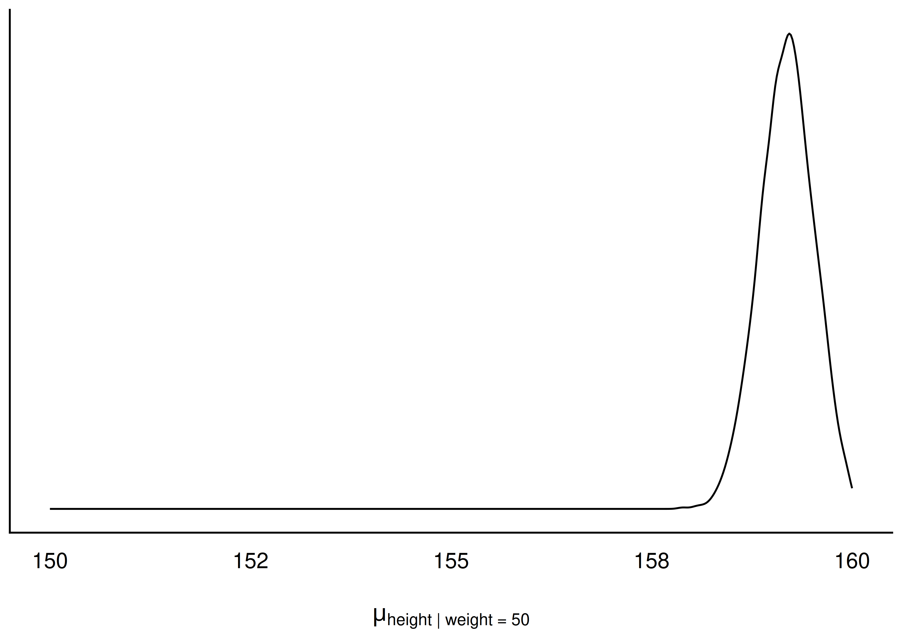{width="55%"}

::: footer
Post-Verteilung bedingt auf einen Prädiktorwert
:::

## Lagemaße und Streuungen der bedingten Post-Verteilung

- 90 %-ETI für $\mu | w = 50$: ca. 159 cm bis 160 cm
- 95 %-Quantil für $\mu | w = 45$: welche Größe wird mit 95 % nicht überschritten?

::: {.fragment}
Dieselben Werkzeuge (Quantile, ETI/HDI, Auszählen) funktionieren für jede bedingte Post-Verteilung.
:::

::: footer
Post-Verteilung bedingt auf einen Prädiktorwert
:::

# Fazit {.center footer=false}

## Zusammenfassung

- Lineares Modell + Priori-Verteilungen $\rightarrow$ Post-Verteilung für $\beta_0$, $\beta_1$, $\sigma$
- Zentrieren des Prädiktors macht $\beta_0$ leichter interpretierbar
- Die Post-Verteilung lässt sich für **jeden** Prädiktorwert befragen: Lage, Streuung, Quantile, Wahrscheinlichkeitsmassen
- Mehr Information als Punktschätzer der Frequentistischen Regression

::: footer
Fazit
:::

## Vertiefende Literatur

- @mcelreath2020, Kap. 4: vertiefte Darstellung linearer Bayes-Modelle
- @kurz2021: Tidyverse-Umsetzung der Inhalte von @mcelreath2020
- @gelman2021: Regressionsanalyse frequentistisch und Bayes

::: footer
Fazit
:::

## Vielen Dank! {.center}

Fragen?

::: footer
Fazit
:::

