## Lernziele

Nach diesem Kapitel können Sie ...

- typische, deskriptive Forschungsfragen als Regression spezifizieren
- Forschungsfragen in Regressionsterme übersetzen
- typische Forschungsfragen mit `stan_glm` auswerten

Orientiert an @mcelreath2020 (Kap. 4.4) sowie @gelman2021 (Kap. 7, 10).

## Nomenklatur

Skalenniveaus der beteiligten Variablen:

- `y`: metrische AV
- `g`: Gruppierungsvariable (nominal, mehrstufig)
- `b`: binäre UV
- `x`: metrische UV
- `u`: ungemessene (unbekannte) Variable

::: {.fragment}
Für jede Forschungsfrage: Beispiel, Modellformel, Kausalgraph, Auswertung.
:::

## Datensätze

- `kidiq`: IQ von Kindern, Schulabschluss und IQ der Mutter (R-Paket `rstanarm`)
- `penguins`: Körpermaße dreier Pinguinarten (R-Paket `palmerpenguins`)

::: {.callout-note title="Definition: Skalenniveaus"}
Um Forschungsfragen zu klassifizieren, muss man wissen, welches Skalenniveau AV und UV(s) haben.
:::

# Fallbeispiel 1: `y ~ b`

Binäre UV — Schulabschluss der Mutter

## Forschungsfrage

*Hintergrund:* Eine Schulpsychologin sucht "Risikofaktoren" für geringere Intelligenz von Kindern.

> Ist der mittlere IQ-Wert von Kindern, deren Mutter über einen Schulabschluss verfügt (`mom_hs = 1`), höher als bei Kindern ohne diesen Hintergrund (`mom_hs = 0`)? (ceteris paribus)

Modellformel: `kid_score ~ mom_hs`

## Hypothesen

::: {.callout-note title="Hypothese für ungleiche Mittelwerte"}
$$H_A: \mu_{x=1} \gt \mu_{x=0}$$
:::

- $H_0: \mu_{x=1} = \mu_{x=0}$
- ROPE-Hypothese (5 IQ-Punkte als Bagatellgrenze): $H_{ROPE}: \mu_{x=1} > \mu_{x=0} + 5$

## Kausalgraph

```{mermaid}
flowchart LR
  mom_hs --> kid_score
  u --> kid_score
```

`y` hat laut Modell zwei Ursachen: `mom_hs` und `u` (unbekannt/sonstige Einflüsse).

## Modell m10.1 {.smaller}

`stan_glm(kid_score ~ mom_hs, data = kidiq)`

::: {style="font-size: 0.7em;"}
$$\begin{aligned}
\text{kid score}_i &\sim \operatorname{Normal}(\mu_i, \sigma) && \text{Likelihood} \\
\mu_i &= \beta_0 + \beta_1 \cdot \text{mom hs}_i && \text{Lineares Modell} \\
\beta_0 &\sim \operatorname{Normal}(87, 51) && \text{Prior Achsenabschnitt} \\
\beta_1 &\sim \operatorname{Normal}(0, 124) && \text{Prior Regressionsgewicht} \\
\sigma &\sim \operatorname{Exp}(0.049) && \text{Prior Vorhersagegüte}
\end{aligned}$$
:::

## Ergebnis m10.1

`kid_score = 78 + 12*mom_hs + error`

- *Achsenabschnitt* ($\beta_0 = 78$): geschätzter IQ bei `mom_hs = 0`
- *Regressionsgewicht* ($\beta_1 = 12$): Unterschied im IQ zwischen den Gruppen
- `error`: Vorhersagefehler ($y - \hat{y}$)

Gruppenmittelwerte unterscheiden sich um ca. 12 Punkte (89.4 vs. 77.6).

## Visualisierung

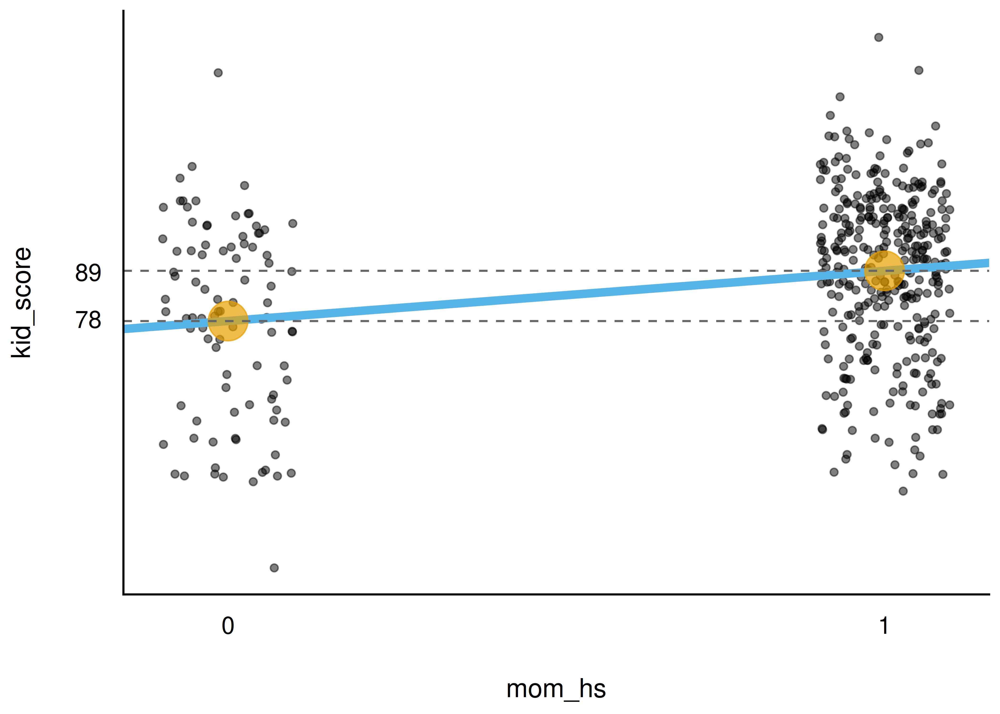{width="70%"}

## ROPE-Verfahren {.smaller}

Prüfung mit `rope(m10.1, range = c(-5, 5))`: 0 % Überlappung von ROPE und 95 %-HDI.

**Fazit:** Praktisch-Null-Hypothese wird verworfen.

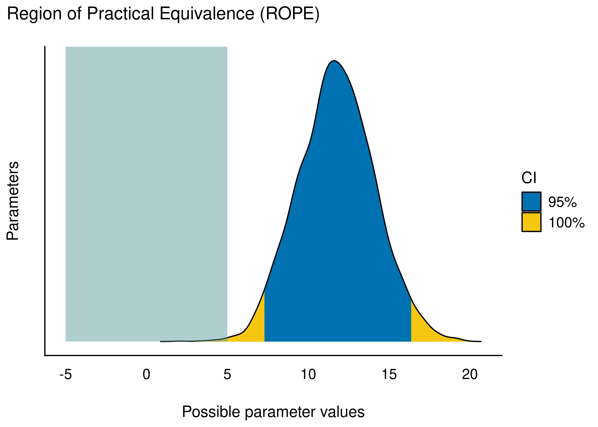{width="42%"}

## 95 %-PI und Fazit

Mit 95 % Wahrscheinlichkeit liegt der Unterschied im mittleren IQ zwischen 7 und 16 Punkten: $95\%PI: [7,16]$.

::: {.callout-important}
Korrelation ungleich Kausation. Ein Kausaleffekt braucht mehr Fundierung als eine einfache Assoziation — etwa Theorie oder bestehende Studien.
:::

Alternative (frequentistisch): der *t*-Test — führt zu ähnlichem Ergebnis wie `y ~ b`.

# Fallbeispiel 2: `y ~ x + b`

Metrische und binäre UV gemeinsam

## Forschungsfrage

> Wie stark ist der statistische Effekt von Schulabschluss der Mutter (`mom_hs`) und IQ der Mutter (`mom_iq`) auf den IQ des Kindes?

Modellformel: `kid_score ~ mom_iq + mom_hs`

Hypothesen: $\beta_{momhs} > 0$ und $\beta_{momiq} > 0$

## Kausalgraph

```{mermaid}
flowchart LR
  mom_hs --> kid_score
  mom_iq --> kid_score
  u --> kid_score
```

## Modell m10.3 {.smaller}

`stan_glm(kid_score ~ mom_iq + mom_hs, data = kidiq)`

`kid_score = 26 + 0.6*mom_iq + 6*mom_hs + error`

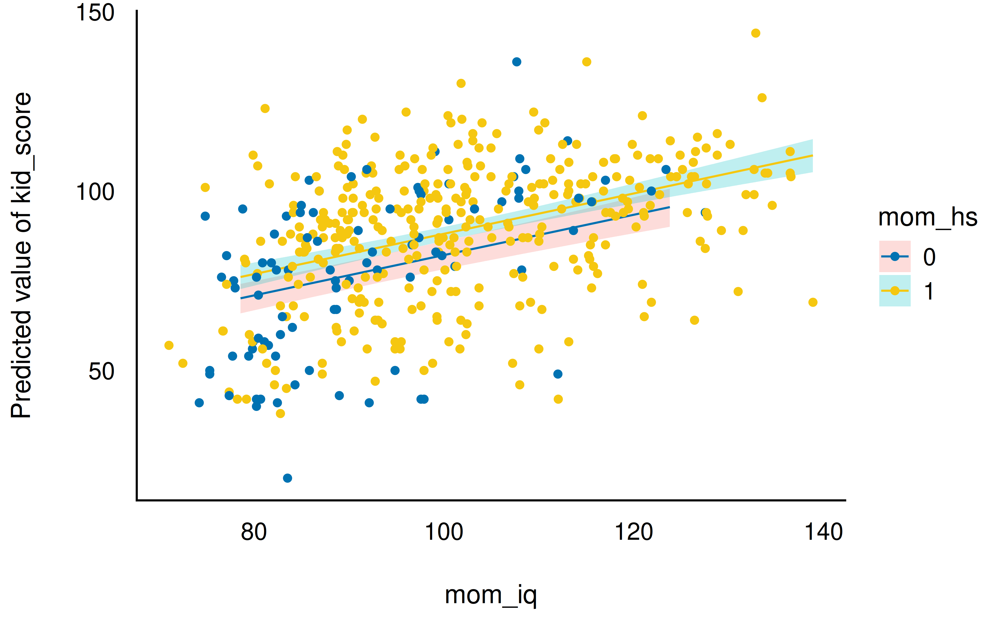{width="42%"}

## Interpretation m10.3

- *Achsenabschnitt*: IQ-Schätzung für IQ-Mutter = 0, ohne Abschluss (26 — nicht sinnvoll interpretierbar)
- *`mom_hs`*: Unterschied von 6 Punkten bei gleichem mütterlichem IQ
- *`mom_iq`*: 0.6 Punkte Unterschied pro IQ-Punkt der Mutter, bei gleichem Schulabschluss

95 %-ETI schließt für beide UV die Null aus — Nulleffekt wird abgelehnt.

# Fallbeispiel 3: Interaktion

`y ~ x + b + x:b`

## Forschungsfrage

> Gibt es einen Interaktionseffekt zwischen mütterlichem Schulabschluss und mütterlichem IQ?

::: {.callout-important}
Liegt eine Interaktion vor, unterscheidet sich die Steigung der Geraden zwischen den Gruppen. Liegt keine Interaktion vor, sind die Geraden parallel.
:::

Modell `m10.4`: `kid_score ~ mom_iq + mom_hs + mom_hs:mom_iq`

## Modellgleichung {.smaller}

::: {style="font-size: 0.7em;"}
$$\text{kid score} = \beta_0 + \beta_1 \cdot \text{mom hs} + \beta_2 \cdot \text{mom iq} + \beta_3 \cdot \text{mom hs} \cdot \text{mom iq}$$
:::

$\beta_3$ = Stärke des Interaktionseffekts (Unterschied der Steigungen).

## Visualisierung m10.4

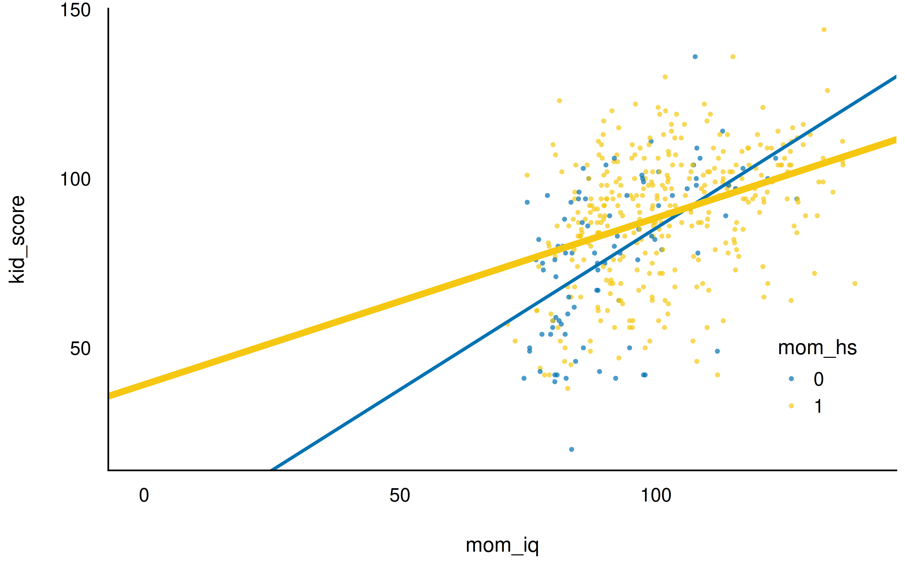{width="65%"}

Alle drei Effekte (IQ, Schulabschluss, Interaktion) schließen die Null aus.

# Fallbeispiel 4: Zentrierung

`y ~ x_c + b + x_c:b`

## Zentrieren

::: {.callout-note title="Definition: Zentrieren"}
Zentrieren (*centering*) bedeutet, die Differenz eines Messwerts zu seinem Mittelwert zu bilden: `mom_iq_c = mom_iq - mean(mom_iq)`. Zentrierte Werte machen den Achsenabschnitt einfacher interpretierbar.
:::

Modell `m10.5`: `kid_score ~ mom_hs + mom_iq_c + mom_hs:mom_iq_c`

## Interpretation m10.5 {.smaller}

- *Achsenabschnitt*: mittlerer IQ des Kindes bei Mutter *mittlerer* Intelligenz, *ohne* Abschluss
- `mom_hs`: Unterschied bei Müttern *mittlerer* Intelligenz, mit/ohne Abschluss
- `mom_iq_c`: Unterschied pro IQ-Punkt der Mutter, *ohne* Abschluss
- Interaktion: Unterschied im Koeffizienten von `mom_iq_c` zwischen den Gruppen

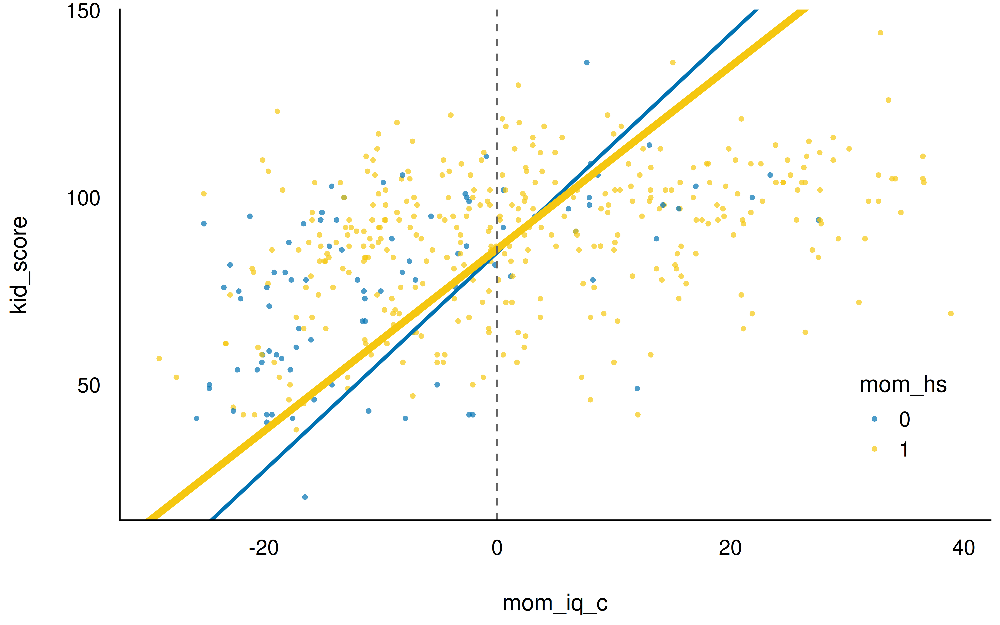{width="34%"}

## Wichtig: Zentrieren ändert nichts an...

- den Vorhersagen des Modells
- der Streuung der Vorhersagen ($\sigma$)
- den Regressionskoeffizienten selbst

Es ändert nur die **Interpretierbarkeit** des Achsenabschnitts.

::: {.callout-important}
Kausalaussagen (z. B. im DAG postuliert) benötigen eine explizite Begründung aus der Literatur — sonst nicht haltbar.
:::

# Fallbeispiel 5: `y ~ g`

Nominale UV mit mehreren Stufen — Pinguine

## Forschungsfrage

> Unterscheiden sich die mittleren Körpergewichte der drei Pinguinarten (Adelie, Chinstrap, Gentoo)?

Modellformel: `body_mass_g ~ species`

```{mermaid}
flowchart LR
  g[species] --> y[body_mass_g]
  u --> y
```

## Von der Nullhypothese zur besseren Frage

$H_0: \mu_1 = \mu_2 = \ldots = \mu_k$ — dass *alle* Mittelwerte exakt gleich sind, ist unplausibel.

Bessere Frage:

> *Wie sehr* unterscheiden sich die mittleren Körpergewichte zwischen den Pinguinarten?

(Frequentistisches Pendant: *Varianzanalyse*/ANOVA. Bayesianisch: Post-Verteilung.)

## Verteilung des Gewichts

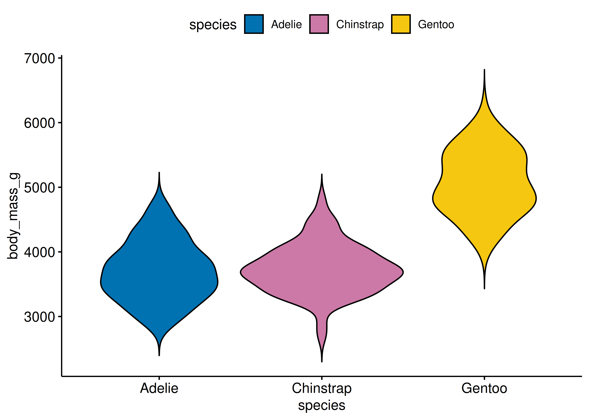{width="60%"}

## Modell m10.6 {.smaller}

`stan_glm(body_mass_g ~ species, data = penguins)`

- Referenzkategorie (`Adelie`, im Achsenabschnitt): mittleres Gewicht ca. 3700 g
- Koeffizienten für `Chinstrap`/`Gentoo`: Unterschied zur Referenzgruppe

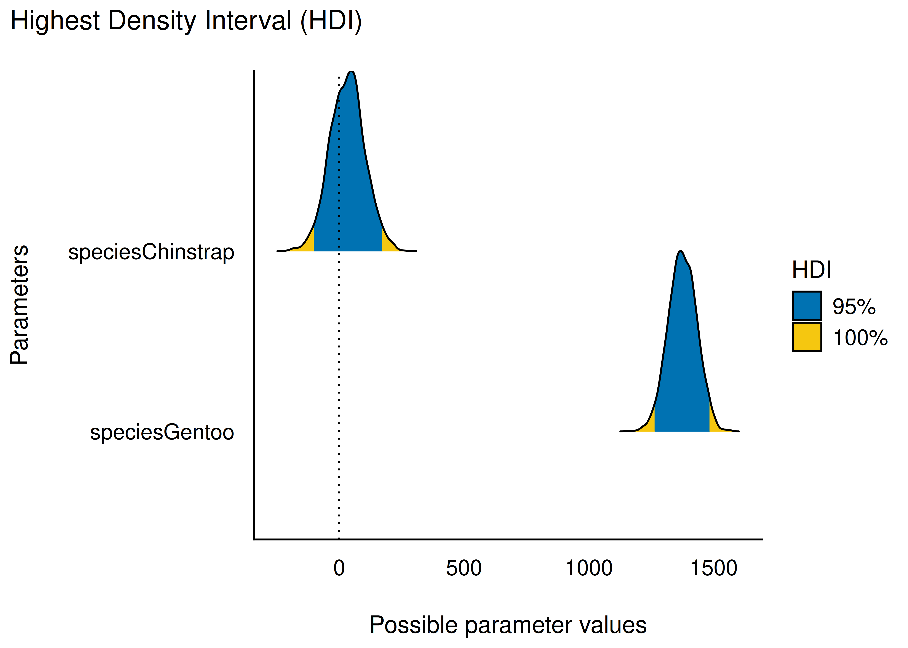{width="34%"}

## Interpretation

- `Gentoo`: deutlich schwerer als `Adelie` (Intervall überlappt Null nicht)
- `Chinstrap`: ähnlich zu `Adelie` (Intervall überlappt deutlich mit Null)

**Fazit:** nicht alle Gruppen unterscheiden sich gleichermaßen — die exakte Nullhypothese wird dennoch verworfen.

## Vertiefung: Referenzkategorie wechseln

- `species` sollte als `factor` kodiert werden
- Standard: alphabetische Sortierung der Stufen
- `fct_relevel(species, "Gentoo")` setzt neue Referenzkategorie

Der Wechsel der Referenzkategorie ändert **nichts Wesentliches** am Modell — nur welche Vergleiche direkt ablesbar sind.

# Fallbeispiel 6: `y ~ x1 + x2`

Zwei metrische UV

## Forschungsfrage

> Stehen sowohl der IQ der Mutter als auch, unabhängig davon, das Alter der Mutter im Zusammenhang mit dem IQ des Kindes?

**Deskriptive** Forschungsfrage — keine Kausalwirkung impliziert.

::: {.callout-important}
"Effekt" klingt nach Kausalzusammenhang. Eine Regression allein ist keine hinreichende Begründung für Kausalität.
:::

## Zusammenhänge explorieren

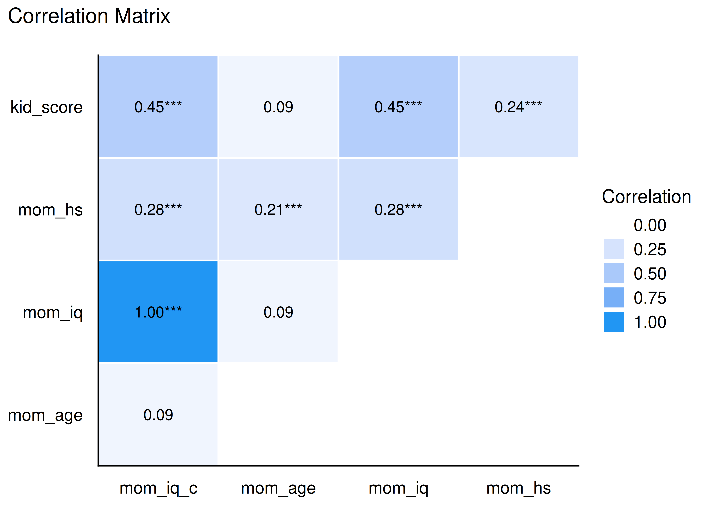{width="55%"}

## Univariate vs. multiple Regression {.smaller}

Univariate Modelle: `kid_score ~ mom_iq` (m10.7), `kid_score ~ mom_age` (m10.8)

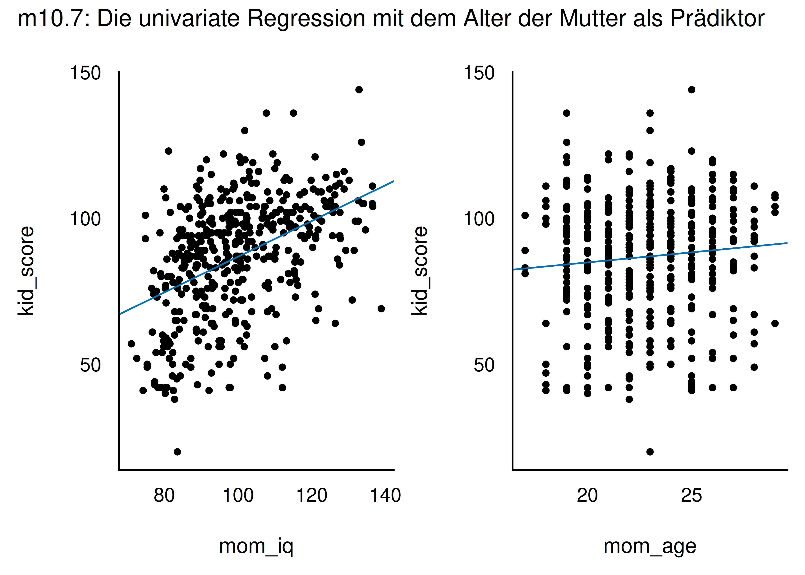{width="46%"}

## Multiples Modell m10.9 {.smaller}

`stan_glm(kid_score ~ mom_iq + mom_age, data = kidiq)`

::: {.callout-important}
Regressionsgewichte im multiplen Modell unterscheiden sich (potenziell) von den univariaten Modellen — sie sind "bereinigt" um den jeweils anderen Prädiktor.
:::

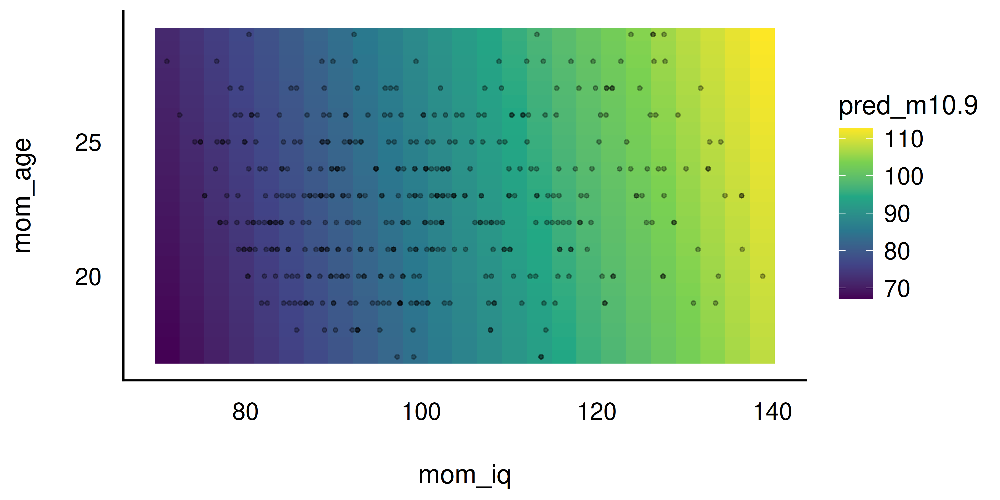{width="34%"}

`mom_iq` erklärt sichtbar mehr Variation als `mom_age`.

# Fallbeispiel 7: Standardisierung

`y ~ x1_z + x2_z` und `y_z ~ x1_z + x2_z`

## Warum standardisieren?

Welcher Prädiktor ist "wichtiger"? Das hängt auch von der **Skalierung** ab — `mom_iq` streut stärker als `mom_age`.

::: {.callout-note title="Definition: z-Standardisierung"}
$$z = \frac{x - \bar{x}}{sd(x)}$$
Ergebnis: Mittelwert 0, SD 1 — macht Effekte verschiedener Prädiktoren vergleichbar.
:::

## Vorteile der z-Transformation

- Achsenabschnitt leichter interpretierbar (bezieht sich auf mittlere Ausprägung)
- Interaktionen leichter interpretierbar
- Prioris leichter zu definieren
- Effektgrößen verschiedener Prädiktoren vergleichbar
- numerisch stabiler für den Sampler

In R: `standardize()` aus `easystats` oder `scale()`.

## Modell m10.12 (AV und UV standardisiert)

`stan_glm(kid_score_z ~ mom_iq_z + mom_age_z, data = kidiq_z)`

- Achsenabschnitt = Mittelwert der AV (da `kid_score_z = 0` = Mittelwert)
- Koeffizienten: Änderung der AV in SD-Einheiten pro SD-Einheit Änderung der UV

95 %PI `mom_iq_z`: [0.38, 0.51] — `mom_age_z`: [-0.02, 0.12]

## Ergebnisdarstellung {.smaller}

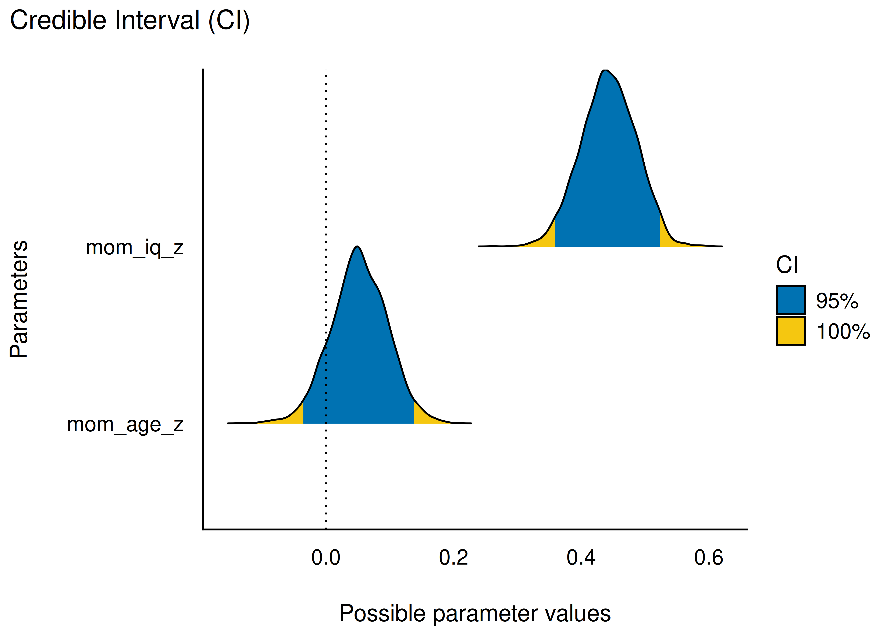{width="34%"}

**Fazit:** Intelligenz der Mutter ist statistisch relevant, Alter der Mutter eher nicht. $R^2 \approx 0.2$.

::: {.callout-important}
"Statistischer Effekt" statt "Effekt" betonen — kausale Sprache nur mit Begründung (Theorie/Literatur/Experiment).
:::

## Vertiefung: Regression = Korrelation bei z-Werten

::: {.callout-note title="Theorem: Beta-r-Zusammenhang"}
$$b = r \frac{sd_y}{sd_x}$$
Sind X und Y z-standardisiert, sind Regressionskoeffizient und Korrelation identisch.
:::

## Residualanalyse

Zentrale Annahme: AV ist *lineare* Funktion der Prädiktoren, $y = \beta_0 + \beta_1 x_1 + \beta_2 x_2 + \cdots$

Residuum: $e_i = y_i - \hat{y}_i$

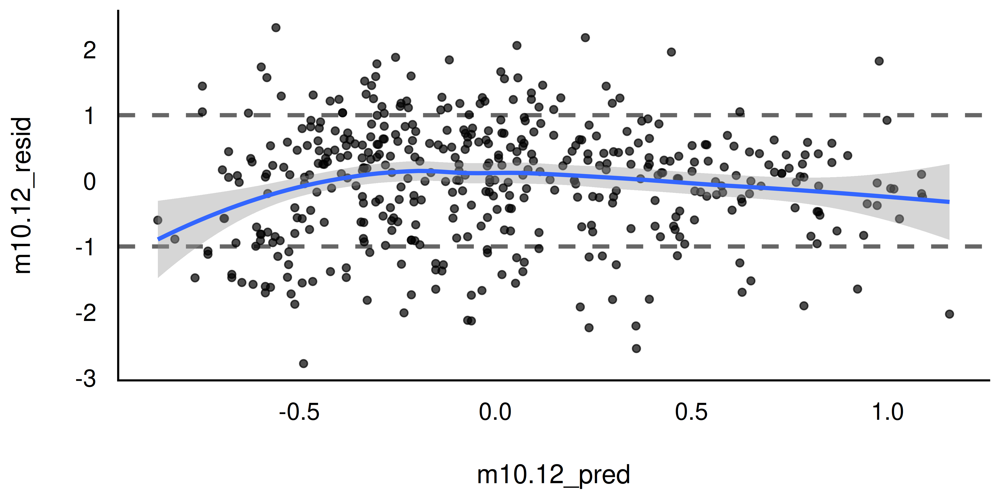{width="55%"}

## Bereinigte Koeffizienten {.smaller}

Multiple Regressionskoeffizienten = Regression der **Residuen** eines Prädiktors (nach Herausrechnen des anderen) auf die AV.

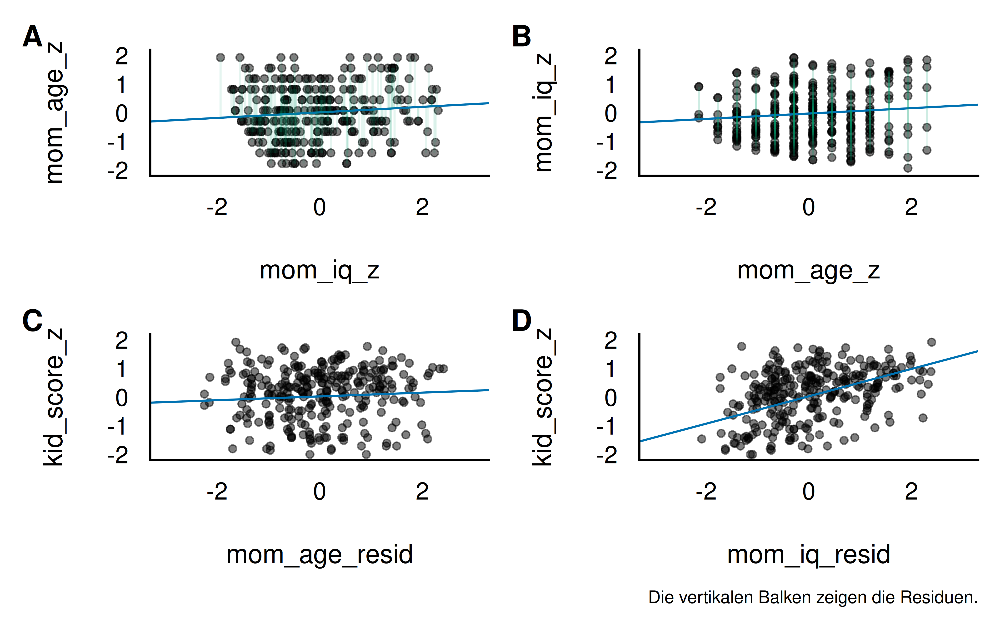{width="40%"}

`mom_iq`-Residuen sind stark mit der AV assoziiert, `mom_age`-Residuen kaum.

## Bayes vs. Frequentistisch

`stan_glm()` und `lm()` liefern bei schwach informativen Priors ähnliche Punktschätzer.

::: {.callout-important}
Numerisch ähnliche Ergebnisse, aber grundverschiedene Interpretation: Bayes-Modelle erlauben Wahrscheinlichkeitsaussagen zu Parametern, frequentistische nicht.
:::

## Fazit

- Viele Forschungsfragen lassen sich einheitlich als Regression mit metrischer AV behandeln
- Bausteine: binäre/nominale/metrische UV, Interaktionen, Zentrierung, Standardisierung
- Bayesianische Auswertung: Post-Verteilung, PI/HDI, ROPE statt (nur) Signifikanztests
- Korrelation/Regression $\neq$ Kausation — kausale Aussagen brauchen Begründung

**Ausblick:** Regression mit binärer AV (nächstes Kapitel).
