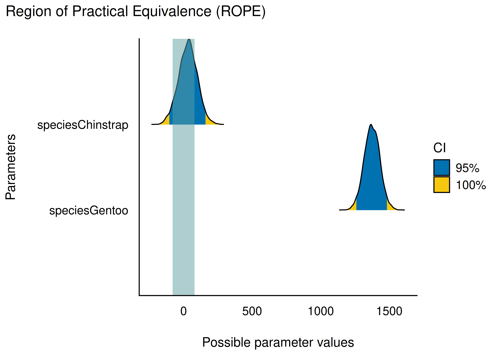
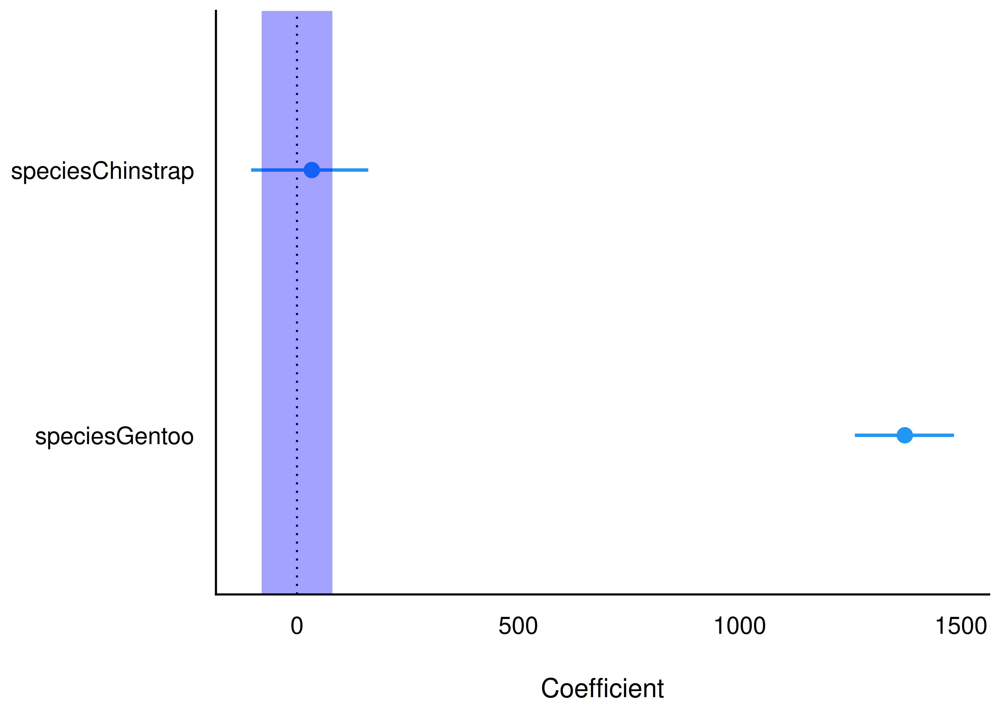
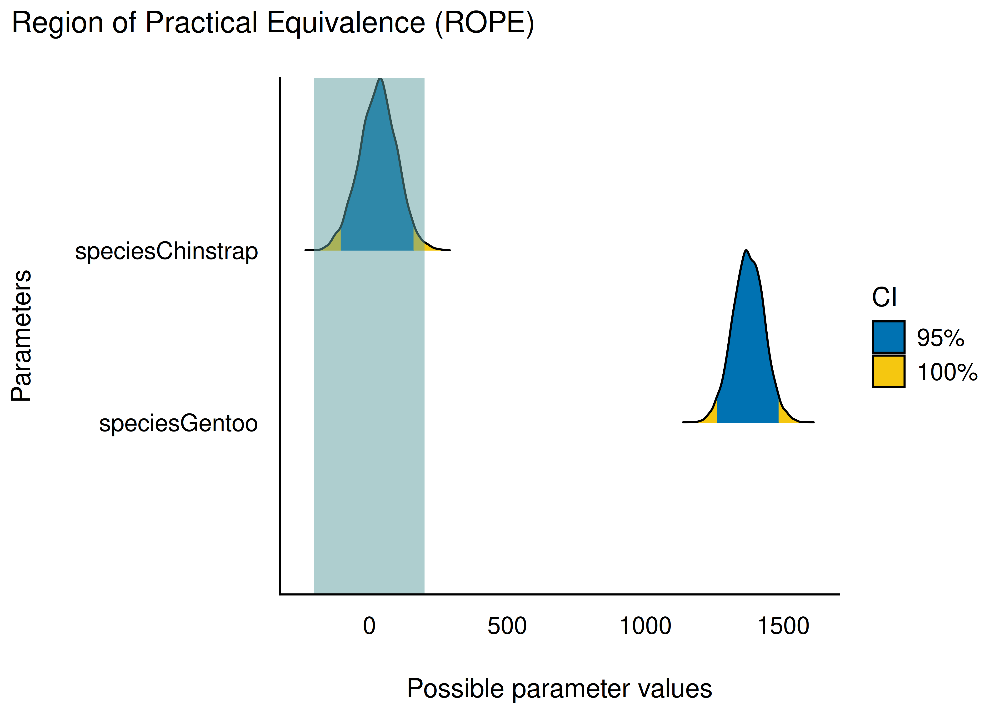
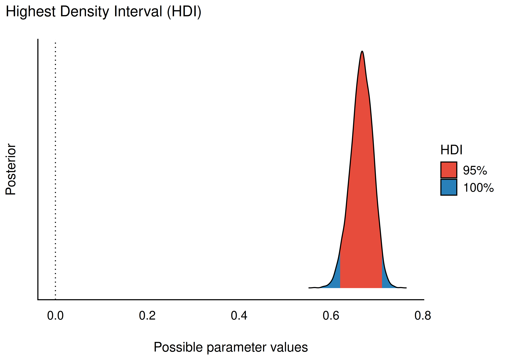

## Lernziele {.smaller}

Nach diesem Kapitel können Sie ...

- den Unterschied zwischen dem *Schätzen* von Modellparametern und dem *Testen* von Hypothesen erläutern
- Vor- und Nachteile des Schätzens und Testens diskutieren
- das ROPE-Konzept erläutern und anwenden
- die Güte von Regressionsmodellen einschätzen und berechnen

Begleitliteratur: @kruschke2018

## Einstieg: Zwei Arten von Forschungsfragen

1. "Lernen für die Klausur bringt etwas!" — eine **Behauptung**
2. "Wie viel bringt Lernen für die Klausur?" — eine **Frage**

::: {.fragment}
Einmal Behauptung, einmal Frage — was macht das für einen Unterschied?
:::

## Zwei Arten, Forschungsfragen zu beantworten

1. **Hypothesen testen**: "Die Daten widerlegen die Hypothese (nicht)"
2. **Parameter schätzen**: "Der Effekt von X auf Y liegt zwischen A und B"

## Hypothesen testen: drei mögliche Ergebnisse

Beispiel: "Lernen erhöht den Prüfungserfolg!"

1. 🟥 Die Daten *widersprechen* der Hypothese — Ablehnung (Falsifikation)
2. 🟢 Die Daten *unterstützen* die Hypothese — Annahme
3. ❓ Die Datenlage ist *unklar* — kein Erkenntnisgewinn

::: {.fragment}
Hypothesentests sind **binär**: Sie führen zu Schwarz-Weiß-Ergebnissen.
:::

## Die Nullhypothese {.smaller}

:::{.callout-important}
Häufigste Variante: Test der Hypothese "Es liegt kein (null) Effekt vor" — die **Nullhypothese**, $H_0$.
:::

Beispiele für Nullhypothesen:

- "Lernen bringt nichts"
- "Frauen und Männer parken gleich schnell ein"
- "Es gibt keinen Zusammenhang von Babies und Störchen"
- "Bei Frauen ist der Anteil, die Statistik mögen, gleich hoch wie bei Männern"

*Vorteil* des Hypothesentestens: klares, einfaches Ergebnis — reduziert Komplexität für Entscheidungen.

## Popper: Man kann Hypothesen nicht bestätigen

:::{.callout-note title="Karl Poppers Falsifikationismus"}
Hypothesen lassen sich nicht bestätigen (verifizieren), nur falsifizieren [@popper2013].

Beispiel $H$: "Alle Schwäne sind weiß." Auch viele weiße Schwäne beweisen $H$ nicht — der eine schwarze Schwan könnte noch fehlen. Aber ein einziger zuverlässig beobachteter schwarzer Schwan widerlegt $H$.
:::

::: {.fragment}
In der Praxis: Hypothesen werden meist **probabilistisch** untersucht — komplett sichere Belege wie bei Popper sind selten. Sowohl Bestätigung als auch Widerlegung sind daher (graduell) möglich [@kruschke2018; @morey2011].
:::

## Parameter schätzen

Beim Schätzen fragt man **wie groß** ein Effekt ist — ein "wieviel", kein "ja/nein".

Zwei Varianten:

a) ⚫ **Punktschätzung**: ein einzelner Parameterwert ("Best Guess")
b) 📏 **Bereichsschätzung**: ein Bereich plausibler Parameterwerte

::: {.fragment}
Liegt ein bestimmter Wert (z. B. Null) *nicht* im Schätzbereich, kann man die entsprechende Hypothese verwerfen. Das Hypothesentesten steckt also implizit im Schätzen.
:::

## Beispiel: Geschlecht und Pinguingewicht {.smaller}

{width="22%"}

Forschungsfrage: Um welchen Wert sind männliche Pinguine im Schnitt schwerer als weibliche?

- Modell: `body_mass_g ~ sex`
- Ergebnis: Punktschätzer ca. 700 g Unterschied
- 95 %-ETI: ca. 500 g bis 800 g

## Parameterschätzung als Nullhypothesentest {.smaller}

Forschungsfrage: Sind männliche Pinguine im Schnitt schwerer als weibliche?

$$H: \mu_M \ge \mu_F \rightarrow d = \mu_M - \mu_F \ge 0$$

- $d = 0 \Leftrightarrow \beta_1 = 0$ im Regressionsmodell
- Anteil der Post-Stichproben mit `sexmale > 0`: 100 % (4000 von 4000)
- Also: Modell räumt der Hypothese $p_H = 1$ ein (in der *kleinen Welt* des Modells)

::: {.fragment}
*Vorteil* der Parameterschätzung: nuancierteres Ergebnis, das der Komplexität realer Systeme besser gerecht wird.
:::

## Nullhypothesen sind fast immer falsch {.smaller}

{width="20%"}

> We do not generally use null hypothesis significance testing in our own work. [...] just about every treatment one might consider will have *some* effect, and no comparison or regression coefficient of interest will be exactly zero. [@gelman2021]

## Alternativen zu Nullhypothesentests

Nullhypothesen wie $\rho=0$, $\mu_1=\mu_2$, $\beta_1=0$ sind streng genommen fast nie exakt wahr. Alternativen:

- Posteriori-Intervalle (ETI oder HDI) berichten
- **ROPE**-Konzept [@kruschke2018]
- Wahrscheinlichkeit inhaltlich bedeutsamer Hypothesen quantifizieren (z. B. $\beta_1 > 0{,}42$)
- *Probability of direction* (pd): Wahrscheinlichkeit für ein positives/negatives Vorzeichen

## Definition: ROPE

:::{.callout-note title="Definition: ROPE"}
ROPE (Region of Practical Equivalence) ist ein Bereich um den Nullwert, der als **praktisch äquivalent zu Null** angesehen wird.
:::

Beispiele:

- Preisunterschied bis 100 € gilt als "praktisch gleich"
- Gewichtsunterschied bis 100 g bei Pinguinen als "vernachlässigbar"
- Umsatzunterschied bis 100k € als "praktisch irrelevant"

## ROPE-Entscheidungsregel

Nach @kruschke2018:

- Großteil der Post-Verteilung liegt **innerhalb** des ROPE $\rightarrow$ *Annahme* der "praktisch kein Effekt"-Hypothese
- Großteil liegt **außerhalb** des ROPE $\rightarrow$ *Ablehnung* dieser Hypothese
- Sonst $\rightarrow$ **keine Entscheidung** — Datenlage uneindeutig

"Großteil" = per Default das 95 %-HDI der Posteriori-Verteilung.

## ROPE-Grenzen festlegen

- Die Grenze $d$ ist **subjektiv** — geleitet von inhaltlichen Überlegungen
- Für Regressionskoeffizienten schlägt @kruschke2018 vor: vernachlässigbarer Effekt = $\hat{y} = \pm 0{,}1\, sd_y$

:::{.callout-note title="ROPE-Default"}
Voreinstellung: ROPE-Größe = ±10 % der Standardabweichung der AV.
:::

## ROPE visualisiert

![Entscheidungsregeln zum ROPE: A verwirft die ROPE-Hypothese, B/C akzeptieren sie, D–F liefern keine klare Entscheidung [@kruschke2018]](../img/Kruschke-2018-Fig1.png){width="70%"}

## Rope berechnen: Pinguinarten

Modell: `body_mass_g ~ species` (Referenz: Adelie)

- **Chinstrap**: beträchtlicher Anteil der Post-Verteilung liegt im ROPE $\rightarrow$ ROPE-Hypothese kann *nicht verworfen* werden — **unklare Datenlage**
- **Gentoo**: 0 % im ROPE $\rightarrow$ ROPE-Hypothese wird *verworfen* — substanziell schwerer als Adelie

ROPE-Grenzwert hier: ±80 g (10 % der SD der AV)

## Rope-Werte visualisiert {.smaller}

{width="35%"} {width="35%"}

- Chinstrap: ROPE durchkreuzt die Verteilung deutlich — HDI liegt nicht komplett im ROPE $\rightarrow$ keine klare Entscheidung
- Gentoo: liegt weit außerhalb des ROPE-Bands $\rightarrow$ substanzieller Unterschied zu Adelie

## Finetuning des ROPE {.smaller}

Die ROPE-Grenzen lassen sich anpassen, z. B. auf ±200 g:

{width="40%"}

Auch das Kredibilitätsintervall ist wählbar (z. B. 89 % statt 95 %).

## Wozu Modellgüte?

- Man möchte wissen, wie **belastbar** die Ergebnisse eines Modells sind
- Kennwerte der Modellgüte schätzen die **Präzision** der Modellaussagen
- Ein Modell kann aus mehreren unterschiedlich präzisen Parameterschätzungen bestehen $\rightarrow$ zusammenfassender Kennwert hilfreich
- Gebräuchliche Kennzahl: $R^2$

## Modellgüte mit $R^2$ {.smaller}

- $R^2$ gibt den Anteil der Gesamtvarianz der AV an, den das Modell erklärt
- Höhere Werte $\rightarrow$ das Modell erklärt die Daten besser
- Klassisches $R^2$: nur ein Punktschätzer — Ungewissheit bleibt unberücksichtigt
- **Bayes-$R^2$**: liefert eine ganze Post-Verteilung von $R^2$

{width="38%"}

## $R^2$ und $\sigma$

- $R^2$ und $\sigma$ sind **negativ assoziiert**: hohes $R^2$ $\leftrightarrow$ geringes $\sigma$
- Beide Kennwerte dienen demselben Zweck: Abschätzung der Modellgüte
- Bayesianisch: nicht nur ein Punktschätzer, sondern ein Schätzbereich für $R^2$

## Fazit

- Hypothesentests sind aktuell verbreiteter, aber die **Parameterschätzung** hat wichtige Vorzüge (Nuanciertheit, Präzisionsangabe)
- Wer dennoch (aus Anschlussfähigkeit an bestehende Forschung) einen Nullhypothesentest möchte: das **ROPE-Verfahren** bietet eine sinnvolle Brücke zwischen beiden Ansätzen

## Vielen Dank! {.center}

Fragen?
