# Datensatz {.center footer=false}

## Konfundierung

- Einstieg in die *Kausalanalyse* (Kausalinferenz)
- Zentrale Frage: Was ist die Ursache eines Phänomens?
- Heute: ein häufiger Fall von **Scheinkorrelation** — die *Konfundierung*

::: footer
Datensatz
:::

## Lernziele

Sie können ...

- erklären, was eine Konfundierung ist
- DAGs lesen und zeichnen
- Konfundierung in einem DAG erkennen

::: footer
Datensatz
:::

# Einstieg {.center footer=false}

## Von Störchen und Babies

- Klassisches Beispiel: `Anzahl_Stoerche` und `Anzahl_Babies` sind korreliert
- Moral der Geschichte: Nur weil zwei Variablen korrelieren, heißt das nicht, dass die eine die Ursache der anderen ist

::: {.fragment}
Und: Ein Regressionsgewicht ungleich Null in einer Regressionsanalyse bedeutet **nicht automatisch**, dass die UV Ursache der AV ist.
:::

::: footer
Einstieg
:::

# Statistik, was soll ich tun? {.center footer=false}

## Studie A: Östrogen — Was raten Sie dem Arzt?

| Gruppe | Mit Medikament | Ohne Medikament |
|---|---|---|
| Männer | 81/87 (93 %) | 234/270 (87 %) |
| Frauen | 192/263 (73 %) | 55/80 (69 %) |
| **Gesamt** | 273/350 (78 %) | **289/350 (83 %)** |

- Bei Männern *und* bei Frauen hilft das Medikament
- *Insgesamt* aber scheinbar nicht — Widerspruch?

::: footer
Statistik, was soll ich tun?
:::

## Kausalmodell zur Studie A {.smaller}

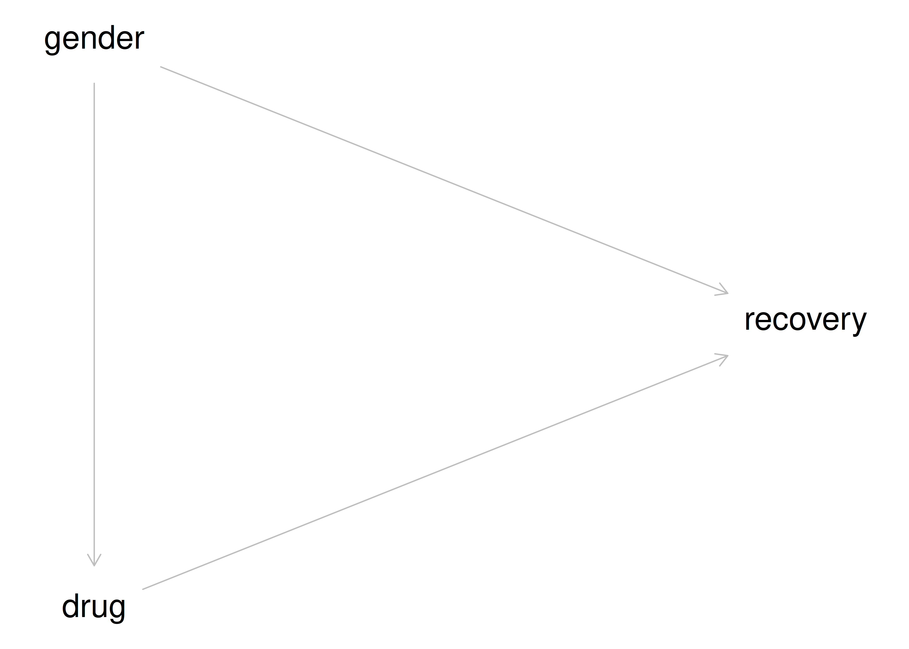{fig-align="center" width="35%"}

- Geschlecht beeinflusst Medikamenteneinnahme *und* Heilung
- Effekt von Geschlecht und Medikament ist in den Gesamtdaten **vermengt** (konfundiert)

::: {.callout-important}
Hier zeigt die **Stratifizierung** (Betrachtung pro Gruppe) den wahren kausalen Effekt.
:::

::: footer
Statistik, was soll ich tun?
:::

## Studie B: Blutdruck — Was raten Sie dem Arzt?

| Gruppe | Ohne Medikament | Mit Medikament |
|---|---|---|
| geringer Blutdruck | 81/87 (93 %) | 234/270 (87 %) |
| hoher Blutdruck | 192/263 (73 %) | 55/80 (69 %) |
| **Gesamt** | 273/350 (78 %) | **289/350 (83 %)** |

- Innerhalb jeder Blutdruckgruppe scheint das Medikament zu *schaden*
- *Insgesamt* scheint es zu *nutzen* — gleiche Zahlen wie Studie A, andere Geschichte!

::: footer
Statistik, was soll ich tun?
:::

## Kausalmodell zur Studie B {.smaller}

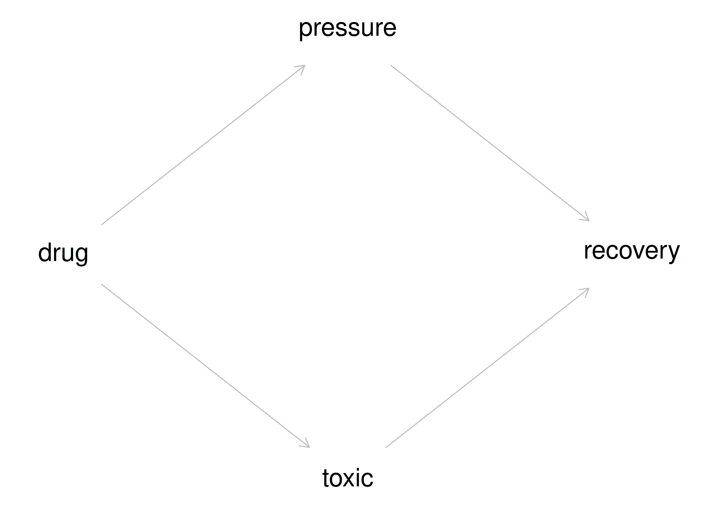{fig-align="center" width="35%"}

- Medikament senkt Blutdruck (gut) **und** wirkt toxisch (schlecht)
- Blutdrucksenkung wirkt sich positiv auf Heilung aus

::: {.callout-important}
Hier zeigen die **Gesamtdaten** den wahren Effekt. Stratifizieren wäre hier *falsch* — man sähe nur den toxischen Teileffekt.
:::

::: footer
Statistik, was soll ich tun?
:::

## Gleiche Daten, unterschiedliches Kausalmodell

- Studie A und Studie B haben **identische** Zahlen
- Aber: **unterschiedliche Kausalmodelle** → unterschiedliche richtige Antworten
- Kausale Interpretation ist nur möglich, wenn das Kausalmodell bekannt ist
- Die Daten allein reichen **nicht**

::: footer
Statistik, was soll ich tun?
:::

## Sorry, Statistik: Du allein schaffst es nicht

::: {.callout-important}
Für Entscheidungen ("Was soll ich tun?") braucht man kausales Wissen.
Kausales Wissen basiert auf einer **Theorie (Kausalmodell) plus Daten**.
:::

- Datenanalyse allein reicht *nicht* für Kausalschlüsse
- Datenanalyse + Kausalinferenz erlaubt Kausalschlüsse

::: footer
Statistik, was soll ich tun?
:::

## Vertiefung: Studie C — Nierensteine {.smaller}

- Ärzte wählen Behandlung A bei großen Steinen, Behandlung B bei kleinen
- Größe beeinflusst Behandlung **und** Heilung
- Kette: Größe $\rightarrow$ Behandlung $\rightarrow$ Heilung, plus direkter Effekt Größe $\rightarrow$ Heilung

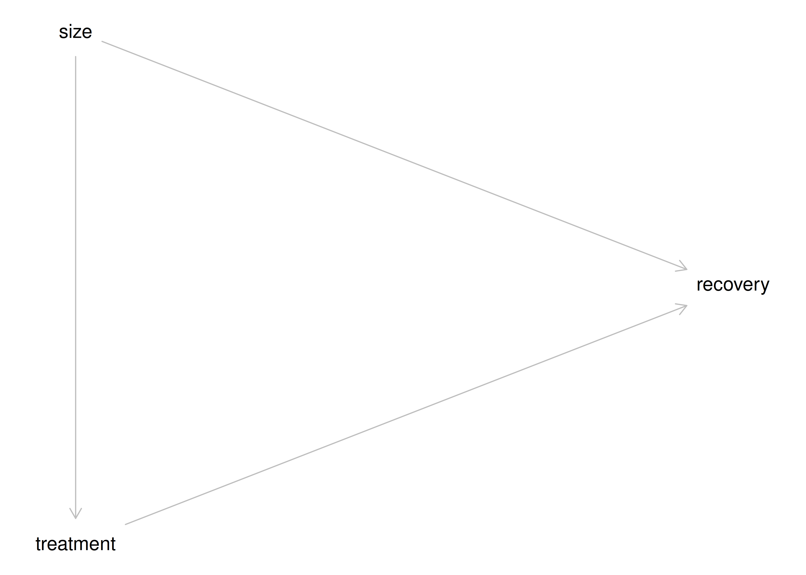{fig-align="center" width="30%"}

::: footer
Statistik, was soll ich tun?
:::

## Nierensteine: sollte man `size` kontrollieren?

- Ziel: Kausaleffekt von `treatment` schätzen
- **Ja** — `size` sollte kontrolliert werden
- Ohne Kontrolle: vermengter Effekt von `size` und `treatment`, keine belastbare Aussage über die Behandlung

::: footer
Statistik, was soll ich tun?
:::

## Weitere Scheinkorrelationen

- "Einkommen und Heiraten korrelieren hoch — also erhöht Heiraten dein Einkommen." Wirklich?
- "Wer sich beeilt, kommt zu spät zur Besprechung — also lieber nicht beeilen." Wirklich?
- Beide Schlüsse sind voreilig: mögliche Drittvariablen im Spiel

::: footer
Statistik, was soll ich tun?
:::

## Zwischenfazit

- **Beobachtungsstudien:** Aus den Daten allein ist nicht erkennbar, ob ein kausaler Effekt vorliegt — nur Kenntnis des Kausalmodells + Daten erlaubt eine Entscheidung
- **Experimentelle Daten:** Kausalmodell ist (bei gutem Design) nicht nötig — Randomisierung und Kontrolle verhindern Konfundierung

::: footer
Statistik, was soll ich tun?
:::

# Konfundierung {.center footer=false}

## Die Geschichte von Angie und Don

- 🧑 **Don**: Immobilienmogul, Auftraggeber
- 👩 **Angie**: Data Scientistin
- Datensatz: `SaratogaHouses` — Hauspreise im Saratoga County, USA
- Don will wissen: Was ist meine Immobilie wert?

::: footer
Konfundierung
:::

## Modell 1: Preis als Funktion der Zimmerzahl {.smaller}

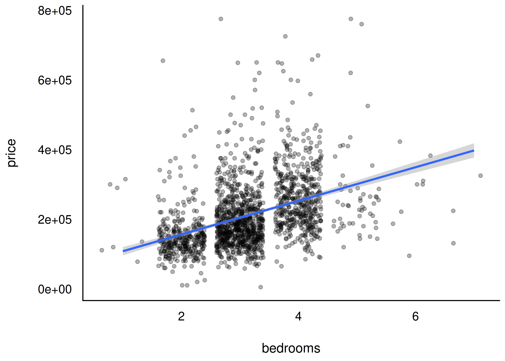{fig-align="center" width="38%"}

- `m1: price ~ bedrooms`
- Jedes Zimmer mehr ist ca. 50.000 $ wert (laut `m1`)

::: footer
Konfundierung
:::

## Dons Idee: mehr Zimmer durch Wände einziehen

- Don verdoppelt die Zimmerzahl durch das Einziehen von Mauern
- Erwartung: doppelter Verkaufspreis
- **Aber:** Vorhersage laut `m1` mit 4 statt 2 Zimmern → Preis steigt trotzdem (von `m1` isoliert betrachtet)
- Das Problem: `m1` berücksichtigt nicht die Wohnfläche — künstlich mehr, aber kleinere Zimmer ändern real nichts am Wert

::: footer
Konfundierung
:::

## Punktschätzer vs. Schätzintervalle

- `predict()` / `point_estimate()`: nur ein **Punktschätzer**, kein Intervall
- `estimate_prediction()`: **Vorhersageintervall** — zwei Quellen der Ungewissheit (Parameter + Strukturmodell)
- `estimate_expectation()`: **Konfidenzintervall** — nur eine Quelle (Parameter)

::: footer
Konfundierung
:::

## Modell 2: Zimmerzahl und Wohnfläche

- `m2: price ~ bedrooms + livingArea`
- Kontrolliert man `livingArea` mit, dreht sich das Bild

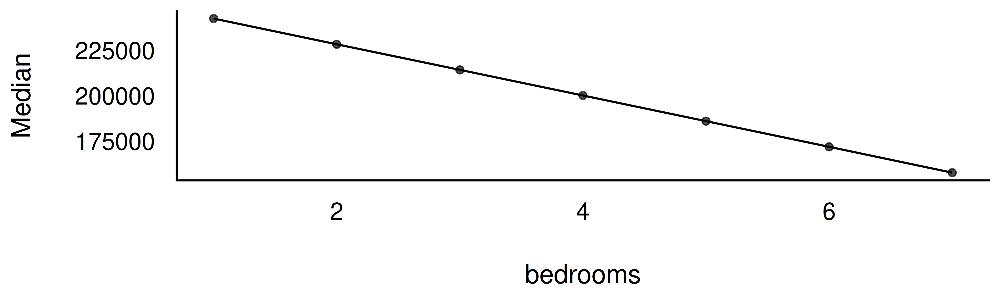{fig-align="center" width="70%"}

::: footer
Konfundierung
:::

## Die Zimmerzahl ist negativ mit dem Preis korreliert {.smaller}

... wenn man die Wohnfläche kontrolliert:

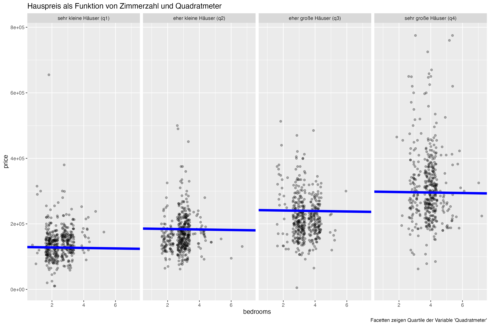{fig-align="center" width="35%"}

::: {.callout-note}
Eine Aussage kann nur dann richtig sein, wenn ihre Annahmen richtig sind. "Mehr Zimmer = mehr Wert" ist kein Naturgesetz, sondern hängt vom zugrundeliegenden Modell ab.
:::

::: footer
Konfundierung
:::

## Kontrollieren von Variablen

- Prädiktoren in der multiplen Regression werden **kontrolliert** (adjustiert, konditioniert)
- Koeffizienten zeigen den Effekt eines Prädiktors, wenn die anderen *konstant gehalten* werden
- Man spricht auch von *parziellen Regressionskoeffizienten* oder dem "Netto-Effekt"

::: {.callout-important}
Das Hinzufügen von Prädiktoren kann die Gewichte der übrigen Prädiktoren ändern.
:::

::: footer
Konfundierung
:::

## Welches Modell ist richtig?

::: {.callout-important}
In Beobachtungsstudien hilft nur ein **korrektes Kausalmodell**. Ohne Kausalmodell ist es nutzlos, Regressionskoeffizienten zur Erklärung von Ursachen heranzuziehen — die Koeffizienten können sich wild ändern, sogar das **Vorzeichen** (Simpson-Paradox).
:::

> "... any observed correlation between an outcome and predictor could be eliminated or reversed once another predictor is added to the model." — @mcelreath2020

::: footer
Konfundierung
:::

## Kausalmodell `km1` {.smaller}

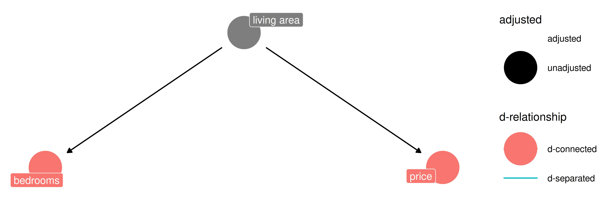{fig-align="center" width="40%"}

- Erklärung für `m1`/`m2`: `livingArea` beeinflusst sowohl `bedrooms` als auch `price`
- Wenn `km1` stimmt: **Scheinkorrelation** zwischen `bedrooms` und `price`
- d-connected: Variablen sind über einen gerichteten Pfad "verbunden"

::: footer
Konfundierung
:::

## Definition: Konfundierungsvariable

::: {.callout-note title="Definition: Konfundierungsvariable"}
Eine Konfundierungsvariable (Konfundierer) ist eine Variable, die den Zusammenhang zwischen UV und AV verzerrt, wenn sie nicht kontrolliert wird [@vanderweele2013].
:::

::: footer
Konfundierung
:::

## `m2` kontrolliert den Konfundierer `livingArea`

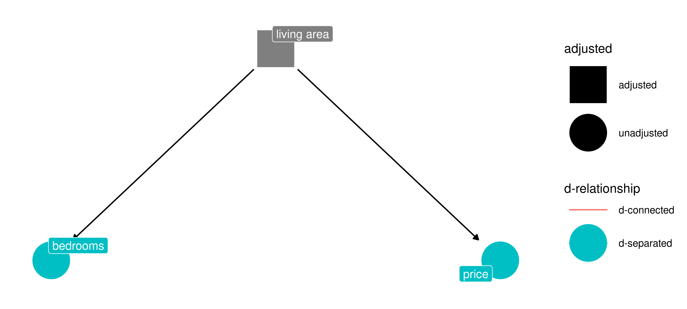{fig-align="center" width="70%"}

- Kontrolliert man `livingArea`, werden `bedrooms` und `price` **unkorreliert** (d-separated)

::: footer
Konfundierung
:::

## Definition: Blockieren

::: {.callout-note title="Definition: Blockieren"}
Das Kontrollieren eines Konfundierers "blockt" den betreffenden Pfad — es besteht dann über diesen Pfad keine Assoziation mehr zwischen UV und AV. UV und AV sind dann d-separated ("getrennt").
:::

::: footer
Konfundierung
:::

## Konfundierer kontrollieren — mit vs. ohne {.smaller}

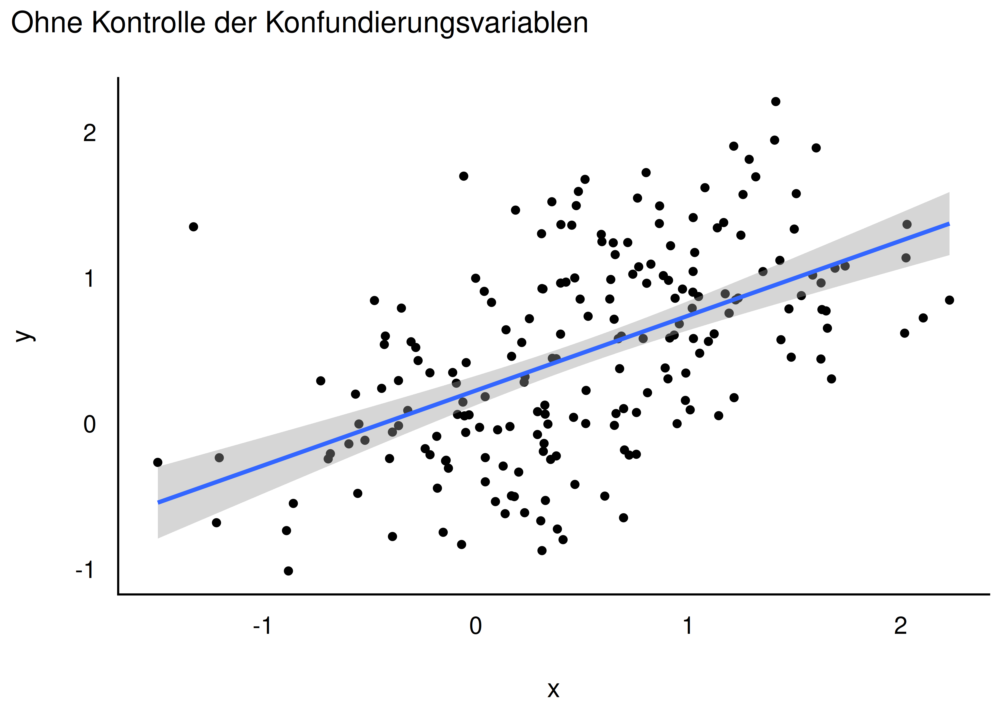{width="32%"} 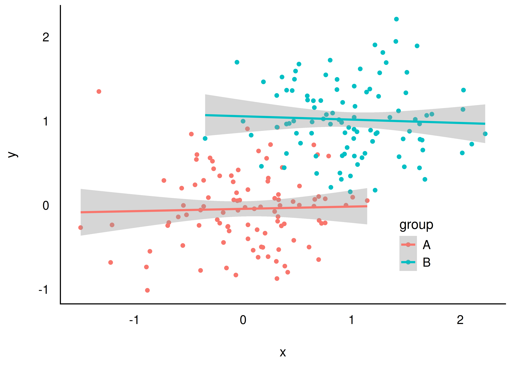{width="32%"}

- Links: **ohne** Kontrolle der Konfundierungsvariable → Scheinkorrelation
- Rechts: **mit** Kontrolle → keine Korrelation mehr

::: {.callout-important}
Kontrollieren Sie Konfundierer.
:::

::: footer
Konfundierung
:::

## `m1`/`m2` passen nicht zu `km1`

- Laut `km1` dürfte es **keine** Assoziation zwischen `bedrooms` und `price` geben, wenn `livingArea` kontrolliert wird
- In den Daten gibt es aber noch eine Assoziation
- Also: `m1` und `m2` sind **nicht** mit `km1` vereinbar

::: footer
Konfundierung
:::

## Kausalmodell `km2`: Mediation {.smaller}

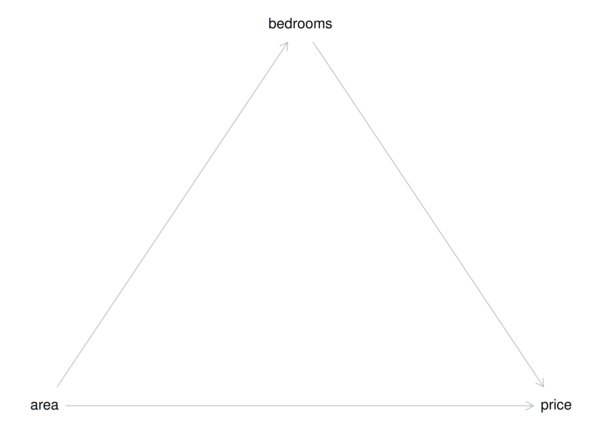{fig-align="center" width="38%"}

- Wirkkette: `area` $\rightarrow$ `bedrooms` $\rightarrow$ `price`, plus direkter Effekt `area` $\rightarrow$ `price`
- Mittlere Variable = **Mediator**, der Pfad = **Mediation**

::: footer
Konfundierung
:::

## Dons Kausalmodell `km3` {.smaller}

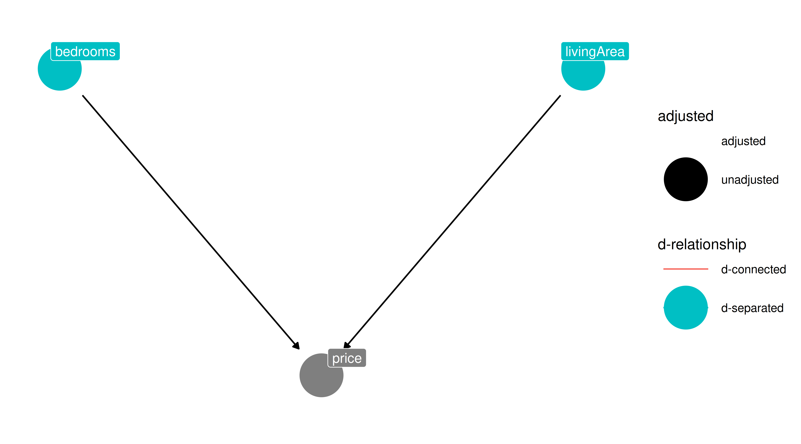{fig-align="center" width="35%"}

- Don behauptet: `bedrooms` und `livingArea` sind unkorreliert
- Realität: Sie sind korreliert (Angie rechnet es nach)
- `km3` widerspricht also den Daten

::: footer
Konfundierung
:::

## Unabhängigkeiten laut den Kausalmodellen {.smaller}

- **`km1`**: $b \indep p \mid a$ (bedrooms unabhängig von price, gegeben area) — passt **nicht** zu den Daten
- **`km2`**: keine Unabhängigkeiten postuliert — passt formal zu den Daten, ist aber ein *saturiertes* (empirisch schwaches) Modell
- **`km3`**: $b \indep a$ — passt **nicht** zu den Daten

::: {.callout-note}
Ein saturiertes Modell (alle Variablen korreliert) ist kaum falsifizierbar und daher wissenschaftlich wenig aussagekräftig.
:::

::: footer
Konfundierung
:::

# DAGs: Directed Acyclic Graphs {.center footer=false}

## Mehrere DAGs passen oft zu einer Datenlage {.smaller}

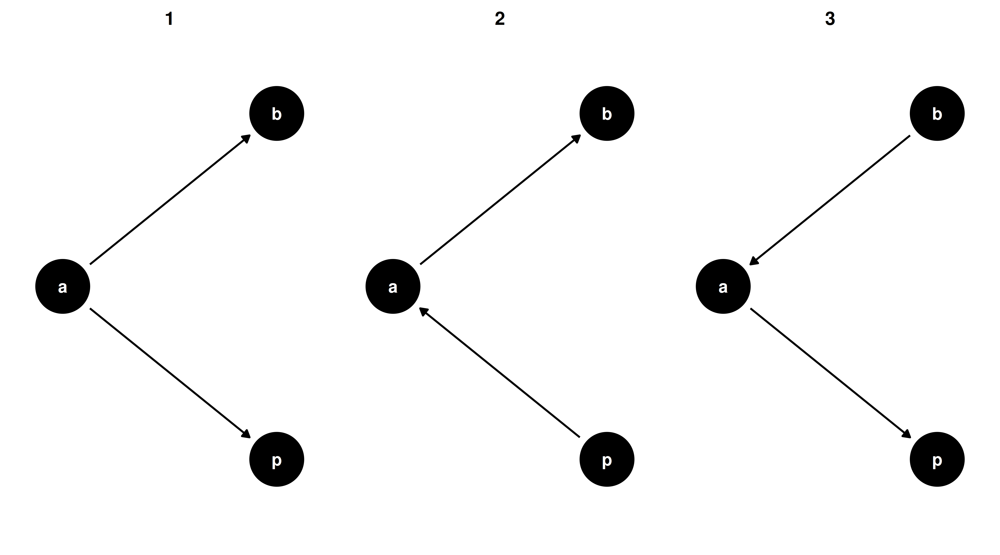{fig-align="center" width="40%"}

- Mehrere Kausalmodelle können die gleichen (Un-)Abhängigkeiten implizieren
- Empirisch nicht unterscheidbar — man bräuchte mehr/andere Variablen

::: footer
DAGs: Directed Acyclic Graphs
:::

## Definition: DAG

::: {.callout-note title="Definition: DAG"}
DAGs sind eine Art von Graphen zur Analyse von Kausalstrukturen. Ein Graph besteht aus Knoten (Variablen) und Kanten (Linien). DAGs sind **gerichtet** (Pfeile von Ursache zu Wirkung) und **azyklisch** (keine Rückführung auf sich selbst).
:::

::: {.callout-note title="Definition: Pfad"}
Ein Pfad ist ein Weg durch den DAG, von Knoten zu Knoten über die Kanten, unabhängig von der Pfeilrichtung.
:::

::: footer
DAGs: Directed Acyclic Graphs
:::

## Was ist eine Ursache?

::: {.callout-note}
Weiß man, was die Wirkung $W$ einer Handlung $H$ (Intervention) ist, so hat man $H$ als Ursache von $W$ erkannt [@mcelreath2020].
:::

::: {.callout-note title="Definition: Kausale Abhängigkeit"}
Ist $X$ die Ursache von $Y$, so hängt $Y$ von $X$ ab: $Y$ ist (kausal) abhängig von $X$.
:::

Viele Menschen denken fälschlich, dass Korrelation Kausation bedeuten muss.

::: footer
DAGs: Directed Acyclic Graphs
:::

## Der Schoki-DAG {.smaller}

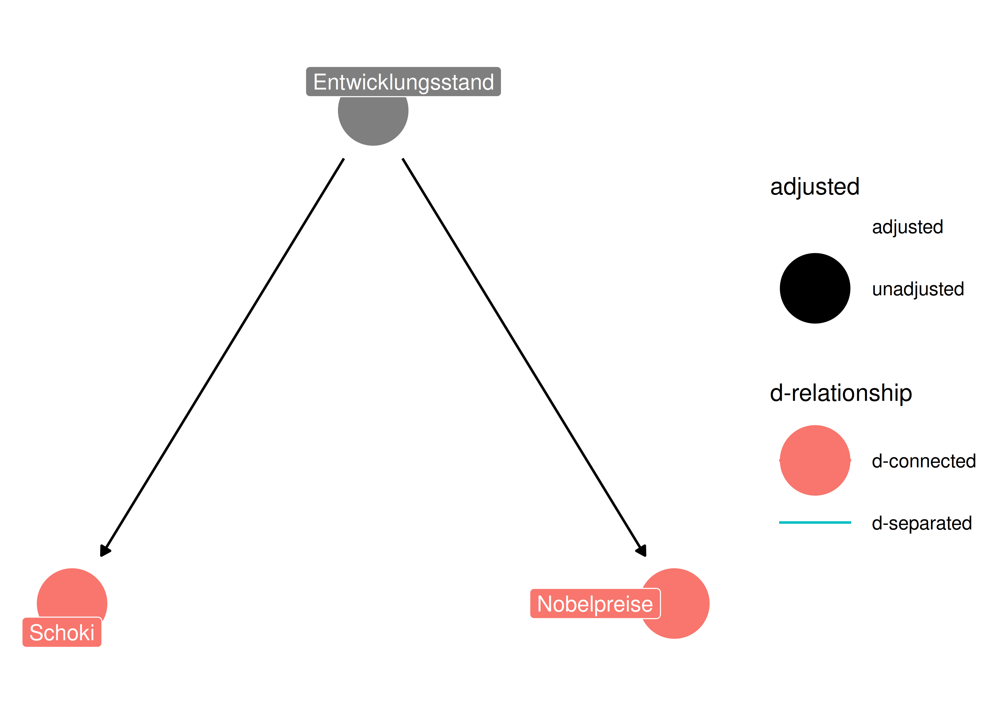{fig-align="center" width="38%"}

- Schokoladenkonsum und Nobelpreise korrelieren stark ($r = 0{,}79$)
- Möglicher Konfundierer: Entwicklungsstand eines Landes

::: footer
DAGs: Directed Acyclic Graphs
:::

# Fazit {.center footer=false}

## Zusammenfassung

- Zwei Variablen können korreliert sein durch:
  1. einen **kausalen** ("echten") Zusammenhang
  2. einen **nichtkausalen** Zusammenhang (Scheinkorrelation)
- Konfundierung ist eine mögliche Ursache einer Scheinkorrelation
- Aufdecken: angenommenen Konfundierer kontrollieren (z. B. als Prädiktor in der Regression)
- Löst sich der Scheinzusammenhang dabei **nicht** auf, sondern dreht sich das Vorzeichen um: **Simpson-Paradox**

::: footer
Fazit
:::

## Fazit

::: {.callout-important}
Die Daten allein können nie sagen, welches Kausalmodell zutrifft. Fachwissen ist nötig, um DAGs auszuschließen.
:::

- Korrelation $\neq$ Kausation
- Um Scheinkorrelation von echter Assoziation abzugrenzen: Kausalmodelle prüfen
- Konfundierung ist eines von vier "Atomen" der Kausalinferenz (neben Kollision, Mediation, Nachfahre)

::: footer
Fazit
:::

## Vielen Dank! {.center}

Fragen?

::: footer
Fazit
:::

