## Lernziele {.smaller}

Nach diesem Kapitel können Sie ...

- erklären, wann eine Kausalaussage gegeben eines DAGs berechtigt ist
- erklären, warum ein statistisches Modell ohne Kausalmodell zumeist keine Kausalaussagen treffen kann
- die "Atome" der Kausalität eines DAGs benennen
- "kausale Hintertüren" schließen

::: {.fragment}
Begleitliteratur: ähnliche Darstellungen finden sich bei Rohrer (2018).
:::

# Kollision {.center footer=false}

## Kein Zusammenhang von Intelligenz und Schönheit (?) {.smaller}

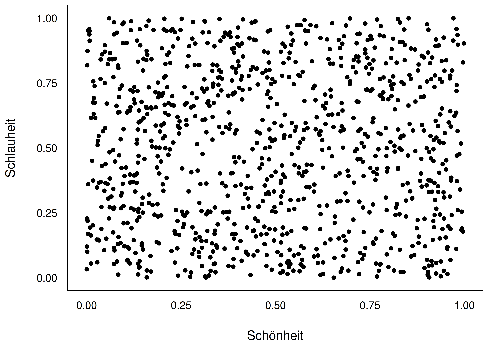{width="35%"}

- In den Daten: kein Zusammenhang von Intelligenz (`talent`) und Schönheit (`looks`)
- Für geringe wie hohe Intelligenzwerte: breites Spektrum an Schönheitswerten

::: footer
Kollision
:::

## Aber Ihre Dates sind entweder schlau oder schön {.smaller}

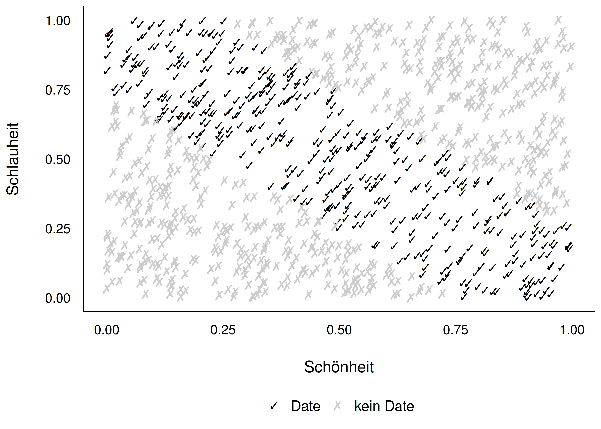{width="35%"}

- Die Menschen, die Sie daten, sind entweder schön **oder** schlau — selten beides
- Wie kann das sein, wenn Schönheit und Intelligenz unabhängig sind?

::: footer
Kollision
:::

## DAG zur Rettung {.smaller}

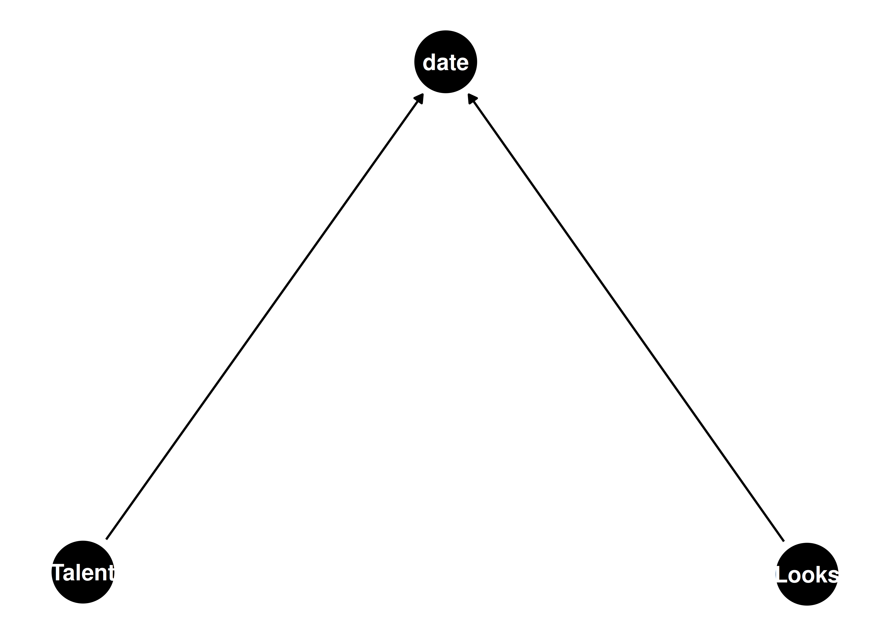{width="35%"}

- `date` ist eine **gemeinsame Wirkung** von `Looks` und `Talent`
- Stratifiziert man nach `date` (z. B. "nur Dates betrachten"), entsteht eine **Scheinkorrelation** zwischen Schönheit und Intelligenz

::: footer
Kollision
:::

## Kollision — zwei Darstellungen

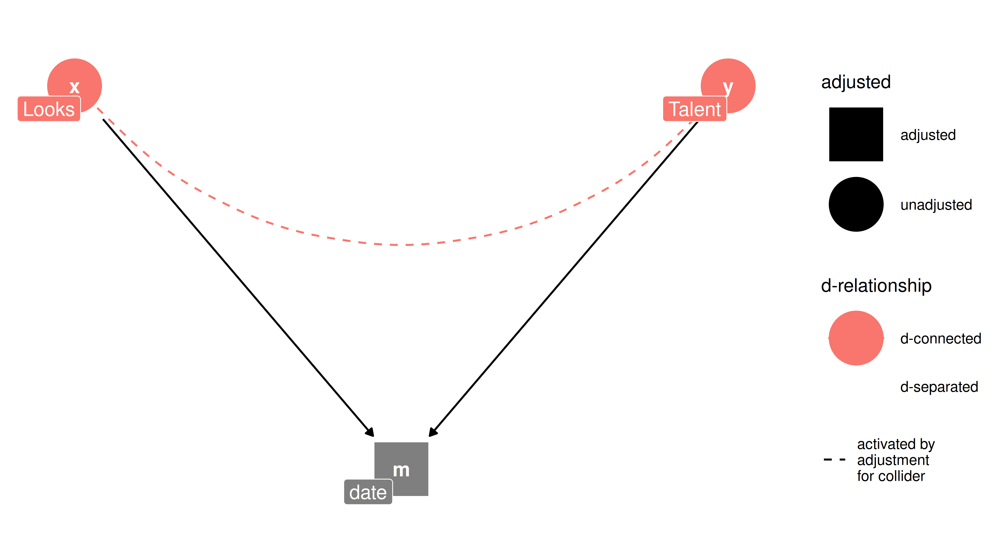{width="55%"}

Kontrolliert man die gemeinsame Wirkung `m`, entsteht eine Scheinkorrelation zwischen den beiden Ursachen `x` und `y`.

::: footer
Kollision
:::

## Definition: Kollision {.smaller}

::: {.callout-note title="Definition: Kollision"}
Als **Kollision** (Kollisionsverzerrung, Auswahlverzerrung, engl. *collider*) bezeichnet man einen DAG, bei dem eine Wirkung zwei Ursachen hat (eine gemeinsame Wirkung zweier Ursachen) [@pearl2016, p. 40].
:::

::: {.callout-important}
Zu viele oder falsche Prädiktoren in einer Regression können bewirken, dass die Koeffizienten nicht die kausalen Effekte zeigen, sondern durch Scheinkorrelation verzerrte Werte.
:::

::: {.callout-tip}
🙅‍♀️ Kontrollieren Sie keine Kollisionsvariablen.
:::

::: footer
Kollision
:::

## Einfaches Beispiel zur Kollision

In der Zeitschrift *Glitzer* werden nur gezeigt:

- Schöne Menschen 🪞
- Reiche Menschen 🤑

Schönheit und Reichtum seien unabhängig voneinander.

::: {.fragment}
**Frage:** Don ist nicht schön, taucht aber häufig in der Glitzer auf — was lernen wir über seine finanzielle Situation?
:::

::: {.fragment}
→ Don muss reich sein.
:::

::: footer
Kollision
:::

## Formal: Kollision als bedingte Abhängigkeit

Sei $Z = X + Y$, wobei $X$ und $Y$ unabhängig sind.

- Wissen Sie nur $X = 3$: Sie lernen nichts über $Y$
- Wissen Sie zusätzlich $Z = 10$: Sie wissen sofort $Y = 7$

::: {.fragment}
Also sind $X$ und $Y$ abhängig, **gegeben** $Z$:

$$X \not\!\perp\!\!\!\perp Y \,|\, Z$$
:::

::: footer
Kollision
:::

## Kontrollieren erzeugt die Kollisionsverzerrung

- *Stratifizieren*: `date` in Gruppen aufteilen, dann `talent`–`looks` je Gruppe betrachten
- *Kontrollieren mit Regression*: `date` als zusätzlicher Prädiktor neben `looks` bzw. `talent`

::: {.fragment}
**Ohne** Kontrolle von `date`: **keine** Scheinkorrelation — der Pfad ist blockiert.

**Mit** Kontrolle von `date`: der Pfad `Looks → date → talent` öffnet sich — Scheinkorrelation entsteht.
:::

::: footer
Kollision
:::

## IQ, Fleiß und Eignung fürs Studium {.smaller}

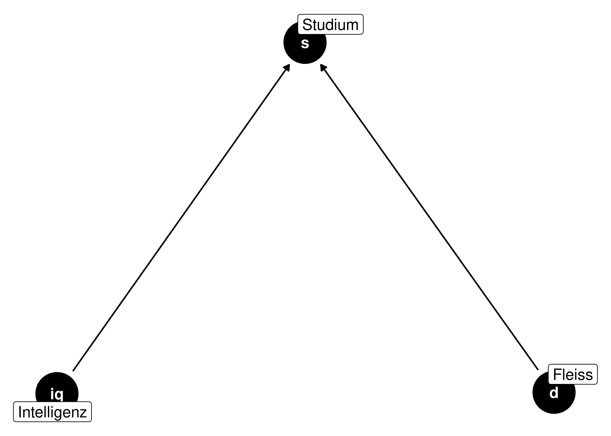{width="40%"}

- `Eignung` = Summe aus Intelligenz (`iq`) und Fleiß (`fleiss`), plus etwas Glück
- Nur wer geeignet ist, studiert (`studium = 1`)

::: footer
Kollision
:::

## Schlagzeile "Fleiß macht blöd!" {.smaller}

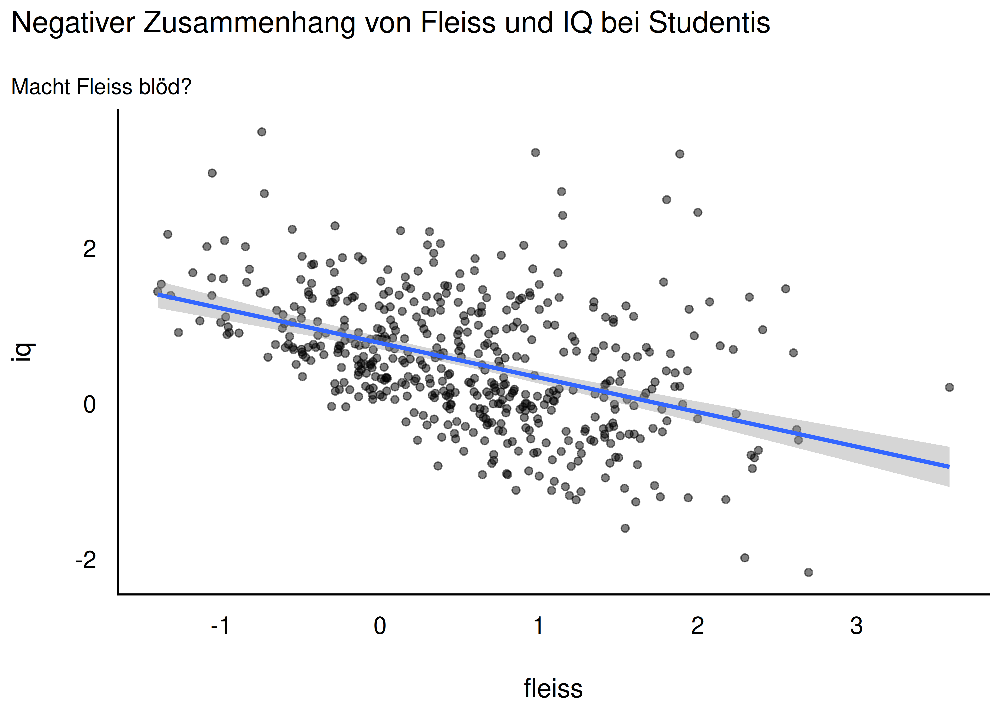{width="40%"}

- Analyse **nur** unter Studierenden (`studium == 1`): negativer Zusammenhang von Fleiß und IQ
- Ursache: Kollisionsverzerrung durch Selektion (nur wer studiert, wird betrachtet)

::: footer
Kollision
:::

## Definition: Stratifizieren {.smaller}

::: {.callout-note title="Definition: Stratifizieren"}
Durch **Stratifizieren** wird eine Stichprobe in (homogene) Untergruppen unterteilt (sog. *Strata*).
:::

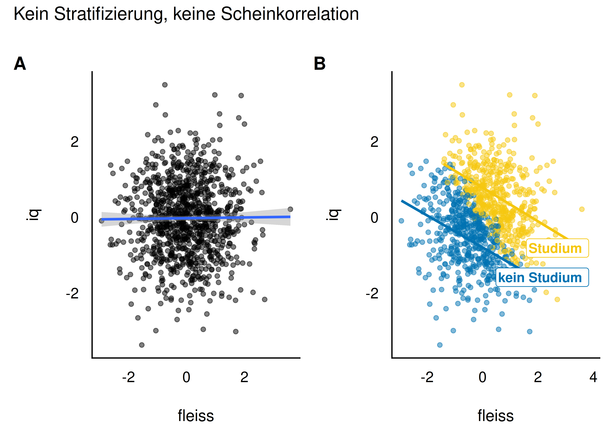{width="45%"}

**Ohne** Stratifizierung: keine Scheinkorrelation. **Mit** Stratifizierung: Scheinkorrelation.

::: footer
Kollision
:::

## Kontrollieren kann schaden oder nützen

- Wildes Kontrollieren einer Variablen kann genauso gut schaden wie nützen
- **Nur** Kenntnis des DAGs verrät die richtige Entscheidung

::: {.callout-note}
Nimmt man eine Variable als zweiten Prädiktor auf, "kontrolliert" man diese Variable — das Regressionsgewicht des ersten Prädiktors wird um den Einfluss des zweiten "bereinigt".
:::

::: footer
Kollision
:::

## Einfluss von Großeltern und Eltern auf Kinder {.smaller}

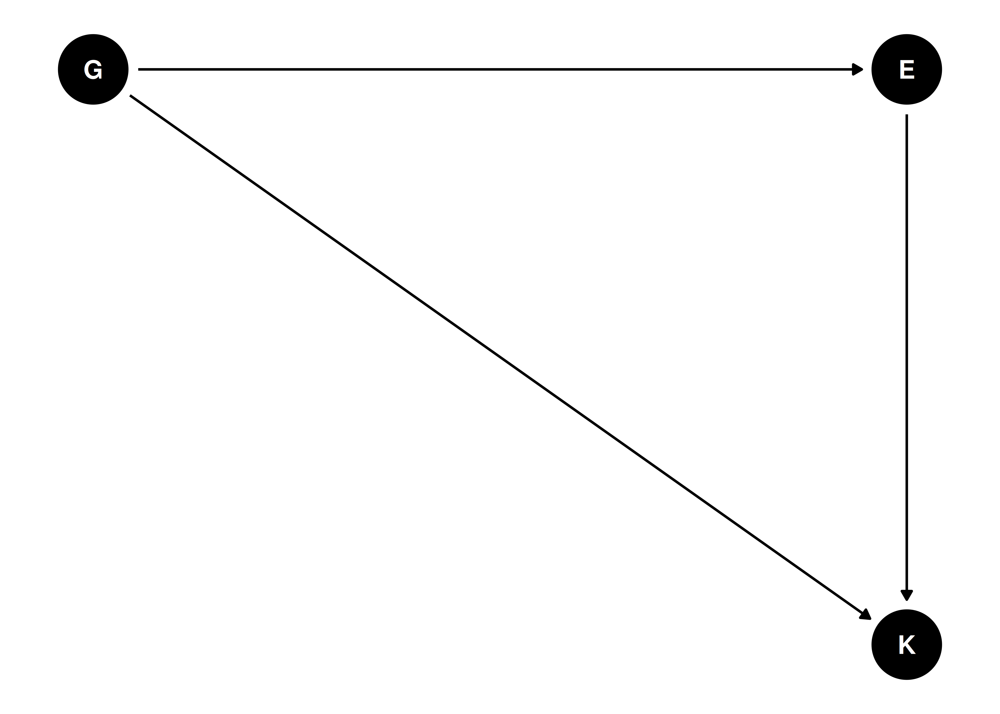{width="25%"}

Angenommene Effekte:

- indirekt: $G \rightarrow E \rightarrow K$
- direkt: $E \rightarrow K$
- direkt: $G \rightarrow K$

Interessiert: der direkte kausale Effekt $G \rightarrow K$.

::: footer
Kollision
:::

## Der Gespenster-DAG 👻 {.smaller}

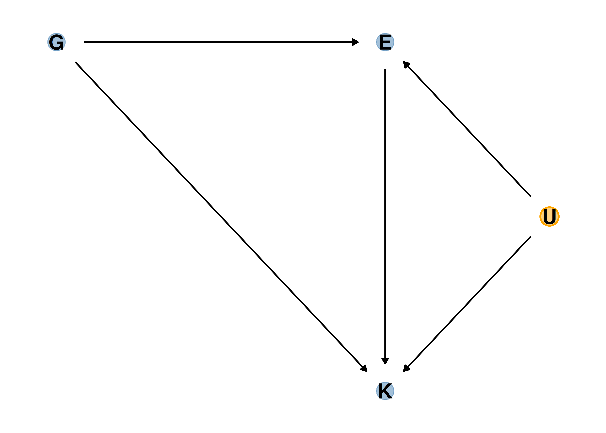{width="35%"}

- Es gibt "unheilbare" DAGs, in denen kein unverzerrter Kausaleffekt bestimmbar ist
- `U`: unbeobachteter Einfluss (z. B. Nachbarschaft) auf `E` und `K`
- `E` ist Kollisionsvariable auf diesem Pfad → Kontrolle von `E` verzerrt $G \rightarrow K$, selbst ohne `U` je zu messen

::: {.fragment}
Fazit: Diesen DAG müssen wir verloren geben — zurück an den Schreibtisch, oder mehr Daten sammeln.
:::

::: footer
Kollision
:::

# Die Hintertür schließen {.center footer=false}

## Definition: Hintertür

::: {.callout-note title="Definition: Hintertür"}
Eine **Hintertür** ist ein nicht-kausaler Pfad zwischen einer UV und einer AV. Ein Hintertürpfad entsteht, wenn es eine alternative Route über eine oder mehrere Variablen gibt, die UV mit AV verbindet. Dieser Pfad verzerrt die Schätzwerte des kausalen Einflusses, wenn er nicht kontrolliert wird.
:::

::: footer
Die Hintertür schließen
:::

## Zur Erinnerung: Konfundierung {.smaller}

*Forschungsfrage*: Wie groß ist der kausale Einfluss der Schlafzimmerzahl (`b`) auf den Verkaufspreis (`p`) eines Hauses?

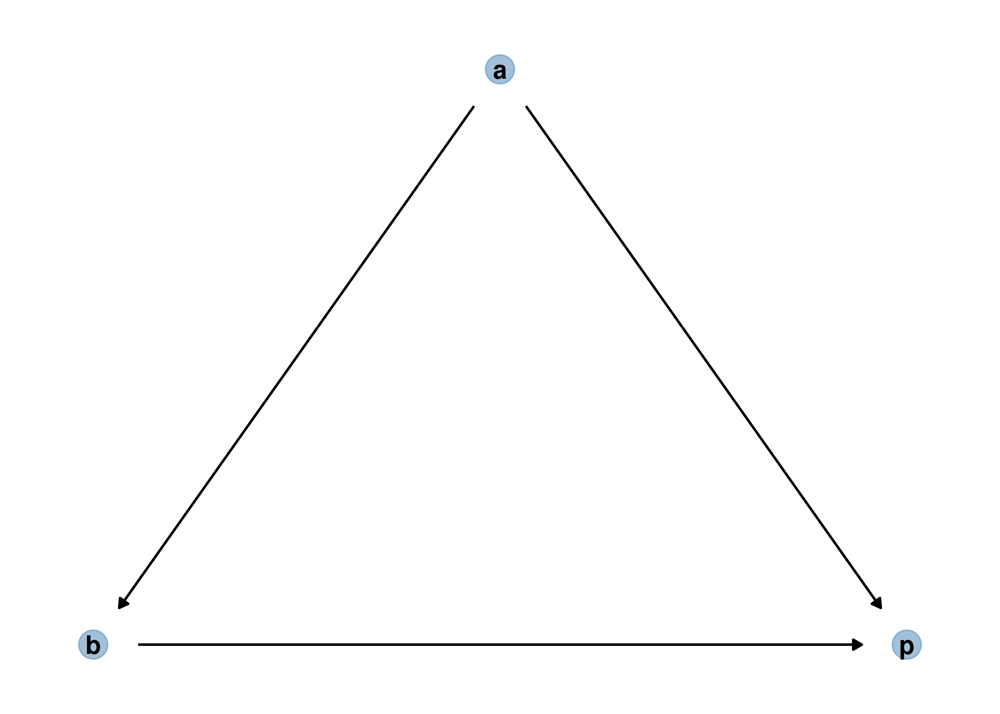{width="35%"}

Zwei Pfade zwischen `b` und `p`:

1. $b \rightarrow p$ (kausal)
2. $b \leftarrow a \rightarrow p$ (nicht-kausal, über Wohnfläche `a`)

::: footer
Die Hintertür schließen
:::

## Gute Experimente zeigen den echten kausalen Effekt {.smaller}

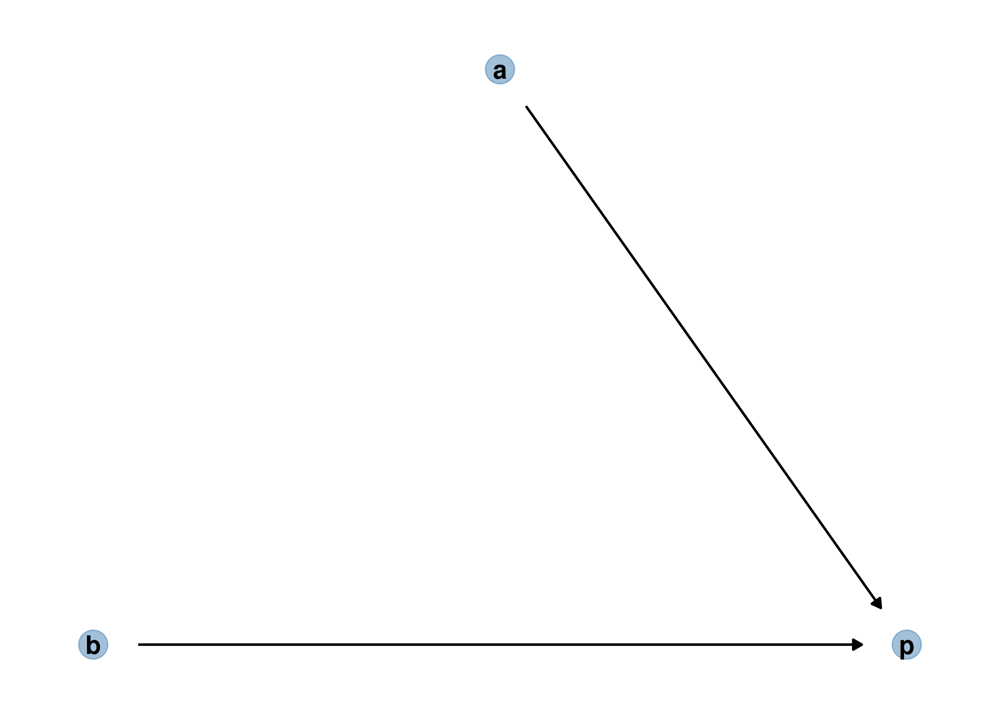{width="25%"}

- Ist die Hintertür geschlossen (keine Pfeile führen in die UV), ist eine Konfundierung ausgeschlossen
- Ein randomisiertes Experiment entfernt den Pfeil $a \rightarrow b$ und schließt damit den zweiten Pfad

::: {.callout-important}
Gut gemachte Experimente schließen kausale Hintertüren — das erlaubt korrekte Kausalaussagen.
:::

::: footer
Die Hintertür schließen
:::

## Hintertür schließen auch ohne Experimente

- Konfundierende Pfade blockieren = "die Hintertür schließen" (*backdoor criterion*)
- Z. B. die Konfundierungsvariable `a` als weiteren Prädiktor in die Regression aufnehmen

::: {.callout-tip}
Kontrollieren Sie Konfundierer, um kausale Hintertüren zu schließen.
:::

$$b \perp\!\!\!\perp p \,|\, a$$

::: footer
Die Hintertür schließen
:::

# Die vier Atome der Kausalanalyse {.center footer=false}

## Die vier Grundbausteine im Überblick

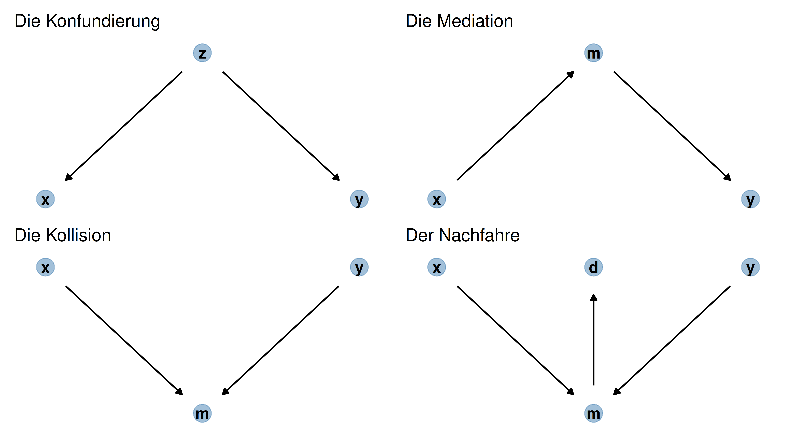{width="70%"}

Kennen Sie diese vier Grundbausteine, können Sie jedes beliebige Kausalsystem (DAG) entschlüsseln:

Konfundierung, Mediation, Kollision, Nachfahre

::: footer
Die vier Atome der Kausalanalyse
:::

## Definition: Mediator {.smaller}

::: {.callout-note title="Definition: Mediator"}
Einen Pfad mit drei Variablen, verbunden über zwei Kanten, wobei die Pfeile von UV zu Mediator und von Mediator zur AV zeigen, nennt man **Mediation**. Der **Mediator** ist die Variable zwischen UV und AV [@pearl2016, p. 38].
:::

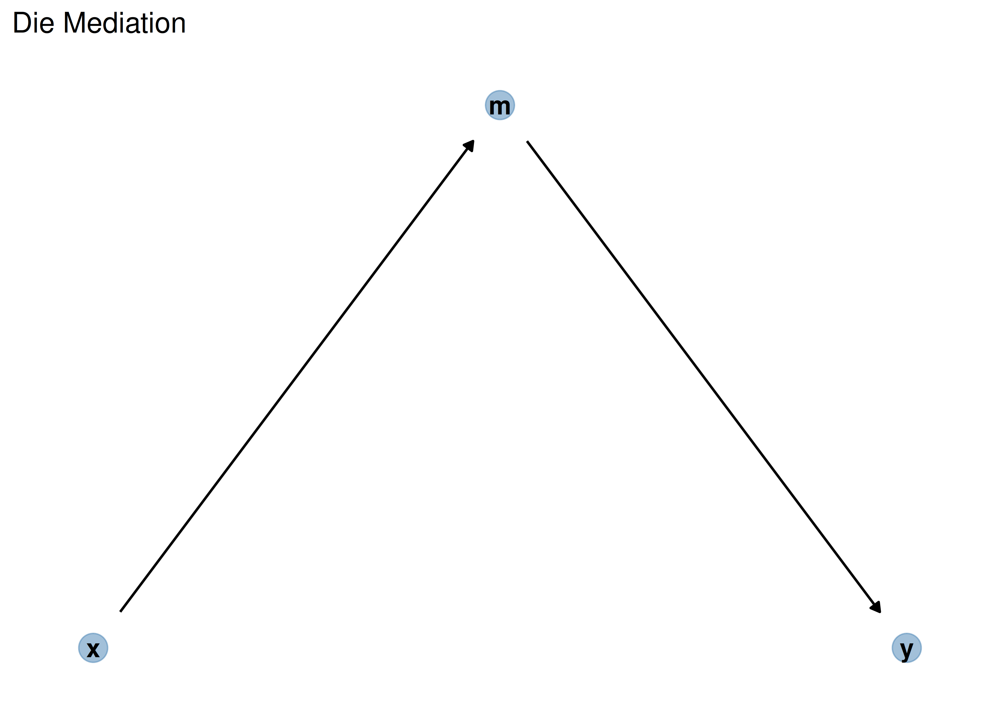{width="35%"}

$x \rightarrow m \rightarrow y$

::: footer
Die vier Atome der Kausalanalyse
:::

## Mediator kontrollieren? {.smaller}

::: {.fragment}
**Frage:** Sollte man den Mediator `m` kontrollieren, wenn man den Kausaleffekt von `x` auf `y` schätzen möchte?
:::

::: {.fragment}
**Nein** — durch Kontrollieren von `m` wird der Kausalpfad von `x` zu `y` geschlossen; es kann keine kausale Assoziation mehr "fließen".
:::

::: {.callout-tip}
Kontrollieren Sie den Mediator *nicht*. Der Pfad über den Mediator ist ein "echter" Kausalpfad, keine Scheinkorrelation.
:::

::: {.callout-important}
Das Kontrollieren eines Mediators ist ein Fehler, wenn man am gesamten (totalen) Kausaleffekt von UV zu AV interessiert ist.
:::

::: footer
Die vier Atome der Kausalanalyse
:::

## Partielle Mediation

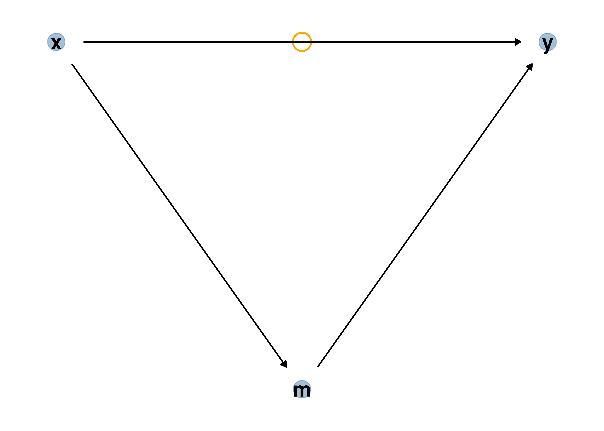{width="45%"}

Zwei kausale Pfade von X zu Y: $x \rightarrow m \rightarrow y$ und $x \rightarrow y$

::: footer
Die vier Atome der Kausalanalyse
:::

## Effekt-Begriffe {.smaller}

::: {.callout-note title="Definition: Kausaleffekt"}
Gibt es eine (von praktisch Null verschiedene) kausale Assoziation der UV auf die AV, spricht man von einem Kausaleffekt.
:::

::: {.callout-note title="Definition: Totaler Effekt"}
Die Summe der Effekte aller kausalen Pfade von UV zu AV.
:::

::: {.callout-note title="Definition: Indirekter Effekt"}
Der kausale Effekt über den Mediatorpfad (von X über M zu Y).
:::

::: {.callout-note title="Definition: Direkter Effekt"}
Ein Effekt, der nur aus dem Pfad $x \rightarrow y$ besteht, ohne Zwischenglieder.
:::

::: footer
Die vier Atome der Kausalanalyse
:::

## Definition: Nachfahre {.smaller}

::: {.callout-note title="Definition: Nachfahre"}
Ein **Nachfahre** (engl. *descendant*) ist eine Variable, die von einer anderen Variable (kausal) beeinflusst wird.
:::

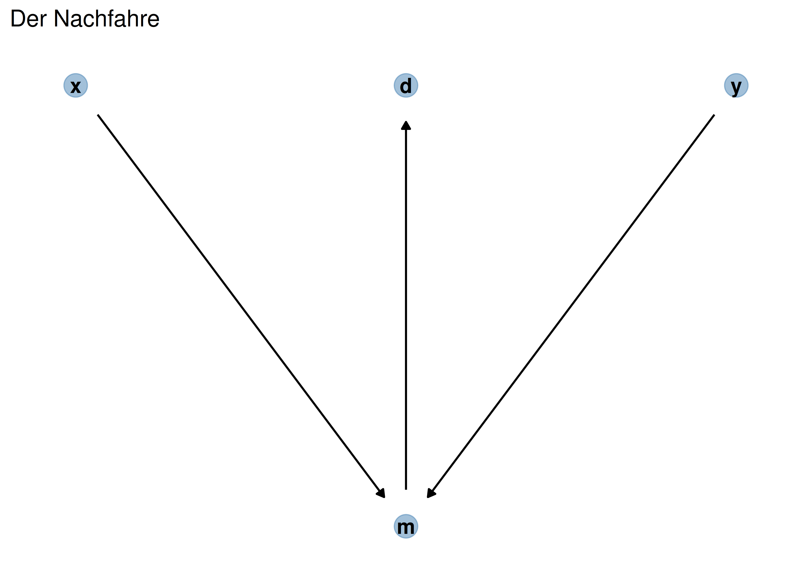{width="35%"}

Kontrolliert man einen Nachfahren `d`, kontrolliert man teilweise auch dessen Vorfahren `m` — der Pfad von `x` nach `y` öffnet sich teilweise, da `m` eine Kollisionsvariable ist.

::: footer
Die vier Atome der Kausalanalyse
:::

## Kochrezept zur Analyse von DAGs 👨‍🍳

Egal wie kompliziert ein DAG aussieht — er besteht immer aus den vier Atomen.

1. Listen Sie alle Pfade von UV (`X`) zu AV (`Y`) auf
2. Beurteilen Sie für jeden Pfad: geschlossen oder geöffnet?
3. Beurteilen Sie für jeden Pfad: Hintertürpfad? (Pfeil führt in die UV)
4. Bei offenen Hintertürpfaden: welche Variablen kontrollieren, um sie zu schließen?

::: footer
Die vier Atome der Kausalanalyse
:::

# Schließen Sie die Hintertür (wenn möglich)! {.center footer=false}

## Hintertür: ja oder nein?

**Fall 1:** $\boxed{X \rightarrow}$

Pfade, die von der UV **wegführen**: entweder "gute" Kausalpfade oder automatisch geblockte Nicht-Kausal-Pfade → nichts zu tun (Nachkommen der UV nicht kontrollieren!)

**Fall 2:** $\boxed{\rightarrow X}$

Pfade, die zur UV **hinführen**: immer Nicht-Kausal-Pfade (Hintertüren) → offene Hintertüren schließen

::: {.callout-tip}
Schließen Sie immer offene Hintertüren, um Verzerrungen der Kausaleffekte zu verhindern.
:::

::: footer
Schließen Sie die Hintertür (wenn möglich)!
:::

## Beispiel: `bsp1` {.smaller}

UV: $X$, AV: $Y$, Kovariaten $A, B, C$, unbeobachtete Variable $U$

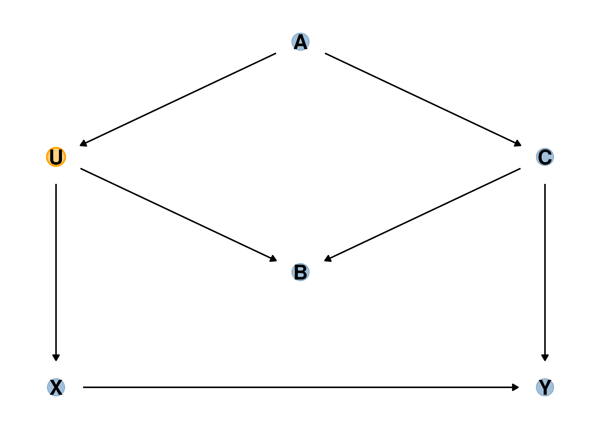{width="35%"}

Zwei Hintertürpfade:

1. $X \leftarrow U \leftarrow A \rightarrow C \rightarrow Y$ — **offen**
2. $X \leftarrow U \rightarrow B \leftarrow C \rightarrow Y$ — geschlossen

→ Kontrollieren von $A$ oder $C$ schließt die offene Hintertür.

::: footer
Schließen Sie die Hintertür (wenn möglich)!
:::

## Beispiel: `bsp2` {.smaller}

UV: $W$, AV: $D$

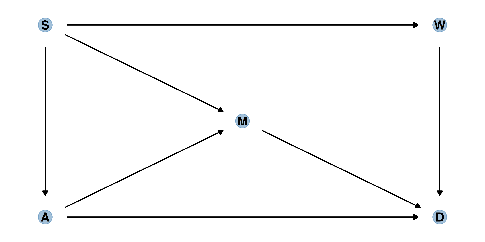{width="40%"}

Um offene Hintertüren zu schließen, kontrollieren Sie:

- entweder $A$ und $M$
- oder $S$

::: footer
Schließen Sie die Hintertür (wenn möglich)!
:::

## Implizierte bedingte Unabhängigkeiten

- Auch wenn Daten nicht sagen können, welcher DAG richtig ist — wir können lernen, welcher DAG **falsch** ist
- Ein DAG impliziert bestimmte bedingte Unabhängigkeiten zwischen Variablen
- Diese können mit den Daten geprüft werden → Möglichkeit, einen DAG zu verwerfen

::: footer
Schließen Sie die Hintertür (wenn möglich)!
:::

# Fazit {.center footer=false}

## Zusammenfassung {.smaller}

Interpretierbarkeit hängt von der epistemologischen Zielrichtung der Forschungsfrage ab:

- **Deskriptiv**: Ergebnisse direkt interpretierbar, aber keine kausale Interpretation zulässig
- **Prognostisch**: Modellkoeffizienten spielen keine Rolle, es geht um vorhergesagte Werte $\hat{y}_i$; Kausalaussagen nicht möglich, aber auch nicht von Interesse
- **Kausal**: Modellkoeffizienten nur auf Basis eines Kausalmodells (DAG) oder eines guten Experiments interpretierbar

::: {.fragment}
Möglichst viele Prädiktoren ins Modell aufzunehmen ist **falsch**, wenn das Ziel eine Kausalaussage ist. Kenntnis der "kausalen Atome" ist Voraussetzung für Kausalschlüsse in Beobachtungsstudien.
:::

::: footer
Fazit
:::

## Vielen Dank! {.center}

Fragen?

::: footer
Fazit
:::

