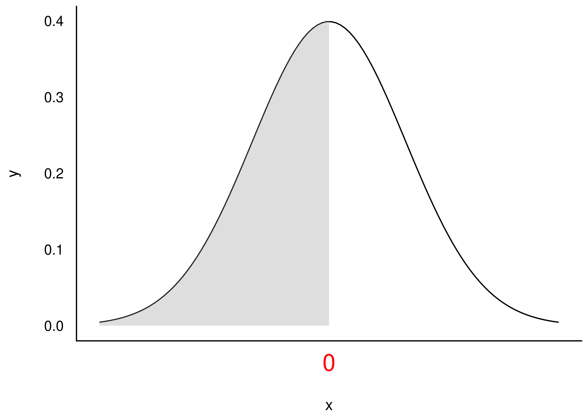
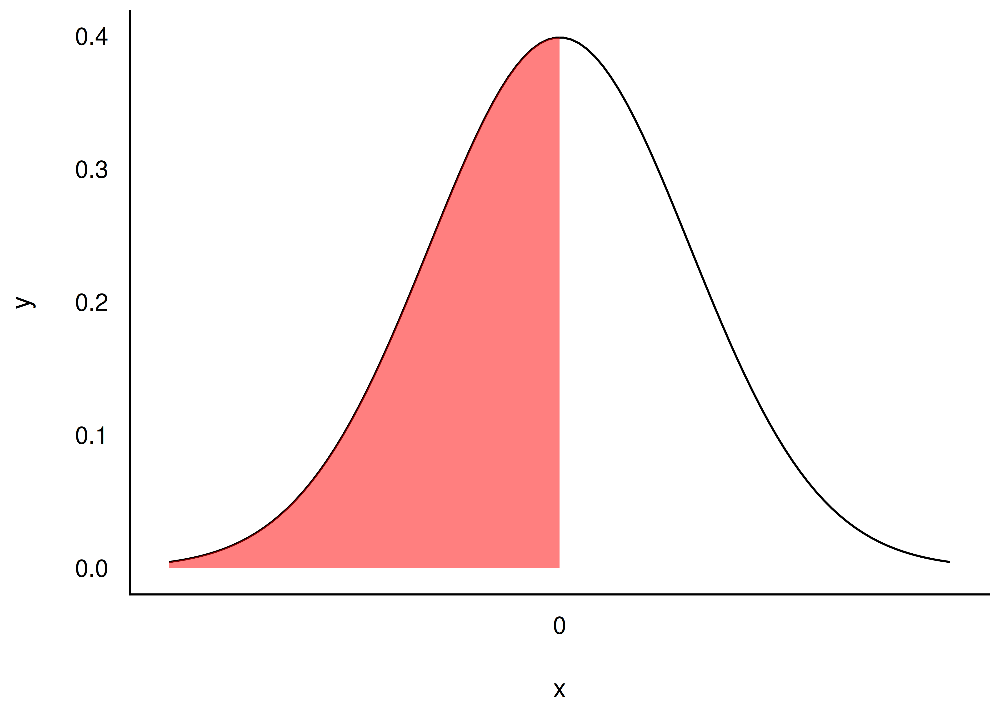
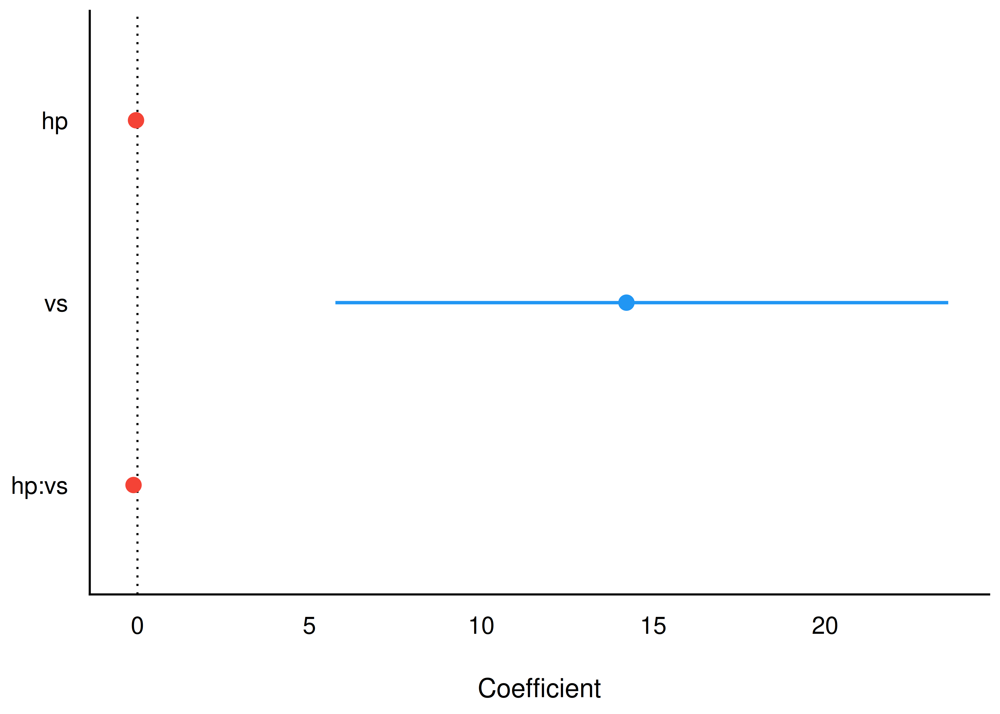
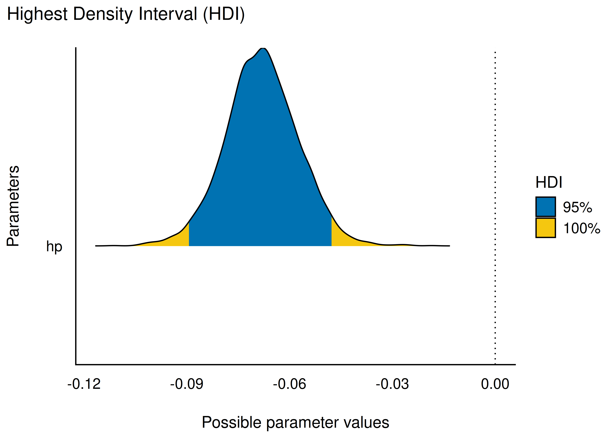
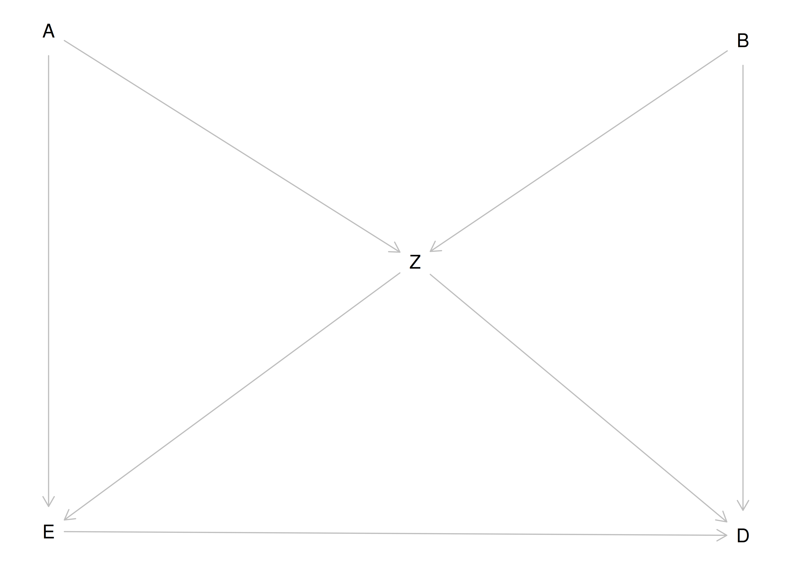
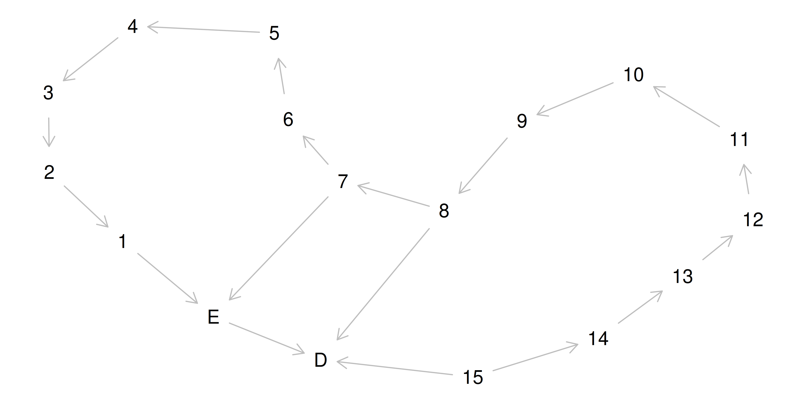
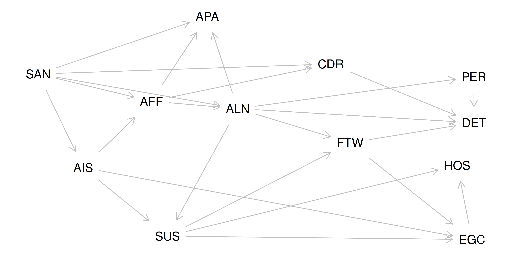

## Lernziele dieses Kapitels

Sie können ...

- eine typische, sozialwissenschaftliche Forschungsfrage (quantitativ) untersuchen
- typische "Lieblingsfehler" benennen und vermeiden
- zwischen Frequentistischer Statistik und Bayes-Statistik übersetzen
- die Grundideen der Bayes-Statistik einordnen

## Begleitmaterial

- [Fragestunde QM2](https://youtu.be/5nKy1hueZlIs)
- [Playlist QM2](https://www.youtube.com/playlist?list=PLRR4REmBgpIGVptiSN-qDVEJKfFnUqDyL)
- [Lieblingsfehler](https://youtu.be/imnicKTbStU)

## Probeklausuren

- Aufgabensammlungen für 2022, 2023, 2024 auf dem [Datenwerk](https://datenwerk.netlify.app/)
- Kategorien: `qm2-pruefung`, `exam-22`
- Liste ist im Aufbau — zusätzlich selbständig alle relevanten Kapitel-Aufgaben konsultieren

## Lieblingsfehler im Überblick 🤷

1. Quantile und Verteilungsfunktion verwechseln
2. Prädiktoren nicht zentrieren, wenn ein Interaktionsterm vorliegt
3. Interaktion falsch interpretieren
4. Regressionskoeffizienten kausal interpretieren, ohne kausale Fundierung
5. Post-Prädiktiv-Verteilung (PPV) und Post-Verteilung verwechseln

## Fehler: PPV vs. Post-Verteilung 🤷

- **Post-Verteilung**: Stichproben zu den *Parameterwerten* des Modells
- **Posterior-Prädiktiv-Verteilung (PPV)**: Vorhersagen für *Beobachtungen*, keine Parameterwerte
- Modell `mpg ~ hp`: `parameters(m1)` liefert i. d. R. bequemer Post-Intervalle/Punktschätzer als die rohe Stichprobentabelle

## Fehler: Quantil vs. Verteilungsfunktion 🤷 {.smaller}

::: {.columns}
::: {.column width="50%"}
**p-Quantil**

Teilt eine Verteilung so, dass mind. Anteil $p$ kleiner-gleich dem Quantil ist.

{width="90%"}
:::
::: {.column width="50%"}
**Verteilungsfunktion F(x)**

$F(x)$: Wahrscheinlichkeit, dass $X \le x$.

{width="90%"}
:::
:::

## Fehler: Interaktion falsch interpretieren 🤷 {.smaller}

Modell: `mpg ~ hp*vs`

{width="42%"}

**Falsch 😈**: Unterschied zwischen `vs=0`/`vs=1` beträgt ca. −0.11.

**Richtig 👼**: Unterschied beträgt ca. −0.11 — *nur wenn* `hp=0`. Da `hp=0` unrealistisch ist, sind zentrierte Prädiktoren sinnvoll [@gelman2021, Kap. 10; @mcelreath2020, Kap. 8].

## Kochrezept: Forschungsfrage untersuchen {.smaller}

:::: {.columns}
::: {.column width="55%"}
**Theoretische Phase**

1. Staunen über ein Phänomen $y$, Kausalfrage finden
2. Literatur wälzen zu möglichen Ursachen $x$
3. Forschungsfrage/Hypothese präzisieren
4. Modell präzisieren (DAG(s), Prioris)
:::
::: {.column width="45%"}
**Empirische Phase**

5. Versuch planen
6. Daten erheben

**Analytische Phase**

7. Daten aufbereiten
8. Modell berechnen
9. Modell prüfen/kritisieren
10. Forschungsfrage beantworten
:::
::::

## Parameter schätzen vs. Hypothesen prüfen

- **Hypothesenprüfung**: "Frauen parken im Schnitt schneller ein als Männer."
- **Parameterschätzung**: "Wie groß ist der mittlere Unterschied in der Einparkzeit?"

::: {.fragment}
Je ausgereifter ein Forschungsfeld, desto **kühnere** Hypothesen sind möglich — kühne Hypothesen sind wünschenswert 🦹
:::

## Formalisierung von Forschungsfragen

Mittelwert in Gruppe A höher als in Gruppe B:

$$\mu_1 > \mu_2 \Leftrightarrow \mu_1 - \mu_2 > 0 \Leftrightarrow \mu_d > 0$$

## Kerngedanken Bayes {.smaller}

📺 [Bayes in fünf Minuten](https://www.youtube.com/watch?v=yfOppH_2uSI)

📺 [Bayes in zehn Minuten](https://www.youtube.com/watch?v=8a75ZnyycFc)

Zentraler Kennwert: die **Post-Verteilung**

{width="42%"}

Zusammenfassung (z. B. 95%-PI) ist oft sinnvoll — aber nur die *gesamte* Post-Verteilung trägt alle Information.

## Bayes-Formel

$$\text{Posteriori} = \frac{\text{Likelihood} \times \text{Priori}}{\text{Evidenz}}$$

## Prüfungsaufgaben: DAGs analysieren {.smaller}

Minimale Adjustierungsmenge: kleinstmögliche Knotenmenge eines DAGs, die zu adjustieren ist, um einen kausalen Effekt zu identifizieren.

{width="38%"}

Adjustierungsmenge für den totalen Effekt von E auf D: {A,Z} **oder** {B,Z}.

## Prüfungsaufgaben: auch komplexe DAGs

{width="50%"}

Trotz vieler Variablen: Adjustierungsmenge für E → D bleibt klein — hier {7} oder {8}.

## Beispiel: Kausalmodell der Schizophrenie {.smaller}

van Kampen (2014): SSQ-Modell des schizophrenen Prodromalverlaufs [@vankampen2014]

UV: *SUS* (Suspiciousness), AV: *EGC* (Egocentrism)

{width="36%"}

Minimales Adjustment-Set für den totalen Kausaleffekt: {AIS, ALN}

## Prüfungsfragen zu Modellen — Beispiele {.smaller}

- Punktschätzer (Median) für Prädiktor X in Modell Y?
- 89%-HDI für Parameter X?
- $R^2$ angeben
- Interaktionsmodell formulieren
- Welches Modell modelliert den kausalen Effekt korrekt?
- Modell mit gegebenen Prioris formulieren
- Liegt Effekt X im ROPE?
- CI- vs. HDI-Breite für Prädiktor X vergleichen
- Was ändert sich bei Zentrierung/Z-Standardisierung der Prädiktoren?

## Aufgabensammlungen

Relevante Tags auf dem [Datenwerk](https://datenwerk.netlify.app/):

- [bayes](https://datenwerk.netlify.app/#category=bayes), [bayes-grid](https://datenwerk.netlify.app/#category=bayes-grid)
- [dag](https://datenwerk.netlify.app/#category=dag), [qm2](https://datenwerk.netlify.app/#category=qm2)
- [probability](https://datenwerk.netlify.app/#category=probability), [post](https://datenwerk.netlify.app/#category=post), [rope](https://datenwerk.netlify.app/#category=rope)

Besondere Prüfungsnähe: `qm2-pruefung`, `exam-22`, `quiz1-qm2-ws23`, `Verteilungen-Quiz`

## Viel Erfolg bei der Prüfung! {.center}

🥳 🏆 🍀 🍀 🍀

## Vielen Dank! {.center}

{width="70%"}

Fragen?
