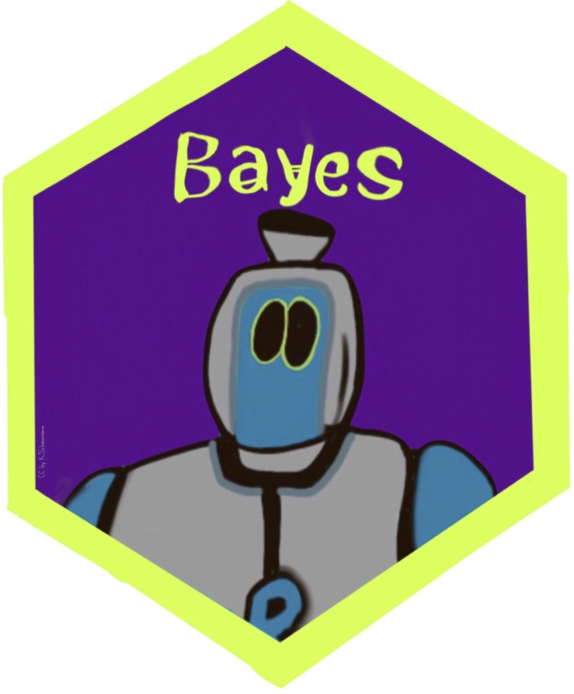

## Willkommen bei Start:Bayes!

{width="40%"}

## Lernziele

Nach diesem Kurs sollten Sie ...

- grundlegende Konzepte der Inferenzstatistik mit Bayes verstehen und mit R anwenden können
- gängige einschlägige Forschungsfragen in statistische Modelle übersetzen und mit R auswerten können
- kausale Forschungsfragen in statistische Modelle übersetzen und prüfen können
- die Güte und Grenze von statistischen Modellen einschätzen können

## Ein Beispiel

- 50 Frauen und Männer parken ein Auto ein (standardisiert, kontrolliert)
- Ergebnis: Frauen parken im Schnitt schneller ein

::: {.fragment}
Aber: Haben wir das damit **ganz sicher** geklärt? Mit welcher Sicherheit?
:::

## Unsicherheit beziffern

- Nur Steuern und der Tod sind sicher — statistische Aussagen nicht
- Aber: Wir können angeben, **wie (un)sicher** wir uns sind

::: {.fragment}
z. B. zu 99&nbsp;% oder zu 51&nbsp;% sicher — das macht einen Unterschied!
:::

::: {.fragment}
**Kurz gesagt:** In diesem Kurs lernen Sie, wie Sie die Unsicherheit eines statistischen Ergebnisses beziffern.
:::

## Warum ist das wichtig?

- Fast keine Aussage ist zu 100&nbsp;% sicher
- Um eine Entscheidung zu treffen, müssen wir wissen, wie sicher eine Aussage ist

## Wozu brauche ich das im Job?

> "Laut meiner Analyse sollten wir unser Werk in Ansbach/Peking/Timbuktu bauen."

Sind Sie sich zu 50&nbsp;%, 90&nbsp;% oder 99,9&nbsp;% sicher? — Eine wichtige Frage im echten Leben.

## Wozu brauche ich das im weiteren Studium?

In Forschungsarbeiten (z. B. Abschlussarbeiten) ist es üblich, statistische Ergebnisse hinsichtlich ihrer **Unsicherheit** zu beziffern.

## Gute Jobs mit Datenkompetenz {.smaller}

Top-Job-Rollen mit steigender Nachfrage [@forum2020, S. 30, Abb. 22]:

1. Data Analysts und Scientists
2. AI and Machine Learning Specialists
3. Big Data Specialists

## Modulüberblick

```{mermaid}
%%| fig-width: 9
flowchart LR
  subgraph Wskt[Wahrscheinlichkeit]
    Inferenz --> Ungewissheit --> Verteilungen
  end
  subgraph Bayes
    Globus --> Post
  end
  subgraph Regression
    Gauss --> Einfach --> Anwendung
  end
  Wskt --> Bayes --> Regression
```

## Modulverlauf

Siehe Tabelle im Haupttext (Kapitel "Einführung") für den zeitlichen Ablauf der Themen — ein Thema pro Woche.

## Voraussetzungen

- Grundlegende Kenntnis im Umgang mit R, möglichst auch mit dem `tidyverse`
- Grundlegende Kenntnis der deskriptiven Statistik
- Grundlegende Kenntnis der Regressionsanalyse

::: {.fragment}
Vermittelt z. B. im Online-Buch ["Statistik1"](https://sebastiansauer.github.io/statistik1/) — die Kapitel bauen aufeinander auf.
:::

## Lernhilfen & Software

- [Lernhilfen-Überblick](https://hinweisbuch.netlify.app/160-hinweise-lernhilfen-frame)
- Benötigt: R, RStudio, R-Pakete (v. a. `rstanarm`)
- [Installationshinweise](https://hinweisbuch.netlify.app/130-hinweise-software)

## Weitere Hinweise

- [Playlist QM2 auf YouTube](https://www.youtube.com/watch?v=QNMVi6IqQ90&list=PLRR4REmBgpIGgz2Oe2Z9FcoLYBDnaWatN)
- [Didaktik](https://hinweisbuch.netlify.app/110-hinweise-didaktik-frame)
- [Unterrichtsorganisation](https://hinweisbuch.netlify.app/120-hinweise-unterricht-frame)
- Unterricht: nur ein Mal pro Jahr (jedes zweite Semester)
- Prüfung: jedes Semester möglich

## Tutorium

- Für dieses Modul wird ggf. ein Tutorium angeboten
- Besuch wird empfohlen
- Material: [Webseite des Tutoriums](https://qm2-tutorium.netlify.app/)

## Prüfung

- Format: **Klausur im Mehrfachwahlverfahren** (Multiple Choice)
- Keine Hilfsmittel (Skripte, Notizen) zulässig
- Findet ausschließlich in Präsenz statt

## Prüfung — Links

- [Allgemeine Prüfungshinweise](https://hinweisbuch.netlify.app/010-hinweise-pruefung-allgemein-frame)
- [Hinweise zu quantitativen Prüfungen](https://hinweisbuch.netlify.app/030-hinweise-pruefung-klausur-frame)
- [Ablauf von Klausuren](https://hinweisbuch.netlify.app/030-hinweise-pruefung-klausur-frame#ablauf-einer-pr%C3%BCfung)
- [Prüfungsvorbereitung](https://hinweisbuch.netlify.app/150-hinweise-pruefungsvorbereitung-frame)

## Zitation

> Sauer, S. (2023). *Start:Bayes!*. <https://sebastiansauer.github.io/start-bayes/>

```bibtex
@book{sauer_startbayes,
  title = {Start:Bayes},
  rights = {CC-BY-NC},
  url = {https://sebastiansauer.github.io/start-bayes/},
  author = {Sauer, Sebastian},
  date = {2025},
}
```

DOI: [10.5281/zenodo.8279807](https://zenodo.org/doi/10.5281/zenodo.8279807)

## Zum Autor

Nähere Hinweise zum Autor, Sebastian Sauer, finden Sie [hier](https://sebastiansauer-academic.netlify.app/).

## Vielen Dank! {.center}

Fragen?
